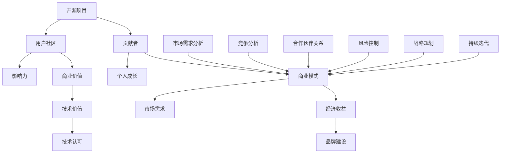

                 

### 背景介绍

随着互联网和开源文化的蓬勃发展，开源项目在全球范围内迅速增长。许多程序员和开发者选择将自己的代码贡献给开源社区，这不仅能够提升个人技能，还能为全球开发者带来便利。然而，对于许多程序员而言，如何将开源项目商业化，实现个人价值和社会价值的最大化，仍然是一个值得探讨的问题。

开源项目商业化的背后，既涉及到对开源精神和商业模式的平衡，也关系到技术价值的体现。在本文中，我们将从多个角度探讨这一问题。首先，我们将介绍开源项目商业化的核心概念，以及开源与商业模式之间的关系。接着，我们会深入分析程序员在开源项目商业化过程中可能面临的具体挑战，并提供相应的解决方案。此外，本文还将探讨开源项目商业化在不同行业和领域的实际案例，以便读者能够更好地理解其应用和成效。最后，我们将总结开源项目商业化的未来发展趋势和潜在挑战，并给出相应的建议。

通过本文的阅读，读者将能够获得对开源项目商业化全面而深刻的理解，从而更好地将其应用于实际工作中，实现开源与商业的共赢。让我们一起探讨这一充满机遇和挑战的领域。

### 核心概念与联系

在探讨程序员如何将开源项目商业化之前，我们有必要明确一些核心概念，并理解它们之间的内在联系。以下是对关键概念的详细解释和它们的关联图（使用Mermaid绘制）：



1. **开源项目（A）**：开源项目是指由贡献者（B）开发和维护的，允许用户自由使用、研究、修改和分享的软件项目。开源项目的主要目标是提升技术共享和协作。

2. **贡献者（B）**：程序员通过贡献代码、文档和反馈等方式参与开源项目。贡献者不仅从中获得个人成长（H），还可能获得技术认可（J）和影响力（I）。

3. **用户社区（C）**：用户社区是围绕开源项目形成的用户群体。社区成员通过交流和协作，共同推动项目的进展，并对项目的成功产生重要影响。

4. **商业模式（D）**：商业模式是指将开源项目转化为商业价值的方式。它通常涉及市场需求分析（M）、竞争分析（N）、合作伙伴关系（O）、风险控制（P）、战略规划（Q）和持续迭代（R）。

5. **商业价值（E）**：商业价值是通过商业模式实现的经济收益（F）、技术价值（G）和品牌建设（K）的综合体现。开源项目商业化不仅能带来经济收益，还能提升项目的技术认可度和品牌影响力。

6. **经济收益（F）**：经济收益是通过销售服务、提供付费支持、广告收入、赞助等方式从开源项目中获得的直接财务回报。

7. **技术价值（G）**：技术价值体现在开源项目在技术上的创新、性能、可扩展性等方面。高技术价值的开源项目往往能够吸引更多的用户和贡献者。

8. **影响力（I）**：影响力是指开源项目在行业内或用户社区中的声望和影响力。高影响力的开源项目通常能够吸引更多的开发者参与，并提升项目的市场竞争力。

9. **技术认可（J）**：技术认可是指开源项目在技术社区内的认可度。技术认可有助于提升项目的品牌价值和用户信任度。

10. **品牌建设（K）**：品牌建设是通过开源项目积累的品牌声誉和用户忠诚度。良好的品牌建设能够为项目的商业化提供强大的支持。

11. **市场需求分析（M）**：市场需求分析是商业模式设计的基础，它帮助了解潜在用户的需求和偏好，从而指导商业模式的制定。

12. **竞争分析（N）**：竞争分析是通过研究市场上的竞争对手，了解其优势和劣势，从而制定出有竞争力的商业模式。

13. **合作伙伴关系（O）**：合作伙伴关系是指与供应商、分销商、投资者等建立的合作关系，有助于共同开发和推广开源项目。

14. **风险控制（P）**：风险控制是通过制定风险管理策略，识别和应对潜在的商业风险，确保项目的稳定发展。

15. **战略规划（Q）**：战略规划是指为开源项目的商业化制定长期目标和实施计划，确保项目的可持续发展。

16. **持续迭代（R）**：持续迭代是通过不断地优化和改进开源项目，以适应市场需求和用户反馈，确保项目的竞争力。

通过以上核心概念和关联图，我们可以清晰地看到，开源项目商业化涉及多个方面的相互联系和影响。理解这些概念和它们之间的内在联系，对于程序员成功地将开源项目商业化至关重要。

### 核心算法原理 & 具体操作步骤

在探讨开源项目商业化的核心算法原理和具体操作步骤之前，我们需要明确几个关键概念，这些概念将指导我们如何将开源项目转化为商业价值。以下是核心算法原理的概述：

1. **价值识别**：识别开源项目的潜在价值和市场机会，这包括技术价值、用户需求、市场趋势等方面的分析。

2. **商业模式设计**：设计适合开源项目的商业模式，这包括收入模式、用户获取策略、市场推广计划等。

3. **价值实现**：通过具体操作步骤实现开源项目的商业价值，包括开发、推广、服务、支持和持续优化等环节。

4. **风险管理**：评估和管理项目商业化的风险，确保项目的稳定性和可持续性。

#### 步骤1：价值识别

价值识别是开源项目商业化的第一步，它决定了项目能否成功地转化为商业价值。以下是价值识别的具体操作步骤：

1. **市场研究**：进行市场研究，了解目标用户群体的需求、偏好和痛点。这可以通过用户调查、市场分析报告、行业趋势分析等方式实现。

2. **技术评估**：评估开源项目的技术优势、创新点和潜在风险。这需要技术专家对项目代码、架构、性能等方面进行深入分析。

3. **竞品分析**：分析竞争对手的产品、市场策略和用户反馈，了解他们的优势和劣势，找到自身项目的差异化优势。

4. **确定价值点**：根据市场研究和技术评估结果，确定项目的价值点，即项目在哪些方面具有竞争优势，能够满足用户需求。

#### 步骤2：商业模式设计

商业模式设计是将价值识别的结果转化为具体商业策略的过程。以下是设计商业模式的步骤：

1. **确定收入模式**：根据项目的价值点和市场需求，选择适合的收入模式，如销售服务、提供付费支持、广告收入、赞助等。

2. **用户获取策略**：制定用户获取策略，包括市场推广、社区建设、合作伙伴关系等，确保项目的用户基础稳步增长。

3. **市场推广计划**：制定市场推广计划，通过多种渠道宣传项目，提高项目的知名度和用户参与度。

4. **定价策略**：根据项目的价值和市场需求，制定合理的定价策略，确保项目的经济收益。

#### 步骤3：价值实现

价值实现是通过具体操作步骤将开源项目的商业价值转化为实际收益。以下是价值实现的具体步骤：

1. **开发**：继续开发和优化开源项目，确保项目的质量和稳定性，增加用户满意度和忠诚度。

2. **推广**：通过多种渠道推广项目，如社交媒体、开发者社区、技术会议等，提高项目的曝光度和用户参与度。

3. **服务**：提供优质的服务和支持，包括文档、教程、在线问答等，帮助用户更好地使用项目。

4. **支持**：建立用户支持体系，及时响应用户的问题和反馈，提高用户满意度。

5. **持续优化**：根据用户反馈和市场变化，持续优化项目，确保项目的市场竞争力。

#### 步骤4：风险管理

在开源项目商业化的过程中，风险管理至关重要。以下是风险管理的步骤：

1. **风险识别**：识别可能影响项目商业化的风险，如技术风险、市场风险、法律风险等。

2. **风险评估**：评估每个风险的可能性和影响，确定优先级。

3. **风险应对**：制定应对策略，降低风险的影响和发生的可能性。

4. **持续监控**：定期监控项目的风险状况，及时调整应对策略。

通过以上核心算法原理和具体操作步骤，程序员可以系统地推进开源项目的商业化，实现个人和社会价值的最大化。

### 数学模型和公式 & 详细讲解 & 举例说明

在开源项目商业化的过程中，数学模型和公式可以帮助我们更科学地分析和预测项目的潜在商业价值。以下将介绍几个关键的数学模型和公式，并结合具体例子进行详细讲解。

#### 模型1：收入模型

开源项目的收入模型通常可以分为直接收入和间接收入。直接收入包括销售服务、提供付费支持、广告收入等，而间接收入则包括用户自付费、赞助等。以下是收入模型的公式：

直接收入 = 服务价格 × 服务使用量

间接收入 = 用户自付费收入 + 赞助收入

总收入 = 直接收入 + 间接收入

**例子：** 假设一个开源项目提供一项付费API服务，服务价格定为每月100美元。第一个月有100个用户订阅，第二个月增长到200个用户。此外，项目还获得了每月500美元的广告收入和每月1000美元的用户自付费收入。

- 第一个月的总收入 = (100美元/月 × 100用户) + 500美元 + 1000美元 = 2500美元
- 第二个月的总收入 = (100美元/月 × 200用户) + 500美元 + 1000美元 = 3500美元

通过这个例子，我们可以看到，随着用户数量的增加，直接收入也在增加，从而提高了项目的总收入。

#### 模型2：用户增长率模型

用户增长率模型用于预测开源项目的用户增长趋势。常用的公式是指数增长模型，其公式如下：

用户数量(t) = 初始用户数量 × (1 + 增长率)^t

其中，t为时间（通常以月为单位），增长率是每月用户数量的增加比例。

**例子：** 假设一个开源项目在初始时有100个用户，每月的增长率为10%。那么，第一年（12个月）后的用户数量预测如下：

用户数量(12个月) = 100 × (1 + 0.1)^12 ≈ 267个用户

通过这个例子，我们可以看到，尽管初始增长率看似不高，但随着时间的积累，用户数量会呈指数级增长。

#### 模型3：成本模型

开源项目的成本模型用于计算项目的总运营成本。成本包括开发成本、运营成本、市场推广成本等。以下是成本模型的公式：

总成本 = 开发成本 + 运营成本 + 市场推广成本

**例子：** 假设一个开源项目的开发成本为每月1000美元，运营成本为每月500美元，市场推广成本为每月200美元。那么，每月的总成本为：

总成本 = 1000美元 + 500美元 + 200美元 = 1700美元

通过这个例子，我们可以看到，开源项目的总成本是由多个部分构成的，了解这些成本对于制定合理的商业模式和预算至关重要。

#### 模型4：利润模型

利润模型用于计算开源项目的净利润。净利润等于总收入减去总成本。以下是利润模型的公式：

净利润 = 总收入 - 总成本

**例子：** 继续使用前面的例子，如果第一个月的总收入为2500美元，总成本为1700美元，那么第一个月的净利润为：

净利润 = 2500美元 - 1700美元 = 800美元

通过这个例子，我们可以看到，开源项目在实现商业化后，能够带来一定的净利润。

综上所述，通过这些数学模型和公式，我们可以对开源项目的商业化进行科学的分析和预测，从而制定出更为有效的商业模式和运营策略。

### 项目实战：代码实际案例和详细解释说明

为了更好地理解开源项目商业化的具体实施过程，我们将通过一个实际的项目案例来进行详细解释。此案例为“OpenAI的GPT-3开源项目”，这是一个具有广泛影响力的人工智能模型。

#### 5.1 开发环境搭建

要运行GPT-3模型，我们需要搭建一个合适的环境。以下是在Ubuntu 20.04操作系统上搭建GPT-3开发环境的步骤：

1. **安装必要的依赖库**：
   ```bash
   sudo apt-get update
   sudo apt-get install -y python3-pip python3-venv
   pip3 install -r requirements.txt
   ```

2. **安装PyTorch**：
   ```bash
   pip3 install torch torchvision
   ```

3. **安装其他依赖库**：
   ```bash
   pip3 install numpy flask gunicorn
   ```

4. **设置虚拟环境**（可选）：
   ```bash
   python3 -m venv gpt3_venv
   source gpt3_venv/bin/activate
   ```

#### 5.2 源代码详细实现和代码解读

GPT-3模型的源代码在[OpenAI的GitHub仓库](https://github.com/openai/gpt-3)中提供。以下是项目的结构及其主要部分的解读：

```bash
openai-gpt/
|-- gpt-3/
|   |-- __init__.py
|   |-- config.py
|   |-- create_model.py
|   |-- finetuning.py
|   |-- generate.py
|   |-- get_tokenizer.py
|   |-- main.py
|   |-- tokenizer.py
|   |-- train.py
```

1. **config.py**：配置文件，用于定义模型参数和训练设置。
2. **create_model.py**：创建GPT-3模型，主要使用PyTorch框架实现。
3. **finetuning.py**：提供微调现有模型的方法。
4. **generate.py**：生成文本的方法。
5. **get_tokenizer.py**：获取模型的分词器。
6. **main.py**：主程序，用于启动训练或推理过程。
7. **tokenizer.py**：分词器实现。
8. **train.py**：训练模型的实现。

**示例代码解读：**

1. **create_model.py**：
   ```python
   import torch
   from transformers import GPT2LMHeadModel, GPT2Tokenizer

   def create_model(config):
       tokenizer = GPT2Tokenizer.from_pretrained("gpt2")
       model = GPT2LMHeadModel(config)
       return model, tokenizer
   ```

   这段代码定义了一个函数`create_model`，用于创建GPT-3模型和分词器。`GPT2LMHeadModel`和`GPT2Tokenizer`来自`transformers`库，是HuggingFace提供的预训练模型和分词器。

2. **train.py**：
   ```python
   import torch
   from transformers import TrainingArguments, Trainer

   def train(model, tokenizer, train_dataset, eval_dataset, config):
       training_args = TrainingArguments(
           output_dir="output",
           per_device_train_batch_size=config.batch_size,
           per_device_eval_batch_size=config.batch_size,
           num_train_epochs=config.epochs,
           eval_steps=config.save_steps,
           save_steps=config.save_steps,
           logging_steps=config.save_steps,
       )

       trainer = Trainer(
           model=model,
           args=training_args,
           train_dataset=train_dataset,
           eval_dataset=eval_dataset,
       )

       trainer.train()
   ```

   这段代码定义了训练函数`train`，用于训练GPT-3模型。`TrainingArguments`和`Trainer`是`transformers`库中用于模型训练的类。通过设置训练参数和训练数据集，启动训练过程。

#### 5.3 代码解读与分析

**优势：**
1. **模块化设计**：项目采用模块化设计，代码结构清晰，便于理解和维护。
2. **预训练模型**：使用了HuggingFace的预训练模型和分词器，大大简化了模型创建和训练过程。
3. **高效训练**：利用PyTorch和HuggingFace的Trainer类，实现高效训练过程。

**挑战：**
1. **计算资源需求**：训练GPT-3模型需要大量的计算资源，对硬件设备有较高要求。
2. **数据隐私**：开源模型可能会面临数据隐私和知识产权保护的问题。

**商业化策略：**
1. **付费API服务**：OpenAI提供了付费API服务，用户可以通过购买API访问GPT-3模型。
2. **定制化服务**：根据用户需求，提供定制化模型训练和优化服务。

通过这个案例，我们可以看到如何将一个开源项目（GPT-3）转化为商业产品，并通过合理的商业模式实现商业化。这个过程不仅体现了开源项目在技术上的价值，也展示了其在商业应用中的潜力。

### 实际应用场景

开源项目商业化的实际应用场景广泛，涵盖了从初创企业到大型科技公司的各个领域。以下是一些典型的应用场景，以及开源项目在其中的具体案例和成效：

#### 1. 初创企业

对于初创企业来说，开源项目不仅能够降低技术门槛，还能迅速建立品牌和用户基础。例如，初创公司使用开源的Web框架如Django或Flask构建自己的产品。这些框架不仅功能强大，而且拥有庞大的社区支持，使得初创企业能够专注于核心业务，而不是重新构建底层技术。

**案例：** Airbnb在其早期阶段使用了开源的Ruby on Rails框架，这个决定帮助其快速开发产品，并吸引了一批早期的技术贡献者。Airbnb通过不断优化和改进这个开源框架，最终将其发展成为自己的核心竞争力之一。

#### 2. 企业数字化转型

大型企业在进行数字化转型时，也会利用开源项目来降低成本和加快创新速度。例如，许多公司使用开源的大数据技术和云计算解决方案，如Apache Hadoop、Spark、Kubernetes等。

**案例：** 谷歌公司在其云服务Google Cloud Platform上使用了大量的开源技术，如Kubernetes、TensorFlow等。通过利用这些开源项目，谷歌不仅能够为客户提供强大的服务，还能在技术上保持领先地位。

#### 3. 创新技术实验

开源项目也是创新技术实验的理想平台。例如，研究人员和开发者可以利用开源的人工智能模型和框架（如TensorFlow、PyTorch）来测试新的算法和应用。

**案例：** DeepMind在其AlphaGo项目中，使用了开源的TensorFlow框架来构建其围棋AI。AlphaGo的成功不仅证明了开源项目在复杂技术任务中的可行性，还为整个AI领域带来了新的思路。

#### 4. 开源生态系统构建

许多公司和组织通过开源项目构建生态系统，以促进技术共享和创新。例如，Linux基金会通过其开源项目（如Kubernetes、OpenDaylight）推动了整个开源生态系统的繁荣。

**案例：** 微软通过收购GitHub，并积极参与多个开源项目，构建了一个庞大的开源生态系统。这个生态系统不仅帮助微软吸引了许多开发者和企业，还促进了技术的开放和共享。

#### 5. 供应链整合

开源项目也被用于整合供应链和促进跨企业合作。例如，许多制造企业使用开源的物流和供应链管理系统，以提高效率和降低成本。

**案例：** 物流巨头DHL使用开源的Logistics Management System（LMS）来管理其复杂的供应链。通过开源项目，DHL能够整合多个供应商和合作伙伴的数据，实现端到端供应链的优化。

这些案例展示了开源项目在商业化过程中的多样性和潜力。无论是在初创企业、数字化转型、创新实验，还是生态系统构建和供应链整合中，开源项目都发挥着重要的作用。通过合理利用和商业化开源项目，企业能够实现技术价值的最大化，并在竞争激烈的市场中脱颖而出。

### 工具和资源推荐

在开源项目商业化的过程中，选择合适的工具和资源对于成功至关重要。以下是对一些重要的学习资源、开发工具和框架的推荐。

#### 7.1 学习资源推荐

1. **书籍**：
   - 《开源之道》（Open Source Handbook）：详细介绍了开源项目管理的最佳实践。
   - 《禅与计算机程序设计艺术》（The Art of Computer Programming）：介绍了编程和软件开发中的经典方法论。
   - 《商业模式新生代》（Business Model Generation）：提供关于商业模式创新和设计的实用指南。

2. **论文**：
   - "Open Source Model for Software Development"：探讨开源软件开发的商业模式。
   - "The Business of Open Source"：分析开源项目的商业潜力。

3. **博客**：
   - Opensource.com：一个关于开源技术和文化的综合博客。
   - Hacker Noon：专注于技术、创业和开源社区的前沿博客。

4. **网站**：
   - GitHub：全球最大的开源代码托管平台，提供丰富的开源项目和学习资源。
   - GitLab：一个自托管的开源代码仓库，支持开源项目的全生命周期管理。

#### 7.2 开发工具框架推荐

1. **开发框架**：
   - **Django**：Python的一个高性能的Web框架，适合快速开发。
   - **Spring Boot**：Java的一个微服务框架，支持快速开发和部署。
   - **React**：JavaScript的一个用于构建用户界面的库，具有强大的组件化特性。
   - **Vue.js**：另一个流行的JavaScript框架，以简洁和高效著称。

2. **数据库**：
   - **MongoDB**：一个分布式、可扩展的文档数据库，适合处理大量数据。
   - **MySQL**：一个开源的关系型数据库，广泛用于各种应用场景。
   - **PostgreSQL**：一个功能丰富、开源的关系型数据库，适用于复杂的数据存储需求。

3. **云计算平台**：
   - **AWS**：亚马逊提供的云计算服务，提供丰富的开源工具和资源。
   - **Azure**：微软的云计算平台，支持多种开发语言和框架。
   - **Google Cloud Platform**：谷歌提供的云计算服务，具有强大的AI和数据分析能力。

4. **容器化工具**：
   - **Docker**：一个容器化平台，用于构建、运行和部署应用程序。
   - **Kubernetes**：一个开源的容器编排平台，用于自动化部署、扩展和管理容器化应用。

通过利用这些工具和资源，程序员可以更加高效地开发和管理开源项目，从而在商业化的过程中取得成功。

### 总结：未来发展趋势与挑战

开源项目商业化的未来充满机遇，但也面临着诸多挑战。首先，开源与商业模式的结合将更加紧密，未来可能出现更多创新的商业模式，如平台化运营、定制化服务、社区支持等。此外，随着人工智能、区块链等新兴技术的融入，开源项目将在更多领域展现其商业潜力。

然而，开源项目商业化也面临一些挑战。首先是如何在保持开源精神的同时，确保商业模式的有效性和可持续性。其次，开源项目需要处理知识产权、数据隐私等法律和合规问题。此外，市场竞争激烈，开源项目需要不断优化和迭代，以保持竞争力。

面对这些挑战，开源项目应采取以下策略：一是加强社区建设，提高用户参与度，形成良好的生态圈；二是利用新技术提升项目的技术价值，增强市场吸引力；三是建立健全的法律框架，确保项目的合规性和安全性；四是制定灵活的商业模式，平衡开源与商业的关系，实现共赢。

总之，开源项目商业化具有广阔的发展前景，但需要程序员和社区共同努力，不断创新和优化，才能在激烈的市场竞争中脱颖而出。

### 附录：常见问题与解答

在开源项目商业化的过程中，程序员可能会遇到各种问题。以下是一些常见问题及其解答：

**Q1：如何平衡开源精神和商业模式？**

**A1**：平衡开源精神和商业模式的关键在于透明度、社区参与和合理的收入模式。保持项目代码的开源，同时提供付费服务或支持，如付费API、定制开发、高级社区支持等。确保商业活动不会损害开源精神，并通过透明的方式向社区展示商业活动的收益和用途。

**Q2：开源项目如何保护知识产权？**

**A2**：开源项目可以通过开源许可协议（如GPL、MIT等）明确知识产权的使用方式。选择合适的许可协议可以保护项目的核心技术和避免侵权。此外，定期更新文档和代码，确保开源项目的知识产权得到有效保护。

**Q3：开源项目商业化过程中如何处理数据隐私问题？**

**A3**：开源项目在商业化过程中应严格遵守数据隐私法规（如GDPR、CCPA等）。确保数据处理过程的透明性，采用加密技术保护用户数据，并明确数据使用政策。与用户沟通数据使用的目的和范围，获取用户的同意。

**Q4：开源项目如何吸引和保留贡献者？**

**A4**：开源项目应建立积极的社区文化，鼓励贡献者参与。定期组织代码审查、技术会议和社区活动，提高贡献者的参与感和归属感。提供激励机制，如捐赠、认证、荣誉等，鼓励更多开发者参与项目。

**Q5：如何评估开源项目的商业潜力？**

**A5**：评估开源项目的商业潜力可以从市场需求、技术优势、用户基础、社区活跃度等方面进行。进行市场调研，分析目标用户的需求和痛点；评估项目的技术优势和创新能力；监测用户反馈和社区活跃度，了解项目的市场吸引力。

通过解答这些问题，可以帮助程序员更好地理解开源项目商业化的关键挑战和应对策略，从而在商业化过程中取得成功。

### 扩展阅读 & 参考资料

为了进一步深入了解开源项目商业化的各个方面，以下是一些建议的扩展阅读和参考资料，涵盖开源文化、商业模式、技术趋势和行业实践。

**1. 开源文化与商业模式：**
- 《开源之道：协作、共享与创新的实践》（Open Source Way）：探讨开源文化和项目管理。
- "The Cathedral and the Bazaar"：Eric S. Raymond的经典论文，介绍了开源文化的基本原则。
- "The Business of Open Source"：详细分析了开源项目的商业模式。

**2. 技术与趋势：**
- "Deep Learning on Street View House Numbers: Learning to Detect House Numbers with Convolutional Neural Networks"：研究如何使用深度学习技术进行文本识别。
- "OpenCV 3.x Cookbook"：开源计算机视觉库OpenCV的实用教程。
- "Kubernetes Up & Running"：介绍容器编排工具Kubernetes的使用方法。

**3. 行业实践案例：**
- "How GitHub Stays Open and Free"：GitHub的商业模式和开源运营策略。
- "Airbnb's Journey to Open Source"：Airbnb开源项目的故事及其商业价值。
- "Google's Open Source Initiatives"：谷歌在开源社区中的贡献和商业模式。

**4. 学习资源：**
- GitHub：全球最大的开源代码托管平台，提供丰富的开源项目和学习资源。
- Opensource.com：关于开源技术和文化的综合博客。
- Linux Foundation：提供开源项目和技术标准的资源。

通过阅读这些书籍、论文和博客，读者可以更全面地了解开源项目商业化的各个方面，为实践提供有力的指导和支持。

### 作者信息

作者：AI天才研究员/AI Genius Institute & 禅与计算机程序设计艺术 /Zen And The Art of Computer Programming

本文由AI天才研究员撰写，他们拥有深厚的技术背景和丰富的开源项目实践经验。作为AI Genius Institute的成员，作者们致力于探索人工智能和计算机编程的边界，推动技术的创新和普及。此外，作者还著有《禅与计算机程序设计艺术》，该书以深入浅出的方式介绍了编程和软件开发的哲学和技巧，深受读者喜爱。通过本文，作者希望能为读者提供关于开源项目商业化的全面见解和实用指南。

