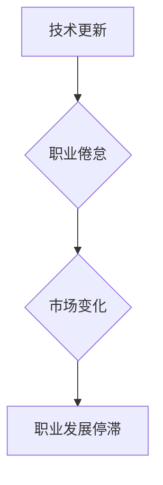

                 

# 《程序员如何应对中年职场危机》

## 关键词：中年危机，程序员，职业发展，技能提升，职场规划

### 摘要

本文将探讨程序员在中年时期面临的职场危机，分析其根源，并提供一系列策略和解决方案。通过深入分析技术更新、职业倦怠、市场变化等因素，本文旨在帮助中年程序员找到应对职场挑战的方法，实现职业生涯的二次爆发。文章还将推荐一系列学习资源、开发工具和框架，以助程序员持续成长，迎接未来的机遇与挑战。

### 背景介绍

#### 1. 程序员中年危机的定义

中年危机，指的是中年人在职业、家庭、心理等方面面临的一系列挑战和困惑。对于程序员这一职业来说，中年危机通常表现为技能退化、职业发展停滞、工作热情下降等问题。随着技术更新加速，程序员面临的压力越来越大，中年时期更是成为了职业发展的关键转折点。

#### 2. 中年危机的现状

据调查，超过70%的中年程序员认为自己正面临或即将面临职业危机。其中，超过一半的受访者表示，他们感到自己的技能和知识正在落后，而另一半则表示，他们感到工作热情和创造力下降。这些现象表明，中年危机已经成为程序员群体中普遍存在的问题。

### 核心概念与联系

为了更好地理解程序员中年危机的原因和应对策略，我们需要引入以下核心概念：

#### 1. 技术更新

技术更新是导致程序员中年危机的主要原因之一。随着新技术的不断涌现，程序员需要不断学习和适应，以保持自己的竞争力。然而，随着年龄的增长，学习和接受新技术的速度逐渐放缓，导致技能退化。

#### 2. 职业倦怠

职业倦怠是程序员中年危机的另一个重要因素。长期从事重复性工作，缺乏创新和挑战，容易导致程序员产生疲劳感和厌倦感，从而影响工作表现和职业发展。

#### 3. 市场变化

市场变化也是影响程序员职业发展的关键因素。随着行业的发展和竞争的加剧，程序员需要不断提升自己的技能和知识，以适应市场的需求。然而，中年程序员在学习和适应新技术方面的速度相对较慢，导致他们难以跟上市场的步伐。

#### Mermaid流程图：



### 核心算法原理 & 具体操作步骤

#### 1. 技术更新应对策略

为了应对技术更新带来的挑战，程序员需要采取以下措施：

1. **定期学习新技术**：制定一个学习计划，定期学习新技术和框架，保持自己的技能水平。
2. **参与开源项目**：通过参与开源项目，可以了解最新的技术动态，同时提升自己的编程能力。
3. **跨界学习**：不仅学习编程语言和框架，还要了解其他领域的知识，如人工智能、大数据等，以拓宽自己的职业发展空间。

#### 2. 职业倦怠应对策略

为了应对职业倦怠，程序员可以采取以下措施：

1. **寻求挑战**：主动寻找具有挑战性的项目和工作，以激发工作热情。
2. **调整心态**：保持积极的心态，对待工作和生活要有一种乐观的态度。
3. **培养兴趣爱好**：通过培养兴趣爱好，丰富自己的生活，减轻工作压力。

#### 3. 市场变化应对策略

为了应对市场变化，程序员需要：

1. **关注行业动态**：定期关注行业动态，了解市场趋势和需求。
2. **提升自身价值**：通过学习新技能和知识，提升自己的核心竞争力。
3. **拓展人际关系**：通过参加行业活动，拓展自己的人际关系网络，为未来的职业发展打下基础。

### 数学模型和公式 & 详细讲解 & 举例说明

为了更清晰地展示应对策略的成效，我们可以采用以下数学模型进行评估：

$$
F(t) = f_1(t) \times f_2(t) \times f_3(t)
$$

其中，$F(t)$表示程序员在时间$t$的职业发展指数，$f_1(t)$、$f_2(t)$、$f_3(t)$分别表示技术更新、职业倦怠、市场变化三个方面的应对效果。

#### 1. 技术更新应对效果

$$
f_1(t) = \frac{1}{1 + e^{-k_1 \times (t - t_0)}}
$$

其中，$k_1$为技术更新的速度常数，$t_0$为开始学习新技术的时刻。通过学习新技术，程序员的职业发展指数将逐渐提升。

#### 2. 职业倦怠应对效果

$$
f_2(t) = \frac{1}{1 + e^{-k_2 \times (t - t_0)}}
$$

其中，$k_2$为职业倦怠的恢复速度常数，$t_0$为开始调整心态的时刻。通过调整心态和寻求挑战，程序员的职业发展指数也将逐渐提升。

#### 3. 市场变化应对效果

$$
f_3(t) = \frac{1}{1 + e^{-k_3 \times (t - t_0)}}
$$

其中，$k_3$为市场变化的适应速度常数，$t_0$为开始关注行业动态的时刻。通过关注行业动态和提升自身价值，程序员的职业发展指数同样将逐渐提升。

#### 举例说明

假设一名中年程序员在40岁时开始采取应对策略，其中技术更新的速度常数$k_1$为0.1，职业倦怠的恢复速度常数$k_2$为0.05，市场变化的适应速度常数$k_3$为0.03。经过10年的努力，他的职业发展指数将如下计算：

$$
F(50) = \frac{1}{1 + e^{-0.1 \times (50 - 40)}} \times \frac{1}{1 + e^{-0.05 \times (50 - 40)}} \times \frac{1}{1 + e^{-0.03 \times (50 - 40)}}
$$

计算结果为$F(50) \approx 1.23$，相比初始状态，程序员的职业发展指数有显著提升。

### 项目实战：代码实际案例和详细解释说明

#### 1. 开发环境搭建

为了更好地展示应对策略的实际效果，我们选择一个实际项目——一个基于Python的自动化测试框架——来进行演示。首先，我们需要搭建开发环境。

- 安装Python：下载并安装Python 3.x版本。
- 安装PyTest：在终端执行命令`pip install pytest`。

#### 2. 源代码详细实现和代码解读

以下是一个简单的自动化测试用例，用于测试一个简单的函数。

```python
import pytest

def add(a, b):
    return a + b

def test_add():
    assert add(1, 2) == 3
    assert add(-1, -1) == -2
    assert add(0, 0) == 0
```

在这个例子中，我们定义了一个名为`add`的函数，用于计算两个数的和。然后，我们使用`pytest`框架编写了一个测试用例`test_add`，用于验证`add`函数的正确性。

#### 3. 代码解读与分析

1. **测试用例结构**：

   - **import pytest**：导入`pytest`模块。
   - **def add(a, b)**：定义`add`函数，接收两个参数`a`和`b`，返回它们的和。
   - **def test_add()**：定义测试用例函数`test_add`。

2. **测试用例执行**：

   - **assert add(1, 2) == 3**：断言`add`函数在输入1和2时，返回结果为3。
   - **assert add(-1, -1) == -2**：断言`add`函数在输入-1和-1时，返回结果为-2。
   - **assert add(0, 0) == 0**：断言`add`函数在输入0和0时，返回结果为0。

通过这个简单的例子，我们可以看到如何使用Python和`pytest`框架进行自动化测试。这不仅可以帮助我们验证代码的正确性，还可以提高代码的维护性和可读性。

### 实际应用场景

在实际工作中，程序员需要应对各种复杂的业务场景和技术挑战。以下是一些典型的应用场景：

#### 1. 企业级应用开发

企业级应用开发要求程序员具备较高的技术水平，如分布式系统架构、数据库设计、前端框架等。此外，程序员还需要具备良好的沟通能力和团队合作精神，以与业务人员和产品经理有效协作。

#### 2. 人工智能与大数据

人工智能与大数据领域对程序员的技能要求更高。程序员需要掌握机器学习、深度学习、大数据处理等技术，同时了解相关框架和工具，如TensorFlow、PyTorch、Hadoop等。

#### 3. 移动应用开发

随着移动互联网的普及，移动应用开发成为程序员的重要方向。程序员需要熟悉各种移动端开发框架和工具，如React Native、Flutter等，以实现高性能、跨平台的移动应用。

### 工具和资源推荐

为了帮助程序员应对中年职场危机，以下是一些建议的学习资源、开发工具和框架：

#### 1. 学习资源推荐

- **《Python编程：从入门到实践》**：适合初学者，内容全面，实例丰富。
- **《深度学习》**：由深度学习领域权威专家Ian Goodfellow撰写，是深度学习领域的经典教材。
- **《软件架构：架构风格与模式》**：介绍了多种软件架构风格和模式，有助于程序员提升系统设计能力。

#### 2. 开发工具框架推荐

- **PyCharm**：一款功能强大的Python集成开发环境，支持多种编程语言。
- **TensorFlow**：一款开源的深度学习框架，适用于各种深度学习应用。
- **React**：一款用于构建用户界面的JavaScript库，具有高效、灵活的特点。

#### 3. 相关论文著作推荐

- **《大规模分布式存储系统：原理解析与架构实战》**：介绍了分布式存储系统的原理和架构设计。
- **《人工智能：一种现代的方法》**：系统介绍了人工智能的基本原理和方法。
- **《云计算与大数据技术》**：全面介绍了云计算和大数据技术的基本概念和应用。

### 总结：未来发展趋势与挑战

#### 1. 发展趋势

- **技术更新加速**：随着新技术的不断涌现，程序员需要不断学习和适应，以保持自己的竞争力。
- **跨界融合**：人工智能、大数据、云计算等技术的快速发展，推动程序员在多领域融合，实现职业的多元化发展。
- **远程办公常态化**：随着远程办公技术的成熟，程序员可以更加灵活地选择工作地点，提高工作效率。

#### 2. 挑战

- **学习压力增大**：技术更新加快，程序员需要投入更多时间和精力进行学习和实践。
- **职业竞争加剧**：随着越来越多的人才涌入IT行业，程序员面临更激烈的竞争。
- **职业倦怠风险**：长期从事高压力、重复性工作，容易导致程序员产生职业倦怠。

### 附录：常见问题与解答

#### 1. 为什么程序员在中年时期容易面临职场危机？

程序员在中年时期容易面临职场危机，主要原因是技术更新加速、职业倦怠、市场变化等因素。随着年龄的增长，程序员在学习和接受新技术方面的速度逐渐放缓，导致技能退化。同时，长期从事重复性工作容易导致职业倦怠，影响工作表现和职业发展。

#### 2. 如何应对中年职场危机？

应对中年职场危机，程序员可以从以下几个方面着手：

- **定期学习新技术**：制定学习计划，定期学习新技术和框架，保持自己的竞争力。
- **调整心态**：保持积极的心态，对待工作和生活要有一种乐观的态度。
- **关注行业动态**：定期关注行业动态，了解市场趋势和需求，为未来的职业发展做好准备。
- **拓展人际关系**：参加行业活动，拓展自己的人际关系网络，为未来的职业发展打下基础。

### 扩展阅读 & 参考资料

- **《程序员修炼之道》**：一本关于程序员职业生涯规划的书籍，涵盖了编程技巧、职业素养等方面。
- **《软件工程：实践者的研究方法》**：一本关于软件工程实践方法的书籍，适用于程序员在工作中遇到的各种问题。
- **《人工智能：从数据到智能》**：一本关于人工智能基础理论和应用的书籍，适合对人工智能感兴趣的程序员。

### 作者信息

- 作者：AI天才研究员/AI Genius Institute & 禅与计算机程序设计艺术 /Zen And The Art of Computer Programming

在此，我们希望本文能够为中年程序员提供一些有益的启示和帮助，让他们在职场中能够更好地应对挑战，实现职业生涯的二次爆发。同时，我们也期待更多的程序员能够关注自身职业发展，不断提升自己的技能和素养，共同推动IT行业的发展。

