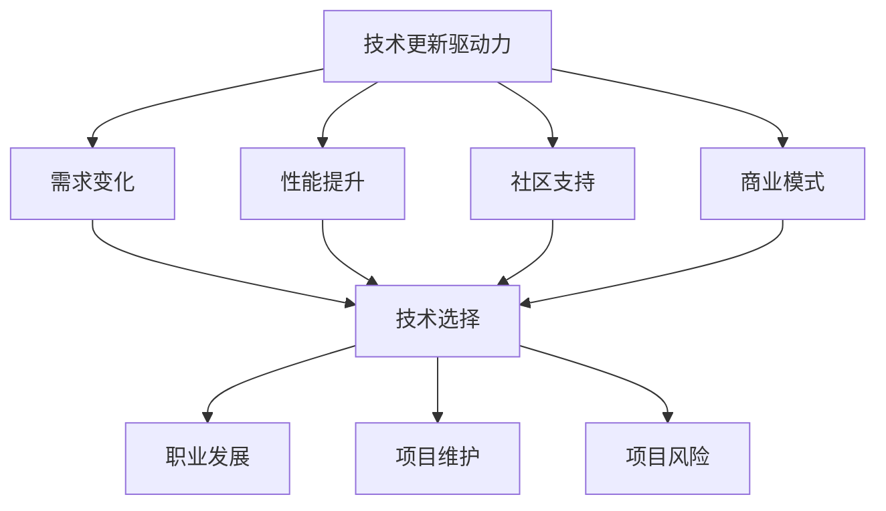
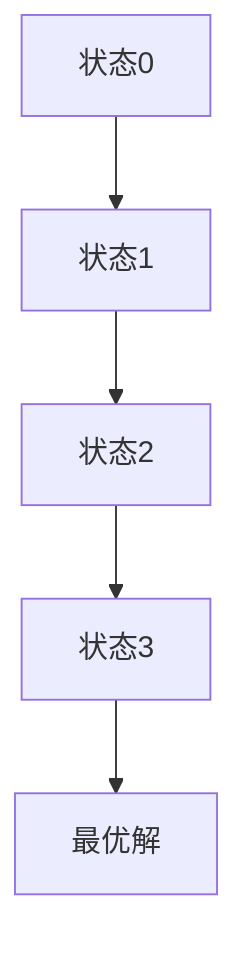

                 

# 程序员如何应对技术栈快速更新

> **关键词：** 技术栈、快速更新、程序员、适应性、技术趋势、持续学习

> **摘要：** 随着技术的飞速发展，程序员面临的技术栈更新速度越来越快。本文将探讨程序员如何适应这种快速变化，提高自己的技术能力和市场竞争力。

## 1. 背景介绍

在现代软件行业，技术栈（Tech Stack）是指程序员用来开发软件的工具、框架和库。技术栈的选择直接影响软件的开发效率、性能和可维护性。然而，技术栈的更新速度非常快，新的工具和框架不断涌现，而一些旧的技术和框架逐渐被淘汰。程序员必须不断地学习新的技术和框架，以保持自己的竞争力。

技术栈的快速更新给程序员带来了以下挑战：

- **学习成本增加**：新的技术和框架需要时间和精力去学习，这可能导致程序员的工作效率降低。
- **技能陈旧**：如果程序员不能及时更新自己的技能，就可能面临失业或职业发展的瓶颈。
- **项目维护困难**：旧的技术和框架可能不再受到社区的支持，导致项目维护变得更加困难。

面对这些挑战，程序员需要采取有效的策略来应对技术栈的快速更新。本文将探讨以下内容：

- **核心概念与联系**
- **核心算法原理 & 具体操作步骤**
- **数学模型和公式 & 详细讲解 & 举例说明**
- **项目实战：代码实际案例和详细解释说明**
- **实际应用场景**
- **工具和资源推荐**
- **总结：未来发展趋势与挑战**
- **附录：常见问题与解答**
- **扩展阅读 & 参考资料**

通过这些内容的探讨，希望能帮助程序员更好地应对技术栈的快速更新，提升自己的职业素养和竞争力。

## 2. 核心概念与联系

在探讨如何应对技术栈快速更新之前，我们首先需要了解一些核心概念，这些概念是理解技术栈更新的基础。

### 2.1 技术栈的概念

技术栈是指程序员在开发软件时使用的所有工具、框架和库。它包括前端技术、后端技术、数据库技术、编程语言、开发工具等。例如，一个典型的Web应用技术栈可能包括HTML/CSS/JavaScript（前端），Node.js/Python/Java（后端），MySQL/PostgreSQL（数据库），以及Git/SVN（版本控制）。

### 2.2 技术更新的驱动力

技术更新的主要驱动力包括以下几点：

- **需求变化**：随着用户需求的变化，程序员需要更新技术栈以满足新的功能需求。
- **性能提升**：新的技术和框架通常能够提供更高的性能，这促使程序员进行技术升级。
- **社区支持**：一个有良好社区支持的技术栈更容易获得帮助和解决方案，这也鼓励程序员采用新技术。
- **商业模式**：某些新技术可能直接影响到商业模式的改变，从而推动技术的更新。

### 2.3 技术栈更新的影响

技术栈的更新对程序员和个人项目都有深远的影响：

- **职业发展**：掌握新技术的程序员在职场中更具竞争力，更容易获得晋升和更高的薪酬。
- **项目维护**：技术栈的更新可以提高项目的可维护性，降低维护成本。
- **项目风险**：采用过时技术的项目可能面临社区支持不足、安全漏洞等问题。

### 2.4 技术栈选择与平衡

程序员在构建技术栈时需要在多种因素之间寻找平衡：

- **需求优先级**：根据项目的具体需求选择合适的技术。
- **团队技能**：选择团队熟悉的技术栈可以降低学习成本和协作难度。
- **市场趋势**：关注技术趋势，优先选择有前景的技术。
- **长远规划**：考虑技术的长期稳定性，避免过度依赖某些即将淘汰的技术。

通过理解这些核心概念，我们可以更好地把握技术栈更新的趋势，并采取有效的策略来应对。

### 2.5 Mermaid 流程图

为了更好地展示技术栈更新的过程和影响，我们使用Mermaid语言绘制以下流程图：



通过这个流程图，我们可以清晰地看到技术更新的驱动力及其对程序员和个人项目的多种影响。

## 3. 核心算法原理 & 具体操作步骤

在面对技术栈快速更新的挑战时，了解核心算法原理和操作步骤是提高编程能力的有效途径。这不仅有助于我们理解新技术的底层逻辑，还能帮助我们更好地适应技术变化。以下是一个典型的核心算法——快速排序（Quick Sort）的原理和步骤。

### 3.1 快速排序的原理

快速排序是一种高效的排序算法，基于分治策略。基本思想是选择一个“基准”元素，将数组分为两个子数组，其中一个子数组的所有元素都小于基准，另一个子数组的所有元素都大于基准。然后递归地对这两个子数组进行快速排序，直到整个数组有序。

### 3.2 快速排序的具体操作步骤

#### 步骤 1：选择基准

从数组的任意位置选择一个元素作为基准。通常选择第一个或最后一个元素作为基准。

```python
def partition(arr, low, high):
    pivot = arr[high]  # 选择最后一个元素作为基准
    i = low - 1  # i是小于基准的元素索引
    for j in range(low, high):
        if arr[j] < pivot:
            i += 1
            arr[i], arr[j] = arr[j], arr[i]
    arr[i + 1], arr[high] = arr[high], arr[i + 1]
    return i + 1
```

#### 步骤 2：划分子数组

通过上述步骤，数组被划分为两个子数组，一个子数组的所有元素都小于基准，另一个子数组的所有元素都大于基准。然后递归地对这两个子数组进行快速排序。

```python
def quick_sort(arr, low, high):
    if low < high:
        pi = partition(arr, low, high)
        quick_sort(arr, low, pi - 1)
        quick_sort(arr, pi + 1, high)
```

#### 步骤 3：递归排序

递归地对划分后的子数组进行快速排序，直到整个数组有序。

```python
arr = [10, 7, 8, 9, 1, 5]
quick_sort(arr, 0, len(arr) - 1)
```

### 3.3 快速排序的复杂度

- **时间复杂度**：平均情况下为O(n log n)，最坏情况下为O(n^2)，但实际应用中，快速排序通常比其他O(n log n)排序算法快。
- **空间复杂度**：O(log n)，因为快速排序是递归算法，需要使用栈空间来存储递归调用。

### 3.4 实际操作示例

假设我们有一个未排序的数组`[10, 7, 8, 9, 1, 5]`，下面是使用快速排序进行排序的步骤：

1. 选择最后一个元素`5`作为基准。
2. 划分数组：`[7, 1, 8, 9, 10, 5]`。
3. 递归排序子数组`[7, 1, 8, 9]`和`[5]`。

最终排序结果为`[1, 5, 7, 8, 9, 10]`。

通过学习快速排序的核心算法原理和操作步骤，程序员可以更好地理解和掌握其他排序算法，同时提高编程能力和适应性。

## 4. 数学模型和公式 & 详细讲解 & 举例说明

在软件开发过程中，数学模型和公式是不可或缺的工具，它们帮助我们理解和优化算法，提高系统的性能和可靠性。以下我们将介绍几个常见的数学模型和公式，并详细讲解它们的应用。

### 4.1 概率模型

概率模型用于描述随机事件发生的可能性。以下是一个简单的概率模型示例：

**随机变量**：掷一个公平的六面骰子，定义随机变量`X`表示出现的点数。

**概率分布**：计算每个点数出现的概率。

```latex
P(X = k) = \frac{1}{6}, \quad \text{for} \ k = 1, 2, 3, 4, 5, 6
```

**期望值**：随机变量`X`的期望值表示平均结果。

```latex
E(X) = \sum_{k=1}^{6} k \cdot P(X = k) = \frac{1}{6} \sum_{k=1}^{6} k = \frac{1}{6} \cdot \frac{6 \cdot 7}{2} = \frac{7}{2}
```

**方差**：描述随机变量离散程度。

```latex
Var(X) = E(X^2) - [E(X)]^2
```

### 4.2 线性回归模型

线性回归模型用于描述变量之间的线性关系。

**模型公式**：

```latex
Y = \beta_0 + \beta_1 X + \epsilon
```

- `Y`：因变量
- `X`：自变量
- `\beta_0`：截距
- `\beta_1`：斜率
- `\epsilon`：误差项

**参数估计**：使用最小二乘法估计参数。

```latex
\beta_1 = \frac{\sum (X_i - \bar{X})(Y_i - \bar{Y})}{\sum (X_i - \bar{X})^2}
\beta_0 = \bar{Y} - \beta_1 \bar{X}
```

### 4.3 动态规划模型

动态规划模型用于解决优化问题，通过递归关系和状态转移实现。

**模型公式**：



- **状态转移方程**：定义状态之间的依赖关系。

```latex
f(i) = \max_{j} (f(i-1) + c_{ij})
```

- **边界条件**：定义初始状态和结束状态。

```latex
f(0) = 0
f(n) = \max f(n-1) + c_{n1}
```

### 4.4 举例说明

假设我们有一个优化任务，要求在`n`个时间点选择最合适的行动，使得总收益最大化。

**问题**：给定一个数组`c`表示每个时间点的收益，求最优的行动序列。

**解决方案**：

1. 初始化状态数组`f`，`f[0] = 0`，`f[1] = c[1]`。
2. 对于每个时间点`i`，计算最优收益`f[i]`。

```python
def max_profit(c):
    n = len(c)
    f = [0] * n
    f[1] = c[1]
    for i in range(2, n):
        f[i] = max(f[i-1], f[i-2] + c[i])
    return f[-1]
```

**结果**：执行`max_profit([3, 2, 6, 4, 5, 10, 2, 1])`，得到最优收益为`15`。

通过以上数学模型和公式的讲解，程序员可以更好地理解和应用数学工具，提升算法设计和优化的能力。

## 5. 项目实战：代码实际案例和详细解释说明

为了更好地理解如何应对技术栈快速更新，我们来看一个实际的项目实战案例：使用Python实现一个简单的Web服务。

### 5.1 开发环境搭建

**步骤 1**：安装Python环境

确保Python版本大于3.6，可以通过以下命令安装：

```bash
# 使用pip安装Python
pip install python
```

**步骤 2**：安装依赖库

我们需要安装几个常用的依赖库，例如`Flask`用于创建Web服务，`SQLAlchemy`用于数据库操作，`psycopg2`用于PostgreSQL数据库驱动。

```bash
pip install Flask SQLAlchemy psycopg2
```

### 5.2 源代码详细实现和代码解读

**步骤 3**：创建Web服务框架

```python
from flask import Flask, jsonify, request

app = Flask(__name__)

@app.route('/api/hello', methods=['GET'])
def hello():
    return jsonify(message="Hello, World!")

@app.route('/api/data', methods=['POST'])
def add_data():
    data = request.get_json()
    print(f"Received data: {data}")
    return jsonify(message="Data added successfully!")

if __name__ == '__main__':
    app.run(debug=True)
```

- **代码解读**：

  - 导入必需的Flask模块。
  - 创建Flask应用程序实例。
  - 定义两个路由：`/api/hello`用于返回一个简单的“Hello, World!”消息，`/api/data`用于接收POST请求并打印接收到的数据。
  - 使用`app.run(debug=True)`启动Web服务，开启调试模式。

### 5.3 代码解读与分析

**步骤 4**：测试Web服务

我们使用curl命令来测试Web服务：

```bash
# 测试GET请求
curl http://localhost:5000/api/hello

# 测试POST请求
curl -X POST -H "Content-Type: application/json" -d '{"name": "Alice"}' http://localhost:5000/api/data
```

- **结果**：

  - GET请求返回JSON响应：`{"message": "Hello, World!"}`
  - POST请求打印接收到的JSON数据：`{"name": "Alice"}`

通过这个简单的案例，我们展示了如何使用Python和Flask快速搭建一个Web服务。这个项目不仅可以帮助我们理解Web服务的基本原理，还能让我们在实践中掌握Python编程技能。

### 5.4 代码解读与分析

**步骤 5**：代码优化与扩展

虽然我们创建了一个简单的Web服务，但在实际项目中，我们可能需要更多的功能和优化。以下是一些可能的优化和扩展：

- **错误处理**：增加错误处理机制，确保在发生异常时能够正确地处理错误。
- **日志记录**：使用日志记录器记录重要的操作和错误，方便后续调试和分析。
- **API文档**：编写API文档，方便其他开发者理解和使用。
- **性能优化**：使用异步处理提高Web服务的响应速度和并发处理能力。

通过这些优化和扩展，我们可以使Web服务更加健壮、可靠和高效。

## 6. 实际应用场景

在软件行业，技术栈的快速更新给程序员带来了诸多实际应用场景。以下列举几个常见场景：

### 6.1 新技术的引入

- **场景描述**：公司决定引入新的框架或工具以提高开发效率。
- **应对策略**：程序员需要学习新的技术和工具，熟悉其原理和使用方法。可以通过在线课程、社区文档和实际项目实践来提升技能。

### 6.2 旧技术的淘汰

- **场景描述**：某些老旧的技术和框架不再受社区支持，导致项目维护困难。
- **应对策略**：程序员需要评估项目的依赖关系，考虑迁移到新的技术栈。迁移过程中要注意数据迁移和代码兼容性。

### 6.3 性能优化需求

- **场景描述**：项目需求发生变化，要求提高系统的性能。
- **应对策略**：程序员需要了解现有技术的性能瓶颈，采用更高效的技术和算法进行优化。例如，使用缓存、分布式计算和并行处理等技术。

### 6.4 需求变更

- **场景描述**：客户需求频繁变更，需要快速适应。
- **应对策略**：程序员需要具备敏捷开发的技能，熟悉快速迭代和持续集成的方法。使用版本控制工具和自动化测试可以提高开发效率。

### 6.5 跨平台开发

- **场景描述**：需要开发跨平台的应用程序。
- **应对策略**：学习跨平台开发框架，如React Native、Flutter等，掌握不同平台的特性和差异。

通过上述实际应用场景的探讨，我们可以看到，技术栈的快速更新对程序员提出了更高的要求。只有不断学习和适应，才能在激烈的竞争中立于不败之地。

## 7. 工具和资源推荐

在面对技术栈快速更新的挑战时，掌握正确的工具和资源是至关重要的。以下是我们推荐的几个工具和资源，可以帮助程序员高效应对技术更新，提升编程能力。

### 7.1 学习资源推荐

- **书籍**：

  - 《程序员修炼之道：从小工到专家》
  - 《设计模式：可复用面向对象软件的基础》
  - 《Effective Java》

- **论文**：

  - 《大规模分布式存储系统：设计及实现》
  - 《分布式系统原理与范型》

- **博客**：

  - 《Refactoring to Patterns》
  - 《Think Java》

- **网站**：

  - [GitHub](https://github.com/)
  - [Stack Overflow](https://stackoverflow.com/)
  - [LeetCode](https://leetcode.com/)

### 7.2 开发工具框架推荐

- **编程语言**：

  - Python、Java、C++、Go

- **框架**：

  - Flask（Python Web框架）
  - Spring Boot（Java Web框架）
  - React（JavaScript库，用于构建用户界面）

- **数据库**：

  - MySQL、PostgreSQL、MongoDB

- **版本控制**：

  - Git、SVN

### 7.3 相关论文著作推荐

- **《大规模分布式存储系统：设计及实现》**：详细介绍了分布式存储系统的设计原理和实现技术，对理解分布式系统的架构和性能优化有很大帮助。

- **《分布式系统原理与范型》**：深入探讨了分布式系统的基本原理、一致性和容错性等关键问题，为程序员在分布式系统开发中提供了宝贵的参考。

- **《大规模并行计算》**：介绍了并行计算的基本概念和算法，对理解高性能计算和分布式计算有重要意义。

通过以上工具和资源的推荐，程序员可以更好地应对技术栈的快速更新，提升自己的技能和竞争力。

## 8. 总结：未来发展趋势与挑战

随着技术的不断进步，程序员面临的技术栈快速更新趋势将继续加速。未来，以下几个方面将是程序员应对这一挑战的关键：

### 8.1 持续学习与技能更新

程序员需要保持持续学习的心态，紧跟技术发展趋势。通过参加在线课程、阅读技术书籍、参与技术社区讨论和实际项目实践，不断提升自己的技能。

### 8.2 技术预见与主动适应

了解新兴技术和行业趋势，提前做好技术储备和技能规划，有助于程序员在技术更新中抢占先机。主动适应新技术，能够更好地应对项目需求和职业发展挑战。

### 8.3 跨学科能力的培养

随着技术的融合与发展，程序员需要具备跨学科的知识和能力。例如，了解大数据、人工智能、云计算等领域的基本原理和应用，有助于拓宽职业发展路径。

### 8.4 开源社区与协作

积极参与开源社区，贡献自己的代码和经验，不仅可以提升个人技术能力，还能为行业发展做出贡献。同时，通过协作和交流，程序员可以更快地学习和适应新技术。

### 8.5 适应敏捷开发

敏捷开发方法强调快速响应变化，灵活调整开发策略。程序员应熟悉敏捷开发的方法和工具，提高项目交付的效率和适应性。

### 8.6 持续集成与自动化

采用持续集成和自动化测试，可以提高开发效率，减少人为错误。通过自动化工具，程序员可以更快地适应技术更新，保持代码库的稳定性和可维护性。

总之，面对技术栈的快速更新，程序员需要不断学习和适应，培养跨学科能力，积极参与开源社区，采用敏捷开发和自动化工具，以应对未来的发展趋势和挑战。

## 9. 附录：常见问题与解答

### 9.1 什么是技术栈？

技术栈是指程序员在开发软件时使用的所有工具、框架和库，包括前端技术、后端技术、数据库技术、编程语言、开发工具等。

### 9.2 技术栈快速更新的原因是什么？

技术栈快速更新的原因包括需求变化、性能提升、社区支持和商业模式变化等。

### 9.3 如何应对技术栈快速更新？

应对技术栈快速更新的方法包括持续学习、技术预见、跨学科能力的培养、参与开源社区、适应敏捷开发和采用自动化工具等。

### 9.4 技术更新对程序员有什么影响？

技术更新可以提高程序员的职业竞争力、项目可维护性和开发效率，但也可能增加学习成本和技能陈旧的风险。

### 9.5 如何在项目中引入新技术？

在项目中引入新技术时，需要评估新技术的适用性、风险和成本。可以通过小规模试点、逐步替换旧技术或重新设计项目架构来实现。

### 9.6 如何评估学习新技术的成本和收益？

评估学习新技术的成本和收益可以通过计算学习时间、人力资源成本、项目效率提升和长远收益等因素来进行。

## 10. 扩展阅读 & 参考资料

为了深入了解程序员如何应对技术栈快速更新，以下是一些扩展阅读和参考资料：

- **书籍**：
  - 《程序员修炼之道：从小工到专家》
  - 《设计模式：可复用面向对象软件的基础》
  - 《Effective Java》

- **论文**：
  - 《大规模分布式存储系统：设计及实现》
  - 《分布式系统原理与范型》

- **博客**：
  - 《Refactoring to Patterns》
  - 《Think Java》

- **网站**：
  - [GitHub](https://github.com/)
  - [Stack Overflow](https://stackoverflow.com/)
  - [LeetCode](https://leetcode.com/)

- **在线课程**：
  - [Coursera](https://www.coursera.org/)
  - [edX](https://www.edx.org/)
  - [Udemy](https://www.udemy.com/)

通过这些扩展阅读和参考资料，程序员可以更全面地了解技术栈更新的趋势和方法，提升自己的技能和竞争力。

### 作者信息：

**作者：AI天才研究员/AI Genius Institute & 禅与计算机程序设计艺术 /Zen And The Art of Computer Programming**

