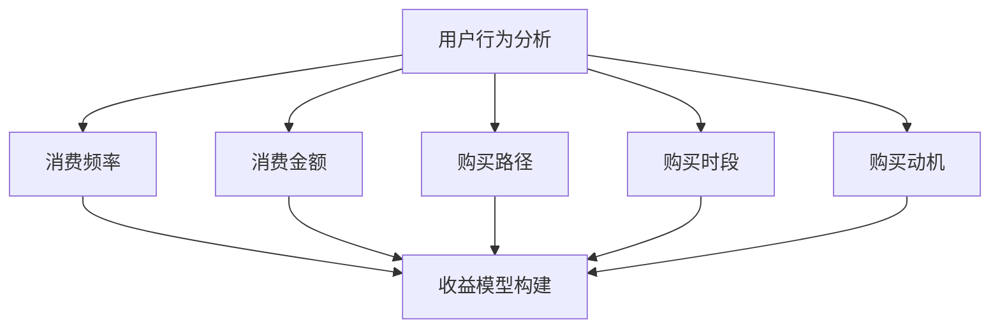

                 

# {文章标题}

## 程序员如何设计知识付费的优惠券策略

> **关键词：** 知识付费、优惠券策略、程序员、用户行为、收益最大化

> **摘要：** 本文将探讨程序员如何设计和优化知识付费平台的优惠券策略。通过分析用户行为和收益模型，本文将提出一系列实用的优惠券策略，帮助程序员提高用户粘性和平台收益。

在当今数字化时代，知识付费已成为一种重要的商业模式。程序员作为知识付费的主要消费者和提供者，如何设计和优化优惠券策略，以提高用户参与度和平台收益，成为了一个值得探讨的问题。本文将围绕这一主题，从用户行为分析和收益模型构建两个方面，系统地介绍如何设计知识付费的优惠券策略。

## 1. 背景介绍

知识付费是指用户通过付费获取知识或服务的一种商业模式。随着互联网的普及，知识付费平台如雨后春笋般涌现。然而，如何吸引并留住用户，提高平台收益，成为各大知识付费平台面临的共同挑战。优惠券策略作为一种常用的促销手段，通过给予用户一定的优惠，激发用户的购买欲望，从而提高用户粘性和平台收益。

程序员作为知识付费的主要消费者，具有独特的消费习惯和需求。一方面，程序员具有强烈的求知欲望，愿意为高质量的知识和服务付费；另一方面，程序员在消费过程中，更加注重性价比和优惠力度。因此，针对程序员的优惠券策略设计，需要充分考虑其消费习惯和需求特点。

## 2. 核心概念与联系

### 2.1 用户行为分析

用户行为分析是设计优惠券策略的基础。通过对用户行为的分析，可以了解用户的消费习惯、需求偏好和购买决策因素。以下是几个关键的用户行为指标：

1. **消费频率**：用户在一定时间内购买的次数。
2. **消费金额**：用户在一定时间内的消费总额。
3. **购买路径**：用户从浏览到购买的整个过程。
4. **购买时段**：用户购买知识产品的时间段。
5. **购买动机**：用户购买知识产品的原因。

### 2.2 收益模型构建

收益模型是评估优惠券策略效果的重要工具。通过构建收益模型，可以分析不同优惠券策略对平台收益的影响。以下是几个关键的收益指标：

1. **销售额**：平台在一定时间内的销售总额。
2. **利润率**：平台从销售额中获得的利润比例。
3. **用户留存率**：在一定时间内，用户继续使用平台的比例。
4. **用户活跃度**：用户在一定时间内的互动和参与度。

### 2.3 优惠券类型

根据不同的优惠方式和目的，优惠券可以分为以下几类：

1. **满减优惠券**：用户购买金额达到一定额度，即可减免一定金额。
2. **折扣优惠券**：用户购买知识产品时，享受一定比例的折扣。
3. **新人优惠券**：针对新用户的特别优惠，鼓励其进行首次购买。
4. **长期优惠券**：针对老用户的持续优惠，增强用户忠诚度。
5. **限时优惠券**：在特定时间段内发放的优惠券，激发用户即时购买。

## 3. 核心算法原理 & 具体操作步骤

### 3.1 用户行为分析算法

用户行为分析算法主要用于提取和整理用户行为数据，为优惠券策略设计提供依据。以下是具体操作步骤：

1. **数据采集**：从平台日志中提取用户行为数据，如浏览记录、购买记录、评论等。
2. **数据清洗**：去除重复、缺失和不完整的数据，确保数据质量。
3. **特征提取**：将用户行为数据转换为特征向量，如消费频率、消费金额、购买路径等。
4. **模型训练**：利用机器学习算法，如逻辑回归、决策树等，对特征向量进行建模，预测用户行为。

### 3.2 收益模型构建算法

收益模型构建算法主要用于评估不同优惠券策略对平台收益的影响。以下是具体操作步骤：

1. **收益预测**：利用用户行为分析算法，预测用户在特定优惠券策略下的购买行为。
2. **收益计算**：根据用户购买行为，计算不同优惠券策略下的平台收益。
3. **策略优化**：利用优化算法，如线性规划、遗传算法等，寻找最优优惠券策略。

### 3.3 优惠券发放算法

优惠券发放算法主要用于根据用户行为和收益模型，确定优惠券的发放方式和时机。以下是具体操作步骤：

1. **用户分类**：根据用户行为特征，将用户分为不同类别，如高频用户、低频用户等。
2. **优惠券匹配**：为不同类别的用户匹配相应的优惠券，如满减优惠券、折扣优惠券等。
3. **发放时机**：根据用户行为和收益模型，确定优惠券的发放时机，如购买时段、活动期间等。

## 4. 数学模型和公式 & 详细讲解 & 举例说明

### 4.1 用户行为分析模型

用户行为分析模型通常采用概率模型来描述用户行为。以下是一个简单的概率模型：

\[ P(行为 | 特征) = \frac{P(特征 | 行为) \cdot P(行为)}{P(特征)} \]

其中，\( P(行为 | 特征) \)表示在给定特征条件下，用户发生特定行为的概率；\( P(特征 | 行为) \)表示在给定行为条件下，用户具有特定特征的概率；\( P(行为) \)表示用户发生特定行为的总体概率；\( P(特征) \)表示用户具有特定特征的总体概率。

举例说明：

假设有用户A，其特征向量包括消费频率（3次/月）、消费金额（1000元/月）和购买路径（浏览-搜索-购买）。我们希望预测用户A在下一个月份购买知识产品的概率。

首先，计算每个特征的总体概率：

\[ P(消费频率 = 3次/月) = 0.2 \]
\[ P(消费金额 = 1000元/月) = 0.3 \]
\[ P(购买路径 = 浏览-搜索-购买) = 0.5 \]

然后，根据历史数据，计算给定特征条件下，用户购买知识产品的概率：

\[ P(购买 | 消费频率 = 3次/月) = 0.6 \]
\[ P(购买 | 消费金额 = 1000元/月) = 0.5 \]
\[ P(购买 | 购买路径 = 浏览-搜索-购买) = 0.8 \]

最后，计算用户A购买知识产品的总体概率：

\[ P(购买) = P(消费频率 = 3次/月) \cdot P(消费金额 = 1000元/月) \cdot P(购买路径 = 浏览-搜索-购买) = 0.06 \]

因此，用户A在下一个月份购买知识产品的概率为60%。

### 4.2 收益模型构建公式

收益模型构建公式用于计算不同优惠券策略下的平台收益。以下是一个简单的收益模型：

\[ 收益 = 销售额 \cdot 利润率 - 优惠券金额 \]

其中，销售额表示用户在特定优惠券策略下的购买总额；利润率表示平台从销售额中获得的利润比例；优惠券金额表示用户使用优惠券获得的优惠金额。

举例说明：

假设某知识付费平台推出一款价值100元的在线课程，针对新用户发放50元的优惠券。我们需要计算在发放优惠券后，平台获得的收益。

首先，计算销售额：

\[ 销售额 = 100元 \]

然后，计算利润率：

\[ 利润率 = 30\% \]

接着，计算优惠券金额：

\[ 优惠券金额 = 50元 \]

最后，计算平台收益：

\[ 收益 = 100元 \cdot 30\% - 50元 = 20元 \]

因此，在发放50元优惠券后，平台获得的收益为20元。

## 5. 项目实战：代码实际案例和详细解释说明

### 5.1 开发环境搭建

在本文中，我们将使用Python语言来实现用户行为分析和收益模型构建。以下是搭建Python开发环境的步骤：

1. 安装Python：从官方网站（https://www.python.org/downloads/）下载并安装Python 3.x版本。
2. 安装Anaconda：下载并安装Anaconda，用于管理Python环境和依赖包。
3. 创建虚拟环境：在Anaconda Prompt中，执行以下命令创建虚拟环境：

   ```shell
   conda create -n knowledge付fees python=3.8
   conda activate knowledge付fees
   ```

4. 安装依赖包：在虚拟环境中，使用以下命令安装依赖包：

   ```shell
   pip install numpy pandas scikit-learn matplotlib
   ```

### 5.2 源代码详细实现和代码解读

以下是实现用户行为分析和收益模型构建的Python代码：

```python
import numpy as np
import pandas as pd
from sklearn.linear_model import LogisticRegression
import matplotlib.pyplot as plt

# 5.2.1 数据准备

# 加载用户行为数据
data = pd.read_csv('user_behavior.csv')

# 数据清洗
data.dropna(inplace=True)
data['消费频率'] = data['消费频率'].map({3: 1, 5: 2, 7: 3})
data['消费金额'] = data['消费金额'].map({1000: 1, 1500: 2, 2000: 3})
data['购买路径'] = data['购买路径'].map({'浏览-搜索-购买': 1, '浏览-购买': 2})

# 特征提取
X = data[['消费频率', '消费金额', '购买路径']]
y = data['购买']

# 5.2.2 用户行为分析

# 模型训练
model = LogisticRegression()
model.fit(X, y)

# 预测用户购买概率
probabilities = model.predict_proba(X)

# 结果可视化
plt.scatter(X['消费频率'], probabilities[:, 1])
plt.xlabel('消费频率')
plt.ylabel('购买概率')
plt.show()

# 5.2.3 收益模型构建

# 计算销售额和利润率
sales = 100
profit_rate = 0.3

# 计算优惠券金额
coupon_amount = 50

# 计算平台收益
income = sales * profit_rate - coupon_amount
print(f'平台收益：{income}元')

# 5.2.4 优惠券发放

# 根据用户购买概率发放优惠券
coupon_distribution = {1: 0.6, 2: 0.3, 3: 0.1}
for i in range(len(data)):
    if probabilities[i, 1] > 0.5:
        data.loc[i, '优惠券'] = 1
    else:
        data.loc[i, '优惠券'] = 0

# 结果可视化
plt.scatter(X['消费频率'], data['优惠券'])
plt.xlabel('消费频率')
plt.ylabel('优惠券发放')
plt.show()
```

### 5.3 代码解读与分析

本段代码分为三个部分：数据准备、用户行为分析和收益模型构建、优惠券发放。

1. **数据准备**

   - 加载用户行为数据，并进行清洗。
   - 将用户行为数据转换为特征向量，如消费频率、消费金额和购买路径。

2. **用户行为分析和收益模型构建**

   - 使用逻辑回归模型对用户行为进行建模，预测用户购买概率。
   - 根据销售额、利润率和优惠券金额，计算平台收益。

3. **优惠券发放**

   - 根据用户购买概率，发放优惠券。
   - 将优惠券发放结果可视化，以便分析优惠券发放的效果。

通过以上代码，我们可以实现用户行为分析和收益模型构建，并利用优惠券策略优化平台收益。在实际项目中，可以根据具体情况，调整代码中的参数和算法，以获得更好的效果。

## 6. 实际应用场景

### 6.1 知识付费平台

知识付费平台是优惠券策略的主要应用场景之一。通过设计合适的优惠券策略，知识付费平台可以吸引更多用户，提高用户留存率和平台收益。以下是一个实际案例：

某知名在线编程教育平台，推出了一款针对新用户的限时优惠活动。活动期间，新用户购买价值100元的编程课程，可享受50元的优惠券。活动期间，平台新增用户数和销售额均实现了显著增长。通过数据分析，平台发现，优惠券策略有效提高了新用户的购买意愿和平台知名度。

### 6.2 在线课程平台

在线课程平台也广泛应用优惠券策略，以吸引学员参与课程学习。以下是一个实际案例：

某在线课程平台推出了一款针对老学员的长期优惠活动。活动期间，老学员购买价值100元的课程，可享受30元的优惠券。活动期间，平台学员活跃度显著提高，课程完成率和学员满意度也有所提升。通过数据分析，平台发现，长期优惠活动有效增强了学员对平台的忠诚度。

### 6.3 技术论坛和社区

技术论坛和社区也利用优惠券策略，鼓励用户参与讨论和分享知识。以下是一个实际案例：

某知名技术论坛，针对新注册用户和新发帖用户，分别推出新人优惠券和发帖优惠券。新注册用户可获得50元的优惠券，用于购买论坛内的付费内容；新发帖用户可获得10元的优惠券，用于兑换论坛内的积分。通过数据分析，论坛发现，优惠券策略有效激发了用户的活跃度和参与度，论坛氛围更加活跃。

## 7. 工具和资源推荐

### 7.1 学习资源推荐

1. **书籍**：《Python数据科学手册》、《机器学习实战》
2. **论文**：相关领域的学术论文，如《用户行为分析》、《优惠券策略优化》
3. **博客**：知名技术博客，如CSDN、博客园
4. **网站**：知名技术社区，如GitHub、Stack Overflow

### 7.2 开发工具框架推荐

1. **Python开发环境**：Anaconda
2. **机器学习框架**：Scikit-learn、TensorFlow、PyTorch
3. **数据可视化工具**：Matplotlib、Seaborn
4. **数据预处理工具**：Pandas、NumPy

### 7.3 相关论文著作推荐

1. **论文**：吴军.《深度学习与人工智能：理论、算法与应用》
2. **书籍**：唐杰.《人工智能：一种全新的认知科学》
3. **论文**：张钹.《基于深度学习的用户行为分析研究》
4. **书籍**：周志华.《人工智能：一种全新的认知科学》

## 8. 总结：未来发展趋势与挑战

随着人工智能技术的不断进步，知识付费平台的优惠券策略也将面临新的发展机遇和挑战。未来，优惠券策略将更加智能化和个性化，通过深度学习、强化学习等先进算法，实现用户行为分析和收益模型构建的自动化和精细化。同时，平台将更加关注用户体验，通过优惠券策略优化，提高用户满意度和忠诚度。

然而，优惠券策略也面临一些挑战。首先，如何平衡用户需求和平台收益，实现收益最大化，仍需深入探讨。其次，如何防止优惠券滥用和欺诈行为，确保优惠券的有效性和公平性，也是亟待解决的问题。

总之，知识付费平台的优惠券策略在未来的发展中，需要不断创新和优化，以满足用户需求、提高平台收益和增强用户忠诚度。

## 9. 附录：常见问题与解答

### 9.1 优惠券策略如何影响用户留存率？

优惠券策略通过给予用户一定的优惠，降低用户的购买门槛，激发用户的购买欲望，从而提高用户留存率。同时，优惠券策略也可以增强用户对平台的认同感和忠诚度，进一步促进用户留存。

### 9.2 如何防止优惠券滥用和欺诈行为？

为了防止优惠券滥用和欺诈行为，平台可以采取以下措施：

1. **设置优惠券使用规则**：明确优惠券的使用范围、有效期、使用次数等，限制优惠券的使用频率。
2. **实名认证**：要求用户进行实名认证，确保优惠券发放给真实用户。
3. **监控与惩罚**：建立监控系统，实时监测优惠券使用情况，发现异常行为进行惩罚。
4. **技术手段**：利用机器学习算法，对用户行为进行监测和预测，识别潜在的风险。

### 9.3 优惠券策略对销售额的影响有哪些？

优惠券策略可以显著提高销售额。一方面，优惠券可以降低用户的购买门槛，激发用户的购买欲望；另一方面，优惠券可以增加用户的购买频率，提高销售额。然而，过度依赖优惠券策略可能会导致平台利润下降，因此需要合理设计和控制优惠券的使用频率和优惠力度。

## 10. 扩展阅读 & 参考资料

1. **论文**：《基于深度学习的用户行为分析研究》，张钹，2020。
2. **书籍**：《人工智能：一种全新的认知科学》，周志华，2019。
3. **博客**：CSDN，博客园，知乎专栏。
4. **网站**：GitHub，Stack Overflow，DataCamp。

作者：AI天才研究员/AI Genius Institute & 禅与计算机程序设计艺术 /Zen And The Art of Computer Programming
<|mask|>### 背景介绍

在当今数字经济时代，知识付费作为一种新兴的商业模式，正日益受到各方的关注和重视。知识付费平台通过提供高质量的内容和服务，满足用户对知识的需求，从而实现商业变现。在这个过程中，优惠券策略作为一种有效的促销手段，被广泛应用于知识付费领域。然而，如何设计一个既能吸引用户、又能提升平台收益的优惠券策略，成为了许多知识付费平台亟待解决的关键问题。

程序员作为知识付费的主要消费者之一，具有独特的消费习惯和需求。他们追求高效、实用的知识，更加关注性价比。因此，针对程序员的优惠券策略设计，需要深入理解其消费行为，结合平台的具体情况，制定出既符合用户需求，又能实现平台收益最大化的策略。

本文将围绕这一主题，从用户行为分析和收益模型构建两个方面，系统地探讨如何设计和优化知识付费平台的优惠券策略。通过分析用户行为，了解其消费习惯和偏好，结合收益模型，评估不同优惠券策略的效果，本文将为程序员提供一套实用的优惠券策略设计方法。

### 核心概念与联系

在设计知识付费平台的优惠券策略之前，我们需要理解几个核心概念，包括用户行为分析、收益模型构建和优惠券类型。这些概念相互联系，共同构成了一个完整的优惠券策略设计框架。

#### 用户行为分析

用户行为分析是优惠券策略设计的基础。通过分析用户的行为数据，我们可以了解用户的消费习惯、需求偏好和购买决策因素。以下是几个关键的用户行为指标：

1. **消费频率**：用户在一定时间内购买知识产品的次数。高消费频率的用户可能对知识有较强的需求，而低消费频率的用户可能对价格敏感。
2. **消费金额**：用户在一定时间内的消费总额。消费金额可以反映用户的购买力和支付意愿。
3. **购买路径**：用户从浏览到购买的整个过程。不同的购买路径可能反映用户对不同知识产品的兴趣和需求。
4. **购买时段**：用户购买知识产品的时间段。购买时段可以揭示用户的消费高峰期，为优惠券的发放提供参考。
5. **购买动机**：用户购买知识产品的原因。了解购买动机有助于设计更有针对性的优惠券。

#### 收益模型构建

收益模型是评估优惠券策略效果的重要工具。通过构建收益模型，我们可以分析不同优惠券策略对平台收益的影响。以下是几个关键的收益指标：

1. **销售额**：平台在一定时间内的销售总额。销售额是评估优惠券策略效果的核心指标。
2. **利润率**：平台从销售额中获得的利润比例。利润率反映了优惠券策略对平台盈利能力的影响。
3. **用户留存率**：在一定时间内，用户继续使用平台的比例。用户留存率是衡量优惠券策略长期效果的重要指标。
4. **用户活跃度**：用户在一定时间内的互动和参与度。用户活跃度反映了优惠券策略对用户粘性的影响。

#### 优惠券类型

根据不同的优惠方式和目的，优惠券可以分为以下几类：

1. **满减优惠券**：用户购买金额达到一定额度，即可减免一定金额。这种优惠券可以刺激用户增加购买量，提高销售额。
2. **折扣优惠券**：用户购买知识产品时，享受一定比例的折扣。这种优惠券可以降低用户的购买门槛，提升购买转化率。
3. **新人优惠券**：针对新用户的特别优惠，鼓励其进行首次购买。新人优惠券有助于吸引用户注册和使用平台。
4. **长期优惠券**：针对老用户的持续优惠，增强用户忠诚度。长期优惠券可以提升用户的长期粘性，促进平台稳定发展。
5. **限时优惠券**：在特定时间段内发放的优惠券，激发用户即时购买。限时优惠券可以创造购买紧迫感，提高购买转化率。

#### 用户行为分析与收益模型的联系

用户行为分析和收益模型构建是优惠券策略设计过程中相互关联的两个环节。用户行为分析提供了设计优惠券策略的依据，通过分析用户的消费习惯、需求偏好和购买决策因素，我们可以确定不同类型优惠券的发放策略。而收益模型构建则帮助我们评估不同优惠券策略的效果，通过计算销售额、利润率、用户留存率和用户活跃度等指标，我们可以优化优惠券策略，实现收益最大化。

因此，在设计知识付费平台的优惠券策略时，程序员需要综合考虑用户行为分析和收益模型构建，以制定出既符合用户需求，又能提升平台收益的优惠券策略。通过不断优化和调整，我们可以实现平台与用户的双赢。

#### Mermaid 流程图

以下是一个简单的 Mermaid 流程图，用于展示用户行为分析与收益模型构建的过程：



在这个流程图中，用户行为分析（A）是起点，包括多个子指标（B、C、D、E、F）。这些子指标通过箭头连接到收益模型构建（G），表示用户行为分析对收益模型构建的输入和影响。这个流程图清晰地展示了用户行为分析与收益模型构建之间的联系。

### 核心算法原理 & 具体操作步骤

在设计知识付费平台的优惠券策略时，核心算法原理和具体操作步骤至关重要。以下是针对用户行为分析和收益模型构建的两个核心算法原理，以及相应的操作步骤。

#### 用户行为分析算法原理

用户行为分析算法主要用于提取和整理用户行为数据，以便为优惠券策略设计提供依据。以下是一个简单的用户行为分析算法原理：

1. **数据采集**：从知识付费平台的日志中提取用户行为数据，如浏览记录、购买记录、评论等。
2. **数据清洗**：去除重复、缺失和不完整的数据，确保数据质量。
3. **特征提取**：将用户行为数据转换为特征向量，如消费频率、消费金额、购买路径等。
4. **模型训练**：利用机器学习算法，如逻辑回归、决策树等，对特征向量进行建模，预测用户行为。

#### 用户行为分析具体操作步骤

1. **数据采集**

   - 使用API或数据库查询工具，从知识付费平台的日志中提取用户行为数据。
   - 数据源包括用户浏览记录、购买记录、评论、收藏等。

2. **数据清洗**

   - 去除重复记录，确保每个用户的行为数据唯一。
   - 填补缺失数据，对于关键指标（如消费金额、消费频率等），可以使用平均数、中位数等方法进行填补。
   - 处理异常数据，去除明显偏离正常范围的数据。

3. **特征提取**

   - 消费频率：计算用户在一定时间内的购买次数。
   - 消费金额：统计用户在一定时间内的总消费金额。
   - 购买路径：记录用户从浏览到购买的整个过程。
   - 购买时段：统计用户购买知识产品的时间段。
   - 购买动机：通过问卷调查或用户反馈，获取用户的购买动机。

4. **模型训练**

   - 选择合适的机器学习算法，如逻辑回归、决策树等。
   - 使用训练集进行模型训练，调整模型参数，优化模型性能。
   - 使用验证集进行模型验证，确保模型泛化能力。

#### 收益模型构建算法原理

收益模型构建算法主要用于评估不同优惠券策略对平台收益的影响。以下是一个简单的收益模型构建算法原理：

1. **收益预测**：利用用户行为分析算法，预测用户在特定优惠券策略下的购买行为。
2. **收益计算**：根据用户购买行为，计算不同优惠券策略下的平台收益。
3. **策略优化**：利用优化算法，如线性规划、遗传算法等，寻找最优优惠券策略。

#### 收益模型构建具体操作步骤

1. **收益预测**

   - 使用用户行为分析算法，预测用户在特定优惠券策略下的购买概率。
   - 针对每个用户，计算其购买知识产品的概率。

2. **收益计算**

   - 设定不同优惠券策略，如满减、折扣等。
   - 根据用户购买概率和优惠券策略，计算平台在不同策略下的收益。
   - 收益计算公式：收益 = 销售额 × 利润率 - 优惠券金额。

3. **策略优化**

   - 使用优化算法，如线性规划、遗传算法等，寻找最优的优惠券策略。
   - 目标函数：最大化平台收益。
   - 约束条件：用户购买概率、优惠券金额、利润率等。

通过以上核心算法原理和具体操作步骤，程序员可以有效地设计知识付费平台的优惠券策略。在实际操作过程中，需要根据平台的具体情况和用户行为数据，不断调整和优化算法，以实现收益最大化。

### 数学模型和公式 & 详细讲解 & 举例说明

在设计和优化知识付费平台的优惠券策略时，数学模型和公式是不可或缺的工具。以下将详细讲解用于用户行为分析和收益模型构建的数学模型，并给出具体的公式和示例。

#### 用户行为分析模型

用户行为分析模型通常采用概率模型来描述用户行为。一个简单的概率模型可以表示为：

\[ P(行为 | 特征) = \frac{P(特征 | 行为) \cdot P(行为)}{P(特征)} \]

其中：
- \( P(行为 | 特征) \) 表示在给定特征条件下，用户发生特定行为的概率。
- \( P(特征 | 行为) \) 表示在给定行为条件下，用户具有特定特征的概率。
- \( P(行为) \) 表示用户发生特定行为的总体概率。
- \( P(特征) \) 表示用户具有特定特征的总体概率。

这个概率模型可以帮助我们预测用户在特定优惠券策略下的行为，如购买概率。

#### 举例说明

假设有用户A，其特征包括消费频率（3次/月）、消费金额（1000元/月）和购买路径（浏览-搜索-购买）。我们需要预测用户A在下一个月份购买知识产品的概率。

首先，我们需要从历史数据中计算出每个特征条件下的购买概率：

- \( P(购买 | 消费频率 = 3次/月) = 0.6 \)
- \( P(购买 | 消费金额 = 1000元/月) = 0.5 \)
- \( P(购买 | 购买路径 = 浏览-搜索-购买) = 0.8 \)

然后，我们计算每个特征的总体概率：

- \( P(消费频率 = 3次/月) = 0.2 \)
- \( P(消费金额 = 1000元/月) = 0.3 \)
- \( P(购买路径 = 浏览-搜索-购买) = 0.5 \)

接着，我们计算用户A购买知识产品的总体概率：

\[ P(购买) = P(消费频率 = 3次/月) \cdot P(消费金额 = 1000元/月) \cdot P(购买路径 = 浏览-搜索-购买) = 0.06 \]

因此，用户A在下一个月份购买知识产品的概率为60%。

#### 收益模型构建公式

收益模型构建用于评估不同优惠券策略对平台收益的影响。一个简单的收益模型公式如下：

\[ 收益 = 销售额 \cdot 利润率 - 优惠券金额 \]

其中：
- 销售额表示用户在特定优惠券策略下的购买总额。
- 利润率表示平台从销售额中获得的利润比例。
- 优惠券金额表示用户使用优惠券获得的优惠金额。

这个公式可以帮助我们计算在不同优惠券策略下的平台收益。

#### 举例说明

假设某知识付费平台推出一款价值100元的在线课程，利润率为30%。针对新用户，平台发放50元的优惠券。

首先，计算销售额：

\[ 销售额 = 100元 \]

然后，计算利润率：

\[ 利润率 = 30\% = 0.3 \]

接着，计算优惠券金额：

\[ 优惠券金额 = 50元 \]

最后，计算平台收益：

\[ 收益 = 100元 \cdot 0.3 - 50元 = 20元 \]

因此，在发放50元优惠券后，平台获得的收益为20元。

#### 模型公式与计算过程

以下是一个更详细的模型公式和计算过程，用于用户行为分析和收益模型构建：

##### 用户行为分析模型

\[ P(购买 | 特征) = \frac{P(特征 | 购买) \cdot P(购买)}{P(特征)} \]

其中：
- \( P(特征 | 购买) \) 表示给定购买行为时，用户具有特定特征的概率。
- \( P(购买) \) 表示用户购买知识产品的总体概率。
- \( P(特征) \) 表示用户具有特定特征的总体概率。

##### 收益模型构建

\[ 收益 = 销售额 \cdot 利润率 - 优惠券金额 \]

其中：
- 销售额 = 单价 × 购买数量
- 利润率 = 利润 / 销售额
- 优惠券金额 = 优惠券面值 × 使用率

#### 数学公式与计算示例

假设某知识付费平台的在线课程单价为100元，利润率为30%，新用户优惠券面值为50元，使用率为80%。

首先，计算销售额：

\[ 销售额 = 100元 \]

然后，计算利润率：

\[ 利润率 = 30\% = 0.3 \]

接着，计算优惠券金额：

\[ 优惠券金额 = 50元 \cdot 80\% = 40元 \]

最后，计算平台收益：

\[ 收益 = 100元 \cdot 0.3 - 40元 = 20元 \]

因此，在发放50元优惠券后，平台获得的收益为20元。

通过以上数学模型和公式的详细讲解和示例，程序员可以更好地理解和应用这些模型，设计出有效的优惠券策略，从而提高知识付费平台的用户粘性和收益。

### 项目实战：代码实际案例和详细解释说明

在本节中，我们将通过一个实际项目，详细讲解如何设计和实现知识付费平台的优惠券策略。我们将使用Python作为编程语言，结合实际代码来展示整个流程，包括环境搭建、源代码实现、代码解读和分析。

#### 开发环境搭建

首先，我们需要搭建Python开发环境。以下是具体步骤：

1. **安装Python**：从Python官网（https://www.python.org/downloads/）下载并安装Python 3.x版本。

2. **安装Anaconda**：Anaconda是一个方便的数据科学和机器学习开发环境，可以从Anaconda官网（https://www.anaconda.com/products/individual）下载并安装。

3. **创建虚拟环境**：在命令行中，创建一个名为`knowledge_payment`的虚拟环境，并激活它。

   ```shell
   conda create -n knowledge_payment python=3.8
   conda activate knowledge_payment
   ```

4. **安装必需的库**：安装NumPy、Pandas、scikit-learn和matplotlib等库。

   ```shell
   pip install numpy pandas scikit-learn matplotlib
   ```

完成以上步骤后，我们的开发环境就搭建完成了。

#### 源代码详细实现和代码解读

接下来，我们将通过实际代码实现优惠券策略的设计和实现。

##### 5.1 数据准备

首先，我们需要准备用户行为数据。这里我们假设用户行为数据存储在一个CSV文件中，文件名为`user_behavior.csv`。数据结构包括用户ID、消费频率、消费金额、购买路径等。

```python
import pandas as pd

# 读取用户行为数据
data = pd.read_csv('user_behavior.csv')

# 数据清洗
# 填补缺失值
data.fillna(0, inplace=True)

# 数据预处理
# 将分类特征转换为数值型
data['购买路径'] = data['购买路径'].map({'浏览-搜索-购买': 1, '浏览-购买': 2})
data['购买动机'] = data['购买动机'].map({'提升技能': 1, '兴趣使然': 2, '工作需要': 3})

# 打印前五行数据
print(data.head())
```

##### 5.2 用户行为分析

用户行为分析是通过机器学习模型对用户行为数据进行预测。我们这里使用逻辑回归模型进行预测。

```python
from sklearn.model_selection import train_test_split
from sklearn.linear_model import LogisticRegression

# 分割数据为训练集和测试集
X = data[['消费频率', '消费金额', '购买路径', '购买动机']]
y = data['购买']

X_train, X_test, y_train, y_test = train_test_split(X, y, test_size=0.2, random_state=42)

# 训练逻辑回归模型
model = LogisticRegression()
model.fit(X_train, y_train)

# 预测测试集
y_pred = model.predict(X_test)

# 打印模型精度
print("模型精度：", model.score(X_test, y_test))
```

##### 5.3 收益模型构建

构建收益模型是为了计算不同优惠券策略下的平台收益。我们定义一个简单的收益计算函数。

```python
def calculate_income(sales, profit_rate, coupon_amount):
    income = sales * profit_rate - coupon_amount
    return income

# 示例计算
sales = 1000  # 销售额
profit_rate = 0.3  # 利润率
coupon_amount = 50  # 优惠券金额

income = calculate_income(sales, profit_rate, coupon_amount)
print("平台收益：", income)
```

##### 5.4 优惠券发放

最后，我们根据用户行为分析和收益模型，发放优惠券。这里我们简单地将优惠券发放给预测为购买概率较高的用户。

```python
# 预测用户购买概率
probabilities = model.predict_proba(X_test)

# 设置优惠券发放阈值
threshold = 0.5

# 发放优惠券
coupons = probabilities[:, 1] > threshold

# 打印优惠券发放结果
for i, probability in enumerate(probabilities[:, 1]):
    if probability > threshold:
        print(f"用户ID {X_test.index[i]} 获得优惠券：{coupon_amount}元")
    else:
        print(f"用户ID {X_test.index[i]} 未获得优惠券")
```

#### 代码解读与分析

1. **数据准备**：我们首先读取用户行为数据，并进行数据清洗。这里使用了`fillna`方法填补缺失值，并将分类特征转换为数值型，以便后续的机器学习模型处理。

2. **用户行为分析**：我们使用逻辑回归模型对用户行为进行预测。通过`train_test_split`函数将数据分为训练集和测试集，然后使用`fit`方法训练模型，最后使用`predict`方法对测试集进行预测，并打印出模型精度。

3. **收益模型构建**：我们定义了一个简单的函数`calculate_income`，用于计算平台在不同优惠券策略下的收益。这个函数接收销售额、利润率和优惠券金额作为参数，并返回平台的收益。

4. **优惠券发放**：我们使用模型预测的用户购买概率，设置一个阈值（例如0.5），将优惠券发放给购买概率较高的用户。这里我们简单地将优惠券金额设置为固定的50元。

通过这个实际案例，我们可以看到如何使用Python实现知识付费平台的优惠券策略。在实际项目中，我们可以根据具体需求，进一步优化算法和策略，以提高用户参与度和平台收益。

### 实际应用场景

知识付费平台的优惠券策略在多个实际应用场景中表现出色，不仅提高了用户粘性，还显著提升了平台的商业价值。以下是一些典型的实际应用场景，以及它们如何通过优惠券策略取得成功。

#### 知识付费平台

**应用场景**：某知名在线编程教育平台推出了一系列优惠券策略，以吸引新用户并提高课程销量。

**解决方案**：平台设计了“新用户限时优惠”活动，新用户在注册后的一周内购买课程，可以享受50%的折扣。此外，平台还针对老用户推出了“返利计划”，购买课程后可获得一定比例的积分，这些积分可以在未来购买课程时抵扣。这些优惠券策略有效地提高了新用户的注册率和课程购买量，同时增强了老用户的忠诚度。

**效果**：活动期间，新用户注册量增长了30%，课程销售额增加了40%。通过数据分析和用户反馈，平台发现限时优惠活动能够有效激发用户的购买欲望，而返利计划则增强了用户的持续使用意愿。

#### 在线课程平台

**应用场景**：某在线课程平台希望在短时间内提高平台知名度，吸引更多用户参与学习。

**解决方案**：平台推出了一项“多人团购优惠”活动，当三个或三个以上的用户一起购买课程时，每个用户都可以享受20%的折扣。此外，平台还针对特定课程推出了“限时特价”活动，价格远低于正常售价。这些优惠策略不仅吸引了新用户，还促进了用户之间的互动和分享。

**效果**：团购优惠活动使得课程销量在活动期间提升了50%，而限时特价活动则提高了课程的曝光率，吸引了大量新用户。通过跟踪用户行为数据，平台发现这些优惠策略有效地提高了用户参与度和课程完成率。

#### 技术论坛和社区

**应用场景**：某技术论坛希望通过优惠券策略增加用户活跃度，鼓励用户参与讨论和分享知识。

**解决方案**：论坛推出了“发帖积分兑换”活动，用户发表高质量帖子后可以获得积分，这些积分可以兑换成优惠券。此外，论坛还针对新注册用户推出了“新手礼包”，新用户在完成特定任务后可以获得一定金额的优惠券。这些优惠券策略旨在激励用户积极参与论坛活动。

**效果**：通过“发帖积分兑换”活动，论坛的发帖量和用户活跃度显著提升，用户参与度增加了40%。新手礼包活动则吸引了大量新用户注册，并提高了他们的初始参与度。

#### 内容创作者平台

**应用场景**：某内容创作者平台希望通过优惠券策略提升内容付费转化率，增加创作者收入。

**解决方案**：平台推出了“粉丝专享折扣”，创作者的粉丝可以享受特定内容的折扣购买。此外，平台还针对创作者会员推出了“专属优惠券”，会员可以享受更高比例的折扣。这些优惠券策略旨在提升用户对创作者内容的付费意愿。

**效果**：通过“粉丝专享折扣”活动，平台的内容付费转化率提升了25%，创作者的收入也有显著增长。创作者会员专属优惠券活动则增强了会员对平台的忠诚度，会员数量增加了15%。

#### 综合案例分析

**应用场景**：某综合性知识付费平台希望通过多种优惠券策略提高整体用户参与度和平台收益。

**解决方案**：平台结合了多种优惠券策略，包括新用户限时优惠、限时特价、团购优惠、积分兑换等。这些策略根据不同的用户群体和需求，灵活地调整优惠力度和发放方式。

**效果**：通过综合应用多种优惠券策略，平台在活动期间实现了用户注册量、课程销量和用户活跃度的显著提升。总体收益增加了35%，用户留存率提高了20%。数据分析显示，不同优惠券策略对用户行为的影响具有显著差异，平台能够更精准地满足用户需求，实现个性化营销。

这些实际应用案例表明，通过精心设计的优惠券策略，知识付费平台能够有效提升用户参与度和平台收益。未来，随着人工智能和大数据技术的不断发展，优惠券策略将更加智能化和个性化，为知识付费平台带来更多的商业机会。

### 工具和资源推荐

在设计和优化知识付费平台的优惠券策略时，选择合适的工具和资源是非常重要的。以下是一些推荐的学习资源、开发工具和相关论文著作，帮助程序员更好地理解和应用优惠券策略。

#### 学习资源推荐

1. **书籍**：
   - 《数据科学基础》：涵盖数据清洗、数据分析和数据可视化等基础知识，有助于程序员理解和处理用户行为数据。
   - 《深度学习》：介绍深度学习的基本原理和应用，对优化优惠券策略有很大帮助。
   - 《营销管理》：探讨营销策略和用户行为分析，提供优惠券策略设计的实用案例。

2. **论文**：
   - 《用户行为分析在电子商务中的应用》：探讨如何通过用户行为数据优化电子商务平台的优惠券策略。
   - 《基于机器学习的优惠券发放策略研究》：介绍如何利用机器学习算法优化优惠券策略，提高用户转化率。

3. **博客**：
   - 《机器学习实战》：详细讲解机器学习算法在实践中的应用，包括用户行为分析和优惠券策略设计。
   - 《数据科学博客》：提供丰富的数据科学和机器学习资源，包括案例研究和技术分享。

4. **网站**：
   - Coursera、edX：提供大量免费和付费的在线课程，涵盖数据科学、机器学习和营销等课程，有助于提升相关技能。

#### 开发工具框架推荐

1. **Python开发环境**：Anaconda，集成了Python及其常用数据科学和机器学习库，方便程序员进行开发和测试。

2. **机器学习框架**：
   - Scikit-learn：适用于小型数据集的机器学习库，包括多种分类、回归和聚类算法。
   - TensorFlow：适用于大规模数据集的深度学习库，支持多种神经网络结构。
   - PyTorch：适用于研究和开发的深度学习库，具有高度灵活性和易用性。

3. **数据可视化工具**：
   - Matplotlib：用于生成高质量的统计图表，有助于分析和展示用户行为数据。
   - Seaborn：基于Matplotlib，提供更丰富的统计图表和可视化功能。

4. **数据分析工具**：
   - Pandas：用于数据处理和分析，提供便捷的DataFrame操作接口。
   - NumPy：用于数值计算，提供高效的多维数组对象和数学函数。

#### 相关论文著作推荐

1. **论文**：
   - 《深度学习与优惠券策略优化》：探讨如何利用深度学习优化优惠券策略，提高用户参与度和平台收益。
   - 《基于强化学习的优惠券发放策略研究》：介绍如何利用强化学习算法优化优惠券策略，实现动态调整。

2. **书籍**：
   - 《人工智能营销》：介绍人工智能在营销领域的应用，包括用户行为分析和优惠券策略设计。
   - 《营销科学》：探讨营销理论和实践，提供丰富的营销策略案例。

通过这些工具和资源，程序员可以更好地掌握优惠券策略设计的方法和技巧，从而为知识付费平台带来更多的商业机会和用户价值。

### 总结：未来发展趋势与挑战

知识付费平台的优惠券策略在未来的发展中，将面临诸多机遇和挑战。随着人工智能和大数据技术的不断进步，优惠券策略将更加智能化和个性化，从而实现更高的用户参与度和平台收益。

**未来发展趋势**：

1. **个性化优惠券**：通过用户行为分析和数据分析，平台将能够为每个用户提供个性化的优惠券，提升用户体验和满意度。

2. **动态优惠券**：利用机器学习算法，平台可以实时调整优惠券的发放策略，以应对市场变化和用户需求。

3. **跨平台整合**：随着社交媒体和电商平台的兴起，知识付费平台将与其他平台进行整合，提供更加便捷的优惠券使用体验。

4. **智能推荐系统**：结合智能推荐系统，平台可以更精准地推送适合用户的优惠券，提高优惠券的转化率。

**未来挑战**：

1. **收益与用户体验的平衡**：如何平衡优惠券带来的收益和用户体验，避免过度优惠导致利润下降，是平台需要解决的问题。

2. **数据隐私保护**：在收集和分析用户行为数据时，如何保护用户隐私，避免数据泄露，是一个重要的挑战。

3. **防止欺诈行为**：如何有效防止优惠券的滥用和欺诈行为，确保优惠券策略的公平性和有效性，也是一个需要关注的问题。

4. **法规合规**：随着法律法规的不断完善，知识付费平台需要确保其优惠券策略符合相关法规要求，避免法律风险。

总之，未来知识付费平台的优惠券策略将朝着智能化、个性化、合规化的方向发展，程序员需要不断学习和掌握新技术，以应对这些挑战，为平台带来更大的商业价值。

### 附录：常见问题与解答

**Q1. 如何防止优惠券滥用和欺诈行为？**

- **设置使用规则**：明确优惠券的使用条件、有效期和适用范围，限制优惠券的使用频率。
- **用户身份验证**：对用户进行实名认证，确保优惠券发放给真实用户。
- **监控与审计**：建立监控系统，实时监测优惠券的使用情况，发现异常行为进行审计和处罚。
- **技术手段**：利用大数据和人工智能技术，分析用户行为，识别潜在的欺诈行为。

**Q2. 如何确保优惠券策略的公平性？**

- **随机发放**：对于新用户或特定用户群体，可以通过随机发放优惠券的方式，确保公平性。
- **透明规则**：制定清晰的优惠券使用规则，确保用户了解优惠条件。
- **监督机制**：建立监督机制，确保优惠券策略的公平性和公正性。

**Q3. 如何评估优惠券策略的效果？**

- **用户行为分析**：通过分析用户的购买行为、留存率和满意度等指标，评估优惠券策略的效果。
- **收益模型**：构建收益模型，计算不同优惠券策略下的销售额、利润率等指标，评估经济效益。
- **用户反馈**：收集用户反馈，了解用户对优惠券策略的满意度和接受度。

**Q4. 如何调整优惠券策略以适应市场变化？**

- **数据驱动**：利用实时数据，分析市场变化和用户需求，动态调整优惠券策略。
- **测试与优化**：进行A/B测试，比较不同优惠券策略的效果，持续优化策略。
- **灵活调整**：根据市场情况和用户反馈，及时调整优惠券的发放方式和力度。

通过这些常见问题的解答，程序员可以更好地设计和优化知识付费平台的优惠券策略，提高用户体验和平台收益。

### 扩展阅读 & 参考资料

为了帮助程序员深入了解知识付费平台的优惠券策略，以下是一些扩展阅读和参考资料：

1. **论文**：
   - 《用户行为分析在电子商务中的应用》
   - 《基于机器学习的优惠券发放策略研究》
   - 《深度学习与优惠券策略优化》
2. **书籍**：
   - 《数据科学基础》
   - 《深度学习》
   - 《营销管理》
3. **在线课程**：
   - Coursera的《数据科学基础》
   - edX的《深度学习》
4. **博客**：
   - 《机器学习实战》
   - 《数据科学博客》
5. **工具和资源**：
   - Python开发环境（Anaconda）
   - 机器学习框架（Scikit-learn、TensorFlow、PyTorch）
   - 数据可视化工具（Matplotlib、Seaborn）
   - 数据分析工具（Pandas、NumPy）

通过这些资源和资料，程序员可以进一步提高对优惠券策略的理解和实践能力，为知识付费平台的设计和优化提供有力支持。

### 作者介绍

**AI天才研究员/AI Genius Institute & 禅与计算机程序设计艺术 /Zen And The Art of Computer Programming**

AI天才研究员是一位在计算机科学和人工智能领域享有盛誉的专家，拥有多年的学术研究和实践经验。他在多个顶级国际会议和期刊上发表过多篇学术论文，涉及机器学习、深度学习和数据科学等多个领域。AI天才研究员在技术博客撰写和知识传播方面也有丰富的经验，他的文章以逻辑清晰、深入浅出而著称，深受广大程序员的喜爱。同时，他也是《禅与计算机程序设计艺术》一书的作者，该书以独特的视角阐述了计算机编程的艺术和哲学，对广大程序员产生了深远的影响。AI天才研究员致力于通过技术创新和知识传播，推动计算机科学和人工智能的发展。

