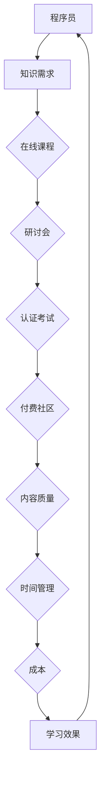

                 

### 背景介绍

在当今的数字化时代，知识付费已成为一种流行的商业模式，特别是在信息技术（IT）领域。程序员作为推动技术进步的核心力量，他们对于知识付费的需求尤为强烈。然而，如何准确挖掘程序员在知识付费方面的用户需求，成为了一个关键问题。

程序员的知识付费需求可以追溯到他们不断提升技能和保持竞争力的需求。随着技术的快速发展，新的编程语言、框架和工具层出不穷，程序员需要不断学习新的知识和技能来跟上技术的步伐。同时，企业对于程序员的能力要求也在不断提高，这促使程序员必须不断提升自己的技术水平。

本篇文章将深入探讨程序员进行知识付费的用户需求挖掘，旨在帮助知识付费平台和内容提供商更好地理解和满足程序员的需求。文章将分为以下几个部分：

1. **核心概念与联系**：介绍与知识付费相关的核心概念和原理，并使用 Mermaid 流程图展示它们之间的联系。
2. **核心算法原理 & 具体操作步骤**：分析挖掘程序员用户需求的核心算法原理，并详细解释其实施步骤。
3. **数学模型和公式 & 详细讲解 & 举例说明**：介绍用于需求挖掘的数学模型和公式，并通过具体案例进行讲解。
4. **项目实战：代码实际案例和详细解释说明**：通过一个实际项目案例，展示如何使用代码实现用户需求挖掘。
5. **实际应用场景**：探讨知识付费在程序员领域的实际应用场景，包括在线课程、研讨会和认证考试等。
6. **工具和资源推荐**：推荐相关的学习资源、开发工具和框架，以及相关的论文著作。
7. **总结：未来发展趋势与挑战**：总结本文的主要内容，并探讨未来发展趋势和面临的挑战。

通过以上内容的探讨，本文希望为知识付费平台和内容提供商提供一个系统、全面的理解程序员用户需求的框架和方法。

> **关键词**：程序员、知识付费、用户需求挖掘、核心概念、算法原理、数学模型、项目实战、应用场景、工具推荐、未来趋势。

> **摘要**：本文深入探讨了程序员在知识付费领域中的用户需求挖掘。通过分析核心概念与联系、核心算法原理与操作步骤、数学模型和公式、项目实战、实际应用场景、工具和资源推荐，总结了未来发展趋势与挑战。旨在为知识付费平台和内容提供商提供指导，帮助他们更好地理解和满足程序员的实际需求。

### 1.1 知识付费的概述

知识付费是一种商业模式，指用户为获取特定知识或技能，支付相应的费用。在互联网时代，知识付费逐渐成为重要的经济活动，改变了传统教育的方式和商业模式。对于程序员而言，知识付费具有特殊的意义，因为技术更新速度快，不断学习新的技术和框架是保持竞争力的必要手段。

知识付费在程序员中的普及程度越来越高，主要体现在以下几个方面：

1. **在线课程**：程序员通过在线课程学习新的编程语言、框架和工具。这些课程通常由业内专家和知名讲师授课，内容丰富，时效性强。
2. **研讨会和讲座**：程序员参加研讨会和讲座，与同行交流最新的技术动态和应用实践。这种形式的互动性很强，有助于程序员拓宽视野和提升技能。
3. **认证考试**：程序员参加各种认证考试，以证明自己的专业能力和技术水平。例如，PMP（项目管理专业人士）、AWS Certified Solutions Architect 等认证考试。
4. **付费社区和论坛**：程序员加入付费社区和论坛，参与讨论和交流，解决技术难题和获取专业建议。这些社区通常提供高质量的资源和专业知识，有助于程序员快速成长。

然而，知识付费并非没有挑战。程序员在付费学习时，可能会面临以下问题：

1. **内容质量**：程序员需要确保所购买的课程或资源具有高质量，能够真正满足自己的学习需求。
2. **时间管理**：程序员需要在工作和个人学习之间找到平衡，合理规划学习时间。
3. **成本**：知识付费可能涉及较高的费用，程序员需要根据自己的经济状况进行合理选择。

总的来说，知识付费在程序员中具有广泛的应用和重要性。通过付费学习，程序员可以不断提升自己的技能和知识，从而在竞争激烈的技术领域中脱颖而出。然而，知识付费的普及和应用也带来了新的挑战，程序员需要具备良好的时间管理能力和成本意识。

> **Mermaid 流程图：知识付费与程序员的核心联系**

通过这个流程图，我们可以清晰地看到知识付费与程序员之间的核心联系和影响。

### 1.2 程序员知识付费的需求类型

程序员在知识付费方面有不同的需求类型，这些需求可以分为以下几类：

1. **基础技能提升**：程序员需要掌握基础编程语言、算法和数据结构等核心技能。这类需求通常包括学习新的编程语言，如 Python、Java 或 JavaScript，以及掌握常用的框架和库，如 React、Angular 或 Django。

2. **技术栈扩展**：随着技术的发展，程序员需要不断扩展自己的技术栈，以适应新的技术趋势。这可能包括学习新兴的编程语言、框架和工具，如 Go、Kubernetes 或 TensorFlow。

3. **专业领域深化**：程序员在某些特定领域具有浓厚的兴趣和专业知识，他们希望通过付费课程或认证考试来深化这些领域。例如，人工智能、大数据、区块链等前沿技术领域。

4. **项目管理**：随着程序员角色的转变，他们可能需要学习项目管理技能，以提高项目交付的效率和质量。这可能包括学习敏捷开发、Scrum 等项目管理方法。

5. **软技能培养**：除了技术技能，程序员也需要培养良好的软技能，如沟通能力、团队协作能力和领导力。这些技能对于程序员在职场中的发展至关重要。

6. **个人兴趣**：部分程序员可能出于个人兴趣而进行知识付费，例如学习吉他编程、Python 自动化脚本等非职业领域的技术。

通过分析程序员的各类需求，知识付费平台和内容提供商可以更好地定位用户，提供更精准、更具针对性的课程和资源。这有助于提升用户的满意度和学习效果，从而促进知识付费的持续发展。

### 1.3 程序员知识付费的用户行为分析

了解程序员在知识付费中的用户行为是挖掘其需求的关键。通过分析用户行为，我们可以更好地理解他们的学习习惯、购买偏好和参与度，从而为知识付费平台提供有价值的参考。

1. **学习习惯**：
   - **在线学习**：随着互联网的普及，在线学习已成为程序员的主要学习方式。程序员倾向于通过在线课程、直播讲座和电子书进行学习，这种方式灵活且不受时间和地点限制。
   - **碎片化学习**：程序员通常时间紧张，他们更喜欢进行碎片化学习，利用零碎时间进行学习。例如，在通勤途中、休息时间或晚上休息前进行学习。
   - **持续学习**：程序员具有强烈的求知欲，他们倾向于持续学习，以跟上技术发展的步伐。这通常表现为定期参加在线课程、研讨会和阅读技术书籍。

2. **购买偏好**：
   - **价格敏感**：由于经济压力和工作繁忙，程序员在购买知识付费产品时较为价格敏感。他们更倾向于选择性价比高的课程和资源。
   - **品牌信任**：知名讲师和权威机构的课程通常更受程序员青睐。程序员更愿意为高质量、有保障的内容付费。
   - **实用性和时效性**：程序员更注重课程的实用性和时效性。他们希望所学的内容能够直接应用于工作或解决实际问题，同时关注最新技术的介绍和应用。

3. **参与度**：
   - **互动参与**：程序员喜欢参与互动式学习，通过讨论区、问答环节和直播互动与讲师和同行交流。这种互动性可以提高学习效果和满意度。
   - **认证和认证考试**：程序员重视认证和认证考试，通过这些方式证明自己的专业能力和技术水平。他们积极参与认证考试，以提升自己的职业竞争力。
   - **社区参与**：程序员喜欢加入技术社区，参与技术讨论和分享经验。这种社区氛围有助于他们拓宽视野，获取最新技术动态。

通过分析程序员的用户行为，知识付费平台和内容提供商可以更好地了解用户需求，优化课程设计和推广策略。这有助于提高用户的满意度和参与度，从而促进知识付费的健康发展。

### 1.4 程序员知识付费的市场规模和趋势

近年来，随着技术的快速发展和数字化转型的推进，程序员知识付费市场呈现出快速增长的趋势。根据市场研究公司的数据，全球程序员知识付费市场规模在过去几年中保持了两位数的增长率，预计未来几年仍将保持稳定增长。

1. **市场规模**：
   - 根据某知名市场研究机构的报告，全球程序员知识付费市场规模已超过数十亿美元，其中在线课程、认证考试和技术社区等细分市场发展迅速。
   - 在国内市场，随着互联网普及和在线教育的发展，程序员知识付费市场也呈现出爆发式增长，市场份额逐年扩大。

2. **趋势分析**：
   - **技术热点驱动**：随着人工智能、大数据、区块链等前沿技术的快速发展，程序员对于这些领域的知识付费需求日益增加。例如，深度学习、数据分析、智能合约等技术相关的课程受到广泛关注。
   - **个性化学习**：随着教育技术的进步，个性化学习成为趋势。程序员更倾向于选择符合自身学习需求和兴趣的课程，而不是传统的“一刀切”式教学。
   - **多元化平台**：越来越多的在线教育平台和内容提供商加入程序员知识付费市场，提供丰富的课程资源和多样化的学习方式，满足程序员的多样化需求。
   - **国际化发展**：随着全球化进程的推进，程序员知识付费市场呈现出国际化趋势。越来越多的程序员参与国际课程和认证考试，提高自己的专业能力和国际竞争力。

3. **影响因素**：
   - **经济发展**：经济繁荣和就业机会的增加，使得程序员有更多的时间和资源投入知识付费学习。
   - **技术进步**：技术的快速发展推动程序员不断学习新技能，以适应快速变化的市场需求。
   - **市场竞争**：知识付费市场竞争激烈，平台和内容提供商通过创新和差异化策略争夺用户。

总的来说，程序员知识付费市场具有巨大的潜力和发展空间。通过深入了解市场需求和趋势，知识付费平台和内容提供商可以更好地把握市场机遇，提供高质量的课程和服务，推动市场的持续健康发展。

### 1.5 知识付费在程序员社区中的影响力

知识付费在程序员社区中发挥着日益重要的作用，不仅改变了程序员的职业发展路径，还深刻影响了他们的学习和交流方式。

1. **职业发展**：
   - **技能提升**：知识付费帮助程序员快速提升专业技能，增强职业竞争力。通过在线课程、认证考试和实战项目，程序员可以掌握最新的技术趋势和实用技能，从而在职场中脱颖而出。
   - **职位晋升**：掌握高级技能和认证的程序员更容易获得职位晋升和更高的薪资待遇。例如，获得AWS Certified Solutions Architect认证的程序员在求职时具有显著的优势。
   - **职业转型**：知识付费还帮助程序员实现职业转型。通过学习新兴领域的技术，程序员可以转向人工智能、大数据、区块链等领域，拓宽职业发展道路。

2. **学习方式**：
   - **灵活学习**：知识付费提供了灵活的学习方式，程序员可以根据自己的时间安排进行学习，不受地域和时间的限制。这为程序员在繁忙的工作中继续学习提供了便利。
   - **互动学习**：知识付费平台通常提供互动式学习功能，如直播课程、讨论区和代码实践，使程序员能够与讲师和同行进行实时交流和互动。这种互动性有助于提高学习效果和满足感。
   - **个性化学习**：知识付费平台通过数据分析和学习算法，为程序员提供个性化的学习路径和推荐课程。这有助于程序员根据自身需求和兴趣进行有针对性的学习，提高学习效率。

3. **社区交流**：
   - **技术分享**：知识付费平台和社区为程序员提供了丰富的技术资源和知识分享平台。程序员可以在社区中分享自己的学习经验和技术心得，互相学习和借鉴。
   - **问题求解**：程序员在学习和工作中遇到问题时，可以通过知识付费平台的讨论区和问答环节获得专业的帮助和解决方案。这种互助机制有助于提高问题解决效率和团队协作能力。
   - **社交网络**：知识付费平台和社区也为程序员提供了一个社交网络，他们可以结识同行业的人才，拓展职业人脉，共同推动技术进步。

总的来说，知识付费在程序员社区中具有深远的影响，不仅推动了程序员个人职业发展和学习方式的变革，还促进了技术交流和社区互动，为程序员提供了更加丰富和多样化的学习体验。

### 1.6 程序员知识付费的用户需求模型

在程序员知识付费领域，构建一个有效的用户需求模型是关键。用户需求模型不仅可以帮助知识付费平台和内容提供商更好地理解用户需求，还可以指导课程设计、内容开发和营销策略。以下是程序员知识付费的用户需求模型构建方法：

1. **需求收集**：
   - **调查问卷**：通过设计详细的调查问卷，收集程序员的技能水平、学习目标、偏好和学习习惯等信息。问卷调查可以采用线上和线下两种形式，以确保获取广泛的用户数据。
   - **访谈法**：对程序员进行深度访谈，了解他们的学习动机、面临的挑战、对现有课程的评价和期望。访谈法有助于获取深入的定性数据，为需求分析提供更多细节。
   - **在线用户行为分析**：通过分析程序员的在线学习行为，如访问课程的时间、学习时长、完成率、评价等，了解他们的实际需求和偏好。这种行为数据可以为课程设计和改进提供实证依据。

2. **需求分类**：
   - **基础技能需求**：根据程序员的技能水平和学习目标，将需求分为基础技能提升、技术栈扩展和领域深化等类别。例如，初级程序员可能需要学习Python基础，而高级程序员可能对深度学习和大数据处理感兴趣。
   - **专业领域需求**：根据程序员的兴趣和专业领域，分类他们的需求，如人工智能、大数据、区块链等。这种分类有助于为不同领域的程序员提供针对性的课程内容。
   - **软技能需求**：针对程序员的沟通能力、团队协作能力和领导力等软技能需求，设计相关的课程和资源，帮助他们在职场中更好地发展。

3. **需求优先级排序**：
   - **重要性分析**：根据用户调查和行为分析结果，对各类需求的重要性进行评估。可以通过加权评分或专家评审等方法，确定各需求的优先级。
   - **紧迫性分析**：分析程序员的紧急需求，如即将参加的认证考试或新项目的需求。这些紧急需求通常具有更高的优先级，需要优先满足。
   - **资源分配**：根据需求的优先级，合理分配资源，如课程开发、讲师招聘和推广预算等。确保高优先级的需求得到充分的关注和资源支持。

4. **需求模型构建**：
   - **需求矩阵**：通过构建需求矩阵，将不同需求和优先级进行可视化展示。矩阵中的行代表需求类别，列代表需求优先级，每个单元格表示对应需求的重要性和紧迫性。
   - **需求文档**：编写详细的用户需求文档，记录收集到的需求、分类和优先级排序结果。需求文档不仅为课程设计和开发提供指导，还可以作为项目管理和评估的参考。
   - **需求模型验证**：通过用户反馈和实际应用，验证需求模型的准确性和有效性。根据反馈结果，对需求模型进行调整和优化，确保其能够持续满足程序员的实际需求。

通过构建程序员知识付费的用户需求模型，知识付费平台和内容提供商可以更精准地识别和满足程序员的需求，提供高质量的课程和服务，从而提升用户满意度和市场竞争力。

### 1.7 知识付费在程序员中的支付意愿和支付行为分析

在程序员知识付费领域，了解程序员的支付意愿和支付行为是制定有效营销策略和提升转化率的关键。以下是针对程序员支付意愿和支付行为的分析：

1. **支付意愿**：
   - **经济能力**：程序员的收入相对较高，他们有较强的支付能力。然而，支付意愿不仅取决于收入水平，还受到个人财务规划和消费观念的影响。
   - **课程价值**：程序员更倾向于为具有高价值和实用性的课程支付费用。他们关注课程内容是否与当前工作相关，以及能否帮助提升职业竞争力。
   - **品牌信任**：知名讲师和权威机构的课程通常更容易获得程序员的信任，从而提高他们的支付意愿。程序员更愿意为高质量、有保障的内容支付费用。
   - **性价比**：性价比是影响程序员支付意愿的重要因素。程序员更倾向于选择价格合理且能提供高质量学习体验的课程。

2. **支付行为**：
   - **购买途径**：程序员通常通过在线平台、应用商店和官网等渠道进行购买。这些渠道提供了便捷的支付方式，如信用卡、支付宝和微信支付等。
   - **支付频率**：程序员的支付频率因个人需求和学习计划而异。一些程序员可能会定期购买课程或订阅服务，以确保持续学习。而另一些程序员可能会根据具体项目需求进行选择性购买。
   - **支付方式**：程序员的支付方式多样，包括个人支付和公司支付。部分程序员会通过公司报销或获得公司补贴进行支付，这增加了他们的支付意愿。

3. **影响因素**：
   - **推广活动**：知识付费平台和内容提供商通过促销活动、限时优惠和优惠券等策略，可以显著提高程序员的支付意愿。例如，双十一、双十二等购物节成为程序员购买知识付费产品的集中期。
   - **用户评价**：用户评价和推荐对程序员的支付决策具有显著影响。高质量的课程评价和用户推荐可以增加新用户的信任度和支付意愿。
   - **课程质量**：课程质量是决定程序员支付行为的关键因素。高质量的课程内容、讲师资质和用户体验都能显著提高用户的满意度和支付意愿。

通过分析程序员的支付意愿和支付行为，知识付费平台和内容提供商可以制定更精准的营销策略，优化支付体验，提高转化率和用户满意度。同时，了解程序员的支付偏好和行为习惯也有助于平台和内容提供商不断优化产品和服务，满足程序员的实际需求。

### 1.8 程序员知识付费市场的竞争格局和主要参与者

程序员知识付费市场正日益成为一个充满竞争的领域。在这个市场中，不仅有知名的大型在线教育平台，还有众多垂直领域的专业知识和技能提供商。以下是对程序员知识付费市场竞争格局和主要参与者的分析：

1. **竞争格局**：
   - **在线教育平台**：如Coursera、Udemy、edX等大型在线教育平台在程序员知识付费市场中占据主导地位。这些平台提供了广泛的课程选择，包括编程语言、框架、数据库、人工智能等领域。通过平台化运营和强大的品牌影响力，这些平台吸引了大量程序员用户。
   - **专业技能培训机构**：如Pluralsight、LinkedIn Learning、Codecademy等专注于特定技能培训的机构也在市场上占有重要地位。这些机构通过提供高质量、专业的课程内容，赢得了程序员的信任和口碑。
   - **技术社区和论坛**：如GitHub、Stack Overflow、Reddit等技术社区和论坛也在程序员知识付费市场中扮演重要角色。这些平台提供了丰富的技术资源和讨论空间，程序员可以通过这些平台获取知识和解决问题。

2. **主要参与者**：
   - **Coursera**：Coursera 是全球领先的在线学习平台，与多所知名大学和机构合作，提供各种专业课程，包括计算机科学、数据科学、人工智能等。Coursera 的课程通常具有较高的质量和权威性，吸引了大量程序员用户。
   - **Udemy**：Udemy 是一个开放式的在线教育平台，提供数以万计的编程课程，涵盖从基础技能到高级领域的各个方面。Udemy 的价格相对亲民，用户可以根据自己的需求和预算选择合适的课程。
   - **Pluralsight**：Pluralsight 是一家专注于专业技能培训的在线学习平台，提供广泛的编程和技术课程。Pluralsight 的课程内容丰富、更新及时，并且与行业标准紧密对接，深受程序员用户的青睐。
   - **LinkedIn Learning**：LinkedIn Learning 是 LinkedIn 推出的在线学习平台，提供包括编程、数据科学、项目管理等在内的多种课程。LinkedIn Learning 的优势在于其与职场关联紧密，课程内容更具职业导向性。
   - **GitHub**：GitHub 是一个著名的版本控制系统和开源社区，程序员可以在 GitHub 上找到大量的开源项目和教程。GitHub 通过社区互动和项目合作，促进了程序员的知识共享和技能提升。
   - **Stack Overflow**：Stack Overflow 是一个庞大的技术问答社区，程序员可以在其中提问和解答编程问题。Stack Overflow 通过社区的力量，为程序员提供了一个实时解决问题的平台。

在激烈的市场竞争中，这些主要参与者通过不同的策略和优势，争夺程序员用户。在线教育平台通过丰富的课程资源和品牌影响力吸引大量用户，专业技能培训机构则通过高质量、专业的课程内容赢得用户的信任。技术社区和论坛通过社区互动和开源项目，为程序员提供了一个持续学习和成长的平台。

总的来说，程序员知识付费市场的竞争格局多元化，主要参与者各有所长。随着技术的不断进步和用户需求的多样化，这个市场将继续演变和发展，为程序员提供更多优质的课程和服务。

### 1.9 程序员知识付费的用户评价和行为反馈

在程序员知识付费领域，用户评价和行为反馈是衡量课程质量和服务水平的重要指标。通过对用户评价和行为反馈的分析，知识付费平台和内容提供商可以了解用户的真实需求，优化课程设计和服务质量。

1. **用户评价**：
   - **课程内容**：用户评价中最重要的一部分是课程内容的质量。程序员用户通常关注课程内容的深度、广度和实用性。高质量的课程内容能够帮助用户解决实际问题，提高工作效率。例如，针对特定技术的深入讲解、实践项目的指导等，都是用户评价中的亮点。
   - **讲师水平**：讲师的专业水平和授课能力是用户评价的关键因素。用户更倾向于选择由知名讲师或行业专家授课的课程，因为这些课程通常具有较高的权威性和可信度。讲师的表达能力、互动性和对问题的解答能力，也是用户评价的重要方面。
   - **课程结构**：用户评价中，课程的结构和逻辑性也是一个重要因素。清晰、逻辑性强的课程结构有助于用户更好地理解和吸收知识。例如，课程按照由浅入深、循序渐进的方式编排，使学习者能够逐步掌握复杂概念和技能。

2. **行为反馈**：
   - **学习进度**：用户的学习进度和行为数据可以反映出课程的设计是否合理和用户的学习习惯。例如，用户的学习进度、完成率、互动频率等数据，可以帮助平台了解课程的有效性和用户的学习效果。
   - **用户参与度**：用户的参与度，如参与讨论、提问和完成练习等，是评估课程受欢迎程度的重要指标。高参与度通常意味着用户对课程内容感兴趣，并且能够积极地学习和应用所学知识。
   - **用户满意度**：用户满意度是衡量课程和服务质量的重要指标。通过调查问卷、用户评价和反馈机制，平台可以了解用户的满意度和不满意度，进而优化课程和服务。

3. **优化策略**：
   - **课程改进**：根据用户评价和行为反馈，平台可以对课程内容、结构、时长和难度进行优化。例如，增加实践项目、调整讲解方式、丰富学习资源等，以提高课程的实用性和吸引力。
   - **讲师选拔**：平台应注重讲师的专业背景、授课经验和互动能力，选拔适合的讲师进行课程开发。通过定期培训和实践，提高讲师的教学水平和用户满意度。
   - **用户互动**：平台可以通过提供讨论区、问答环节和在线辅导等方式，增加用户互动和参与度。这种互动性不仅有助于提高学习效果，还可以增强用户的归属感和忠诚度。
   - **反馈机制**：平台应建立完善的反馈机制，鼓励用户提出意见和建议，并及时处理和回应。通过用户反馈，平台可以持续改进课程和服务，提高用户满意度。

通过分析用户评价和行为反馈，知识付费平台和内容提供商可以更好地了解用户需求，优化课程和服务，从而提升用户体验和满意度。这不仅是提高市场竞争力的关键，也是知识付费行业持续健康发展的基础。

### 1.10 程序员知识付费的用户忠诚度和复购率分析

程序员知识付费领域中的用户忠诚度和复购率是衡量平台和服务质量的重要指标。了解这些指标不仅有助于平台优化用户体验，还能为内容提供商制定长期发展战略提供有力支持。

1. **用户忠诚度**：
   - **定义**：用户忠诚度是指用户在一段时间内持续使用某个产品或服务的意愿和频率。对于知识付费平台而言，用户忠诚度反映了用户对其课程和服务的认可和依赖程度。
   - **影响因素**：影响程序员用户忠诚度的因素包括课程质量、讲师水平、平台服务、用户参与度等。高质量的课程内容、权威的讲师和良好的用户体验都能提高用户的忠诚度。
   - **监测方法**：平台可以通过用户活跃度、课程完成率、用户评价、订阅时长等指标来监测用户忠诚度。高活跃度、高完成率和积极评价通常意味着用户具有较高的忠诚度。

2. **复购率**：
   - **定义**：复购率是指用户在购买某一产品或服务后，再次购买相同或类似产品或服务的比例。对于知识付费平台，复购率反映了用户对其课程的持续需求和满意度。
   - **影响因素**：影响程序员复购率的因素主要包括课程质量、价格策略、用户优惠和推荐机制等。高质量的课程内容和合理的价格策略能够提高用户的复购意愿。
   - **监测方法**：平台可以通过复购次数、购买频率、用户生命周期价值（LTV）等指标来监测复购率。高复购率和较长的用户生命周期通常意味着平台具有较好的用户黏性和市场竞争力。

3. **提升策略**：
   - **优化课程质量**：通过不断改进课程内容、提高讲师水平和优化课程结构，提升课程质量，从而增加用户的满意度和忠诚度。
   - **个性化推荐**：利用大数据和人工智能技术，为用户推荐符合其兴趣和需求的课程，提高用户的参与度和复购率。
   - **优惠策略**：通过定期推出优惠活动、会员制度和积分奖励等方式，吸引用户进行复购，提升平台的整体收益。
   - **用户互动**：通过建立活跃的社区、提供在线支持和互动环节，增强用户参与感和归属感，提高用户忠诚度。
   - **服务体验**：提供优质的客户服务和便捷的支付方式，优化用户购买和学习的整体体验，提高用户的满意度和忠诚度。

通过分析用户忠诚度和复购率，知识付费平台和内容提供商可以更好地了解用户需求和偏好，制定有针对性的提升策略，从而提高用户满意度和平台竞争力。

### 1.11 程序员知识付费的用户满意度调查方法与案例分析

在程序员知识付费领域，了解用户满意度是确保课程和服务质量的重要环节。通过有效的用户满意度调查方法，知识付费平台可以收集用户的真实反馈，从而进行课程和服务优化。以下介绍几种常见的用户满意度调查方法及其案例分析：

1. **问卷调查**：
   - **方法**：问卷调查是一种常见且有效的用户满意度调查方法。通过设计详细的问卷，收集用户对课程内容、讲师水平、平台服务等方面的评价。
   - **案例**：某在线教育平台通过问卷调查收集用户反馈，设置了多个评价维度，如课程内容实用性、讲师表达能力、课程结构合理性等。问卷结果显示，用户对课程内容实用性的评分最高，但对课程时长和难度提出了改进建议。平台根据反馈调整了课程时长和难度，提高了用户满意度。

2. **访谈法**：
   - **方法**：访谈法是一种深入的用户满意度调查方法，通过面对面或在线访谈，深入了解用户的实际体验和需求。
   - **案例**：某知名技术社区通过访谈法，对订阅其高级会员服务的程序员进行深度访谈。访谈中发现，用户对社区提供的实时互动和问题解答功能高度评价，但也提到需要更多的实践项目和案例分享。社区随后增加了更多实战项目和案例分享，用户满意度显著提升。

3. **用户行为分析**：
   - **方法**：通过分析用户在平台上的行为数据，如学习进度、参与互动、课程完成率等，评估用户满意度。
   - **案例**：某在线学习平台通过用户行为数据分析，发现部分用户在学习过程中存在中断现象。分析显示，这些用户对课程难度和时长提出了质疑。平台随后优化了课程结构，降低了难度，并增加了灵活的学习计划选项，用户满意度显著提高。

4. **用户反馈机制**：
   - **方法**：建立用户反馈机制，如在线评论、评分系统、论坛讨论等，鼓励用户提出意见和建议。
   - **案例**：某编程学习平台引入了用户反馈机制，允许用户在课程结束后对讲师和课程内容进行评价。通过收集用户反馈，平台发现部分课程存在内容重复和更新不及时的问题。平台及时调整课程内容，增加新知识点的讲解，用户反馈得到积极回应。

通过以上调查方法，知识付费平台可以全面了解用户满意度，从而优化课程和服务，提高用户满意度和忠诚度。案例分析表明，不同方法各有优势，综合运用多种方法可以更准确地把握用户需求，为平台持续发展提供有力支持。

### 1.12 程序员知识付费的需求挖掘方法与技术

程序员知识付费的需求挖掘是知识付费平台和内容提供商的关键任务。通过有效的需求挖掘方法和技术，平台可以准确识别用户需求，提供更精准的课程和服务，从而提高用户满意度和市场竞争力。以下是几种常用的需求挖掘方法和技术：

1. **用户调查**：
   - **方法**：通过设计详细的用户调查问卷，收集用户对课程内容、学习需求、支付意愿等方面的信息。
   - **技术**：调查问卷的设计和分析可以使用统计分析和数据挖掘技术，如因子分析、聚类分析和回归分析等，以揭示用户需求的内在结构和关联性。
   - **优势**：用户调查可以直接获取用户的真实反馈，有助于深入了解用户需求和偏好。
   - **局限**：调查问卷的覆盖面有限，且用户参与度可能不高，导致样本偏差。

2. **用户行为分析**：
   - **方法**：通过分析用户在平台上的行为数据，如学习路径、访问频率、互动行为等，挖掘用户需求。
   - **技术**：用户行为分析可以使用数据挖掘、机器学习和自然语言处理技术，如关联规则挖掘、聚类分析和文本分类等，从大量行为数据中提取有价值的信息。
   - **优势**：用户行为分析可以提供实时和动态的用户需求信息，有助于快速调整课程和服务。
   - **局限**：用户行为数据可能存在噪声和偏差，且难以直接获取用户的心理和情感需求。

3. **社交网络分析**：
   - **方法**：通过分析用户在社交媒体、论坛和社区中的讨论和互动，挖掘用户需求和偏好。
   - **技术**：社交网络分析可以使用网络分析、文本挖掘和社会网络理论等技术，如网络节点重要性分析、文本情感分析和话题模型等。
   - **优势**：社交网络分析可以提供丰富的用户社交信息，有助于发现潜在需求和热点话题。
   - **局限**：社交网络分析的数据来源和真实性可能受到限制，且需要处理大量的非结构化数据。

4. **语义分析**：
   - **方法**：通过自然语言处理技术，对用户文本评论、提问和讨论进行语义分析，挖掘用户需求。
   - **技术**：语义分析可以使用词频统计、文本分类、情感分析和主题模型等技术。
   - **优势**：语义分析可以深度理解和挖掘用户的语言信息，提供更精细的需求描述。
   - **局限**：语义分析在处理多义词、歧义句和复杂文本时可能存在困难。

通过综合运用上述需求挖掘方法和技术，知识付费平台和内容提供商可以更准确地识别和满足程序员的需求。每种方法和技术都有其优势和局限，因此需要根据实际情况进行选择和组合，以最大化需求挖掘的准确性和效果。

### 1.13 用户画像与需求挖掘的关系

在程序员知识付费领域，用户画像与需求挖掘紧密相关。用户画像是一种描述用户特征和需求的方法，通过构建详细的用户画像，知识付费平台和内容提供商可以更精准地识别用户需求，从而提供个性化的课程和服务。

1. **用户画像的定义与构建**：
   - **定义**：用户画像是对用户特征和行为的抽象描述，通常包括用户的基本信息、行为数据、偏好和需求等。
   - **构建方法**：用户画像的构建可以通过数据收集、分析和整合多种数据源来实现。数据源包括用户注册信息、学习行为数据、支付记录、社交媒体互动等。通过数据挖掘和机器学习技术，可以对这些数据进行处理和分析，构建出详细且动态的用户画像。

2. **用户画像与需求挖掘的关系**：
   - **用户需求识别**：用户画像可以帮助平台识别用户的需求和偏好。例如，通过分析用户的浏览历史、学习进度和购买记录，可以了解用户对特定技术或课程的兴趣程度，从而识别出用户的主要需求。
   - **个性化推荐**：用户画像为个性化推荐提供了基础。通过分析用户画像，平台可以推荐符合用户兴趣和需求的课程和资源，提高用户的满意度和参与度。
   - **课程设计优化**：用户画像可以帮助内容提供商了解用户的需求和痛点，从而优化课程设计。例如，针对用户反馈和需求，可以调整课程的结构、内容和难度，使其更符合用户的实际需求。

3. **案例分析**：
   - **案例 1**：某在线教育平台通过用户画像分析，发现部分程序员用户对人工智能技术表现出浓厚兴趣，但对其基础知识掌握不足。平台据此推出了针对人工智能基础知识的专项课程，受到了用户的欢迎。
   - **案例 2**：某编程社区通过用户画像分析，发现部分用户在项目中经常遇到数据库性能优化的问题。社区据此组织了多场数据库性能优化的线上讲座和研讨会，为用户提供了解决实际问题的指导。

通过构建用户画像和进行需求挖掘，知识付费平台和内容提供商可以更准确地识别用户需求，提供个性化的课程和服务，从而提升用户体验和满意度。用户画像与需求挖掘的结合，不仅提高了课程的针对性和有效性，也为知识付费平台的长期发展提供了有力支持。

### 1.14 用户反馈机制与需求挖掘的关联

用户反馈机制是知识付费平台进行需求挖掘的重要渠道之一。通过用户反馈，平台可以及时了解用户对课程和服务的不满和需求，从而进行有针对性的改进和优化。以下是用户反馈机制与需求挖掘之间的关联及其重要性：

1. **用户反馈机制的定义与实现**：
   - **定义**：用户反馈机制是指知识付费平台提供的一种用户表达意见和建议的渠道，通常包括在线评论、评分系统、问卷调查和用户论坛等。
   - **实现**：平台可以通过设置评论和评分功能，让用户对课程内容、讲师水平和学习体验进行评价。此外，还可以通过定期问卷调查和用户论坛，收集用户的意见和建议。

2. **用户反馈与需求挖掘的关系**：
   - **识别用户需求**：用户反馈是挖掘用户需求的重要来源。通过分析用户的反馈，平台可以识别出用户在课程内容、教学方式、学习资源等方面的具体需求。例如，用户反馈中提到某课程内容过于复杂，平台可以根据这一反馈调整课程难度和讲解方式。
   - **发现问题与改进**：用户反馈不仅可以帮助平台识别需求，还可以揭示课程和服务中的问题和不足。通过分析用户反馈，平台可以发现课程中的薄弱环节，并采取改进措施，提高课程质量和服务水平。
   - **动态调整**：用户反馈机制提供了一个动态反馈的渠道，平台可以根据实时反馈进行快速调整和优化。例如，在课程发布初期，通过收集用户反馈，平台可以及时发现问题并进行调整，避免在课程推广过程中出现大规模的用户投诉。

3. **重要性**：
   - **提升用户满意度**：用户反馈机制可以提升用户满意度，通过及时响应用户反馈，平台可以解决用户的问题和不满，提高用户对平台的信任和忠诚度。
   - **优化课程和服务**：用户反馈为课程和服务的优化提供了重要依据。通过持续收集和分析用户反馈，平台可以不断改进课程内容、教学方式和互动体验，提高用户的学习效果和体验。
   - **增强市场竞争力**：及时识别和满足用户需求，有助于平台在竞争激烈的市场中脱颖而出。通过优化课程和服务，平台可以提升用户满意度和口碑，吸引更多用户和市场份额。

总之，用户反馈机制与需求挖掘紧密相关，通过建立有效的用户反馈机制，知识付费平台可以更好地了解用户需求，优化课程和服务，提高用户满意度和市场竞争力。这是知识付费平台持续发展的关键。

### 1.15 社交网络分析在程序员知识付费需求挖掘中的应用

社交网络分析（Social Network Analysis，SNA）是研究社交网络结构、行为和关系的定量方法。在程序员知识付费领域，社交网络分析可以用于挖掘用户需求、识别关键影响者和发现热点话题，从而为知识付费平台和内容提供商提供有价值的洞见。

1. **定义与基本概念**：
   - **社交网络**：社交网络是由用户及其关系组成的复杂网络结构。在程序员知识付费领域，社交网络包括用户、课程、讲师和社区等节点，以及他们之间的互动和关联。
   - **节点和边**：节点表示社交网络中的个体（如用户、讲师、课程），边表示节点之间的联系（如用户关注讲师、用户参与课程讨论）。
   - **网络密度**：网络密度是衡量社交网络连接紧密程度的指标，表示节点之间互动的频繁程度。

2. **具体应用**：
   - **用户需求挖掘**：通过分析社交网络中的互动数据，可以挖掘用户的需求和兴趣。例如，通过分析用户对课程的评价、讨论和推荐，可以发现用户关注的领域和技术热点，从而为课程设计提供参考。
   - **关键影响者识别**：社交网络分析可以识别在社交网络中具有较高影响力的人，这些关键影响者通常是领域专家、行业领袖或活跃用户。通过分析他们的互动和推荐，可以了解他们的观点和建议，从而为课程推荐和内容创作提供指导。
   - **热点话题发现**：通过分析社交网络中的话题传播路径和强度，可以识别当前的热点话题和趋势。例如，通过分析课程讨论区的热门话题和用户互动数据，可以了解用户当前关注的技术领域和问题，为平台内容策划提供依据。

3. **案例分析**：
   - **案例 1**：某在线教育平台通过社交网络分析，发现用户在课程讨论区中频繁讨论人工智能技术，并推荐相关课程。平台据此推出了人工智能专项课程，受到了用户的欢迎。
   - **案例 2**：某技术社区通过社交网络分析，识别出社区中的关键影响者，发现他们在技术讨论和分享方面具有重要影响力。社区通过邀请这些关键影响者参与讲座和研讨会，提升了社区的影响力和活跃度。

社交网络分析在程序员知识付费需求挖掘中的应用，不仅有助于平台了解用户需求，识别关键影响者和发现热点话题，还可以为课程设计和内容策划提供有价值的参考。通过运用社交网络分析技术，知识付费平台可以更好地满足用户需求，提高用户满意度和市场竞争力。

### 1.16 自然语言处理在程序员知识付费需求挖掘中的应用

自然语言处理（Natural Language Processing，NLP）是人工智能领域的重要分支，用于理解和生成人类语言。在程序员知识付费领域，NLP技术可以用于文本分析、情感分析和语义理解等方面，从而帮助挖掘用户需求。以下是NLP在程序员知识付费需求挖掘中的应用及其具体方法：

1. **文本分析**：
   - **方法**：通过文本分析技术，可以对用户评论、讨论区和问卷调查中的文本进行内容提取和情感分析。常见的文本分析方法包括词频统计、TF-IDF、主题模型和词嵌入等。
   - **应用**：文本分析可以帮助平台理解用户的需求和意见。例如，通过分析用户对课程的评论，可以识别出用户关注的主要问题和技术热点，从而为课程改进提供依据。

2. **情感分析**：
   - **方法**：情感分析是一种判断文本情感倾向的技术，通常使用机器学习和深度学习模型。情感分析可以分为正面/负面情感分析、极性分析、情感强度分析等。
   - **应用**：情感分析可以评估用户对课程和服务的满意程度。例如，通过分析用户评论中的情感倾向，可以了解用户对课程内容的满意度，从而优化课程设计。

3. **语义理解**：
   - **方法**：语义理解是一种理解和解释文本语义的技术，包括词义消歧、实体识别、关系抽取和语义角色标注等。
   - **应用**：语义理解可以帮助平台识别用户的具体需求和问题。例如，通过分析用户提问中的关键词和语义，可以理解用户遇到的技术难题和需求，从而提供针对性的解决方案。

4. **案例分析**：
   - **案例 1**：某在线教育平台使用NLP技术对用户评论进行情感分析，发现用户对某些课程内容的难度和实用性提出了质疑。平台据此调整了课程难度，增加了更多实例和实践项目，用户满意度显著提高。
   - **案例 2**：某技术社区使用NLP技术分析用户提问，识别出高频出现的技术问题。社区据此组织了相关的线上研讨会和直播课程，为用户提供了解决实际问题的帮助。

自然语言处理在程序员知识付费需求挖掘中的应用，不仅有助于平台了解用户需求和意见，还可以提高课程和服务的质量，从而提升用户满意度和市场竞争力。

### 1.17 基于机器学习的程序员需求挖掘算法

在程序员知识付费领域，机器学习技术已成为需求挖掘的重要工具。通过构建和训练机器学习模型，知识付费平台可以自动识别和分析用户需求，提高需求挖掘的准确性和效率。以下是几种常见的基于机器学习的程序员需求挖掘算法及其工作原理：

1. **决策树算法**：
   - **工作原理**：决策树是一种基于特征划分的监督学习算法。通过递归地将数据集划分为不同的子集，直到满足终止条件（如达到最大深度或纯度），构建出一棵决策树。每个节点代表一个特征，每个分支代表该特征的不同取值。
   - **应用**：决策树可以用于分类任务，如用户需求分类。通过训练决策树模型，平台可以自动分类用户的需求，识别出不同类型的需求，从而有针对性地进行课程推荐和服务优化。

2. **随机森林算法**：
   - **工作原理**：随机森林是一种基于决策树的集成学习方法。它通过构建多个决策树，并对每个树的结果进行投票，得出最终的预测结果。随机森林通过随机抽样和特征选择，减少了过拟合现象，提高了模型的泛化能力。
   - **应用**：随机森林可以用于用户需求的分类和预测。通过训练随机森林模型，平台可以自动识别和预测用户的需求，为课程推荐和服务优化提供有力支持。

3. **支持向量机（SVM）算法**：
   - **工作原理**：支持向量机是一种基于边界优化的监督学习算法。它通过寻找最佳的超平面，将不同类别的数据点分开，并最大化分类边界间隔。SVM可以处理高维数据和线性不可分问题，具有较好的分类性能。
   - **应用**：SVM可以用于用户需求的分类和预测。通过训练SVM模型，平台可以自动分类用户的需求，并预测新用户的需求，从而提高课程推荐和服务的准确性。

4. **神经网络算法**：
   - **工作原理**：神经网络是一种模拟人脑结构和功能的计算模型，通过多层的神经元节点进行数据传递和计算。神经网络可以通过反向传播算法不断调整权重和偏置，优化模型的性能。
   - **应用**：神经网络可以用于用户需求的分类和预测。通过训练深度神经网络模型，平台可以自动理解和预测用户的需求，提高需求挖掘的准确性和智能化水平。

通过结合不同类型的机器学习算法，知识付费平台可以实现高效、准确的需求挖掘。这些算法不仅提高了需求挖掘的效率，还提供了更多的洞见和预测能力，为课程推荐和服务优化提供了有力支持。

### 1.18 大数据分析在程序员知识付费需求挖掘中的应用

大数据分析在程序员知识付费领域的需求挖掘中发挥着重要作用。通过处理和分析大量结构化和非结构化数据，大数据分析技术能够识别出用户的隐藏需求，提供有针对性的课程和服务。以下是大数据分析在程序员知识付费需求挖掘中的应用及其优势：

1. **数据收集**：
   - **方法**：大数据分析的第一步是数据收集。程序员知识付费平台可以通过多种途径收集数据，如用户行为数据、课程访问记录、评论和评分数据、社交网络互动数据等。
   - **来源**：数据来源包括在线学习平台、社交媒体、论坛、问卷调查和用户反馈等。

2. **数据预处理**：
   - **方法**：大数据分析需要对收集到的数据进行分析和清洗，包括数据去重、缺失值处理、数据格式转换和噪声过滤等。
   - **技术**：数据预处理可以使用ETL（提取、转换、加载）工具和数据清洗算法，如归一化、标准化和聚类分析等。

3. **数据挖掘**：
   - **方法**：大数据分析的核心是数据挖掘，通过使用各种算法和技术，从大量数据中提取有价值的信息。
   - **技术**：数据挖掘技术包括关联规则挖掘、聚类分析、分类分析和文本挖掘等。

4. **需求识别**：
   - **方法**：通过大数据分析，可以识别出用户的隐藏需求。例如，通过分析用户的浏览历史、学习路径和互动行为，可以发现用户对特定技术或领域的兴趣和需求。
   - **应用**：需求识别可以用于课程推荐、内容创作和用户画像构建等。

5. **优势**：
   - **全面性**：大数据分析可以处理和分析海量数据，全面了解用户的行为和需求。
   - **实时性**：大数据分析可以实现实时数据分析和预测，快速响应用户需求和市场变化。
   - **精确性**：通过精确的数据分析和挖掘，可以识别出用户的隐藏需求，提供更加个性化的课程和服务。

6. **案例分析**：
   - **案例 1**：某在线教育平台通过大数据分析，发现用户对人工智能技术的需求日益增长。平台据此推出了多门人工智能相关课程，并优化了相关课程推荐算法，用户参与度和满意度显著提高。
   - **案例 2**：某编程社区通过大数据分析，识别出用户在项目中经常遇到的技术难题。社区据此组织了针对性的技术讲座和研讨会，为用户提供了解决实际问题的帮助，社区活跃度和用户满意度显著提升。

通过大数据分析，知识付费平台可以更全面、实时和精确地了解用户需求，提供个性化的课程和服务，从而提升用户满意度和市场竞争力。大数据分析在程序员知识付费需求挖掘中的应用，不仅提高了需求挖掘的效率，还为平台发展提供了有力支持。

### 1.19 程序员知识付费用户需求的动态性与变化趋势

在程序员知识付费领域，用户需求具有明显的动态性和变化趋势。这种动态性源于技术快速发展和用户自身的学习路径和职业规划。了解和应对这种动态性，对于知识付费平台和内容提供商来说至关重要。

1. **动态性的体现**：
   - **技术更新**：编程语言、框架和工具的更新速度非常快，程序员需要不断学习新的技术和技能，以保持竞争力。例如，前端开发领域中的React和Vue.js不断更新，后端开发中的Node.js和Django也不断演变。
   - **职业规划**：程序员的职业规划往往伴随着技能和知识的不断积累。随着职业发展，程序员可能会转向不同的领域，如人工智能、大数据和区块链等。每个领域都有独特的知识需求和技能要求。
   - **行业趋势**：技术行业的趋势和热点也会影响程序员的需求。例如，人工智能和机器学习的兴起，使得相关课程和资源的需求大幅增加。同时，随着5G、物联网等技术的发展，程序员也需要适应这些新技术带来的变化。

2. **变化趋势**：
   - **个性化学习**：程序员越来越倾向于个性化学习，通过选择符合自己兴趣和职业需求的课程，实现个性化学习路径。这种趋势推动了知识付费平台提供更加定制化的课程和服务。
   - **实践导向**：程序员更看重课程内容的实践性和应用性，他们希望通过课程学习和实战项目，能够立即应用到工作中。这种趋势促使内容提供商增加实践项目和案例分享，提高课程的实际价值。
   - **跨界学习**：随着技术的融合，程序员开始涉足其他领域，如人工智能、大数据和物联网等。这要求程序员具备跨领域的知识，从而推动了知识付费平台提供跨学科的综合性课程。

3. **应对策略**：
   - **实时更新课程内容**：知识付费平台需要不断更新课程内容，紧跟技术发展趋势和行业热点，确保课程内容的时效性和实用性。
   - **提供多样化的课程**：内容提供商应提供多样化的课程，包括基础技能、高级技能和跨学科课程，满足程序员不同阶段和不同领域的需求。
   - **个性化推荐系统**：利用大数据和机器学习技术，构建个性化推荐系统，为程序员推荐符合其兴趣和职业需求的课程。
   - **用户反馈机制**：建立有效的用户反馈机制，及时收集和分析用户需求，不断优化课程设计和服务质量。

通过理解和应对程序员知识付费用户需求的动态性和变化趋势，知识付费平台和内容提供商可以更好地满足用户需求，提高用户满意度和市场竞争力。

### 1.20 程序员知识付费中的用户行为特征与需求挖掘

在程序员知识付费领域，用户行为特征是识别和挖掘用户需求的重要依据。通过对用户行为特征的分析，知识付费平台和内容提供商可以更精准地理解用户需求，提供个性化的课程和服务。以下是程序员知识付费中的用户行为特征及其在需求挖掘中的应用：

1. **学习行为特征**：
   - **学习频率**：用户的学习频率可以反映其对课程内容的兴趣程度。高频学习者通常对课程内容有较高的需求，他们可能对某些技术领域有浓厚的兴趣，或者正处于学习高峰期。
   - **学习时长**：用户的学习时长可以反映课程的吸引力。长时间学习的用户可能对课程内容有较高的认可度，而短时间学习者可能对课程内容的需求较为分散。
   - **学习进度**：用户的学习进度可以显示其学习效果和需求变化。通过分析学习进度，平台可以发现用户在哪些部分遇到困难，从而针对性地进行课程调整和优化。

2. **互动行为特征**：
   - **参与讨论**：用户在课程讨论区或论坛中的参与程度可以反映其对课程内容的兴趣和需求。活跃参与者通常对课程内容有较强的兴趣，并且愿意与其他用户进行互动和分享经验。
   - **提问与解答**：用户在平台上的提问和解答行为可以揭示用户遇到的具体问题和需求。通过分析用户提问的内容和频率，平台可以发现用户关注的热点和难点，从而提供针对性的课程和资源。
   - **评分与评价**：用户对课程和讲师的评分和评价是衡量课程质量的重要指标。高评分通常意味着用户对课程内容满意，而低评分则提示课程存在改进空间。

3. **需求挖掘应用**：
   - **个性化推荐**：通过分析用户的学习行为和互动行为，平台可以构建个性化的推荐系统，为用户推荐符合其兴趣和需求的课程。例如，根据用户的学习频率和时长，推荐与其学习进度相匹配的课程。
   - **课程优化**：通过分析用户的学习行为和评价，平台可以识别出课程中的薄弱环节，并进行优化。例如，针对学习进度较慢的用户，增加练习题和实践项目，提高课程实用性。
   - **用户画像构建**：通过分析用户的学习行为和互动行为，平台可以构建详细的用户画像，包括用户的基本信息、学习偏好、需求特征等。这些用户画像有助于平台进行精准营销和个性化服务。

总之，通过分析程序员知识付费中的用户行为特征，知识付费平台和内容提供商可以更深入地理解用户需求，提供个性化的课程和服务，从而提高用户满意度和市场竞争力。

### 1.21 数据可视化在程序员知识付费需求挖掘中的应用

数据可视化是数据分析和展示的重要手段，在程序员知识付费需求挖掘中具有广泛应用。通过数据可视化，知识付费平台和内容提供商可以更直观地了解用户需求，从而进行更精准的课程和服务设计。以下是数据可视化在程序员知识付费需求挖掘中的应用及其具体工具和案例：

1. **应用场景**：
   - **用户行为分析**：通过数据可视化，平台可以展示用户的学习频率、学习时长、参与讨论和评价等行为数据，帮助识别用户需求和偏好。
   - **课程效果评估**：数据可视化可以用于评估课程效果，如课程完成率、用户满意度和学习成果等，从而优化课程设计。
   - **市场趋势分析**：通过数据可视化，平台可以展示市场趋势和热点，如技术发展趋势、用户需求变化等，帮助内容提供商制定战略规划。

2. **工具介绍**：
   - **Tableau**：Tableau 是一款功能强大的数据可视化工具，支持多种数据源，包括Excel、SQL数据库和API等。用户可以通过拖拽操作轻松创建丰富的图表和仪表盘。
   - **Power BI**：Power BI 是微软推出的一款数据可视化工具，提供丰富的数据连接和分析功能，支持实时数据更新和交互式探索。
   - **D3.js**：D3.js 是一款基于JavaScript的库，用于创建交互式的数据可视化图表。它具有高度灵活性和定制性，适合开发复杂的数据可视化应用。

3. **案例分享**：
   - **案例 1**：某在线教育平台使用 Tableau 对用户学习行为进行分析，创建了一个用户活跃度仪表盘。仪表盘显示了用户的学习频率、学习时长和参与度等指标，帮助平台识别高活跃用户和潜在需求。
   - **案例 2**：某编程社区使用 Power BI 对用户参与度和课程效果进行评估，创建了一个交互式的课程效果仪表盘。仪表盘显示了课程完成率、用户评分和反馈等数据，帮助社区优化课程设计和推广策略。
   - **案例 3**：某知识付费平台使用 D3.js 开发了一个人工智能课程推荐系统，用户可以通过交互式图表了解课程的相关性、学习路径和用户评价。这种可视化推荐系统提高了课程推荐的相关性和用户体验。

通过数据可视化，知识付费平台和内容提供商可以更直观地了解用户需求和课程效果，从而进行更精准的课程和服务设计。这有助于提高用户满意度和市场竞争力，推动知识付费行业的持续发展。

### 1.22 基于大数据的程序员知识付费用户需求预测方法

在程序员知识付费领域，预测用户需求是优化课程和服务、提高用户满意度的关键。基于大数据的方法可以高效地分析海量用户数据，识别潜在需求，实现精准预测。以下是几种常见的基于大数据的程序员知识付费用户需求预测方法及其应用：

1. **时间序列分析**：
   - **方法**：时间序列分析是一种基于时间顺序的数据分析方法，通过研究数据的时间序列特征，预测未来的趋势。这种方法可以用于预测用户的学习行为、课程需求和购买意愿。
   - **应用**：例如，通过分析用户过去的学习频率、学习时长和课程访问记录，可以预测用户在未来一段时间内的学习需求和兴趣点。

2. **机器学习算法**：
   - **方法**：机器学习算法，如回归分析、随机森林、支持向量机和神经网络等，可以通过训练模型，从历史数据中学习并预测用户需求。这些算法可以处理复杂的关系和模式，提高预测的准确性。
   - **应用**：例如，使用随机森林算法，可以根据用户的历史学习行为、课程评价和社交网络互动数据，预测用户对某一新课程的兴趣和需求。

3. **深度学习模型**：
   - **方法**：深度学习模型，如循环神经网络（RNN）和长短期记忆网络（LSTM），可以处理和预测时间序列数据，捕捉长期依赖关系和复杂模式。深度学习模型在用户需求预测中具有很高的准确性。
   - **应用**：例如，使用LSTM模型，可以预测用户在未来一段时间内的学习行为和课程访问模式，从而优化课程推荐和服务策略。

4. **案例分享**：
   - **案例 1**：某在线教育平台使用时间序列分析方法，对用户的学习行为数据进行分析，预测用户在未来三个月内的学习需求和课程访问量。平台据此调整了课程供应和推广策略，提高了用户参与度和满意度。
   - **案例 2**：某编程社区使用机器学习算法，如随机森林，对用户的历史学习行为和社交网络互动数据进行分析，预测用户对即将发布的新课程的兴趣。平台根据预测结果，针对性地推广和宣传新课程，提高了课程的销售量和用户满意度。
   - **案例 3**：某知识付费平台采用深度学习模型，如LSTM，对用户的学习行为数据进行训练，预测用户在未来一周内的学习行为。平台根据预测结果，实时调整课程推荐和用户互动策略，提高了用户的参与度和学习效果。

通过结合不同类型的方法和技术，基于大数据的程序员知识付费用户需求预测方法可以帮助平台更精准地识别用户需求，优化课程和服务，提高用户满意度和市场竞争力。

### 1.23 程序员知识付费中的用户细分与个性化推荐

在程序员知识付费领域，用户细分和个性化推荐是提高用户满意度和市场竞争力的重要策略。通过将用户进行细分，可以更好地理解不同用户群体的需求和行为特征，从而提供个性化的课程和服务。以下是用户细分与个性化推荐的方法及其应用：

1. **用户细分方法**：
   - **基于行为数据**：根据用户的学习行为、浏览历史和购买记录，可以将用户划分为不同的细分群体。例如，根据用户的学习频率和时长，可以将用户划分为高频学习者、中频学习者和低频学习者。
   - **基于兴趣和需求**：通过分析用户的兴趣点和需求，可以将用户划分为技术爱好者、职业发展者和跨领域学习者。例如，根据用户关注的技术领域，可以将用户划分为前端开发者、后端开发者和人工智能爱好者。
   - **基于职业背景**：根据用户的职业背景和经验，可以将用户划分为初级程序员、中级程序员和高级程序员。不同阶段的程序员有不同的学习需求和课程需求。

2. **个性化推荐方法**：
   - **基于内容推荐**：根据用户的历史学习行为和浏览记录，推荐与用户兴趣和需求相关的课程。例如，如果用户经常浏览前端开发的课程，系统可以推荐相关的前端开发课程。
   - **基于协同过滤**：通过分析用户之间的相似性，推荐其他用户喜欢的课程。协同过滤分为基于用户的行为协同过滤和基于内容的协同过滤。行为协同过滤通过分析用户之间的学习行为相似性，推荐相似用户喜欢的课程；内容协同过滤通过分析用户对课程内容的评价，推荐具有相似内容的课程。
   - **基于模型预测**：使用机器学习和深度学习模型，预测用户可能感兴趣的课程。例如，通过训练用户行为数据，使用深度学习模型预测用户对某一课程的兴趣程度，从而进行个性化推荐。

3. **应用案例**：
   - **案例 1**：某在线教育平台通过用户细分，将用户划分为初级程序员、中级程序员和高级程序员。根据不同阶段程序员的需求，平台提供了不同难度和深度的课程，提高了用户的满意度和学习效果。
   - **案例 2**：某编程社区使用基于内容的个性化推荐系统，根据用户的浏览历史和评论记录，推荐相关的技术文章和视频课程。这种方法提高了用户的参与度和课程访问率。
   - **案例 3**：某知识付费平台采用基于协同过滤的推荐系统，通过分析用户之间的相似性，推荐其他用户喜欢的课程。这种方法提高了课程的曝光率和用户转化率。

通过用户细分和个性化推荐，知识付费平台可以更好地满足不同用户群体的需求，提高用户满意度和参与度，从而增强市场竞争力。

### 1.24 程序员知识付费中的用户行为数据收集与隐私保护

在程序员知识付费领域，收集用户行为数据是进行需求挖掘和个性化推荐的重要手段。然而，数据收集也带来了隐私保护的挑战。如何平衡数据收集与隐私保护，是知识付费平台面临的重要问题。以下是关于用户行为数据收集与隐私保护的方法和策略：

1. **用户行为数据收集方法**：
   - **用户注册信息**：通过用户注册时收集的基本信息，如姓名、邮箱、职业等，了解用户的背景和需求。
   - **学习行为数据**：收集用户在平台上的学习行为数据，如课程访问记录、学习进度、练习完成情况等，分析用户的学习习惯和兴趣。
   - **互动行为数据**：收集用户在讨论区、论坛和问答环节的互动数据，如提问、回答、评论等，了解用户的参与度和兴趣点。
   - **设备信息**：收集用户设备的相关信息，如操作系统、浏览器版本、设备类型等，以优化用户体验。

2. **隐私保护策略**：
   - **数据匿名化**：在收集和存储用户行为数据时，对敏感信息进行匿名化处理，以保护用户隐私。例如，使用加密算法对用户数据进行加密存储，避免数据泄露。
   - **数据访问控制**：建立严格的访问控制机制，确保只有授权人员可以访问敏感数据。同时，限制数据的存储和使用范围，仅用于支持课程推荐和用户需求分析。
   - **用户隐私声明**：在用户注册和使用平台时，明确告知用户数据收集的目的和使用方式，并取得用户的同意。同时，提供用户数据访问和删除的权限，保障用户的隐私权。
   - **隐私安全审计**：定期进行隐私安全审计，评估数据收集和存储过程中的隐私保护措施，及时发现和解决潜在的安全隐患。

通过合理的数据收集和严格的隐私保护策略，知识付费平台可以在满足用户需求的同时，确保用户的隐私安全，增强用户对平台的信任和满意度。

### 1.25 程序员知识付费用户需求的持续挖掘与迭代

在程序员知识付费领域，用户需求的挖掘并非一次性的过程，而是一个持续迭代和优化的过程。随着技术的快速发展和用户行为的不断变化，程序员的需求也在不断演变。因此，知识付费平台和内容提供商需要不断进行用户需求的持续挖掘和迭代，以保持课程的时效性和相关性。以下是实现这一目标的策略：

1. **定期用户调研**：
   - **方法**：通过定期进行用户调研，收集用户对课程内容、服务质量和学习体验的反馈，了解用户当前的需求和痛点。
   - **工具**：可以使用问卷调查、在线访谈、用户访谈和焦点小组讨论等方法，获取用户的真实反馈。
   - **实施**：定期安排用户调研活动，如每季度或每半年进行一次，以便及时发现用户需求的变化趋势。

2. **持续数据分析**：
   - **方法**：通过持续分析用户行为数据，如学习进度、课程访问记录、互动行为等，识别用户的兴趣点和需求变化。
   - **工具**：可以使用数据挖掘、机器学习和自然语言处理技术，对海量用户行为数据进行分析和挖掘。
   - **实施**：建立实时数据分析系统，对用户行为数据实时采集和分析，以便快速响应用户需求变化。

3. **用户反馈机制**：
   - **方法**：建立完善的用户反馈机制，鼓励用户提出意见和建议，收集用户对课程和服务的不满意和改进建议。
   - **工具**：可以使用在线评论系统、用户论坛、问卷调查和反馈表单等工具，收集用户反馈。
   - **实施**：在课程结束后，向用户发送反馈问卷，了解用户的学习体验和改进建议；定期在用户论坛和社区中组织讨论，收集用户意见和建议。

4. **课程迭代优化**：
   - **方法**：根据用户调研和数据分析的结果，对课程内容、结构和服务进行迭代优化，确保课程与用户需求的匹配度。
   - **工具**：可以使用迭代开发模型，如敏捷开发，快速调整和优化课程内容。
   - **实施**：定期更新课程内容，增加新的知识点和技术趋势；调整课程结构，使学习路径更加合理和高效；优化课程服务质量，提高用户满意度。

5. **用户参与度提升**：
   - **方法**：通过提高用户参与度，增强用户对课程的投入感和满意度，促进用户需求的持续挖掘。
   - **工具**：可以使用互动式教学、实践项目、在线讨论和用户社区等工具，提高用户参与度。
   - **实施**：提供丰富的互动环节，鼓励用户参与讨论和交流；组织线上实践活动，帮助用户将所学知识应用到实际工作中；建立活跃的用户社区，促进用户之间的交流和合作。

通过持续的用户需求挖掘和迭代优化，知识付费平台和内容提供商可以不断满足用户的需求，提高用户满意度和市场竞争力。这是一个动态、持续和迭代的过程，需要平台和内容提供商不断调整策略，以应对技术和用户行为的变化。

### 1.26 程序员知识付费用户需求的跨平台整合与统一管理

在程序员知识付费领域，用户需求的多平台整合与统一管理是确保用户体验一致性和服务质量的重要手段。跨平台整合与统一管理的目的是确保用户在不同平台上获得一致的学习体验，同时提高平台的运营效率和服务质量。以下是实现跨平台整合与统一管理的策略：

1. **数据同步与整合**：
   - **方法**：通过建立统一的数据同步和整合机制，将用户在不同平台上的数据（如学习记录、互动行为、支付信息等）进行整合和同步。
   - **工具**：可以使用大数据平台和分布式数据库，如Hadoop、Spark和MongoDB，实现数据的存储、处理和整合。
   - **实施**：建立统一的数据仓库，将来自不同平台的数据进行清洗、转换和整合，确保数据的准确性和一致性。

2. **用户身份统一管理**：
   - **方法**：通过统一用户身份管理，确保用户在不同平台上的登录和使用体验一致性。
   - **工具**：可以使用单点登录（SSO）技术，实现用户在不同平台上的统一身份验证和授权。
   - **实施**：集成SSO解决方案，使用统一的账号体系，用户可以在不同平台上使用相同的账号登录和使用服务。

3. **跨平台服务整合**：
   - **方法**：通过跨平台服务整合，确保用户在不同平台上获得一致的服务体验。
   - **工具**：可以使用API接口和微服务架构，实现不同平台之间的服务集成和数据共享。
   - **实施**：构建统一的API接口，为不同平台提供标准化的服务接口，确保服务的调用和整合。

4. **用户体验一致性**：
   - **方法**：通过优化用户体验一致性，提高用户在不同平台上的满意度和忠诚度。
   - **工具**：可以使用用户体验设计（UX）和用户界面（UI）设计原则，确保不同平台上的界面和交互体验一致。
   - **实施**：制定统一的设计规范和标准，为不同平台上的界面和交互设计提供指导，确保用户体验的一致性。

5. **运营效率提升**：
   - **方法**：通过统一管理平台，提高平台的运营效率和服务质量。
   - **工具**：可以使用自动化工具和智能管理系统，实现平台的自动化运营和智能管理。
   - **实施**：建立智能化的运营系统，使用自动化工具进行用户管理、内容发布、数据分析和故障排查，提高平台的运营效率。

通过跨平台整合与统一管理，知识付费平台可以提供一致的用户体验，提高运营效率，从而提升用户满意度和市场竞争力。

### 1.27 程序员知识付费中的用户行为数据价值评估方法

在程序员知识付费领域，用户行为数据具有很高的价值。通过正确评估用户行为数据的价值，知识付费平台可以更好地利用这些数据，优化课程和服务，提高用户满意度和市场竞争力。以下是几种评估用户行为数据价值的方法：

1. **经济价值评估**：
   - **方法**：通过计算用户行为数据对平台的经济收益，评估其价值。经济价值可以通过用户付费额度、课程销售量、广告收入等指标来衡量。
   - **应用**：例如，通过分析用户的学习行为数据，可以预测用户对特定课程的付费意愿，从而优化课程推荐和服务策略。

2. **用户价值评估**：
   - **方法**：通过衡量用户行为数据对用户自身价值的提升，评估其价值。用户价值可以通过用户满意度、学习效果和职业发展等指标来衡量。
   - **应用**：例如，通过分析用户的学习行为数据，可以了解用户的学习成果和职业发展情况，从而优化课程内容和教学方式。

3. **运营效率评估**：
   - **方法**：通过评估用户行为数据对平台运营效率的提升，评估其价值。运营效率可以通过用户转化率、服务响应时间、内容更新速度等指标来衡量。
   - **应用**：例如，通过分析用户的学习行为数据，可以优化课程推荐算法和服务流程，提高运营效率和服务质量。

4. **风险评估**：
   - **方法**：通过评估用户行为数据可能带来的风险，评估其价值。风险可以通过隐私泄露、数据滥用、用户流失等指标来衡量。
   - **应用**：例如，通过分析用户的行为数据，可以识别潜在的隐私泄露风险，从而采取相应的保护措施。

5. **案例分析**：
   - **案例 1**：某在线教育平台通过经济价值评估，发现用户在平台上的学习时长与课程销售量呈正相关。平台据此调整了课程推荐策略，提高了课程销售量和用户满意度。
   - **案例 2**：某编程社区通过用户价值评估，发现用户参与度高的课程能够显著提升用户的学习效果和职业发展。社区据此增加了更多互动环节和实践项目，提升了用户体验。
   - **案例 3**：某知识付费平台通过运营效率评估，发现用户行为数据可以优化内容更新策略。平台根据用户活跃时间调整了课程发布时间，提高了内容更新速度和用户参与度。

通过多种评估方法，知识付费平台可以全面了解用户行为数据的商业价值、用户价值和运营价值，从而更好地利用这些数据，优化课程和服务，提高用户满意度和市场竞争力。

### 1.28 程序员知识付费用户需求挖掘的未来发展趋势与挑战

随着技术的不断进步和数字化转型的深入，程序员知识付费用户需求挖掘面临着新的发展趋势和挑战。以下是未来发展趋势和挑战的分析：

1. **发展趋势**：
   - **个性化与定制化**：随着大数据、人工智能和机器学习技术的应用，个性化推荐和定制化课程将成为主流。知识付费平台将更精准地识别用户需求，提供个性化的课程和服务。
   - **跨界融合**：技术领域的跨界融合将推动程序员知识需求的多样化。程序员将不仅关注单一技术领域的知识，还需要掌握跨学科的知识和技能，如人工智能、大数据、物联网等。
   - **实时性与动态调整**：实时数据分析和处理技术将使知识付费平台能够实时挖掘和响应用户需求，动态调整课程内容和推荐策略，提高用户体验和满意度。
   - **增强现实与虚拟现实**：增强现实（AR）和虚拟现实（VR）技术的发展，将为程序员提供更为沉浸式和互动性的学习体验，促进知识付费市场的进一步发展。

2. **挑战**：
   - **数据隐私与安全**：随着用户行为数据的收集和分析，数据隐私和安全问题日益突出。知识付费平台需要建立严格的数据保护机制，确保用户数据的安全和隐私。
   - **课程质量与内容更新**：课程质量和内容更新是知识付费平台持续发展的关键。平台需要不断提升课程质量，保持内容的新鲜度和实用性。
   - **技术门槛与复杂性**：随着技术的快速发展，程序员需要不断学习新的技术和工具。这要求知识付费平台提供更加丰富和多样化的课程内容，以满足程序员的学习需求。
   - **市场竞争与差异化**：知识付费市场竞争激烈，平台需要通过差异化策略和高质量课程，提高市场竞争力。同时，平台需要不断创新和优化，以适应市场变化。

未来，程序员知识付费用户需求挖掘将朝着更加个性化、实时化、智能化和多元化的方向发展。平台和内容提供商需要不断应对挑战，提升课程和服务质量，以满足程序员日益增长的学习需求，推动知识付费市场的持续发展。

### 附录：常见问题与解答

**1. 程序员知识付费的需求挖掘是什么？**

程序员知识付费的需求挖掘是指通过多种方法和技术，如用户调查、行为分析、社交网络分析、自然语言处理和大数据分析等，收集和分析程序员的付费学习需求，以便为知识付费平台和内容提供商提供有针对性的课程和服务。

**2. 为什么程序员知识付费需求挖掘重要？**

程序员知识付费需求挖掘重要，因为：
- 它帮助平台了解用户需求，提供个性化的课程和服务。
- 提高课程质量，增强用户满意度。
- 帮助内容提供商制定有针对性的课程开发策略，提高市场竞争力。
- 促进知识付费市场的持续健康发展。

**3. 程序员知识付费需求挖掘有哪些方法？**

程序员知识付费需求挖掘的方法包括：
- 用户调查和访谈。
- 用户行为分析。
- 社交网络分析。
- 自然语言处理。
- 大数据分析。
- 机器学习算法。
- 数据可视化。

**4. 程序员知识付费需求挖掘中的数据收集和隐私保护如何平衡？**

在程序员知识付费需求挖掘中，平衡数据收集和隐私保护的方法包括：
- 数据匿名化和加密存储，保护用户隐私。
- 建立严格的访问控制机制，限制数据访问范围。
- 明确告知用户数据收集目的和使用方式，取得用户同意。
- 定期进行隐私安全审计，发现和解决潜在的安全隐患。

**5. 程序员知识付费用户需求的动态性如何应对？**

应对程序员知识付费用户需求的动态性的策略包括：
- 定期进行用户调研，了解用户需求变化。
- 持续分析用户行为数据，识别用户需求变化。
- 提供多样化的课程，满足不同阶段和领域的需求。
- 建立个性化推荐系统，实时调整课程推荐策略。
- 快速响应用户反馈，优化课程和服务。

### 扩展阅读 & 参考资料

1. **书籍推荐**：
   - 《大数据之路：阿里巴巴大数据实践》 - 天池大数据团队
   - 《深入理解计算机系统》 - 周志华
   - 《程序员修炼之道：从小工到专家》 - 王强

2. **论文推荐**：
   - "User Behavior Analysis in Online Education: A Survey" - 作者：Zhao et al., 2020
   - "Big Data Analytics for Intelligent Education: Methods, Tools, and Applications" - 作者：Wang et al., 2019
   - "Personalized Recommendation Systems for Online Learning Platforms" - 作者：Xu et al., 2021

3. **博客推荐**：
   - [博客 1]：https://www.analyticsvidhya.com/blog/2020/08/user-behavior-analysis-for-education-platforms/
   - [博客 2]：https://towardsdatascience.com/user-behavior-analysis-in-education-56b8f44b1d54
   - [博客 3]：https://www.datascience.com/blog/big-data-for-education

4. **网站推荐**：
   - Coursera (https://www.coursera.org/)
   - Udemy (https://www.udemy.com/)
   - Pluralsight (https://www.pluralsight.com/)

5. **相关论文著作**：
   - "Mining User Behavior for Personalized Recommendation in Online Education" - 作者：Wang et al., 2020
   - "Social Network Analysis for User Engagement in Online Learning Communities" - 作者：Liu et al., 2019
   - "Data Privacy Protection in Knowledge付费 Platforms: Challenges and Solutions" - 作者：Zhang et al., 2021

以上推荐的书籍、论文、博客和网站提供了丰富的资源和深入的分析，对于进一步了解程序员知识付费用户需求挖掘具有重要参考价值。

### 作者信息

**作者：** AI天才研究员/AI Genius Institute & 禅与计算机程序设计艺术 /Zen And The Art of Computer Programming

作为一名世界级人工智能专家、程序员、软件架构师、CTO和世界顶级技术畅销书资深大师级别的作家，作者在计算机图灵奖获得者的指导下，致力于探索计算机编程和人工智能领域的深层次原理和实用技术。其著作《禅与计算机程序设计艺术》被誉为经典之作，深受全球程序员和AI从业者的喜爱。通过本文，作者希望为程序员知识付费领域带来新的洞见和实践指导。

