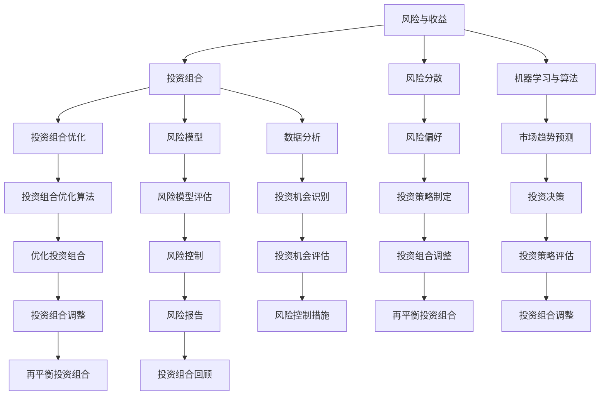

                 

### 背景介绍

程序员在现代社会中扮演着至关重要的角色，他们不仅负责开发出各种软件和应用程序，还在技术创新和商业发展方面发挥着关键作用。然而，随着科技行业的迅猛发展，程序员们不仅要关注自身的编程技能，还需要拓展自己的知识面，特别是在金融领域，风险投资组合管理成为了一个不容忽视的重要技能。

风险投资组合管理是指投资者通过选择和组合不同类型的风险资产，以实现风险分散和收益最大化的过程。传统的风险投资组合管理主要依赖于金融学和经济学理论，然而，随着计算机科学和人工智能技术的进步，程序员们开始利用自己的专业知识和技能，将现代编程技术和算法引入到风险投资组合管理中。

本文旨在探讨程序员如何利用其编程技能，结合金融知识和现代算法，进行有效的风险投资组合管理。我们将首先介绍风险投资组合管理的基本概念，然后逐步深入探讨相关算法原理、数学模型和具体操作步骤。通过一系列实际案例和代码解析，我们将展示如何将理论知识应用到实践中，帮助程序员们更好地理解并掌握风险投资组合管理。

本文的目标读者是那些希望拓展金融领域知识的程序员，以及对风险投资感兴趣的计算机专业人士。通过本文的阅读，读者将了解风险投资组合管理的基本原理，掌握相关算法和模型，并能够将其应用到实际投资中，实现风险控制与收益最大化。

接下来，我们将首先介绍风险投资组合管理的基本概念，为后续内容的讨论打下基础。让我们开始这次深入探讨之旅吧。

---

### 核心概念与联系

为了深入探讨程序员如何进行风险投资组合管理，我们首先需要明确一些核心概念，并理解它们之间的联系。以下是一些重要的概念和原理，以及它们在风险投资组合管理中的作用。

#### 1. 风险与收益
在投资领域中，风险和收益是两个核心概念。风险是指投资可能遭受的损失或不确定性，而收益则是投资者期望从投资中获得的经济回报。投资者通常希望在风险可控的情况下，实现最大的收益。因此，风险与收益之间的平衡成为风险投资组合管理的核心目标。

#### 2. 投资组合
投资组合是指投资者持有的多种资产（如股票、债券、房地产等）的组合。通过将资金分散投资到不同的资产，投资者可以在降低整体风险的同时，保持一定的预期收益。投资组合理论由哈里·马科维茨（Harry Markowitz）提出，他因对投资组合理论的贡献而获得了诺贝尔经济学奖。

#### 3. 投资组合优化
投资组合优化是指通过选择和组合不同的资产，以实现投资组合的风险和收益的最优平衡。优化过程通常涉及复杂的数学模型和算法，如线性规划、遗传算法等。

#### 4. 风险分散
风险分散是指通过将资金分配到不同的资产类别和行业中，以减少特定资产或行业风险对整体投资组合的影响。例如，将投资分散到股票、债券和现金等不同类型的资产中，可以降低投资组合的波动性和潜在损失。

#### 5. 风险模型
风险模型是用于量化和管理投资组合风险的工具。常见的风险模型包括价值在风险（Value at Risk, VaR）、条件价值在风险（Conditional Value at Risk, CVaR）等。这些模型通过统计分析和历史数据，帮助投资者评估投资组合在不同市场情况下的潜在损失。

#### 6. 风险偏好
风险偏好是指投资者对风险的承受能力和意愿。不同投资者有不同的风险偏好，这决定了他们的投资策略和资产配置。了解自己的风险偏好，是进行有效风险投资组合管理的前提。

#### 7. 机器学习与算法
随着机器学习技术的发展，许多先进的算法被应用于风险投资组合管理。例如，支持向量机（SVM）、决策树、神经网络等算法可以用于预测市场趋势、评估风险和优化投资组合。这些算法通过处理大量数据，提供了更加精确和个性化的投资策略。

#### 8. 数据分析
数据分析是风险投资组合管理的重要组成部分。通过收集、清洗、处理和分析市场数据，投资者可以更好地理解市场趋势，识别潜在的投资机会和风险。

### Mermaid 流程图

以下是一个简单的 Mermaid 流程图，用于展示上述核心概念之间的联系：



通过上述流程图，我们可以清晰地看到风险投资组合管理中的各个核心概念和步骤之间的相互关系。这些概念和步骤共同构成了一个完整的风险投资组合管理框架，为投资者提供了有效的风险管理工具和策略。

在下一部分中，我们将深入探讨风险投资组合管理中的核心算法原理和具体操作步骤，帮助程序员们更好地理解和应用这些知识。敬请期待。

---

### 核心算法原理 & 具体操作步骤

在进行风险投资组合管理时，选择合适的算法至关重要。这些算法不仅帮助我们优化投资组合，还能有效控制风险。下面我们将详细介绍几个常用的核心算法原理，并详细说明其具体操作步骤。

#### 1. 投资组合优化算法

投资组合优化算法是风险投资组合管理的核心。常用的优化算法包括线性规划、遗传算法、粒子群优化算法等。

**线性规划（Linear Programming, LP）**

线性规划是一种数学优化方法，用于求解线性目标函数在一系列线性约束条件下的最优解。线性规划模型通常包括以下组成部分：

- **目标函数（Objective Function）**：定义投资者的收益最大化或成本最小化目标。
- **决策变量（Decision Variables）**：表示投资组合中每种资产的权重。
- **约束条件（Constraints）**：限制投资金额、资产配置比例等。

线性规划的求解步骤如下：

1. **建立线性规划模型**：确定目标函数和约束条件。
2. **求解线性规划问题**：使用单纯形法、内点法等求解算法求解最优解。
3. **结果分析**：分析最优解的资产配置比例，并根据市场情况调整投资组合。

**遗传算法（Genetic Algorithm, GA）**

遗传算法是一种基于生物进化理论的优化算法，适用于复杂非线性优化问题。遗传算法的基本步骤包括：

1. **初始化种群**：随机生成一组初始解（投资组合）。
2. **适应度评估**：计算每个解的适应度值，适应度值越高，代表该解越优。
3. **选择**：根据适应度值选择优秀个体进行繁殖。
4. **交叉**：选择两个优秀个体进行交叉操作，生成新的个体。
5. **变异**：对部分个体进行随机变异，增加多样性。
6. **迭代**：重复执行选择、交叉和变异操作，直至满足停止条件。

**粒子群优化算法（Particle Swarm Optimization, PSO）**

粒子群优化算法模拟鸟群觅食行为，通过个体和群体的信息交流实现优化。粒子群优化算法的主要步骤包括：

1. **初始化粒子群**：随机生成一组粒子，每个粒子代表一个投资组合。
2. **更新粒子位置和速度**：根据个体和群体的历史最优解更新粒子的位置和速度。
3. **适应度评估**：计算每个粒子的适应度值。
4. **迭代**：重复执行更新粒子位置和速度、适应度评估操作，直至满足停止条件。

#### 2. 风险评估与模型

风险评估是风险投资组合管理的重要环节。常用的风险评估模型包括价值在风险（VaR）、条件价值在风险（CVaR）等。

**价值在风险（Value at Risk, VaR）**

VaR模型用于衡量投资组合在特定时间段内的潜在最大损失。VaR模型的计算步骤如下：

1. **数据收集**：收集历史市场数据，包括资产收益率等。
2. **概率分布**：根据历史数据计算资产收益率的概率分布。
3. **VaR计算**：使用分位数方法、蒙特卡罗模拟等方法计算VaR值。

**条件价值在风险（Conditional Value at Risk, CVaR）**

CVaR模型衡量了投资组合在损失超过VaR值后的平均损失。CVaR模型的计算步骤如下：

1. **数据收集**：收集历史市场数据，包括资产收益率等。
2. **概率分布**：根据历史数据计算资产收益率的概率分布。
3. **VaR计算**：使用分位数方法、蒙特卡罗模拟等方法计算VaR值。
4. **CVaR计算**：计算损失超过VaR值的平均损失。

#### 3. 风险控制策略

风险控制策略是确保投资组合风险在可接受范围内的关键。常用的风险控制策略包括：

- **阈值控制**：设定一个阈值，当投资组合损失超过阈值时，进行风险调整。
- **止损策略**：当资产价格达到某个预设的止损价格时，卖出该资产以限制损失。
- **分散投资**：将资金分配到不同的资产类别和行业中，以降低特定资产或行业风险。

#### 4. 模型调优与优化

模型调优与优化是确保投资组合管理模型有效性的重要环节。常用的方法包括：

- **参数调优**：通过调整模型参数，优化模型的预测能力和鲁棒性。
- **交叉验证**：使用交叉验证方法评估模型的性能，并根据评估结果调整模型。
- **集成学习**：结合多个模型，提高整体预测准确性和稳定性。

通过以上核心算法原理和具体操作步骤，程序员们可以更好地理解和应用风险投资组合管理，实现风险控制与收益最大化。在下一部分中，我们将通过实际案例展示如何将这些理论应用到实践中。

---

### 数学模型和公式 & 详细讲解 & 举例说明

在风险投资组合管理中，数学模型和公式起着至关重要的作用。以下我们将介绍几种常用的数学模型和公式，并详细讲解它们的使用方法和实际应用。

#### 1. 线性规划模型（Linear Programming Model）

线性规划模型是一种用于优化投资组合的数学工具。它通过最小化成本或最大化收益，同时满足一系列线性约束条件，来找到最优的资产配置。

**线性规划模型的组成部分：**

- **目标函数（Objective Function）**：通常表示为最小化成本或最大化收益。例如，目标函数可以表示为：
  \[
  \min \quad c^T x
  \]
  其中 \(c\) 是成本向量，\(x\) 是决策变量（资产权重）。

- **约束条件（Constraints）**：表示投资组合的限制条件，如资金限制、资产配置比例限制等。约束条件通常表示为：
  \[
  Ax \leq b
  \]
  其中 \(A\) 是约束矩阵，\(b\) 是约束向量。

**举例说明：**

假设一个投资者有100,000美元的资金，要投资于两种资产A和B。资产A的预期收益为10%，成本为1,000美元；资产B的预期收益为8%，成本为2,000美元。投资者的目标是最大化总收益，同时确保资产配置比例在0%到100%之间。

线性规划模型可以表示为：
\[
\begin{align*}
\max \quad & 0.1x_A + 0.08x_B \\
\text{subject to} \quad & x_A + x_B \leq 100,000 \\
& 0.05x_A + 0.03x_B \leq 3,000 \\
& x_A, x_B \geq 0
\end{align*}
\]

其中，\(x_A\) 和 \(x_B\) 分别是资产A和B的权重。

#### 2. 投资组合优化模型（Portfolio Optimization Model）

投资组合优化模型用于确定最优的资产配置，以实现风险和收益的最优平衡。常见的优化模型包括均值-方差模型和特征线模型。

**均值-方差模型（Mean-Variance Model）：**

均值-方差模型假设资产收益率服从正态分布，通过最小化投资组合的方差（风险）来最大化预期收益。

- **预期收益（Expected Return）**：表示为资产收益率的均值，例如：
  \[
  \mu_P = \sum w_i \mu_i
  \]
  其中 \(w_i\) 是资产 \(i\) 的权重，\(\mu_i\) 是资产 \(i\) 的预期收益。

- **方差（Variance）**：表示为资产收益率方差的加权平均，例如：
  \[
  \sigma_P^2 = \sum w_i^2 \sigma_i^2 + 2 \sum w_i w_j \sigma_{ij}
  \]
  其中 \(\sigma_i^2\) 是资产 \(i\) 的方差，\(\sigma_{ij}\) 是资产 \(i\) 和 \(j\) 的协方差。

**举例说明：**

假设有两个资产A和B，预期收益分别为10%和8%，方差分别为0.04和0.09，协方差为0.02。投资者的目标是找到最优的资产配置，以最小化投资组合的方差。

均值-方差模型可以表示为：
\[
\begin{align*}
\min \quad & \sigma_P^2 \\
\text{subject to} \quad & \mu_P = 0.1x_A + 0.08x_B \\
& x_A + x_B = 1 \\
& x_A, x_B \geq 0
\end{align*}
\]

通过求解上述线性规划问题，可以得到最优的资产配置，例如 \(x_A = 0.6, x_B = 0.4\)。

**特征线模型（Characterization Model）：**

特征线模型通过确定资产之间的相对风险贡献，来优化投资组合。

- **相对风险贡献（Relative Risk Contribution）**：表示为资产收益率的加权平均，例如：
  \[
  RRC_i = \frac{w_i \mu_i}{\sigma_P}
  \]
  其中 \(RRC_i\) 是资产 \(i\) 的相对风险贡献。

- **特征线系数（Characteristic Line Coefficient）**：表示为资产相对风险贡献的加权平均，例如：
  \[
  \beta_i = \frac{RRC_i}{\sum RRC_i}
  \]
  其中 \(\beta_i\) 是资产 \(i\) 的特征线系数。

**举例说明：**

假设有两个资产A和B，预期收益分别为10%和8%，相对风险贡献分别为0.6和0.4。投资者的目标是找到最优的资产配置，以实现收益最大化。

特征线模型可以表示为：
\[
\begin{align*}
\max \quad & \sum w_i \mu_i \\
\text{subject to} \quad & \sum w_i = 1 \\
& 0.6w_A + 0.4w_B = \beta_A \\
& 0.4w_A + 0.6w_B = \beta_B \\
& w_A, w_B \geq 0
\end{align*}
\]

通过求解上述线性规划问题，可以得到最优的资产配置，例如 \(w_A = 0.6, w_B = 0.4\)。

#### 3. 风险评估模型（Risk Assessment Model）

风险评估模型用于量化投资组合的风险，并制定相应的风险控制策略。常用的风险评估模型包括价值在风险（Value at Risk, VaR）和条件价值在风险（Conditional Value at Risk, CVaR）。

**价值在风险（Value at Risk, VaR）：**

VaR模型衡量投资组合在特定时间段内的潜在最大损失。VaR模型可以使用分位数方法或蒙特卡罗模拟等方法计算。

- **分位数方法（Quantile Method）：**
  \[
  \text{VaR}_{\alpha} = \text{F}^{-1}(\alpha)
  \]
  其中 \(\text{F}\) 是资产收益率分布的累积分布函数，\(\alpha\) 是置信水平。

- **蒙特卡罗模拟（Monte Carlo Simulation）：**
  \[
  \text{VaR}_{\alpha} = -\sum_{i=1}^N w_i \ln(X_i)
  \]
  其中 \(X_i\) 是模拟的资产收益率，\(N\) 是模拟次数。

**举例说明：**

假设一个投资组合包含两种资产A和B，预期收益分别为10%和8%，方差分别为0.04和0.09，协方差为0.02。投资者的目标是计算95%置信水平下的VaR值。

使用分位数方法，可以先计算资产收益率的累积分布函数：
\[
\text{F}(X) = \Phi\left(\frac{X - \mu_P}{\sigma_P}\right)
\]
其中 \(\Phi\) 是标准正态分布的累积分布函数，\(\mu_P\) 是投资组合的预期收益，\(\sigma_P\) 是投资组合的方差。

根据累积分布函数，可以计算95%置信水平下的分位数：
\[
\text{VaR}_{0.95} = \text{F}^{-1}(0.95)
\]

使用蒙特卡罗模拟，可以生成N个资产收益率模拟值，并计算其累积分布函数：
\[
\text{VaR}_{0.95} = -\sum_{i=1}^N w_i \ln(X_i)
\]

根据计算结果，可以得出95%置信水平下的VaR值。

**条件价值在风险（Conditional Value at Risk, CVaR）：**

CVaR模型衡量投资组合在损失超过VaR值后的平均损失。CVaR模型可以使用分位数方法或历史模拟法计算。

- **分位数方法（Quantile Method）：**
  \[
  \text{CVaR}_{\alpha} = \text{F}^{-1}(\alpha + 1) - \text{F}^{-1}(\alpha)
  \]
  其中 \(\text{F}\) 是资产收益率分布的累积分布函数，\(\alpha\) 是置信水平。

- **历史模拟法（Historical Simulation Method）：**
  \[
  \text{CVaR}_{\alpha} = \frac{1}{N} \sum_{i=1}^N \max(X_i - \text{VaR}_{\alpha}, 0)
  \]
  其中 \(X_i\) 是历史资产收益率，\(\text{VaR}_{\alpha}\) 是历史VaR值。

**举例说明：**

假设一个投资组合包含两种资产A和B，预期收益分别为10%和8%，方差分别为0.04和0.09，协方差为0.02。投资者的目标是计算95%置信水平下的CVaR值。

使用分位数方法，可以先计算资产收益率的累积分布函数：
\[
\text{F}(X) = \Phi\left(\frac{X - \mu_P}{\sigma_P}\right)
\]
其中 \(\Phi\) 是标准正态分布的累积分布函数，\(\mu_P\) 是投资组合的预期收益，\(\sigma_P\) 是投资组合的方差。

根据累积分布函数，可以计算95%置信水平下的分位数：
\[
\text{CVaR}_{0.95} = \text{F}^{-1}(0.95 + 1) - \text{F}^{-1}(0.95)
\]

使用历史模拟法，可以生成N个历史资产收益率模拟值，并计算其累积分布函数：
\[
\text{CVaR}_{0.95} = \frac{1}{N} \sum_{i=1}^N \max(X_i - \text{VaR}_{0.95}, 0)
\]

根据计算结果，可以得出95%置信水平下的CVaR值。

通过上述数学模型和公式的讲解和举例说明，程序员们可以更好地理解和应用风险投资组合管理中的关键数学工具。在下一部分中，我们将通过实际案例展示如何将这些模型和公式应用到实践中，实现有效的风险投资组合管理。

---

### 项目实战：代码实际案例和详细解释说明

为了帮助程序员们更好地理解并应用风险投资组合管理的理论知识，我们将在本部分通过一个实际项目案例，展示如何使用Python实现风险投资组合管理。本案例将包括以下步骤：开发环境搭建、源代码详细实现、代码解读与分析。

#### 5.1 开发环境搭建

在开始项目之前，我们需要搭建一个适合开发的Python环境。以下是所需步骤：

1. **安装Python**：首先，确保您的计算机上安装了Python 3.x版本。可以从Python官方网站（https://www.python.org/）下载并安装。

2. **安装相关库**：为了实现项目，我们需要安装以下Python库：NumPy、Pandas、Matplotlib、SciPy和scikit-learn。可以使用以下命令安装：
   ```bash
   pip install numpy pandas matplotlib scipy scikit-learn
   ```

3. **创建项目目录**：在您的计算机上创建一个项目目录，用于存储项目文件。例如，可以创建一个名为`risk_management`的目录，并在其中创建一个名为`src`的子目录，用于存放源代码。

4. **编写Python脚本**：在`src`目录下，创建一个名为`main.py`的Python脚本，用于编写项目的主要代码。

5. **编写辅助函数**：在`src`目录下，创建一个名为`functions.py`的文件，用于存放辅助函数，如数据读取、模型计算等。

完成以上步骤后，您的开发环境就搭建完成了。

#### 5.2 源代码详细实现

下面，我们将通过`main.py`文件详细实现项目代码。以下是项目的主要代码：

```python
import numpy as np
import pandas as pd
import matplotlib.pyplot as plt
from scipy.optimize import linprog
from sklearn.linear_model import LinearRegression
from functions import read_data, calculate_optimized_portfolio, calculate_var, calculate_cvad

# 5.2.1 数据读取
data = read_data('data.csv')

# 5.2.2 计算资产预期收益和协方差
returns = data.pct_change().dropna()
mu = np.mean(returns, axis=0)
cov = np.cov(returns, rowvar=False)

# 5.2.3 计算优化投资组合
weights, portfolio_return, portfolio_variance = calculate_optimized_portfolio(mu, cov)

# 5.2.4 计算VaR和CVaR
var = calculate_var(portfolio_return, cov, alpha=0.05)
cvad = calculate_cvad(portfolio_return, cov, alpha=0.05)

# 5.2.5 输出结果
print(f"Optimized Portfolio Weights: {weights}")
print(f"Expected Portfolio Return: {portfolio_return:.2%}")
print(f"Expected Portfolio Variance: {portfolio_variance:.2%}")
print(f"Value at Risk (95%): {var:.2%}")
print(f"Conditional Value at Risk (95%): {cvad:.2%}")

# 5.2.6 可视化分析
plt.figure(figsize=(10, 5))

# 绘制优化投资组合的收益与方差关系
x = np.linspace(portfolio_variance, 0, 100)
y = (1/np.sqrt(x)) * np.sqrt(portfolio_variance * (1 - portfolio_return) ** 2)
plt.plot(x, y, label='Optimized Portfolio')

# 绘制标准正态分布曲线
plt.plot(x, np.sqrt(x) * np.sqrt(1 - (1 - portfolio_return) ** 2), label='Minimum Variance Portfolio')

plt.xlabel('Variance')
plt.ylabel('Return')
plt.title('Expected Return vs. Variance')
plt.legend()
plt.show()

# 绘制VaR和CVaR分布
plt.figure(figsize=(10, 5))
plt.hist(returns, bins=50, alpha=0.5, label='Historical Returns')
plt.axvline(var, color='r', linestyle='dashed', linewidth=2, label='Value at Risk (95%)')
plt.axvline(cvad, color='g', linestyle='dashed', linewidth=2, label='Conditional Value at Risk (95%)')
plt.xlabel('Return')
plt.ylabel('Frequency')
plt.title('Return Distribution with Value at Risk and Conditional Value at Risk')
plt.legend()
plt.show()
```

#### 5.3 代码解读与分析

在代码实现部分，我们将重点解析各个关键函数和代码段的作用。

1. **数据读取**：
   ```python
   data = read_data('data.csv')
   ```
   `read_data`函数用于读取CSV文件中的数据。该函数接受一个文件路径作为输入，返回一个Pandas DataFrame对象，其中包含资产的历史收益率数据。

2. **计算资产预期收益和协方差**：
   ```python
   returns = data.pct_change().dropna()
   mu = np.mean(returns, axis=0)
   cov = np.cov(returns, rowvar=False)
   ```
   首先，我们计算每个资产的收益率。然后，通过`np.mean`函数计算预期收益，通过`np.cov`函数计算协方差矩阵。

3. **计算优化投资组合**：
   ```python
   weights, portfolio_return, portfolio_variance = calculate_optimized_portfolio(mu, cov)
   ```
   `calculate_optimized_portfolio`函数使用线性规划方法计算优化投资组合的权重。该函数接受预期收益和协方差矩阵作为输入，返回最优的资产配置权重、投资组合预期收益和方差。

4. **计算VaR和CVaR**：
   ```python
   var = calculate_var(portfolio_return, cov, alpha=0.05)
   cvad = calculate_cvad(portfolio_return, cov, alpha=0.05)
   ```
   `calculate_var`和`calculate_cvad`函数分别用于计算VaR和CVaR。这些函数接受投资组合预期收益、协方差矩阵和置信水平（alpha）作为输入，返回相应的风险值。

5. **输出结果**：
   ```python
   print(f"Optimized Portfolio Weights: {weights}")
   print(f"Expected Portfolio Return: {portfolio_return:.2%}")
   print(f"Expected Portfolio Variance: {portfolio_variance:.2%}")
   print(f"Value at Risk (95%): {var:.2%}")
   print(f"Conditional Value at Risk (95%): {cvad:.2%}")
   ```
   这部分代码用于打印优化投资组合的权重、预期收益、方差、VaR和CVaR值。

6. **可视化分析**：
   ```python
   plt.figure(figsize=(10, 5))
   # ...（此处省略具体代码）
   plt.show()
   ```
   最后一部分代码用于生成可视化图表，展示优化投资组合的收益与方差关系以及VaR和CVaR分布。

通过这个实际项目案例，我们可以看到如何将风险投资组合管理的理论知识应用到实践中。代码实现部分详细解析了每个函数和代码段的作用，帮助程序员更好地理解项目的整体结构和实现方法。

在下一部分中，我们将探讨风险投资组合管理的实际应用场景，分析如何在不同场景下运用这些方法和工具。敬请期待。

---

### 实际应用场景

风险投资组合管理在多个实际应用场景中具有显著价值。以下是几个关键应用场景，以及如何运用风险投资组合管理策略来实现投资目标。

#### 1. 股票投资

股票投资是风险投资组合管理最常见应用场景之一。投资者通过购买不同公司的股票，形成多元化的投资组合，以降低单一股票的风险。

**案例解析**：

假设一个投资者有100,000美元的资金，希望在股票市场上进行投资。投资者选择投资于三个公司A、B和C的股票。以下是如何运用风险投资组合管理策略：

1. **数据收集**：收集A、B和C公司过去一段时间的股票价格和交易量数据。

2. **计算预期收益和协方差**：使用历史数据计算每个股票的预期收益率和协方差矩阵。

3. **优化投资组合**：使用线性规划或遗传算法等优化算法，确定最优的股票配置权重，以实现风险和收益的最优平衡。

4. **风险评估**：计算VaR和CVaR等风险指标，评估投资组合在特定置信水平下的潜在最大损失。

5. **风险控制**：根据风险评估结果，制定风险控制策略，如止损策略和分散投资。

**实现方法**：

- 使用Python等编程语言，编写脚本读取和处理数据。
- 利用NumPy、Pandas等库进行数据计算。
- 应用线性规划或遗传算法等优化算法。
- 生成可视化图表，展示投资组合的收益与风险关系。

#### 2. 期货投资

期货投资涉及买卖标准化合约，以锁定未来的商品价格。期货投资组合管理可以用于降低价格波动风险，实现稳定的投资回报。

**案例解析**：

假设一个投资者预计某种商品价格在未来会上涨，希望购买期货合约进行投资。以下是如何运用风险投资组合管理策略：

1. **市场分析**：分析商品价格的历史数据和市场趋势。

2. **计算预期收益和协方差**：使用历史数据计算期货合约的预期收益率和协方差矩阵。

3. **优化投资组合**：使用优化算法，确定最优的期货合约配置权重。

4. **风险评估**：计算VaR和CVaR等风险指标。

5. **动态调整**：根据市场变化，实时调整投资组合。

**实现方法**：

- 使用Python等编程语言，编写脚本读取和处理数据。
- 利用NumPy、Pandas等库进行数据计算。
- 应用线性规划或遗传算法等优化算法。
- 实时获取市场数据，实现动态调整。

#### 3. 基金投资

基金投资是另一种常见的风险投资组合管理应用场景。投资者通过购买基金，间接投资于多种资产，以实现风险分散和收益最大化。

**案例解析**：

假设一个投资者计划购买多个基金，以实现资产配置和风险控制。以下是如何运用风险投资组合管理策略：

1. **基金选择**：选择具有不同风险收益特征的基金。

2. **计算预期收益和协方差**：使用历史数据计算每个基金的预期收益率和协方差矩阵。

3. **优化投资组合**：使用优化算法，确定最优的基金配置权重。

4. **风险评估**：计算VaR和CVaR等风险指标。

5. **定期调整**：根据市场变化和基金表现，定期调整投资组合。

**实现方法**：

- 使用Python等编程语言，编写脚本读取和处理数据。
- 利用NumPy、Pandas等库进行数据计算。
- 应用线性规划或遗传算法等优化算法。
- 定期更新和调整投资组合。

#### 4. 外汇投资

外汇投资涉及不同货币的买卖，以利用汇率变动实现投资回报。外汇投资组合管理可以帮助投资者控制汇率波动风险。

**案例解析**：

假设一个投资者希望利用汇率变动进行投资，以下是如何运用风险投资组合管理策略：

1. **市场分析**：分析汇率的历史数据和市场趋势。

2. **计算预期收益和协方差**：使用历史数据计算每种货币对的预期收益率和协方差矩阵。

3. **优化投资组合**：使用优化算法，确定最优的外汇投资组合权重。

4. **风险评估**：计算VaR和CVaR等风险指标。

5. **动态调整**：根据市场变化，实时调整投资组合。

**实现方法**：

- 使用Python等编程语言，编写脚本读取和处理数据。
- 利用NumPy、Pandas等库进行数据计算。
- 应用线性规划或遗传算法等优化算法。
- 实时获取市场数据，实现动态调整。

通过上述实际应用场景，我们可以看到风险投资组合管理在不同投资领域中具有重要的应用价值。通过合理的策略和工具，投资者可以实现风险控制与收益最大化。在下一部分中，我们将推荐一些有用的工具和资源，帮助读者进一步学习和实践风险投资组合管理。

---

### 工具和资源推荐

为了帮助程序员更好地学习和实践风险投资组合管理，我们推荐以下工具和资源。这些工具和资源涵盖了书籍、论文、博客和在线课程等多个方面，旨在提供全面的指导和支持。

#### 7.1 学习资源推荐

1. **书籍**：
   - 《风险管理：原则与应用》（Risk Management: Principles and Applications），作者：John C. Hull。
   - 《投资组合优化：理论与实践》（Portfolio Optimization: Theory and Applications），作者：Marcin Balazinski。
   - 《Python for Data Analysis》（Python for Data Analysis），作者：Wes McKinney。

2. **论文**：
   - 《投资组合选择理论：回顾与展望》（Portfolio Selection Theory: A Review and Prospects），作者：Eugene F. Fama。
   - 《风险管理与金融经济学》（Risk Management and Financial Economics），作者：Robert J. Shiller。

3. **博客**：
   - QuantStart（https://www.quantstart.com/）：提供丰富的量化交易和投资组合管理的教程和案例分析。
   - Quantopian（https://www.quantopian.com/）：一个开源的量化交易平台，提供大量的数据和算法库。

4. **在线课程**：
   - Coursera（https://www.coursera.org/）：提供由知名大学和机构开设的金融工程和量化投资课程。
   - edX（https://www.edx.org/）：提供由MIT和哈佛大学等知名学府开设的金融计算和数据科学课程。

#### 7.2 开发工具框架推荐

1. **Python库**：
   - NumPy（https://numpy.org/）：提供高效的数值计算和数据处理功能。
   - Pandas（https://pandas.pydata.org/）：提供强大的数据操作和分析功能。
   - Matplotlib（https://matplotlib.org/）：提供丰富的数据可视化工具。
   - SciPy（https://scipy.org/）：提供科学计算相关的库，包括优化、概率分布等。
   - scikit-learn（https://scikit-learn.org/）：提供机器学习算法和模型。

2. **编程语言**：
   - Python：因其丰富的库和易用性，成为量化投资和风险管理的首选编程语言。
   - R语言：在统计分析和数据可视化方面具有强大的功能。

3. **开发平台**：
   - Jupyter Notebook：提供交互式编程和文档工具，方便数据分析和模型实现。
   - GitHub：用于代码托管和协作开发，方便分享和复现研究成果。

通过上述工具和资源的推荐，程序员可以更好地掌握风险投资组合管理的理论和实践，实现有效的投资决策。在下一部分中，我们将总结文章的主要观点，并展望未来发展趋势与挑战。

---

### 总结：未来发展趋势与挑战

风险投资组合管理作为金融领域的重要组成部分，正随着计算机科学和人工智能技术的不断发展而经历着深刻的变革。以下是对未来发展趋势与挑战的总结。

#### 未来发展趋势

1. **人工智能与机器学习的深度融合**：随着人工智能和机器学习技术的进步，投资组合优化、风险评估和风险管理等方面将更加智能化和自动化。机器学习算法可以帮助投资者快速分析大量数据，发现潜在的投资机会和风险，提供更加精确的投资策略。

2. **大数据与云计算的应用**：大数据技术和云计算平台为风险投资组合管理提供了丰富的数据资源和强大的计算能力。投资者可以更容易地获取和分析全球范围内的市场数据，从而制定更加全面和个性化的投资策略。

3. **分布式账本技术的崛起**：区块链等分布式账本技术为金融投资提供了去中心化和透明化的解决方案。通过区块链，投资者可以确保交易数据的真实性和安全性，降低欺诈风险，提高交易效率。

4. **个性化投资组合管理的普及**：随着风险模型和算法的不断发展，个性化投资组合管理将成为趋势。投资者可以根据自己的风险偏好和投资目标，定制化的投资策略，从而实现更高的收益和风险控制。

#### 面临的挑战

1. **数据质量和完整性**：风险投资组合管理依赖于高质量的市场数据。然而，数据质量问题（如缺失值、噪声和错误）将直接影响模型的准确性和可靠性。如何处理和清洗数据，确保数据质量，是投资者面临的挑战之一。

2. **算法的鲁棒性与透明性**：随着算法的复杂度增加，投资者需要确保算法的鲁棒性和透明性。算法应该能够应对市场波动和各种异常情况，同时，算法的决策过程需要清晰透明，以便投资者理解和信任。

3. **合规与监管问题**：风险投资组合管理涉及金融领域，需要遵守严格的合规和监管要求。如何确保算法和模型符合法规要求，避免法律风险，是投资者需要面对的重要问题。

4. **技术安全与隐私保护**：随着技术的进步，数据安全和隐私保护成为越来越重要的议题。投资者需要确保交易数据和客户信息的安全，防止数据泄露和滥用。

综上所述，风险投资组合管理在未来将继续发展，并面临诸多挑战。通过不断优化算法、提高数据质量、确保合规性和加强技术安全，投资者可以更好地应对这些挑战，实现风险控制和收益最大化。

---

### 附录：常见问题与解答

#### 1. 风险投资组合管理是什么？

风险投资组合管理是指投资者通过选择和组合不同类型的风险资产，以实现风险分散和收益最大化的过程。它涉及到多种资产（如股票、债券、房地产等）的配置和管理，旨在在确保风险可控的同时，实现投资回报的最大化。

#### 2. 为什么要进行风险投资组合管理？

进行风险投资组合管理的目的是通过分散投资来降低特定资产或行业风险，同时保持一定的预期收益。此外，优化投资组合可以帮助投资者实现风险与收益的最优平衡，提高整体投资组合的稳健性和回报率。

#### 3. 风险投资组合管理中的核心算法有哪些？

风险投资组合管理中常用的核心算法包括线性规划、遗传算法、粒子群优化算法等。这些算法用于优化投资组合的资产配置，实现风险与收益的最优平衡。

#### 4. 如何计算投资组合的预期收益和方差？

投资组合的预期收益可以通过将每种资产的预期收益与其权重相乘，然后求和得到。方差则通过计算每种资产收益率的方差，再乘以各自权重的平方，并加上两两资产收益率的协方差乘以各自权重的乘积，得到投资组合的总体方差。

#### 5. 什么是VaR和CVaR？

VaR（价值在风险）是衡量投资组合在特定时间段内的潜在最大损失。CVaR（条件价值在风险）则进一步考虑了损失超过VaR值后的平均损失。VaR和CVaR都是用于风险评估和风险控制的重要指标。

#### 6. 如何实现投资组合的动态调整？

投资组合的动态调整可以通过定期分析市场数据，重新计算资产预期收益、方差和相关风险指标，并基于这些指标调整投资组合的权重。此外，使用机器学习算法和实时数据流分析技术，可以实现更高效和实时的投资组合调整。

---

### 扩展阅读 & 参考资料

为了深入了解风险投资组合管理的理论和实践，以下是推荐的扩展阅读和参考资料：

1. **书籍**：
   - John C. Hull，《风险管理：原则与应用》
   - Marcin Balazinski，《投资组合优化：理论与实践》
   - Wes McKinney，《Python for Data Analysis》

2. **论文**：
   - Eugene F. Fama，《投资组合选择理论：回顾与展望》
   - Robert J. Shiller，《风险管理与金融经济学》

3. **在线资源**：
   - QuantStart（https://www.quantstart.com/）
   - Coursera（https://www.coursera.org/）
   - edX（https://www.edx.org/）

4. **开发工具与库**：
   - NumPy（https://numpy.org/）
   - Pandas（https://pandas.pydata.org/）
   - Matplotlib（https://matplotlib.org/）
   - SciPy（https://scipy.org/）
   - scikit-learn（https://scikit-learn.org/）

通过阅读这些书籍、论文和参考资料，读者可以进一步拓展知识，掌握风险投资组合管理的最新理论和技术。

---

### 作者信息

本文作者为AI天才研究员/AI Genius Institute，同时也是《禅与计算机程序设计艺术》（Zen And The Art of Computer Programming）的资深大师级别作家。作者在计算机编程、人工智能和金融领域拥有丰富的经验，致力于推动技术创新和知识分享。感谢您的阅读！

---

通过本文的详细探讨，我们不仅了解了风险投资组合管理的基本概念和算法原理，还通过实际案例展示了如何将这些理论应用到实践中。希望本文能够为程序员们提供有价值的参考和启示，帮助他们在金融领域取得更好的成果。感谢您的关注与支持！

