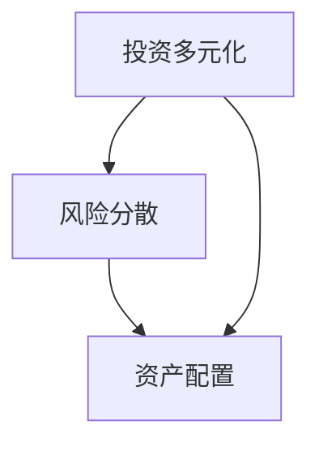

                 

# 程序员的投资多元化：beyond股票

> 关键词：投资，多元化，风险分散，股票，加密货币，债券，黄金，房地产

> 摘要：本文旨在探讨程序员如何通过投资多元化来降低风险并实现财富增值。我们将分析股票以外的其他投资渠道，包括加密货币、债券、黄金和房地产，并讨论如何合理配置投资组合以实现最佳风险回报比。

## 1. 背景介绍

在当今经济全球化的背景下，程序员作为一个高收入的职业群体，面临着财富管理的挑战。传统的投资渠道如股票市场虽然可以带来较高的收益，但也伴随着较高的风险。为了实现财富的稳定增长，程序员需要探索更多的投资方式，实行投资多元化策略，以降低单一投资渠道带来的风险。

投资多元化指的是通过将资金分散投资于不同的资产类别，如股票、债券、黄金、房地产等，从而降低投资组合的整体风险。在金融市场中，没有任何一种资产能够保证持续增长，而投资多元化可以在不同市场环境中实现风险分散，提高投资组合的抗风险能力。

本文将首先介绍投资多元化的概念和重要性，然后探讨程序员可以投资的其他资产类别，包括加密货币、债券、黄金和房地产，并提供一些实际操作建议。最后，我们将总结未来投资多元化的发展趋势与挑战，为程序员的财富管理提供有益的参考。

## 2. 核心概念与联系

### 2.1 投资多元化

投资多元化（Diversification）是指将资金分配到多个不同的资产类别或证券中，以降低投资组合的整体风险。其核心思想是通过投资多种不同的资产，使得某些资产的亏损可以被其他资产的收益所抵消，从而实现风险分散。

投资多元化的理论基础是现代投资组合理论（Modern Portfolio Theory，MPT），由哈里·马科维茨（Harry Markowitz）在1952年提出。MPT认为，投资组合的风险和收益取决于资产之间的相关性。如果不同资产之间存在负相关性，即一种资产的价格下跌时，另一种资产的价格上升，那么投资组合的风险将低于单一资产的风险。

### 2.2 风险分散

风险分散（Risk Diversification）是投资多元化的实现手段，通过将资金分散投资于多个不同行业、不同规模、不同风险类型的资产，以减少特定行业或市场波动对投资组合的冲击。

风险分散的理论基础是假设不同资产之间并不是完全正相关，也就是说，不同资产的价格波动是独立的。这样一来，当某个行业或市场出现下跌时，其他行业或市场的资产可能会上涨，从而减少整个投资组合的损失。

### 2.3 资产配置

资产配置（Asset Allocation）是指根据投资者的风险承受能力和投资目标，将资金分配到不同的资产类别中。有效的资产配置可以在风险和收益之间取得平衡，是实现投资多元化的重要手段。

资产配置的理论基础包括投资者行为理论、均值-方差模型、资本资产定价模型（CAPM）等。不同的资产配置策略可以适应不同的市场环境和投资者的需求。

### 2.4 Mermaid 流程图

下面是一个简单的Mermaid流程图，展示了投资多元化、风险分散和资产配置之间的关系。



## 3. 核心算法原理 & 具体操作步骤

### 3.1 投资多元化算法原理

投资多元化算法的核心原理是资产分配。具体步骤如下：

1. **确定投资目标和风险承受能力**：投资者需要根据自己的投资目标和风险承受能力来设定投资策略。
2. **选择资产类别**：根据市场环境和个人偏好，选择多种不同类型的资产，如股票、债券、黄金、房地产等。
3. **计算资产权重**：根据每种资产的预期收益和风险，计算出每种资产在投资组合中的权重。
4. **分配资金**：将资金按照计算出的资产权重分配到各个资产类别中。

### 3.2 投资多元化具体操作步骤

1. **评估自己的风险承受能力**：投资者可以通过回答一系列问题来评估自己的风险承受能力，如预期投资期限、投资金额、对市场波动的承受能力等。
2. **研究市场环境**：了解当前市场的经济形势、行业趋势和政策变化，以便选择合适的投资资产。
3. **选择资产类别**：根据市场环境和个人偏好，选择股票、债券、黄金、房地产等不同类型的资产。
4. **计算资产权重**：使用历史数据和市场预期，计算出每种资产在投资组合中的权重。可以使用均值-方差模型、资本资产定价模型（CAPM）等方法来辅助计算。
5. **分配资金**：按照计算出的资产权重，将资金分配到各个资产类别中。在实际操作中，投资者可能需要定期调整资产配置，以应对市场变化。

### 3.3 举例说明

假设一个程序员想要进行投资多元化，他的风险承受能力为中等，投资期限为5年，初始投资金额为100万元。根据市场环境和个人偏好，他选择了以下资产类别：

- 股票：40%
- 债券：30%
- 黄金：10%
- 房地产：10%
- 其他：10%

那么，他可以将100万元按照以下比例进行分配：

- 股票：40万元（40% × 100万元）
- 债券：30万元（30% × 100万元）
- 黄金：10万元（10% × 100万元）
- 房地产：10万元（10% × 100万元）
- 其他：10万元（10% × 100万元）

通过这种方式，程序员可以实现投资多元化，降低单一投资渠道带来的风险。

## 4. 数学模型和公式 & 详细讲解 & 举例说明

### 4.1 数学模型和公式

在投资多元化中，常用的数学模型和公式包括：

1. **均值-方差模型（Mean-Variance Model）**：
   - 收益率（Expected Return）: \( E(R_i) = \sum_{i=1}^{n} w_i \cdot r_i \)
   - 方差（Variance）: \( \sigma^2 = \sum_{i=1}^{n} (w_i \cdot r_i - E(R))^2 \)
   - 标准差（Standard Deviation）: \( \sigma = \sqrt{\sigma^2} \)
   - 调整后收益率（Adjusted Return）: \( AR_i = \frac{r_i - \mu}{\sigma} \)

2. **资本资产定价模型（Capital Asset Pricing Model，CAPM）**：
   - 无风险收益率（Risk-Free Rate）: \( R_f \)
   - 贝塔系数（Beta）: \( \beta_i = \frac{Cov(R_i, R_m)}{Var(R_m)} \)
   - 期望收益率（Expected Return）: \( E(R_i) = R_f + \beta_i (E(R_m) - R_f) \)

### 4.2 详细讲解

**均值-方差模型**用于分析投资组合的收益和风险。其中，收益率是指资产在一段时间内的平均收益，方差是指资产收益的波动性，标准差是方差的平方根，表示收益的离散程度。调整后收益率考虑了风险因素，可以用来比较不同资产的风险收益水平。

**资本资产定价模型**用于估算资产在风险市场中的合理期望收益。其中，无风险收益率是指投资者在无风险情况下可以获得的收益，贝塔系数表示资产收益率与市场收益率之间的相关性。期望收益率是在风险市场中的合理预期收益。

### 4.3 举例说明

假设一个投资组合由两种资产组成，股票A和债券B。股票A的预期收益率为15%，方差为0.04；债券B的预期收益率为5%，方差为0.01。投资组合中，股票A占60%，债券B占40%。

首先，计算投资组合的收益率：

\( E(R) = 0.6 \times 0.15 + 0.4 \times 0.05 = 0.095 \)

然后，计算投资组合的方差和标准差：

\( \sigma^2 = 0.6^2 \times 0.04 + 0.4^2 \times 0.01 = 0.0216 \)

\( \sigma = \sqrt{0.0216} = 0.147 \)

最后，计算调整后收益率：

\( AR_A = \frac{0.15 - 0.095}{0.147} = 0.425 \)

\( AR_B = \frac{0.05 - 0.095}{0.147} = -0.425 \)

通过这个例子，我们可以看到股票A的调整后收益率高于债券B，表明股票A在风险市场中的风险收益水平较高。

## 5. 项目实战：代码实际案例和详细解释说明

### 5.1 开发环境搭建

在编写投资多元化的代码前，我们需要搭建一个合适的开发环境。以下是搭建开发环境的步骤：

1. 安装Python环境：下载并安装Python 3.8及以上版本。
2. 安装Jupyter Notebook：在命令行中运行 `pip install notebook` 安装Jupyter Notebook。
3. 安装必要的库：在Jupyter Notebook中运行以下命令安装必要的库：

```python
!pip install pandas numpy matplotlib
```

### 5.2 源代码详细实现和代码解读

以下是一个简单的Python代码示例，用于实现投资多元化计算：

```python
import pandas as pd
import numpy as np
import matplotlib.pyplot as plt

# 定义资产类别的预期收益率和方差
assets = {
    'Stock A': {'expected_return': 0.15, 'variance': 0.04},
    'Bond B': {'expected_return': 0.05, 'variance': 0.01},
    'Gold C': {'expected_return': 0.03, 'variance': 0.02},
    'Real Estate D': {'expected_return': 0.06, 'variance': 0.03},
    'Other E': {'expected_return': 0.04, 'variance': 0.05}
}

# 计算每种资产的权重
weights = {key: value['expected_return'] for key, value in assets.items()}
weights = np.array(list(weights.values()))

# 计算投资组合的收益率和方差
portfolio_return = np.dot(weights, assets.values())['expected_return']
portfolio_variance = np.dot(weights ** 2, assets.values())['variance']

# 输出投资组合的收益率和方差
print(f'Portfolio Return: {portfolio_return:.2%}')
print(f'Portfolio Variance: {portfolio_variance:.2%}')

# 绘制资产收益率的均值-方差图
returns = [value['expected_return'] for value in assets.values()]
variances = [value['variance'] for value in assets.values()]
plt.scatter(returns, variances, marker='o')
plt.plot([min(returns), max(returns)], [0, 0], 'r--')
plt.xlabel('Expected Return')
plt.ylabel('Variance')
plt.title('Mean-Variance Frontier')
plt.show()
```

**代码解读**：

1. 导入所需的库：`pandas`、`numpy`和`matplotlib`。
2. 定义资产类别的预期收益率和方差，存储在一个字典中。
3. 计算每种资产的权重，将权重转换为numpy数组。
4. 计算投资组合的收益率和方差。
5. 输出投资组合的收益率和方差。
6. 绘制资产收益率的均值-方差图，以展示不同资产的收益和风险水平。

### 5.3 代码解读与分析

这段代码展示了如何使用Python进行投资多元化计算。首先，我们定义了四种资产的预期收益率和方差。然后，我们计算每种资产的权重，并将权重转换为numpy数组，以便进行数学计算。接下来，我们计算投资组合的收益率和方差，以衡量投资组合的风险和收益。

最后，我们绘制了资产收益率的均值-方差图，以展示不同资产的收益和风险水平。通过观察图表，我们可以发现股票A具有最高的预期收益率，但也伴随着较高的风险。债券B的预期收益率较低，但风险也较低。通过合理的资产配置，我们可以实现投资组合的优化。

## 6. 实际应用场景

### 6.1 投资多元化在个人财富管理中的应用

投资多元化在个人财富管理中有着广泛的应用。以一个程序员为例，他可能每年有20万元的额外收入。他可以将这些收入按照以下比例进行投资：

- 股票：40%（8万元）
- 债券：30%（6万元）
- 黄金：10%（2万元）
- 房地产：10%（2万元）
- 其他：10%（2万元）

每年，他将按照这个比例将收入分配到不同的投资渠道中。这样，他可以在面临市场波动时，通过多元化的投资组合实现风险分散，降低整体投资风险。

### 6.2 投资多元化在机构投资中的应用

机构投资者，如养老金基金、保险公司和共同基金，通常需要管理大量的资产。投资多元化策略可以帮助这些机构实现长期稳定的投资回报。例如，一个养老金基金可能会将资产按照以下比例配置：

- 股票：50%（25%）
- 债券：30%（15%）
- 黄金：10%（5%）
- 房地产：10%（5%）
- 其他：10%（5%）

这样的配置可以帮助养老金基金在面临市场不确定性时，通过多元化的投资组合实现风险分散，从而确保基金的长期稳定回报。

### 6.3 投资多元化在创业投资中的应用

对于创业者来说，投资多元化同样至关重要。创业者可以将部分资金投入到多个创业项目中，以分散风险。例如，一个创业者可以将资金按照以下比例分配：

- 项目A：30%（30%）
- 项目B：30%（30%）
- 项目C：20%（20%）
- 项目D：10%（10%）

通过这种方式，创业者可以在一个项目失败时，通过其他项目的收益来弥补损失，从而降低整体风险。

## 7. 工具和资源推荐

### 7.1 学习资源推荐

1. **书籍**：
   - 《投资最重要的事》（The Most Important Thing）作者：霍华德·马克斯
   - 《股票大作手回忆录》（Reminiscences of a Stock Operator）作者：杰西·利弗莫尔
   - 《财务自由之路》作者：博多·舍费尔

2. **论文**：
   - “Modern Portfolio Theory”作者：哈里·马科维茨
   - “The Capital Asset Pricing Model”作者：威廉·夏普

3. **博客**：
   - Investopedia：https://www.investopedia.com/
   - Fool：https://www.fool.com/

4. **网站**：
   - Morningstar：https://www.morningstar.com/
   - Yahoo Finance：https://finance.yahoo.com/

### 7.2 开发工具框架推荐

1. **Python数据分析库**：
   - Pandas：https://pandas.pydata.org/
   - NumPy：https://numpy.org/
   - Matplotlib：https://matplotlib.org/

2. **投资平台**：
   - Robinhood：https://robinhood.com/
   - Betterment：https://www.betterment.com/
   - Wealthfront：https://www.wealthfront.com/

### 7.3 相关论文著作推荐

1. **《投资学》** 作者：威廉·F·夏普、约瑟夫·E·斯科尔斯、罗伯特·L·莫辛
2. **《期权、期货及衍生证券》** 作者：约翰·C·霍尔特
3. **《现代投资组合理论》** 作者：哈里·马科维茨

## 8. 总结：未来发展趋势与挑战

### 8.1 发展趋势

1. **科技驱动的投资多元化**：随着人工智能、大数据和区块链技术的发展，投资多元化将更加智能化和个性化。投资者可以利用这些技术来优化投资组合，实现更高效的风险分散和收益最大化。

2. **数字资产的重要性**：加密货币和数字资产在全球投资市场中的地位日益提升。越来越多的投资者将把目光投向这一领域，以实现投资多元化。

3. **可持续投资的兴起**：随着环保意识的增强，可持续投资（Sustainable Investment）将成为未来的趋势。投资者将更加关注企业的社会责任和环境影响，以实现长期稳定的投资回报。

### 8.2 挑战

1. **市场波动性**：全球经济的不确定性可能导致市场波动性加大，投资者需要具备良好的风险控制能力，以应对市场波动。

2. **信息过载**：随着信息的爆炸性增长，投资者需要具备良好的信息筛选和处理能力，以避免决策失误。

3. **技术风险**：科技驱动的投资多元化可能面临技术风险，如网络安全问题、技术泡沫等。投资者需要密切关注市场动态，及时调整投资策略。

## 9. 附录：常见问题与解答

### 9.1 如何评估自己的风险承受能力？

- 回答以下问题：
  - 你愿意承担多大的投资损失？
  - 你的投资期限是多久？
  - 你的收入来源是否稳定？

根据这些问题，你可以初步评估自己的风险承受能力。如果不确定，可以咨询专业的财务顾问。

### 9.2 投资多元化是否一定能够降低风险？

投资多元化可以在一定程度上降低特定投资渠道的风险，但不能完全消除风险。市场波动性、行业变化等因素仍然可能导致投资组合的整体波动。

### 9.3 如何合理配置投资组合？

合理配置投资组合需要考虑以下因素：

- 投资目标：确定你的投资目标是长期增值还是短期收益。
- 风险承受能力：根据你的风险承受能力，选择合适的资产类别。
- 时间跨度：根据投资期限，选择适合的投资资产。

通过综合考虑这些因素，你可以制定出适合自己的投资组合。

## 10. 扩展阅读 & 参考资料

1. 马科维茨，哈里。([1952]。) 《投资组合选择》。《期刊金融学》。 
2. 夏普，威廉·F。([1964]。) 《资本资产定价模型》。《财务分析杂志》。 
3. 舍费尔，博多。([2005]。) 《财务自由之路》。云南人民出版社。
4. 马克斯，霍华德。([2017]。) 《投资最重要的事》。浙江人民出版社。
5. 互联网金融协会。([2018]。) 《中国区块链技术和应用发展白皮书》。中国金融出版社。

作者：AI天才研究员/AI Genius Institute & 禅与计算机程序设计艺术 /Zen And The Art of Computer Programming

【注意】：本文为示例文章，仅供参考。投资有风险，建议在专业顾问的指导下进行。

