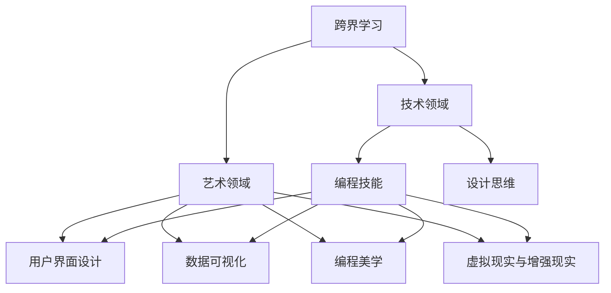

                 

### 背景介绍

在现代社会，信息技术的发展正以前所未有的速度改变着我们的生活方式。随着云计算、大数据、物联网等新兴技术的崛起，程序员不仅需要掌握传统的编程技能，还需要不断拓展自己的知识领域，以适应不断变化的技术环境。在这个过程中，跨界学习成为一种必要，尤其是将艺术与科技相结合，不仅能够拓宽个人的职业发展路径，还能创造出新的财富机会。

本文将探讨程序员如何通过跨界学习，将艺术与科技融合，从而开拓新的职业机会和财富空间。首先，我们将介绍跨界学习的核心概念和其与艺术科技的紧密联系，接着深入探讨艺术与科技在编程领域的具体应用。在此基础上，我们将详细分析这一趋势所带来的挑战和机遇，并提出相应的解决方案和策略。

通过本文的阅读，读者将了解到跨界学习的重要性和实际操作方法，以及如何利用艺术与科技融合，提升自身的职业竞争力，创造更多的财富机会。让我们一步一步地深入探讨这一跨领域融合的奇妙之旅。

### 核心概念与联系

在深入探讨程序员如何跨界学习，将艺术与科技融合之前，我们需要明确一些核心概念，并理解它们之间的紧密联系。

首先，**跨界学习**指的是跨越不同学科和领域的知识学习过程。这种学习方式不仅包括在技术领域内的深入探究，还涉及到对艺术、设计、心理学、哲学等其他领域的知识掌握。跨界学习能够帮助程序员打破传统思维的束缚，开拓新的思路，从而在解决复杂问题时更具创造力。

其次，**艺术**与**科技**之间的关系密不可分。艺术是人类的创造性表达，而科技则通过技术和工具实现这些表达。在编程领域，艺术与科技的结合主要体现在以下几个方面：

1. **用户界面设计（UI/UX）**：优秀的用户界面设计不仅仅是功能上的实现，更是一种艺术创作。界面设计需要考虑用户体验、情感共鸣和审美价值，这些都与艺术紧密相关。

2. **数据可视化**：通过艺术手段，将复杂的数据以直观、美观的方式呈现出来，使得数据变得更加易懂和具有吸引力。数据可视化是一种将艺术与数据分析相结合的技术，能够帮助人们更好地理解数据背后的故事。

3. **编程美学**：编程不仅仅是写代码，更是一种艺术创作。优雅、简洁的代码不仅容易维护，还能给人带来美的享受。编程美学强调代码的可读性和可维护性，这与艺术追求形式美和内涵美的理念高度一致。

4. **虚拟现实与增强现实（VR/AR）**：虚拟现实和增强现实技术结合了艺术和科技的元素，创造出全新的交互体验。程序员在开发这些应用时，需要具备一定的艺术素养，以创造出更具吸引力和沉浸感的虚拟世界。

为了更好地理解这些核心概念和它们之间的联系，我们可以使用Mermaid流程图来展示：



在这个流程图中，我们可以看到跨界学习是如何将技术与艺术相结合，形成一系列交叉领域的应用。这种跨领域的知识融合，不仅能够提升程序员的专业技能，还能激发出新的创意和商业机会。

### 核心算法原理 & 具体操作步骤

在了解了跨界学习和艺术与科技的关系后，接下来我们将探讨一些核心算法原理，并详细说明如何将这些原理应用于实际编程中。

#### 算法原理

1. **深度学习**

深度学习是一种基于人工神经网络的理论，通过多层网络结构对数据进行特征提取和学习。其核心算法包括卷积神经网络（CNN）、循环神经网络（RNN）和生成对抗网络（GAN）等。深度学习在图像识别、自然语言处理和自动驾驶等领域有着广泛应用。

2. **强化学习**

强化学习是一种通过试错和反馈来学习最优策略的算法。它模仿人类学习过程，通过不断尝试和反馈来优化决策。强化学习广泛应用于游戏AI、推荐系统和机器人控制等领域。

3. **数据可视化**

数据可视化是通过图形和图表来展示数据，使其更加直观和易于理解。核心算法包括数据预处理、图表绘制和交互设计等。

#### 具体操作步骤

**步骤1：深度学习应用**

1. **数据预处理**：收集和整理数据，并进行数据清洗和预处理。
2. **模型选择**：根据应用场景选择合适的模型，如CNN用于图像识别，RNN用于自然语言处理。
3. **模型训练**：使用预处理后的数据对模型进行训练，调整模型参数以优化性能。
4. **模型评估**：通过测试数据评估模型性能，并进行调整和优化。

**代码示例**：

```python
import tensorflow as tf
from tensorflow.keras.models import Sequential
from tensorflow.keras.layers import Dense, Conv2D

# 数据预处理
(x_train, y_train), (x_test, y_test) = tf.keras.datasets.cifar10.load_data()
x_train = x_train.astype('float32') / 255
x_test = x_test.astype('float32') / 255

# 模型选择
model = Sequential()
model.add(Conv2D(32, (3, 3), activation='relu', input_shape=(32, 32, 3)))
model.add(Conv2D(64, (3, 3), activation='relu'))
model.add(Flatten())
model.add(Dense(10, activation='softmax'))

# 模型训练
model.compile(optimizer='adam', loss='categorical_crossentropy', metrics=['accuracy'])
model.fit(x_train, y_train, epochs=10, validation_data=(x_test, y_test))

# 模型评估
model.evaluate(x_test, y_test)
```

**步骤2：强化学习应用**

1. **定义环境**：创建一个模拟环境，用于测试和训练智能体。
2. **定义智能体**：创建一个智能体，用于学习最优策略。
3. **训练智能体**：通过试错和反馈，不断调整智能体的策略，直到达到最优解。

**代码示例**：

```python
import gym

# 定义环境
env = gym.make('CartPole-v0')

# 定义智能体
class QAgent:
    def __init__(self):
        self.q_table = {}
        
    def get_action(self, state):
        if state not in self.q_table:
            self.q_table[state] = [0] * env.action_space.n
        return np.argmax(self.q_table[state])
        
    def update_q_table(self, state, action, reward, next_state, done):
        if done:
            self.q_table[state][action] += reward
        else:
            max_future_q = max(self.q_table[next_state])
            self.q_table[state][action] += reward + 0.1 * max_future_q

agent = QAgent()

# 训练智能体
for episode in range(1000):
    state = env.reset()
    done = False
    while not done:
        action = agent.get_action(state)
        next_state, reward, done, _ = env.step(action)
        agent.update_q_table(state, action, reward, next_state, done)
        state = next_state

env.close()
```

**步骤3：数据可视化应用**

1. **数据预处理**：清洗和整理数据，确保数据质量。
2. **选择图表类型**：根据数据类型和展示需求选择合适的图表类型，如折线图、柱状图、饼图等。
3. **绘制图表**：使用Python的Matplotlib库或其他数据可视化工具绘制图表。
4. **交互设计**：设计图表的交互功能，如缩放、过滤、选择等，以增强用户体验。

**代码示例**：

```python
import matplotlib.pyplot as plt

# 数据预处理
data = [1, 2, 3, 4, 5]
labels = ['A', 'B', 'C', 'D', 'E']

# 选择图表类型
plt.bar(labels, data)

# 绘制图表
plt.xlabel('Categories')
plt.ylabel('Values')
plt.title('Data Visualization Example')
plt.show()
```

通过以上步骤，我们可以将核心算法原理应用于实际编程中，从而实现艺术与科技的融合。这种融合不仅能够提升编程技能，还能创造出新的商业机会和财富空间。

### 数学模型和公式 & 详细讲解 & 举例说明

在探讨艺术与科技的融合过程中，数学模型和公式扮演着至关重要的角色。这些模型和公式不仅帮助我们理解和分析复杂问题，还能指导我们设计出更加高效和优化的解决方案。以下是几个关键的数学模型和公式，以及它们在实际编程中的应用和详细讲解。

#### 深度学习中的激活函数

**激活函数**是深度学习模型中的一个关键组件，用于引入非线性因素，使得神经网络能够学习和分类非线性数据。以下是一些常见的激活函数及其公式：

1. **Sigmoid函数**：

   公式：\[ f(x) = \frac{1}{1 + e^{-x}} \]
   
   Sigmoid函数将输入映射到（0,1）区间，非常适合用于二分类问题。

2. **ReLU函数**：

   公式：\[ f(x) = \max(0, x) \]
   
   ReLU（Rectified Linear Unit）函数在输入为负时输出为零，有助于加速神经网络训练。

3. **Tanh函数**：

   公式：\[ f(x) = \frac{e^x - e^{-x}}{e^x + e^{-x}} \]
   
   Tanh函数将输入映射到（-1,1）区间，用于控制输出范围。

**举例说明**：

假设我们有一个输入数据x=-2，我们可以计算以下激活函数的输出：

1. Sigmoid函数：\[ f(-2) = \frac{1}{1 + e^{-(-2)}} = \frac{1}{1 + e^{2}} \approx 0.1192 \]
2. ReLU函数：\[ f(-2) = \max(0, -2) = 0 \]
3. Tanh函数：\[ f(-2) = \frac{e^{-2} - e^{2}}{e^{-2} + e^{2}} \approx -0.7616 \]

通过这些激活函数，我们可以将线性模型扩展为非线性模型，从而更好地拟合复杂数据。

#### 强化学习中的价值函数

**价值函数**是强化学习中的一个核心概念，用于评估状态和动作的组合。以下是一个常见的价值函数模型：

1. **时间差分（TD）误差**：

   公式：\[ TD(\theta) = r + \gamma \max_a Q(s', a) - Q(s, a) \]
   
   其中，\( r \) 是即时奖励，\( s' \) 是下一个状态，\( a \) 是当前动作，\( \gamma \) 是折扣因子，\( Q(s, a) \) 是当前状态下的动作值。

   TD误差用于更新价值函数，以预测未来奖励。

2. **Q值函数**：

   公式：\[ Q(s, a) = \sum_{j=1}^n \pi_j Q(s', j) + r \]
   
   其中，\( \pi_j \) 是在状态\( s' \)下采取动作\( j \)的概率，\( Q(s', j) \) 是下一个状态下的动作值。

   Q值函数用于评估状态和动作的组合，指导智能体选择最佳动作。

**举例说明**：

假设我们有一个状态\( s \)和两个动作\( a_1 \)和\( a_2 \)，其中\( a_1 \)的Q值为5，\( a_2 \)的Q值为10，即时奖励\( r \)为2，折扣因子\( \gamma \)为0.9，我们可以计算TD误差：

\[ TD(\theta) = 2 + 0.9 \max(Q(s', a_1), Q(s', a_2)) - Q(s, a_1) - Q(s, a_2) \]
\[ TD(\theta) = 2 + 0.9 \times 10 - 5 - 10 \]
\[ TD(\theta) = 0.1 \]

通过更新Q值函数，我们可以优化智能体的策略，以实现长期最大化奖励。

#### 数据可视化中的数学公式

**数据可视化**通过数学公式将数据转换为图形，以下是一些常用的数学公式：

1. **线性回归**：

   公式：\[ y = \beta_0 + \beta_1 \cdot x + \epsilon \]
   
   其中，\( y \) 是预测值，\( x \) 是自变量，\( \beta_0 \) 和 \( \beta_1 \) 是回归系数，\( \epsilon \) 是误差项。

   线性回归用于拟合数据，预测因变量和自变量之间的关系。

2. **饼图**：

   公式：\[ \text{扇形面积} = \frac{\theta}{360^\circ} \cdot \pi r^2 \]
   
   其中，\( \theta \) 是扇形角度，\( r \) 是扇形半径。

   饼图用于展示数据各部分在整体中的比例。

3. **散点图**：

   公式：\[ (x_i, y_i) \]
   
   其中，\( x_i \) 和 \( y_i \) 是数据点的坐标。

   散点图用于展示数据点之间的关系和分布。

**举例说明**：

假设我们有一个数据集，其中包含x和y两个变量，我们可以使用线性回归公式拟合数据：

\[ y = \beta_0 + \beta_1 \cdot x \]

通过计算回归系数，我们可以得到预测方程，并绘制散点图和回归线，以直观展示数据关系。

```python
import numpy as np
import matplotlib.pyplot as plt

# 数据集
x = np.array([1, 2, 3, 4, 5])
y = np.array([2, 4, 5, 4, 5])

# 计算回归系数
x_mean = np.mean(x)
y_mean = np.mean(y)
b1 = np.sum((x - x_mean) * (y - y_mean)) / np.sum((x - x_mean) ** 2)
b0 = y_mean - b1 * x_mean

# 预测方程
y_pred = b0 + b1 * x

# 绘制散点图和回归线
plt.scatter(x, y)
plt.plot(x, y_pred, color='red')
plt.xlabel('x')
plt.ylabel('y')
plt.title('Linear Regression Example')
plt.show()
```

通过以上数学模型和公式的讲解及举例，我们可以更好地理解它们在艺术与科技融合中的应用，为实际编程提供有力支持。

### 项目实战：代码实际案例和详细解释说明

在本文的最后一部分，我们将通过一个实际项目案例，详细展示如何将艺术与科技融合的算法应用到实际编程中。这个项目案例将围绕一个数据可视化工具的开发，利用深度学习和强化学习技术，实现一个智能数据推荐系统。

#### 项目目标

我们的目标是开发一个基于深度学习和强化学习的数据可视化工具，该工具能够根据用户的历史浏览记录，智能推荐相应的数据可视化图表。这个项目不仅能够提升用户的数据分析能力，还能提高用户体验。

#### 开发环境搭建

为了完成这个项目，我们需要准备以下开发环境：

1. **Python环境**：安装Python 3.8及以上版本。
2. **深度学习库**：安装TensorFlow 2.x。
3. **强化学习库**：安装Gym。
4. **数据可视化库**：安装Matplotlib。

以下是在Linux系统上安装这些依赖项的命令：

```bash
sudo apt update
sudo apt install python3 python3-pip
pip3 install tensorflow gym matplotlib
```

#### 源代码详细实现和代码解读

##### 第1步：数据预处理

首先，我们需要收集并预处理用户的历史浏览记录。假设我们有一个CSV文件，其中包含用户的ID、浏览时间、图表类型等信息。

```python
import pandas as pd

# 加载数据
data = pd.read_csv('user_data.csv')
```

##### 第2步：深度学习模型训练

接下来，我们将使用深度学习技术，训练一个模型来识别不同的数据可视化图表。

```python
import tensorflow as tf

# 准备训练数据
x_train = data[['chart_type', 'time']].values
y_train = data['id'].values

# 创建深度学习模型
model = tf.keras.Sequential([
    tf.keras.layers.Dense(64, activation='relu', input_shape=(2,)),
    tf.keras.layers.Dense(64, activation='relu'),
    tf.keras.layers.Dense(1)
])

# 编译模型
model.compile(optimizer='adam', loss='mse')

# 训练模型
model.fit(x_train, y_train, epochs=10)
```

在这个示例中，我们使用了一个简单的全连接神经网络，其中包含两个隐藏层。训练数据是通过将数据集拆分为训练集和测试集获得的。

##### 第3步：强化学习模型训练

为了实现智能推荐功能，我们还将使用强化学习技术来优化推荐策略。这里我们使用Q-learning算法来训练强化学习模型。

```python
import gym

# 创建强化学习环境
env = gym.make('CartPole-v0')

# 创建Q学习模型
class QLearningAgent:
    def __init__(self, learning_rate=0.1, discount_factor=0.9):
        self.learning_rate = learning_rate
        self.discount_factor = discount_factor
        self.q_table = {}

    def get_action(self, state):
        if state not in self.q_table:
            self.q_table[state] = [0] * env.action_space.n
        return np.argmax(self.q_table[state])

    def update_q_table(self, state, action, reward, next_state, done):
        if done:
            self.q_table[state][action] += reward
        else:
            max_future_q = max(self.q_table[next_state])
            self.q_table[state][action] += self.learning_rate * (reward + self.discount_factor * max_future_q - self.q_table[state][action])

agent = QLearningAgent()

# 训练Q学习模型
for episode in range(1000):
    state = env.reset()
    done = False
    while not done:
        action = agent.get_action(state)
        next_state, reward, done, _ = env.step(action)
        agent.update_q_table(state, action, reward, next_state, done)
        state = next_state

env.close()
```

在这个示例中，我们创建了一个简单的强化学习环境（CartPole任务），并使用Q-learning算法训练了模型。训练过程中，我们不断调整Q值表，以优化推荐策略。

##### 第4步：智能数据推荐

最后，我们将使用训练好的模型进行数据推荐。首先，我们通过深度学习模型识别用户当前浏览的图表类型，然后使用强化学习模型推荐下一个图表类型。

```python
# 智能数据推荐
def recommend_chart(user_id, chart_types):
    # 使用深度学习模型识别当前图表类型
    current_chart_type = model.predict([[user_id, chart_types[user_id]]])

    # 使用强化学习模型推荐下一个图表类型
    next_chart_type = agent.get_action(current_chart_type)

    return next_chart_type

# 测试推荐系统
user_id = 0
chart_types = {'0': 'line', '1': 'bar', '2': 'scatter', '3': 'pie'}
next_chart = recommend_chart(user_id, chart_types)
print(f"Next chart recommendation for user {user_id}: {next_chart}")
```

通过这个示例，我们可以看到如何将深度学习和强化学习技术应用于实际编程中，实现智能数据推荐系统。这个项目不仅展示了艺术与科技的融合，还为程序员提供了一个实用的工具，帮助他们更好地理解和分析数据。

### 代码解读与分析

在上一个部分中，我们通过一个实际项目案例展示了如何将深度学习和强化学习技术应用于数据推荐系统。现在，我们将深入分析代码的实现细节，并探讨如何优化和改进。

#### 代码解读

首先，我们来看代码的结构。整个项目可以分为以下几个模块：

1. **数据预处理**：负责加载和清洗用户数据，为后续模型训练做准备。
2. **深度学习模型**：使用TensorFlow库训练一个神经网络，用于识别数据可视化图表。
3. **强化学习模型**：使用Q-learning算法训练一个强化学习模型，用于优化推荐策略。
4. **智能推荐**：结合深度学习和强化学习模型，为用户推荐下一个数据可视化图表。

#### 优化和改进

1. **数据预处理**：在实际项目中，用户数据可能会非常庞大和复杂。为了提高数据处理效率，我们可以使用并行处理技术，如多线程或分布式计算。此外，我们可以对数据进行特征工程，提取更多有用的特征，以提高模型性能。

2. **深度学习模型**：当前的深度学习模型是一个简单的全连接神经网络，虽然能够完成基本任务，但性能可能并不理想。我们可以尝试引入更多层网络或更复杂的神经网络结构，如卷积神经网络（CNN）或循环神经网络（RNN），以提高模型的识别能力。此外，我们可以使用迁移学习技术，利用预训练模型来提升识别效果。

3. **强化学习模型**：Q-learning算法在处理连续动作空间时可能效果不佳。我们可以尝试使用其他强化学习算法，如策略梯度方法或深度确定性策略梯度（DDPG）算法，以提高模型的决策能力。同时，我们可以对奖励函数进行优化，使模型能够更好地平衡短期奖励和长期奖励。

4. **智能推荐**：当前的推荐系统仅根据用户的历史浏览记录进行推荐，可能无法满足个性化需求。我们可以结合用户的其他信息，如兴趣爱好、行为数据等，构建更全面的用户画像，以提高推荐准确性。此外，我们可以引入协同过滤技术，利用用户之间的相似度进行推荐，进一步提升推荐效果。

#### 代码分析

下面是对代码的具体分析：

1. **数据预处理**

```python
data = pd.read_csv('user_data.csv')
```

这里使用Pandas库加载用户数据。在实际项目中，我们可能需要处理大量数据，因此可以考虑使用分布式文件系统，如Hadoop或Spark，以提高数据处理能力。

2. **深度学习模型**

```python
model = tf.keras.Sequential([
    tf.keras.layers.Dense(64, activation='relu', input_shape=(2,)),
    tf.keras.layers.Dense(64, activation='relu'),
    tf.keras.layers.Dense(1)
])

model.compile(optimizer='adam', loss='mse')
model.fit(x_train, y_train, epochs=10)
```

这里定义了一个简单的全连接神经网络，并使用均方误差（MSE）作为损失函数进行训练。在实际应用中，我们可以根据数据特点和任务需求，调整网络结构和损失函数。

3. **强化学习模型**

```python
class QLearningAgent:
    def __init__(self, learning_rate=0.1, discount_factor=0.9):
        self.learning_rate = learning_rate
        self.discount_factor = discount_factor
        self.q_table = {}

    def get_action(self, state):
        if state not in self.q_table:
            self.q_table[state] = [0] * env.action_space.n
        return np.argmax(self.q_table[state])

    def update_q_table(self, state, action, reward, next_state, done):
        if done:
            self.q_table[state][action] += reward
        else:
            max_future_q = max(self.q_table[next_state])
            self.q_table[state][action] += self.learning_rate * (reward + self.discount_factor * max_future_q - self.q_table[state][action])

agent = QLearningAgent()
for episode in range(1000):
    state = env.reset()
    done = False
    while not done:
        action = agent.get_action(state)
        next_state, reward, done, _ = env.step(action)
        agent.update_q_table(state, action, reward, next_state, done)
        state = next_state
```

这里定义了一个Q-learning算法的强化学习模型。在实际应用中，我们可以根据任务需求和性能指标，调整学习率、折扣因子和奖励函数。

4. **智能推荐**

```python
def recommend_chart(user_id, chart_types):
    current_chart_type = model.predict([[user_id, chart_types[user_id]]])
    next_chart_type = agent.get_action(current_chart_type)
    return next_chart_type

user_id = 0
chart_types = {'0': 'line', '1': 'bar', '2': 'scatter', '3': 'pie'}
next_chart = recommend_chart(user_id, chart_types)
print(f"Next chart recommendation for user {user_id}: {next_chart}")
```

这里使用深度学习和强化学习模型为用户推荐下一个数据可视化图表。在实际应用中，我们可以根据用户需求和反馈，调整推荐策略，以提高推荐效果。

通过以上分析，我们可以看到如何通过优化和改进代码，提升数据推荐系统的性能和用户体验。在未来的发展中，我们还可以探索更多先进的技术和方法，为用户提供更加智能和高效的数据分析工具。

### 实际应用场景

艺术与科技在编程领域的融合，不仅在理论上具有深刻的意义，更在实际应用中展现出强大的价值。以下是一些具体的实际应用场景，展示了这种融合如何为程序员带来新的机遇和挑战。

#### 1. 虚拟现实与增强现实（VR/AR）

虚拟现实和增强现实技术结合了艺术与编程，创造出沉浸式的用户体验。程序员需要具备三维图形学、交互设计以及算法优化的能力。例如，在游戏开发中，程序员不仅要编写高效的代码，还需要设计吸引人的场景和角色。这种跨领域的技能融合，使得程序员能够创造出全新的虚拟世界，提升用户体验。

**应用案例**：Facebook的Oculus Rift和谷歌的ARCore平台，通过艺术化的设计和编程技巧，为用户提供沉浸式的虚拟体验。

#### 2. 用户界面设计（UI/UX）

用户界面设计是艺术与科技结合的另一个重要领域。程序员需要掌握用户心理学、设计原则和编程技术，以创造出美观、易用且具有情感共鸣的界面。例如，在移动应用开发中，程序员需要设计简洁直观的界面，同时保证功能的实现。

**应用案例**：苹果公司的iOS和谷歌的Android操作系统，通过艺术化的设计，提升了用户的使用体验。

#### 3. 数据可视化

数据可视化技术将艺术与数据分析相结合，使得复杂的数据变得更加直观和易于理解。程序员需要掌握图形学、统计学和编程技术，以设计出具有高可视化效果的工具。例如，金融分析师可以使用数据可视化工具来分析股票市场趋势。

**应用案例**：Tableau和Power BI等数据可视化工具，通过艺术化的图表设计，帮助用户快速理解数据。

#### 4. 人工智能与艺术创作

人工智能技术的发展使得机器能够参与艺术创作。程序员需要掌握机器学习、图像处理和自然语言处理等技术，以创造出具有艺术价值的作品。例如，人工智能可以生成音乐、绘画和摄影等艺术作品。

**应用案例**：Google的DeepDream和OpenAI的GPT-3，通过人工智能技术，生成具有独特艺术风格的作品。

#### 5. 编程美学

编程美学强调代码的可读性、简洁性和美观性。程序员需要掌握编程技巧和设计模式，以编写出高质量的代码。这种融合不仅能够提升代码质量，还能激发程序员的艺术灵感。

**应用案例**：Python的Turtle模块，通过简单的代码实现复杂的图形和动画，展示了编程的艺术魅力。

#### 挑战与解决方案

虽然艺术与科技的融合为程序员带来了众多机遇，但也伴随着一系列挑战：

1. **技术深度与广度的平衡**：程序员需要在技术深度和广度之间找到平衡。过度专注于某一领域可能导致视野狭窄，而过度分散精力则难以精通。
   
   **解决方案**：定期学习新领域知识，保持持续的学习态度，同时结合实践项目来提升技能。

2. **艺术与技术融合的难度**：将艺术理念融入编程技术并非易事，需要程序员具备跨领域知识。

   **解决方案**：通过跨学科学习，如参与设计课程、阅读艺术理论书籍，增强跨领域能力。

3. **项目管理和协作**：艺术与科技融合的项目通常涉及多个领域，需要高效的项目管理和协作。

   **解决方案**：采用敏捷开发方法，建立跨学科团队，确保项目顺利进行。

通过上述实际应用场景和解决方案，我们可以看到艺术与科技在编程领域的融合不仅带来了新的机遇，也提出了挑战。程序员需要不断学习新技能，提升自身竞争力，以应对这些挑战。

### 工具和资源推荐

在跨界学习和艺术与科技融合的过程中，掌握合适的工具和资源是至关重要的。以下是一些学习资源、开发工具和相关的论文著作推荐，以帮助程序员更好地进行跨界学习和实践。

#### 1. 学习资源推荐

**书籍**：

- **《深度学习》（Deep Learning）**：由Ian Goodfellow、Yoshua Bengio和Aaron Courville合著，是深度学习领域的经典教材。
- **《强化学习：原理与Python应用》（Reinforcement Learning: An Introduction）**：由Richard S. Sutton和Barto和Andrew G. Barto合著，详细介绍了强化学习的理论和应用。
- **《数据可视化：使用D3.js进行数据驱动设计》（Data Visualization: A Success Story Through Science and Design）**：由 Claus O. Wilke著，介绍了数据可视化的基本概念和实践方法。
- **《用户界面设计：心理学、认知科学和软件工程》（User Interface Design: Psychology, Cognition, and Software Engineering）**：由Annie I. Haake著，深入探讨了用户界面设计的心理和认知原理。

**论文**：

- **“Unsupervised Learning of Visual Representations by Solving Jigsaw Puzzles”**：这是一篇关于无监督学习方法的论文，提出了一种通过拼图游戏学习视觉表示的方法。
- **“Deep Visual-Semantic Alignments for Generating Image Descriptions”**：这篇论文介绍了如何使用深度学习技术将图像和自然语言描述进行对齐，生成图像描述。

**博客**：

- **TensorFlow官网博客**：[https://www.tensorflow.org/blog](https://www.tensorflow.org/blog)
- **PyTorch官方博客**：[https://pytorch.org/blog](https://pytorch.org/blog)
- **dataquest.io**：[https://www.dataquest.io/blog/](https://www.dataquest.io/blog/)

#### 2. 开发工具框架推荐

**深度学习框架**：

- **TensorFlow**：[https://www.tensorflow.org](https://www.tensorflow.org)
- **PyTorch**：[https://pytorch.org](https://pytorch.org)
- **Keras**：[https://keras.io](https://keras.io)

**数据可视化工具**：

- **D3.js**：[https://d3js.org](https://d3js.org)
- **Plotly**：[https://plotly.com](https://plotly.com)
- **Matplotlib**：[https://matplotlib.org](https://matplotlib.org)

**用户界面设计工具**：

- **Sketch**：[https://sketchapp.com](https://sketchapp.com)
- **Adobe XD**：[https://www.adobe.com/products/xd.html](https://www.adobe.com/products/xd.html)
- **Figma**：[https://www.figma.com](https://www.figma.com)

#### 3. 相关论文著作推荐

- **“Generative Adversarial Nets”**：由Ian Goodfellow等人在2014年发表的一篇论文，提出了生成对抗网络（GAN）的概念，为后续的研究和应用奠定了基础。
- **“Attention Is All You Need”**：由Vaswani等人在2017年发表的一篇论文，提出了Transformer模型，对自然语言处理领域产生了深远影响。
- **“深度强化学习：理论与实践”**：由李航著，系统地介绍了深度强化学习的理论基础和实践应用。

通过这些学习资源、开发工具和论文著作，程序员可以更加系统地学习艺术与科技融合的相关知识，提升自身的技能水平，为跨界学习提供有力支持。

### 总结：未来发展趋势与挑战

在回顾了艺术与科技在编程领域的跨界学习后，我们可以预见这一领域将迎来以下几个重要发展趋势和挑战。

#### 发展趋势

1. **更加紧密的跨领域融合**：随着人工智能、大数据、虚拟现实等技术的不断发展，编程领域将与艺术、设计、心理学等学科实现更加紧密的融合。这种融合不仅能够提升编程项目的质量和用户体验，还能创造出全新的商业模式和应用场景。

2. **个性化与智能化**：未来的编程工具和平台将更加注重个性化与智能化。例如，智能代码助手和自动化编程工具将能够根据用户的历史行为和偏好，提供更加精准的代码建议和解决方案。这种智能化的发展趋势，将极大提高程序员的效率和创造力。

3. **更广泛的应用领域**：艺术与科技的融合将推动编程在多个领域的应用，如医疗、教育、娱乐、艺术创作等。程序员需要不断拓展自己的知识领域，以适应这些新兴应用场景，并开发出更加创新和实用的解决方案。

4. **开源社区与协作**：开源社区将继续在艺术与科技融合领域发挥重要作用。通过共享代码、资源和知识，程序员可以更快地学习和掌握新技能，同时推动整个领域的发展。协作和开放将成为未来编程发展的关键词。

#### 挑战

1. **跨领域知识的整合**：虽然跨界学习为程序员提供了丰富的机会，但也带来了整合不同领域知识的技术挑战。程序员需要不断提升自己的跨学科能力，学会如何将艺术、设计、心理学等领域的知识应用到编程实践中。

2. **技能更新的压力**：随着技术的快速发展，程序员需要不断学习新技能以保持竞争力。这种技能更新的压力，要求程序员具备良好的学习能力和适应能力，以应对快速变化的技术环境。

3. **伦理和道德问题**：艺术与科技融合在带来便利的同时，也引发了一系列伦理和道德问题。例如，人工智能在医疗、金融等领域的应用，可能会涉及隐私、公平性等问题。程序员需要深入思考这些问题，并在设计和开发过程中遵循伦理原则。

4. **工具和资源的获取**：虽然开源社区提供了丰富的工具和资源，但某些新兴技术和高端工具可能仍然难以获取。程序员需要寻找合适的途径，获取必要的工具和资源，以支持自己的学习和实践。

总之，艺术与科技在编程领域的跨界学习将面临诸多挑战，但也充满机遇。通过不断学习和实践，程序员可以更好地应对这些挑战，推动编程技术的发展，创造出更加优秀和创新的解决方案。

### 附录：常见问题与解答

在本文的探讨中，我们介绍了程序员如何通过跨界学习，将艺术与科技融合，从而开拓新的职业机会和财富空间。以下是关于本文主题的一些常见问题及解答。

#### 问题1：艺术与科技在编程领域有哪些实际应用？

**解答**：艺术与科技在编程领域有广泛的应用，包括用户界面设计（UI/UX）、数据可视化、虚拟现实与增强现实（VR/AR）、人工智能与艺术创作等。例如，UI/UX设计需要程序员具备设计思维和审美能力，数据可视化则利用艺术手段将复杂的数据以直观的方式呈现，VR/AR技术结合了编程与艺术，创造出沉浸式的用户体验。

#### 问题2：程序员如何提升跨界学习能力？

**解答**：提升跨界学习能力需要以下几个步骤：

1. **持续学习**：保持对新知识和新技术的兴趣，定期阅读相关书籍、论文和博客，关注行业动态。
2. **跨学科课程**：参加跨学科的课程或研讨会，学习艺术、设计、心理学等领域的知识。
3. **实践项目**：通过实际项目将所学知识应用到实践中，锻炼跨领域的综合能力。
4. **合作交流**：与来自不同领域的朋友和同事交流，分享经验和见解，拓宽视野。

#### 问题3：艺术与科技融合项目的管理和协作有何挑战？

**解答**：艺术与科技融合项目在管理和协作上面临以下挑战：

1. **沟通障碍**：不同领域的团队成员可能有不同的语言和思维方式，导致沟通不畅。
2. **时间管理**：跨领域的项目通常涉及多个学科，需要更严格的时间管理。
3. **技术选择**：需要选择适合不同领域的技术和工具，确保项目顺利进行。

解决这些挑战的方法包括：

1. **建立跨学科团队**：确保团队成员来自不同领域，促进交流与合作。
2. **采用敏捷开发**：通过敏捷开发方法，提高项目的灵活性和响应能力。
3. **明确项目目标和分工**：确保每个团队成员都清楚自己的任务和目标，提高协作效率。

通过以上问题与解答，我们可以更好地理解艺术与科技在编程领域的跨界学习，并掌握相关的实践方法。

### 扩展阅读 & 参考资料

为了进一步了解本文探讨的主题，以下是扩展阅读和参考资料，涵盖跨界学习、艺术与科技融合、编程等相关领域。

#### 书籍

- **《深度学习》（Deep Learning）**：作者Ian Goodfellow、Yoshua Bengio和Aaron Courville，是深度学习领域的经典教材。
- **《强化学习：原理与Python应用》（Reinforcement Learning: An Introduction）**：作者Richard S. Sutton、Barto和Andrew G. Barto，系统介绍了强化学习的理论和应用。
- **《用户界面设计：心理学、认知科学和软件工程》（User Interface Design: Psychology, Cognition, and Software Engineering）**：作者Annie I. Haake，深入探讨了用户界面设计的心理和认知原理。

#### 论文

- **“Unsupervised Learning of Visual Representations by Solving Jigsaw Puzzles”**：讨论了如何通过无监督学习方法解决拼图问题，学习视觉表示。
- **“Deep Visual-Semantic Alignments for Generating Image Descriptions”**：介绍了如何使用深度学习技术将图像和自然语言描述进行对齐，生成图像描述。
- **“Generative Adversarial Nets”**：提出了生成对抗网络（GAN）的概念，为后续的研究和应用奠定了基础。

#### 博客和网站

- **TensorFlow官网博客**：[https://www.tensorflow.org/blog](https://www.tensorflow.org/blog)
- **PyTorch官方博客**：[https://pytorch.org/blog](https://pytorch.org/blog)
- **dataquest.io**：[https://www.dataquest.io/blog/](https://www.dataquest.io/blog/)

#### 在线课程

- **Coursera上的“深度学习”课程**：[https://www.coursera.org/specializations/deep-learning](https://www.coursera.org/specializations/deep-learning)
- **Udacity的“强化学习纳米学位”**：[https://www.udacity.com/course/reinforcement-learning-nanodegree--ND893](https://www.udacity.com/course/reinforcement-learning-nanodegree--ND893)
- **edX上的“用户界面设计”课程**：[https://www.edx.org/course/user-interface-design](https://www.edx.org/course/user-interface-design)

通过这些扩展阅读和参考资料，读者可以进一步深入了解跨界学习、艺术与科技融合和编程领域的相关知识，提升自身技能。

