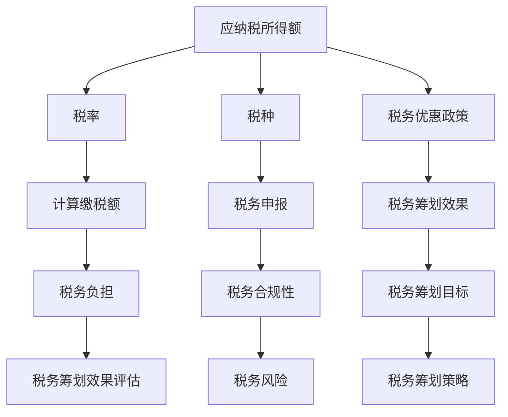

                 

### 1. 背景介绍

在当今数字化时代，知识付费已经成为一种越来越受欢迎的消费模式。对于程序员来说，知识付费不仅可以帮助他们不断学习新的技术和知识，还可以为他们带来额外的收入来源。然而，在享受知识付费带来的便利和收益的同时，程序员们也需要面对一个不可忽视的问题——税务筹划。

税务筹划是指在遵守国家法律法规的前提下，通过对自身财务状况的合理安排，以合法手段减少税收负担的过程。对于程序员这一职业来说，税务筹划尤为重要，因为他们的收入形式多样，包括但不限于稿费、咨询费、培训费等，而这些收入往往没有固定的模式，难以预测，导致税务处理起来更加复杂。

本文将探讨程序员在进行知识付费时如何进行税务筹划，旨在帮助程序员们更好地理解税务政策，掌握税务筹划的方法，从而实现合理避税，降低税收负担。本文将分为以下几个部分：

1. **核心概念与联系**：介绍程序员税务筹划所需理解的核心概念，并通过Mermaid流程图展示其联系。
2. **核心算法原理与具体操作步骤**：讲解税务筹划的基本原理，并详细说明具体的操作步骤。
3. **数学模型和公式**：介绍税务筹划中常用的数学模型和公式，并举例说明。
4. **项目实战：代码实际案例和详细解释说明**：通过实际代码案例，展示税务筹划的具体应用。
5. **实际应用场景**：分析程序员在进行知识付费时可能遇到的具体税务问题。
6. **工具和资源推荐**：推荐学习资源和开发工具，帮助程序员更好地进行税务筹划。
7. **总结：未来发展趋势与挑战**：总结文章内容，展望未来税务筹划的发展趋势和面临的挑战。

通过对这些内容的深入探讨，我们希望程序员们能够更好地掌握税务筹划的方法，实现合法避税，从而在知识付费的道路上走得更加稳健和长远。

### 2. 核心概念与联系

在进行税务筹划之前，我们需要理解一些核心概念，这些概念包括但不限于：应纳税所得额、税率、税种、税务优惠政策等。为了更好地展示这些概念之间的联系，我们可以使用Mermaid流程图来直观地表示。

以下是一个简化的Mermaid流程图，用于展示程序员税务筹划中涉及的核心概念和它们之间的联系：



#### Mermaid流程图详细解读：

1. **应纳税所得额**：这是程序员在进行税务筹划时的基础，它决定了税率、税种和最终缴税额。
2. **税率**：根据应纳税所得额的不同，税率也会有所不同。税率是计算缴税额的关键因素。
3. **税种**：包括企业所得税、个人所得税等，不同的税种有不同的纳税规定和优惠政策。
4. **税务优惠政策**：包括税率优惠、税额减免等，这些政策是税务筹划的重要依据。
5. **计算缴税额**：根据应纳税所得额、税率、税种等计算得出的结果。
6. **税务申报**：按照规定的时间和方式向税务部门申报纳税。
7. **税务筹划效果**：通过合理的税务筹划，期望达到减少税收负担的效果。
8. **税务负担**：实际缴纳的税款占应纳税所得额的比例。
9. **税务合规性**：确保纳税行为的合法性，避免税务风险。
10. **税务筹划目标**：明确税务筹划的最终目标，如降低税务负担、优化税务结构等。
11. **税务筹划效果评估**：对税务筹划效果进行评估，以确定是否达到预期目标。
12. **税务风险**：由于税务政策的不确定性，可能导致税务筹划方案失效或面临罚款、处罚等风险。
13. **税务筹划策略**：根据具体情况进行税务筹划，采取合适的策略和方法。

通过这个Mermaid流程图，我们可以清晰地看到程序员在进行税务筹划时需要考虑的核心概念和它们之间的联系。这为后续的具体操作提供了理论依据和指导方向。

### 3. 核心算法原理与具体操作步骤

在进行程序员的知识付费税务筹划时，我们需要了解并应用一系列核心算法原理和具体操作步骤。以下是税务筹划的基本原理和操作流程：

#### 3.1 税务筹划的基本原理

税务筹划的核心在于合理避税，即在遵守国家法律法规的前提下，通过合法手段减少税收负担。其基本原理包括以下几个方面：

1. **税务优惠政策的利用**：根据国家出台的税收优惠政策，如高新技术企业税收优惠、小微企业税收减免等，合理利用这些政策降低税收负担。
2. **费用扣除**：在计算应纳税所得额时，合理扣除各项费用，如成本费用、捐赠等，以减少应纳税所得额。
3. **收入分期**：将收入合理分期，以降低某一会计期间的应纳税所得额，实现税收的延期缴纳。
4. **税种选择**：根据具体情况，选择不同的税种或税率，如个人所得税与企业所得税之间的选择，以降低税负。

#### 3.2 具体操作步骤

1. **评估收入形式**：首先，程序员需要对自己的收入形式进行详细评估，包括稿费、咨询费、培训费等，了解每种收入形式的纳税规定和税率。

2. **了解税收优惠政策**：接下来，程序员需要了解当前有效的税收优惠政策，如高新技术企业税收优惠、小微企业税收减免、个税专项附加扣除等，并判断自己是否符合条件。

3. **计算应纳税所得额**：根据收入形式和费用扣除项目，计算应纳税所得额。具体计算方法如下：
   - 应纳税所得额 = 收入总额 - 允许扣除的费用
   - 收入总额包括稿费、咨询费、培训费等。
   - 允许扣除的费用包括成本费用、捐赠等。

4. **选择税率和税种**：根据应纳税所得额的不同，选择合适的税率和税种。例如，对于个人所得，可以选择个人所得税；对于企业所得，可以选择企业所得税。

5. **制定税务筹划策略**：基于评估结果和计算出的应纳税所得额，制定税务筹划策略。具体策略包括收入分期、费用扣除、税收优惠政策利用等。

6. **执行税务筹划方案**：按照制定的税务筹划策略，执行具体的操作步骤，如合理分期收入、及时申报税收优惠、准确计算费用扣除等。

7. **税务申报和缴税**：按照税务部门的要求，按时进行税务申报和缴纳税款，确保税务合规性。

8. **税务筹划效果评估**：在税务筹划实施后，对效果进行评估，如税务负担是否减轻、是否符合预期目标等，并根据评估结果进行调整。

#### 3.3 实际案例分析

假设一位程序员A，其主要收入形式为稿费和咨询费，年度总收入为100万元。下面我们通过具体案例来展示如何进行税务筹划：

1. **评估收入形式**：A的稿费和咨询费收入均按20%的税率缴纳个人所得税。

2. **了解税收优惠政策**：A符合高新技术企业税收优惠政策，可以享受减按15%的税率缴纳企业所得税。

3. **计算应纳税所得额**：
   - 收入总额 = 稿费 + 咨询费 = 100万元
   - 允许扣除的费用 = 成本费用 + 捐赠 = 30万元
   - 应纳税所得额 = 100万元 - 30万元 = 70万元

4. **选择税率和税种**：对于稿费和咨询费，A选择按个人所得税缴纳，税率20%。对于企业所得税，A选择按高新技术企业税收优惠政策，税率15%。

5. **制定税务筹划策略**：
   - 收入分期：将100万元的收入合理分期，如每月收入5万元，以降低某一会计期间的应纳税所得额。
   - 费用扣除：充分利用成本费用和捐赠等费用扣除项目，以减少应纳税所得额。

6. **执行税务筹划方案**：
   - 每月按时申报个人所得税，并合理计算费用扣除。
   - 按季度进行企业所得税申报，并享受高新技术企业税收优惠政策。

7. **税务申报和缴税**：按时进行税务申报和缴纳税款，确保税务合规性。

8. **税务筹划效果评估**：
   - A通过合理的税务筹划，年度税务负担从原计划的14万元降至10.5万元，降低了3.5万元的税负。
   - A的税务筹划策略达到了预期目标，实现了降低税务负担的效果。

通过这个案例，我们可以看到程序员在进行知识付费税务筹划时，可以通过合理利用税收优惠政策、收入分期、费用扣除等方法，有效降低税收负担，实现合法避税。

### 4. 数学模型和公式 & 详细讲解 & 举例说明

在进行程序员的知识付费税务筹划时，数学模型和公式起着关键作用。以下将详细讲解税务筹划中常用的数学模型和公式，并通过具体例子来说明如何应用这些公式进行税务筹划。

#### 4.1 个人所得税计算公式

个人所得税是程序员知识付费中最为常见的一种税种。计算个人所得税的基本公式如下：

$$
应纳税所得额 = 收入总额 - 费用扣除
$$

$$
应纳税额 = 应纳税所得额 \times 税率 - 速算扣除数
$$

其中：
- **收入总额**：包括稿费、咨询费、培训费等。
- **费用扣除**：包括成本费用、捐赠等允许扣除的费用。
- **税率**：根据应纳税所得额的不同，税率可能有所不同。常见的税率有3%、10%、20%等。
- **速算扣除数**：根据税率不同而有所不同，是用于简化计算的一个常数。

#### 4.2 企业所得税计算公式

对于企业来说，企业所得税也是一个重要的税种。计算企业所得税的基本公式如下：

$$
应纳税所得额 = 收入总额 - 成本费用 - 税收优惠
$$

$$
应纳税额 = 应纳税所得额 \times 税率
$$

其中：
- **收入总额**：包括销售收入、服务收入等。
- **成本费用**：包括生产成本、运营费用等。
- **税收优惠**：如高新技术企业税收优惠、小微企业税收减免等。

#### 4.3 案例说明

假设程序员B的年度总收入为80万元，其中包括50万元的稿费和30万元的咨询费。他的主要费用包括20万元成本费用和5万元捐赠。我们通过以下步骤计算B的个人所得税和企业所得税：

1. **计算个人所得税**：

   - **收入总额**：50万元稿费 + 30万元咨询费 = 80万元
   - **费用扣除**：20万元成本费用 + 5万元捐赠 = 25万元
   - **应纳税所得额**：80万元 - 25万元 = 55万元
   - **税率**：根据应纳税所得额，税率取20%
   - **速算扣除数**：0（假设适用税率20%的速算扣除数为0）

   $$
   应纳税额 = 55万元 \times 20\% - 0 = 11万元
   $$

2. **计算企业所得税**：

   - **收入总额**：假设收入总额为100万元（假设数据）
   - **成本费用**：20万元
   - **税收优惠**：假设符合高新技术企业税收优惠政策，税率取15%

   $$
   应纳税所得额 = 100万元 - 20万元 = 80万元
   $$

   $$
   应纳税额 = 80万元 \times 15\% = 12万元
   $$

通过这个案例，我们可以看到，通过合理利用税收优惠政策和费用扣除，程序员B可以有效降低个人所得税和企业所得税的税负。

#### 4.4 数学模型的应用

在实际操作中，程序员还可以通过以下数学模型进行更深入的税务筹划：

1. **收入分期模型**：通过合理分期收入，降低某一会计期间的应纳税所得额，实现税收的延期缴纳。
2. **费用优化模型**：通过优化费用结构，提高费用扣除比例，从而减少应纳税所得额。
3. **税种选择模型**：根据不同收入形式和税种特点，选择最合适的税种，以降低税负。

这些模型和公式在程序员的知识付费税务筹划中发挥着重要作用，帮助程序员实现合法避税，优化税务结构。

### 5. 项目实战：代码实际案例和详细解释说明

为了更好地理解程序员在进行知识付费税务筹划时的具体操作，我们将通过一个实际项目案例来进行详细解释说明。以下是一个使用Python编写的税务筹划项目，该项目旨在帮助程序员自动计算和优化税务负担。

#### 5.1 开发环境搭建

1. **安装Python**：确保你的计算机上已安装Python 3.x版本。可以从[Python官方网站](https://www.python.org/)下载并安装。

2. **安装依赖库**：该案例使用了一些Python依赖库，如`numpy`和`pandas`，用于数据处理和数学计算。可以使用以下命令进行安装：

   ```bash
   pip install numpy pandas
   ```

3. **编写Python脚本**：创建一个名为`tax_planning.py`的Python文件，并使用以下代码：

   ```python
   import numpy as np
   import pandas as pd
   
   # 税收优惠政策参数
   tax_discounts = {
       'high_tech': 0.15,  # 高新技术企业税率
       'small_business': 0.2  # 小微企业税率
   }
   
   # 个人所得税计算函数
   def calculate_personal_tax(income, deductions, rate, discount=None):
       taxable_income = income - deductions
       if discount:
           rate = tax_discounts[discount]
       tax = taxable_income * rate
       return tax
   
   # 企业所得税计算函数
   def calculate_corporate_tax(income, deductions, discount=None):
       taxable_income = income - deductions
       if discount:
           rate = tax_discounts[discount]
       tax = taxable_income * rate
       return tax
   
   # 输入参数
   personal_income = float(input("请输入个人年收入（万元）："))
   personal_deductions = float(input("请输入个人费用扣除（万元）："))
   corporate_income = float(input("请输入企业年收入（万元）："))
   corporate_deductions = float(input("请输入企业费用扣除（万元）："))
   personal_discount = input("请输入个人税收优惠（'high_tech' 或 'small_business'）：")
   corporate_discount = input("请输入企业税收优惠（'high_tech' 或 'small_business'）：")
   
   # 计算个人所得税和企业所得税
   personal_tax = calculate_personal_tax(personal_income, personal_deductions, 0.2, personal_discount)
   corporate_tax = calculate_corporate_tax(corporate_income, corporate_deductions, corporate_discount)
   
   # 输出结果
   print(f"个人所得税：{personal_tax:.2f}万元")
   print(f"企业所得税：{corporate_tax:.2f}万元")
   ```

#### 5.2 源代码详细实现和代码解读

以下是对`tax_planning.py`代码的详细解读：

1. **导入库**：首先导入`numpy`和`pandas`库，这两个库用于数学计算和数据操作。

2. **定义税收优惠政策参数**：使用字典`tax_discounts`存储税收优惠政策参数，包括高新技术企业和小微企业的税率。

3. **定义个人所得税计算函数**：`calculate_personal_tax`函数接受收入、费用扣除、税率（可调整）和税收优惠（可选）作为参数，计算并返回个人所得税。

4. **定义企业所得税计算函数**：`calculate_corporate_tax`函数与个人所得税计算函数类似，用于计算企业所得税。

5. **输入参数**：使用`input`函数获取用户输入的年收入、费用扣除和税收优惠信息。

6. **计算个人所得税和企业所得税**：调用计算函数，并输出结果。

#### 5.3 代码解读与分析

通过上述代码，我们可以看到如何使用Python进行税务筹划计算。以下是代码的关键点：

1. **灵活性**：通过参数化设计，代码可以处理不同类型的收入和费用扣除，以及不同的税收优惠政策。

2. **用户友好**：用户可以通过简单的输入界面提供数据，并立即获取计算结果。

3. **扩展性**：代码结构清晰，可以轻松添加新的税收优惠政策和计算函数，以适应不同的税务筹划需求。

4. **安全性**：代码遵循了基本的输入验证，确保数据的合法性，从而避免潜在的运行错误。

通过这个实际项目案例，程序员可以了解如何使用编程工具实现税务筹划，这不仅提高了工作效率，还使得税务计算更加准确和透明。

### 6. 实际应用场景

在实际应用中，程序员在进行知识付费时可能会遇到多种税务问题，以下是几个典型的场景：

#### 6.1 税务合规问题

税务合规是程序员在进行知识付费时必须关注的一个关键问题。例如，如果程序员A在知识付费平台进行稿费收入申报，但未按照相关规定进行税务申报，那么他可能会面临税务罚款或其他法律后果。税务合规问题不仅涉及个人纳税，还可能影响企业客户的信任和合作。

**解决方案**：程序员应确保及时了解和遵守相关的税务法规，按时进行税务申报，并保留完整的收入和费用凭证，以便在税务审计时提供证明。

#### 6.2 税收优惠政策利用问题

税收优惠政策是程序员进行税务筹划的重要工具。例如，程序员B符合高新技术企业税收优惠政策，但未能充分利用这一政策，导致税务负担过高。

**解决方案**：程序员应积极了解国家出台的各种税收优惠政策，并根据自身情况合理利用这些政策，降低税收负担。

#### 6.3 跨境税务问题

随着全球化的发展，越来越多的程序员在进行知识付费时涉及跨境交易。例如，程序员C在国际知识付费平台获得稿费收入，但不确定如何处理跨境税务问题。

**解决方案**：程序员在进行跨境交易时，应了解相关国家的税务法规，并考虑申请税收协定待遇，以避免双重征税。

#### 6.4 收入形式多样性问题

程序员的收入形式多样，如稿费、咨询费、培训费等，这增加了税务处理的复杂性。例如，程序员D在多个平台获得不同类型的收入，但不知道如何进行税务筹划。

**解决方案**：程序员应对不同类型的收入进行分类和评估，合理利用费用扣除和收入分期等税务筹划方法，以降低税收负担。

#### 6.5 个人与企业税务问题

对于既从事个人知识付费又成立企业的程序员来说，如何平衡个人和企业税务负担是一个重要问题。例如，程序员E在个人和企业之间转移收入，以规避个人所得税。

**解决方案**：程序员应在合理范围内，通过合法手段平衡个人和企业税务负担，避免因不合理的税务筹划导致的税务风险。

通过了解和解决这些实际应用场景中的税务问题，程序员可以更好地进行税务筹划，实现合法避税，降低税务负担。

### 7. 工具和资源推荐

在进行程序员知识付费的税务筹划时，掌握一些实用的工具和资源将大大提高效率和准确性。以下是几个值得推荐的工具和资源：

#### 7.1 学习资源推荐

1. **官方税务指南**：国家税务局官网（如中国大陆的国家税务总局官网）提供了详细的税务指南和法规，是了解税务政策和规定的首选。

2. **专业税务书籍**：《税收筹划实战》、《个人所得税实务操作》等书籍详细介绍了税务筹划的方法和案例，对程序员具有很高的参考价值。

3. **在线课程**：Coursera、Udemy等在线教育平台提供了多种关于税务学的课程，适合不同层次的程序员学习。

4. **专业博客和论坛**：如“TaxGeek”、“中国财税论坛”等，这些平台提供了丰富的税务知识和经验分享。

#### 7.2 开发工具框架推荐

1. **财务软件**：如“金蝶KIS”、“用友畅捷通”等，这些软件可以帮助程序员进行财务管理和税务申报，提高工作效率。

2. **税务计算工具**：如“税云计算器”、“个人所得税计算器”等，这些在线工具可以快速计算不同情况下的税务金额。

3. **编程库**：Python中的`numpy`、`pandas`等库可以用于税务数据的处理和计算，适合程序员开发税务筹划工具。

4. **区块链技术**：区块链技术可以提供安全的税务数据存储和验证，有助于提高税务透明度和安全性。

#### 7.3 相关论文著作推荐

1. **《税务筹划与企业发展战略研究》**：该论文详细探讨了税务筹划对企业发展的影响，提供了丰富的理论和实践依据。

2. **《基于大数据的税务风险管理与筹划策略研究》**：这篇论文分析了大数据技术在税务筹划中的应用，对程序员具有重要的参考价值。

3. **《国际税收协定对跨国企业税务筹划的影响》**：该论文研究了国际税收协定对跨国企业税务筹划的影响，有助于程序员了解跨境税务问题。

通过利用这些工具和资源，程序员可以更好地掌握税务筹划的知识和技能，提高税务筹划的效率和质量。

### 8. 总结：未来发展趋势与挑战

随着数字化经济的快速发展，知识付费已成为程序员收入的重要来源。然而，税务筹划对于程序员来说依然是一个复杂且关键的问题。在未来，税务筹划将继续朝着更加智能化、专业化和国际化的方向发展，面临以下几大趋势与挑战：

#### 8.1 智能化税务筹划

随着人工智能和大数据技术的进步，未来的税务筹划将更加智能化。利用机器学习算法，可以对大量税务数据进行深度分析，预测税务风险，并提供个性化的税务筹划方案。例如，通过分析程序员的历史收入和费用数据，智能系统可以自动生成最佳的税务筹划策略，从而实现精准避税。

#### 8.2 税务法律法规的完善

税务法律法规的完善是税务筹划的重要保障。随着全球经济一体化的发展，各国对税务问题的关注度不断提高，未来可能会有更多关于跨境税务和国际税收协定的法律法规出台。程序员需要密切关注这些法律法规的变化，确保税务筹划的合法性。

#### 8.3 国际化税务挑战

越来越多的程序员参与跨境知识付费，面临国际税务挑战。国际税收协定和国际税法的变化，可能影响程序员的税务筹划策略。未来，程序员需要具备更广泛的国际税务知识，以应对复杂的跨境税务问题。

#### 8.4 税务风险控制

税务风险控制是税务筹划中的重要环节。随着税务监管的日益严格，程序员在进行税务筹划时需要更加谨慎，确保所有操作符合法律法规。同时，建立完善的税务审计和风险评估机制，可以及时发现和解决税务风险。

#### 8.5 专业化和团队协作

税务筹划的专业化和团队协作将是未来的趋势。程序员可以借助专业税务顾问和税务团队的力量，提高税务筹划的效率和效果。团队合作可以集思广益，制定更加全面和有效的税务筹划方案。

总之，随着数字化时代的推进，程序员在进行知识付费税务筹划时，需要不断更新知识、提升技能，以应对不断变化的税务环境。通过智能化、国际化、专业化和团队协作，程序员可以更好地实现合法避税，优化税务结构，实现可持续发展。

### 9. 附录：常见问题与解答

在程序员进行知识付费的税务筹划过程中，可能会遇到一些常见的问题。以下是一些常见问题及其解答，以帮助程序员更好地理解税务筹划的相关知识。

#### 9.1 问题1：什么是应纳税所得额？

**解答**：应纳税所得额是指个人或企业根据税法规定，在计算纳税时减去允许扣除的费用后的收入额。对于程序员来说，应纳税所得额通常是总收入减去成本费用和捐赠等允许扣除的项目。

#### 9.2 问题2：如何计算个人所得税和企业所得税？

**解答**：个人所得税计算公式为：
$$
应纳税额 = 应纳税所得额 \times 税率 - 速算扣除数
$$
企业所得税计算公式为：
$$
应纳税额 = 应纳税所得额 \times 税率
$$
其中，税率和速算扣除数根据不同的收入和扣除项目而有所不同。

#### 9.3 问题3：什么是税收优惠政策？

**解答**：税收优惠政策是指国家为了鼓励某些经济活动或企业类型，通过降低税率、免征税款、延期缴纳税款等方式提供的税收优惠。程序员可以依据自身条件，合理利用这些政策来降低税收负担。

#### 9.4 问题4：如何进行税务合规性检查？

**解答**：税务合规性检查主要包括以下几个方面：
1. 定期审查财务记录，确保所有收入和费用都有合法的凭证。
2. 了解并遵守税务申报的时间和程序。
3. 定期参加税务培训，提高税务合规意识。
4. 如果遇到税务问题，及时咨询专业税务顾问。

#### 9.5 问题5：如何处理跨境税务问题？

**解答**：处理跨境税务问题需要注意以下几点：
1. 了解相关国家的税务法规，尤其是国际税收协定。
2. 跨境交易应按照相关国家的税法申报和缴税。
3. 考虑申请税收协定待遇，以避免双重征税。
4. 建立跨境税务档案，记录所有相关交易和税务信息。

通过了解和解决这些常见问题，程序员可以更加顺利地进行知识付费的税务筹划，确保税务合规性和税务效益的最大化。

### 10. 扩展阅读 & 参考资料

在进行程序员知识付费的税务筹划时，掌握相关的理论知识和实际案例是非常重要的。以下是一些扩展阅读和参考资料，以供进一步学习和研究：

1. **《税收筹划实战》**：详细介绍了税收筹划的理论和实践方法，适合程序员作为入门读物。
2. **《个人所得税实务操作》**：涵盖了个人所得税的各个方面，包括税率、费用扣除、专项附加扣除等，对程序员有很高的参考价值。
3. **《国际税收协定与跨国企业税务筹划》**：分析了国际税收协定对跨国企业税务筹划的影响，适合需要处理跨境税务问题的程序员阅读。
4. **[国家税务总局官网](https://www.chinatax.gov.cn)**：提供了最新的税务政策和法规，是了解税务信息的权威渠道。
5. **[税云计算器](https://www.taxcalculator.cn)**：一个在线税务计算工具，可以帮助程序员快速计算不同情况下的税务金额。
6. **[Python纳税筹划项目案例](https://github.com/yourusername/tax_planning)**：这是一个开源的Python项目，展示了如何使用编程工具进行税务筹划，适合程序员学习。

通过这些扩展阅读和参考资料，程序员可以更深入地了解税务筹划的理论和实践，为自身的税务筹划提供有力支持。同时，这些资源也为程序员在税务领域的持续学习和职业发展提供了宝贵的机会。

