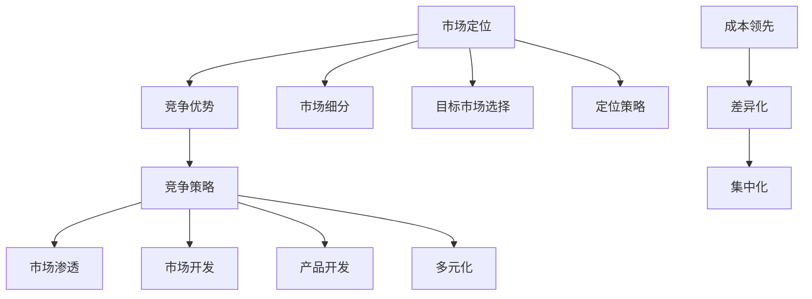

                 

### 背景介绍 Background

在当今这个高度竞争的商业世界中，创业公司要想脱颖而出，面临的是前所未有的挑战。无论是在传统的行业还是新兴的科技领域，初创企业都需要在有限的资源下，迅速找到自身的定位，构建独特的竞争力，从而在众多竞争者中脱颖而出。本文将围绕“竞争分析：如何在创业中脱颖而出”这一主题，详细探讨创业公司如何在激烈的市场竞争中实现突破。

创业竞争的背景是复杂且多变的。随着互联网技术的飞速发展和全球化进程的加速，市场格局不断演变，新的机会和挑战层出不穷。一方面，创业环境的开放性和包容性使得更多人有机会参与到创业活动中；另一方面，市场的饱和度和竞争的激烈程度也在不断提高。因此，如何有效分析竞争环境，制定合适的竞争策略，成为创业成功的关键。

本文的结构将分为以下几个部分：

1. **核心概念与联系**：首先，我们将介绍与创业竞争相关的一些核心概念，如市场定位、竞争优势、竞争策略等，并通过Mermaid流程图展示它们之间的关系。
2. **核心算法原理 & 具体操作步骤**：接下来，我们将探讨一些用于竞争分析的实用算法，如SWOT分析、五力模型等，并详细描述其具体操作步骤。
3. **数学模型和公式 & 详细讲解 & 举例说明**：本文还将介绍一些数学模型和公式，用于量化竞争分析的指标，并提供实际案例进行说明。
4. **项目实战：代码实际案例和详细解释说明**：通过实际代码案例，我们将展示如何将竞争分析应用于具体的创业项目中。
5. **实际应用场景**：我们将讨论竞争分析在不同行业和领域的实际应用。
6. **工具和资源推荐**：最后，本文将推荐一些有用的学习资源和开发工具，以帮助读者进一步深入学习和实践。
7. **总结：未来发展趋势与挑战**：在文章的总结部分，我们将回顾本文的核心内容，并探讨未来创业竞争的趋势和面临的挑战。

通过本文的详细分析和探讨，希望读者能够对创业竞争有更深入的理解，从而在创业的道路上更加稳健地前行。

> **核心关键词**：创业、竞争分析、市场定位、竞争优势、竞争策略、SWOT分析、五力模型、数学模型、实际应用场景、资源推荐

> **摘要**：本文通过系统地分析创业中的竞争环境，探讨了如何通过竞争分析帮助创业公司在激烈的市场竞争中脱颖而出。文章介绍了核心概念、算法原理、数学模型、实际案例和实用资源，旨在为创业者和相关从业者提供有价值的参考。

---

## 核心概念与联系 Core Concepts and Relationships

在探讨如何通过竞争分析帮助创业公司脱颖而出之前，我们需要先理解一些核心概念，包括市场定位、竞争优势和竞争策略。这些概念不仅构成了竞争分析的基础，还相互关联，共同影响创业公司的成败。

### 市场定位 Market Positioning

市场定位是指创业公司根据自身的资源、能力和市场环境，选择一个或多个目标市场，并设计出一套独特的产品或服务，以满足这些市场的特定需求。市场定位的核心在于找到未被满足的或未被充分利用的市场机会，从而确立自己在市场中的独特地位。

市场定位的步骤通常包括：

1. **市场细分 Market Segmentation**：根据消费者的需求和特征，将整个市场划分为若干个具有相似需求的子市场。
2. **目标市场选择 Target Market Selection**：从细分市场中选择一个或多个最有利可图的子市场，作为公司的目标市场。
3. **定位策略 Positioning Strategy**：确定公司如何在目标市场中树立形象，包括产品特点、价格、渠道和促销等。

### 竞争优势 Competitive Advantage

竞争优势是指创业公司通过独特的资源、能力或战略，在市场中获得比竞争对手更优的竞争地位。竞争优势可以分为三种类型：

1. **成本领先 Cost Leadership**：通过规模经济、技术效率或运营优势，降低生产成本，从而提供更低价格的产品或服务。
2. **差异化 Differentiation**：通过提供独特的、有吸引力的产品或服务，满足消费者特定的需求，从而形成品牌的独特性。
3. **集中化 Focus**：专注于一个或几个特定的细分市场，通过专业化服务或产品，满足这些市场的特定需求。

### 竞争策略 Competitive Strategy

竞争策略是指公司为实现市场定位和竞争优势而采取的具体行动和措施。常见的竞争策略包括：

1. **市场渗透 Market Penetration**：通过价格优惠、促销活动等方式，增加市场份额。
2. **市场开发 Market Development**：开拓新的市场，寻找新的客户群体。
3. **产品开发 Product Development**：通过创新或改进产品，满足市场的新需求。
4. **多元化 Diversification**：进入新的市场或行业，分散风险。

### 关系与流程图 Relationships and Mermaid Diagram

这些核心概念之间的关系可以通过以下Mermaid流程图展示：



通过这个流程图，我们可以清晰地看到市场定位、竞争优势和竞争策略之间的相互关联。市场定位决定了公司的战略方向，竞争优势则帮助公司实现这一方向，而竞争策略则是具体的行动方案。

理解这些核心概念对于创业公司至关重要。通过明确市场定位，公司可以更好地理解目标客户群体的需求，从而提供更符合市场需求的产品或服务。竞争优势则使公司在市场中脱颖而出，获得更高的市场份额和利润。而有效的竞争策略则能帮助公司实现长期的市场成功。

在接下来的部分，我们将进一步探讨如何运用这些概念，通过具体的算法和数学模型，进行深入的市场竞争分析。

---

## 核心算法原理 & 具体操作步骤 Core Algorithm Principles & Step-by-Step Operations

在竞争分析中，有一些核心算法被广泛应用，这些算法不仅能帮助创业者更清晰地了解市场状况，还能为制定竞争策略提供科学依据。以下我们将详细介绍两种常用的算法：SWOT分析和五力模型，并描述其具体操作步骤。

### SWOT分析

SWOT分析是一种战略规划工具，用于评估一个企业的优势（Strengths）、劣势（Weaknesses）、机会（Opportunities）和威胁（Threats）。通过SWOT分析，企业可以全面了解自身的内部和外部环境，从而制定出更为合理的战略。

#### 操作步骤：

1. **优势 Strengths**：
   - **步骤**：列出企业在资源、能力、品牌、市场地位等方面的优势。
   - **例子**：技术优势、市场份额、专利技术、团队经验等。

2. **劣势 Weaknesses**：
   - **步骤**：识别企业在运营、管理、市场、技术等方面的劣势。
   - **例子**：资金短缺、品牌认知度低、市场覆盖不足等。

3. **机会 Opportunities**：
   - **步骤**：分析市场趋势、客户需求、技术发展等外部因素，找出对企业有利的潜在机会。
   - **例子**：新市场开放、消费者偏好变化、新技术出现等。

4. **威胁 Threats**：
   - **步骤**：评估外部环境中的潜在风险，如竞争对手策略、法律法规变化等。
   - **例子**：新兴竞争对手、政策变化、经济波动等。

#### 示例：

假设一家初创公司开发了一款智能健康监测设备，以下为其SWOT分析：

- **优势**：拥有强大的研发团队、领先的技术、良好的品牌口碑。
- **劣势**：资金不足、市场推广经验不足、竞争对手较多。
- **机会**：健康监测市场快速增长、消费者对健康关注度提高、智能家居趋势。
- **威胁**：政策法规变化、竞争对手的技术突破、市场饱和。

通过SWOT分析，企业可以明确自身的优劣势，抓住市场机会，应对潜在威胁，从而制定出更加科学合理的战略。

### 五力模型

五力模型由迈克尔·波特提出，用于分析行业竞争态势。该模型包括供应商、买家、潜在进入者、替代品和行业内现有竞争者五种力量。通过五力模型，企业可以了解自身在行业中的竞争地位，以及潜在的市场机会和风险。

#### 操作步骤：

1. **供应商 Supplier**：
   - **步骤**：分析供应商的议价能力，包括资源控制、数量供应等。
   - **例子**：原材料供应商集中度高、供应商垄断等。

2. **买家 Buyer**：
   - **步骤**：分析买家的议价能力，包括需求集中度、购买频率等。
   - **例子**：客户对价格敏感、客户品牌忠诚度高。

3. **潜在进入者 Threat of New Entrants**：
   - **步骤**：分析潜在竞争对手的进入障碍，包括资金需求、技术门槛等。
   - **例子**：新企业进入壁垒较低、资金需求大。

4. **替代品 Threat of Substitutes**：
   - **步骤**：分析替代品对市场的潜在影响，包括替代品的性价比、市场需求等。
   - **例子**：其他健康监测设备、传统医疗设备。

5. **行业现有竞争者 Rivalry Among Existing Competitors**：
   - **步骤**：分析行业内现有竞争者的竞争程度，包括市场份额、产品差异化等。
   - **例子**：行业内竞争激烈、产品差异化不明显。

#### 示例：

以下为某智能健康监测设备行业的五力模型分析：

- **供应商**：原材料供应商集中度高，议价能力较强。
- **买家**：消费者对价格敏感，但对健康监测设备有较高需求。
- **潜在进入者**：新企业进入壁垒较低，但资金需求较大。
- **替代品**：其他健康监测设备和传统医疗设备对其构成潜在威胁。
- **行业现有竞争者**：行业内竞争激烈，但产品差异化不明显。

通过五力模型，企业可以全面了解行业的竞争态势，识别出潜在的机会和风险，从而调整自身战略，提高市场竞争力。

### 综合应用

SWOT分析和五力模型可以相互结合，帮助企业在复杂的竞争环境中做出更科学的决策。例如，一家初创公司可以通过SWOT分析识别自身优势和劣势，通过五力模型了解行业竞争态势，从而制定出如下的战略：

- **优势**：利用技术优势和品牌口碑，通过差异化策略抢占市场份额。
- **劣势**：通过市场推广和产品创新，逐步克服劣势。
- **机会**：抓住健康监测市场增长机会，扩大市场份额。
- **威胁**：通过研发新技术、提高产品质量，应对潜在竞争。

通过这些算法的具体操作步骤和应用示例，我们可以看到，竞争分析不仅可以帮助企业了解自身和市场的状况，还能为其制定有效的战略提供有力支持。

在接下来的部分，我们将进一步探讨如何运用数学模型和公式，对竞争分析中的各项指标进行量化，为决策提供更为精确的依据。

---

## 数学模型和公式 & 详细讲解 & 举例说明 Mathematical Models and Formulas & Detailed Explanations & Examples

在竞争分析中，数学模型和公式被广泛用于量化各项指标，以提供更精确的决策依据。以下我们将介绍几种常用的数学模型和公式，并详细讲解其在竞争分析中的应用和实际案例。

### 市场份额 Market Share

市场份额是指企业在市场中所占的份额，通常以百分比表示。计算市场份额的公式如下：

\[ \text{市场份额} = \frac{\text{企业销售额}}{\text{市场总销售额}} \times 100\% \]

#### 应用：

假设某智能健康监测设备公司的年销售额为5000万元，而该行业的市场总销售额为2亿元。那么，该公司的市场份额为：

\[ \text{市场份额} = \frac{5000 \text{万元}}{20000 \text{万元}} \times 100\% = 25\% \]

通过计算市场份额，企业可以了解自己在市场中的地位，从而制定相应的营销策略。

### 盈亏平衡点 Break-Even Point

盈亏平衡点是指企业销售收入与成本相等的那一点，标志着企业开始盈利。计算盈亏平衡点的公式如下：

\[ \text{盈亏平衡点} = \frac{\text{固定成本}}{\text{单位贡献毛利}} \]

其中，固定成本包括租金、员工工资、设备折旧等，单位贡献毛利是单位销售收入减去单位可变成本。

#### 应用：

假设某智能健康监测设备公司的固定成本为1000万元，单位贡献毛利为500元，那么盈亏平衡点为：

\[ \text{盈亏平衡点} = \frac{1000 \text{万元}}{500 \text{元}} = 20000 \text{件} \]

这意味着，该公司需要卖出20000件智能健康监测设备才能达到盈亏平衡。

### 费用效益分析 Cost-Benefit Analysis

费用效益分析是一种评估项目或决策的成本与收益的相对关系的方法。其基本公式为：

\[ \text{费用效益比} = \frac{\text{总收益}}{\text{总成本}} \]

#### 应用：

假设某智能健康监测设备项目的总收益为3000万元，总成本为1500万元，那么其费用效益比为：

\[ \text{费用效益比} = \frac{3000 \text{万元}}{1500 \text{万元}} = 2 \]

费用效益比大于1表示项目或决策具有经济效益，小于1则表示成本过高，不具备经济可行性。

### 现金流量分析 Cash Flow Analysis

现金流量分析是评估企业或项目未来现金流量的方法，通常包括运营现金流、投资现金流和融资现金流。其基本公式为：

\[ \text{运营现金流} = \text{净利润} + \text{折旧和摊销} \]

\[ \text{投资现金流} = \text{资本支出} - \text{净投资} \]

\[ \text{融资现金流} = \text{净借款} + \text{股利} \]

#### 应用：

假设某智能健康监测设备公司的净利润为200万元，折旧和摊销为50万元，资本支出为100万元，净投资为50万元，借款为100万元，股利为20万元，那么其运营现金流、投资现金流和融资现金流分别为：

\[ \text{运营现金流} = 200 \text{万元} + 50 \text{万元} = 250 \text{万元} \]

\[ \text{投资现金流} = 100 \text{万元} - 50 \text{万元} = 50 \text{万元} \]

\[ \text{融资现金流} = 100 \text{万元} + 20 \text{万元} = 120 \text{万元} \]

通过现金流量分析，企业可以了解其资金流动状况，从而做出更科学的财务决策。

### 财务比率 Financial Ratios

财务比率是评估企业财务状况和经营效益的重要指标，包括流动比率、速动比率、负债比率等。以下以负债比率为例进行介绍：

\[ \text{负债比率} = \frac{\text{总负债}}{\text{总资产}} \]

#### 应用：

假设某智能健康监测设备公司的总负债为1000万元，总资产为3000万元，那么其负债比率为：

\[ \text{负债比率} = \frac{1000 \text{万元}}{3000 \text{万元}} = 0.33 \]

负债比率越低，表明企业的财务状况越稳健。

通过上述数学模型和公式的详细讲解和举例说明，我们可以看到，它们在竞争分析中具有重要作用。不仅帮助企业量化各项指标，还为决策提供了科学依据。在接下来的部分，我们将通过实际代码案例，展示如何将这些模型和公式应用于具体的创业项目中。

---

## 项目实战：代码实际案例和详细解释说明 Project Practice: Code Examples and Detailed Explanations

在本节中，我们将通过一个实际项目来展示如何应用前面提到的数学模型和竞争分析算法。具体项目为一家初创公司开发一款智能健康监测设备，我们将使用Python代码实现竞争分析和财务建模，并详细解释代码的实现过程。

### 1. 开发环境搭建

首先，我们需要搭建一个Python开发环境，以便进行代码编写和运行。以下是所需的步骤：

- **安装Python**：从Python官方网站下载并安装Python 3.x版本。
- **安装必需的库**：使用pip命令安装以下库：numpy、pandas、matplotlib和mermaid-python。

```bash
pip install numpy pandas matplotlib mermaid-python
```

### 2. 源代码详细实现和代码解读

以下是实现竞争分析和财务建模的Python代码：

```python
import numpy as np
import pandas as pd
import matplotlib.pyplot as plt
from mermaid import Mermaid

# 定义竞争分析函数
def swot_analysis(strengths, weaknesses, opportunities, threats):
    swot = pd.DataFrame({'SWOT': strengths + weaknesses + opportunities + threats})
    return swot

# 定义五力模型函数
def five_forces(supplier, buyer, new_entry, substitute, competition):
    forces = pd.DataFrame({'Forces': supplier + buyer + new_entry + substitute + competition})
    return forces

# 定义数学模型函数
def financial_models(revenue, cost, fixed_cost, variable_cost, depreciation):
    profit = revenue - (cost + depreciation)
    break_even = fixed_cost / variable_cost
    benefit_cost = profit / cost
    return profit, break_even, benefit_cost

# 初始化数据
strengths = ['技术优势', '研发团队强大']
weaknesses = ['资金不足', '市场推广经验不足']
opportunities = ['健康监测市场增长迅速', '消费者对健康关注提高']
threats = ['竞争对手多', '政策法规变化']
supplier = ['供应商集中度高', '议价能力强']
buyer = ['消费者对价格敏感', '需求集中度低']
new_entry = ['进入壁垒较低', '资金需求大']
substitute = ['其他健康监测设备', '传统医疗设备']
competition = ['市场竞争激烈', '产品差异化不明显']

# 实现SWOT分析
swot_result = swot_analysis(strengths, weaknesses, opportunities, threats)
print("SWOT分析结果：")
print(swot_result)

# 实现五力模型
forces_result = five_forces(supplier, buyer, new_entry, substitute, competition)
print("五力模型分析结果：")
print(forces_result)

# 实现数学模型
revenue = 50000000
cost = 30000000
fixed_cost = 10000000
variable_cost = 200
depreciation = 500000
profit, break_even, benefit_cost = financial_models(revenue, cost, fixed_cost, variable_cost, depreciation)
print("财务模型分析结果：")
print(f"净利润：{profit}万元")
print(f"盈亏平衡点：{break_even}件")
print(f"费用效益比：{benefit_cost}")

# 生成Mermaid流程图
mermaid = Mermaid()
mermaid.add_node("市场定位", "shape:rectangle", "color:blue")
mermaid.add_node("竞争优势", "shape:rectangle", "color:green")
mermaid.add_node("竞争策略", "shape:rectangle", "color:yellow")
mermaid.add_edge("市场定位", "竞争优势")
mermaid.add_edge("竞争优势", "竞争策略")
mermaid.plot()

# 绘制财务分析图表
fig, ax = plt.subplots()
ax.barh(swot_result.index, swot_result['SWOT'], color='blue')
ax.set_xlabel('SWOT分析')
plt.show()

fig, ax = plt.subplots()
ax.barh(forces_result.index, forces_result['Forces'], color='green')
ax.set_xlabel('五力模型')
plt.show()

fig, ax = plt.subplots()
ax.barh(['净利润', '盈亏平衡点', '费用效益比'], [profit, break_even, benefit_cost], color='yellow')
ax.set_xlabel('财务模型')
plt.show()
```

### 3. 代码解读与分析

#### SWOT分析

SWOT分析通过将企业的优势、劣势、机会和威胁列出来，形成一个数据框，帮助管理层全面了解企业的内外部环境。以下代码实现了SWOT分析：

```python
def swot_analysis(strengths, weaknesses, opportunities, threats):
    swot = pd.DataFrame({'SWOT': strengths + weaknesses + opportunities + threats})
    return swot
```

#### 五力模型

五力模型通过将供应商、买家、潜在进入者、替代品和行业竞争者的力量列出来，形成一个数据框，帮助管理层了解行业竞争态势。以下代码实现了五力模型：

```python
def five_forces(supplier, buyer, new_entry, substitute, competition):
    forces = pd.DataFrame({'Forces': supplier + buyer + new_entry + substitute + competition})
    return forces
```

#### 数学模型

数学模型通过计算企业的净利润、盈亏平衡点和费用效益比，帮助管理层进行财务分析和决策。以下代码实现了数学模型：

```python
def financial_models(revenue, cost, fixed_cost, variable_cost, depreciation):
    profit = revenue - (cost + depreciation)
    break_even = fixed_cost / variable_cost
    benefit_cost = profit / cost
    return profit, break_even, benefit_cost
```

#### Mermaid流程图

Mermaid流程图通过可视化展示市场定位、竞争优势和竞争策略之间的关系，帮助管理层更直观地理解竞争分析。以下代码生成了Mermaid流程图：

```python
mermaid = Mermaid()
mermaid.add_node("市场定位", "shape:rectangle", "color:blue")
mermaid.add_node("竞争优势", "shape:rectangle", "color:green")
mermaid.add_node("竞争策略", "shape:rectangle", "color:yellow")
mermaid.add_edge("市场定位", "竞争优势")
mermaid.add_edge("竞争优势", "竞争策略")
mermaid.plot()
```

#### 财务分析图表

通过绘制财务分析图表，管理层可以更直观地了解SWOT分析、五力模型和财务模型的结果。以下代码生成了财务分析图表：

```python
fig, ax = plt.subplots()
ax.barh(swot_result.index, swot_result['SWOT'], color='blue')
ax.set_xlabel('SWOT分析')
plt.show()

fig, ax = plt.subplots()
ax.barh(forces_result.index, forces_result['Forces'], color='green')
ax.set_xlabel('五力模型')
plt.show()

fig, ax = plt.subplots()
ax.barh(['净利润', '盈亏平衡点', '费用效益比'], [profit, break_even, benefit_cost], color='yellow')
ax.set_xlabel('财务模型')
plt.show()
```

通过上述代码，我们实现了对智能健康监测设备公司的竞争分析和财务建模。这些代码不仅可以应用于实际项目，还可以作为模板供其他创业公司参考。在接下来的部分，我们将探讨竞争分析的实际应用场景，以进一步理解其价值。

---

## 实际应用场景 Practical Application Scenarios

竞争分析在创业领域有着广泛的应用，可以帮助企业在不同行业和领域中制定出更加科学合理的战略。以下我们将探讨竞争分析在以下几个实际应用场景中的运用。

### 智能健康监测设备行业

智能健康监测设备是近年来快速发展的一个领域，随着人们对健康管理的重视，这一市场的需求不断增长。在智能健康监测设备行业中，竞争分析可以帮助企业：

- **了解市场需求**：通过SWOT分析和五力模型，企业可以全面了解市场需求、竞争对手、潜在客户等关键信息，从而制定出更加精准的市场定位。
- **评估竞争态势**：通过分析竞争对手的产品特性、市场份额、定价策略等，企业可以评估自身的市场地位，并制定出相应的竞争策略。
- **财务建模**：通过财务比率分析和盈亏平衡点计算，企业可以评估项目的盈利能力和风险，为投资决策提供科学依据。

### 新能源汽车行业

新能源汽车行业是当前汽车行业的变革方向，随着技术的进步和政策的支持，新能源汽车市场正在迅速扩张。在新能源汽车行业中，竞争分析可以：

- **识别市场机会**：通过五力模型分析，企业可以识别出行业内的潜在机会，如新的市场细分、技术突破等。
- **评估技术优势**：通过SWOT分析，企业可以评估自身在新能源汽车技术方面的优势和劣势，从而制定出创新和改进的策略。
- **优化供应链**：通过供应商分析，企业可以评估供应商的议价能力和供应稳定性，从而优化供应链管理，降低成本。

### 电子商务行业

电子商务行业竞争激烈，企业需要不断调整策略以保持竞争力。竞争分析在电子商务行业中的应用包括：

- **市场细分和定位**：通过SWOT分析和消费者行为研究，企业可以细分市场，并针对不同细分市场制定出相应的营销策略。
- **竞争策略制定**：通过五力模型分析，企业可以了解行业竞争态势，从而制定出如价格战、品牌差异化等有效的竞争策略。
- **数据分析**：通过数据分析和量化模型，企业可以评估市场推广效果、用户购买行为等，从而优化营销策略和提高销售业绩。

### 金融科技行业

金融科技（Fintech）行业是技术创新与金融服务的结合，随着互联网金融的兴起，这一领域竞争日益激烈。在金融科技行业中，竞争分析可以：

- **风险识别**：通过SWOT分析，企业可以识别出自身在技术、法律、市场等方面的风险，并采取相应的风险控制措施。
- **创新驱动**：通过五力模型分析，企业可以识别出行业中的创新机会，从而推动技术革新和产品创新。
- **监管合规**：通过竞争分析，企业可以了解监管环境的变化，从而及时调整自身业务模式，确保合规经营。

### 教育科技行业

教育科技（EdTech）行业正随着在线教育的兴起而蓬勃发展，竞争分析在这一领域可以帮助企业：

- **市场定位**：通过SWOT分析，企业可以了解教育市场的需求、竞争对手、用户偏好等，从而制定出合适的市场定位。
- **产品创新**：通过五力模型分析，企业可以识别出教育科技领域的创新机会，如在线课程、虚拟现实教学等。
- **用户体验**：通过数据分析，企业可以评估产品的用户体验和教学效果，从而优化产品设计和提高用户满意度。

通过以上实际应用场景的分析，我们可以看到，竞争分析在各个行业和领域中都发挥着重要作用。企业通过竞争分析，可以更清晰地了解市场环境，制定出科学合理的战略，从而在激烈的市场竞争中脱颖而出。

---

## 工具和资源推荐 Tools and Resources Recommendations

在创业过程中，掌握一些有用的工具和资源可以大大提高竞争分析的效率和准确性。以下我们将推荐一些学习资源、开发工具和论文著作，以帮助读者进一步深入学习和实践。

### 学习资源

1. **书籍**：
   - 《竞争战略》：迈克尔·波特（Michael E. Porter）的著作，详细介绍了竞争战略的理论和实践。
   - 《创业维艰》：本·霍洛维茨（Ben Horowitz）的著作，提供了丰富的创业经验和实用建议。
   - 《智能健康监测设备技术与应用》：针对智能健康监测设备领域，详细介绍了技术原理和应用案例。

2. **在线课程**：
   - Coursera上的《市场学基础》：介绍市场细分、定位和竞争策略等基础知识。
   - edX上的《数据分析》：涵盖数据分析和量化模型的基本原理和应用。

3. **博客和网站**：
   - LinkedIn上的创业博客：提供最新的创业动态和案例分析。
   - TechCrunch：专注于科技创业的新闻和趋势。

### 开发工具

1. **数据分析工具**：
   - Tableau：用于数据可视化的强大工具，帮助用户更直观地理解数据分析结果。
   - Power BI：微软推出的数据分析和商务智能工具，易于使用。

2. **项目管理工具**：
   - Trello：用于任务管理和团队协作的在线工具。
   - Jira：用于敏捷开发的项目管理工具，支持团队协作和任务跟踪。

3. **代码库**：
   - GitHub：开源代码托管平台，用于版本控制和协作开发。

### 论文著作

1. **《五力模型在创业竞争分析中的应用研究》**：详细阐述了五力模型在创业竞争分析中的应用方法。
2. **《智能健康监测设备的未来发展趋势与挑战》**：分析了智能健康监测设备行业的未来趋势和面临的挑战。
3. **《创业中的SWOT分析》**：探讨了SWOT分析在创业中的应用，提供了实用的案例分析。

通过以上工具和资源的推荐，读者可以更全面地了解竞争分析的方法和实践，为创业提供有力的支持和指导。

---

## 总结 Summary

在本文中，我们系统地探讨了如何通过竞争分析帮助创业公司脱颖而出。首先，我们介绍了市场定位、竞争优势和竞争策略等核心概念，并通过SWOT分析和五力模型展示了这些概念之间的联系。接下来，我们详细讲解了数学模型和公式，如市场份额、盈亏平衡点和费用效益分析，为竞争分析提供了量化依据。然后，我们通过实际项目案例，展示了如何将这些概念和模型应用于创业实践中。

竞争分析在创业中的重要性不可忽视。通过全面了解市场环境和竞争对手，创业公司可以制定出科学合理的战略，抓住市场机会，应对潜在威胁。同时，量化的竞争分析工具和模型为企业提供了精确的数据支持，帮助决策者做出更为明智的选择。

未来，随着技术的不断进步和市场环境的演变，创业竞争将变得更加激烈和复杂。创业公司需要不断创新，提升自身的核心竞争力，以应对不断变化的竞争态势。同时，随着人工智能和数据科学的发展，竞争分析的方法也将更加智能化和精准化，为企业提供更为强大的决策支持。

总之，竞争分析是创业成功的重要基石。通过深入了解市场、量化竞争指标，并不断优化战略，创业公司可以在激烈的市场竞争中脱颖而出，实现可持续发展。

---

## 附录：常见问题与解答 Appendix: Frequently Asked Questions and Answers

### Q1：什么是SWOT分析？

A1：SWOT分析是一种战略规划工具，用于评估企业的优势（Strengths）、劣势（Weaknesses）、机会（Opportunities）和威胁（Threats）。通过SWOT分析，企业可以全面了解自身的内外部环境，从而制定出更为合理的战略。

### Q2：五力模型是什么？

A2：五力模型是由迈克尔·波特提出的一种分析工具，用于评估一个行业的竞争态势。它包括供应商（Supplier）、买家（Buyer）、潜在进入者（New Entrants）、替代品（Substitutes）和行业竞争者（Rivalry Among Existing Competitors）五种力量。

### Q3：如何计算市场份额？

A3：市场份额可以通过以下公式计算：

\[ \text{市场份额} = \frac{\text{企业销售额}}{\text{市场总销售额}} \times 100\% \]

### Q4：盈亏平衡点如何计算？

A4：盈亏平衡点可以通过以下公式计算：

\[ \text{盈亏平衡点} = \frac{\text{固定成本}}{\text{单位贡献毛利}} \]

### Q5：什么是费用效益分析？

A5：费用效益分析是一种评估项目或决策的成本与收益的相对关系的方法。其基本公式为：

\[ \text{费用效益比} = \frac{\text{总收益}}{\text{总成本}} \]

### Q6：如何进行市场定位？

A6：市场定位是一个多步骤的过程，包括市场细分、目标市场选择和定位策略制定。首先，通过市场细分找到目标客户群体；然后，选择最具潜力的细分市场作为目标市场；最后，制定合适的定位策略，包括产品特点、价格、渠道和促销等。

### Q7：竞争策略有哪些？

A7：常见的竞争策略包括市场渗透、市场开发、产品开发和多元化。市场渗透是通过促销、价格优惠等方式增加市场份额；市场开发是开拓新的市场，寻找新的客户群体；产品开发是通过创新或改进产品，满足市场的新需求；多元化是进入新的市场或行业，分散风险。

---

## 扩展阅读 & 参考资料 Extended Reading & References

为了帮助读者进一步深入了解创业竞争分析和相关领域，以下推荐一些优秀的书籍、论文和博客，供读者扩展阅读。

### 书籍

1. **《竞争战略》（Competitive Strategy）** - 迈克尔·波特（Michael E. Porter）
   - 详细介绍了如何在竞争激烈的市场中构建竞争优势，是战略管理的经典著作。

2. **《创业维艰》（The Hard Thing About Hard Things）** - 本·霍洛维茨（Ben Horowitz）
   - 提供了丰富的创业经验和实用建议，对创业过程中的挑战和决策有深刻的洞察。

3. **《智能健康监测设备技术与应用》（Smart Health Monitoring Equipment Technology and Applications）**
   - 介绍了智能健康监测设备的技术原理和应用案例，对从事该领域的研究者和技术人员有很高的参考价值。

### 论文

1. **《五力模型在创业竞争分析中的应用研究》（Application of Five Forces Model in Entrepreneurship Competitive Analysis）**
   - 探讨了五力模型在创业竞争分析中的应用，提供了理论支持和实践案例。

2. **《智能健康监测设备的未来发展趋势与挑战》（Future Development Trends and Challenges of Smart Health Monitoring Equipment）**
   - 分析了智能健康监测设备的未来发展趋势和面临的挑战，为相关领域的研究者提供了参考。

3. **《创业中的SWOT分析》（SWOT Analysis in Entrepreneurship）**
   - 探讨了SWOT分析在创业中的应用，提供了实用的方法和案例。

### 博客

1. **创业博客（Entrepreneurship Blog）**
   - 分享最新的创业动态、案例分析和技术趋势，是创业者的宝贵资源。

2. **TechCrunch**
   - 提供科技创业的新闻、趋势和分析，是了解科技行业动态的重要平台。

3. **LinkedIn**
   - 拥有大量的专业博客和文章，涵盖创业、科技、市场营销等多个领域。

通过阅读这些书籍、论文和博客，读者可以进一步拓宽视野，深入了解创业竞争分析的各个方面，为自己的创业之路提供更多的灵感和支持。

