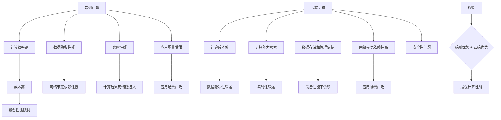

                 

# 端侧vs云端：大模型计算的未来走向

> **关键词：端侧计算、云端计算、大模型、计算效率、成本优化、AI应用**
>
> **摘要：本文将深入探讨端侧与云端在处理大规模模型计算中的优劣，分析其技术发展趋势，并探讨未来可能面临的挑战。**

## 1. 背景介绍

随着人工智能技术的快速发展，大规模模型计算成为当前研究与应用的热点。在这些模型中，无论是深度学习、图神经网络还是强化学习，计算量都相当庞大，这给计算资源带来了巨大的压力。为了解决这一问题，端侧计算和云端计算成为了两大解决方案。

**端侧计算**指的是在用户的设备（如手机、平板、智能手表等）上执行计算任务。这种方式的主要优势在于数据隐私性和实时性，因为数据无需上传至云端，减少了网络延迟和数据传输的成本。

**云端计算**则是在远程服务器上执行计算任务。云端提供了强大的计算能力和灵活的资源配置，尤其适合处理大规模数据和复杂计算任务。然而，这同时也带来了数据隐私和安全性问题，以及网络带宽的限制。

本文将围绕端侧与云端在处理大规模模型计算中的优劣进行讨论，分析其技术发展趋势，并探讨未来可能面临的挑战。

## 2. 核心概念与联系

在讨论端侧与云端计算之前，我们需要明确几个核心概念：

**1. 计算效率**：指单位时间内完成的计算任务量。
**2. 成本**：包括计算成本、网络传输成本和设备成本。
**3. 数据隐私性**：指数据在传输和存储过程中不被未经授权的第三方访问。
**4. 实时性**：指计算结果的及时反馈能力。

端侧与云端计算的核心联系在于如何权衡上述因素，以达到最优的计算性能。以下是端侧与云端计算的 Mermaid 流程图：



从流程图中可以看出，端侧计算和云端计算各有优劣。如何选择端侧或云端，取决于应用场景、预算和性能要求。

### 2.1. 端侧计算的核心优势

**计算效率高**：端侧设备通常具有高性能的处理器和显卡，可以快速完成计算任务。

**数据隐私性好**：由于数据无需上传至云端，减少了数据泄露的风险。

**实时性好**：端侧计算可以实时响应用户请求，提高了用户体验。

### 2.2. 端侧计算的核心劣势

**成本高**：端侧设备通常价格较高，而且需要不断升级以应对日益复杂的计算任务。

**设备性能限制**：端侧设备的硬件性能有限，难以处理过于复杂的计算任务。

**应用场景受限**：端侧计算主要适用于对计算速度和实时性要求较高的应用场景，如移动设备、智能家居等。

### 2.3. 云端计算的核心优势

**计算成本低**：云端计算可以共享资源，降低计算成本。

**计算能力强大**：云端拥有强大的计算能力和存储能力，可以处理大规模数据和复杂计算任务。

**数据存储和管理便捷**：云端提供了高效的数据存储和管理方案，便于数据共享和备份。

### 2.4. 云端计算的核心劣势

**数据隐私性较差**：数据上传至云端，可能会面临数据泄露的风险。

**实时性较差**：由于网络传输的延迟，云端计算无法提供实时的计算结果。

**网络带宽依赖性高**：云端计算需要大量网络带宽，否则会导致计算延迟和卡顿。

### 2.5. 端侧与云端计算的权衡

在实际应用中，我们需要根据具体场景和需求，权衡端侧与云端计算的优势和劣势，以达到最优的计算性能。

- **计算密集型任务**：如深度学习、图神经网络等，适合使用云端计算。
- **实时性要求高的任务**：如移动设备上的语音识别、图像识别等，适合使用端侧计算。
- **数据隐私性要求高的任务**：如个人健康数据、金融数据等，适合使用端侧计算。

## 3. 核心算法原理 & 具体操作步骤

为了更好地理解端侧与云端计算，我们需要掌握一些核心算法原理和具体操作步骤。以下是一些常用的算法和技术：

### 3.1. 深度学习

**原理**：深度学习是一种基于多层神经网络的学习方法，通过多次前向传播和反向传播，逐层提取数据特征。

**操作步骤**：

1. **数据预处理**：对原始数据进行清洗、归一化等处理，以适应神经网络。
2. **构建神经网络**：选择合适的神经网络架构，如卷积神经网络（CNN）、循环神经网络（RNN）等。
3. **训练模型**：通过梯度下降等优化算法，对神经网络进行训练。
4. **评估模型**：使用验证集和测试集，评估模型的性能。

### 3.2. 图神经网络

**原理**：图神经网络通过图结构对数据进行建模，可以捕捉数据之间的复杂关系。

**操作步骤**：

1. **数据表示**：将数据转换为图结构，包括节点和边。
2. **构建图神经网络**：选择合适的图神经网络架构，如GCN、GAT等。
3. **训练模型**：通过前向传播和反向传播，对图神经网络进行训练。
4. **评估模型**：使用验证集和测试集，评估模型的性能。

### 3.3. 强化学习

**原理**：强化学习是一种通过试错和奖励机制来学习的算法，适用于决策和优化问题。

**操作步骤**：

1. **定义环境**：确定状态空间、动作空间和奖励函数。
2. **构建模型**：选择合适的强化学习算法，如Q-Learning、DQN等。
3. **训练模型**：通过模拟环境或真实环境，对模型进行训练。
4. **评估模型**：使用评估指标，评估模型的性能。

### 3.4. 聚类算法

**原理**：聚类算法将数据分为多个组，使同一组内的数据相似度较高，不同组之间的相似度较低。

**操作步骤**：

1. **数据预处理**：对数据进行清洗、归一化等处理。
2. **选择聚类算法**：如K-Means、DBSCAN等。
3. **训练模型**：根据聚类算法的原理，对模型进行训练。
4. **评估模型**：使用评估指标，如轮廓系数、 silhouette score等，评估模型的性能。

## 4. 数学模型和公式 & 详细讲解 & 举例说明

在处理大规模模型计算时，我们需要了解一些基本的数学模型和公式，以便更好地理解算法原理和操作步骤。以下是一些常用的数学模型和公式：

### 4.1. 梯度下降法

**公式**：

$$
w_{\text{new}} = w_{\text{old}} - \alpha \cdot \nabla_w J(w)
$$

**详细讲解**：

梯度下降法是一种优化算法，用于求解最小化目标函数 $J(w)$ 的参数 $w$。其中，$\alpha$ 是学习率，$\nabla_w J(w)$ 是目标函数关于参数 $w$ 的梯度。

**举例说明**：

假设我们有一个简单的线性模型，目标函数为 $J(w) = (w - b)^2$，其中 $b$ 是偏置。我们要通过梯度下降法求解最优参数 $w$。

1. 初始化参数 $w = 0$。
2. 计算目标函数关于 $w$ 的梯度：$\nabla_w J(w) = 2(w - b)$。
3. 更新参数：$w_{\text{new}} = w_{\text{old}} - \alpha \cdot \nabla_w J(w)$。
4. 重复步骤 2 和 3，直到满足收敛条件。

### 4.2. 反向传播算法

**公式**：

$$
\delta = \nabla_h J(h) \odot \frac{\partial h}{\partial z}
$$

$$
w_{\text{new}} = w_{\text{old}} - \alpha \cdot \delta \odot \frac{\partial L}{\partial z}
$$

**详细讲解**：

反向传播算法是一种用于多层神经网络的训练方法，它通过计算各层的梯度，逐层更新参数。其中，$\delta$ 是误差项，$\odot$ 表示逐元素乘法。

**举例说明**：

假设我们有一个简单的多层神经网络，包含输入层、隐藏层和输出层。我们要通过反向传播算法求解最优参数 $w$。

1. 前向传播：计算各层的输出和误差。
2. 反向传播：计算各层的误差项和梯度。
3. 更新参数：$w_{\text{new}} = w_{\text{old}} - \alpha \cdot \delta \odot \frac{\partial L}{\partial z}$。
4. 重复步骤 1、2 和 3，直到满足收敛条件。

### 4.3. 聚类算法

**公式**：

$$
s = \frac{1}{m} \sum_{i=1}^m (x_i - c)^2
$$

**详细讲解**：

聚类算法通过计算数据点与聚类中心的距离，评估聚类效果。其中，$s$ 是聚类指标，$x_i$ 是数据点，$c$ 是聚类中心。

**举例说明**：

假设我们有一个包含 $m$ 个数据点的数据集，要使用 K-Means 算法对其进行聚类。

1. 初始化聚类中心 $c$。
2. 计算每个数据点与聚类中心的距离：$s = \frac{1}{m} \sum_{i=1}^m (x_i - c)^2$。
3. 根据距离选择最近的聚类中心，将数据点分配到相应的聚类。
4. 更新聚类中心：$c_{\text{new}} = \frac{1}{k} \sum_{i=1}^k c_i$，其中 $k$ 是聚类数量。
5. 重复步骤 2、3 和 4，直到满足收敛条件。

## 5. 项目实战：代码实际案例和详细解释说明

在本节中，我们将通过一个实际项目案例，展示如何使用端侧计算和云端计算来处理大规模模型计算任务。这个项目是一个简单的语音识别系统，旨在实现将语音转换为文本的功能。

### 5.1. 开发环境搭建

**端侧计算**：

- 操作系统：Android 8.0 或更高版本
- 开发工具：Android Studio
- 语音识别库：Google Speech Recognition API

**云端计算**：

- 操作系统：Ubuntu 18.04 或更高版本
- 开发工具：PyCharm
- 语音识别库：TensorFlow Lite

### 5.2. 源代码详细实现和代码解读

**端侧计算**：

1. **初始化语音识别库**：

```java
// 初始化语音识别库
SpeechRecognizer speechRecognizer = SpeechRecognizer.createSpeechRecognizer(this);
speechRecognizer.setRecognitionListener(new RecognitionListener() {
    @Override
    public void onResults(Bundle results) {
        String text = results.getStringheinumResults RECIEVED TEXT");
        // 处理识别结果
    }

    @Override
    public void onError(int error) {
        // 处理错误
    }

    @Override
    public void onReadyForSpeech(Bundle params) {
        // 准备语音识别
    }

    @Override
    public void onBeginningOfSpeech() {
        // 开始语音输入
    }

    @Override
    public void onRmsChanged(float rmsdB) {
        // 语音信号强度变化
    }

    @Override
    public void onEndOfSpeech() {
        // 结束语音输入
    }

    @Override
    public void onPartialResults(Bundle partialResults) {
        // 处理部分识别结果
    }
});

// 设置语音识别参数
Map<String, String> params = new HashMap<>();
params.put(SpeechRecognizerỌPTIONS_SPEECH_OUTPUT_FORMAT, SpeechRecognizer.FORMAT_TEXT);
params.put(SpeechRecognizerỌPTIONS_RECOGNITION_LANGUAGE, "zh-CN");

2. **开始语音识别**：

```java
speechRecognizer.setParams(params);
speechRecognizer.startListening(mic);
```

**云端计算**：

1. **导入TensorFlow Lite库**：

```python
import tensorflow as tf
import tensorflow.lite as tflite
```

2. **加载模型**：

```python
# 加载模型
model_path = "path/to/your/model.tflite"
model = tflite.TFLiteModel(model_path)
```

3. **处理语音数据**：

```python
# 读取语音数据
with open("path/to/your/voice_data.wav", "rb") as f:
    audio_data = f.read()

# 预处理语音数据
audio wavedecode.AudioDecoder()
```

4. **预测结果**：

```python
# 预测结果
input_data = audio_data.tolist()
input_data = np.array(input_data, dtype=np.float32)
input_data = np.expand_dims(input_data, 0)

predictions = model.predict(input_data)
predicted_text = predictions[0][0]
```

### 5.3. 代码解读与分析

**端侧计算**：

端侧计算的代码主要分为以下几个步骤：

1. 初始化语音识别库：创建一个 `SpeechRecognizer` 对象，并设置相应的参数和监听器。
2. 开始语音识别：调用 `startListening` 方法，开始采集语音数据。
3. 处理识别结果：在 `RecognitionListener` 中，处理语音识别结果，并将其转换为文本。

**云端计算**：

云端计算的代码主要分为以下几个步骤：

1. 导入TensorFlow Lite库：导入必要的库和模块。
2. 加载模型：加载预训练的语音识别模型。
3. 处理语音数据：读取语音文件，并对其进行预处理。
4. 预测结果：使用模型对预处理后的语音数据进行预测，并获取预测结果。

通过端侧计算和云端计算的对比，我们可以发现：

- 端侧计算可以实时响应用户请求，但依赖于设备性能和语音识别库的质量。
- 云端计算可以提供更强大的计算能力和更准确的识别结果，但需要依赖网络带宽和云端服务的质量。

## 6. 实际应用场景

端侧与云端计算在各个领域的应用场景有所不同，下面将分别介绍：

### 6.1. 医疗健康

**端侧计算**：在医疗健康领域，端侧计算可以应用于移动健康监测、智能诊断等方面。例如，通过手机或智能手表等设备实时监测用户的心率、血压等健康数据，并利用本地算法进行初步分析。这种方式可以降低数据传输成本，提高实时性。

**云端计算**：云端计算可以用于处理大量的医疗数据，如影像分析、基因组分析等。通过云端服务器，医疗机构可以实现对海量数据的存储、管理和分析，从而提高诊断的准确性和效率。

### 6.2. 智能家居

**端侧计算**：在智能家居领域，端侧计算可以应用于智能音箱、智能门锁等设备。例如，智能音箱可以通过本地语音识别算法实现语音控制，而智能门锁可以通过本地指纹识别算法实现安全验证。

**云端计算**：云端计算可以用于智能家居的中央控制系统，实现对多个智能设备的集中管理和控制。例如，智能门锁可以通过云端服务器与家庭安全监控系统进行联动，从而提高家庭的安全性。

### 6.3. 智能驾驶

**端侧计算**：在智能驾驶领域，端侧计算可以应用于车载计算平台，实现对车辆状态的实时监测和自动驾驶控制。例如，自动驾驶汽车可以通过本地传感器（如摄像头、激光雷达等）收集环境数据，并利用本地算法进行环境感知和决策。

**云端计算**：云端计算可以用于智能驾驶的大数据分析，如驾驶行为分析、交通流量预测等。通过云端服务器，汽车制造商可以实现对大量驾驶数据的存储、管理和分析，从而提高自动驾驶的安全性和效率。

### 6.4. 金融科技

**端侧计算**：在金融科技领域，端侧计算可以应用于移动支付、数字货币等场景。例如，移动支付可以通过本地算法实现交易验证和资金转移，从而提高交易的安全性和便捷性。

**云端计算**：云端计算可以用于金融科技的风险管理和欺诈检测。通过云端服务器，金融机构可以实现对海量交易数据的存储、管理和分析，从而提高风险控制和欺诈检测的准确性。

### 6.5. 企业协作

**端侧计算**：在企业协作领域，端侧计算可以应用于办公自动化、文档处理等方面。例如，员工可以通过本地应用程序实现文档编辑、会议安排等功能，从而提高工作效率。

**云端计算**：云端计算可以用于企业协作的协同工作和项目管理。通过云端服务器，员工可以实时共享文件、沟通协作，并跟踪项目进度，从而提高团队协作效率。

## 7. 工具和资源推荐

为了更好地了解和掌握端侧与云端计算，我们推荐以下工具和资源：

### 7.1. 学习资源推荐

- **书籍**：
  - 《深度学习》（Deep Learning，Ian Goodfellow、Yoshua Bengio、Aaron Courville 著）
  - 《Python深度学习》（Deep Learning with Python，François Chollet 著）
  - 《人工智能：一种现代方法》（Artificial Intelligence: A Modern Approach，Stuart Russell、Peter Norvig 著）

- **论文**：
  - 《一种用于图像识别的深层卷积神经网络》（A Deep Convolutional Neural Network for Image Recognition，Alex Krizhevsky、Geoffrey Hinton、Ilya Sutskever 著）
  - 《谷歌的深度学习技术：TensorFlow 实战》（TensorFlow: Practical Approaches to Large-Scale Machine Learning, Baiju M. Patel、Michael A. Ward 著）

- **博客**：
  - [TensorFlow 官方文档](https://www.tensorflow.org/)
  - [PyTorch 官方文档](https://pytorch.org/)
  - [Google Speech Recognition API 官方文档](https://cloud.google.com/speech-to-text/docs/)

- **网站**：
  - [Kaggle](https://www.kaggle.com/)：提供大量的数据集和比赛，适合进行深度学习和数据科学实践。
  - [GitHub](https://github.com/)：开源代码库，可以找到大量的深度学习和机器学习项目。

### 7.2. 开发工具框架推荐

- **端侧计算**：
  - Android Studio：Android 开发环境，支持端侧应用的开发和调试。
  - iOS Developer Tools：iOS 开发环境，支持端侧应用的开发和调试。

- **云端计算**：
  - TensorFlow：一款开源的深度学习框架，适用于云端计算。
  - PyTorch：一款开源的深度学习框架，适用于云端计算。
  - Google Cloud Platform：提供云计算服务，包括计算、存储、人工智能等功能。

### 7.3. 相关论文著作推荐

- 《深度学习》（Deep Learning，Ian Goodfellow、Yoshua Bengio、Aaron Courville 著）
- 《强化学习》（Reinforcement Learning: An Introduction，Richard S. Sutton、Andrew G. Barto 著）
- 《分布式计算：从并行计算到云计算》（Distributed Computing: From Parallel Processing to Cloud Computing，Geoffrey I. Webb、Bradley N. Miller 著）

## 8. 总结：未来发展趋势与挑战

随着人工智能技术的不断发展，端侧与云端计算在未来将面临以下发展趋势和挑战：

### 8.1. 发展趋势

1. **计算能力的提升**：随着硬件技术的发展，端侧设备和云端服务器的计算能力将不断提升，使得大规模模型计算更加高效。
2. **网络的优化**：5G 等新一代网络的普及，将显著提高网络传输速度和带宽，进一步推动端侧与云端计算的融合。
3. **边缘计算的发展**：边缘计算将端侧计算和云端计算结合起来，为用户提供更加实时、低延迟的计算服务。
4. **人工智能的普及**：随着人工智能技术的不断发展，更多的应用场景将需要端侧与云端计算的支持，推动两者的共同发展。

### 8.2. 挑战

1. **数据隐私与安全**：端侧计算和云端计算都需要解决数据隐私和安全问题，确保数据在传输和存储过程中的安全性。
2. **计算资源分配**：如何合理分配端侧设备和云端服务器的计算资源，以实现最优的计算性能，仍是一个挑战。
3. **网络延迟与带宽**：端侧与云端计算之间的网络延迟和带宽限制，将影响用户的体验和计算效率。
4. **设备性能差异**：不同端侧设备的性能差异，可能导致计算结果的不一致，需要通过算法优化和模型调整来应对。

总之，端侧与云端计算在未来将不断发展，为人工智能应用提供更加灵活、高效的计算支持。同时，我们也需要关注和解决其中的挑战，以确保计算服务的质量和安全性。

## 9. 附录：常见问题与解答

### 9.1. 端侧计算和云端计算的区别是什么？

端侧计算和云端计算的主要区别在于计算任务的执行位置。端侧计算在用户的设备上执行计算任务，云端计算在远程服务器上执行计算任务。端侧计算的主要优势是数据隐私性和实时性，而云端计算的主要优势是计算能力和灵活性。

### 9.2. 端侧计算有哪些应用场景？

端侧计算主要应用于对计算速度和实时性要求较高的场景，如移动设备上的语音识别、图像识别、智能监控等。此外，端侧计算还可以用于处理个人数据，如健康监测、金融支付等。

### 9.3. 云端计算有哪些应用场景？

云端计算主要应用于处理大规模数据、复杂计算任务和需要远程访问的场景，如云计算、大数据分析、人工智能训练等。此外，云端计算还可以用于提供在线服务、支持企业协作等。

### 9.4. 如何权衡端侧与云端计算？

在权衡端侧与云端计算时，需要考虑计算需求、数据隐私性、实时性、成本等因素。对于计算密集型、实时性要求高的任务，更适合端侧计算；对于数据处理量大、需要远程访问的任务，更适合云端计算。在实际应用中，可以根据具体需求，将端侧计算和云端计算结合起来，实现最优的计算性能。

## 10. 扩展阅读 & 参考资料

为了更好地了解端侧与云端计算，以下是一些扩展阅读和参考资料：

- **书籍**：
  - 《人工智能：一种现代方法》（Artificial Intelligence: A Modern Approach，Stuart Russell、Peter Norvig 著）
  - 《深度学习》（Deep Learning，Ian Goodfellow、Yoshua Bengio、Aaron Courville 著）
  - 《计算机系统架构：设计与实施》（Computer Systems Architecture: Design and Implementation，Yale N. Patt、Sanjit A. Seshia 著）

- **论文**：
  - 《一种用于图像识别的深层卷积神经网络》（A Deep Convolutional Neural Network for Image Recognition，Alex Krizhevsky、Geoffrey Hinton、Ilya Sutskever 著）
  - 《强化学习在游戏中的应用》（Reinforcement Learning in Games，David Silver、Alex Graves、Geoffrey Hinton 著）
  - 《云计算：概念、架构、技术和应用》（Cloud Computing: Concepts, Architecture, Technology and Applications，Satish Tadepalli、Saroja Chinnamsetti 著）

- **在线课程**：
  - [Google AI](https://ai.google.com/education/curriculum/)：提供一系列人工智能在线课程。
  - [Coursera](https://www.coursera.org/)：提供深度学习、人工智能等领域的在线课程。
  - [edX](https://www.edx.org/)：提供计算机科学、人工智能等领域的在线课程。

- **网站**：
  - [TensorFlow](https://www.tensorflow.org/)：提供深度学习框架和相关教程。
  - [PyTorch](https://pytorch.org/)：提供深度学习框架和相关教程。
  - [GitHub](https://github.com/)：提供大量深度学习和机器学习项目。

**作者信息**：

- 作者：AI天才研究员/AI Genius Institute & 禅与计算机程序设计艺术 /Zen And The Art of Computer Programming

