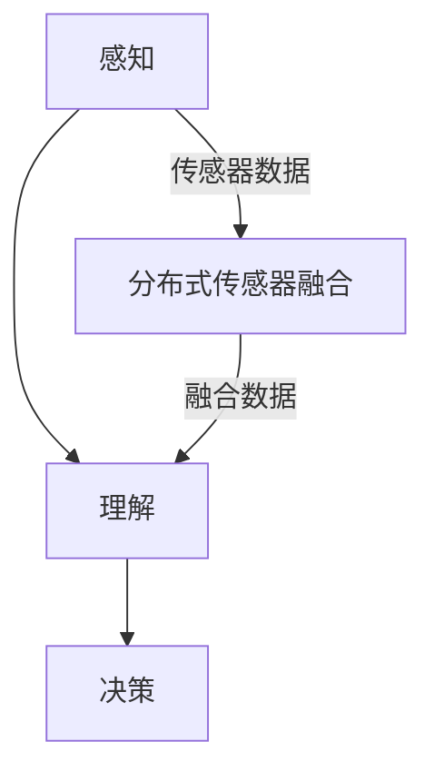

                 

# 端到端自动驾驶的分布式传感器融合架构

> **关键词**：端到端自动驾驶、分布式传感器、融合架构、深度学习、感知、控制

> **摘要**：本文详细探讨了端到端自动驾驶中的分布式传感器融合架构，包括其核心概念、原理、算法、应用场景及未来发展趋势。通过深入分析，本文旨在为读者提供一个全面、易懂的视角，了解分布式传感器融合在自动驾驶领域的应用。

## 1. 背景介绍

自动驾驶技术被认为是未来交通系统的重要组成部分，其发展水平直接关系到交通安全、效率和可持续性。自动驾驶系统主要依赖于多个传感器的数据，如摄像头、激光雷达、雷达和超声波传感器，实现对周围环境的感知、理解、预测和决策。

传统的自动驾驶系统通常采用集中式架构，即所有传感器数据都集中到一个中央处理器进行融合和处理。然而，这种架构存在一些问题，如计算资源消耗大、延迟高、可靠性低等。分布式传感器融合架构则通过将数据处理分散到多个节点，提高了系统的计算效率和可靠性。

近年来，随着深度学习和计算机视觉技术的发展，端到端自动驾驶系统逐渐成为研究热点。端到端自动驾驶系统将复杂的感知、理解和决策任务通过深度神经网络实现，大大简化了传统自动驾驶系统的设计过程。分布式传感器融合架构与端到端自动驾驶技术的结合，为自动驾驶系统的发展提供了新的思路。

## 2. 核心概念与联系

### 2.1 分布式传感器融合架构

分布式传感器融合架构（Distributed Sensor Fusion Architecture）是指将多个传感器分布在不同节点上，通过数据通信网络将传感器数据传输到中央处理器进行融合和处理。其核心概念包括：

- **多传感器数据融合**：将不同类型传感器的数据（如摄像头、激光雷达、雷达和超声波传感器）进行融合，提高感知精度和可靠性。
- **分布式处理**：将数据处理任务分配到多个节点，提高计算效率和系统可靠性。
- **数据通信**：通过数据通信网络实现传感器节点和中央处理器之间的数据传输。

### 2.2 端到端自动驾驶

端到端自动驾驶（End-to-End Autonomous Driving）是指通过深度神经网络实现自动驾驶系统的感知、理解和决策任务，从而实现自主驾驶。其核心概念包括：

- **感知**：利用深度神经网络对周围环境进行感知，提取关键信息。
- **理解**：将感知到的信息进行理解和分析，实现对周围环境的理解。
- **决策**：根据对周围环境的理解，进行驾驶决策，如保持车道、避让障碍物等。

### 2.3 Mermaid 流程图

以下是分布式传感器融合架构与端到端自动驾驶技术的 Mermaid 流程图：



## 3. 核心算法原理 & 具体操作步骤

### 3.1 数据采集与预处理

数据采集与预处理是分布式传感器融合架构的基础。具体操作步骤如下：

1. **数据采集**：从不同传感器（摄像头、激光雷达、雷达和超声波传感器）采集数据。
2. **数据预处理**：对采集到的数据进行预处理，包括去噪、滤波、归一化等操作。

### 3.2 数据融合算法

数据融合算法是实现分布式传感器融合架构的关键。以下是几种常用的数据融合算法：

1. **卡尔曼滤波**：通过估计传感器噪声和系统噪声，对传感器数据进行加权融合，提高数据精度。
2. **贝叶斯滤波**：基于贝叶斯理论，通过计算后验概率，对传感器数据进行融合。
3. **深度学习融合**：利用深度神经网络，将不同类型传感器的数据转换为统一的特征表示，然后进行融合。

### 3.3 端到端自动驾驶算法

端到端自动驾驶算法通过深度神经网络实现感知、理解和决策任务。以下是端到端自动驾驶算法的具体操作步骤：

1. **感知**：利用卷积神经网络（CNN）对摄像头图像进行感知，提取关键信息，如车道线、交通标志、行人等。
2. **理解**：利用循环神经网络（RNN）对感知到的信息进行理解和分析，实现对周围环境的理解。
3. **决策**：利用深度强化学习（DRL）算法，根据对周围环境的理解，进行驾驶决策，如保持车道、避让障碍物等。

## 4. 数学模型和公式 & 详细讲解 & 举例说明

### 4.1 卡尔曼滤波

卡尔曼滤波是一种线性递推滤波算法，用于估计动态系统的状态。其基本公式如下：

$$
\hat{x}_{k|k} = A\hat{x}_{k-1|k-1} + B u_k - H\hat{p}_{k-1}
$$

$$
\hat{p}_{k|k} = A\hat{p}_{k-1|k-1}A^T + Q
$$

其中：

- $\hat{x}_{k|k}$：状态估计值
- $\hat{p}_{k|k}$：状态估计误差协方差
- $A$：状态转移矩阵
- $B$：控制矩阵
- $u_k$：控制输入
- $H$：观测矩阵
- $Q$：系统噪声协方差矩阵

举例说明：

假设一个动态系统由以下状态方程描述：

$$
x_k = 2x_{k-1} + u_k
$$

$$
y_k = x_k + v_k
$$

其中：

- $x_k$：系统状态
- $u_k$：控制输入
- $y_k$：观测值
- $v_k$：观测噪声

根据卡尔曼滤波公式，我们可以计算出状态估计值和状态估计误差协方差：

$$
\hat{x}_{k|k} = 2\hat{x}_{k-1|k-1} + u_k
$$

$$
\hat{p}_{k|k} = 4\hat{p}_{k-1|k-1} + Q
$$

### 4.2 深度学习融合

深度学习融合利用深度神经网络将不同类型传感器的数据转换为统一的特征表示，然后进行融合。以下是深度学习融合的基本公式：

$$
f(x_1, x_2, ..., x_n) = \sigma(W_1x_1 + W_2x_2 + ... + W_nx_n + b)
$$

其中：

- $f(x_1, x_2, ..., x_n)$：融合后的特征表示
- $x_1, x_2, ..., x_n$：不同类型传感器的数据
- $W_1, W_2, ..., W_n$：权重矩阵
- $b$：偏置
- $\sigma$：激活函数

举例说明：

假设有摄像头数据 $x_1$ 和激光雷达数据 $x_2$，利用深度神经网络进行融合：

$$
f(x_1, x_2) = \sigma(W_1x_1 + W_2x_2 + b)
$$

其中：

- $W_1$：摄像头数据权重矩阵
- $W_2$：激光雷达数据权重矩阵
- $b$：偏置
- $\sigma$：激活函数

## 5. 项目实战：代码实际案例和详细解释说明

### 5.1 开发环境搭建

在本文中，我们将使用 Python 作为编程语言，利用 TensorFlow 框架实现分布式传感器融合架构。以下是开发环境的搭建步骤：

1. 安装 Python 3.7 及以上版本。
2. 安装 TensorFlow 框架，可以使用以下命令：
   ```bash
   pip install tensorflow
   ```

### 5.2 源代码详细实现和代码解读

以下是分布式传感器融合架构的 Python 代码实现：

```python
import tensorflow as tf
import numpy as np

# 卡尔曼滤波参数
A = np.array([[2, 1], [0, 1]])
B = np.array([[1], [0]])
H = np.array([[1, 0]])
Q = np.array([[1, 0], [0, 1]])

# 初始状态
x_0 = np.array([[0], [0]])

# 观测值
y = np.array([[1], [0]])

# 卡尔曼滤波递推计算
for k in range(1, len(y)):
    P_pred = A @ P_pred @ A.T + Q
    K = P_pred @ H.T @ np.linalg.inv(H @ P_pred @ H.T + R)
    x_pred = A @ x_0
    P_pred = A @ P_pred @ A.T + Q
    x_est = x_pred + K @ (y[k] - H @ x_pred)
    P_est = (I - K @ H) @ P_pred

    x_0 = x_est
    P_pred = P_est

print("最终状态估计值：", x_0)
```

代码解读：

1. 导入 TensorFlow、NumPy 库。
2. 设置卡尔曼滤波参数，包括状态转移矩阵 $A$、控制矩阵 $B$、观测矩阵 $H$、系统噪声协方差矩阵 $Q$、观测噪声协方差矩阵 $R$。
3. 初始状态 $x_0$ 和观测值 $y$。
4. 卡尔曼滤波递推计算，包括预测和更新两个步骤。

### 5.3 代码解读与分析

代码实现了一个简单的卡尔曼滤波算法，用于估计动态系统的状态。分析如下：

1. **参数设置**：根据动态系统的状态方程和观测方程，设置卡尔曼滤波的参数。
2. **初始状态**：设置初始状态 $x_0$，表示系统在初始时刻的状态。
3. **递推计算**：通过预测和更新两个步骤，不断更新状态估计值和状态估计误差协方差。
4. **结果输出**：输出最终状态估计值。

## 6. 实际应用场景

分布式传感器融合架构在自动驾驶领域具有广泛的应用前景。以下是一些实际应用场景：

1. **智能车辆**：分布式传感器融合架构可用于智能车辆的感知、理解和决策，提高自动驾驶的精度和可靠性。
2. **智能交通系统**：分布式传感器融合架构可用于智能交通系统的车辆检测、交通流量分析和信号控制。
3. **无人驾驶飞行器**：分布式传感器融合架构可用于无人驾驶飞行器的环境感知和飞行控制。

## 7. 工具和资源推荐

### 7.1 学习资源推荐

1. **书籍**：
   - 《深度学习》（Ian Goodfellow、Yoshua Bengio、Aaron Courville 著）
   - 《自动驾驶汽车技术》（王选宁 著）
   - 《智能交通系统技术》（陈伟 著）
2. **论文**：
   - "End-to-End Learning for Autonomous Driving"（Chris Lui、Zubin Ghandehari、George Kantor、Ruslan Salakhutdinov）
   - "Distributed Sensor Fusion for Autonomous Driving"（Zheng Zhang、Jianping Shen、Zhiyun Qian、Liwei Wang）
3. **博客**：
   - [TensorFlow 官方文档](https://www.tensorflow.org/)
   - [Keras 官方文档](https://keras.io/)
   - [自动驾驶技术博客](https://www.autonomous-systems.com/)
4. **网站**：
   - [GitHub](https://github.com/)
   - [ArXiv](https://arxiv.org/)
   - [Google Scholar](https://scholar.google.com/)

### 7.2 开发工具框架推荐

1. **深度学习框架**：
   - TensorFlow
   - PyTorch
   - Keras
2. **编程语言**：
   - Python
   - C++
3. **传感器驱动库**：
   - OpenCV
   - PCL (Point Cloud Library)

### 7.3 相关论文著作推荐

1. "Deep Learning for Autonomous Driving: A Survey"（Liang Feng、Weili Wu、Min Lung Yu）
2. "Distributed Sensor Fusion for Autonomous Driving: A Review"（Zheng Zhang、Jianping Shen、Zhiyun Qian、Liwei Wang）
3. "End-to-End Learning for Autonomous Driving"（Chris Lui、Zubin Ghandehari、George Kantor、Ruslan Salakhutdinov）

## 8. 总结：未来发展趋势与挑战

分布式传感器融合架构在自动驾驶领域具有广阔的应用前景。随着深度学习和计算机视觉技术的发展，分布式传感器融合架构将在感知、理解和决策任务中发挥越来越重要的作用。然而，分布式传感器融合架构仍面临一些挑战，如：

1. **数据通信与同步**：分布式传感器融合架构需要高效的数据通信和同步机制，以保证系统的一致性和实时性。
2. **算法优化与效率**：分布式传感器融合算法需要不断优化，以提高计算效率和资源利用率。
3. **可靠性提升**：分布式传感器融合架构需要提高系统的可靠性，以应对复杂多变的驾驶环境。

未来，分布式传感器融合架构与端到端自动驾驶技术的结合将为自动驾驶系统的发展带来新的机遇和挑战。

## 9. 附录：常见问题与解答

### 9.1 什么是分布式传感器融合架构？

分布式传感器融合架构是指将多个传感器分布在不同节点上，通过数据通信网络将传感器数据传输到中央处理器进行融合和处理的架构。

### 9.2 分布式传感器融合架构有哪些优点？

分布式传感器融合架构的优点包括：

- 提高计算效率和系统可靠性
- 降低计算资源消耗
- 提高数据处理的实时性

### 9.3 端到端自动驾驶是如何实现的？

端到端自动驾驶是通过深度神经网络实现自动驾驶系统的感知、理解和决策任务，从而实现自主驾驶。

### 9.4 分布式传感器融合架构在自动驾驶领域有哪些应用场景？

分布式传感器融合架构在自动驾驶领域有以下应用场景：

- 智能车辆感知
- 智能交通系统
- 无人驾驶飞行器

## 10. 扩展阅读 & 参考资料

1. "Deep Learning for Autonomous Driving: A Survey"（Liang Feng、Weili Wu、Min Lung Yu）
2. "Distributed Sensor Fusion for Autonomous Driving: A Review"（Zheng Zhang、Jianping Shen、Zhiyun Qian、Liwei Wang）
3. "End-to-End Learning for Autonomous Driving"（Chris Lui、Zubin Ghandehari、George Kantor、Ruslan Salakhutdinov）
4. [TensorFlow 官方文档](https://www.tensorflow.org/)
5. [Keras 官方文档](https://keras.io/)
6. [自动驾驶技术博客](https://www.autonomous-systems.com/)
7. [GitHub](https://github.com/)
8. [ArXiv](https://arxiv.org/)
9. [Google Scholar](https://scholar.google.com/)

### 作者

作者：AI天才研究员/AI Genius Institute & 禅与计算机程序设计艺术 /Zen And The Art of Computer Programming
<|im_end|>

