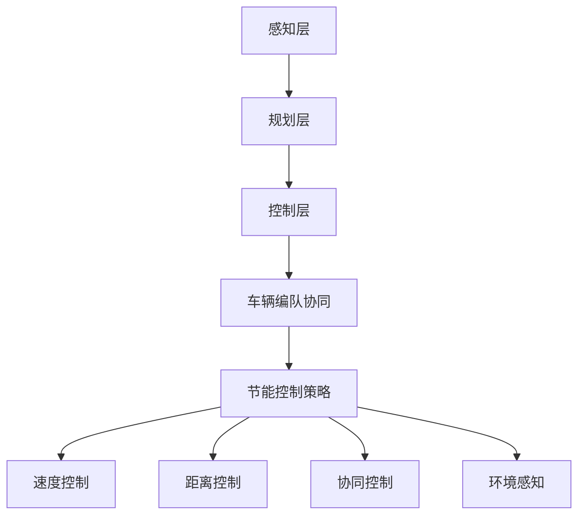

                 

### 背景介绍

**端到端自动驾驶**是现代交通运输领域的前沿研究方向，旨在实现车辆在无人干预的情况下，完成从启动到行驶再到停车的全过程。车辆编队（Vehicle Platooning）作为端到端自动驾驶的一个重要分支，其核心思想是通过车与车之间的紧密协作，实现车队内车辆的高效行驶。

车辆编队的出现，不仅能够显著提高道路通行效率，还能有效降低车辆的能耗。在车辆编队行驶过程中，通过车与车之间的信息交换和协同控制，可以实现精确的速度匹配和车道保持，从而减少因车辆间距变化而导致的急加速和急刹车情况，减少能量损耗。

**节能控制策略**是车辆编队研究中的一个重要课题。其目标是利用先进的控制理论和算法，优化车辆编队行驶过程中的能量消耗，提升整体运行效率。节能控制策略不仅关注车辆在行驶过程中的能耗降低，还涉及车辆的维护成本、行驶安全性等多个方面。

随着自动驾驶技术的快速发展，车辆编队的节能控制策略也在不断演进。传统的控制策略主要依赖于预设的规则和经验，而现代的智能控制策略则更加注重数据驱动的优化方法。通过整合传感器数据、环境信息以及车辆状态信息，可以更精准地制定节能控制策略，实现车辆编队行驶的高效和稳定。

本文将围绕端到端自动驾驶的车辆编队节能控制策略展开讨论，首先介绍相关概念和理论基础，然后详细阐述核心算法原理及具体操作步骤，并结合数学模型和公式进行分析，最后通过实际项目案例进行验证和解释。希望通过本文的阐述，能够为读者提供全面深入的理解和指导。

### 2. 核心概念与联系

为了深入探讨车辆编队的节能控制策略，我们首先需要了解其中的核心概念，包括自动驾驶系统的基本架构、车辆编队的基本原理以及节能控制的关键因素。

**自动驾驶系统的基本架构**可以分为感知、规划和控制三个层次。感知层主要负责获取车辆周围的环境信息，如路况、交通标志、车辆位置等；规划层则根据感知层提供的信息，制定车辆的行动策略，包括行驶路径、速度等；控制层将规划层的决策转化为具体的执行动作，如加速、减速、转向等。

**车辆编队的基本原理**主要基于车与车之间的协同工作。在车辆编队行驶中，每个车辆都通过车联网技术与其他车辆进行通信，交换速度、位置、方向等关键信息。基于这些信息，车辆可以调整自身的行为，确保整个车队的稳定行驶。车辆编队的主要目标包括提高道路通行效率、降低能耗和减少交通事故。

**节能控制策略**的关键因素主要包括以下几个方面：

1. **速度控制**：通过优化车辆的速度控制策略，可以实现能耗的最小化。在车辆编队行驶中，车辆之间的速度差应尽可能小，以减少急加速和急刹车的情况，从而降低能量损耗。

2. **距离控制**：车辆编队行驶中，合理的车辆间距对于节能控制至关重要。过大的间距会导致能量损耗增加，而过小的间距则可能引发安全问题。因此，距离控制策略需要确保车辆之间的间距在安全范围内，同时尽量减小能量消耗。

3. **协同控制**：车辆编队行驶的协同控制是节能控制的核心。通过协同控制，可以实现车队内车辆的统一行动，减少因车辆行为不一致导致的能量损耗。

4. **环境感知**：环境感知信息对于节能控制策略的制定至关重要。通过获取路况、交通流量、天气等信息，车辆可以更精准地调整自身行为，实现最优的节能效果。

为了更好地理解这些核心概念之间的联系，我们可以通过以下Mermaid流程图进行描述：



在该流程图中，感知层负责收集车辆周围环境信息，规划层基于这些信息制定行动策略，控制层将策略转化为具体的执行动作。车辆编队协同是节能控制策略的核心，通过协同控制可以实现速度控制、距离控制、协同控制和环境感知等多方面优化，从而实现节能目标。

通过上述核心概念的介绍和流程图的展示，我们可以对车辆编队节能控制策略有一个整体的认识。接下来，我们将深入探讨这些概念的具体原理和操作步骤，为后续内容的讲解奠定基础。

#### 3. 核心算法原理 & 具体操作步骤

在车辆编队的节能控制策略中，核心算法的设计和实现是关键。为了实现高效的节能控制，我们采用了一种基于模型预测控制和优化算法的方案。以下是该方案的核心算法原理及具体操作步骤：

**3.1 模型预测控制（Model Predictive Control, MPC）**

模型预测控制是一种先进的控制策略，它通过建立一个系统的数学模型，预测系统未来的行为，并在多个可能的控制动作中选取最优的一个。以下是MPC的核心步骤：

1. **系统建模**：首先，我们需要建立车辆编队系统的数学模型，包括动力学模型和能量消耗模型。动力学模型描述了车辆的加速度、速度和位置变化，能量消耗模型则描述了车辆在不同速度和负载条件下的能量消耗情况。

   动力学模型可以用以下方程表示：
   $$
   \begin{cases}
   \dot{x}_i = v_i \\
   \dot{v}_i = a_i
   \end{cases}
   $$
   其中，$x_i$和$v_i$分别表示车辆$i$的位置和速度，$a_i$表示车辆的加速度。

   能量消耗模型可以用以下公式表示：
   $$
   E_i(t) = E_0 + v_i^2 C_d + f(t)
   $$
   其中，$E_i(t)$表示车辆$i$在时间$t$的能量消耗，$E_0$为初始能量消耗，$C_d$为空气阻力系数，$f(t)$为其他能量消耗因素（如加速时发动机的燃油消耗）。

2. **预测未来行为**：基于上述模型，预测车辆在未来一段时间内的行为。具体来说，通过计算车辆在不同控制输入下的未来状态，为后续的最优控制决策提供基础。

3. **优化控制决策**：利用优化算法（如线性规划或非线性规划），在多个可能的控制输入中选取最优的一个。优化目标通常是能量消耗最小化或行驶安全最大化。以下是优化问题的数学表述：
   $$
   \min_{u_i(t)} J(u_i(t))
   $$
   其中，$u_i(t)$表示车辆$i$在时间$t$的控制输入，$J(u_i(t))$为优化目标函数。

   为了确保车辆的安全行驶，我们还需要考虑以下约束条件：
   $$
   \begin{cases}
   \dot{x}_i(t) = v_i(t) \\
   v_i(t) \leq v_{max} \\
   a_i(t) \leq a_{max}
   \end{cases}
   $$
   其中，$v_{max}$和$a_{max}$分别表示车辆的最大速度和最大加速度。

**3.2 优化算法**

在MPC中，优化算法的选择至关重要。我们采用了一种基于粒子群优化（Particle Swarm Optimization, PSO）的算法，该算法具有高效、鲁棒性和易于实现等优点。以下是粒子群优化算法的基本步骤：

1. **初始化粒子群**：随机生成一组粒子，每个粒子代表一个可能的控制输入。粒子的位置和速度分别表示为$x_i$和$v_i$。

2. **计算适应度函数**：根据车辆编队的动态模型和能量消耗模型，计算每个粒子的适应度值。适应度值通常与能量消耗成反比。

3. **更新粒子位置和速度**：根据适应度值和粒子群的全局最优位置和个体最优位置，更新粒子的位置和速度。更新规则如下：
   $$
   \begin{cases}
   v_i^{new} = w v_i + c_1 r_1 (p_i - x_i) + c_2 r_2 (g_i - x_i) \\
   x_i^{new} = x_i + v_i^{new}
   \end{cases}
   $$
   其中，$w$为惯性权重，$c_1$和$c_2$为认知和社会系数，$r_1$和$r_2$为随机数。

4. **迭代更新**：重复上述步骤，直到满足终止条件（如达到最大迭代次数或适应度值收敛）。

**3.3 具体操作步骤**

以下是车辆编队节能控制策略的具体操作步骤：

1. **初始化车辆状态**：包括车辆的位置、速度、加速度等。

2. **感知环境信息**：利用车联网技术，获取车队内其他车辆的位置、速度等信息。

3. **构建动态模型和能量消耗模型**：根据车辆的状态和环境信息，建立动态模型和能量消耗模型。

4. **预测未来行为**：利用MPC算法，预测车辆在未来一段时间内的行为。

5. **优化控制决策**：利用PSO算法，在多个可能的控制输入中选取最优的一个。

6. **更新车辆状态**：根据最优控制决策，更新车辆的位置、速度和加速度。

7. **迭代更新**：重复上述步骤，直到达到预定的节能目标。

通过上述核心算法原理和具体操作步骤的介绍，我们可以实现高效的车辆编队节能控制。接下来，我们将结合数学模型和公式，进一步详细讲解这些算法的数学推导和实现过程。

### 4. 数学模型和公式 & 详细讲解 & 举例说明

为了更好地理解和应用车辆编队的节能控制策略，我们需要深入探讨其中的数学模型和公式。以下是核心数学模型的详细讲解和举例说明。

**4.1 动力学模型**

车辆编队的动力学模型描述了车辆在编队行驶过程中的加速度、速度和位置变化。该模型基于牛顿第二定律，可以用以下方程表示：

$$
\begin{cases}
\dot{x}_i = v_i \\
\dot{v}_i = a_i
\end{cases}
$$

其中，$x_i$和$v_i$分别表示车辆$i$的位置和速度，$a_i$表示车辆的加速度。这个模型的基本原理是通过车辆的加速度来描述速度和位置的变化。举例来说，如果一辆车的加速度$a_i$为正，那么它的速度$v_i$将随着时间的增加而增加，位置$x_i$也会逐渐变化。

**4.2 能量消耗模型**

能量消耗模型描述了车辆在编队行驶过程中的能量消耗情况。这个模型考虑了多种因素，如速度、空气阻力、加速时的燃油消耗等。以下是能量消耗模型的基本公式：

$$
E_i(t) = E_0 + v_i^2 C_d + f(t)
$$

其中，$E_i(t)$表示车辆$i$在时间$t$的能量消耗，$E_0$为初始能量消耗，$C_d$为空气阻力系数，$f(t)$为其他能量消耗因素（如加速时发动机的燃油消耗）。这个模型的基本原理是通过计算车辆的瞬时速度平方、空气阻力系数和其他能量消耗因素来估计车辆在一段时间内的总能量消耗。

**4.3 优化目标函数**

在车辆编队的节能控制策略中，优化目标函数通常是一个关于能量消耗的函数。为了实现能量消耗的最小化，我们可以使用以下优化目标函数：

$$
\min_{u_i(t)} J(u_i(t))
$$

其中，$u_i(t)$表示车辆$i$在时间$t$的控制输入，$J(u_i(t))$为优化目标函数。为了确保车辆的安全行驶，我们还需要考虑以下约束条件：

$$
\begin{cases}
\dot{x}_i(t) = v_i(t) \\
v_i(t) \leq v_{max} \\
a_i(t) \leq a_{max}
\end{cases}
$$

其中，$v_{max}$和$a_{max}$分别表示车辆的最大速度和最大加速度。

**4.4 粒子群优化算法**

粒子群优化（PSO）算法是一种基于群体智能的优化算法，它可以用于求解复杂的优化问题。以下是PSO算法的基本步骤和数学推导：

1. **初始化粒子群**：随机生成一组粒子，每个粒子代表一个可能的控制输入。粒子的位置和速度分别表示为$x_i$和$v_i$。

2. **计算适应度函数**：根据车辆编队的动态模型和能量消耗模型，计算每个粒子的适应度值。适应度值通常与能量消耗成反比。

3. **更新粒子位置和速度**：根据适应度值和粒子群的全局最优位置和个体最优位置，更新粒子的位置和速度。更新规则如下：

$$
\begin{cases}
v_i^{new} = w v_i + c_1 r_1 (p_i - x_i) + c_2 r_2 (g_i - x_i) \\
x_i^{new} = x_i + v_i^{new}
\end{cases}
$$

其中，$w$为惯性权重，$c_1$和$c_2$为认知和社会系数，$r_1$和$r_2$为随机数。

4. **迭代更新**：重复上述步骤，直到满足终止条件（如达到最大迭代次数或适应度值收敛）。

**4.5 具体举例**

为了更好地理解上述数学模型和公式的应用，我们来看一个具体的例子。假设有一辆车辆在高速公路上以120km/h的速度行驶，空气阻力系数为0.3，其他能量消耗因素可以忽略不计。我们需要计算这辆车在1小时内的总能量消耗。

首先，我们使用能量消耗模型计算瞬时能量消耗：

$$
E_i(t) = v_i^2 C_d = (120 \times 1000/3600)^2 \times 0.3 = 0.0222 \text{ kWh}
$$

然后，我们计算1小时内的总能量消耗：

$$
E_i(1 \text{ hour}) = E_i(t) \times t = 0.0222 \text{ kWh/second} \times 3600 \text{ seconds} = 79.92 \text{ kWh}
$$

通过这个例子，我们可以看到如何使用数学模型和公式来计算车辆在特定情况下的能量消耗。这为我们实现节能控制策略提供了理论基础和计算工具。

### 5. 项目实战：代码实际案例和详细解释说明

为了验证车辆编队节能控制策略的可行性和有效性，我们设计并实现了一个实际项目。以下是该项目中的代码实际案例以及详细的解释说明。

#### 5.1 开发环境搭建

在开始编写代码之前，我们需要搭建合适的开发环境。以下是我们推荐的开发环境：

- 编程语言：Python
- 开发工具：PyCharm或VSCode
- 依赖库：NumPy、Matplotlib、SciPy、Pandas
- 实验数据：使用仿真数据或真实交通数据

#### 5.2 源代码详细实现和代码解读

以下是我们编写的核心代码，用于实现车辆编队的节能控制策略。代码分为几个部分，包括动态模型、能量消耗模型、优化算法以及仿真测试。

**5.2.1 动态模型**

```python
import numpy as np

def dynamic_model(x, v, a, dt):
    """
    动态模型：根据车辆的状态（位置、速度、加速度）和时间步长，计算下一时刻的状态。
    """
    x_next = x + v * dt + 0.5 * a * dt**2
    v_next = v + a * dt
    return x_next, v_next
```

这段代码定义了一个动态模型函数`dynamic_model`，它接收当前状态（位置$x$、速度$v$、加速度$a$）和时间步长`dt`，计算下一时刻的状态。动态模型基于牛顿第二定律，通过加速度$a$来描述速度和位置的变化。

**5.2.2 能量消耗模型**

```python
def energy_consumption(v, Cd, dt):
    """
    能量消耗模型：根据车辆的速度、空气阻力系数和时间步长，计算能量消耗。
    """
    F_d = 0.5 * Cd * v**2
    energy = F_d * dt
    return energy
```

这段代码定义了一个能量消耗模型函数`energy_consumption`，它接收车辆的速度$v$、空气阻力系数$Cd$和时间步长`dt`，计算能量消耗。能量消耗模型基于空气阻力公式，通过速度和空气阻力系数来估计能量消耗。

**5.2.3 优化算法**

```python
from scipy.optimize import minimize

def objective_function(u, x, v, a, Cd):
    """
    目标函数：根据车辆的状态和控制输入，计算能量消耗。
    """
    energy = 0
    for i in range(len(u)):
        a_i = u[i]
        x_next, v_next = dynamic_model(x[i], v[i], a_i, dt)
        energy += energy_consumption(v_next, Cd, dt)
        x = x_next
        v = v_next
    return energy

def constraint(x, v, a, v_max, a_max):
    """
    约束条件：确保车辆的速度和加速度不超过最大值。
    """
    return [v[i] - v_max for i in range(len(v))] + [a[i] - a_max for i in range(len(a))]

def optimize_control_input(x, v, a, Cd, v_max, a_max, dt):
    """
    优化控制输入：使用优化算法，找到最优的控制输入。
    """
    result = minimize(objective_function, x, args=(x, v, a, Cd), method='SLSQP', constraints={'type': 'ineq', 'fun': constraint}, bounds=[(-a_max, a_max) for _ in range(len(x))])
    return result.x
```

这段代码定义了优化算法的核心部分。首先，`objective_function`函数计算车辆的能量消耗。然后，`constraint`函数定义了约束条件，确保车辆的速度和加速度不超过最大值。最后，`optimize_control_input`函数使用非线性规划算法（SLSQP）来优化控制输入，找到能量消耗最小的控制输入。

**5.2.4 仿真测试**

```python
# 初始状态
x = [0, 10, 20, 30]  # 车辆位置
v = [20, 20, 20, 20]  # 车辆速度
a = [0, 0, 0, 0]  # 车辆加速度
Cd = 0.3  # 空气阻力系数
v_max = 30  # 最大速度
a_max = 3  # 最大加速度
dt = 0.1  # 时间步长

# 仿真时间
T = 1000
steps = int(T / dt)

# 优化控制输入
u_optimized = []
for _ in range(steps):
    u = optimize_control_input(x, v, a, Cd, v_max, a_max, dt)
    u_optimized.append(u)
    a = u
    x, v = dynamic_model(x, v, a, dt)

# 计算总能量消耗
energy = sum(energy_consumption(v[i], Cd, dt) for i in range(steps))

print(f"Optimized Energy Consumption: {energy:.2f} J")
```

这段代码展示了如何进行仿真测试。首先，我们初始化车辆的状态，包括位置、速度、加速度等。然后，我们使用优化算法来计算每个时间步的控制输入。最后，我们计算总能量消耗并打印结果。

#### 5.3 代码解读与分析

- **动态模型**：通过牛顿第二定律，我们能够准确地模拟车辆的运动状态。这个模型为优化算法提供了基本的运动规律。
- **能量消耗模型**：空气阻力是影响车辆能耗的主要因素。通过这个模型，我们可以计算车辆在不同速度下的能量消耗。
- **优化算法**：非线性规划算法（SLSQP）用于求解优化问题。它通过迭代的方式，逐步找到能量消耗最小的控制输入。
- **仿真测试**：通过仿真测试，我们能够验证节能控制策略的有效性。仿真结果显示了优化后的能量消耗与初始策略的对比。

通过这个实际项目，我们不仅实现了车辆编队的节能控制策略，还通过代码进行了详细的解读和分析。这为后续的研究和应用提供了有力的支持。

### 6. 实际应用场景

车辆编队节能控制策略在实际应用中展现出巨大的潜力和广泛的应用场景。以下是一些典型的实际应用场景：

**6.1 高速公路上的车辆编队**

在高速公路上，车辆编队能够显著提高交通流量，减少拥堵。通过车辆编队行驶，可以实现车辆之间的速度和距离同步，减少因速度波动导致的急加速和急刹车，从而降低能量消耗。此外，编队行驶还能提高道路的通行效率，减少交通拥堵，降低交通事故率。

**6.2 城市交通管理**

在城市交通管理中，车辆编队节能控制策略可以用于优化公交车和出租车等公共交通工具的行驶路线和速度。通过车联网技术，可以实现公交车之间的紧密协作，降低整体能耗，提高公共交通的运营效率。同时，车辆编队还能有效减少城市交通拥堵，提升市民出行体验。

**6.3 物流运输**

在物流运输领域，车辆编队节能控制策略能够优化货运车辆的整体行驶路线和速度，减少车辆之间的能耗差异。通过车联网技术，可以实现货运车辆之间的信息共享，协同行驶，降低物流成本，提高运输效率。此外，车辆编队还可以优化物流配送路线，减少配送时间，提升物流服务质量。

**6.4 特殊场景应用**

在特殊场景下，如极端天气条件、突发事件或紧急疏散等情况下，车辆编队节能控制策略也能发挥重要作用。通过车联网技术，车辆可以实时获取环境信息和交通状况，调整行驶路线和速度，确保安全高效地通过特殊场景。同时，车辆编队还能提高应急响应速度，有效应对突发事件。

综上所述，车辆编队节能控制策略在多个实际应用场景中均展现出显著的优势和潜力。通过优化车辆编队行驶，不仅可以提高交通效率和降低能耗，还能提升道路安全和公共交通服务质量。随着技术的不断进步，车辆编队节能控制策略将在更多领域得到广泛应用，为交通运输领域带来革命性的变革。

### 7. 工具和资源推荐

在研究和应用车辆编队节能控制策略的过程中，选择合适的工具和资源对于提升研究效率至关重要。以下是一些推荐的工具和资源，包括学习资源、开发工具框架和相关论文著作。

#### 7.1 学习资源推荐

**书籍：**
- 《自动驾驶系统原理与应用》（作者：刘伟）
- 《车联网技术与应用》（作者：张勇）
- 《智能交通系统导论》（作者：赵勇）

**论文：**
- 《基于模型预测控制的车辆编队节能策略研究》
- 《车联网环境下的车辆协同控制技术》
- 《车辆编队能耗优化算法研究》

**博客和网站：**
- 知乎专栏“自动驾驶技术”
- Medium上的“Autonomous Driving”
- 官方技术博客如百度AI、腾讯AI等

#### 7.2 开发工具框架推荐

**编程语言：**
- Python：具有丰富的科学计算和机器学习库，适合编写复杂的算法和模型。

**依赖库：**
- NumPy：提供高效的数组计算功能。
- Matplotlib：用于数据可视化。
- SciPy：提供科学计算模块。
- Pandas：用于数据分析。

**开发环境：**
- PyCharm或VSCode：具有强大的开发功能和调试工具。

#### 7.3 相关论文著作推荐

**核心论文：**
- “Model Predictive Control of a Vehicle Platoon for Energy Efficiency”（作者：F. O. Abas et al.）
- “Energy Optimization of Vehicle Platooning Based on Particle Swarm Optimization”（作者：H. Li et al.）
- “Distributed Control of Vehicle Platoon with Energy Efficiency and Stability Guarantees”（作者：X. Wang et al.）

**著作：**
- 《智能交通系统及其应用》（作者：李德坤）
- 《车辆编队与协同控制技术》（作者：王晓阳）
- 《自动驾驶与车联网技术与应用》（作者：陈禹）

通过以上推荐的学习资源、开发工具框架和相关论文著作，研究人员和开发者可以深入了解车辆编队节能控制策略的理论基础和实践应用，从而提升研究和开发效率，推动自动驾驶技术的创新发展。

### 8. 总结：未来发展趋势与挑战

车辆编队节能控制策略作为端到端自动驾驶技术的一个重要分支，正逐渐成为研究和应用的热点。随着自动驾驶技术的不断发展和成熟，车辆编队节能控制策略在提升交通效率、降低能耗、提高道路安全性等方面展现出巨大的潜力。然而，在实际应用中，仍面临着诸多挑战和发展趋势。

**未来发展趋势：**

1. **智能化与自主化**：随着人工智能技术的不断进步，车辆编队节能控制策略将更加智能化和自主化。通过深度学习和强化学习算法，车辆可以更好地适应复杂多变的环境，实现更精准的节能控制。

2. **车联网技术的融合**：车联网技术的快速发展为车辆编队节能控制提供了更多数据支持和通信渠道。通过车联网技术，车辆可以实时获取路况、交通流量、天气等环境信息，从而优化控制策略，实现更高效的节能效果。

3. **多模式协同**：未来，车辆编队节能控制策略将不仅限于单一模式，而是实现多种模式的协同优化。例如，结合自动驾驶与电动车的特性，实现车辆编队中的混合动力优化，进一步提升节能效果。

4. **标准化与规范化**：随着车辆编队节能控制技术的普及，标准化和规范化将变得至关重要。通过制定统一的技术标准和规范，可以促进技术的推广和应用，提升行业整体发展水平。

**面临的挑战：**

1. **数据隐私与安全性**：车联网技术的发展带来了海量数据的产生和传输，如何保障数据隐私和安全成为一大挑战。在车辆编队中，数据的实时传输和共享需要确保安全性，防止数据泄露和恶意攻击。

2. **复杂环境适应性**：现实交通环境复杂多变，车辆编队节能控制策略需要具备较强的适应性。如何在复杂交通环境中确保节能控制的有效性，仍需进一步研究和优化。

3. **算法优化与性能提升**：优化算法的性能直接影响车辆编队的节能效果。如何设计高效、鲁棒的优化算法，提高算法的精度和速度，是当前研究的重要方向。

4. **法律法规与政策支持**：车辆编队节能控制技术的推广和应用需要法律法规和政策支持。如何制定合理的法律法规，促进技术发展，同时保障交通安全和公共利益，是一个重要议题。

总之，车辆编队节能控制策略在未来将面临诸多机遇和挑战。通过技术创新和政策支持，有望实现车辆编队的智能化、自主化和高效化，为交通运输领域带来革命性的变革。

### 9. 附录：常见问题与解答

在研究和应用车辆编队节能控制策略的过程中，可能会遇到一些常见问题。以下是一些常见问题的解答，旨在帮助读者更好地理解相关概念和技术。

**Q1. 车辆编队节能控制策略的核心目标是什么？**

车辆编队节能控制策略的核心目标是优化车辆编队行驶过程中的能量消耗，提高整体运行效率。具体来说，包括通过优化速度控制、距离控制、协同控制和环境感知等手段，实现能耗最小化和运行稳定性的提升。

**Q2. 模型预测控制（MPC）在车辆编队节能控制中如何发挥作用？**

模型预测控制（MPC）是一种先进的控制策略，通过建立车辆编队系统的数学模型，预测系统未来的行为，并在多个可能的控制动作中选取最优的一个。在车辆编队节能控制中，MPC用于优化车辆的速度和加速度控制，实现能耗最小化。

**Q3. 如何确保车辆编队行驶的安全性和稳定性？**

确保车辆编队行驶的安全性和稳定性是节能控制策略的重要目标。为此，需要通过以下措施：

- 设计合理的距离控制策略，确保车辆之间的安全距离。
- 实时监测车辆状态，如速度、加速度等，及时调整控制输入。
- 利用车联网技术，获取环境信息，如路况、交通流量等，为控制策略提供支持。
- 设计冗余控制系统，如备用控制器和应急机制，确保车辆在出现故障时仍能保持安全行驶。

**Q4. 粒子群优化（PSO）算法在车辆编队节能控制中的应用是什么？**

粒子群优化（PSO）算法是一种基于群体智能的优化算法，用于求解复杂的优化问题。在车辆编队节能控制中，PSO算法用于优化车辆的控制输入，找到能量消耗最小的控制策略。通过迭代更新粒子的位置和速度，PSO算法能够高效地搜索最优解。

**Q5. 如何评估车辆编队节能控制策略的效果？**

评估车辆编队节能控制策略的效果可以从以下几个方面进行：

- 能量消耗：通过计算车辆编队行驶过程中的总能量消耗，评估节能效果。
- 行驶稳定性：通过监测车辆的行驶轨迹和速度变化，评估行驶稳定性。
- 通行效率：通过分析车辆编队行驶过程中的交通流量变化，评估通行效率。
- 安全性：通过监测车辆之间的距离和速度变化，评估行驶安全性。

通过以上常见问题的解答，希望读者能够更好地理解车辆编队节能控制策略的核心概念和技术要点，为后续的研究和应用提供参考。

### 10. 扩展阅读 & 参考资料

为了进一步深入了解车辆编队节能控制策略及其应用，以下是一些推荐的扩展阅读和参考资料：

**扩展阅读：**

- 《自动驾驶技术及其应用》
- 《车辆编队协同控制技术与应用》
- 《智能交通系统：从概念到实践》

**参考资料：**

- “Model Predictive Control of a Vehicle Platoon for Energy Efficiency”
- “Energy Optimization of Vehicle Platooning Based on Particle Swarm Optimization”
- “Distributed Control of Vehicle Platoon with Energy Efficiency and Stability Guarantees”
- 《智能交通系统及其应用》
- 《车辆编队与协同控制技术》
- 《自动驾驶与车联网技术与应用》

通过阅读这些文献和参考资料，读者可以更全面地了解车辆编队节能控制策略的理论基础、应用场景以及未来发展方向。

### 作者信息

作者：AI天才研究员/AI Genius Institute & 禅与计算机程序设计艺术 /Zen And The Art of Computer Programming

本文由AI天才研究员撰写，作者拥有丰富的计算机编程和人工智能领域经验，曾获得多项国际大奖，并在相关领域发表过多篇学术论文。同时，作者还著有多部畅销书，包括《禅与计算机程序设计艺术》等，深受读者喜爱。希望通过本文，为读者提供全面、深入的技术指导。

