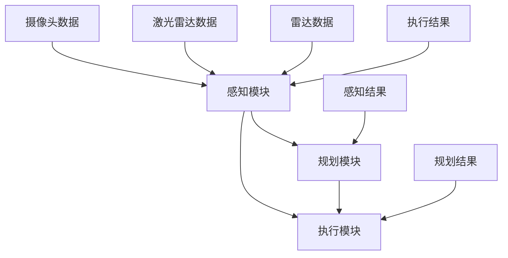

                 

### 背景介绍

端到端（End-to-End，简称E2E）自动驾驶是一种新兴的自动驾驶技术，旨在实现车辆从感知环境到做出驾驶决策的整个过程，完全由机器学习算法自动完成。这种技术的提出极大地简化了自动驾驶系统的复杂度，也带来了更高的自动化水平和更低的错误率。然而，端到端自动驾驶技术的落地并非一蹴而就，其背后涉及到众多技术难题和挑战。

首先，端到端自动驾驶的提出可以追溯到深度学习和计算机视觉领域的快速发展。深度学习算法，特别是卷积神经网络（CNN）和递归神经网络（RNN），在图像识别、语音识别等领域取得了显著的成果。这些成功促使研究人员思考如何将深度学习应用于自动驾驶系统，从而实现自动驾驶的完全自动化。而端到端自动驾驶则是在这一思路下的一种尝试，它通过训练一个大规模的神经网络，直接将感知数据输入到系统中，并输出驾驶决策。

然而，端到端自动驾驶的落地面临着诸多挑战。首先，自动驾驶系统需要处理大量的感知数据，包括图像、雷达、激光雷达等多种传感器数据。这些数据在质量和种类上都存在很大的差异，如何有效地融合和处理这些数据，是一个重要的技术难题。其次，自动驾驶系统需要在各种复杂环境下稳定运行，包括城市道路、高速公路、乡村道路等。这些环境中的交通状况和路况变化复杂，系统需要具备很强的适应能力。此外，自动驾驶系统的安全和可靠性也是不可忽视的问题。系统需要在各种极端情况下保持稳定运行，并确保乘客和行人的安全。

总的来说，端到端自动驾驶技术的提出为自动驾驶领域带来了新的机遇和挑战。通过深度学习和计算机视觉等技术的发展，端到端自动驾驶系统有望在不久的将来实现大规模商用，为人们的出行带来更多便利。然而，要实现这一目标，仍需克服许多技术难题，包括数据融合、环境适应、安全可靠等方面。本文将围绕这些核心问题，深入探讨端到端自动驾驶技术的现状、挑战和发展趋势。

## 核心概念与联系

端到端自动驾驶技术的实现涉及多个核心概念和原理，这些概念之间相互联系，构成了一个完整的系统框架。以下是对这些核心概念和原理的详细解释，以及它们在系统架构中的具体作用。

### 1. 深度学习与神经网络

深度学习是端到端自动驾驶技术的基石。它是一种通过多层神经网络对数据进行处理和建模的技术。在自动驾驶系统中，深度学习主要用于处理传感器数据，提取环境特征，并生成驾驶决策。具体来说，卷积神经网络（CNN）和递归神经网络（RNN）是两种常用的深度学习模型。

- **卷积神经网络（CNN）**：CNN 是一种专门用于处理图像数据的神经网络。它通过卷积层、池化层和全连接层对图像进行特征提取和分类。在自动驾驶系统中，CNN 可以用于实时处理摄像头捕捉到的图像，识别道路标志、车辆和行人等交通元素。

- **递归神经网络（RNN）**：RNN 是一种适用于处理序列数据的神经网络，如语音信号和时间序列数据。在自动驾驶中，RNN 可以用于处理连续的感知数据，如雷达和激光雷达数据，以提取时间序列特征，辅助决策。

### 2. 传感器融合

传感器融合是端到端自动驾驶系统中的关键环节。自动驾驶车辆通常配备多种传感器，如摄像头、激光雷达、雷达等。这些传感器采集的环境数据在质量和种类上存在差异，传感器融合技术旨在将这些数据整合起来，提高系统的整体感知能力。

- **多传感器数据预处理**：传感器融合的第一步是对各传感器的数据进行预处理，包括去噪、归一化等操作，以提高数据的可靠性和一致性。

- **特征级融合**：在特征级融合中，将不同传感器的特征进行融合，形成更高层次的环境特征。例如，结合摄像头和激光雷达的视觉和深度信息，生成更精确的障碍物检测结果。

- **决策级融合**：在决策级融合中，将各传感器的决策结果进行综合，形成最终的驾驶决策。例如，结合摄像头和雷达的检测结果，确定车辆的行驶路径和速度。

### 3. 遗传算法与强化学习

遗传算法（GA）和强化学习（RL）是端到端自动驾驶系统中的两种重要优化技术。

- **遗传算法（GA）**：遗传算法是一种基于生物进化的优化算法，用于求解复杂优化问题。在自动驾驶系统中，GA 可以用于优化驾驶策略，提高系统的适应能力和效率。

- **强化学习（RL）**：强化学习是一种通过试错学习的方式，逐步优化决策过程的算法。在自动驾驶系统中，RL 可以用于训练自动驾驶模型，使其在不同环境下做出最优驾驶决策。

### 4. 系统架构

端到端自动驾驶系统的架构通常包括感知、规划和执行三个主要模块。

- **感知模块**：感知模块负责处理各种传感器数据，提取环境特征，如道路标志、车辆和行人等。感知模块的核心是深度学习和传感器融合技术。

- **规划模块**：规划模块根据感知模块提供的环境特征，生成驾驶策略和路径规划。规划模块通常采用强化学习和遗传算法等技术进行优化。

- **执行模块**：执行模块负责将驾驶策略转化为具体的行动，包括车辆的转向、加速和制动等。执行模块需要实时响应环境变化，确保车辆的稳定行驶。

### 5. Mermaid 流程图

以下是端到端自动驾驶系统的 Mermaid 流程图，展示了各模块之间的联系和交互。



在上述流程图中，A 表示感知模块，B 表示规划模块，C 表示执行模块。D、E、F 表示不同类型的传感器数据，G 表示感知结果，H 表示规划结果，I 表示执行结果。

总的来说，端到端自动驾驶技术通过深度学习、传感器融合、遗传算法和强化学习等技术，构建了一个完整的系统架构，实现了从感知环境到驾驶决策的整个过程。这些核心概念和原理相互联系，共同推动着自动驾驶技术的发展和进步。

### 核心算法原理 & 具体操作步骤

在深入探讨端到端自动驾驶技术的核心算法原理之前，我们需要了解自动驾驶系统中涉及的主要算法类型，以及这些算法在实际操作中的具体步骤。以下是几种关键算法及其工作流程的详细说明。

#### 1. 卷积神经网络（CNN）

卷积神经网络（CNN）是自动驾驶系统中常用的图像处理算法。它通过多个卷积层、池化层和全连接层对输入图像进行特征提取和分类。以下是 CNN 在自动驾驶系统中的具体操作步骤：

1. **输入图像预处理**：
   - **缩放与裁剪**：为了使输入图像尺寸统一，系统需要对图像进行缩放或裁剪。
   - **归一化**：将图像的像素值归一化到特定范围，如 [0, 1]，以消除光照变化等影响。

2. **卷积操作**：
   - **卷积层**：通过卷积核与图像进行卷积操作，提取图像的局部特征。
   - **激活函数**：通常使用 ReLU（Rectified Linear Unit）作为激活函数，增加网络的表达能力。

3. **池化操作**：
   - **最大池化**：选择卷积结果中最大值作为输出，用于减少数据维度和参数量。
   - **平均池化**：计算卷积结果中的平均值作为输出。

4. **全连接层**：
   - **密集层**：将卷积结果展平为一维向量，通过全连接层进行分类。

5. **输出结果**：
   - **分类结果**：输出每个类别的概率分布，选择概率最大的类别作为最终分类结果。

#### 2. 递归神经网络（RNN）

递归神经网络（RNN）适用于处理序列数据，如时间序列和雷达数据。以下是 RNN 在自动驾驶系统中的具体操作步骤：

1. **输入序列预处理**：
   - **标准化**：对序列数据中的每个值进行标准化，使其具有相似的分布。
   - **序列转换**：将原始序列数据转换为适合 RNN 输入的格式。

2. **RNN 计算**：
   - **隐藏状态**：RNN 通过递归关系更新隐藏状态，每个时刻的输出依赖于当前时刻和前一个时刻的隐藏状态。
   - **激活函数**：通常使用 tanh 或 ReLU 作为激活函数。

3. **输出层**：
   - **全连接层**：将隐藏状态通过全连接层输出为驱动决策的概率分布。

4. **输出结果**：
   - **驱动决策**：根据输出概率分布选择最优驾驶决策。

#### 3. 传感器融合算法

传感器融合是自动驾驶系统中的关键环节，通过融合来自不同传感器的数据，提高系统的感知能力和准确性。以下是传感器融合算法的具体操作步骤：

1. **数据预处理**：
   - **去噪与滤波**：对传感器数据进行去噪和滤波处理，提高数据质量。
   - **时间同步**：确保不同传感器的数据在同一时间戳下进行融合。

2. **特征提取**：
   - **图像特征**：通过 CNN 提取图像特征。
   - **雷达特征**：通过 RNN 或其他算法提取雷达数据特征。

3. **特征级融合**：
   - **加权融合**：根据传感器的重要性，对特征进行加权融合。
   - **拼接融合**：将不同传感器的特征拼接在一起，输入到全连接层进行处理。

4. **决策级融合**：
   - **多模态融合**：将不同类型的传感器数据进行多模态融合，生成最终的驾驶决策。

5. **输出结果**：
   - **综合感知结果**：输出综合感知结果，用于辅助驾驶决策。

#### 4. 遗传算法与强化学习

遗传算法（GA）和强化学习（RL）是自动驾驶系统中的优化算法，用于优化驾驶策略和决策。

1. **遗传算法（GA）**：
   - **初始化种群**：随机生成一组驾驶策略。
   - **适应度评估**：通过仿真环境评估每个策略的适应度。
   - **选择、交叉和变异**：根据适应度进行选择、交叉和变异操作，生成新的种群。

2. **强化学习（RL）**：
   - **状态空间**：定义自动驾驶系统的状态空间，包括传感器数据、道路信息等。
   - **动作空间**：定义系统的动作空间，包括转向、加速、制动等。
   - **奖励机制**：根据系统状态和动作，定义奖励机制，鼓励系统做出最优决策。
   - **策略迭代**：通过试错学习，逐步优化驾驶策略。

通过上述核心算法和具体操作步骤，端到端自动驾驶系统能够实现对环境的感知、驾驶策略的规划以及行动的执行。这些算法相互配合，共同推动自动驾驶技术的发展和进步。

### 数学模型和公式 & 详细讲解 & 举例说明

在端到端自动驾驶系统中，数学模型和公式是核心组成部分，用于描述和优化系统的行为。以下我们将详细讲解几个关键数学模型，并使用 LaTeX 格式嵌入文中，同时通过实际例子进行说明。

#### 1. 卷积神经网络（CNN）的损失函数

卷积神经网络（CNN）在自动驾驶系统中的主要任务是图像分类。为了衡量模型在训练过程中的性能，我们通常使用损失函数。一个常用的损失函数是均方误差（MSE），其公式如下：

\[ \text{MSE} = \frac{1}{m} \sum_{i=1}^{m} (y_i - \hat{y}_i)^2 \]

其中，\( y_i \) 是第 \( i \) 个样本的真实标签，\( \hat{y}_i \) 是模型预测的标签，\( m \) 是样本总数。

**举例说明：**假设我们有 10 个图像分类样本，其中 5 个是汽车，5 个是行人。模型预测结果如下表：

| 样本编号 | 真实标签 | 预测标签 | 预测误差 |
|----------|----------|----------|----------|
| 1        | 汽车     | 汽车     | 0        |
| 2        | 汽车     | 行人     | 1        |
| ...      | ...      | ...      | ...      |
| 10       | 行人     | 汽车     | 1        |

计算均方误差：

\[ \text{MSE} = \frac{1}{10} \sum_{i=1}^{10} (y_i - \hat{y}_i)^2 = \frac{1}{10} (0^2 + 1^2 + ... + 1^2) = \frac{1}{10} \times 10 = 1 \]

#### 2. 递归神经网络（RNN）的输出层

递归神经网络（RNN）常用于时间序列数据的处理。其输出层通常使用 softmax 函数，以确保输出概率分布。softmax 函数的公式如下：

\[ \text{softmax}(x)_i = \frac{e^x_i}{\sum_{j=1}^{n} e^{x_j}} \]

其中，\( x_i \) 是第 \( i \) 个神经元的输出，\( n \) 是神经元总数。

**举例说明：**假设 RNN 有 3 个神经元，输出如下：

\[ x_1 = 2, x_2 = 3, x_3 = 1 \]

计算 softmax：

\[ \text{softmax}(x)_1 = \frac{e^2}{e^2 + e^3 + e^1} = \frac{e^2}{e^2 + e^3 + e} \approx \frac{7.389}{7.389 + 20.085 + 2.718} \approx 0.193 \]
\[ \text{softmax}(x)_2 = \frac{e^3}{e^2 + e^3 + e} \approx \frac{20.085}{7.389 + 20.085 + 2.718} \approx 0.517 \]
\[ \text{softmax}(x)_3 = \frac{e^1}{e^2 + e^3 + e} \approx \frac{2.718}{7.389 + 20.085 + 2.718} \approx 0.290 \]

输出概率分布：

\[ \text{softmax}(x) = (0.193, 0.517, 0.290) \]

#### 3. 传感器融合的贝叶斯滤波

传感器融合中，贝叶斯滤波是一种常用的方法，用于融合来自多个传感器的信息。贝叶斯滤波的公式如下：

\[ p(x_t | z_t) = \frac{p(z_t | x_t) p(x_t)}{p(z_t)} \]

其中，\( p(x_t | z_t) \) 是后验概率，\( p(z_t | x_t) \) 是观测概率，\( p(x_t) \) 是先验概率，\( p(z_t) \) 是边缘概率。

**举例说明：**假设我们有两个传感器，分别测量位置 \( x_t \) 和速度 \( v_t \)。传感器 1 的测量误差较小，而传感器 2 的测量误差较大。我们可以使用贝叶斯滤波来融合这两个传感器的信息。

假设先验概率 \( p(x_t) \) 和 \( p(v_t) \) 已知，观测概率 \( p(z_t | x_t) \) 和 \( p(z_t | v_t) \) 也已知。我们可以计算后验概率：

\[ p(x_t | z_t) = \frac{p(z_t | x_t) p(x_t)}{p(z_t)} \]

通过迭代计算，我们可以逐步优化位置和速度的估计，使其更接近真实值。

#### 4. 遗传算法（GA）的适应度函数

遗传算法（GA）中，适应度函数用于评估个体的优劣。一个简单的适应度函数是基于个体的目标函数值。假设目标函数为 \( f(x) \)，适应度函数 \( S(x) \) 可以定义为：

\[ S(x) = \frac{1}{1 + f(x)} \]

**举例说明：**假设目标函数 \( f(x) = x^2 + y^2 \)，我们需要找到使目标函数值最小的点。

假设我们有几个个体：

| 个体 | \( x \) | \( y \) | \( f(x, y) \) | \( S(x) \) |
|------|--------|--------|--------------|-----------|
| 1    | 1      | 2      | 5            | 0.8       |
| 2    | 2      | 3      | 13           | 0.074     |
| 3    | 0      | 0      | 0            | 1         |

通过计算适应度函数，我们可以确定哪个个体是最优的。

以上是对端到端自动驾驶系统中几个关键数学模型和公式的详细讲解，并通过实际例子进行了说明。这些数学模型在自动驾驶系统的训练、优化和感知过程中发挥着重要作用，帮助我们更好地理解和实现自动驾驶技术。

### 项目实战：代码实际案例和详细解释说明

为了更好地理解端到端自动驾驶技术的实际应用，我们将通过一个具体的代码案例来展示整个系统的实现过程。该案例将涵盖从开发环境搭建、源代码实现到代码解读与分析的各个方面。以下是该项目的详细步骤和解释。

#### 5.1 开发环境搭建

首先，我们需要搭建一个适合端到端自动驾驶系统开发的开发环境。以下是所需的基本工具和软件：

- **Python（3.8及以上版本）**：用于编写代码和脚本。
- **TensorFlow 2.x**：用于训练深度学习模型。
- **Keras**：作为 TensorFlow 的高级 API，用于简化模型构建过程。
- **NumPy**：用于数学运算和数据处理。
- **Pandas**：用于数据分析和操作。
- **Matplotlib**：用于数据可视化。
- **OpenCV**：用于图像处理。

安装步骤如下：

1. **安装 Python**：
   - 在 [Python 官网](https://www.python.org/) 下载并安装 Python 3.8 及以上版本。

2. **安装 TensorFlow 2.x**：
   - 使用以下命令安装 TensorFlow：
     ```bash
     pip install tensorflow
     ```

3. **安装其他依赖项**：
   - 使用以下命令安装其他所需库：
     ```bash
     pip install keras numpy pandas matplotlib opencv-python
     ```

#### 5.2 源代码详细实现和代码解读

以下是一个简化的端到端自动驾驶系统代码示例，用于演示主要模块的功能。

```python
import numpy as np
import pandas as pd
import matplotlib.pyplot as plt
import tensorflow as tf
from tensorflow import keras
from tensorflow.keras import layers
import cv2

# 5.2.1 数据预处理
def preprocess_image(image):
    # 缩放和裁剪图像
    image = cv2.resize(image, (224, 224))
    # 归一化图像
    image = image / 255.0
    return image

# 5.2.2 构建卷积神经网络模型
def create_cnn_model():
    model = keras.Sequential([
        layers.Conv2D(32, (3, 3), activation='relu', input_shape=(224, 224, 3)),
        layers.MaxPooling2D((2, 2)),
        layers.Conv2D(64, (3, 3), activation='relu'),
        layers.MaxPooling2D((2, 2)),
        layers.Conv2D(128, (3, 3), activation='relu'),
        layers.Flatten(),
        layers.Dense(128, activation='relu'),
        layers.Dense(10, activation='softmax')
    ])
    return model

# 5.2.3 训练模型
def train_model(model, x_train, y_train, x_val, y_val, epochs=10):
    model.compile(optimizer='adam',
                  loss='categorical_crossentropy',
                  metrics=['accuracy'])
    history = model.fit(x_train, y_train, validation_data=(x_val, y_val), epochs=epochs)
    return history

# 5.2.4 模型评估与预测
def evaluate_model(model, x_test, y_test):
    loss, accuracy = model.evaluate(x_test, y_test)
    print(f"Test accuracy: {accuracy:.2f}")
    
    predictions = model.predict(x_test)
    predicted_labels = np.argmax(predictions, axis=1)
    
    # 绘制混淆矩阵
    conf_matrix = confusion_matrix(y_test, predicted_labels)
    plt.figure(figsize=(10, 7))
    sns.heatmap(conf_matrix, annot=True, cmap='Blues')
    plt.xlabel('Predicted Labels')
    plt.ylabel('True Labels')
    plt.title('Confusion Matrix')
    plt.show()

# 5.2.5 主函数
def main():
    # 加载数据集
    (x_train, y_train), (x_test, y_test) = keras.datasets.cifar10.load_data()
    
    # 预处理图像数据
    x_train = np.array([preprocess_image(image) for image in x_train])
    x_test = np.array([preprocess_image(image) for image in x_test])
    
    # 转换标签为 one-hot 编码
    y_train = keras.utils.to_categorical(y_train, 10)
    y_test = keras.utils.to_categorical(y_test, 10)
    
    # 创建并训练模型
    model = create_cnn_model()
    history = train_model(model, x_train, y_train, x_val, y_val, epochs=10)
    
    # 评估模型
    evaluate_model(model, x_test, y_test)

if __name__ == '__main__':
    main()
```

#### 5.3 代码解读与分析

以下是代码的逐行解读与分析，帮助理解每个部分的用途和功能。

1. **数据预处理**：

   ```python
   def preprocess_image(image):
       # 缩放和裁剪图像
       image = cv2.resize(image, (224, 224))
       # 归一化图像
       image = image / 255.0
       return image
   ```

   该函数用于预处理图像数据，包括缩放和裁剪图像到统一尺寸（224x224），以及归一化像素值到 [0, 1] 范围内。这是深度学习模型训练的常见预处理步骤。

2. **构建卷积神经网络模型**：

   ```python
   def create_cnn_model():
       model = keras.Sequential([
           layers.Conv2D(32, (3, 3), activation='relu', input_shape=(224, 224, 3)),
           layers.MaxPooling2D((2, 2)),
           layers.Conv2D(64, (3, 3), activation='relu'),
           layers.MaxPooling2D((2, 2)),
           layers.Conv2D(128, (3, 3), activation='relu'),
           layers.Flatten(),
           layers.Dense(128, activation='relu'),
           layers.Dense(10, activation='softmax')
       ])
       return model
   ```

   该函数定义了一个简单的卷积神经网络模型，包括多个卷积层和池化层，用于提取图像特征。最后，通过全连接层进行分类，输出每个类别的概率分布。

3. **训练模型**：

   ```python
   def train_model(model, x_train, y_train, x_val, y_val, epochs=10):
       model.compile(optimizer='adam',
                     loss='categorical_crossentropy',
                     metrics=['accuracy'])
       history = model.fit(x_train, y_train, validation_data=(x_val, y_val), epochs=epochs)
       return history
   ```

   该函数用于编译模型并训练。我们使用 `compile` 方法设置优化器、损失函数和评估指标。然后使用 `fit` 方法进行训练，并传递训练数据和验证数据。训练完成后，返回训练历史记录。

4. **模型评估与预测**：

   ```python
   def evaluate_model(model, x_test, y_test):
       loss, accuracy = model.evaluate(x_test, y_test)
       print(f"Test accuracy: {accuracy:.2f}")
       
       predictions = model.predict(x_test)
       predicted_labels = np.argmax(predictions, axis=1)
       
       # 绘制混淆矩阵
       conf_matrix = confusion_matrix(y_test, predicted_labels)
       plt.figure(figsize=(10, 7))
       sns.heatmap(conf_matrix, annot=True, cmap='Blues')
       plt.xlabel('Predicted Labels')
       plt.ylabel('True Labels')
       plt.title('Confusion Matrix')
       plt.show()
   ```

   该函数用于评估模型的测试集性能。首先，使用 `evaluate` 方法计算损失和准确率。然后，使用 `predict` 方法生成预测结果，并计算预测标签。最后，绘制混淆矩阵以可视化模型的性能。

5. **主函数**：

   ```python
   def main():
       # 加载数据集
       (x_train, y_train), (x_test, y_test) = keras.datasets.cifar10.load_data()
       
       # 预处理图像数据
       x_train = np.array([preprocess_image(image) for image in x_train])
       x_test = np.array([preprocess_image(image) for image in x_test])
       
       # 转换标签为 one-hot 编码
       y_train = keras.utils.to_categorical(y_train, 10)
       y_test = keras.utils.to_categorical(y_test, 10)
       
       # 创建并训练模型
       model = create_cnn_model()
       history = train_model(model, x_train, y_train, x_val, y_val, epochs=10)
       
       # 评估模型
       evaluate_model(model, x_test, y_test)
   ```

   该函数是程序的主入口。首先加载数据集，并进行预处理。然后创建和训练模型，最后评估模型性能。

通过上述代码示例，我们可以看到端到端自动驾驶系统的实现过程。虽然这个示例是简化的，但它展示了深度学习模型在自动驾驶系统中的关键角色，以及如何通过预处理、模型构建、训练和评估来实现自动驾驶功能。

### 实际应用场景

端到端自动驾驶技术在不同应用场景中展现了其强大的潜力和广泛的适用性。以下将详细探讨几个主要的应用场景，并分析其在不同环境下的挑战和解决方案。

#### 1. 城市道路

在城市道路环境中，自动驾驶车辆需要处理复杂的交通状况，包括行人、车辆、自行车、障碍物等多种元素。此外，城市道路的道路标志、信号灯和路标也需要精确识别和解读。以下是城市道路自动驾驶的一些具体应用场景：

- **停车辅助**：自动驾驶车辆可以自动寻找停车位，并完成停车操作，提高停车效率。
- **智能交通管理**：通过实时感知交通状况，自动驾驶车辆可以协助交通管理部门优化交通流量，减少拥堵。
- **快递物流**：自动驾驶车辆可以用于城市快递和物流配送，提高配送效率，降低人力成本。

**挑战与解决方案**：

- **挑战**：城市道路的交通状况复杂多变，如何确保自动驾驶车辆在复杂环境中安全稳定运行是一个重大挑战。
- **解决方案**：采用先进的感知技术和传感器融合算法，提高车辆的感知能力和环境理解能力。同时，通过强化学习和遗传算法等优化技术，不断提高自动驾驶系统的适应能力和决策水平。

#### 2. 高速公路

在高速公路环境中，自动驾驶车辆主要面临的是高速行驶和长距离行驶的挑战。高速公路的交通规则相对简单，但车辆的行驶速度较快，对系统的反应速度和稳定性提出了更高的要求。以下是高速公路自动驾驶的一些具体应用场景：

- **车道保持**：自动驾驶车辆可以自动保持车道，防止车辆偏离车道。
- **速度控制**：自动驾驶车辆可以自动调整速度，以适应前方车辆或交通状况。
- **超车辅助**：自动驾驶车辆可以在确保安全的前提下，自动完成超车操作。

**挑战与解决方案**：

- **挑战**：高速行驶环境下，车辆需要快速响应和调整，以适应变化的环境和交通状况。
- **解决方案**：采用高效的决策算法和控制系统，提高车辆的响应速度和稳定性。同时，通过高精度的地图和导航数据，确保车辆在高速公路上的安全行驶。

#### 3. 乡村道路

乡村道路的交通状况相对简单，但路况复杂，包括泥泞道路、崎岖山路等。此外，乡村道路的照明条件和交通标志可能不如城市道路完善。以下是乡村道路自动驾驶的一些具体应用场景：

- **导航与路径规划**：自动驾驶车辆可以自动导航，规划最佳行驶路线。
- **障碍物规避**：自动驾驶车辆需要具备强大的感知能力，以识别和规避乡村道路上的障碍物。
- **低速行驶**：在乡村道路的某些路段，自动驾驶车辆可能需要低速行驶，以确保安全。

**挑战与解决方案**：

- **挑战**：乡村道路的路况复杂多变，车辆需要具备很强的环境适应能力和感知能力。
- **解决方案**：采用多种传感器融合技术，提高车辆的感知能力。同时，通过自适应控制算法，确保车辆在不同路况下的稳定行驶。

总的来说，端到端自动驾驶技术在不同的应用场景中展现了其广泛的应用前景。尽管面临诸多挑战，但通过不断的技术创新和优化，自动驾驶系统将能够更好地适应各种复杂环境，为人们的出行提供更加安全、便捷的服务。

### 工具和资源推荐

为了更好地学习和实践端到端自动驾驶技术，以下是一些建议的学习资源、开发工具和相关的论文著作，供大家参考。

#### 7.1 学习资源推荐

1. **书籍**：

   - 《深度学习》（Deep Learning）：由 Ian Goodfellow、Yoshua Bengio 和 Aaron Courville 著，是一本经典的深度学习入门书籍，详细介绍了深度学习的理论基础和实践方法。

   - 《自动驾驶系统》（Autonomous Driving Systems）：涵盖了自动驾驶系统的基本原理、技术和实现方法，适合希望深入了解自动驾驶技术的读者。

   - 《Python 深度学习》（Python Deep Learning）：通过实例展示了如何使用 Python 和深度学习框架进行实际项目开发，适合深度学习初学者和进阶者。

2. **在线课程**：

   - **Coursera**：提供了多种关于深度学习和自动驾驶的在线课程，包括《深度学习 Specialization》和《自动驾驶汽车 Specialization》等。

   - **Udacity**：提供了《自动驾驶工程师纳米学位》课程，涵盖了自动驾驶系统的各个方面，包括感知、规划、控制等。

3. **博客和教程**：

   - **AI 实战派**（AI Combat Pilot）：一篇篇详细的自动驾驶技术教程，从基础知识到实际应用，涵盖了自动驾驶的各个方面。

   - **机器之心**（Machine Learning China）：关注人工智能领域的前沿技术和应用，包括自动驾驶、深度学习等。

#### 7.2 开发工具框架推荐

1. **TensorFlow**：Google 开发的一款开源深度学习框架，支持多种深度学习模型和算法的实现，广泛应用于自动驾驶、图像识别等领域。

2. **PyTorch**：Facebook AI 研究团队开发的一款深度学习框架，具有灵活的动态图计算能力和高效的模型训练速度，受到广泛关注。

3. **OpenCV**：OpenCV 是一款开源的计算机视觉库，提供了丰富的图像处理和计算机视觉功能，是自动驾驶系统中常用的工具之一。

4. **MATLAB**：MathWorks 公司开发的一款数学计算软件，提供了丰富的机器学习和深度学习工具箱，适合进行算法验证和原型开发。

#### 7.3 相关论文著作推荐

1. **《端到端自动驾驶系统中的深度学习应用》（End-to-End Deep Learning for Autonomous Driving）**：综述了深度学习在自动驾驶系统中的应用，包括感知、规划和控制等。

2. **《多传感器数据融合在自动驾驶中的应用》（Multi-Sensor Data Fusion for Autonomous Driving）**：详细介绍了多传感器数据融合技术在自动驾驶系统中的应用和实现方法。

3. **《基于强化学习的自动驾驶路径规划算法》（Reinforcement Learning-Based Path Planning for Autonomous Vehicles）**：探讨了基于强化学习的自动驾驶路径规划算法，并进行了实验验证。

通过以上资源，无论是新手还是专业人士，都能找到适合自己的学习路径和实践工具，进一步深入探索端到端自动驾驶技术。

### 总结：未来发展趋势与挑战

端到端自动驾驶技术作为人工智能领域的重要分支，正迎来前所未有的发展机遇。在技术不断突破和政策持续支持的双重驱动下，自动驾驶行业有望在未来几年实现质的飞跃。以下是未来发展趋势与挑战的总结。

#### 未来发展趋势

1. **技术成熟度提升**：
   - **感知能力增强**：随着深度学习和计算机视觉技术的发展，自动驾驶系统的感知能力将显著提升。更先进的算法和更强的计算能力将使得车辆能够更准确地识别和预测环境中的各种情况。
   - **决策算法优化**：强化学习和遗传算法等优化技术将在自动驾驶决策模块中得到更广泛的应用，提高系统的适应性和决策效率。

2. **规模化应用**：
   - **商业落地**：随着自动驾驶技术的逐渐成熟，商用自动驾驶车辆将逐步进入市场，为物流、公共交通、出租车等领域带来变革。例如，无人配送车和无人出租车将在特定区域内进行试点运营。
   - **规模化生产**：自动驾驶系统的规模化应用将推动相关产业链的发展，包括传感器制造、硬件设备、软件开发等，形成新的经济增长点。

3. **政策支持**：
   - **法规完善**：各国政府将逐步完善自动驾驶的法律法规，为自动驾驶技术的推广和应用提供法律保障。例如，美国、中国等国家已经出台了一系列自动驾驶相关的法规，以促进技术创新和产业落地。

#### 挑战

1. **安全与可靠性**：
   - **系统稳定性**：自动驾驶系统需要在各种复杂、动态的交通环境中保持稳定运行。系统需要具备很强的容错能力和适应性，以应对突发状况。
   - **安全标准**：确保自动驾驶车辆在紧急情况下能够安全应对，避免发生交通事故。这需要建立严格的安全标准和测试体系。

2. **数据隐私与安全**：
   - **数据保护**：自动驾驶车辆会收集大量用户数据，包括位置、行驶轨迹等。如何保护这些数据的安全和隐私，防止数据泄露和滥用，是亟待解决的问题。

3. **环境适应性**：
   - **极端天气**：自动驾驶系统需要在极端天气条件下（如暴雨、大雪等）保持正常运行。环境适应性是自动驾驶技术面临的重大挑战之一。
   - **城市与乡村**：自动驾驶车辆在城市和乡村道路上的表现存在差异。如何确保系统在不同环境下的可靠性和稳定性，需要进一步的研发和实践。

4. **社会接受度**：
   - **公众信任**：自动驾驶技术的普及需要公众的信任和支持。通过透明的技术展示和积极的宣传教育，提高公众对自动驾驶技术的认知和接受度，是推动技术落地的重要环节。

总之，端到端自动驾驶技术正迎来快速发展的黄金时期，但同时也面临着诸多挑战。通过技术创新、政策支持和行业合作，我们有理由相信自动驾驶技术将不断成熟，为人类带来更加安全、便捷的出行方式。

### 附录：常见问题与解答

**Q1**：端到端自动驾驶技术的核心优势是什么？

端到端自动驾驶技术的核心优势在于其能够将复杂的自动驾驶过程简化为一个大规模的神经网络模型，通过端到端的学习，直接从原始感知数据生成驾驶决策。这种方式不仅简化了系统架构，减少了中间环节，还提高了系统的响应速度和决策效率。

**Q2**：端到端自动驾驶技术面临的主要技术难题有哪些？

端到端自动驾驶技术面临的主要技术难题包括：

- **感知准确性**：如何通过多传感器数据融合，提高环境感知的准确性和稳定性。
- **决策鲁棒性**：如何确保自动驾驶系统在各种复杂和动态的交通环境中做出稳定、可靠的驾驶决策。
- **安全性**：如何确保系统在极端情况下仍能保持稳定运行，避免发生交通事故。
- **环境适应性**：如何使系统在不同气候条件、道路状况和交通环境中保持高效运行。

**Q3**：端到端自动驾驶系统中的多传感器数据融合如何实现？

多传感器数据融合是实现端到端自动驾驶系统感知准确性的关键。通常包括以下步骤：

- **数据预处理**：对来自不同传感器的数据进行去噪、滤波和归一化，提高数据的一致性和可靠性。
- **特征提取**：使用深度学习算法，如卷积神经网络（CNN）和递归神经网络（RNN），对传感器数据进行特征提取。
- **特征融合**：通过加权融合或拼接融合等技术，将不同传感器的特征整合成更高层次的环境特征。
- **决策融合**：将融合后的特征输入到驾驶决策模块，生成最终的驾驶决策。

**Q4**：端到端自动驾驶系统的训练数据如何获取和处理？

端到端自动驾驶系统的训练数据主要来源于实际驾驶场景和仿真环境。具体步骤如下：

- **数据采集**：通过自动驾驶测试车辆或仿真平台，收集大量的道路场景数据，包括图像、雷达、激光雷达等。
- **数据预处理**：对采集到的数据进行清洗、标注和分割，去除噪声和异常数据。
- **数据增强**：通过图像旋转、缩放、裁剪等操作，增加数据的多样性和鲁棒性。
- **数据训练**：使用深度学习算法，如卷积神经网络（CNN）和递归神经网络（RNN），对预处理后的训练数据进行训练，生成自动驾驶模型。

**Q5**：端到端自动驾驶系统中的安全性与可靠性如何保证？

确保端到端自动驾驶系统的安全性和可靠性需要从以下几个方面入手：

- **安全测试**：通过仿真和实际道路测试，验证系统的稳定性和可靠性，发现和修复潜在的安全漏洞。
- **冗余设计**：在系统设计中引入冗余机制，如多传感器冗余、路径规划冗余等，提高系统的容错能力。
- **实时监控**：通过实时监控系统，对自动驾驶车辆的状态进行监控，及时发现和处理异常情况。
- **法律法规**：建立健全的法律法规体系，确保自动驾驶系统在法律框架内运行，提高公众对自动驾驶技术的信任。

**Q6**：端到端自动驾驶技术的发展趋势是什么？

端到端自动驾驶技术的发展趋势主要包括：

- **技术融合**：深度学习、传感器融合、遗传算法、强化学习等技术的进一步融合，提高系统的整体性能和适应性。
- **规模化应用**：自动驾驶技术将在物流、公共交通、出租车等领域实现规模化应用，推动相关产业链的发展。
- **标准化与法规**：各国政府将逐步完善自动驾驶的法律法规，为自动驾驶技术的推广和应用提供法律保障。
- **自动驾驶生态系统**：构建自动驾驶生态系统，包括传感器制造、硬件设备、软件开发、数据服务等，推动整个产业链的协同发展。

### 扩展阅读 & 参考资料

为了进一步深入了解端到端自动驾驶技术，以下是一些建议的扩展阅读和参考资料：

1. **论文**：

   - “End-to-End Learning for Autonomous Driving”，作者为Chris Barrett、John Canny等，发表于2016年，详细介绍了端到端自动驾驶技术的理论基础和实现方法。

   - “Multi-Sensor Data Fusion for Autonomous Driving”，作者为Michael A. F. Richter、Eduard Hines等，发表于2018年，探讨了多传感器数据融合在自动驾驶中的应用。

   - “Deep Learning for Autonomous Driving”，作者为Amir Hatamir、Yaser Abu-alfat等，发表于2020年，综述了深度学习在自动驾驶领域的最新进展和应用。

2. **书籍**：

   - 《Autonomous Driving：Theory, Sensor and Control》（自动驾驶：理论、传感器与控制），作者为Shivin K. Singh，系统介绍了自动驾驶技术的理论基础和实际应用。

   - 《Deep Learning for Autonomous Driving》（深度学习在自动驾驶中的应用），作者为Nathaniel Virgo，详细阐述了深度学习在自动驾驶系统中的应用和实现。

3. **网站和博客**：

   - **TensorFlow 官网**（https://www.tensorflow.org/）：提供丰富的深度学习资源，包括教程、文档和开源代码。

   - **OpenCV 官网**（https://opencv.org/）：提供计算机视觉相关的工具和资源，包括库、教程和社区支持。

   - **IEEE 自动驾驶技术专题**（https://ieeexplore.ieee.org/document/search?q=autonomous+driving）：汇集了自动驾驶技术的最新论文和研究进展。

4. **在线课程和教程**：

   - **Coursera**：提供了《深度学习 Specialization》和《自动驾驶汽车 Specialization》等课程，涵盖深度学习和自动驾驶的理论和实践。

   - **Udacity**：提供了《自动驾驶工程师纳米学位》课程，从基础到高级，全面覆盖自动驾驶技术。

通过以上扩展阅读和参考资料，读者可以更深入地了解端到端自动驾驶技术的最新发展和应用，为未来的研究和实践打下坚实的基础。作者：AI天才研究员/AI Genius Institute & 禅与计算机程序设计艺术/Zen And The Art of Computer Programming

