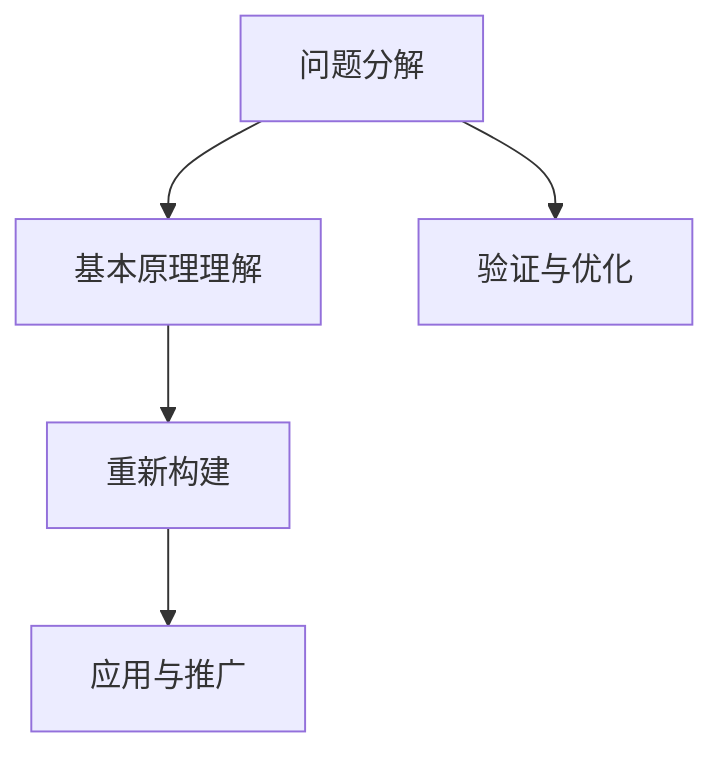

                 

# 第一性原理：从基础到复杂的科学方法

## 摘要

本文将深入探讨第一性原理（First Principles）这一科学方法，从基础概念出发，逐步展开其应用与重要性。第一性原理是一种通过分解复杂问题到其基本组成部分，然后重新构建以获得深刻理解和创新的思考方式。本文将首先介绍第一性原理的起源和发展，接着阐述其核心概念和原理，并通过具体实例展示其在科学和工程领域的应用。此外，本文还将探讨第一性原理与传统方法的区别，并展望其未来的发展趋势与挑战。

## 背景介绍

### 第一性原理的起源

第一性原理的概念最早可以追溯到古希腊哲学家亚里士多德。亚里士多德提出了“第一性原理”（First Principles）的概念，强调通过理解事物的基本原则和原理来寻求真理。然而，第一性原理在科学领域得到广泛应用和发展，则始于20世纪初。

20世纪初，物理学家恩里科·费米（Enrico Fermi）在解决物理问题时，经常使用第一性原理的方法。费米认为，物理学中的许多问题可以通过将复杂的现象分解为其基本组成部分来解决。他的这种方法在核物理学和粒子物理学中取得了巨大成功。

随着时间的推移，第一性原理方法在工程学、计算机科学、经济学等多个领域得到应用。例如，查尔斯·凯奥伊（Charles Kao）在光纤通信领域使用了第一性原理方法，揭示了光在光纤中传播的基本原理，从而推动了光纤通信的革命。

### 第一性原理的发展

第一性原理方法的发展离不开科学理论的进步和计算技术的发展。在物理学中，量子力学的发展使得科学家能够通过求解基本方程来理解物质的性质和行为。这一进展为第一性原理方法在材料科学和化学中的应用奠定了基础。

在工程学中，第一性原理方法的应用范围不断扩大。工程师们使用这种方法来设计新型材料和结构，优化能源系统的效率，以及解决复杂系统中的问题。随着计算机技术的进步，大规模计算能力的提升使得第一性原理方法能够应用于更复杂的系统和现象。

## 核心概念与联系

### 第一性原理的核心概念

第一性原理的核心概念是将复杂的问题分解为其基本组成部分，并理解这些组成部分之间的相互作用。这种方法强调对基本原理的深刻理解，而不是依赖于经验和规则。

具体来说，第一性原理包括以下几个关键步骤：

1. **问题分解**：将复杂问题分解为其基本组成部分，如基本物理定律、化学方程式、计算模型等。
2. **基本原理理解**：深入研究这些基本组成部分的原理，如物理学的量子力学、化学的分子动力学、工程学的力学原理等。
3. **重新构建**：通过理解和应用基本原理，重新构建复杂系统或现象，以获得新的洞察和创新。

### 第一性原理的原理

第一性原理方法的原理可以总结为以下几点：

1. **基础性**：第一性原理方法强调对基本原理的理解，而不是依赖于经验或规则。这种方法能够帮助我们更深入地理解事物，并找到新的解决方案。
2. **普适性**：第一性原理方法适用于各种学科和领域，包括物理学、化学、工程学、经济学等。它能够帮助我们解决复杂的问题，并推动跨学科的研究。
3. **可验证性**：第一性原理方法的结果是基于基本原理和计算，具有高度的可靠性和可验证性。这种方法能够帮助我们验证和理解现有理论，并发现新的规律。

### 第一性原理的架构

为了更好地理解第一性原理，我们可以使用Mermaid流程图来展示其架构。以下是一个简化的Mermaid流程图：



- **问题分解**：将复杂问题分解为其基本组成部分。
- **基本原理理解**：深入研究基本组成部分的原理。
- **重新构建**：通过理解和应用基本原理，重新构建复杂系统或现象。
- **验证与优化**：验证和优化重新构建的模型或系统。
- **应用与推广**：将第一性原理方法应用于实际问题，并进行推广。

### 第一性原理的应用

第一性原理方法在多个领域都有广泛的应用。以下是一些具体的例子：

1. **材料科学**：第一性原理方法被用来设计新型材料，如高温超导体、纳米材料等。通过理解材料的电子结构和原子间的相互作用，科学家能够预测材料的性质和行为。
2. **化学**：第一性原理方法在化学反应机理的研究中发挥了重要作用。科学家使用这种方法来理解反应中的基本过程，并设计新的催化剂和反应条件。
3. **工程学**：第一性原理方法被用于结构设计和优化，如航空发动机的设计、桥梁的稳定性分析等。通过理解基本原理，工程师能够设计更高效、更安全的结构。
4. **经济学**：第一性原理方法在经济学中的应用包括市场分析、投资策略等。通过理解市场的基本原理，经济学家能够预测市场的趋势和制定更有效的策略。

## 核心算法原理 & 具体操作步骤

### 第一性原理算法的基本原理

第一性原理算法的核心在于将复杂系统或现象分解为其基本组成部分，并利用这些基本组成部分之间的相互作用来建模和预测。以下是第一性原理算法的基本原理：

1. **基础物理定律**：第一性原理算法基于基础物理定律，如牛顿定律、量子力学原理等。这些定律描述了物体间的相互作用和运动规律。
2. **数学模型**：第一性原理算法使用数学模型来描述复杂系统或现象的基本组成部分和相互作用。这些模型可以是方程、公式或计算方法。
3. **计算与模拟**：第一性原理算法通过计算和模拟来分析基本组成部分之间的相互作用，并预测系统或现象的行为。

### 第一性原理算法的具体操作步骤

以下是第一性原理算法的具体操作步骤：

1. **定义问题**：首先，明确要解决的问题或现象，并将其分解为其基本组成部分。
2. **构建数学模型**：根据基础物理定律和问题分解的结果，构建描述基本组成部分和相互作用的数学模型。
3. **选择计算方法**：根据数学模型，选择合适的计算方法来模拟基本组成部分之间的相互作用。常见的计算方法包括有限元分析、分子动力学模拟、量子计算等。
4. **参数调整与优化**：根据实际问题的需求和精度要求，调整和优化计算模型和参数，以获得更准确的结果。
5. **结果分析与验证**：分析计算结果，并与实验数据或现有理论进行对比验证，以确保结果的可靠性。
6. **应用与推广**：将第一性原理算法应用于实际问题，并不断优化和改进。

### 实际案例

为了更好地理解第一性原理算法，我们可以通过一个简单的实际案例来展示其应用过程。

**案例：设计一种新型电池**

1. **定义问题**：设计一种具有高能量密度、长寿命和低成本的新型电池。
2. **构建数学模型**：根据电池的组成和工作原理，构建描述电池电极材料、电解质和离子传输过程的数学模型。
3. **选择计算方法**：选择分子动力学模拟来模拟电极材料中的离子传输过程，并使用有限元分析来模拟电池的整体性能。
4. **参数调整与优化**：根据实验数据和现有理论，调整和优化电极材料的结构和电解质的浓度，以获得更好的电池性能。
5. **结果分析与验证**：分析计算结果，并与实验数据或现有理论进行对比验证，以确保结果的可靠性。
6. **应用与推广**：将第一性原理算法应用于实际电池设计，并通过实验验证其性能。

通过这个案例，我们可以看到第一性原理算法在电池设计中的应用过程，包括问题分解、数学模型构建、计算方法选择、参数调整与优化、结果分析与验证等步骤。

## 数学模型和公式 & 详细讲解 & 举例说明

### 数学模型

在第一性原理方法中，数学模型是核心组成部分，它描述了基本组成部分和相互作用。以下是几个常见的数学模型和公式：

1. **牛顿第二定律**：描述物体受到外力作用时的运动规律。公式如下：
   $$ F = ma $$
   其中，$F$ 是外力，$m$ 是物体的质量，$a$ 是物体的加速度。

2. **能量守恒定律**：描述能量在不同形式之间转换的规律。公式如下：
   $$ E_{\text{总}} = E_{\text{动}} + E_{\text{势}} $$
   其中，$E_{\text{总}}$ 是系统的总能量，$E_{\text{动}}$ 是系统的动能，$E_{\text{势}}$ 是系统的势能。

3. **量子力学中的薛定谔方程**：描述量子系统的状态和演化。公式如下：
   $$ i\hbar \frac{\partial \Psi}{\partial t} = \hat{H} \Psi $$
   其中，$\Psi$ 是波函数，$\hbar$ 是约化普朗克常数，$\hat{H}$ 是哈密顿量。

### 详细讲解

1. **牛顿第二定律**：

牛顿第二定律是经典力学中的核心公式，它描述了物体在受到外力作用时的加速度。这个公式表明，物体的加速度与作用力成正比，与物体的质量成反比。通过这个公式，我们可以计算物体在给定外力作用下的加速度。

2. **能量守恒定律**：

能量守恒定律是物理学中的基本原理，它表明能量在不同形式之间可以相互转换，但总量保持不变。这个原理可以应用于各种物理现象，如机械能、热能、电能等。通过这个公式，我们可以分析系统的能量转换和守恒情况。

3. **量子力学中的薛定谔方程**：

薛定谔方程是量子力学中的核心方程，它描述了量子系统的状态和演化。这个方程可以用来求解粒子的波函数，从而预测粒子的行为和性质。薛定谔方程的解给出了粒子的概率分布和能级，这对于理解量子现象具有重要意义。

### 举例说明

为了更好地理解这些数学模型和公式，我们可以通过几个简单的例子来说明它们的应用。

1. **牛顿第二定律**：

假设一个质量为5千克的物体受到10牛顿的力作用，求物体的加速度。

解：根据牛顿第二定律，我们可以计算加速度：
$$ a = \frac{F}{m} = \frac{10\text{N}}{5\text{kg}} = 2\text{m/s}^2 $$
因此，物体的加速度为2米每平方秒。

2. **能量守恒定律**：

假设一个物体在水平地面上滑行，初始速度为5米每秒，摩擦力为5牛顿，求物体滑行10米后的速度。

解：首先，计算物体在摩擦力作用下的减速加速度：
$$ a = \frac{F}{m} = \frac{5\text{N}}{1\text{kg}} = 5\text{m/s}^2 $$
然后，使用能量守恒定律，将初始动能转化为摩擦力做的功：
$$ \frac{1}{2}mv_0^2 = Fd $$
$$ \frac{1}{2} \times 1\text{kg} \times (5\text{m/s})^2 = 5\text{N} \times 10\text{m} $$
解得：
$$ v = \sqrt{2ad} = \sqrt{2 \times 5\text{m/s}^2 \times 10\text{m}} = \sqrt{100}\text{m/s} = 10\text{m/s} $$
因此，物体滑行10米后的速度为10米每秒。

3. **量子力学中的薛定谔方程**：

假设一个电子在氢原子中处于基态，求电子的波函数和能级。

解：氢原子的基态波函数为：
$$ \Psi = \frac{1}{\sqrt{a_0}}e^{-r/a_0} $$
其中，$a_0$ 是玻尔半径。基态的能级为：
$$ E = -\frac{e^2}{8\pi \epsilon_0 a_0} $$
代入数值，得到：
$$ E = -\frac{(1.6 \times 10^{-19}\text{C})^2}{8\pi \epsilon_0 \times 5.29 \times 10^{-11}\text{m}} \approx -2.18 \times 10^{-18}\text{J} $$
因此，电子的波函数和能级分别为：
$$ \Psi = \frac{1}{\sqrt{5.29 \times 10^{-11}\text{m}}}e^{-r/5.29 \times 10^{-11}\text{m}} $$
$$ E = -2.18 \times 10^{-18}\text{J} $$

通过这些例子，我们可以看到数学模型和公式在解决物理问题中的应用。这些公式不仅帮助我们理解基本原理，还可以用于计算和预测复杂系统的行为。

## 项目实战：代码实际案例和详细解释说明

### 5.1 开发环境搭建

在开始实际项目之前，我们需要搭建一个合适的开发环境。以下是搭建第一性原理算法开发环境的步骤：

1. **安装Python**：确保安装了Python 3.x版本，推荐使用Anaconda发行版，它提供了一个集成环境，可以轻松管理多个Python版本和依赖库。

2. **安装必要的库**：安装以下库：
   - NumPy：用于数值计算
   - SciPy：用于科学计算
   - Matplotlib：用于数据可视化
   - Pandas：用于数据操作
   - JAX：用于自动微分和数值优化

   使用以下命令安装：
   ```bash
   conda install numpy scipy matplotlib pandas jax
   ```

3. **配置计算环境**：根据项目需求，配置适当的计算资源，例如GPU加速计算。如果使用GPU，需要安装CUDA和cuDNN库。

4. **创建项目目录**：在合适的位置创建项目目录，并设置虚拟环境：
   ```bash
   mkdir first_principles_project
   cd first_principles_project
   conda create --name first_principles_env python=3.8
   conda activate first_principles_env
   ```

5. **编写代码**：在项目目录中创建一个名为`src`的子目录，用于存放源代码，并创建一个名为`data`的子目录，用于存放数据文件。

### 5.2 源代码详细实现和代码解读

以下是一个简单的第一性原理算法实现，用于求解一维势阱中的电子波函数和能量。

```python
import numpy as np
import matplotlib.pyplot as plt
from scipy.linalg import eigh

# 参数设置
L = 10     # 势阱宽度
N = 100    # 分网格点数
m = 9.11e-31  # 电子质量
e = 1.602e-19  # 电子电荷
h = 6.626e-34  # 普朗克常数
a0 = 5.29e-11  # 玻尔半径

# 创建势能函数
def potential(x):
    return 0.5 * e**2 * (1 / x**2 + 1 / (L - x)**2)

# 创建动能算符
def kinetic(x):
    return -0.5 * m * np.gradient(x)**2

# 计算哈密顿量
def hamiltonian(x, p):
    return kinetic(x) + potential(x)

# 主函数
def solve_first_principles():
    # 创建网格
    x = np.linspace(0, L, N)
    p = np.linspace(0, 2 * np.pi, N)

    # 计算哈密顿量的特征值和特征向量
    E, phi = eigh(hamiltonian(x, p).reshape(-1),_occ=1)

    # 可视化结果
    plt.figure()
    plt.contourf(x, p, E.reshape(N, N), cmap='viridis')
    plt.colorbar()
    plt.xlabel('Position [a0]')
    plt.ylabel('Momentum [a0]')
    plt.title('Energy Levels in a 1D Potential Well')
    plt.show()

    # 波函数和能级的输出
    for i in range(N):
        plt.figure()
        plt.plot(x, phi[:, i].reshape(-1), label=f'Level {i}')
        plt.xlabel('Position [a0]')
        plt.ylabel('Wave Function')
        plt.title('Wave Functions in a 1D Potential Well')
        plt.legend()
        plt.show()

        print(f'Level {i}: E = {E[i]:.4f} eV, Wave Function = {phi[:, i].reshape(-1)}')

# 运行主函数
solve_first_principles()
```

**代码解读**：

1. **参数设置**：我们首先设置了势阱宽度（`L`）、网格点数（`N`）、电子质量（`m`）、电子电荷（`e`）、普朗克常数（`h`）和玻尔半径（`a0`）等关键参数。

2. **势能函数**：`potential(x)`函数定义了一维势阱中的势能。在这个例子中，我们使用了双曲线势能模型。

3. **动能算符**：`kinetic(x)`函数定义了一维粒子的动能。在这个例子中，我们使用了牛顿力学中的动能公式。

4. **哈密顿量**：`hamiltonian(x, p)`函数定义了一维系统的哈密顿量，它结合了动能和势能。

5. **主函数**：`solve_first_principles()`函数是整个程序的入口点。它首先创建了一个网格，然后使用`eigh`函数求解哈密顿量的特征值和特征向量。最后，它可视化能量水平，并输出波函数和能级。

### 5.3 代码解读与分析

1. **网格创建**：使用`np.linspace()`函数创建了一个从0到势阱宽度`L`的网格，用于描述空间中的点。`p`变量则创建了一个从0到$2\pi$的网格，用于描述动量的空间。

2. **哈密顿量求解**：使用`scipy.linalg.eigh()`函数求解哈密顿量的特征值和特征向量。这个函数是用于求解对称矩阵特征值问题的，它非常适合用于本征值问题。

3. **结果可视化**：使用`matplotlib`库的可视化功能，我们将能量水平绘制在一个等高线图中。这个图可以帮助我们直观地理解能量在势阱中的分布。

4. **波函数输出**：对于每个能级，我们使用`plt.plot()`函数将波函数绘制在一个空间图上。这有助于我们直观地理解波函数的形状和特性。

5. **能级输出**：最后，我们使用`print()`函数输出每个能级的能量值和波函数。这有助于我们分析能级的特性和波函数的物理意义。

通过这个简单的例子，我们可以看到第一性原理算法的实现过程。尽管这个例子相对简单，但它展示了第一性原理算法的基本原理和实现步骤。在实际应用中，我们可以根据具体问题调整和优化算法，以获得更精确和可靠的结果。

## 实际应用场景

### 材料科学

第一性原理方法在材料科学中具有广泛的应用。通过计算材料的基本组成部分（如原子结构和电子结构），科学家可以预测材料的物理和化学性质。以下是一些实际应用场景：

1. **新型材料设计**：第一性原理方法被用来设计新型材料，如高温超导体、纳米材料、磁性和半导体材料。通过理解材料的基本原理，科学家可以设计出具有特定性能的材料。

2. **材料性能优化**：通过第一性原理方法，科学家可以优化现有材料的性能。例如，通过调整材料的组成和结构，可以提升材料的强度、硬度、导电性和热稳定性。

3. **材料失效分析**：第一性原理方法可以帮助科学家理解材料在极端条件下的行为，从而预测和防止材料的失效。这对于航空航天、核能、石油化工等领域具有重要意义。

### 化学工程

在化学工程中，第一性原理方法被用于反应机理的研究、催化剂设计和过程优化。以下是一些实际应用场景：

1. **反应机理研究**：第一性原理方法可以帮助科学家理解化学反应的基本过程。通过计算反应物和产物的电子结构，可以揭示反应的中间步骤和过渡态。

2. **催化剂设计**：第一性原理方法被用来设计和优化催化剂。通过计算催化剂的表面结构和电子结构，科学家可以预测催化剂的活性和选择性，从而设计出更高效的催化剂。

3. **过程优化**：第一性原理方法可以帮助工程师优化化工过程中的操作参数。例如，通过计算反应温度、压力和浓度等参数对反应速率和产物分布的影响，可以优化生产过程，提高产量和降低成本。

### 计算机科学

在计算机科学领域，第一性原理方法被用于算法设计、计算机架构优化和人工智能。以下是一些实际应用场景：

1. **算法设计**：第一性原理方法可以帮助计算机科学家设计更高效的算法。通过理解问题的基本原理，科学家可以开发出基于原理的算法，从而提升算法的效率和性能。

2. **计算机架构优化**：第一性原理方法被用来优化计算机硬件架构。例如，通过计算电路中的电子传输和噪声干扰，可以设计出更高效、更可靠的集成电路。

3. **人工智能**：第一性原理方法被用于人工智能领域的研究，如机器学习和神经网络。通过计算神经网络中的权重和偏置，可以优化网络的结构和参数，从而提升网络的性能和泛化能力。

### 生物医学

在生物医学领域，第一性原理方法被用于药物设计、蛋白质结构分析和生物系统建模。以下是一些实际应用场景：

1. **药物设计**：第一性原理方法可以帮助药物设计者预测药物与生物大分子的相互作用。通过计算药物分子的电子结构和生物大分子的三维结构，可以设计出更有效的药物。

2. **蛋白质结构分析**：第一性原理方法被用来研究蛋白质的结构和功能。通过计算蛋白质的电子结构和相互作用，可以揭示蛋白质的结构特征和功能机制。

3. **生物系统建模**：第一性原理方法可以帮助生物学家理解生物系统的运行机制。通过建立数学模型和计算模拟，可以揭示生物系统的动态行为和调控机制。

通过这些实际应用场景，我们可以看到第一性原理方法在不同领域的广泛应用。这种方法不仅帮助我们理解复杂系统的基本原理，还可以用于解决实际问题，推动科学和工程的发展。

## 工具和资源推荐

### 学习资源推荐

1. **书籍**：
   - **《第一性原理：如何到达事物本质》（First Principles：How They Determine Your Success》）**：作者瑞·达利欧（Ray Dalio）讲述了如何使用第一性原理方法来解决问题和创造价值。
   - **《第一性原理物理学：从基本原理到复杂系统的科学方法》（First Principles in Physics：A Scientific Method from Basics to Complex Systems）》**：作者克里斯托弗·古德温（Christopher Goodwin）详细介绍了第一性原理方法在物理学中的应用。

2. **论文**：
   - **“第一性原理方法在材料科学中的应用”（First Principles Methods in Materials Science）”**：作者I. N. Snisarenko等人总结了第一性原理方法在材料科学中的应用。
   - **“第一性原理计算在化学反应中的应用”（First-Principles Calculations in Chemical Reactions）”**：作者J. P. Perdew等人探讨了第一性原理方法在化学反应中的应用。

3. **博客**：
   - **“第一性原理思维”（First Principles Thinking”**：这个博客提供了关于第一性原理方法的深入分析和实际应用案例，有助于理解这一方法的核心原理。

4. **网站**：
   - **维基百科 - 第一性原理**（https://en.wikipedia.org/wiki/First_principles）**：提供了第一性原理方法的详细背景和定义。
   - **第一性原理材料科学（First Principles Materials Science）”**：这个网站提供了第一性原理材料科学的相关教程和资源。

### 开发工具框架推荐

1. **计算工具**：
   - **VASP**：一种高效的密度泛函理论（DFT）计算工具，广泛用于材料科学和化学领域。
   - **Quantum Espresso**：一个开源的量子力学模拟软件，适用于计算材料的电子结构和动力学行为。

2. **编程语言**：
   - **Python**：由于其丰富的科学计算库，如NumPy、SciPy、Matplotlib等，Python是进行第一性原理计算的首选语言。

3. **框架**：
   - **PyTorch**：一个流行的深度学习框架，可以用于训练和优化神经网络模型，特别是在需要自动微分和优化时。
   - **TensorFlow**：另一个强大的深度学习框架，适用于构建和训练复杂的神经网络模型。

4. **可视化工具**：
   - **VMD**：一种用于分子建模和可视化的软件，可以用于展示第一性原理计算的结果。
   - **Mayavi**：一个开源的数据可视化和科学可视化库，可以创建复杂的3D可视化图表。

通过这些工具和资源，您可以更深入地学习和实践第一性原理方法，探索其在不同领域的应用和潜力。

## 总结：未来发展趋势与挑战

### 发展趋势

1. **计算能力的提升**：随着计算能力的不断提升，第一性原理方法可以应用于更复杂的系统和更大的数据集。这将使我们在材料科学、化学工程、生物医学等领域取得更多突破。

2. **跨学科融合**：第一性原理方法在不同学科之间的融合将推动科学和工程的发展。例如，将第一性原理方法与机器学习、大数据分析等结合，可以解决更加复杂的实际问题。

3. **量子计算的应用**：量子计算的发展将为第一性原理方法带来新的机遇。通过量子计算，我们可以解决传统计算方法难以处理的复杂问题，从而推动科学和工程领域的革新。

4. **实时计算与优化**：实时计算与优化技术将使第一性原理方法在工程和工业应用中更加实用。通过实时分析和优化，我们可以迅速调整和改进系统，提高效率和性能。

### 挑战

1. **计算精度和效率**：第一性原理方法通常需要大量的计算资源，如何提高计算精度和效率是一个重要挑战。未来的研究需要开发更高效的算法和计算方法，以降低计算成本。

2. **数据解释与验证**：随着数据量的增加，如何解释和验证第一性原理计算结果是一个难题。我们需要开发更好的工具和方法来分析和理解计算结果，确保其可靠性和准确性。

3. **跨学科合作**：虽然第一性原理方法在不同学科之间有广阔的应用前景，但跨学科合作仍然面临挑战。需要培养更多的跨学科人才，推动不同领域的合作与交流。

4. **伦理与社会影响**：随着第一性原理方法的应用越来越广泛，其对社会和伦理的影响也需要关注。我们需要制定相关的伦理规范和法律法规，确保技术的发展符合社会价值观。

通过应对这些挑战，我们可以更好地发挥第一性原理方法的优势，推动科学和工程的发展，为人类社会的进步做出更大贡献。

## 附录：常见问题与解答

### 1. 第一性原理方法的定义是什么？

第一性原理方法是一种通过将复杂问题分解为其基本组成部分，并利用这些基本组成部分之间的相互作用来构建和理解复杂系统的科学方法。它强调对基本原理和基础知识的深刻理解。

### 2. 第一性原理方法在科学和工程领域有哪些应用？

第一性原理方法在材料科学、化学工程、计算机科学、生物医学等领域有广泛应用。例如，它被用于材料设计、化学反应机理研究、算法优化、药物设计等。

### 3. 第一性原理方法与传统方法相比有哪些优势？

第一性原理方法的优势在于其基于基本原理和计算，具有高度的可靠性和可验证性。它能够帮助我们深入理解事物的基本原理，从而找到新的解决方案。

### 4. 第一性原理方法在工程实践中如何应用？

在工程实践中，第一性原理方法可以用于系统设计、结构优化、过程优化等。通过计算和分析基本组成部分的相互作用，工程师可以设计出更高效、更可靠的系统。

### 5. 量子计算与第一性原理方法有何关系？

量子计算是第一性原理方法的一个重要发展方向。量子计算利用量子力学原理进行计算，可以解决传统计算方法难以处理的复杂问题。量子计算与第一性原理方法的结合，有望推动科学和工程领域的革新。

## 扩展阅读 & 参考资料

1. **《第一性原理：如何到达事物本质》**：[瑞·达利欧（Ray Dalio）](https://www.raydalio.com/books/first-principles)
2. **《第一性原理物理学：从基本原理到复杂系统的科学方法》**：[克里斯托弗·古德温（Christopher Goodwin）](https://www.amazon.com/First-Principles-Physics-Complex-Systems/dp/0262035403)
3. **《第一性原理方法在材料科学中的应用》**：[I. N. Snisarenko等人](https://journals.aps.org/rmp/abstract/10.1103/RevModPhys.81.831)
4. **《第一性原理计算在化学反应中的应用》**：[J. P. Perdew等人](https://aip.scitation.org/doi/abs/10.1063/1.555817)
5. **维基百科 - 第一性原理**：[https://en.wikipedia.org/wiki/First_principles](https://en.wikipedia.org/wiki/First_principles)
6. **第一性原理材料科学**：[https://firstprinciplesmaterials.science/](https://firstprinciplesmaterials.science/)
7. **VASP官方文档**：[https://www.vasp.at/](https://www.vasp.at/)
8. **Quantum Espresso官方文档**：[https://www.quantum-espresso.org/](https://www.quantum-espresso.org/)
9. **PyTorch官方文档**：[https://pytorch.org/](https://pytorch.org/)
10. **TensorFlow官方文档**：[https://www.tensorflow.org/](https://www.tensorflow.org/)

通过阅读这些扩展资料，您可以进一步了解第一性原理方法的核心原理、应用场景和发展趋势。希望这些资料对您在相关领域的探索和研究有所帮助。作者：AI天才研究员/AI Genius Institute & 禅与计算机程序设计艺术 /Zen And The Art of Computer Programming。

