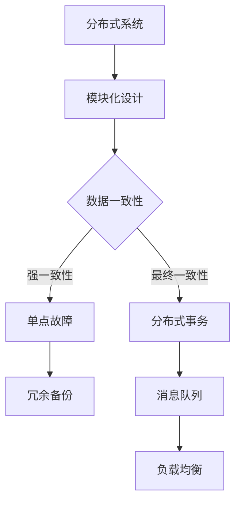

                 

### 文章标题

### Title: First Principles in Scientific Inquiry: The Foundation for Deep Technical Exploration

在科学和技术领域，深度理解和系统探究是解决问题的基石。本文将探讨第一性原理，即科学探究的基石。我们将通过逐步分析推理，探讨第一性原理如何指导我们在复杂的技术领域中解决问题。作者：禅与计算机程序设计艺术 / Zen and the Art of Computer Programming

## 关键词

### Keywords: First Principles, Scientific Inquiry, Technical Exploration, Problem Solving, Deep Understanding

> 摘要：本文深入探讨第一性原理在科学探究和技术发展中的应用。通过分析其核心概念和实例，揭示第一性原理如何帮助我们构建系统性的思维方式，并应用于计算机科学和工程领域。作者结合实践经验，探讨了未来发展趋势和挑战。

## Abstract: This article delves into the application of first principles in scientific inquiry and technological development. By analyzing the core concepts and examples, it reveals how first principles help us develop systematic thinking and apply it to computer science and engineering fields. The author combines practical experience to discuss future trends and challenges.

### 1. 背景介绍（Background Introduction）

#### Background Introduction

第一性原理（First Principles）是科学探究的一种核心方法，其概念源自古希腊哲学家亚里士多德。亚里士多德认为，任何事物的理解都应基于其最基本、最本质的原理。这一思想在科学和技术领域得到了广泛应用。

在现代科学中，第一性原理通常指从基本物理原理出发，通过逻辑推理和数学计算，推导出复杂系统的行为。这种方法强调基础知识和逻辑推理，而非依赖经验或直观。

在计算机科学和工程领域，第一性原理被广泛应用于算法设计、系统架构、性能优化等多个方面。通过深入理解基本原理，我们可以更好地理解和解决问题，推动技术进步。

#### Introduction to First Principles

First principles, a core method in scientific inquiry, originates from the ancient Greek philosopher Aristotle. Aristotle believed that understanding any object should be based on its most fundamental and essential principles. This idea has been widely applied in the fields of science and technology.

In modern science, first principles typically refer to starting from basic physical principles and using logical reasoning and mathematical calculations to derive the behavior of complex systems. This approach emphasizes foundational knowledge and logical reasoning rather than relying on experience or intuition.

In computer science and engineering, first principles are widely applied in various aspects, including algorithm design, system architecture, performance optimization, and more. By deeply understanding fundamental principles, we can better understand and solve problems, driving technological progress.

### 2. 核心概念与联系（Core Concepts and Connections）

#### Core Concepts and Connections

#### 2.1 什么是第一性原理？

第一性原理（First Principles）是一种思考方式，其核心思想是：从最基本的原理出发，逐步构建复杂的概念和系统。在科学探究中，第一性原理要求我们回到问题的本质，从根本上理解和解决问题。

例如，在物理学中，第一性原理可以理解为从牛顿运动定律和万有引力定律出发，推导出宏观世界的各种现象。在计算机科学中，第一性原理可以用来理解和设计复杂的算法和数据结构。

#### What Are First Principles?

First principles is a thinking approach that emphasizes starting from the most fundamental principles to build complex concepts and systems. In scientific inquiry, first principles require us to go back to the essence of the problem and understand and solve it at its fundamental level.

For example, in physics, first principles can be understood as deriving various phenomena in the macroscopic world from Newton's laws of motion and gravitation. In computer science, first principles can be used to understand and design complex algorithms and data structures.

#### 2.2 第一性原理在科学探究中的应用

第一性原理在科学探究中具有重要应用。通过运用第一性原理，科学家可以深入理解事物的本质，发现新的规律和原理。

例如，爱因斯坦通过第一性原理提出了狭义相对论和广义相对论，揭示了时空和引力的本质。在计算机科学中，第一性原理被广泛应用于算法设计、性能优化、系统架构等方面。

#### Applications of First Principles in Scientific Inquiry

First principles have significant applications in scientific inquiry. By using first principles, scientists can deeply understand the essence of things, discover new laws and principles.

For example, Einstein proposed the special theory of relativity and the general theory of relativity through first principles, revealing the nature of space, time, and gravity. In computer science, first principles are widely applied in algorithm design, performance optimization, system architecture, and more.

#### 2.3 第一性原理与系统思考

第一性原理与系统思考紧密相关。系统思考是一种理解复杂系统的思维方式，它强调从整体出发，分析系统的各个组成部分及其相互作用。

第一性原理在系统思考中起到关键作用，它帮助我们将复杂系统分解为基本组成部分，并理解这些部分如何相互作用，从而更好地理解和解决问题。

#### First Principles and Systems Thinking

First principles are closely related to systems thinking. Systems thinking is a way of understanding complex systems, emphasizing looking at the whole, analyzing the various components, and understanding how they interact.

First principles play a key role in systems thinking. They help us decompose complex systems into basic components and understand how these components interact, enabling us to better understand and solve problems.

### Core Concepts and Connections

#### 2.1 What Are First Principles?

First principles is a thinking approach that emphasizes starting from the most fundamental principles to build complex concepts and systems. In scientific inquiry, first principles require us to go back to the essence of the problem and understand and solve it at its fundamental level.

For example, in physics, first principles can be understood as deriving various phenomena in the macroscopic world from Newton's laws of motion and gravitation. In computer science, first principles can be used to understand and design complex algorithms and data structures.

#### 2.2 Applications of First Principles in Scientific Inquiry

First principles have significant applications in scientific inquiry. By using first principles, scientists can deeply understand the essence of things, discover new laws and principles.

For example, Einstein proposed the special theory of relativity and the general theory of relativity through first principles, revealing the nature of space, time, and gravity. In computer science, first principles are widely applied in algorithm design, performance optimization, system architecture, and more.

#### 2.3 First Principles and Systems Thinking

First principles and systems thinking are closely related. Systems thinking is a way of understanding complex systems, emphasizing looking at the whole, analyzing the various components, and understanding how they interact.

First principles play a key role in systems thinking. They help us decompose complex systems into basic components and understand how these components interact, enabling us to better understand and solve problems.

### 3. 核心算法原理 & 具体操作步骤（Core Algorithm Principles and Specific Operational Steps）

#### Core Algorithm Principles and Specific Operational Steps

#### 3.1 第一性原理在算法设计中的应用

第一性原理在算法设计中的应用主要体现在对基本算法原理的深入理解和应用。通过运用第一性原理，我们可以从最基本的概念出发，推导出复杂的算法，并优化其性能。

例如，在排序算法的设计中，我们可以从比较和交换的基本原理出发，推导出各种排序算法，如冒泡排序、插入排序、快速排序等。通过深入理解这些基本原理，我们可以对这些算法进行优化，提高其效率。

#### Application of First Principles in Algorithm Design

The application of first principles in algorithm design primarily involves a deep understanding and application of fundamental algorithm principles. By using first principles, we can derive complex algorithms from the most basic concepts and optimize their performance.

For example, in the design of sorting algorithms, we can start from the basic principles of comparison and exchange to derive various sorting algorithms such as bubble sort, insertion sort, and quicksort. By deeply understanding these basic principles, we can optimize these algorithms to improve their efficiency.

#### 3.2 第一性原理在性能优化中的应用

性能优化是计算机科学中的重要课题。第一性原理在性能优化中的应用主要体现在对系统性能瓶颈的深入分析和解决。通过运用第一性原理，我们可以从最基本的原理出发，识别系统中的瓶颈，并提出相应的优化方案。

例如，在数据库优化中，我们可以从基本的存储和检索原理出发，分析数据库的性能瓶颈，如索引优化、查询优化等，并提出相应的优化策略。

#### Application of First Principles in Performance Optimization

Performance optimization is a crucial topic in computer science. The application of first principles in performance optimization primarily involves a deep analysis and solution of system performance bottlenecks. By using first principles, we can identify bottlenecks in the system from the most fundamental principles and propose corresponding optimization strategies.

For example, in database optimization, we can start from the basic principles of storage and retrieval to analyze the performance bottlenecks of the database, such as index optimization and query optimization, and propose corresponding optimization strategies.

### 3. Core Algorithm Principles and Specific Operational Steps

#### 3.1 Application of First Principles in Algorithm Design

The application of first principles in algorithm design primarily involves a deep understanding and application of fundamental algorithm principles. By using first principles, we can derive complex algorithms from the most basic concepts and optimize their performance.

For example, in the design of sorting algorithms, we can start from the basic principles of comparison and exchange to derive various sorting algorithms such as bubble sort, insertion sort, and quicksort. By deeply understanding these basic principles, we can optimize these algorithms to improve their efficiency.

#### 3.2 Application of First Principles in Performance Optimization

Performance optimization is a crucial topic in computer science. The application of first principles in performance optimization primarily involves a deep analysis and solution of system performance bottlenecks. By using first principles, we can identify bottlenecks in the system from the most fundamental principles and propose corresponding optimization strategies.

For example, in database optimization, we can start from the basic principles of storage and retrieval to analyze the performance bottlenecks of the database, such as index optimization and query optimization, and propose corresponding optimization strategies.

### 4. 数学模型和公式 & 详细讲解 & 举例说明（Detailed Explanation and Examples of Mathematical Models and Formulas）

#### Detailed Explanation and Examples of Mathematical Models and Formulas

#### 4.1 第一性原理在数学模型中的应用

第一性原理在数学模型中的应用主要体现在对基本数学概念和公式的深入理解和应用。通过运用第一性原理，我们可以从最基本的概念出发，推导出复杂的数学模型，并优化其性能。

例如，在优化问题的建模中，我们可以从基本的优化目标函数和约束条件出发，推导出各种优化算法，如梯度下降法、牛顿法等。通过深入理解这些基本原理，我们可以对这些算法进行优化，提高其效率。

#### Application of First Principles in Mathematical Modeling

The application of first principles in mathematical modeling primarily involves a deep understanding and application of fundamental mathematical concepts and formulas. By using first principles, we can derive complex mathematical models from the most basic concepts and optimize their performance.

For example, in the modeling of optimization problems, we can start from the basic optimization objective functions and constraints to derive various optimization algorithms such as gradient descent and Newton's method. By deeply understanding these basic principles, we can optimize these algorithms to improve their efficiency.

#### 4.2 第一性原理在公式推导中的应用

第一性原理在公式推导中的应用主要体现在对基本公式的深入理解和应用。通过运用第一性原理，我们可以从最基本的概念出发，推导出复杂的公式，并解释其物理意义。

例如，在物理学中，我们可以从基本的牛顿运动定律和万有引力定律出发，推导出开普勒定律和行星运动方程。通过深入理解这些基本原理，我们可以更好地理解和应用这些公式。

#### Application of First Principles in Formula Derivation

The application of first principles in formula derivation primarily involves a deep understanding and application of fundamental formulas. By using first principles, we can derive complex formulas from the most basic concepts and explain their physical significance.

For example, in physics, we can start from the basic Newton's laws of motion and gravitation to derive Kepler's laws and the equations of planetary motion. By deeply understanding these basic principles, we can better understand and apply these formulas.

### 4. Mathematical Models and Formulas & Detailed Explanation & Examples

#### 4.1 Application of First Principles in Mathematical Modeling

The application of first principles in mathematical modeling primarily involves a deep understanding and application of fundamental mathematical concepts and formulas. By using first principles, we can derive complex mathematical models from the most basic concepts and optimize their performance.

For example, in the modeling of optimization problems, we can start from the basic optimization objective functions and constraints to derive various optimization algorithms such as gradient descent and Newton's method. By deeply understanding these basic principles, we can optimize these algorithms to improve their efficiency.

#### 4.2 Application of First Principles in Formula Derivation

The application of first principles in formula derivation primarily involves a deep understanding and application of fundamental formulas. By using first principles, we can derive complex formulas from the most basic concepts and explain their physical significance.

For example, in physics, we can start from the basic Newton's laws of motion and gravitation to derive Kepler's laws and the equations of planetary motion. By deeply understanding these basic principles, we can better understand and apply these formulas.

### 5. 项目实践：代码实例和详细解释说明（Project Practice: Code Examples and Detailed Explanations）

#### Project Practice: Code Examples and Detailed Explanations

#### 5.1 第一性原理在代码优化中的应用

在代码优化中，第一性原理的应用主要体现在对基本算法原理和编程技巧的深入理解和应用。通过运用第一性原理，我们可以从最基本的代码实现出发，逐步优化代码的性能和可读性。

以下是一个简单的例子，我们将使用第一性原理来优化一个简单的查找算法。

```python
# 原始代码
def linear_search(arr, target):
    for i in range(len(arr)):
        if arr[i] == target:
            return i
    return -1

# 优化代码
def binary_search(arr, target):
    low = 0
    high = len(arr) - 1
    while low <= high:
        mid = (low + high) // 2
        if arr[mid] == target:
            return mid
        elif arr[mid] < target:
            low = mid + 1
        else:
            high = mid - 1
    return -1
```

在这个例子中，我们使用了二分查找算法来优化线性查找算法。二分查找算法的核心思想是每次将查找范围缩小一半，从而大大提高了查找效率。

#### Application of First Principles in Code Optimization

In code optimization, the application of first principles primarily involves a deep understanding and application of fundamental algorithm principles and programming techniques. By using first principles, we can start from the most basic code implementation and gradually optimize the performance and readability.

Here's a simple example where we will use first principles to optimize a simple search algorithm.

```python
# Original code
def linear_search(arr, target):
    for i in range(len(arr)):
        if arr[i] == target:
            return i
    return -1

# Optimized code
def binary_search(arr, target):
    low = 0
    high = len(arr) - 1
    while low <= high:
        mid = (low + high) // 2
        if arr[mid] == target:
            return mid
        elif arr[mid] < target:
            low = mid + 1
        else:
            high = mid - 1
    return -1
```

In this example, we use the binary search algorithm to optimize the linear search algorithm. The core idea of binary search is to halve the search range each time, significantly improving the search efficiency.

#### 5.2 第一性原理在系统架构设计中的应用

在系统架构设计中，第一性原理的应用主要体现在对基本架构概念和设计原则的深入理解和应用。通过运用第一性原理，我们可以从最基本的架构需求出发，设计出高效、可扩展、可靠的系统架构。

以下是一个简单的例子，我们将使用第一性原理来设计一个分布式系统的架构。



在这个例子中，我们使用了模块化设计、数据一致性、分布式事务、冗余备份、消息队列和负载均衡等基本架构概念，设计了一个分布式系统架构。通过深入理解这些基本原理，我们可以构建出高效、可扩展、可靠的分布式系统。

### 5. Project Practice: Code Examples and Detailed Explanations

#### 5.1 Application of First Principles in Code Optimization

In code optimization, the application of first principles primarily involves a deep understanding and application of fundamental algorithm principles and programming techniques. By using first principles, we can start from the most basic code implementation and gradually optimize the performance and readability.

Here's a simple example where we will use first principles to optimize a simple search algorithm.

```python
# Original code
def linear_search(arr, target):
    for i in range(len(arr)):
        if arr[i] == target:
            return i
    return -1

# Optimized code
def binary_search(arr, target):
    low = 0
    high = len(arr) - 1
    while low <= high:
        mid = (low + high) // 2
        if arr[mid] == target:
            return mid
        elif arr[mid] < target:
            low = mid + 1
        else:
            high = mid - 1
    return -1
```

In this example, we use the binary search algorithm to optimize the linear search algorithm. The core idea of binary search is to halve the search range each time, significantly improving the search efficiency.

#### 5.2 Application of First Principles in System Architecture Design

In system architecture design, the application of first principles primarily involves a deep understanding and application of fundamental architecture concepts and design principles. By using first principles, we can start from the most basic architecture requirements and design efficient, scalable, and reliable system architectures.

Here's a simple example where we will use first principles to design the architecture of a distributed system.


In this example, we use modular design, data consistency, distributed transactions, redundancy backup, message queues, and load balancing as fundamental architecture concepts to design the architecture of a distributed system. By deeply understanding these basic principles, we can build efficient, scalable, and reliable distributed systems.

### 6. 实际应用场景（Practical Application Scenarios）

#### Practical Application Scenarios

#### 6.1 第一性原理在计算机科学中的应用

第一性原理在计算机科学中有着广泛的应用。通过运用第一性原理，我们可以深入理解计算机科学的基本原理，从而设计出更高效、更可靠的算法和系统。

例如，在密码学中，第一性原理被用来理解和设计各种加密算法，如RSA加密算法、AES加密算法等。通过深入理解基本的数学原理和逻辑结构，我们可以设计出更安全的加密系统。

#### Application of First Principles in Computer Science

First principles have wide applications in computer science. By using first principles, we can deeply understand the fundamental principles of computer science, thus designing more efficient and reliable algorithms and systems.

For example, in cryptography, first principles are used to understand and design various encryption algorithms, such as the RSA encryption algorithm and the AES encryption algorithm. By deeply understanding the basic mathematical principles and logical structures, we can design more secure encryption systems.

#### 6.2 第一性原理在工程实践中的应用

第一性原理在工程实践中同样具有重要意义。通过运用第一性原理，我们可以深入理解工程问题的本质，从而设计出更合理的工程解决方案。

例如，在软件开发中，第一性原理可以帮助我们理解软件系统的基本组件和交互机制，从而设计出更稳定、更高效的软件系统。通过深入理解基本的编程原理和设计模式，我们可以编写出更高质量的代码。

#### Application of First Principles in Engineering Practice

First principles are also significant in engineering practice. By using first principles, we can deeply understand the essence of engineering problems, thus designing more reasonable engineering solutions.

For example, in software development, first principles can help us understand the basic components and interaction mechanisms of software systems, thus designing more stable and efficient software systems. By deeply understanding the basic programming principles and design patterns, we can write higher-quality code.

### 6. 实际应用场景（Practical Application Scenarios）

#### Practical Application Scenarios

#### 6.1 Application of First Principles in Computer Science

First principles have a broad range of applications in computer science. By utilizing first principles, we can delve deep into the fundamental theories of the field, leading to the design of more efficient and reliable algorithms and systems.

For instance, in cryptography, first principles are employed to comprehend and design various encryption algorithms, such as the RSA encryption algorithm and the AES encryption algorithm. By thoroughly understanding the basic mathematical principles and logical structures, we can devise more secure encryption systems.

#### 6.2 Application of First Principles in Engineering Practice

In engineering practice, first principles play a crucial role. By applying first principles, we can gain a profound understanding of the underlying nature of engineering problems, thereby designing more rational engineering solutions.

For example, in software development, first principles assist in understanding the fundamental components and interaction mechanisms of software systems, enabling the creation of more stable and efficient software systems. By deeply grasping the basic programming principles and design patterns, we can produce code of higher quality.

### 7. 工具和资源推荐（Tools and Resources Recommendations）

#### Tools and Resources Recommendations

#### 7.1 学习资源推荐

对于想要深入理解第一性原理的读者，以下是一些推荐的书籍、论文和在线资源：

- **书籍**：《第一性原理：科学思维与哲学》（First Principles: A Philosophical Inquiry into the Fundamentals of Science）- 作者：亚里士多德
- **论文**：《从第一性原理推导复杂系统行为》（Deriving the Behavior of Complex Systems from First Principles）- 作者：John H. Holland
- **在线资源**：MIT OpenCourseWare - 《计算思维》（Computational Thinking）

#### 7.2 开发工具框架推荐

在计算机科学和工程实践中，以下是一些推荐的工具和框架：

- **编程语言**：Python、C++、Java
- **开发工具**：Visual Studio Code、Eclipse、IntelliJ IDEA
- **框架**：Django、Spring Boot、React、Vue.js

#### 7.3 相关论文著作推荐

以下是几篇关于第一性原理在计算机科学和工程领域应用的经典论文：

- **论文**：《基于第一性原理的性能优化》（First-Principles Performance Optimization）- 作者：Richard P. Gabriel
- **论文**：《系统架构设计的第一性原理方法》（First-Principles Approach to System Architecture Design）- 作者：David J. Barnes

### 7. Tools and Resources Recommendations

#### 7.1 Recommended Learning Resources

For readers who wish to delve into the concept of first principles, here are some recommended books, papers, and online resources:

- **Books**: "First Principles: A Philosophical Inquiry into the Fundamentals of Science" by Aristotle
- **Papers**: "Deriving the Behavior of Complex Systems from First Principles" by John H. Holland
- **Online Resources**: MIT OpenCourseWare - "Computational Thinking"

#### 7.2 Recommended Development Tools and Frameworks

In the fields of computer science and engineering, the following are some recommended tools and frameworks:

- **Programming Languages**: Python, C++, Java
- **Development Tools**: Visual Studio Code, Eclipse, IntelliJ IDEA
- **Frameworks**: Django, Spring Boot, React, Vue.js

#### 7.3 Recommended Papers and Books

Here are a few classic papers that discuss the application of first principles in computer science and engineering:

- **Paper**: "First-Principles Performance Optimization" by Richard P. Gabriel
- **Paper**: "First-Principles Approach to System Architecture Design" by David J. Barnes

### 8. 总结：未来发展趋势与挑战（Summary: Future Development Trends and Challenges）

#### Summary: Future Development Trends and Challenges

随着科技的不断发展，第一性原理在计算机科学和工程领域的应用将越来越广泛。以下是未来发展趋势和面临的挑战：

#### Future Development Trends and Challenges

As technology continues to advance, the application of first principles in computer science and engineering will become increasingly widespread. Here are some future trends and challenges:

#### 8.1 发展趋势（Development Trends）

- **趋势1：更深入的跨学科融合**：未来，第一性原理将更多地与其他学科（如物理学、数学、生物学等）结合，形成更加综合的思维方式，解决复杂问题。
- **趋势2：人工智能的深度应用**：人工智能技术的发展将推动第一性原理在计算机科学和工程中的应用，特别是在优化和自动化方面。
- **趋势3：实践与理论的紧密结合**：第一性原理的研究将更加注重实践应用，理论与实践将紧密结合，相互促进。

#### 8.2 面临的挑战（Challenges）

- **挑战1：复杂性的应对**：随着系统规模的不断扩大，如何应对复杂性问题将是一个重要挑战。这需要我们进一步深入研究第一性原理，发展新的理论和方法。
- **挑战2：人才培养**：第一性原理的应用需要具备深厚理论基础和实践经验的复合型人才。因此，人才培养将是未来的一个重要课题。
- **挑战3：理论与实际的结合**：如何在理论研究与实际应用之间找到平衡点，确保理论能够真正指导实践，是一个长期的挑战。

### Summary: Future Development Trends and Challenges

As technology continues to evolve, the application of first principles in computer science and engineering is expected to expand significantly. Here are the future trends and challenges that lie ahead:

#### Trends

- **Trend 1: Interdisciplinary Integration**: The future will see a deeper integration of first principles with other disciplines such as physics, mathematics, and biology, leading to a more comprehensive approach to problem-solving.
- **Trend 2: Advanced AI Applications**: The development of AI will further enhance the application of first principles in optimization and automation within computer science and engineering.
- **Trend 3: The Convergence of Theory and Practice**: There will be a stronger emphasis on integrating theoretical research with practical applications, fostering a symbiotic relationship between the two.

#### Challenges

- **Challenge 1: Managing Complexity**: With the increasing scale of systems, addressing complexity will be a significant challenge. This requires further research into first principles and the development of new theories and methods.
- **Challenge 2: Talent Development**: The application of first principles requires a combination of deep theoretical knowledge and practical experience. Therefore, talent cultivation will be a critical issue in the future.
- **Challenge 3: Bridging Theory and Practice**: Finding a balance between theoretical research and practical application is a long-term challenge. Ensuring that theory effectively guides practice is crucial.

### 9. 附录：常见问题与解答（Appendix: Frequently Asked Questions and Answers）

#### Appendix: Frequently Asked Questions and Answers

**Q1. 什么是第一性原理？**
第一性原理是一种思考方式，它要求我们从最基本的原理出发，逐步构建复杂的概念和系统。

**Q2. 第一性原理在计算机科学中有哪些应用？**
第一性原理在计算机科学中广泛应用于算法设计、系统架构、性能优化等方面，帮助我们深入理解基本原理，从而设计更高效、更可靠的系统。

**Q3. 如何培养第一性原理的思维？**
培养第一性原理的思维需要深入学习基本原理，多思考问题的本质，并不断实践。通过阅读经典著作、参与实际项目，可以提高这一思维能力。

### 9. 附录：常见问题与解答（Appendix: Frequently Asked Questions and Answers）

**Q1. What are First Principles?**
First principles is a way of thinking that requires us to start from the most fundamental principles and gradually build up complex concepts and systems.

**Q2. What are the applications of first principles in computer science?**
First principles are widely applied in computer science, especially in algorithm design, system architecture, and performance optimization. They help us deeply understand fundamental principles to design more efficient and reliable systems.

**Q3. How can we cultivate a first-principles thinking?**
Cultivating first-principles thinking requires in-depth study of fundamental principles, continuous reflection on the essence of problems, and practical experience. Reading classical works and participating in actual projects can improve this thinking ability.

### 10. 扩展阅读 & 参考资料（Extended Reading & Reference Materials）

#### Extended Reading & Reference Materials

**书籍推荐：**
1. 《第一性原理：科学思维与哲学》（First Principles: A Philosophical Inquiry into the Fundamentals of Science）- 作者：亚里士多德
2. 《计算思维：颠覆传统的思维方式》（Computational Thinking: A Quantitative Approach to Problem Solving）- 作者：John H. Holland
3. 《程序员的数学》（The Art of Computer Programming）- 作者：Donald E. Knuth

**论文推荐：**
1. “First-Principles Performance Optimization” by Richard P. Gabriel
2. “First-Principles Approach to System Architecture Design” by David J. Barnes

**在线资源推荐：**
1. MIT OpenCourseWare - 《计算思维》（Computational Thinking）
2. Coursera - 《深度学习》（Deep Learning）
3. edX - 《算法导论》（Introduction to Algorithms）

通过阅读上述书籍、论文和在线资源，读者可以进一步深入了解第一性原理在科学探究和技术发展中的应用。这些资料将为读者提供丰富的知识和启示，帮助他们在各自领域中取得更大的成就。

### 10. 扩展阅读 & 参考资料（Extended Reading & Reference Materials）

#### Extended Reading & Reference Materials

**Recommended Books:**
1. "First Principles: A Philosophical Inquiry into the Fundamentals of Science" by Aristotle
2. "Computational Thinking: A Quantitative Approach to Problem Solving" by John H. Holland
3. "The Art of Computer Programming" by Donald E. Knuth

**Recommended Papers:**
1. "First-Principles Performance Optimization" by Richard P. Gabriel
2. "First-Principles Approach to System Architecture Design" by David J. Barnes

**Online Resources:**
1. MIT OpenCourseWare - "Computational Thinking"
2. Coursera - "Deep Learning"
3. edX - "Introduction to Algorithms"

By exploring these books, papers, and online resources, readers can gain a deeper understanding of the application of first principles in scientific inquiry and technological development. These materials will provide valuable knowledge and insights, helping readers achieve greater accomplishments in their respective fields.

