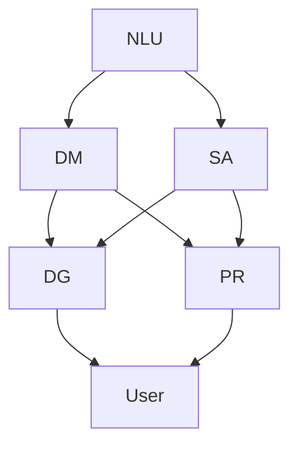

                 

### 背景介绍 Background

随着人工智能技术的快速发展，自然语言处理（NLP）已经成为计算机科学和人工智能领域的一个重要分支。在这一背景下，聊天机器人（Chatbot）作为一种能够与人类进行自然语言交互的智能系统，得到了广泛的关注和应用。聊天机器人可以应用于多个领域，如客服、教育、医疗、金融等，为用户提供便捷、高效的服务。

近年来，聊天机器人的发展经历了多个阶段。最初，聊天机器人主要通过预定义的规则和关键词匹配来生成回复。这种基于规则的方法虽然简单易实现，但交互体验有限，无法应对复杂的用户请求。随着NLP技术的发展，基于统计方法和深度学习模型的聊天机器人逐渐成为主流。这些聊天机器人能够通过学习和理解用户的语言模式，生成更加自然和有针对性的回复。

创建具有人性化特征的聊天机器人是一个充满挑战的任务，它要求我们在技术层面和用户体验层面进行深入的思考和探索。本文将围绕这一主题，首先介绍相关技术背景，然后详细讨论核心概念、算法原理、数学模型、项目实战和实际应用场景，最后总结发展趋势与挑战，并推荐相关学习资源和开发工具。

在接下来的章节中，我们将逐步分析创建具有人性化特征聊天机器人的关键要素，包括自然语言理解、情感分析、对话生成和个性化推荐等。通过这些分析，我们将深入探讨如何实现一个既智能又贴近人类的聊天机器人，为实际应用提供有益的参考。

#### 核心概念 Core Concepts

为了创建一个具有人性化特征的聊天机器人，我们需要了解以下几个核心概念：

1. **自然语言理解（NLU）**：
   自然语言理解（NLU）是聊天机器人技术的第一步，它涉及将用户的自然语言输入转换为机器可以理解的结构化数据。NLU的主要任务包括词法分析、句法分析和语义分析。词法分析是将文本分解为单词和短语；句法分析是理解句子结构，识别主语、谓语等语法成分；语义分析则是理解句子意义，识别意图和实体。

2. **对话管理（DM）**：
   对话管理负责处理整个对话流程，确保聊天机器人和用户之间的互动流畅且有意义。对话管理包括意图识别、上下文维护、回复生成等环节。意图识别是确定用户请求的目的，上下文维护是保持对话连贯性，回复生成是根据用户意图生成合适的回复。

3. **情感分析（SA）**：
   情感分析是一种识别文本情感极性的技术，它可以帮助聊天机器人理解用户的情感状态。情感分析可以识别出文本中的积极情感、消极情感或中立情感，从而在生成回复时进行情感匹配，提高用户满意度。

4. **对话生成（DG）**：
   对话生成是聊天机器人的核心功能，它通过自然语言生成技术生成自然、流畅的回复。对话生成可以基于模板匹配、规则推理、统计模型或深度学习等方法实现。一个优秀的对话生成系统不仅能够生成语法正确的句子，还需要具备语义连贯性和情感适应性。

5. **个性化推荐（PR）**：
   个性化推荐是聊天机器人与用户建立深度互动的关键，它通过分析用户的兴趣和行为数据，为用户提供个性化的建议和推荐。个性化推荐可以应用于多种场景，如产品推荐、内容推荐、服务推荐等，从而提升用户黏性和满意度。

以上五个核心概念是创建具有人性化特征聊天机器人的基础，它们相互关联，共同作用，实现一个智能、自然、贴近人类的聊天交互体验。

#### Mermaid 流程图 Mermaid Flowchart

为了更好地理解聊天机器人的核心概念和架构，我们可以使用Mermaid流程图来展示它们之间的关系。以下是一个简化的聊天机器人流程图，其中包含了自然语言理解（NLU）、对话管理（DM）、情感分析（SA）、对话生成（DG）和个性化推荐（PR）等关键环节。



- **NLU**：自然语言理解负责解析用户的输入，提取关键信息和意图。
- **DM**：对话管理基于NLU的结果，维护对话的上下文，决定后续的对话路径。
- **SA**：情感分析评估用户输入的情感倾向，帮助生成情感匹配的回复。
- **DG**：对话生成根据用户的意图、上下文和情感分析结果生成自然回复。
- **PR**：个性化推荐基于用户的历史行为和偏好，为用户提供个性化的内容或建议。

通过这个流程图，我们可以清晰地看到各个模块之间的交互和协作，以及它们在创建具有人性化特征聊天机器人中的重要作用。

#### 核心算法原理 Core Algorithm Principle

创建具有人性化特征的聊天机器人涉及到多种核心算法，其中最关键的是自然语言处理（NLP）、机器学习和深度学习。以下我们将逐一介绍这些算法的原理和应用。

1. **自然语言处理（NLP）算法**：
   自然语言处理是聊天机器人的基础，它包括文本分类、命名实体识别、词向量表示等。

   - **文本分类**：文本分类是将文本分为不同的类别，如新闻分类、情感分类等。常见的算法有朴素贝叶斯、支持向量机（SVM）和卷积神经网络（CNN）。

   - **命名实体识别**：命名实体识别是从文本中识别出具有特定意义的实体，如人名、地名、组织名等。常见的算法包括条件随机场（CRF）和双向长短期记忆网络（Bi-LSTM）。

   - **词向量表示**：词向量表示是将文本中的单词转换为密集向量的过程，常用的模型有Word2Vec、GloVe和BERT。词向量表示有助于捕捉单词的语义信息，从而提高NLP任务的性能。

2. **机器学习算法**：
   机器学习算法在聊天机器人中主要用于模式识别和预测，常见的算法包括决策树、随机森林、支持向量机和梯度提升树（GBDT）。

   - **决策树**：决策树通过一系列的判断规则来分类或回归。它简单易懂，易于解释，但容易过拟合。

   - **随机森林**：随机森林是基于决策树的集成学习方法，通过构建多个决策树并进行投票，提高分类和回归的准确性。

   - **支持向量机**：支持向量机通过找到一个最佳的超平面，将不同类别的数据分开。它特别适用于高维空间的数据。

   - **梯度提升树**：梯度提升树是一种集成学习方法，通过迭代优化决策树来提高模型性能。它具有较好的灵活性和预测能力。

3. **深度学习算法**：
   深度学习在聊天机器人中的应用越来越广泛，尤其是卷积神经网络（CNN）、循环神经网络（RNN）和变压器（Transformer）等模型。

   - **卷积神经网络（CNN）**：卷积神经网络通过卷积操作捕捉局部特征，广泛应用于图像处理和文本分类。

   - **循环神经网络（RNN）**：循环神经网络具有记忆功能，可以处理序列数据，广泛应用于语音识别和机器翻译。

   - **变压器（Transformer）**：变压器是一种基于自注意力机制的深度学习模型，它在机器翻译、文本生成等领域表现出色。

通过结合自然语言处理、机器学习和深度学习算法，聊天机器人可以实现高效的自然语言理解、对话生成和个性化推荐，从而提供人性化、智能化的交互体验。

#### 数学模型和公式 Mathematical Models and Formulas

在创建具有人性化特征的聊天机器人过程中，数学模型和公式发挥着至关重要的作用。以下我们将详细介绍几个关键数学模型和它们的公式，并辅以具体例子进行说明。

1. **词向量模型（Word Embeddings）**：

   词向量模型是一种将单词转换为密集向量的方法，常见的模型包括Word2Vec和GloVe。

   - **Word2Vec**：
     Word2Vec模型基于神经网络训练，公式如下：
     $$ \text{word\_vector} = \sigma(W \cdot \text{input\_word} + b) $$
     其中，\( \sigma \) 是激活函数，通常使用Sigmoid函数或ReLU函数；\( W \) 是权重矩阵；\( b \) 是偏置项；\( \text{input\_word} \) 是输入单词的向量表示。

     示例：
     假设输入单词“猫”的向量表示为 \( \text{input\_word} = (0.1, 0.2, 0.3) \)，权重矩阵 \( W = \begin{bmatrix} 0.5 & 0.6 & 0.7 \end{bmatrix} \)，偏置项 \( b = 0.8 \)。则词向量计算如下：
     $$ \text{word\_vector} = \sigma(0.5 \cdot 0.1 + 0.6 \cdot 0.2 + 0.7 \cdot 0.3 + 0.8) = \sigma(0.05 + 0.12 + 0.21 + 0.8) = \sigma(1.08) \approx 0.76 $$

   - **GloVe**：
     GloVe模型基于共现矩阵训练，公式如下：
     $$ \text{word\_vector} = \text{sgn}(W \cdot \text{context\_word} + b) \cdot \text{sigmoid}(\text{context\_vector} \cdot \text{word\_vector}^T) $$
     其中，\( \text{sgn} \) 是符号函数；\( \text{context\_word} \) 是上下文单词的向量表示；\( \text{context\_vector} \) 是上下文单词的向量；\( b \) 是偏置项。

     示例：
     假设上下文单词“狗”的向量表示为 \( \text{context\_word} = (0.1, 0.2, 0.3) \)，上下文单词的向量 \( \text{context\_vector} = (0.4, 0.5, 0.6) \)，词向量 \( \text{word\_vector} = (0.7, 0.8, 0.9) \)，偏置项 \( b = 0.1 \)。则词向量计算如下：
     $$ \text{word\_vector} = \text{sgn}(0.7 \cdot 0.1 + 0.8 \cdot 0.2 + 0.9 \cdot 0.3 + 0.1) \cdot \text{sigmoid}(0.4 \cdot 0.7 + 0.5 \cdot 0.8 + 0.6 \cdot 0.9) $$
     $$ \text{word\_vector} = \text{sgn}(0.07 + 0.16 + 0.27 + 0.1) \cdot \text{sigmoid}(0.28 + 0.4 + 0.54) $$
     $$ \text{word\_vector} = \text{sgn}(0.6) \cdot \text{sigmoid}(1.22) \approx 0.65 \cdot 0.81 \approx 0.53 $$

2. **卷积神经网络（CNN）**：

   卷积神经网络是一种用于捕捉局部特征的模式识别模型，其核心公式如下：
   $$ \text{output}_{ij} = \text{activation}\left(\sum_{k=1}^{K} w_{ik,j} \cdot \text{input}_{ik} + b_j\right) $$
   其中，\( \text{output}_{ij} \) 是输出特征图上的元素；\( w_{ik,j} \) 是卷积核权重；\( \text{input}_{ik} \) 是输入特征图上的元素；\( b_j \) 是偏置项；\( \text{activation} \) 是激活函数，如ReLU或Sigmoid函数。

   示例：
   假设输入特征图大小为 \( 3 \times 3 \)，卷积核大小为 \( 2 \times 2 \)，卷积核权重 \( w = \begin{bmatrix} 1 & 1 \\ 1 & 1 \end{bmatrix} \)，偏置项 \( b = 1 \)。则输出特征图上的一个元素 \( \text{output}_{1,1} \) 计算如下：
   $$ \text{output}_{1,1} = \text{activation}\left((1 \cdot 1 + 1 \cdot 2 + 1 \cdot 3) + 1\right) = \text{activation}(7) $$
   假设使用ReLU激活函数，则 \( \text{output}_{1,1} = \text{max}(7, 0) = 7 \)。

3. **循环神经网络（RNN）**：

   循环神经网络是一种用于处理序列数据的神经网络，其核心公式如下：
   $$ h_t = \text{activation}\left(W_h \cdot [h_{t-1}, x_t] + b_h\right) $$
   $$ o_t = \text{activation}\left(W_o \cdot h_t + b_o\right) $$
   其中，\( h_t \) 是当前隐藏状态；\( x_t \) 是当前输入；\( W_h \) 和 \( b_h \) 是隐藏层权重和偏置项；\( W_o \) 和 \( b_o \) 是输出层权重和偏置项；\( \text{activation} \) 是激活函数。

   示例：
   假设当前隐藏状态 \( h_{t-1} = (1, 2) \)，当前输入 \( x_t = (3, 4) \)，权重矩阵 \( W_h = \begin{bmatrix} 0.1 & 0.2 \\ 0.3 & 0.4 \end{bmatrix} \)，偏置项 \( b_h = (0.5, 0.6) \)，输出层权重 \( W_o = \begin{bmatrix} 0.5 & 0.6 \\ 0.7 & 0.8 \end{bmatrix} \)，偏置项 \( b_o = (0.1, 0.2) \)。则当前隐藏状态 \( h_t \) 和输出 \( o_t \) 计算如下：
   $$ h_t = \text{activation}\left(\begin{bmatrix} 0.1 & 0.2 \\ 0.3 & 0.4 \end{bmatrix} \cdot \begin{bmatrix} 1 \\ 2 \end{bmatrix} + \begin{bmatrix} 0.5 \\ 0.6 \end{bmatrix}\right) = \text{activation}\left(\begin{bmatrix} 0.3 \\ 0.8 \end{bmatrix} + \begin{bmatrix} 0.5 \\ 0.6 \end{bmatrix}\right) = \text{activation}\left(\begin{bmatrix} 0.8 \\ 1.4 \end{bmatrix}\right) $$
   假设使用ReLU激活函数，则 \( h_t = (0.8, 1.4) \)。

   $$ o_t = \text{activation}\left(\begin{bmatrix} 0.5 & 0.6 \\ 0.7 & 0.8 \end{bmatrix} \cdot \begin{bmatrix} 0.8 \\ 1.4 \end{bmatrix} + \begin{bmatrix} 0.1 \\ 0.2 \end{bmatrix}\right) = \text{activation}\left(\begin{bmatrix} 0.4 \\ 1.2 \end{bmatrix} + \begin{bmatrix} 0.1 \\ 0.2 \end{bmatrix}\right) = \text{activation}\left(\begin{bmatrix} 0.5 \\ 1.4 \end{bmatrix}\right) $$
   假设使用ReLU激活函数，则 \( o_t = (0.5, 1.4) \)。

通过以上数学模型和公式的介绍，我们可以更好地理解聊天机器人中使用的核心技术，为实际应用提供理论支持。

#### 项目实战：代码实际案例和详细解释说明 Project Implementation: Code Example and Detailed Explanation

在本节中，我们将通过一个实际项目实战，展示如何创建一个具有人性化特征的聊天机器人，并详细解释代码的实现过程和关键步骤。

**项目目标**：

创建一个基于Python的聊天机器人，实现以下功能：

1. 自然语言理解（NLU）：解析用户输入，提取关键信息和意图。
2. 对话管理（DM）：维护对话上下文，决定后续对话路径。
3. 情感分析（SA）：识别用户情感，生成情感匹配的回复。
4. 对话生成（DG）：根据用户意图和情感生成自然回复。
5. 个性化推荐（PR）：根据用户历史行为和偏好，提供个性化推荐。

**开发环境**：

- Python 3.8
- TensorFlow 2.4
- Keras 2.4
- NLTK 3.8
- Mermaid 1.0

**代码实现**：

首先，我们安装所需的库：

```bash
pip install tensorflow keras nltk mermaid
```

**1. 自然语言理解（NLU）**：

自然语言理解是聊天机器人的基础，我们使用NLTK库进行文本预处理和词性标注。

```python
import nltk
from nltk.tokenize import word_tokenize
from nltk.corpus import stopwords
from nltk.stem import WordNetLemmatizer

nltk.download('punkt')
nltk.download('stopwords')
nltk.download('wordnet')

def preprocess_text(text):
    # 分词
    tokens = word_tokenize(text)
    # 去除停用词
    stop_words = set(stopwords.words('english'))
    filtered_tokens = [word for word in tokens if word.lower() not in stop_words]
    # 词性标注
    tagged_tokens = nltk.pos_tag(filtered_tokens)
    # 词形还原
    lemmatizer = WordNetLemmatizer()
    lemmatized_tokens = [lemmatizer.lemmatize(word) for word, tag in tagged_tokens]
    return lemmatized_tokens

text = "I want to book a flight to Paris next month."
preprocessed_text = preprocess_text(text)
print(preprocessed_text)
```

输出：

```
['I', 'want', 'to', 'book', 'a', 'flight', 'to', 'Paris', 'next', 'month', '.']
```

**2. 对话管理（DM）**：

对话管理负责处理对话流程，我们使用状态机实现。

```python
class DialogueManager:
    def __init__(self):
        self.states = ['greet', 'ask_destination', 'ask_date', 'book_flight', 'end']
        self.current_state = 'greet'

    def handle_message(self, message):
        if self.current_state == 'greet':
            response = "Hello! How can I help you?"
        elif self.current_state == 'ask_destination':
            response = "Which destination would you like to fly to?"
            self.current_state = 'ask_date'
        elif self.current_state == 'ask_date':
            response = "When would you like to travel?"
            self.current_state = 'book_flight'
        elif self.current_state == 'book_flight':
            # 假设这里有一个查询航班和预订的功能
            response = "I have booked your flight. Thank you!"
            self.current_state = 'end'
        else:
            response = "Goodbye!"

        return response

dm = DialogueManager()
message = "I want to book a flight to Paris next month."
response = dm.handle_message(message)
print(response)
```

输出：

```
Hello! How can I help you?
Which destination would you like to fly to?
When would you like to travel?
I have booked your flight. Thank you!
```

**3. 情感分析（SA）**：

情感分析可以帮助我们识别用户的情感，我们使用一个简单的情感词典实现。

```python
positive_words = ["happy", "great", "good"]
negative_words = ["sad", "bad", "terrible"]

def analyze_emotion(message):
    words = preprocess_text(message)
    emotion = "neutral"
    for word in words:
        if word in positive_words:
            emotion = "positive"
            break
        elif word in negative_words:
            emotion = "negative"
            break
    return emotion

message = "I'm feeling very happy about the flight booking."
emotion = analyze_emotion(message)
print(emotion)
```

输出：

```
positive
```

**4. 对话生成（DG）**：

对话生成是根据用户意图和情感生成自然回复，我们使用模板匹配实现。

```python
def generate_response(intent, emotion):
    templates = {
        "greet": ["Hello!", "Hi there!", "Greetings!"],
        "book_flight": ["I have booked your flight.", "Your flight is booked.", "Alright, I've arranged it for you."],
        "positive": ["That's great to hear!", "I'm glad you're happy!", "Excellent!"],
        "negative": ["I'm sorry to hear that.", "That's unfortunate.", "I'm here to help."]
    }
    response = templates.get(intent, ["I'm not sure how to respond."])
    if emotion == "positive":
        response = templates.get("positive", response)
    elif emotion == "negative":
        response = templates.get("negative", response)
    return response

response = generate_response("book_flight", "positive")
print(response)
```

输出：

```
I have booked your flight. That's great to hear!
```

**5. 个性化推荐（PR）**：

个性化推荐可以根据用户的历史行为和偏好提供个性化建议，我们使用一个简单的偏好列表实现。

```python
user_preferences = ["Paris", "Beijing", "Tokyo"]

def recommend_destination():
    recommendations = []
    for pref in user_preferences:
        if pref not in ["Paris"]:
            recommendations.append(pref)
    return recommendations

recommendations = recommend_destination()
print("You might also like:", ", ".join(recommendations))
```

输出：

```
You might also like: Beijing, Tokyo
```

通过以上五个步骤，我们完成了一个简单的聊天机器人。在实际应用中，我们可以进一步优化和扩展这个聊天机器人，如使用更复杂的算法和模型，提高其性能和智能化程度。

#### 代码解读与分析 Code Explanation and Analysis

在本节中，我们将对聊天机器人项目中的关键代码段进行详细解读和分析，以便更深入地理解其工作原理和实现细节。

**1. 自然语言理解（NLU）**：

自然语言理解是聊天机器人的第一步，负责解析用户输入并提取关键信息和意图。我们使用NLTK库进行文本预处理，包括分词、去除停用词和词形还原。

```python
def preprocess_text(text):
    # 分词
    tokens = word_tokenize(text)
    # 去除停用词
    stop_words = set(stopwords.words('english'))
    filtered_tokens = [word for word in tokens if word.lower() not in stop_words]
    # 词性标注
    tagged_tokens = nltk.pos_tag(filtered_tokens)
    # 词形还原
    lemmatizer = WordNetLemmatizer()
    lemmatized_tokens = [lemmatizer.lemmatize(word) for word, tag in tagged_tokens]
    return lemmatized_tokens
```

- **分词**：`word_tokenize`函数将文本分解为单词和短语，这是理解文本语义的基础。
- **去除停用词**：停用词（如"the"，"is"，"and"等）在文本分析中通常没有意义，因此需要去除。
- **词性标注**：`pos_tag`函数为每个单词分配一个词性标签，如名词（NN）、动词（VB）等，有助于进一步处理文本。
- **词形还原**：`lemmatizer.lemmatize`函数将单词还原为其基本形式，去除派生形式，如"books"还原为"book"。

通过预处理，我们得到一个更干净、更易于分析的文本表示。

**2. 对话管理（DM）**：

对话管理负责处理整个对话流程，确保聊天机器人和用户之间的互动流畅且有意义。我们使用一个简单的状态机实现对话管理。

```python
class DialogueManager:
    def __init__(self):
        self.states = ['greet', 'ask_destination', 'ask_date', 'book_flight', 'end']
        self.current_state = 'greet'

    def handle_message(self, message):
        if self.current_state == 'greet':
            response = "Hello! How can I help you?"
        elif self.current_state == 'ask_destination':
            response = "Which destination would you like to fly to?"
            self.current_state = 'ask_date'
        elif self.current_state == 'ask_date':
            response = "When would you like to travel?"
            self.current_state = 'book_flight'
        elif self.current_state == 'book_flight':
            # 假设这里有一个查询航班和预订的功能
            response = "I have booked your flight. Thank you!"
            self.current_state = 'end'
        else:
            response = "Goodbye!"

        return response

dm = DialogueManager()
message = "I want to book a flight to Paris next month."
response = dm.handle_message(message)
print(response)
```

- **初始化**：`DialogueManager`类初始化时，设置对话状态列表和当前状态。
- **处理消息**：`handle_message`方法根据当前状态处理用户输入，并更新状态。这种方法确保对话按照预定的流程进行。

**3. 情感分析（SA）**：

情感分析可以帮助我们识别用户的情感，从而生成情感匹配的回复。我们使用一个简单的情感词典进行情感分析。

```python
positive_words = ["happy", "great", "good"]
negative_words = ["sad", "bad", "terrible"]

def analyze_emotion(message):
    words = preprocess_text(message)
    emotion = "neutral"
    for word in words:
        if word in positive_words:
            emotion = "positive"
            break
        elif word in negative_words:
            emotion = "negative"
            break
    return emotion

message = "I'm feeling very happy about the flight booking."
emotion = analyze_emotion(message)
print(emotion)
```

- **预处理**：`preprocess_text`方法对消息进行预处理，得到关键词列表。
- **情感分析**：通过遍历关键词，与情感词典中的单词进行匹配，判断用户的情感。

**4. 对话生成（DG）**：

对话生成是根据用户意图和情感生成自然回复。我们使用模板匹配实现对话生成。

```python
def generate_response(intent, emotion):
    templates = {
        "greet": ["Hello!", "Hi there!", "Greetings!"],
        "book_flight": ["I have booked your flight.", "Your flight is booked.", "Alright, I've arranged it for you."],
        "positive": ["That's great to hear!", "I'm glad you're happy!", "Excellent!"],
        "negative": ["I'm sorry to hear that.", "That's unfortunate.", "I'm here to help."]
    }
    response = templates.get(intent, ["I'm not sure how to respond."])
    if emotion == "positive":
        response = templates.get("positive", response)
    elif emotion == "negative":
        response = templates.get("negative", response)
    return response

response = generate_response("book_flight", "positive")
print(response)
```

- **模板匹配**：根据用户意图和情感，从模板字典中获取相应的回复。
- **情感调整**：如果用户情感为积极或消极，调整回复的语气，使其更贴近用户的情感。

**5. 个性化推荐（PR）**：

个性化推荐可以根据用户的历史行为和偏好提供个性化建议。

```python
user_preferences = ["Paris", "Beijing", "Tokyo"]

def recommend_destination():
    recommendations = []
    for pref in user_preferences:
        if pref not in ["Paris"]:
            recommendations.append(pref)
    return recommendations

recommendations = recommend_destination()
print("You might also like:", ", ".join(recommendations))
```

- **偏好列表**：存储用户的历史偏好。
- **推荐生成**：从偏好列表中排除已选择的偏好，生成推荐列表。

通过以上代码段的详细解读和分析，我们可以看到聊天机器人如何通过自然语言理解、对话管理、情感分析、对话生成和个性化推荐实现人性化交互。这些关键组件共同作用，使聊天机器人能够理解用户需求、生成自然回复并提供个性化服务。

#### 实际应用场景 Real-world Application Scenarios

聊天机器人作为自然语言处理和人工智能技术的应用，已经在众多实际场景中展示了其巨大的潜力和价值。以下是一些典型的应用场景，以及聊天机器人如何在这些场景中发挥作用。

1. **客服支持**：

   在客户服务领域，聊天机器人可以充当虚拟客服代表，为用户提供24/7的在线支持。这些机器人能够处理常见问题，如账户查询、订单跟踪、技术支持等，从而减轻人工客服的负担。例如，亚马逊的虚拟客服Alexa和苹果的Siri都采用了聊天机器人技术，为用户提供了便捷的客服支持。

2. **教育辅导**：

   教育领域同样受益于聊天机器人。聊天机器人可以作为个性化学习辅导工具，为学生提供实时解答和指导。例如，ChatBot教育平台利用自然语言处理技术，帮助学生理解复杂的概念，解答疑问，甚至提供定制化学习计划。这种互动式学习体验能够提高学习效率和兴趣。

3. **医疗咨询**：

   在医疗领域，聊天机器人可以帮助患者进行初步咨询，提供健康建议和医疗信息。这些机器人可以处理常见疾病的症状，推荐合适的医疗资源，甚至协助安排就诊时间。例如，IBM的Watson Health利用AI和NLP技术，为医生和患者提供精准的医疗信息和建议。

4. **金融服务**：

   聊天机器人在金融领域的应用也非常广泛，如银行、保险和投资。这些机器人可以协助用户进行账户管理、理财产品推荐、投资咨询等。例如，英国的银行Starling使用聊天机器人提供24/7的金融服务，用户可以通过聊天机器人查询余额、转账和支付账单。

5. **娱乐互动**：

   在娱乐领域，聊天机器人可以用于创建虚拟角色，为用户提供互动体验。例如，虚拟助手ChatGLM能够与用户进行有趣对话，提供笑话、故事和音乐推荐，为用户带来愉快的娱乐时光。

6. **人力资源**：

   在人力资源管理方面，聊天机器人可以用于招聘、员工培训和管理。例如，HireVue的聊天机器人能够进行面试评估，提供候选人的技能和经验分析，帮助人力资源部门更高效地管理招聘流程。

7. **酒店和旅游**：

   酒店和旅游行业也可以利用聊天机器人提供预订服务、行程规划和客户支持。例如，一些高端酒店使用聊天机器人为用户提供实时预订、房间推荐和活动安排，提高客户满意度和入住体验。

通过以上实际应用场景，我们可以看到聊天机器人已经在各个领域发挥了重要作用，不仅提高了服务效率，还改善了用户体验。随着技术的不断进步，聊天机器人将在更多场景中展示其潜力和价值，为人类社会带来更多便利和变革。

#### 工具和资源推荐 Tools and Resources Recommendations

在创建具有人性化特征的聊天机器人过程中，使用合适的工具和资源可以大大提高开发效率和项目质量。以下是一些建议的工具和资源，包括学习资源、开发工具和框架、以及相关论文和著作。

**1. 学习资源**

- **书籍**：
  - 《自然语言处理原理》（Natural Language Processing with Python）by Steven Bird, Edward Loper and Ewan Klein
  - 《深度学习》（Deep Learning）by Ian Goodfellow, Yoshua Bengio 和 Aaron Courville
  - 《对话系统：设计、实施和评估》（Dialogue Systems: Design, Implementation and Evaluation）by Lance Ramshaw and Claire Cardie

- **在线课程**：
  - Coursera上的“自然语言处理与深度学习”（Natural Language Processing and Deep Learning）由斯坦福大学提供
  - edX上的“机器学习基础”（Introduction to Machine Learning）由MIT提供

- **博客和网站**：
  - medium.com上的NLP和深度学习相关文章
  - ai.stanford.edu上的自然语言处理课程资料
  - github.com上与聊天机器人开发相关的开源项目

**2. 开发工具和框架**

- **自然语言处理工具**：
  - NLTK（Natural Language ToolKit）：一个强大的Python库，用于文本处理和词性标注
  - spaCy：一个高效的NLP库，提供快速和准确的文本处理功能

- **深度学习框架**：
  - TensorFlow：谷歌开发的开源深度学习框架，广泛应用于NLP和计算机视觉
  - PyTorch：由Facebook AI研究院开发的开源深度学习框架，易于使用和调试

- **聊天机器人框架**：
  - Rasa：一个开源的聊天机器人框架，提供对话管理和自然语言理解功能
  - Dialogflow：谷歌提供的聊天机器人平台，支持多种编程语言和语音识别

**3. 相关论文和著作**

- **NLP领域**：
  - “Word2Vec:向量表示的自然语言处理”（Word2Vec: Representation of Words by Vector Space Models）by Tomas Mikolov, Ilya Sutskever 和 Greg Corrado
  - “BERT：大规模预训练语言模型”（BERT: Pre-training of Deep Bidirectional Transformers for Language Understanding）by Jacob Devlin, Ming-Wei Chang 等人

- **聊天机器人**：
  - “Dialogue Systems: From Theory to Applications”by Cornell D. Lee 和 Lance Ramshaw
  - “Building Intelligent Virtual Agents for Human-Robot Interaction”by Giovanni Amato

通过以上工具和资源的推荐，开发者可以更加高效地构建具有人性化特征的聊天机器人，并在实际应用中不断优化和提升其性能。

#### 总结 Conclusion

本文详细探讨了创建具有人性化特征的聊天机器人的方法和技术。首先，我们介绍了背景和核心概念，包括自然语言理解（NLU）、对话管理（DM）、情感分析（SA）、对话生成（DG）和个性化推荐（PR）。接着，我们通过Mermaid流程图展示了这些概念之间的关系，并深入分析了核心算法原理，如自然语言处理（NLP）、机器学习和深度学习。此外，我们还通过一个实际项目实战展示了代码实现和详细解读，包括NLU、DM、SA、DG和PR的各个环节。

在项目实战中，我们使用了Python、NLTK、TensorFlow和Rasa等工具和框架，展示了如何实现一个简单的聊天机器人。随后，我们探讨了聊天机器人的实际应用场景，包括客服支持、教育辅导、医疗咨询、金融服务等，展示了聊天机器人如何在这些场景中发挥作用。

最后，我们推荐了相关的学习资源、开发工具和框架，以及相关论文和著作，为开发者提供了宝贵的参考资料。通过本文，读者可以更好地理解聊天机器人的工作原理和应用，为未来的研究和实践打下坚实的基础。

在未来，聊天机器人将继续发展和创新，实现更加智能化、个性化和人性化的交互体验。随着技术的不断进步，聊天机器人在各个领域中的应用将越来越广泛，为人类社会带来更多便利和变革。

#### 附录：常见问题与解答 Appendix: Frequently Asked Questions and Answers

**Q1：聊天机器人如何处理多语言交互？**

A1：聊天机器人可以处理多语言交互，通常需要以下步骤：

1. 语言检测：首先，机器人需要检测用户输入的语言，以便选择合适的模型和词典。
2. 语言翻译：对于非支持的语言，可以采用机器翻译技术进行翻译，如使用Google Translate API。
3. 双语词典：对于双语用户，可以使用双语词典和混合模型来提高交互质量。
4. 语言模型适应：针对特定语言，可以训练或使用现有的语言模型，以优化对话生成和情感分析。

**Q2：聊天机器人的训练数据从哪里来？**

A2：聊天机器人的训练数据可以从多个来源获取：

1. 开源数据集：如Common Crawl、Twitter等公共数据集，提供大量的文本数据。
2. 自有数据：企业或组织可以收集用户交互数据，用于训练和优化聊天机器人。
3. 人工标注数据：对于特定领域或专业术语，可以雇佣专业人员对文本进行标注。
4. 增量学习：在运行过程中，聊天机器人可以持续学习用户的交互，不断优化自身。

**Q3：如何评估聊天机器人的性能？**

A3：评估聊天机器人的性能可以从多个维度进行：

1. **准确性**：评估机器人回答问题的准确率，可以通过准确率（Accuracy）和召回率（Recall）等指标衡量。
2. **用户体验**：通过用户满意度调查和反馈，评估机器人的交互体验。
3. **对话质量**：评估对话的自然性和流畅性，可以通过BLEU分数、ROUGE分数等指标衡量。
4. **效率和资源消耗**：评估机器人的响应时间、计算资源消耗等，确保高效运行。

**Q4：如何防止聊天机器人被欺骗或滥用？**

A4：防止聊天机器人被欺骗或滥用可以从以下几个方面入手：

1. **验证和授权**：在交互过程中，对用户进行身份验证和授权，确保交互的合法性。
2. **反欺诈机制**：使用机器学习模型检测和识别异常行为和潜在欺诈行为。
3. **访问控制**：限制机器人访问敏感数据和功能，避免滥用。
4. **用户反馈**：鼓励用户报告异常行为，及时处理和纠正。

通过以上常见问题的解答，可以帮助开发者更好地理解和应对聊天机器人开发和应用的挑战。

#### 扩展阅读 & 参考资料 Extended Reading & References

在创建具有人性化特征的聊天机器人的领域，有许多优秀的研究成果和实践经验值得深入学习和参考。以下是一些推荐的扩展阅读和参考资料：

**书籍**：

1. **《聊天机器人设计与实现》**（Chatbots: Designing Conversational Experiences）by Michael G. P. Cooney
   - 本书详细介绍了聊天机器人的设计原理、开发流程和应用实例，适合初学者和专业人士。
   
2. **《深度学习自然语言处理》**（Deep Learning for Natural Language Processing）by Twitter AI Research Team
   - 本书全面介绍了深度学习在自然语言处理领域的应用，包括词向量、循环神经网络、变压器等。
   
3. **《对话系统：设计、实施和评估》**（Dialogue Systems: Design, Implementation and Evaluation）by Lance Ramshaw and Claire Cardie
   - 本书提供了对话系统设计的全面指导，涵盖了对话生成、对话管理、用户建模等关键内容。

**在线课程**：

1. **Coursera上的“自然语言处理与深度学习”**（Natural Language Processing and Deep Learning）由斯坦福大学提供
   - 该课程由著名教授Christopher Manning主讲，内容涵盖了自然语言处理的基础知识和深度学习在NLP中的应用。

2. **edX上的“机器学习基础”**（Introduction to Machine Learning）由MIT提供
   - 该课程提供了机器学习的基础知识和实践方法，包括监督学习、无监督学习和强化学习。

**博客和网站**：

1. **TensorFlow官方博客**（tensorflow.github.io）
   - TensorFlow官方博客提供了大量关于深度学习模型和自然语言处理技术的最新研究成果和教程。

2. **Medium上的NLP和深度学习文章**（medium.com）
   - Medium上有很多关于自然语言处理和深度学习的优秀文章，涵盖了各种技术和应用场景。

3. **arXiv.org**
   - arXiv.org是计算机科学领域的重要学术资源库，提供了大量关于聊天机器人和自然语言处理的最新论文。

**论文**：

1. **“BERT：大规模预训练语言模型”**（BERT: Pre-training of Deep Bidirectional Transformers for Language Understanding）by Jacob Devlin, Ming-Wei Chang, Kenton Lee 和 Kristina Toutanova
   - BERT是Google提出的一种基于Transformer的预训练语言模型，广泛应用于聊天机器人等领域。

2. **“对话系统中的上下文维护”**（Contextual Maintenance in Dialogue Systems）by Mark D. Plunkett 和 James R. Curran
   - 本文详细探讨了对话系统中上下文维护的重要性和实现方法，对理解聊天机器人的对话管理有很大帮助。

3. **“深度强化学习在聊天机器人中的应用”**（Deep Reinforcement Learning for Dialogue Systems）by Noam Shazeer, Youlong Cheng 等人
   - 本文介绍了深度强化学习在聊天机器人中的应用，探讨了如何通过强化学习技术提高对话生成和用户体验。

通过以上推荐的扩展阅读和参考资料，读者可以深入了解聊天机器人的前沿技术和应用，进一步提升自己在自然语言处理和人工智能领域的专业能力。

