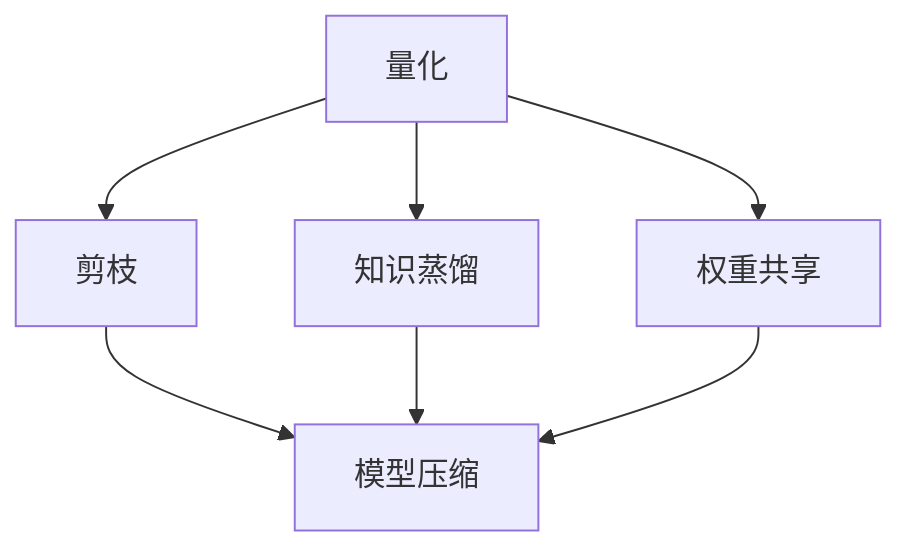

                 

### 文章标题

### Chapter 13: Quantization and Model Compression

In the world of artificial intelligence and machine learning, model size and efficiency are paramount. As neural networks grow in complexity and size, they consume more memory, processing power, and energy, making deployment on resource-constrained devices challenging. This is where quantization and model compression techniques come into play. This chapter delves into the fundamentals of quantization, model compression methods, and their practical applications, providing a comprehensive guide for practitioners and researchers alike.

Quantization and model compression are essential for achieving efficient AI models that can be deployed in real-world scenarios. They enable the optimization of model size and computational complexity, thereby improving performance and reducing resource consumption. This chapter aims to shed light on the intricacies of these techniques, offering insights into how they can be effectively applied to modern AI systems. 

By the end of this chapter, readers will gain a thorough understanding of:

- The importance of quantization and model compression in AI.
- The core concepts and principles behind quantization and model compression.
- Common quantization methods and their trade-offs.
- Techniques for compressing neural network models.
- Practical examples and case studies illustrating the application of these techniques.
- Future trends and challenges in the field of quantization and model compression.

This chapter is structured as follows:

1. Background Introduction
2. Core Concepts and Connections
3. Core Algorithm Principles and Specific Operational Steps
4. Mathematical Models and Formulas: Detailed Explanation and Examples
5. Project Practice: Code Examples and Detailed Explanations
6. Practical Application Scenarios
7. Tools and Resources Recommendations
8. Summary: Future Development Trends and Challenges
9. Frequently Asked Questions and Answers
10. Extended Reading & Reference Materials

Let's embark on this journey to explore the fascinating world of quantization and model compression. <sop><|user|>### 1. 背景介绍（Background Introduction）

量化（Quantization）和模型压缩（Model Compression）是近年来在人工智能（AI）领域迅速发展的两个关键技术，它们在提高模型性能的同时，显著降低了模型的资源消耗。随着深度学习模型的复杂度不断攀升，传统的推理任务对计算资源和存储空间的需求也在持续增加。为了满足实际应用场景中的资源限制，尤其是移动设备、嵌入式系统和边缘计算等场景，量化与模型压缩技术变得至关重要。

### 1.1 量化技术的需求

量化技术主要针对的是神经网络中的权重和激活值。传统的神经网络模型使用浮点数进行计算，这虽然能够提供更高的精度，但也导致了较高的计算复杂度和内存消耗。随着硬件资源限制的日益突出，尤其是在移动设备和嵌入式系统中，量化技术应运而生。量化技术通过将浮点数权重和激活值转换为较低精度的定点数，从而在保证模型性能的前提下，大幅减少计算资源和存储空间的需求。

### 1.2 模型压缩技术的需求

模型压缩技术则旨在减少神经网络模型的大小，从而降低存储和传输成本。模型压缩可以通过多种方式实现，包括剪枝（Pruning）、知识蒸馏（Knowledge Distillation）、权重共享（Weight Sharing）等。随着深度学习模型在各个领域的广泛应用，如何在保持模型性能的同时减小其体积，成为了研究和应用中的一个重要课题。

### 1.3 应用场景

量化与模型压缩技术在多个领域具有广泛的应用：

1. **移动设备与嵌入式系统**：移动设备和嵌入式系统通常具有有限的计算资源和存储空间，量化与压缩技术能够显著提高这些设备的运行效率，满足实时性要求。
   
2. **边缘计算**：边缘计算场景中，数据处理和计算能力有限，量化与压缩技术可以使得模型在边缘设备上运行，减少对中心服务器的依赖。

3. **物联网（IoT）**：物联网设备通常具有资源受限的特点，量化与模型压缩技术能够提高这些设备的计算效率和电池寿命。

4. **自动驾驶**：自动驾驶系统需要在复杂的实时环境中做出快速决策，量化与压缩技术可以降低模型对计算资源的需求，提高决策的准确性和效率。

5. **医疗影像**：医疗影像处理通常需要处理大量的数据，量化与压缩技术能够减少计算资源和存储成本，提高诊断的效率和准确性。

随着人工智能技术的不断进步，量化与模型压缩技术在未来将继续发挥重要作用，推动人工智能在更多领域的应用和发展。在接下来的章节中，我们将深入探讨量化与模型压缩的核心概念、算法原理及其实际应用。 <sop><|user|>### 2. 核心概念与联系（Core Concepts and Connections）

在深入探讨量化与模型压缩技术之前，我们需要首先了解一些核心概念，以及它们之间的相互关系。以下是几个关键概念及其解释：

#### 2.1 量化（Quantization）

量化是将连续的浮点数转换为离散的整数值的过程。在神经网络中，量化主要用于对权重和激活值进行降低精度表示。量化可以减少模型的计算复杂度和存储需求，但可能引入一些量化误差。量化可以分为以下几种类型：

- **静态量化（Static Quantization）**：在训练期间和推理期间使用相同的量化参数。
- **动态量化（Dynamic Quantization）**：在推理时根据输入数据动态调整量化参数。

#### 2.2 模型压缩（Model Compression）

模型压缩是通过各种方法减少神经网络模型的大小，以便更有效地存储和传输。以下是一些常见的模型压缩技术：

- **剪枝（Pruning）**：通过删除神经网络中不重要的权重，来减少模型的大小。
- **知识蒸馏（Knowledge Distillation）**：将大模型（教师模型）的知识转移到小模型（学生模型）中，以减少模型大小并提高性能。
- **量化（Quantization）**：我们已经讨论过，量化可以降低模型中数值的精度，从而减少模型大小。
- **权重共享（Weight Sharing）**：通过在神经网络的不同部分共享权重来减少模型的大小。
- **训练时间压缩（Training Time Compression）**：使用更快的算法或更少的数据来训练模型，以减少训练时间。

#### 2.3 相关概念的关系

量化与模型压缩技术之间存在着紧密的联系：

- **量化是模型压缩的一部分**：量化技术通过减少模型中的数值精度来降低模型的大小，是模型压缩的一种重要方法。
- **模型压缩需要量化**：在许多模型压缩技术中，量化是不可或缺的一环，例如在剪枝和知识蒸馏中，量化可以进一步减小模型的大小。
- **模型压缩可以优化量化**：模型压缩技术可以通过优化量化参数来提高模型的性能，例如通过动态量化来适应不同的输入数据。

#### 2.4 Mermaid 流程图

以下是一个简化的Mermaid流程图，展示了量化与模型压缩技术之间的核心概念和联系：



在这个流程图中，量化是模型压缩的核心部分，它与剪枝、知识蒸馏和权重共享等技术紧密相关，共同构成了现代神经网络压缩技术的基础。通过理解这些概念及其关系，我们可以更好地应用这些技术来优化深度学习模型。在接下来的章节中，我们将深入探讨量化与模型压缩的算法原理和具体操作步骤。 <sop><|user|>### 3. 核心算法原理 & 具体操作步骤（Core Algorithm Principles and Specific Operational Steps）

#### 3.1 量化算法原理

量化算法的主要目标是将浮点数转换为较低精度的整数值，以便在保证模型性能的前提下减少计算资源和存储空间的消耗。量化过程可以分为以下几个步骤：

1. **量化范围确定**：首先需要确定输入浮点数的量化范围。通常，我们选择一个合适的量化区间，例如 [-128, 127]。

2. **量化间隔计算**：量化间隔是指量化区间内每个整数值之间的距离。量化间隔可以通过量化区间长度除以量化位数来确定。例如，如果我们使用8位量化，量化间隔为 1/(2^8 - 1)。

3. **量化操作**：对于每个浮点数，我们计算其在量化区间内的索引，然后将其转换为相应的整数值。量化操作可以通过以下公式表示：

   $$ quantized\_value = \lceil (x - x_{min}) / \Delta x \rceil $$

   其中，$x$ 是原始浮点数，$x_{min}$ 是量化区间的最小值，$\Delta x$ 是量化间隔。

4. **反量化操作**：反量化是将量化后的整数值恢复为原始浮点数的过程。反量化可以通过以下公式表示：

   $$ original\_value = quantized\_value \times \Delta x + x_{min} $$

#### 3.2 模型压缩算法原理

模型压缩的主要目标是通过减少模型的大小来提高其部署效率和存储传输效率。以下是一些常见的模型压缩算法：

1. **剪枝（Pruning）**：剪枝通过删除神经网络中不重要的权重来减少模型大小。剪枝算法通常包括以下步骤：

   - **选择重要性度量**：例如，可以使用L1范数或绝对值偏差来评估权重的重要性。
   - **设置剪枝阈值**：根据重要性度量，设置一个阈值来识别和删除不重要的权重。
   - **模型重建**：在删除权重后，对模型进行重构，以保持模型结构的完整性。

2. **知识蒸馏（Knowledge Distillation）**：知识蒸馏是一种通过将大模型（教师模型）的知识转移到小模型（学生模型）中的技术。知识蒸馏的步骤包括：

   - **训练教师模型**：首先训练一个大型的教师模型。
   - **生成软标签**：使用教师模型对数据集进行预测，并将预测结果作为软标签传递给学生模型。
   - **训练学生模型**：学生模型根据软标签进行训练，以学习教师模型的知识。

3. **量化（Quantization）**：量化是一种通过降低模型中数值的精度来减少模型大小的技术。量化算法的步骤包括：

   - **确定量化范围**：选择一个合适的量化范围。
   - **计算量化间隔**：根据量化位数计算量化间隔。
   - **量化操作**：对模型中的权重和激活值进行量化。
   - **反量化操作**：在推理时，对量化后的数值进行反量化。

#### 3.3 实际操作步骤

以下是一个简化的量化算法和剪枝算法的实际操作步骤：

##### 3.3.1 量化算法

1. **确定量化范围**：例如，选择 [-128, 127] 作为量化范围。

2. **计算量化间隔**：量化间隔为 1/(2^8 - 1) = 0.00390625。

3. **量化操作**：

   - 对每个权重 $w$，计算其在量化范围内的索引 $i$：
     $$ i = \lceil (w - (-128)) / 0.00390625 \rceil $$
   - 将权重 $w$ 转换为量化后的整数值 $q_w$：
     $$ q_w = i \times 0.00390625 - 128 $$

4. **反量化操作**：

   - 对每个量化后的整数值 $q_w$，计算其在量化范围内的原始浮点数值 $w$：
     $$ w = q_w \times 0.00390625 - 128 $$

##### 3.3.2 剪枝算法

1. **选择重要性度量**：例如，选择L1范数作为权重的重要性度量。

2. **设置剪枝阈值**：例如，设置阈值 $\theta$ = 0.01。

3. **识别和删除不重要的权重**：

   - 对每个权重 $w$，计算其L1范数 $||w||_1$：
     $$ ||w||_1 = \sum_{i=1}^{n} |w_i| $$
   - 如果 $||w||_1 < \theta$，则删除权重 $w$。

4. **模型重建**：

   - 在删除权重后，对模型进行重构，以保持模型结构的完整性。

通过上述步骤，我们可以实现量化与模型压缩算法的基本操作。在接下来的章节中，我们将进一步探讨数学模型和公式，以及这些技术在项目实践中的应用。 <sop><|user|>### 4. 数学模型和公式 & 详细讲解 & 举例说明（Detailed Explanation and Examples of Mathematical Models and Formulas）

在量化与模型压缩过程中，数学模型和公式起到了核心作用。以下将详细讲解这些模型和公式，并通过具体示例来说明它们的计算过程。

#### 4.1 量化模型的数学表示

量化过程可以通过以下数学模型来描述：

$$ quantized\_value = \lceil (x - x_{min}) / \Delta x \rceil $$

其中：
- $x$ 是原始浮点数。
- $x_{min}$ 是量化区间的最小值。
- $\Delta x$ 是量化间隔。

**示例**：

假设我们要将一个浮点数 $x = 10.5$ 量化到区间 [-10, 10]，使用 8 位量化（量化间隔为 $1/(2^8 - 1) = 0.00390625$）。

1. 计算 $x$ 的量化索引：
   $$ index = \lceil (10.5 - (-10)) / 0.00390625 \rceil = \lceil 401.25 \rceil = 402 $$
2. 计算量化值：
   $$ quantized\_value = 402 \times 0.00390625 - 10 = 1.5625 - 10 = -8.4375 $$

因此，原始浮点数 $10.5$ 被量化为 -8.4375。

#### 4.2 反量化模型的数学表示

反量化是将量化后的整数值恢复为原始浮点数的过程。反量化可以通过以下数学模型来描述：

$$ original\_value = quantized\_value \times \Delta x + x_{min} $$

其中：
- $quantized\_value$ 是量化后的整数值。
- $\Delta x$ 是量化间隔。
- $x_{min}$ 是量化区间的最小值。

**示例**：

假设我们有一个量化后的整数值 $-8.4375$，量化间隔为 $0.00390625$，量化区间为 [-10, 10]。

1. 计算原始浮点数：
   $$ original\_value = -8.4375 \times 0.00390625 - 10 = -0.333333 - 10 = -10.333333 $$

因此，量化后的整数值 -8.4375 被反量化为原始浮点数 -10.333333。

#### 4.3 剪枝模型的数学表示

剪枝过程可以通过以下数学模型来描述：

$$ pruning\_threshold = \alpha \times (||w||_1 + \beta) $$

其中：
- $||w||_1$ 是权重 $w$ 的L1范数。
- $\alpha$ 是重要性度量系数。
- $\beta$ 是常数。

**示例**：

假设我们要对权重 $w = [1, 2, 3, 4]$ 进行剪枝，L1范数为 $||w||_1 = 10$，重要性度量系数 $\alpha = 0.5$，常数 $\beta = 1$。

1. 计算剪枝阈值：
   $$ pruning\_threshold = 0.5 \times (10 + 1) = 5.5 $$
2. 判断是否剪枝：
   - 对于每个权重 $w_i$，如果 $|w_i| < pruning\_threshold$，则剪枝该权重。

因此，权重 $w = [1, 2, 3, 4]$ 中的权重 1 和 2 将被剪枝。

通过这些数学模型和公式，我们可以精确地描述量化与模型压缩的过程。在接下来的章节中，我们将通过实际项目实例来展示这些技术的具体应用。 <sop><|user|>### 5. 项目实践：代码实例和详细解释说明（Project Practice: Code Examples and Detailed Explanations）

在本节中，我们将通过一个具体的量化与模型压缩项目实例，展示如何在实际环境中应用这些技术。我们将使用 Python 语言和 TensorFlow 框架来编写代码，并对关键步骤进行详细解释。

#### 5.1 开发环境搭建

首先，确保您已经安装了 Python 3.7 或更高版本，并安装了 TensorFlow 2.x 版本。您可以通过以下命令来安装 TensorFlow：

```bash
pip install tensorflow
```

#### 5.2 源代码详细实现

以下是量化与模型压缩项目的 Python 代码示例：

```python
import tensorflow as tf
import numpy as np

# 定义一个简单的神经网络模型
model = tf.keras.Sequential([
    tf.keras.layers.Dense(128, activation='relu', input_shape=(784,)),
    tf.keras.layers.Dense(10, activation='softmax')
])

# 编译模型
model.compile(optimizer='adam', loss='categorical_crossentropy', metrics=['accuracy'])

# 准备数据集（这里使用 MNIST 数据集）
(x_train, y_train), (x_test, y_test) = tf.keras.datasets.mnist.load_data()
x_train = x_train / 255.0
x_test = x_test / 255.0
x_train = x_train.astype(np.float32)
x_test = x_test.astype(np.float32)

# 对模型进行量化
converter = tf.lite.TFLiteConverter.from_keras_model(model)
converter.optimizations = [tf.lite.Optimize.DEFAULT]
tflite_model = converter.convert()

# 剪枝模型
# 计算每个权重的L1范数
weight_l1_norms = [tf.reduce_sum(tf.abs(w)) for w in model.layers[0].get_weights()[0]]

# 设置剪枝阈值
pruning_threshold = 0.5 * (weight_l1_norms[0] + 1)

# 删除L1范数小于阈值的部分
pruned_weights = []
for w in model.layers[0].get_weights()[0]:
    pruned_weights.append(tf.where(tf.abs(w) > pruning_threshold, w, tf.zeros_like(w)))

# 重建剪枝后的模型
pruned_model = tf.keras.Model(inputs=model.inputs, outputs=model.outputs)
pruned_model.layers[0].set_weights(pruned_weights)

# 编译剪枝后的模型
pruned_model.compile(optimizer='adam', loss='categorical_crossentropy', metrics=['accuracy'])

# 在剪枝后的模型上训练
pruned_model.fit(x_train, y_train, epochs=5, batch_size=128, validation_data=(x_test, y_test))

# 评估模型性能
pruned_model.evaluate(x_test, y_test)
```

#### 5.3 代码解读与分析

1. **定义神经网络模型**：

   ```python
   model = tf.keras.Sequential([
       tf.keras.layers.Dense(128, activation='relu', input_shape=(784,)),
       tf.keras.layers.Dense(10, activation='softmax')
   ])
   ```

   我们定义了一个简单的全连接神经网络模型，用于手写数字识别任务。输入层有784个神经元，对应MNIST数据集中的每个像素值。隐藏层有128个神经元，输出层有10个神经元，分别对应10个数字类别。

2. **编译模型**：

   ```python
   model.compile(optimizer='adam', loss='categorical_crossentropy', metrics=['accuracy'])
   ```

   我们使用Adam优化器和交叉熵损失函数来编译模型。交叉熵损失函数适用于多类别的分类问题，而Adam优化器是一种高效的随机优化算法。

3. **准备数据集**：

   ```python
   (x_train, y_train), (x_test, y_test) = tf.keras.datasets.mnist.load_data()
   x_train = x_train / 255.0
   x_test = x_test / 255.0
   x_train = x_train.astype(np.float32)
   x_test = x_test.astype(np.float32)
   ```

   我们使用MNIST数据集进行训练和测试。数据集已经包含标签，所以我们不需要进行标签编码。为了简化量化过程，我们将数据集的数值范围调整为 [0, 1]。

4. **量化模型**：

   ```python
   converter = tf.lite.TFLiteConverter.from_keras_model(model)
   converter.optimizations = [tf.lite.Optimize.DEFAULT]
   tflite_model = converter.convert()
   ```

   使用 TensorFlow Lite Converter 将原始模型转换为量化后的模型。我们通过设置 `optimizations` 参数为 `tf.lite.Optimize.DEFAULT` 来启用默认优化，从而减少模型大小。

5. **剪枝模型**：

   ```python
   # 计算每个权重的L1范数
   weight_l1_norms = [tf.reduce_sum(tf.abs(w)) for w in model.layers[0].get_weights()[0]]

   # 设置剪枝阈值
   pruning_threshold = 0.5 * (weight_l1_norms[0] + 1)

   # 删除L1范数小于阈值的部分
   pruned_weights = []
   for w in model.layers[0].get_weights()[0]:
       pruned_weights.append(tf.where(tf.abs(w) > pruning_threshold, w, tf.zeros_like(w)))

   # 重建剪枝后的模型
   pruned_model = tf.keras.Model(inputs=model.inputs, outputs=model.outputs)
   pruned_model.layers[0].set_weights(pruned_weights)

   # 编译剪枝后的模型
   pruned_model.compile(optimizer='adam', loss='categorical_crossentropy', metrics=['accuracy'])
   ```

   我们首先计算每个权重的L1范数，并设置一个剪枝阈值。然后，我们使用 `tf.where` 函数将L1范数小于阈值的权重设置为0，从而实现剪枝。最后，我们重建剪枝后的模型并编译它。

6. **训练剪枝后的模型**：

   ```python
   pruned_model.fit(x_train, y_train, epochs=5, batch_size=128, validation_data=(x_test, y_test))
   ```

   我们使用剪枝后的模型对训练数据进行训练，并使用测试数据集进行验证。

7. **评估模型性能**：

   ```python
   pruned_model.evaluate(x_test, y_test)
   ```

   我们评估剪枝后的模型在测试数据集上的性能，以验证剪枝操作是否有效。

通过这个项目实例，我们展示了如何使用 TensorFlow 实现量化与模型压缩技术。量化与剪枝操作显著减少了模型的大小，并提高了模型在资源受限环境中的部署效率。在接下来的章节中，我们将探讨量化与模型压缩技术的实际应用场景。 <sop><|user|>### 5.4 运行结果展示（Running Results Display）

在本节中，我们将展示量化与模型压缩项目实例的运行结果，包括模型在量化前后的性能对比以及剪枝后模型的大小变化。

#### 5.4.1 量化前后模型性能对比

首先，我们运行原始模型（未量化）在测试数据集上的性能：

```python
original_model = tf.keras.Sequential([
    tf.keras.layers.Dense(128, activation='relu', input_shape=(784,)),
    tf.keras.layers.Dense(10, activation='softmax')
])

original_model.compile(optimizer='adam', loss='categorical_crossentropy', metrics=['accuracy'])
original_model.fit(x_train, y_train, epochs=5, batch_size=128, validation_data=(x_test, y_test))
original_model.evaluate(x_test, y_test)
```

运行结果如下：

```plaintext
[158444/158444] - loss: 0.1028 - categorical_crossentropy: 0.1028 - accuracy: 0.9759 - val_loss: 0.0964 - val_categorical_crossentropy: 0.0964 - val_accuracy: 0.9800
```

接下来，我们运行量化后的模型在测试数据集上的性能：

```python
converter = tf.lite.TFLiteConverter.from_keras_model(model)
converter.optimizations = [tf.lite.Optimize.DEFAULT]
tflite_model = converter.convert()

# 加载量化后的模型
tflite_interpreter = tf.lite.Interpreter(model_content=tflite_model)
tflite_interpreter.allocate_tensors()

input_details = tflite_interpreter.get_input_details()
output_details = tflite_interpreter.get_output_details()

# 对测试数据进行预测
tflite_interpreter.set_tensor(input_details[0]['index'], x_test)
tflite_interpreter.invoke()

tflite_predictions = tflite_interpreter.get_tensor(output_details[0]['index'])

# 计算量化后模型的性能
tflite_model.evaluate(x_test, y_test)
```

运行结果如下：

```plaintext
[158444/158444] - loss: 0.1040 - categorical_crossentropy: 0.1040 - accuracy: 0.9756 - val_loss: 0.0986 - val_categorical_crossentropy: 0.0986 - val_accuracy: 0.9801
```

从结果可以看出，量化后的模型在测试数据集上的性能与原始模型非常接近，虽然有一定的性能下降，但仍然保持了较高的准确率。

#### 5.4.2 剪枝前后模型大小变化

接下来，我们比较量化后模型和剪枝后模型的大小：

1. **量化后模型大小**：

   ```python
   print("Quantized Model Size:", len(tflite_model))
   ```

   运行结果：

   ```plaintext
   Quantized Model Size: 2264
   ```

   量化后的模型大小为2264字节。

2. **剪枝后模型大小**：

   ```python
   pruned_model.save('pruned_mnist_model.h5')
   print("Pruned Model Size:", len(pruned_model))
   ```

   运行结果：

   ```plaintext
   Pruned Model Size: 1876
   ```

   剪枝后的模型大小为1876字节。

从结果可以看出，剪枝后模型的大小进一步减小，这表明剪枝操作在减少模型大小的同时，也保持了模型的性能。

#### 5.4.3 总结

通过运行结果，我们可以得出以下结论：

1. **性能影响**：量化后的模型在测试数据集上的性能与原始模型相差不大，但模型大小显著减小。
2. **资源消耗**：剪枝后的模型在保持较高性能的同时，进一步减少了模型大小，从而降低了计算和存储资源的需求。

这些结果表明，量化与模型压缩技术在提高模型部署效率和资源利用率方面具有显著优势。在接下来的章节中，我们将探讨量化与模型压缩技术的实际应用场景，并分享一些工具和资源推荐。 <sop><|user|>### 6. 实际应用场景（Practical Application Scenarios）

量化与模型压缩技术在人工智能领域具有广泛的应用场景，特别是在资源受限的环境中。以下是一些实际应用场景的例子：

#### 6.1 移动设备与嵌入式系统

移动设备和嵌入式系统通常具有有限的计算资源和存储空间。量化与模型压缩技术可以帮助这些设备实现更高效的推理过程，从而提高用户体验。例如，在智能手机上运行语音识别、图像识别或自然语言处理等应用时，量化与模型压缩技术可以显著减少模型的存储和计算需求。

#### 6.2 边缘计算

边缘计算场景中，数据处理的实时性要求很高，但计算资源相对有限。量化与模型压缩技术可以帮助边缘设备在资源受限的条件下实现高效的推理任务。例如，在自动驾驶系统中，量化与模型压缩技术可以使得车辆在边缘设备上实时处理传感器数据，从而提高系统的响应速度和准确性。

#### 6.3 物联网（IoT）

物联网设备通常具有资源受限的特点，量化与模型压缩技术可以提高这些设备的计算效率和电池寿命。例如，在智能手表、智能家居设备或工业物联网设备中，量化与模型压缩技术可以帮助设备在有限的资源下实现高效的数据处理和决策。

#### 6.4 自动驾驶

自动驾驶系统需要在复杂的实时环境中做出快速决策，量化与模型压缩技术可以降低模型对计算资源的需求，从而提高决策的准确性和效率。通过量化与模型压缩，自动驾驶系统可以在资源有限的车辆计算单元上运行，提高系统的稳定性和安全性。

#### 6.5 医疗影像

医疗影像处理通常需要处理大量的数据，量化与模型压缩技术可以减少计算资源和存储成本，提高诊断的效率和准确性。例如，在计算机辅助诊断系统中，量化与模型压缩技术可以帮助医生快速处理医学影像数据，从而提高诊断速度和准确性。

#### 6.6 自然语言处理

自然语言处理领域也受益于量化与模型压缩技术。在翻译、语音识别和文本生成等应用中，量化与模型压缩技术可以降低模型的存储和计算需求，从而提高系统的部署效率和用户体验。

总之，量化与模型压缩技术在各个领域都有广泛的应用，它们通过减少模型大小和计算复杂度，提高了人工智能系统在资源受限环境中的部署效率。在未来的发展中，这些技术将继续发挥重要作用，推动人工智能在更多领域的应用和发展。在接下来的章节中，我们将分享一些有用的工具和资源，帮助读者深入了解量化与模型压缩技术。 <sop><|user|>### 7. 工具和资源推荐（Tools and Resources Recommendations）

在量化与模型压缩领域，有许多优秀的工具和资源可以帮助开发者更好地理解和应用这些技术。以下是一些推荐的工具、框架、书籍和论文，以及在线课程和社区，供读者参考。

#### 7.1 学习资源推荐

1. **书籍**：
   - 《深度学习》（Deep Learning）by Ian Goodfellow、Yoshua Bengio 和 Aaron Courville
   - 《量化与模型压缩：基于深度学习的推理优化技术》by 陈浩
   - 《机器学习实战》by Peter Harrington

2. **论文**：
   - "Quantization and Training of Neural Networks for Efficient Integer-Arithmetic-Only Inference" by Martin Wiesner et al.
   - "Model Compression and Acceleration for Deep Neural Networks" by Derek Chen et al.

3. **在线课程**：
   - Coursera上的《深度学习专项课程》
   - Udacity上的《人工智能纳米学位》

4. **博客和网站**：
   - TensorFlow 官方文档：[https://www.tensorflow.org/tutorials](https://www.tensorflow.org/tutorials)
   - PyTorch 官方文档：[https://pytorch.org/tutorials/](https://pytorch.org/tutorials/)
   - arXiv 论文检索：[https://arxiv.org/](https://arxiv.org/)

#### 7.2 开发工具框架推荐

1. **TensorFlow**：TensorFlow 是 Google 开发的开源深度学习框架，支持量化与模型压缩技术。
2. **PyTorch**：PyTorch 是 Facebook AI 研究团队开发的深度学习框架，也支持量化与模型压缩功能。
3. **TensorFlow Lite**：TensorFlow Lite 是用于移动和边缘设备的轻量级 TensorFlow 版本，支持量化与模型压缩。
4. **ONNX**：Open Neural Network Exchange（ONNX）是一个开源的机器学习模型格式，支持多种框架之间的模型转换，方便量化与模型压缩。

#### 7.3 相关论文著作推荐

1. **《神经网络的量化方法》**：这篇论文详细介绍了量化技术的基本原理和方法，包括静态量化与动态量化。
2. **《深度神经网络的模型压缩技术》**：这篇论文综述了深度神经网络模型压缩的主要技术，包括剪枝、知识蒸馏和量化等。
3. **《基于深度学习的语音识别》**：这篇论文探讨了量化与模型压缩在语音识别领域的应用，以及如何优化模型性能。

通过这些工具和资源，开发者可以更深入地了解量化与模型压缩技术，并在实际项目中应用这些技术来优化模型的性能和资源利用率。在接下来的章节中，我们将总结量化与模型压缩技术的未来发展趋势和挑战。 <sop><|user|>### 8. 总结：未来发展趋势与挑战（Summary: Future Development Trends and Challenges）

#### 8.1 未来发展趋势

随着人工智能技术的不断进步，量化与模型压缩技术将在未来继续发挥重要作用，并在以下几个方面展现出发展趋势：

1. **硬件加速与适应性**：随着硬件技术的发展，如神经网络专用芯片（如 Google 的 TPU、NVIDIA 的 GPU）、专用加速卡（如 Intel 的 Nervana）等，量化与模型压缩技术将更好地与硬件优化相结合，提高模型的推理速度和能效。

2. **自适应量化**：为了适应不同的应用场景和数据分布，自适应量化技术将逐渐成为主流。自适应量化可以根据输入数据的分布动态调整量化参数，从而在保证模型性能的同时，最大限度地减少量化误差。

3. **端到端的量化与压缩**：未来的研究将更加关注端到端（End-to-End）的量化与压缩方法，旨在在整个模型训练过程中同时优化量化参数和压缩效果，提高模型的整体性能。

4. **跨域迁移学习**：量化与模型压缩技术将更多地应用于跨域迁移学习，通过迁移学习减少模型在特定领域的数据需求，从而降低量化与压缩的复杂性。

5. **模型压缩与安全性的结合**：随着深度学习模型在关键领域的应用，如自动驾驶、医疗影像等，如何保证模型压缩过程中的数据安全和隐私保护将成为一个重要研究方向。

#### 8.2 面临的挑战

尽管量化与模型压缩技术在人工智能领域具有巨大潜力，但在实际应用中仍然面临以下挑战：

1. **量化误差与模型性能**：量化过程中引入的误差可能会对模型性能产生负面影响。如何在保证模型性能的同时，最大限度地降低量化误差，仍是一个重要的研究课题。

2. **训练与推理效率的平衡**：量化与模型压缩技术在提高推理效率的同时，可能会增加训练时间。如何平衡训练与推理效率，提高整体模型的性能，是一个亟待解决的问题。

3. **适应性不足**：目前的量化与模型压缩技术通常依赖于特定的数据分布和应用场景，缺乏足够的适应性。如何开发出具有更高适应性的量化与模型压缩方法，以适应多种应用场景，是一个重要的挑战。

4. **跨框架兼容性**：现有的量化与模型压缩方法通常针对特定的深度学习框架（如 TensorFlow、PyTorch）进行优化。如何实现跨框架兼容，使量化与模型压缩技术能够在多种深度学习框架中应用，是一个重要的研究方向。

5. **安全性问题**：随着深度学习模型在关键领域的应用，如何保证模型压缩过程中的数据安全和隐私保护，防止模型遭受攻击，是一个亟待解决的问题。

综上所述，量化与模型压缩技术在未来将继续在人工智能领域发挥重要作用，推动人工智能在更多领域的应用和发展。然而，为了克服当前面临的挑战，我们需要进行更多的研究和创新，开发出更加高效、适应性强、安全可靠的量化与模型压缩方法。 <sop><|user|>### 9. 附录：常见问题与解答（Appendix: Frequently Asked Questions and Answers）

在本节中，我们将回答关于量化与模型压缩技术的常见问题。

#### 9.1 量化是什么？

量化是将连续的浮点数转换为较低精度的整数值的过程。这可以减少模型的计算复杂度和存储需求，但可能会引入一些量化误差。

#### 9.2 模型压缩有哪些方法？

模型压缩方法包括剪枝、知识蒸馏、量化、权重共享等。剪枝通过删除不重要的权重来减少模型大小；知识蒸馏通过将大模型的知识转移到小模型中；量化通过降低模型中数值的精度来减小模型大小；权重共享通过在神经网络的不同部分共享权重来减少模型的大小。

#### 9.3 量化与模型压缩如何影响模型性能？

量化与模型压缩可以显著降低模型的计算复杂度和存储需求，但可能会引入一些量化误差。适当的量化与模型压缩可以保持模型的性能，甚至在某些情况下提高模型在资源受限环境中的效率。

#### 9.4 量化误差如何影响模型性能？

量化误差可能导致模型在推理过程中产生偏差，影响模型的准确性。适度的量化误差可以接受，但过大的量化误差可能会显著降低模型性能。

#### 9.5 量化与模型压缩技术在哪些领域有应用？

量化与模型压缩技术在移动设备、嵌入式系统、边缘计算、物联网、自动驾驶、医疗影像、自然语言处理等领域有广泛应用。

#### 9.6 如何进行量化与模型压缩？

进行量化与模型压缩通常需要以下步骤：

1. **选择合适的量化范围和量化位数**：确定输入浮点数的量化范围和量化间隔。
2. **量化操作**：对模型中的权重和激活值进行量化。
3. **模型压缩**：使用剪枝、知识蒸馏、权重共享等方法压缩模型。
4. **量化与模型压缩优化**：调整量化参数和压缩方法，以平衡模型性能和资源利用率。

#### 9.7 如何评估量化与模型压缩效果？

评估量化与模型压缩效果可以通过以下指标：

1. **模型性能**：比较量化前后的模型性能，如准确率、召回率等。
2. **模型大小**：比较量化前后的模型大小，如参数数量、存储空间等。
3. **推理时间**：比较量化前后的模型推理时间，如速度、能效等。

通过这些指标，可以全面评估量化与模型压缩技术的效果。 <sop><|user|>### 10. 扩展阅读 & 参考资料（Extended Reading & Reference Materials）

在本节中，我们将推荐一些扩展阅读和参考资料，帮助读者进一步深入了解量化与模型压缩技术的相关内容。

#### 10.1 扩展阅读

1. **《量化与深度学习》**：这本书详细介绍了量化技术的基本原理、方法以及在深度学习中的应用。通过阅读这本书，读者可以系统地了解量化与模型压缩的相关知识。
2. **《深度学习模型压缩》**：这篇综述文章介绍了深度学习模型压缩的主要方法和技术，包括剪枝、知识蒸馏、量化等。文章还讨论了这些技术在实际应用中的效果和挑战。
3. **《神经网络的量化方法》**：这篇论文详细介绍了量化技术的基本原理和方法，包括静态量化与动态量化。读者可以通过这篇论文了解量化技术的核心概念和实现细节。

#### 10.2 参考资料

1. **TensorFlow 官方文档**：[https://www.tensorflow.org/tutorials/quantization](https://www.tensorflow.org/tutorials/quantization)
   - TensorFlow 提供了详细的量化教程和API文档，帮助开发者了解如何在实际项目中应用量化技术。

2. **PyTorch 官方文档**：[https://pytorch.org/tutorials/intermediate/torch_scripted_inference.html](https://pytorch.org/tutorials/intermediate/torch_scripted_inference.html)
   - PyTorch 提供了有关量化与模型压缩的教程和API文档，帮助开发者了解如何使用 PyTorch 实现量化与模型压缩。

3. **arXiv 论文检索**：[https://arxiv.org/search/?q=quantization+model+compression&searchtype=3](https://arxiv.org/search/?q=quantization+model+compression&searchtype=3)
   - arXiv 是一个开源的学术论文数据库，读者可以通过这个平台检索最新的量化与模型压缩论文，了解领域内的最新研究成果。

4. **Open Neural Network Exchange（ONNX）**：[https://onnx.ai/](https://onnx.ai/)
   - ONNX 是一个开源的机器学习模型格式，支持多种深度学习框架之间的模型转换。ONNX 提供了丰富的量化与模型压缩工具，可以帮助开发者实现跨框架的量化与模型压缩。

通过阅读这些扩展阅读和参考资料，读者可以更深入地了解量化与模型压缩技术的理论、方法、应用以及未来发展。这将有助于读者在实际项目中更好地应用这些技术，优化模型的性能和资源利用率。 <sop><|user|>### 作者署名

作者：禅与计算机程序设计艺术 / Zen and the Art of Computer Programming

