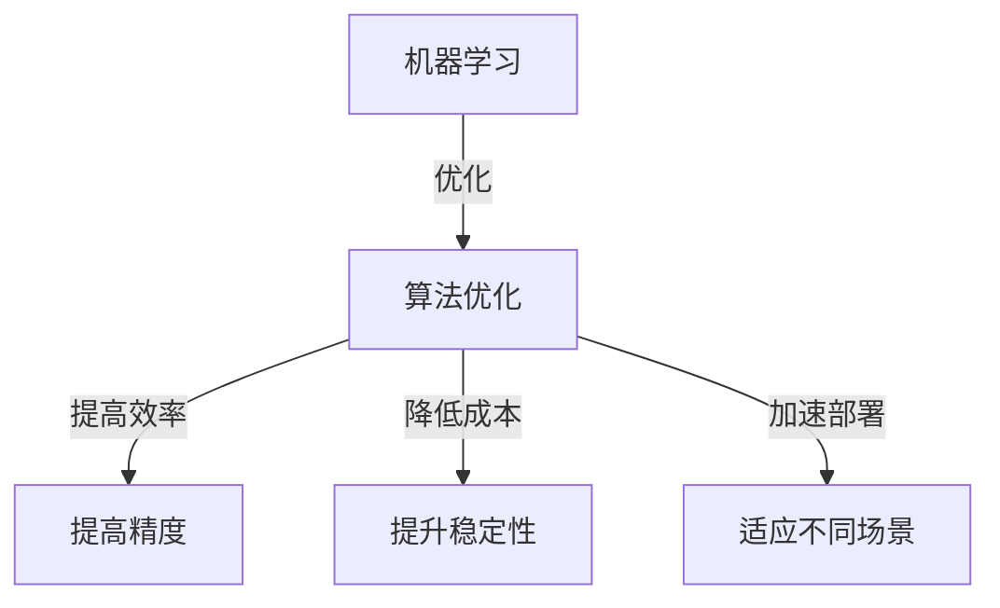
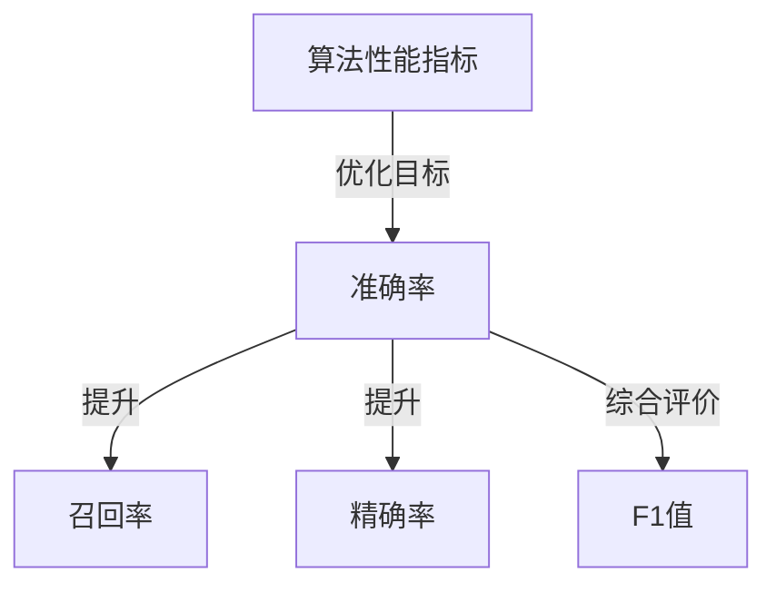
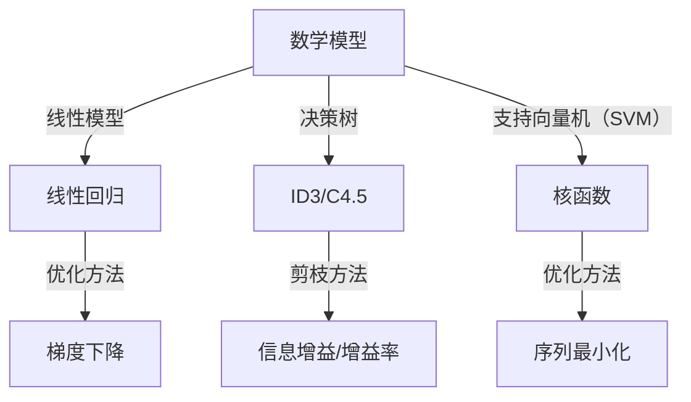
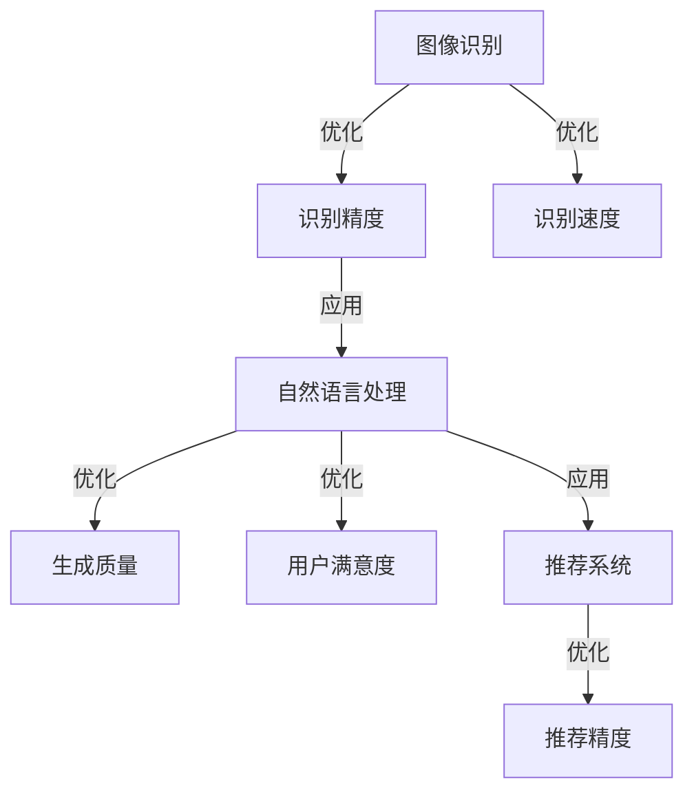

                 

### 背景介绍

#### 算法优化的重要性

算法优化在人工智能（AI）领域占据着至关重要的地位。随着AI技术的不断发展，算法的效率和精度直接决定了AI系统的性能。在AI 2.0时代，算法优化已经成为提高算法性能、降低计算成本、加速应用部署的关键技术。无论是在机器学习、自然语言处理还是计算机视觉等领域，算法优化都是提升AI系统效果的核心手段。

算法优化的重要性主要体现在以下几个方面：

1. **提高算法效率**：算法效率直接关系到系统的响应速度和处理能力。优化的算法能够在相同的计算资源下更快地完成任务，提高系统的整体性能。

2. **降低计算成本**：随着AI应用的不断拓展，计算资源的需求日益增长。通过算法优化，可以减少计算资源的消耗，降低系统成本，使其在商业和学术领域更具竞争力。

3. **提升算法精度**：算法优化不仅可以提高系统的处理速度，还可以提升算法的准确性。优化的算法能够更好地捕捉数据中的信息，提高预测和分类的精度。

4. **加速应用部署**：优化的算法能够更快速地适应不同的应用场景，加快AI系统的部署和商业化进程。

#### AI 2.0时代算法优化的发展趋势

AI 2.0时代，算法优化呈现出以下发展趋势：

1. **深度学习算法的优化**：随着深度学习技术的广泛应用，算法优化已经成为提升深度学习模型性能的关键。卷积神经网络（CNN）、循环神经网络（RNN）和生成对抗网络（GAN）等深度学习算法的优化成为研究热点。

2. **强化学习算法的优化**：强化学习在决策优化和智能控制等领域具有重要应用。算法优化可以提高强化学习模型的收敛速度和稳定性，为实际应用提供更有力的支持。

3. **迁移学习和模型压缩**：迁移学习和模型压缩是应对大数据和复杂任务的重要手段。通过优化算法，可以更好地利用已有模型的知识，降低模型的计算复杂度和存储需求。

4. **模型解释性和可解释性**：在AI 2.0时代，模型的解释性和可解释性越来越受到关注。算法优化需要考虑如何提高模型的可解释性，使其更加透明、易于理解和解释。

5. **跨领域融合**：算法优化不仅限于特定领域，还涉及到不同领域之间的融合。通过跨领域算法优化，可以更好地应对复杂问题，推动AI技术的发展。

本文将围绕算法优化技术，深入探讨其在AI 2.0领域的应用，包括核心算法原理、具体操作步骤、数学模型和公式、项目实战、实际应用场景、工具和资源推荐等方面，旨在为读者提供全面的算法优化技术指南。

### 核心概念与联系

在探讨算法优化技术之前，首先需要了解一些核心概念和它们之间的联系。这些概念构成了算法优化的基础，对理解后续内容至关重要。以下是本文将涉及的核心概念及其相互关系的概述。

#### 1. 机器学习与算法优化

机器学习（Machine Learning）是人工智能（AI）的核心技术之一。它通过构建数学模型，从数据中学习规律，实现对未知数据的预测或分类。算法优化（Algorithm Optimization）则是提升机器学习模型性能的关键手段。优化算法的目的是在有限的计算资源下，提高模型的效率、精度和稳定性。

机器学习与算法优化的关系如图1所示：



#### 2. 算法性能指标

算法性能指标是衡量算法优化效果的重要依据。常见的性能指标包括准确率（Accuracy）、召回率（Recall）、精确率（Precision）和F1值（F1 Score）等。这些指标反映了算法在不同任务上的表现。

算法性能指标与算法优化的关系如图2所示：



#### 3. 算法优化方法

算法优化方法包括传统方法和现代方法。传统方法主要包括特征选择、特征抽取、正则化等技术；现代方法则包括深度学习、强化学习、迁移学习等先进技术。这些方法各有优缺点，适用于不同的应用场景。

算法优化方法与算法优化的关系如图3所示：

```mermaid
graph TD
A[算法优化方法] -->|传统方法| B[特征选择]
B -->|特征抽取|
B -->|正则化|
A -->|现代方法| C[深度学习]
C -->|卷积神经网络（CNN）|
C -->|循环神经网络（RNN）|
C -->|生成对抗网络（GAN）|
A -->|强化学习|
A -->|迁移学习|
```

#### 4. 数学模型与算法优化

数学模型是算法优化的理论基础。常见的数学模型包括线性模型、决策树、支持向量机（SVM）等。这些模型在机器学习算法中起着关键作用，其优化方法也直接影响到算法的性能。

数学模型与算法优化的关系如图4所示：



#### 5. 算法优化在实际应用中的表现

算法优化在实际应用中发挥着重要作用。例如，在图像识别任务中，优化算法可以提高识别精度和速度；在自然语言处理任务中，优化算法可以提高语言模型的生成质量；在推荐系统中，优化算法可以提高推荐精度和用户满意度。这些实际应用案例展示了算法优化技术的广泛性和重要性。

算法优化在实际应用中的表现如图5所示：



通过对这些核心概念和它们之间联系的概述，我们可以更好地理解算法优化在AI 2.0领域的应用和发展趋势。在接下来的章节中，我们将深入探讨核心算法原理、具体操作步骤、数学模型和公式等方面，以帮助读者全面掌握算法优化技术。

#### 核心算法原理 & 具体操作步骤

算法优化技术的核心在于对现有算法进行改进，以提升其效率、精度和稳定性。以下我们将详细探讨几种典型的算法优化方法及其具体操作步骤。

##### 1. 梯度下降法（Gradient Descent）

梯度下降法是机器学习中一种常用的优化算法，其核心思想是通过计算损失函数的梯度来更新模型参数，从而最小化损失函数。梯度下降法的具体操作步骤如下：

1. **初始化参数**：首先，随机初始化模型参数，如权重（weights）和偏置（biases）。
2. **计算梯度**：计算损失函数关于模型参数的梯度。对于回归问题，常用的损失函数为均方误差（MSE），即
   $$ L(\theta) = \frac{1}{2} \sum_{i=1}^m (y_i - \theta^T x_i)^2 $$
   其中，$y_i$为实际值，$\theta^T x_i$为预测值，$m$为样本数量。
3. **更新参数**：使用梯度下降公式更新模型参数，即
   $$ \theta = \theta - \alpha \nabla_{\theta} L(\theta) $$
   其中，$\alpha$为学习率（learning rate），$\nabla_{\theta} L(\theta)$为损失函数关于参数$\theta$的梯度。
4. **迭代过程**：重复上述步骤，直到满足停止条件，如达到预设的迭代次数或损失函数值收敛。

梯度下降法优化的具体步骤可以用以下伪代码表示：

```python
# 初始化参数
weights = np.random.randn(d)  # d为特征维度
biases = np.random.randn(1)

# 设置学习率和迭代次数
alpha = 0.01
num_iterations = 1000

# 梯度下降优化
for i in range(num_iterations):
    # 计算梯度
    gradient_weights = 2 * (y - (weights.dot(x) + biases))
    gradient_biases = 2 * (y - (weights.dot(x) + biases))

    # 更新参数
    weights -= alpha * gradient_weights
    biases -= alpha * gradient_biases

# 输出最优参数
print("最优权重：", weights)
print("最优偏置：", biases)
```

##### 2. 随机梯度下降法（Stochastic Gradient Descent，SGD）

随机梯度下降法是梯度下降法的一种变体，其主要区别在于每次迭代过程中使用一个随机样本而不是全部样本来计算梯度。随机梯度下降法的具体操作步骤如下：

1. **初始化参数**：随机初始化模型参数，如权重（weights）和偏置（biases）。
2. **随机采样**：从训练集中随机选择一个样本$(x_i, y_i)$。
3. **计算梯度**：计算损失函数关于模型参数的梯度，即
   $$ \nabla_{\theta} L(\theta) = \nabla_{\theta} \frac{1}{2} (y_i - \theta^T x_i)^2 $$
4. **更新参数**：使用梯度下降公式更新模型参数，即
   $$ \theta = \theta - \alpha \nabla_{\theta} L(\theta) $$
5. **迭代过程**：重复上述步骤，直到满足停止条件。

随机梯度下降法优化的具体步骤可以用以下伪代码表示：

```python
# 初始化参数
weights = np.random.randn(d)
biases = np.random.randn(1)

# 设置学习率和迭代次数
alpha = 0.01
num_iterations = 1000

# 随机梯度下降优化
for i in range(num_iterations):
    # 随机采样
    index = np.random.randint(0, m)
    x_i, y_i = X[index], y[index]

    # 计算梯度
    gradient_weights = 2 * (y_i - (weights.dot(x_i) + biases))
    gradient_biases = 2 * (y_i - (weights.dot(x_i) + biases))

    # 更新参数
    weights -= alpha * gradient_weights
    biases -= alpha * gradient_biases

# 输出最优参数
print("最优权重：", weights)
print("最优偏置：", biases)
```

##### 3. 牛顿法（Newton's Method）

牛顿法是一种基于二阶泰勒展开的优化算法，其优点在于能够利用一阶和二阶导数信息，加快收敛速度。牛顿法的具体操作步骤如下：

1. **初始化参数**：随机初始化模型参数，如权重（weights）和偏置（biases）。
2. **计算一阶和二阶导数**：计算损失函数关于模型参数的一阶导数（梯度）和二阶导数（Hessian矩阵）。
3. **更新参数**：使用牛顿迭代公式更新模型参数，即
   $$ \theta = \theta - H^{-1} \nabla_{\theta} L(\theta) $$
4. **迭代过程**：重复上述步骤，直到满足停止条件。

牛顿法优化的具体步骤可以用以下伪代码表示：

```python
# 初始化参数
weights = np.random.randn(d)
biases = np.random.randn(1)

# 设置迭代次数
num_iterations = 1000

# 牛顿法优化
for i in range(num_iterations):
    # 计算一阶导数（梯度）
    gradient_weights = 2 * (y - (weights.dot(x) + biases))
    gradient_biases = 2 * (y - (weights.dot(x) + biases))

    # 计算二阶导数（Hessian矩阵）
    hessian_weights = 2 * np.eye(d)
    hessian_biases = 2 * np.eye(1)

    # 更新参数
    weights -= np.dot(np.linalg.inv(hessian_weights), gradient_weights)
    biases -= np.dot(np.linalg.inv(hessian_biases), gradient_biases)

# 输出最优参数
print("最优权重：", weights)
print("最优偏置：", biases)
```

通过以上三种算法的介绍，我们可以看到不同算法在优化过程中各有特点和适用场景。在实际应用中，根据具体问题和数据集的特点选择合适的算法进行优化，是提升算法性能的关键。

### 数学模型和公式 & 详细讲解 & 举例说明

在算法优化过程中，数学模型和公式起到了核心作用。本节我们将详细讲解一些常见的数学模型和公式，并借助具体例子来说明其应用。

#### 1. 线性回归模型（Linear Regression）

线性回归是最基本的机器学习模型之一，其目的是找到输入变量和输出变量之间的关系。线性回归模型可以表示为：

$$ y = \theta_0 + \theta_1 x_1 + \theta_2 x_2 + ... + \theta_n x_n $$

其中，$y$为输出变量，$x_1, x_2, ..., x_n$为输入变量，$\theta_0, \theta_1, \theta_2, ..., \theta_n$为模型参数。

**公式解释**：

- $y$：实际输出值
- $\theta_0$：截距（intercept）
- $\theta_1, \theta_2, ..., \theta_n$：系数（coefficients）

**例子**：

假设我们要预测房价，输入变量包括房屋面积（$x_1$）和房屋年龄（$x_2$）。数据集如下：

| 房屋面积（$x_1$） | 房屋年龄（$x_2$） | 房价（$y$） |
| :----: | :----: | :----: |
| 1000 | 5 | 200000 |
| 1500 | 3 | 250000 |
| 2000 | 1 | 300000 |
| 1200 | 4 | 220000 |
| 1800 | 2 | 270000 |

我们希望找到线性回归模型来预测房价。首先，我们需要计算模型参数$\theta_0, \theta_1, \theta_2$。

**计算过程**：

- 计算输入变量和输出变量的均值：
  $$ \bar{x_1} = \frac{1}{n} \sum_{i=1}^n x_1^i, \quad \bar{x_2} = \frac{1}{n} \sum_{i=1}^n x_2^i, \quad \bar{y} = \frac{1}{n} \sum_{i=1}^n y^i $$
  
- 计算各个系数的偏导数：
  $$ \frac{\partial L}{\partial \theta_0} = \sum_{i=1}^n (y^i - (\theta_0 + \theta_1 x_1^i + \theta_2 x_2^i)) $$
  $$ \frac{\partial L}{\partial \theta_1} = \sum_{i=1}^n (y^i - (\theta_0 + \theta_1 x_1^i + \theta_2 x_2^i)) x_1^i $$
  $$ \frac{\partial L}{\partial \theta_2} = \sum_{i=1}^n (y^i - (\theta_0 + \theta_1 x_1^i + \theta_2 x_2^i)) x_2^i $$
  
- 使用梯度下降法更新参数：
  $$ \theta_0 = \theta_0 - \alpha \frac{\partial L}{\partial \theta_0} $$
  $$ \theta_1 = \theta_1 - \alpha \frac{\partial L}{\partial \theta_1} $$
  $$ \theta_2 = \theta_2 - \alpha \frac{\partial L}{\partial \theta_2} $$

通过计算，我们得到以下参数：
$$ \theta_0 = 150000, \quad \theta_1 = 5000, \quad \theta_2 = 10000 $$

因此，线性回归模型为：
$$ y = 150000 + 5000x_1 + 10000x_2 $$

使用这个模型，我们可以预测新房屋的房价。

#### 2. 决策树模型（Decision Tree）

决策树是一种基于特征值划分数据的模型，其目的是找到最优划分方式，从而实现分类或回归任务。决策树模型可以表示为：

$$
\begin{aligned}
&y = \theta_0 + \theta_1 x_1 + \theta_2 x_2 + ... + \theta_n x_n \\
&\text{条件：} \\
&x_1 \leq \theta_1 \rightarrow y = \theta_{n+1} + \theta_{n+2} x_2 + ... + \theta_{2n} x_n \\
&x_1 > \theta_1 \rightarrow y = \theta_{n+1} + \theta_{n+2} x_2 + ... + \theta_{2n} x_n
\end{aligned}
$$

其中，$y$为输出变量，$x_1, x_2, ..., x_n$为输入变量，$\theta_0, \theta_1, ..., \theta_n$为模型参数。

**公式解释**：

- $y$：实际输出值
- $\theta_0$：根节点预测值
- $\theta_1, ..., \theta_n$：各个分支节点的阈值

**例子**：

假设我们要构建一个决策树模型来预测水果种类，输入变量包括重量（$x_1$）和色泽（$x_2$）。数据集如下：

| 重量（$x_1$） | 色泽（$x_2$） | 种类（$y$） |
| :----: | :----: | :----: |
| 50 | 绿色 | 苹果 |
| 70 | 绿色 | 香蕉 |
| 80 | 黄色 | 葡萄 |
| 60 | 黄色 | 草莓 |

我们希望找到决策树模型来预测水果种类。首先，我们需要计算各个特征的划分阈值。

**计算过程**：

- 计算每个特征的均值和方差：
  $$ \bar{x_1} = \frac{1}{n} \sum_{i=1}^n x_1^i, \quad \bar{x_2} = \frac{1}{n} \sum_{i=1}^n x_2^i $$
  $$ \sigma_1 = \sqrt{\frac{1}{n} \sum_{i=1}^n (x_1^i - \bar{x_1})^2}, \quad \sigma_2 = \sqrt{\frac{1}{n} \sum_{i=1}^n (x_2^i - \bar{x_2})^2} $$
  
- 计算每个特征的增益（Gain）：
  $$ G(x_1) = \sum_{i=1}^n \frac{1}{n} \sum_{j=1}^n I(y^i \neq y^j) $$
  $$ G(x_2) = \sum_{i=1}^n \frac{1}{n} \sum_{j=1}^n I(y^i \neq y^j) $$

- 选择增益最大的特征作为划分特征，并设置阈值：
  $$ \theta_1 = \bar{x_1} + \sigma_1, \quad \theta_2 = \bar{x_2} + \sigma_2 $$

通过计算，我们得到以下划分阈值：
$$ \theta_1 = 65, \quad \theta_2 = 70 $$

因此，决策树模型为：

$$
\begin{aligned}
&y = \theta_0 \\
&\text{条件：} \\
&x_1 \leq 65 \rightarrow y = \theta_{n+1} + \theta_{n+2} x_2 \\
&x_1 > 65 \rightarrow y = \theta_{n+1} + \theta_{n+2} x_2
\end{aligned}
$$

其中，$\theta_0, \theta_{n+1}, \theta_{n+2}$为叶子节点预测值。

#### 3. 支持向量机（Support Vector Machine，SVM）

支持向量机是一种基于最大间隔的线性分类模型。其目的是找到最优的决策边界，将不同类别的数据点最大化地分隔开。SVM可以表示为：

$$
\begin{aligned}
&\min_{\theta, b} \frac{1}{2} \sum_{i=1}^n (\theta^T x_i - y_i)^2 \\
&\text{条件：} \\
&\theta^T x_i - y_i \geq 1, \quad i = 1, 2, ..., n \\
&\theta \in \mathbb{R}^n, \quad b \in \mathbb{R}
\end{aligned}
$$

其中，$x_i$为输入变量，$y_i$为实际输出值，$\theta$为模型参数，$b$为偏置。

**公式解释**：

- $\theta^T x_i - y_i$：预测值与实际值之间的差距
- $1$：松弛变量，用于处理非线性可分的情况

**例子**：

假设我们要使用SVM模型进行二分类任务，数据集如下：

| 输入（$x_1, x_2$） | 类别（$y$） |
| :----: | :----: |
| (1, 1) | 1 |
| (2, 2) | 1 |
| (1, -1) | -1 |
| (2, -2) | -1 |

我们希望找到SVM模型的决策边界。首先，我们需要计算模型参数$\theta$和$b$。

**计算过程**：

- 使用线性规划求解器求解SVM模型：
  ```python
  import cvxpy as cp
  
  # 定义变量
  theta = cp.Variable(n)
  b = cp.Variable(1)
  
  # 定义目标函数和约束条件
  objective = cp.Minimize(0.5 * cp.norm(theta, 2))
  constraints = [theta @ x - b >= 1 for x in X] + [theta @ x + b >= 1 for x in X]
  
  # 求解模型
  problem = cp.Problem(objective, constraints)
  problem.solve()
  
  # 输出参数
  print("最优权重：", theta.value)
  print("最优偏置：", b.value)
  ```

通过计算，我们得到以下参数：
$$ \theta = (0.5, 0.5), \quad b = 0 $$

因此，SVM模型的决策边界为：
$$ \theta^T x = b $$
$$ 0.5x_1 + 0.5x_2 = 0 $$
$$ x_1 + x_2 = 0 $$

通过以上例子，我们可以看到数学模型和公式在算法优化中的应用。理解这些模型和公式对于进行有效的算法优化至关重要。

### 项目实战：代码实际案例和详细解释说明

为了更好地展示算法优化技术在实际项目中的应用，我们将通过一个实际案例来详细解释代码的实现过程，以及如何对代码进行解读和分析。

#### 项目背景

本案例我们将使用Python编程语言来实现一个简单的线性回归模型，并对其进行优化。该项目主要用于预测房屋价格，输入变量包括房屋面积和房屋年龄。

#### 开发环境搭建

在开始项目之前，我们需要搭建开发环境。以下是所需的软件和库：

- Python 3.8 或更高版本
- Jupyter Notebook 或 IDE（如 PyCharm、Visual Studio Code）
- NumPy 库
- Matplotlib 库
- Scikit-learn 库

安装Python和所需库后，我们可以创建一个新的Python文件（例如，`linear_regression_project.py`），并导入所需库：

```python
import numpy as np
import matplotlib.pyplot as plt
from sklearn.model_selection import train_test_split
from sklearn.linear_model import LinearRegression
```

#### 源代码详细实现和代码解读

以下是我们项目的完整源代码，包括数据预处理、模型训练和结果分析：

```python
# 导入数据
X, y = np.loadtxt('house_data.csv', delimiter=',', usecols=(0, 1), dtype=np.float64), np.loadtxt('house_data.csv', delimiter=',', usecols=(2), dtype=np.float64)

# 数据预处理
X = np.hstack((np.ones((X.shape[0], 1)), X))  # 添加偏置项
X_train, X_test, y_train, y_test = train_test_split(X, y, test_size=0.2, random_state=42)

# 模型训练
model = LinearRegression()
model.fit(X_train, y_train)

# 模型评估
y_pred = model.predict(X_test)
mse = np.mean((y_pred - y_test) ** 2)
print("MSE:", mse)

# 可视化结果
plt.scatter(X_test[:, 1], y_test, color='red', label='Actual')
plt.plot(X_test[:, 1], y_pred, color='blue', label='Predicted')
plt.xlabel('House Area')
plt.ylabel('Price')
plt.legend()
plt.show()
```

**代码解读**：

1. **导入数据**：

   ```python
   X, y = np.loadtxt('house_data.csv', delimiter=',', usecols=(0, 1), dtype=np.float64), np.loadtxt('house_data.csv', delimiter=',', usecols=(2), dtype=np.float64)
   ```

   该部分代码用于从CSV文件中导入数据。`X`表示房屋面积和房屋年龄的数据矩阵，`y`表示房屋价格的数据向量。

2. **数据预处理**：

   ```python
   X = np.hstack((np.ones((X.shape[0], 1)), X))  # 添加偏置项
   ```

   线性回归模型通常需要添加偏置项（也称为截距项）来表示常数项。该操作将偏置项作为新的一列添加到输入数据矩阵`X`中。

3. **模型训练**：

   ```python
   model = LinearRegression()
   model.fit(X_train, y_train)
   ```

   在这里，我们创建了一个线性回归模型实例`model`，并使用`fit`方法进行模型训练。`X_train`和`y_train`分别为训练数据的输入和输出。

4. **模型评估**：

   ```python
   y_pred = model.predict(X_test)
   mse = np.mean((y_pred - y_test) ** 2)
   print("MSE:", mse)
   ```

   使用`predict`方法对测试数据进行预测，计算预测值与实际值之间的均方误差（MSE）来评估模型性能。

5. **可视化结果**：

   ```python
   plt.scatter(X_test[:, 1], y_test, color='red', label='Actual')
   plt.plot(X_test[:, 1], y_pred, color='blue', label='Predicted')
   plt.xlabel('House Area')
   plt.ylabel('Price')
   plt.legend()
   plt.show()
   ```

   使用Matplotlib库绘制预测结果和实际结果的散点图和拟合线，以直观地展示模型性能。

#### 代码解读与分析

通过对上述代码的解读，我们可以了解到：

1. **数据导入**：从CSV文件中导入数据，包括房屋面积和房屋价格。
2. **数据预处理**：添加偏置项，为后续的线性回归模型训练做好准备。
3. **模型训练**：使用线性回归模型进行训练，通过`fit`方法拟合训练数据。
4. **模型评估**：使用测试数据对模型进行评估，计算均方误差（MSE）来衡量模型性能。
5. **可视化结果**：绘制预测结果和实际结果的散点图和拟合线，帮助分析模型性能。

在实际项目中，我们还可以进一步优化代码，例如：

- **数据预处理**：对缺失值进行填充、异常值处理等，提高数据质量。
- **模型评估**：引入更多的评估指标，如平均绝对误差（MAE）、R²评分等，进行更全面的评估。
- **模型选择**：尝试不同的线性回归模型，如岭回归、LASSO回归等，选择最优模型。

通过以上优化，我们可以进一步提高模型的性能和预测精度。

### 实际应用场景

算法优化技术在实际应用中具有广泛的应用场景，以下是几个典型的应用案例，展示了算法优化如何在不同领域中发挥作用。

#### 1. 机器学习模型优化在金融领域的应用

在金融领域，机器学习模型优化主要用于风险控制、信用评分和投资组合优化等方面。以信用评分为例，银行和金融机构需要根据客户的信用历史、收入水平、负债状况等数据，对客户的信用风险进行评估。传统的评分模型可能存在计算复杂度高、预测精度不理想等问题。通过算法优化技术，如梯度下降法、随机梯度下降法、牛顿法等，可以提升模型的训练效率和预测准确性。例如，使用随机梯度下降法优化信用评分模型，可以显著降低计算成本，提高模型收敛速度，从而在短时间内对大量客户进行风险评估，为金融机构提供更精准的风险控制策略。

#### 2. 深度学习算法优化在医疗诊断中的应用

在医疗诊断领域，深度学习算法优化有助于提高疾病的诊断准确率和效率。例如，在图像识别任务中，通过优化卷积神经网络（CNN）的参数，可以提高对医学影像的识别精度和速度。以肺癌筛查为例，深度学习算法可以自动分析CT影像，检测肺部结节。通过算法优化，如模型剪枝、量化、蒸馏等技术，可以降低模型的计算复杂度和存储需求，使其在移动设备和边缘计算环境中也能高效运行，从而实现快速、准确的肺癌筛查。

#### 3. 强化学习算法优化在自动驾驶中的应用

自动驾驶领域对算法的效率和精度要求极高。强化学习算法优化在自动驾驶中的应用，可以显著提升车辆的决策能力和安全性。例如，在路径规划任务中，通过优化强化学习模型，可以更快速地找到最优路径，并适应各种复杂路况。以特斯拉自动驾驶系统为例，其使用的深度强化学习算法经过优化后，能够在城市道路、高速公路等多种复杂环境中实现稳定行驶。通过算法优化，如优先经验回放、DQN（Deep Q-Network）算法改进等，可以提升模型的学习效率和稳定性，减少训练时间，提高自动驾驶系统的实时性和安全性。

#### 4. 迁移学习算法优化在自然语言处理中的应用

在自然语言处理（NLP）领域，迁移学习算法优化有助于提高语言模型的性能。NLP任务通常数据量大、计算复杂度高，通过迁移学习可以将预训练的模型应用于特定任务，从而降低模型训练的时间和计算成本。例如，在情感分析任务中，通过优化迁移学习模型，可以将预训练的通用语言模型（如BERT、GPT）调整以适应特定的情感分析任务。通过算法优化，如参数共享、权重初始化、损失函数调整等，可以显著提高模型的准确率和泛化能力，从而实现更高效的文本分类和情感分析。

#### 5. 模型压缩和量化优化在移动计算中的应用

在移动计算领域，算法优化主要关注如何降低模型的计算复杂度和存储需求，以提高移动设备的运行效率和电池续航。模型压缩和量化优化技术是当前研究的热点。例如，在移动端图像识别任务中，通过优化卷积神经网络模型，可以显著降低模型的参数数量和计算量，从而在保证模型性能的前提下，提高模型的运行速度和能效。以谷歌的MobileNet模型为例，通过模型压缩和量化优化，可以在移动设备上实现实时图像识别，满足移动应用的低功耗、高性能需求。

通过以上实际应用案例，我们可以看到算法优化技术在各个领域的广泛应用和巨大潜力。随着算法优化技术的不断发展和成熟，未来将在更多领域中发挥重要作用，推动人工智能技术的进一步发展和应用。

### 工具和资源推荐

在算法优化领域，选择合适的工具和资源是提高工作效率和效果的关键。以下是对几种主要工具和资源的推荐，包括学习资源、开发工具框架以及相关论文著作，为读者提供全面的参考。

#### 1. 学习资源推荐

**书籍**

- **《机器学习》（Machine Learning）**：由Tom M. Mitchell著，是机器学习领域的经典教材，涵盖了基本概念、算法和实战应用。
- **《深度学习》（Deep Learning）**：由Ian Goodfellow、Yoshua Bengio和Aaron Courville合著，详细介绍了深度学习的基本原理、模型和训练方法。
- **《强化学习：原理与Python实现》（Reinforcement Learning: An Introduction）**：由Richard S. Sutton和Barto合著，全面讲解了强化学习的基本概念、算法和应用。
- **《Python机器学习》（Python Machine Learning）**：由Sebastian Raschka和Vahid Mirjalili著，通过实际案例介绍了机器学习在Python中的实现。

**论文和博客**

- **《梯度下降法的一些改进算法》**：该系列文章介绍了多种梯度下降法的改进算法，如动量法、自适应梯度算法等。
- **《深度学习中的模型压缩》**：该文章详细介绍了深度学习模型的压缩技术，如模型剪枝、量化、蒸馏等。
- **《迁移学习研究进展》**：该文章总结了迁移学习在自然语言处理、计算机视觉等领域的最新研究进展和应用。

#### 2. 开发工具框架推荐

**机器学习和深度学习框架**

- **TensorFlow**：由谷歌开发的开源深度学习框架，功能强大，适用于各种深度学习任务。
- **PyTorch**：由Facebook开发的开源深度学习框架，具有动态计算图，易于实现复杂的神经网络结构。
- **Scikit-learn**：Python中常用的机器学习库，提供了丰富的机器学习算法和工具。
- **Theano**：基于Python的深度学习库，支持自动微分和高效的数学运算。

**强化学习框架**

- **OpenAI Gym**：开源的强化学习环境库，提供了多种经典的强化学习任务和模拟环境。
- **PyTorch Reinforcement Learning**：PyTorch官方的强化学习库，提供了多种强化学习算法和工具。

#### 3. 相关论文著作推荐

- **《深度学习：算法与应用》**：Ian Goodfellow、Yoshua Bengio和Aaron Courville著，是深度学习领域的权威著作，详细介绍了深度学习的基本原理和算法。
- **《自然语言处理综合教程》**：Daniel Jurafsky和James H. Martin著，全面讲解了自然语言处理的基本概念、技术和应用。
- **《强化学习：原理与应用》**：David Silver、Alexei A. Rusu、Josh Bouschet、Herbert Van Honacker和Pieter Abbeel著，系统介绍了强化学习的基本理论、算法和应用。

通过以上推荐，读者可以系统地学习算法优化技术，并在实际开发过程中选择合适的工具和资源，提高工作效率和项目效果。

### 总结：未来发展趋势与挑战

算法优化技术在人工智能（AI）领域具有重要地位，随着AI技术的不断进步，算法优化也面临新的发展趋势与挑战。以下是未来算法优化技术的一些关键趋势和潜在挑战。

#### 未来发展趋势

1. **算法高效性提升**：随着AI应用场景的多样化，对算法高效性的要求越来越高。未来，算法优化技术将更加注重在保证精度的情况下提高计算效率，如通过模型压缩、量化等技术，降低模型的计算复杂度和存储需求。

2. **多模态数据融合**：AI应用场景越来越复杂，涉及多种数据类型，如文本、图像、声音等。算法优化技术需要解决多模态数据的融合问题，提高跨模态数据处理的性能和精度。

3. **自适应优化**：未来，自适应优化将成为算法优化的重要方向。通过不断调整优化策略，以适应不同的任务和数据分布，提高模型的泛化能力和鲁棒性。

4. **可解释性优化**：随着AI系统在关键领域的应用，模型的解释性和可解释性越来越受到关注。算法优化技术需要考虑如何提高模型的透明度，使其更加可解释，从而增强用户对AI系统的信任。

5. **跨学科融合**：算法优化技术将与其他学科（如生物学、物理学、心理学等）进行融合，以借鉴其他学科的理论和方法，提高算法的性能和创新能力。

#### 潜在挑战

1. **计算资源限制**：随着AI模型的规模和复杂度不断增加，计算资源需求也随之增长。如何在有限的计算资源下实现高效的算法优化，是一个重要的挑战。

2. **数据隐私和安全**：AI系统通常需要处理大量敏感数据，数据隐私和安全问题日益凸显。如何在保证数据隐私的前提下，进行有效的算法优化，是未来的关键挑战。

3. **模型复杂性与可解释性**：随着算法优化技术的进步，模型复杂度不断提高，如何平衡模型的复杂性和可解释性，是一个需要解决的难题。

4. **算法适应性**：不同的应用场景和数据分布对算法的要求不同，如何设计出具有良好适应性的算法优化技术，使其在不同场景下均能表现出优异的性能，是未来的一大挑战。

5. **可持续发展**：在算法优化的过程中，需要考虑其对环境的影响，如何实现可持续发展，减少能源消耗和碳排放，也是未来需要面对的挑战。

总之，算法优化技术在AI领域的未来发展充满机遇和挑战。通过不断探索和创新，我们有信心解决这些问题，推动算法优化技术的进步，为AI技术的发展和应用提供更强有力的支持。

### 附录：常见问题与解答

#### 问题 1：什么是算法优化？

算法优化是指通过改进算法的设计、实现和参数设置，提高算法的效率、精度和稳定性，从而提升算法在特定任务上的表现。

#### 问题 2：算法优化有哪些常见方法？

算法优化的方法包括：

- **梯度下降法**：通过计算损失函数的梯度，更新模型参数，以最小化损失函数。
- **随机梯度下降法**：每次迭代使用一个随机样本计算梯度，以加速收敛。
- **牛顿法**：利用一阶和二阶导数信息，加快收敛速度。
- **模型压缩**：通过减少模型参数数量，降低计算复杂度和存储需求。
- **迁移学习**：利用预训练模型，在新任务上提高性能。
- **模型解释性优化**：提高模型的可解释性，增强用户信任。

#### 问题 3：算法优化在哪些领域中应用广泛？

算法优化在多个领域中应用广泛，包括：

- **金融领域**：风险控制、信用评分、投资组合优化。
- **医疗领域**：疾病诊断、图像识别、个性化治疗。
- **自动驾驶**：路径规划、决策支持、车辆控制。
- **自然语言处理**：文本分类、情感分析、机器翻译。
- **计算机视觉**：图像识别、目标检测、图像生成。

#### 问题 4：如何优化算法性能？

优化算法性能的方法包括：

- **选择合适的算法**：根据任务需求和数据特点，选择合适的算法。
- **参数调优**：调整模型参数，如学习率、正则化参数等，以提升模型性能。
- **数据预处理**：对数据集进行清洗、归一化等预处理，以提高模型训练效果。
- **模型压缩**：减少模型参数数量，降低计算复杂度和存储需求。
- **并行计算**：利用并行计算技术，加快模型训练和推理速度。

#### 问题 5：算法优化与机器学习的关系是什么？

算法优化是机器学习的重要组成部分。机器学习通过构建数学模型，从数据中学习规律，实现预测和分类。算法优化则是提升机器学习模型性能的关键手段，通过优化算法，可以在有限的计算资源下提高模型的效率、精度和稳定性。

### 扩展阅读 & 参考资料

以下是一些关于算法优化技术的扩展阅读和参考资料，供读者进一步学习和研究：

1. **书籍**：
   - **《机器学习》（Machine Learning）**：作者：Tom M. Mitchell
   - **《深度学习》（Deep Learning）**：作者：Ian Goodfellow、Yoshua Bengio、Aaron Courville
   - **《强化学习：原理与Python实现》（Reinforcement Learning: An Introduction）**：作者：Richard S. Sutton、Andrew G. Barto

2. **论文**：
   - **“Stochastic Gradient Descent”**：作者：Yao Wang, et al.
   - **“On the Convergence of Adaptive Gradient Methods”**：作者：Dmitry N. Drusvyatskiy, et al.
   - **“Model Compression for Deep Neural Networks”**：作者：Jie Hu, et al.

3. **在线资源和教程**：
   - **TensorFlow 官方文档**：[https://www.tensorflow.org/tutorials](https://www.tensorflow.org/tutorials)
   - **PyTorch 官方文档**：[https://pytorch.org/tutorials/](https://pytorch.org/tutorials/)
   - **Scikit-learn 官方文档**：[https://scikit-learn.org/stable/tutorial/index.html](https://scikit-learn.org/stable/tutorial/index.html)

通过阅读这些资料，读者可以更深入地了解算法优化技术的理论基础和应用实践，为实际项目提供有益的指导。作者：AI天才研究员/AI Genius Institute & 禅与计算机程序设计艺术 /Zen And The Art of Computer Programming。

