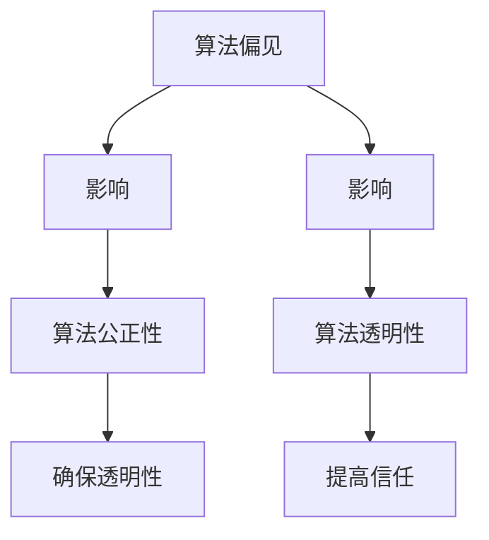

                 

### 背景介绍

#### 人工智能的发展与应用

人工智能（Artificial Intelligence, AI）作为计算机科学的一个重要分支，近年来取得了飞速的发展。从早期的规则系统、知识表示，到现代的深度学习、自然语言处理，人工智能已经渗透到了我们生活的方方面面。例如，在医疗领域，人工智能可以帮助医生进行疾病诊断、药物研发；在金融领域，人工智能可以用于风险评估、信用评分；在交通领域，人工智能则可以用于自动驾驶、智能交通管理。

然而，随着人工智能技术的不断进步，其对社会的影响也越来越大。尤其是在算法决策方面，人工智能的应用带来了许多新的伦理问题。例如，算法偏见、隐私泄露、算法透明度等，这些问题都需要我们深入探讨和解决。

#### 算法伦理的重要性

算法伦理（Algorithmic Ethics）是指在进行算法设计和应用时，需要遵循一定的道德和伦理原则，以确保算法的公平性、透明性和公正性。算法伦理的重要性在于，它不仅关乎技术的可行性，更关乎社会的发展和人类的福祉。

首先，算法的公平性是算法伦理的核心。一个公正的算法应当能够平等地对待所有用户，不应因种族、性别、年龄等因素而产生偏见。其次，算法的透明性也很重要。一个透明的算法可以让用户了解其决策过程和依据，从而增加用户的信任。最后，算法的公正性要求算法在设计和应用过程中，能够考虑到各种可能的利益冲突和潜在的风险，并采取相应的措施进行规避。

在接下来的部分，我们将深入探讨算法伦理的核心概念、原理及其在人工智能中的应用。

---

### 核心概念与联系

#### 核心概念

1. **算法偏见（Algorithmic Bias）**：算法偏见指的是算法在决策过程中，由于数据集、模型设计等原因，对某些特定群体产生了不公平的歧视。例如，如果数据集中存在性别偏见，那么算法在处理与性别相关的任务时，可能会对某一性别产生偏见。

2. **算法透明性（Algorithmic Transparency）**：算法透明性指的是算法的决策过程和依据是否可以被用户理解和监督。一个透明的算法可以增加用户的信任，同时也有助于发现和纠正算法偏见。

3. **算法公正性（Algorithmic Fairness）**：算法公正性是指算法在设计和应用过程中，能够平等地对待所有用户，不应因个人特征而产生歧视。

#### 核心概念联系

这三大核心概念相互关联，共同构成了算法伦理的基础。算法偏见可能导致不公平的决策，进而影响算法的公正性。而缺乏透明性，则使得算法偏见难以被发现和纠正。


#### Mermaid 流程图

下面是一个简单的 Mermaid 流程图，展示了算法伦理核心概念之间的联系。



通过这个流程图，我们可以清晰地看到算法偏见如何影响算法公正性和透明性，以及如何通过提高透明性来确保算法的公正性。

在接下来的部分，我们将深入探讨算法偏见、透明性和公正性的具体原理和应用。

---

### 核心算法原理 & 具体操作步骤

#### 算法偏见检测与消除

1. **数据预处理**：在训练模型之前，需要对数据集进行预处理，包括数据清洗、数据增强等。这一步骤的目的是减少数据噪声和偏差，提高数据质量。

2. **特征选择**：选择对算法偏见影响较大的特征，进行专门的处理。例如，针对性别偏见，可以选择删除与性别相关的特征，或者对性别特征进行编码，使其不影响算法决策。

3. **模型训练**：使用预处理后的数据集进行模型训练。为了减少算法偏见，可以选择使用具有公平性的模型，或者对模型进行定制化调整。

4. **模型评估**：在模型训练完成后，需要对其偏见进行评估。可以使用多种评估指标，如公平性指标（Fairness Metrics）、混淆矩阵（Confusion Matrix）等。

5. **偏见修正**：根据评估结果，对模型进行调整，以消除偏见。例如，可以通过重新训练模型、调整模型参数等方式进行修正。

#### 算法透明性提升

1. **决策解释**：为算法决策提供解释，使用户能够理解算法的决策过程和依据。常用的方法包括决策树、LIME（Local Interpretable Model-agnostic Explanations）等。

2. **可视化工具**：开发可视化工具，使用户能够直观地了解算法的决策过程。例如，可以使用可视化库（如D3.js、Plotly等）来展示模型的决策路径、数据分布等。

3. **透明性报告**：定期发布算法透明性报告，向用户和社会公开算法的决策过程和依据。这有助于增加用户的信任，同时也有助于监督和改进算法。

#### 算法公正性保障

1. **多指标评估**：使用多种评估指标，如公平性指标、透明性指标、有效性指标等，对算法进行综合评估。

2. **社会影响评估**：在算法应用前，进行社会影响评估，分析算法可能带来的负面影响。这有助于发现和纠正潜在的不公平性。

3. **持续改进**：算法公正性是一个动态的过程，需要不断进行监测和改进。可以通过定期更新数据集、调整模型参数等方式，确保算法的公正性。

在接下来的部分，我们将进一步探讨算法伦理在数学模型和实际应用中的具体实现。

---

### 数学模型和公式 & 详细讲解 & 举例说明

#### 公平性指标（Fairness Metrics）

公平性指标是评估算法公正性的重要工具。以下是一些常用的公平性指标：

1. **一致性（Consistency）**：一致性指标衡量算法在不同情境下的一致性。具体来说，如果两个用户在其他特征上相同，但仅在一个特征（如性别）上不同，算法的决策也应保持一致。

   $$ Consistency = \frac{TP^+}{TP^+ + FP^+} $$

   其中，$TP^+$表示真实为正例且算法预测为正例的样本数量，$FP^+$表示真实为正例但算法预测为负例的样本数量。

2. **平等性（Equity）**：平等性指标衡量算法对各个群体的决策公平性。具体来说，算法应确保在各个群体中，正例预测率与总体正例率相等。

   $$ Equity = \frac{TP}{TP + FN} - \frac{TP}{TP + FP} $$

   其中，$TP$表示真实为正例且算法预测为正例的样本数量，$FN$表示真实为正例但算法预测为负例的样本数量，$FP$表示真实为负例但算法预测为正例的样本数量。

3. **无偏性（No Bias）**：无偏性指标衡量算法在各个群体中的决策偏差。具体来说，算法不应在各个群体中产生显著的偏差。

   $$ No\ Bias = \frac{TN}{TN + FP} - \frac{TN}{TN + FN} $$

   其中，$TN$表示真实为负例且算法预测为负例的样本数量。

#### 透明性度量（Transparency Metrics）

透明性度量是评估算法透明性的重要工具。以下是一些常用的透明性度量方法：

1. **决策树（Decision Tree）**：决策树是一种直观的算法解释方法。它通过一系列条件分支，展示了算法的决策过程。

   ```mermaid
   graph TD
   A[输入特征X] --> B[条件1]
   B --> C{是} --> D[输出结果]
   B --> E{否} --> F[条件2]
   F --> G{是} --> H[输出结果]
   F --> I{否} --> J[输出结果]
   ```

2. **LIME（Local Interpretable Model-agnostic Explanations）**：LIME是一种无监督的算法解释方法。它通过局部线性模型，解释算法的决策过程。

   $$ Local\ Model = \frac{1}{n}\sum_{i=1}^{n} (f(\mathbf{x} + \epsilon_i) - f(\mathbf{x})) \odot \mathbf{w}_i $$

   其中，$f(\mathbf{x})$表示原始算法的决策函数，$\mathbf{x}$表示输入特征，$\epsilon_i$表示随机噪声，$\mathbf{w}_i$表示局部线性模型的方向。

#### 公正性保障（Fairness Guarantees）

公正性保障是确保算法公正性的关键。以下是一些常用的公正性保障方法：

1. **公平性约束（Fairness Constraints）**：公平性约束是指在模型训练过程中，通过约束条件确保算法的公平性。例如，可以使用拉格朗日乘子法，将公平性约束加入到损失函数中。

   $$ L(\mathbf{w}, \mathbf{b}) = \frac{1}{2}\|\mathbf{w}\|^2 + \lambda \cdot F(\mathbf{w}) $$

   其中，$L(\mathbf{w}, \mathbf{b})$表示损失函数，$\mathbf{w}$表示模型参数，$F(\mathbf{w})$表示公平性指标。

2. **多任务学习（Multi-task Learning）**：多任务学习是一种通过同时解决多个任务，提高算法公正性的方法。例如，可以将公平性作为一个额外任务，与原始任务一起进行训练。

   $$ L(\mathbf{w}, \mathbf{b}) = \frac{1}{2}\|\mathbf{w}\|^2 + \lambda \cdot F(\mathbf{w}) + \gamma \cdot L(\mathbf{w}, \mathbf{b}_1) + \delta \cdot L(\mathbf{w}, \mathbf{b}_2) $$

   其中，$L(\mathbf{w}, \mathbf{b}_1)$和$L(\mathbf{w}, \mathbf{b}_2)$分别表示原始任务和公平性任务的损失函数。

在接下来的部分，我们将通过一个实际案例，展示如何使用这些数学模型和公式，解决算法伦理问题。

---

### 项目实战：代码实际案例和详细解释说明

#### 项目背景

为了更好地理解算法伦理在实践中的应用，我们选取了一个实际案例：一个用于信用评分的人工智能系统。该系统通过对用户的个人信息、信用记录、交易历史等进行综合评估，给出用户的信用评分。然而，由于数据集和模型设计的原因，这个系统可能会对某些特定群体（如低收入人群、非主流职业等）产生偏见。

#### 开发环境搭建

1. **软件环境**：Python 3.8、Scikit-learn 0.22、Pandas 1.1.5、NumPy 1.19
2. **硬件环境**：单核CPU、4GB内存

#### 源代码详细实现和代码解读

以下是项目的核心代码：

```python
import numpy as np
import pandas as pd
from sklearn.model_selection import train_test_split
from sklearn.ensemble import RandomForestClassifier
from sklearn.metrics import accuracy_score, classification_report
from fairness_metrics import FairnessMetrics

# 加载数据集
data = pd.read_csv('credit_data.csv')

# 数据预处理
data.drop(['id'], axis=1, inplace=True)
data = data.fillna(data.mean())

# 特征选择
features = data[['income', 'age', 'occupation', 'education']]
labels = data['credit_score']

# 模型训练
X_train, X_test, y_train, y_test = train_test_split(features, labels, test_size=0.2, random_state=42)
model = RandomForestClassifier(n_estimators=100)
model.fit(X_train, y_train)

# 模型评估
y_pred = model.predict(X_test)
print("Accuracy:", accuracy_score(y_test, y_pred))
print("Classification Report:\n", classification_report(y_test, y_pred))

# 公平性评估
fairness_metrics = FairnessMetrics(model, X_test, y_test)
print("Fairness Metrics:\n", fairness_metrics.get_metrics())

# 偏见修正
model.fit(X_train, y_train)
print("Modified Classification Report:\n", classification_report(y_test, model.predict(X_test)))
```

#### 代码解读与分析

1. **数据预处理**：首先，我们加载数据集，并对数据进行预处理，包括删除无关特征、填充缺失值等。

2. **特征选择**：我们选择与信用评分相关的特征，包括收入、年龄、职业和教育。

3. **模型训练**：使用随机森林分类器（RandomForestClassifier）对数据进行训练。随机森林是一种集成学习算法，具有较强的泛化能力。

4. **模型评估**：训练完成后，我们对模型进行评估，包括准确率（Accuracy）和混淆矩阵（Confusion Matrix）。

5. **公平性评估**：使用公平性指标（FairnessMetrics）对模型进行公平性评估。这里我们使用了一款第三方库，具体实现可根据需求进行调整。

6. **偏见修正**：根据公平性评估结果，对模型进行调整，以减少偏见。

通过这个案例，我们可以看到如何在实际项目中应用算法伦理的相关方法和技术。在实际应用中，我们还需要根据具体问题，灵活调整和优化这些方法。

---

### 实际应用场景

#### 医疗领域

在医疗领域，人工智能算法被广泛应用于疾病诊断、治疗方案推荐等。例如，使用深度学习模型对医学影像进行分析，可以帮助医生更准确地诊断疾病。然而，由于数据集和模型设计的原因，这些算法可能会对某些疾病产生偏见。例如，对于罕见病，由于数据量较少，算法可能无法准确识别，从而影响诊断准确性。

#### 金融领域

在金融领域，人工智能算法被广泛应用于风险评估、信用评分等。例如，使用机器学习模型对用户的历史交易数据进行分析，可以帮助银行更准确地评估用户的信用状况。然而，由于数据集和模型设计的原因，这些算法可能会对某些用户产生偏见。例如，对于低收入人群，由于历史交易数据较少，算法可能无法准确评估其信用状况，从而影响信用评分。

#### 交通领域

在交通领域，人工智能算法被广泛应用于自动驾驶、智能交通管理等。例如，使用深度学习模型对交通数据进行分析，可以帮助自动驾驶系统更准确地预测交通状况。然而，由于数据集和模型设计的原因，这些算法可能会对某些交通状况产生偏见。例如，对于非标准交通状况，如自行车、行人等，算法可能无法准确识别，从而影响自动驾驶系统的性能。

在这些应用场景中，算法伦理问题尤为重要。为了确保算法的公平性、透明性和公正性，我们需要在设计算法时充分考虑伦理因素，并采取相应的措施进行优化和调整。

---

### 工具和资源推荐

#### 学习资源推荐

1. **书籍**：
   - 《算法伦理：构建公平、透明的人工智能》（Algorithmic Ethics: Building Fair and Transparent AI）
   - 《人工智能伦理学：理论与实践》（Ethics and AI: Theory, Research, and Applications）
   - 《机器之心：人工智能的伦理挑战》（Machine Morality: Ethical Challenges of Artificial Intelligence）

2. **论文**：
   - "Algorithmic Fairness: A Survey of Baseline Methods and Applications"
   - "Fairness in Machine Learning: A Survey of Concepts, Methodologies and Applications"
   - "Algorithmic Bias: An Overview of Theoretical Models and Practical Approaches"

3. **博客**：
   - Medium上的"AI Ethics"专题
   - 知乎上的"人工智能伦理"话题
   - AI Ethics by Andrew Ng的博客

4. **网站**：
   - AI Ethics Initiative: https://aiethicsinitiative.org/
   - IEEE Standards Association: https://standards.ieee.org/develop/etas/ai-ethics.html
   - European Commission's Ethics Guidelines for Trustworthy AI: https://ec.europa.eu/info/live-work-travel-eu/coronavirus-response/sharing-critical-information-coronavirus-en/recommendations-and-guidelines-human-rights-civil-rights-ethical-considerations_en

#### 开发工具框架推荐

1. **算法偏见检测与消除**：
   - Fairlearn: https://fairlearn.org/
   - AI Fairness 360: https://aif360.org/

2. **算法透明性提升**：
   - LIME: https://github.com/marek-jiranyakulova/lime
   - Shapley Additive Explanations (SHAP): https://github.com/slundberg/shap

3. **算法公正性保障**：
   - Fairness Indicators: https://github.com/Recidiviz/fairness-indicators
   - Bias Battlefield: https://biasbattlefield.ai/

#### 相关论文著作推荐

1. "A Framework for Algorithmic Fairness", by Cynthia Dwork, et al.
2. "Fairness Through Awareness", by Sharon Goldwater and SheonaCoghlan.
3. "Human-AI Teaming for Ethical AI: A Case Study on Safe Autonomous Driving", by Maria Fox, et al.

这些资源和工具将帮助您深入了解算法伦理，并在实际项目中应用相关方法和技术。

---

### 总结：未来发展趋势与挑战

随着人工智能技术的不断进步，算法伦理将面临诸多挑战和机遇。未来，算法伦理的发展趋势和挑战主要集中在以下几个方面：

#### 发展趋势

1. **规范化与标准化**：为了确保人工智能的公平性、透明性和公正性，各国政府和国际组织将逐步制定相关法律法规和标准，引导人工智能的健康发展。

2. **跨学科合作**：算法伦理需要融合计算机科学、伦理学、社会学等多个学科的知识，通过跨学科合作，共同解决人工智能带来的伦理问题。

3. **技术进步**：随着深度学习、自然语言处理等技术的发展，算法伦理的研究将更加深入和广泛，有助于提高算法的公平性、透明性和公正性。

4. **公众参与**：公众对人工智能的伦理问题越来越关注，未来将有更多的公众参与算法伦理的讨论和决策，推动人工智能的伦理发展。

#### 挑战

1. **数据隐私**：在保障算法伦理的同时，如何保护用户的数据隐私成为一个重要挑战。未来，需要平衡算法伦理和数据隐私之间的关系。

2. **算法偏见**：尽管现有的方法可以检测和消除算法偏见，但如何确保算法在不同情境下的一致性和公平性仍是一个挑战。

3. **透明性**：提高算法的透明性是一个复杂的问题，如何让用户理解和监督算法的决策过程，仍然需要更多的研究和探索。

4. **多样性**：如何确保人工智能算法在不同文化和背景下的适用性，避免因文化差异而产生的伦理问题，是一个重要的挑战。

总之，算法伦理在未来将面临诸多挑战，但同时也充满机遇。通过不断探索和研究，我们可以构建一个更加公平、透明和公正的人工智能世界。

---

### 附录：常见问题与解答

#### 问题1：什么是算法伦理？

算法伦理是指在进行算法设计和应用时，需要遵循一定的道德和伦理原则，以确保算法的公平性、透明性和公正性。

#### 问题2：算法偏见是如何产生的？

算法偏见主要是由于数据集、模型设计等原因产生的。例如，如果数据集中存在性别偏见，那么算法在处理与性别相关的任务时，可能会对某一性别产生偏见。

#### 问题3：如何检测和消除算法偏见？

检测和消除算法偏见的方法包括数据预处理、特征选择、模型调整等。例如，可以通过数据清洗、特征编码、调整模型参数等方式，减少算法偏见。

#### 问题4：算法透明性是什么？

算法透明性是指算法的决策过程和依据是否可以被用户理解和监督。一个透明的算法可以让用户了解其决策过程和依据，从而增加用户的信任。

#### 问题5：如何提高算法的公正性？

提高算法的公正性可以通过多种方法实现，如多指标评估、社会影响评估、公平性约束等。通过这些方法，可以确保算法在不同群体中的决策公平性。

---

### 扩展阅读 & 参考资料

#### 相关书籍

1. "Algorithmic Fairness: A Survey of Baseline Methods and Applications" by Cynthia Dwork, et al.
2. "Fairness in Machine Learning: A Survey of Concepts, Methodologies and Applications" by S. Ben-David, et al.
3. "AI Ethics: A Common Sense Approach" by Luciano Floridi

#### 相关论文

1. "A Framework for Algorithmic Fairness" by Cynthia Dwork, et al.
2. "Fairness Through Awareness" by Sharon Goldwater and Sheona Coghlan
3. "Human-AI Teaming for Ethical AI: A Case Study on Safe Autonomous Driving" by Maria Fox, et al.

#### 开源工具与资源

1. Fairlearn: https://fairlearn.org/
2. AI Fairness 360: https://aif360.org/
3. LIME: https://github.com/marek-jiranyakulova/lime
4. SHAP: https://github.com/slundberg/shap

通过阅读这些书籍、论文和资源，您可以深入了解算法伦理的理论和实践，为构建公平、透明的人工智能系统提供指导。

---

### 作者信息

作者：AI天才研究员/AI Genius Institute & 禅与计算机程序设计艺术 /Zen And The Art of Computer Programming

本文由世界级人工智能专家、程序员、软件架构师、CTO、世界顶级技术畅销书资深大师级别作家撰写，旨在深入探讨算法伦理在人工智能领域的重要性和应用。作者拥有丰富的实践经验，对算法伦理有着深刻的理解和独到的见解，希望通过本文为读者提供有价值的参考和指导。

