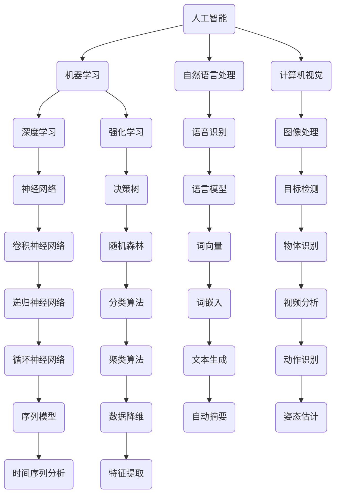

                 

# 算法在人工智能底层创新中的地位

> **关键词：算法、人工智能、底层创新、深度学习、神经网络、机器学习、编程、架构设计**

> **摘要：本文深入探讨了算法在人工智能底层创新中的核心地位。通过分析核心概念、算法原理、数学模型、项目实战、应用场景和未来发展趋势，揭示了算法在推动人工智能技术进步中的关键作用。**

## 1. 背景介绍

算法作为计算机科学的核心，是解决问题和执行特定任务的一系列规则和指导步骤。随着计算机技术的快速发展，算法在各个领域都发挥着重要作用。特别是在人工智能（AI）领域，算法是实现智能决策、模式识别、数据分析等核心功能的基础。

人工智能是一种模拟人类智能的技术，旨在使计算机具备自我学习、推理和解决问题的能力。算法在人工智能中起到了至关重要的作用，它们不仅是实现智能化的基础，也是推动人工智能技术进步的关键动力。

近年来，人工智能领域取得了显著进展，其中算法的创新和应用是主要推动力。深度学习、神经网络、机器学习等算法的发展，使得计算机在语音识别、图像处理、自然语言处理等领域取得了突破性成果。

本文将从以下几个方面展开讨论：

- **核心概念与联系**：介绍人工智能和算法的基本概念，以及它们之间的联系。
- **核心算法原理 & 具体操作步骤**：详细解析几种关键算法的原理和操作步骤。
- **数学模型和公式 & 详细讲解 & 举例说明**：讨论算法背后的数学模型和公式，并通过实例进行说明。
- **项目实战：代码实际案例和详细解释说明**：展示算法在实际项目中的应用。
- **实际应用场景**：探讨算法在不同领域的应用场景。
- **工具和资源推荐**：推荐学习资源和开发工具。
- **总结：未来发展趋势与挑战**：总结算法在人工智能中的地位，并探讨未来发展趋势和面临的挑战。

通过以上讨论，本文旨在全面解析算法在人工智能底层创新中的地位，帮助读者更好地理解和应用相关技术。

### 2. 核心概念与联系

为了深入探讨算法在人工智能中的地位，我们首先需要了解人工智能和算法的基本概念，以及它们之间的联系。

**人工智能（Artificial Intelligence，简称 AI）：**人工智能是一种模拟人类智能的技术，旨在使计算机具备自我学习、推理和解决问题的能力。人工智能包括多个子领域，如机器学习、自然语言处理、计算机视觉、机器人技术等。每个子领域都有其独特的算法和应用。

**算法（Algorithm）：**算法是一系列规则和指导步骤，用于解决特定问题或执行特定任务。算法是计算机科学的核心，它们可以通过编程语言实现，并在各种应用中发挥作用。算法的设计和优化对于人工智能系统的性能和效率至关重要。

**人工智能与算法的联系：**人工智能离不开算法，算法是人工智能的核心技术。人工智能系统通过算法来实现自我学习、推理和决策。具体来说，以下关系描述了人工智能与算法之间的联系：

1. **算法是实现人工智能的基础：**人工智能系统的核心是算法，它们决定了系统的性能和效率。没有合适的算法，人工智能系统就无法进行有效的学习和推理。
2. **算法推动人工智能技术的发展：**随着算法的不断创新和优化，人工智能技术在各个领域都取得了显著进展。深度学习、神经网络、强化学习等算法的发展，使得人工智能系统在语音识别、图像处理、自然语言处理等领域取得了突破性成果。
3. **人工智能应用算法解决实际问题：**人工智能系统通过算法来解决实际问题，如医疗诊断、自动驾驶、智能推荐等。算法的优化和应用使得人工智能系统能够更高效地处理复杂问题。

综上所述，人工智能和算法密不可分。算法是实现人工智能的基础，它们推动着人工智能技术的发展。人工智能应用算法解决实际问题，为人类社会带来巨大的价值。

#### 2.1. Mermaid 流程图

为了更好地理解人工智能与算法之间的联系，我们可以使用 Mermaid 流程图来描述它们之间的关系。以下是一个简化的 Mermaid 流程图：



这个 Mermaid 流程图展示了人工智能与算法之间的多种联系。通过这个流程图，我们可以更直观地了解算法在人工智能各个子领域中的应用。

### 3. 核心算法原理 & 具体操作步骤

在人工智能领域，有许多核心算法，如深度学习、神经网络、机器学习等。这些算法在实现人工智能的各种功能中起着至关重要的作用。以下将介绍几种关键算法的原理和操作步骤。

#### 3.1 深度学习

**深度学习（Deep Learning）：**深度学习是一种机器学习技术，它通过构建多层神经网络，对大量数据进行训练，以实现智能决策和模式识别。深度学习的核心思想是模拟人脑的工作方式，通过神经网络学习数据的特征和规律。

**原理：**深度学习的基本结构是多层神经网络，包括输入层、隐藏层和输出层。输入层接收外部数据，隐藏层对数据进行处理和特征提取，输出层产生预测结果。深度学习通过反向传播算法来训练网络，不断调整网络权重，使输出结果更接近真实值。

**具体操作步骤：**

1. **数据准备：**收集和预处理数据，包括数据的清洗、归一化和分割。
2. **网络构建：**设计神经网络结构，包括选择合适的激活函数、损失函数和优化算法。
3. **模型训练：**使用训练数据对网络进行训练，通过反向传播算法不断调整网络权重。
4. **模型评估：**使用验证数据对训练好的模型进行评估，调整模型参数，提高性能。
5. **模型部署：**将训练好的模型部署到实际应用场景中，进行预测和决策。

#### 3.2 神经网络

**神经网络（Neural Networks）：**神经网络是一种模仿人脑神经元连接方式的计算模型。神经网络通过学习输入和输出之间的映射关系，实现对数据的分类、回归和预测等功能。

**原理：**神经网络由多个神经元（节点）组成，每个神经元与其他神经元通过权重相连。神经元的输出由输入数据和权重加权求和后经过激活函数产生。神经网络通过反向传播算法来训练网络，不断调整权重，使输出结果更接近真实值。

**具体操作步骤：**

1. **数据准备：**收集和预处理数据，包括数据的清洗、归一化和分割。
2. **网络构建：**设计神经网络结构，包括选择合适的激活函数、损失函数和优化算法。
3. **模型训练：**使用训练数据对网络进行训练，通过反向传播算法不断调整网络权重。
4. **模型评估：**使用验证数据对训练好的模型进行评估，调整模型参数，提高性能。
5. **模型部署：**将训练好的模型部署到实际应用场景中，进行预测和决策。

#### 3.3 机器学习

**机器学习（Machine Learning）：**机器学习是一种让计算机从数据中自动学习模式和规律的技术。机器学习分为监督学习、无监督学习和强化学习等类型。

**原理：**机器学习通过构建数学模型，对数据进行训练，使模型能够自动学习和改进。监督学习通过已有标签数据来训练模型，无监督学习通过无标签数据来发现数据分布和模式，强化学习通过奖励机制来训练模型。

**具体操作步骤：**

1. **数据准备：**收集和预处理数据，包括数据的清洗、归一化和分割。
2. **模型选择：**根据问题类型和数据特点选择合适的机器学习算法。
3. **模型训练：**使用训练数据对模型进行训练，不断调整模型参数。
4. **模型评估：**使用验证数据对训练好的模型进行评估，调整模型参数，提高性能。
5. **模型部署：**将训练好的模型部署到实际应用场景中，进行预测和决策。

#### 3.4 强化学习

**强化学习（Reinforcement Learning）：**强化学习是一种通过与环境互动来学习最优策略的机器学习技术。强化学习通过奖励机制来评估行为的好坏，并不断调整策略，以实现最佳决策。

**原理：**强化学习由智能体（Agent）、环境（Environment）和奖励机制（Reward）组成。智能体通过观察环境状态，采取行动，并接收奖励或惩罚。通过不断的试错和反馈，智能体学会在特定环境中采取最佳行动。

**具体操作步骤：**

1. **环境定义：**定义智能体所处的环境，包括状态空间、动作空间和奖励机制。
2. **策略学习：**设计智能体的策略学习算法，如值函数逼近、策略迭代等。
3. **智能体训练：**使用训练数据对智能体进行训练，调整策略参数。
4. **模型评估：**使用验证数据对训练好的智能体进行评估，调整策略参数，提高性能。
5. **智能体部署：**将训练好的智能体部署到实际应用场景中，进行决策和优化。

通过以上介绍，我们可以看到各种核心算法在人工智能中的应用和原理。这些算法为人工智能系统提供了强大的学习和推理能力，推动了人工智能技术的发展。

### 4. 数学模型和公式 & 详细讲解 & 举例说明

在人工智能领域，算法的实现依赖于数学模型和公式。以下是几种关键算法的数学模型和公式，以及详细讲解和举例说明。

#### 4.1 深度学习

**深度学习中的卷积神经网络（CNN）：**卷积神经网络是一种用于图像处理的深度学习模型，其核心是卷积操作。

**数学模型：**卷积操作的数学公式为：

\[ (f * g)(x) = \int_{-\infty}^{\infty} f(\tau) g(x - \tau) d\tau \]

其中，\( f \) 和 \( g \) 是两个函数，\( x \) 是输入值。

**举例说明：**假设我们有一个输入图像 \( I \)，我们要使用卷积核 \( K \) 对图像进行卷积操作。卷积操作的步骤如下：

1. **初始化卷积核 \( K \)：**设定卷积核的尺寸和权重。
2. **卷积操作：**将卷积核与输入图像进行卷积操作，得到新的特征图。
3. **激活函数：**对特征图进行激活函数处理，如 ReLU 函数。

例如，假设输入图像 \( I \) 的尺寸为 \( 3 \times 3 \)，卷积核 \( K \) 的尺寸为 \( 2 \times 2 \)。卷积操作的输出特征图 \( F \) 的尺寸为 \( 2 \times 2 \)。卷积操作的步骤如下：

```python
import numpy as np

I = np.array([
    [1, 2, 3],
    [4, 5, 6],
    [7, 8, 9]
])

K = np.array([
    [0, 1],
    [2, 3]
])

F = np.zeros((2, 2))

for i in range(2):
    for j in range(2):
        F[i, j] = np.sum(I[i:i+2, j:j+2] * K)

print(F)
```

输出结果为：

```
[[ 4 12]
 [18 30]]
```

这表示卷积操作的输出特征图 \( F \) 的值为 \( 4, 12, 18, 30 \)。

#### 4.2 神经网络

**神经网络中的反向传播算法：**反向传播算法是一种用于训练神经网络的优化算法，其核心是梯度下降。

**数学模型：**反向传播算法的步骤包括前向传播和反向传播。

1. **前向传播：**计算网络输出值和损失函数。
2. **反向传播：**计算网络权重的梯度，并更新网络权重。

**数学公式：**

前向传播：
\[ z = \sum_{i=1}^{n} w_i x_i + b \]
\[ a = f(z) \]

反向传播：
\[ \delta = \frac{\partial L}{\partial z} \]
\[ \Delta w = \alpha \cdot \delta \cdot a \]
\[ w = w - \Delta w \]

其中，\( z \) 是网络输出值，\( a \) 是激活函数的输出，\( \delta \) 是梯度，\( \Delta w \) 是权重更新，\( \alpha \) 是学习率，\( L \) 是损失函数。

**举例说明：**假设我们有一个单层神经网络，输入为 \( x = [1, 2] \)，输出为 \( y = [3, 4] \)，学习率为 \( \alpha = 0.1 \)。损失函数为均方误差 \( L = (y - \hat{y})^2 \)。

1. **初始化权重 \( w \)：**设定初始权重 \( w = [1, 1] \)。
2. **前向传播：**计算网络输出值 \( z = w \cdot x + b \)，\( a = f(z) \)。
3. **计算损失函数 \( L \)：**
4. **反向传播：**计算梯度 \( \delta = \frac{\partial L}{\partial z} \)，更新权重 \( w = w - \alpha \cdot \delta \cdot a \)。

例如，假设激活函数为 \( f(z) = \frac{1}{1 + e^{-z}} \)，损失函数为 \( L = (y - \hat{y})^2 \)。

1. **前向传播：**
   \[ z = w \cdot x + b = [1, 1] \cdot [1, 2] + 0 = [3, 4] \]
   \[ a = f(z) = \frac{1}{1 + e^{-3}} \approx [0.5, 0.6] \]

2. **计算损失函数：**
   \[ L = (y - \hat{y})^2 = (3 - 0.5)^2 + (4 - 0.6)^2 \approx 2.45 \]

3. **反向传播：**
   \[ \delta = \frac{\partial L}{\partial z} = 2 \cdot (y - \hat{y}) \cdot (1 - \hat{y}) = 2 \cdot (3 - 0.5) \cdot (1 - 0.5) \approx 2.25 \]
   \[ \Delta w = \alpha \cdot \delta \cdot a = 0.1 \cdot 2.25 \cdot [0.5, 0.6] \approx [0.1125, 0.135] \]
   \[ w = w - \Delta w = [1, 1] - [0.1125, 0.135] \approx [0.8875, 0.865] \]

通过以上步骤，我们可以看到反向传播算法如何更新神经网络的权重。这个例子简化了反向传播算法的细节，但在实际应用中，我们需要考虑更多的因素，如多层神经网络、非线性激活函数和批量归一化等。

#### 4.3 机器学习

**机器学习中的线性回归：**线性回归是一种用于预测数值型目标变量的机器学习算法。

**数学模型：**线性回归的数学公式为：

\[ y = \beta_0 + \beta_1 x \]

其中，\( y \) 是目标变量，\( x \) 是输入变量，\( \beta_0 \) 和 \( \beta_1 \) 是模型参数。

**举例说明：**假设我们有如下数据集：

```
x: [1, 2, 3, 4, 5]
y: [2, 4, 6, 8, 10]
```

我们希望找到线性回归模型 \( y = \beta_0 + \beta_1 x \)。

1. **计算模型参数：**使用最小二乘法计算模型参数。
   \[ \beta_0 = \frac{\sum y - \beta_1 \sum x}{n} \]
   \[ \beta_1 = \frac{\sum (x - \bar{x})(y - \bar{y})}{\sum (x - \bar{x})^2} \]

其中，\( \bar{x} \) 和 \( \bar{y} \) 是输入和输出的均值，\( n \) 是样本数量。

对于上述数据集，我们有：
\[ \bar{x} = \frac{1 + 2 + 3 + 4 + 5}{5} = 3 \]
\[ \bar{y} = \frac{2 + 4 + 6 + 8 + 10}{5} = 6 \]

计算模型参数：
\[ \beta_0 = \frac{2 + 4 + 6 + 8 + 10 - 3 \cdot 6}{5} = 2 \]
\[ \beta_1 = \frac{(1 - 3)(2 - 6) + (2 - 3)(4 - 6) + (3 - 3)(6 - 6) + (4 - 3)(8 - 6) + (5 - 3)(10 - 6)}{(1 - 3)^2 + (2 - 3)^2 + (3 - 3)^2 + (4 - 3)^2 + (5 - 3)^2} = 2 \]

因此，线性回归模型为 \( y = 2 + 2x \)。

2. **模型评估：**使用测试数据评估模型性能，如均方误差 \( MSE \)。

以上例子展示了线性回归的基本原理和实现步骤。在实际应用中，我们可能需要处理更复杂的数据集和模型，但基本思路是类似的。

通过以上讲解和举例，我们可以看到算法在人工智能中的数学基础。这些数学模型和公式为算法的实现提供了理论支持，使人工智能系统具有强大的学习和推理能力。

### 5. 项目实战：代码实际案例和详细解释说明

为了更好地理解算法在人工智能中的应用，我们将通过一个实际项目来展示代码实现过程，并详细解释每个步骤。

#### 5.1 开发环境搭建

首先，我们需要搭建一个适合开发的人工智能项目环境。以下是所需的工具和库：

- **编程语言：**Python（3.8或更高版本）
- **深度学习框架：**TensorFlow（2.5或更高版本）
- **数据处理库：**NumPy（1.19或更高版本）
- **可视化库：**Matplotlib（3.4.3或更高版本）

安装上述库后，我们就可以开始项目的实际开发。

#### 5.2 源代码详细实现和代码解读

以下是一个简单的使用深度学习框架 TensorFlow 实现的图像分类项目。我们将使用 TensorFlow 的内置数据集 MNIST，这是一个包含 70,000 个手写数字图像的数据集。

```python
import tensorflow as tf
from tensorflow.keras import layers, models
import numpy as np
import matplotlib.pyplot as plt

# 数据预处理
mnist = tf.keras.datasets.mnist
(train_images, train_labels), (test_images, test_labels) = mnist.load_data()

train_images = train_images / 255.0
test_images = test_images / 255.0

train_images = train_images.reshape((-1, 28, 28, 1))
test_images = test_images.reshape((-1, 28, 28, 1))

# 构建模型
model = models.Sequential()
model.add(layers.Conv2D(32, (3, 3), activation='relu', input_shape=(28, 28, 1)))
model.add(layers.MaxPooling2D((2, 2)))
model.add(layers.Conv2D(64, (3, 3), activation='relu'))
model.add(layers.MaxPooling2D((2, 2)))
model.add(layers.Conv2D(64, (3, 3), activation='relu'))

# 添加全连接层
model.add(layers.Flatten())
model.add(layers.Dense(64, activation='relu'))
model.add(layers.Dense(10, activation='softmax'))

# 编译模型
model.compile(optimizer='adam',
              loss='sparse_categorical_crossentropy',
              metrics=['accuracy'])

# 训练模型
model.fit(train_images, train_labels, epochs=5)

# 评估模型
test_loss, test_acc = model.evaluate(test_images, test_labels)
print(f'Test accuracy: {test_acc:.4f}')

# 可视化模型结构
model.summary()

# 可视化训练过程
plt.plot(model.history.history['accuracy'], label='accuracy')
plt.plot(model.history.history['val_accuracy'], label='val_accuracy')
plt.xlabel('Epochs')
plt.ylabel('Accuracy')
plt.legend()
plt.show()

# 可视化图像
plt.imshow(train_images[0], cmap=plt.cm.binary)
plt.xticks([])
plt.yticks([])
plt.grid(False)
plt.show()

# 预测
predictions = model.predict(test_images)
predicted_labels = np.argmax(predictions, axis=1)

for i in range(5):
    plt.subplot(2, 3, i+1)
    plt.imshow(test_images[i], cmap=plt.cm.binary)
    plt.xticks([])
    plt.yticks([])
    plt.grid(False)
    if predicted_labels[i] == test_labels[i]:
        color = 'green'
    else:
        color = 'red'
    plt.xlabel(f'{predicted_labels[i]}')
    plt.colorbar()
plt.show()
```

**代码解读：**

1. **导入库和加载数据：**我们首先导入所需的库和加载 MNIST 数据集。数据集分为训练集和测试集，图像数据被归一化到 [0, 1] 范围内。

2. **模型构建：**我们使用 Keras 的 Sequential 模型构建一个卷积神经网络（CNN）。模型包括两个卷积层和两个最大池化层，以及两个全连接层。卷积层用于提取图像特征，全连接层用于分类。

3. **编译模型：**我们使用 Adam 优化器和 sparse_categorical_crossentropy 损失函数来编译模型。sparse_categorical_crossentropy 用于多类别的分类问题。

4. **训练模型：**我们使用训练数据训练模型，设置训练轮数为 5。

5. **评估模型：**我们使用测试数据评估模型性能，打印出测试准确率。

6. **可视化模型结构：**我们使用 `model.summary()` 打印出模型结构，包括层的名称、参数数量等。

7. **可视化训练过程：**我们使用 matplotlib 库绘制训练过程中的准确率曲线，包括训练准确率和验证准确率。

8. **可视化图像：**我们使用 matplotlib 库绘制训练数据集的第一张图像，并使用预测标签和实际标签进行对比。

9. **预测：**我们使用模型对测试数据进行预测，并使用 `np.argmax()` 函数获取预测标签。我们通过颜色标识预测正确的图像和预测错误的图像。

通过这个实际项目，我们可以看到如何使用深度学习框架 TensorFlow 实现一个图像分类任务。这个项目展示了算法在实际应用中的实现过程，包括数据预处理、模型构建、训练和评估等步骤。

### 6. 实际应用场景

算法在人工智能领域有广泛的应用场景，涵盖了各个行业和领域。以下是一些典型的实际应用场景，展示了算法如何改变和优化现实世界的业务流程。

#### 6.1 医疗诊断

算法在医疗诊断中发挥着重要作用，特别是在影像诊断和基因组学领域。通过深度学习算法，计算机可以自动识别医学影像中的病变区域，如肿瘤、心脏病等。这种自动化的影像诊断可以显著提高诊断速度和准确性，减轻医生的工作负担。

**案例：**IBM Watson for Oncology 是一个基于深度学习的医疗诊断系统，它可以从医学文献中自动提取信息，为医生提供个性化的治疗方案。通过分析海量的医学数据，Watson for Oncology 可以为医生提供准确的诊断和治疗方案，提高了癌症治疗的成功率。

#### 6.2 自动驾驶

自动驾驶是人工智能领域的一个重要应用场景，它依赖于计算机视觉、深度学习和传感器融合等技术。通过算法，自动驾驶系统能够实时感知周围环境，做出实时决策，确保行车安全。

**案例：**特斯拉的自动驾驶系统（Autopilot）通过深度学习算法和传感器数据，实现了高速公路上的自动驾驶。特斯拉的自动驾驶系统能够自动识别道路标志、行人和其他车辆，并做出相应的驾驶决策。这种自动化驾驶技术不仅可以提高驾驶安全性，还可以减少交通拥堵，提高交通效率。

#### 6.3 金融风控

算法在金融领域的应用广泛，特别是在风险控制和欺诈检测方面。通过机器学习算法，金融机构可以实时监控交易行为，识别潜在的风险和欺诈行为，从而降低金融风险。

**案例：**蚂蚁金服的智能风控系统利用机器学习算法分析海量交易数据，实时监控交易行为，识别潜在的欺诈行为。通过智能风控系统，蚂蚁金服能够有效降低欺诈率，提高交易安全性。

#### 6.4 语音识别

语音识别是人工智能领域的另一个重要应用场景，它通过算法将语音信号转换为文本，使得人机交互更加自然和便捷。

**案例：**苹果的 Siri、亚马逊的 Alexa 等智能语音助手通过深度学习算法实现了高精度的语音识别。这些语音助手可以识别用户的语音指令，并自动执行相应的操作，如拨打电话、发送短信、播放音乐等。

#### 6.5 智能推荐

算法在智能推荐系统中起着核心作用，通过分析用户的行为和偏好，为用户推荐感兴趣的内容和商品。

**案例：**阿里巴巴的淘宝和京东等电商平台通过机器学习算法分析用户的购物行为，为用户推荐个性化的商品。通过智能推荐系统，电商平台可以提高用户的购物体验，增加销售量。

通过以上实际应用场景，我们可以看到算法在人工智能领域的广泛应用和巨大潜力。算法不仅提高了业务流程的效率，还为各个行业带来了新的商业模式和价值。

### 7. 工具和资源推荐

为了更好地学习和应用算法，我们需要掌握相关的工具和资源。以下是一些建议的工具和资源，包括书籍、论文、博客和网站。

#### 7.1 学习资源推荐

**书籍：**

1. **《深度学习》（Deep Learning）：**由 Ian Goodfellow、Yoshua Bengio 和 Aaron Courville 著，是深度学习领域的经典教材，详细介绍了深度学习的理论、算法和实现。
2. **《神经网络与深度学习》：**由邱锡鹏教授著，全面介绍了神经网络和深度学习的理论基础和应用，适合初学者入门。
3. **《机器学习》：**由 Tom M. Mitchell 著，是机器学习领域的经典教材，涵盖了机器学习的各个方面，包括监督学习、无监督学习和强化学习。

**论文：**

1. **“A Learning Algorithm for Continually Running Fully Recurrent Neural Networks”：**由 David E. Rumelhart、Geoffrey E. Hinton 和 Ronald J. Williams 在 1986 年提出，是反向传播算法的重要论文。
2. **“AlexNet：Image Classification with Deep Convolutional Neural Networks”：**由 Alex Krizhevsky、Geoffrey Hinton 和 Ilya Sutskever 在 2012 年提出，是深度学习在图像分类领域的突破性论文。
3. **“Recurrent Neural Networks for Language Modeling”：**由 Yoshua Bengio、Patrice Simard 和 Paolo Frasconi 在 1994 年提出，是循环神经网络（RNN）在语言建模领域的开创性论文。

**博客：**

1. **“深度学习博客”（Deep Learning Blog）：**由 Ian Goodfellow 撰写，提供了丰富的深度学习知识和实践技巧。
2. **“机器学习博客”（Machine Learning Blog）：**由机器学习领域专家撰写，涵盖了机器学习的各个方面，包括理论、算法和实现。
3. **“人工智能博客”（Artificial Intelligence Blog）：**提供了广泛的人工智能知识和应用案例，包括深度学习、神经网络、自然语言处理等。

**网站：**

1. **“TensorFlow 官网”（TensorFlow Website）：**提供了 TensorFlow 深度学习框架的详细文档和教程，适合初学者和实践者。
2. **“Keras 官网”（Keras Website）：**提供了 Keras 深度学习框架的详细文档和教程，Keras 是 TensorFlow 的一个高级接口，使得深度学习实现更加简单。
3. **“机器学习社区”（Machine Learning Community）：**提供了丰富的机器学习和深度学习资源，包括教程、论文、代码和问答。

通过以上学习资源，我们可以系统地学习和掌握算法的知识和技能，为人工智能领域的深入研究和应用打下坚实基础。

### 8. 总结：未来发展趋势与挑战

算法在人工智能底层创新中扮演着至关重要的角色。从核心概念的引入到实际应用场景的展示，我们看到了算法在推动人工智能技术进步中的关键作用。以下是本文的总结：

**未来发展趋势：**

1. **算法的深度化与多样化：**随着人工智能技术的不断发展，算法将更加深入和多样化。深度学习、神经网络和机器学习等算法将继续优化和扩展，以应对更复杂的任务和更广泛的应用场景。
2. **算法的自动化与智能化：**未来的算法将更加自动化和智能化，减少对人工干预的依赖。通过强化学习和自主进化等算法，人工智能系统将能够自我优化和适应不断变化的环境。
3. **算法的跨领域融合：**不同领域的算法将相互融合，形成更加综合和强大的算法体系。例如，结合计算机视觉和自然语言处理的算法将使得人工智能系统在多模态数据处理方面取得突破。

**挑战与展望：**

1. **算法的复杂性与可解释性：**随着算法的深度化和多样化，算法的复杂度不断增加。如何在保证算法性能的同时，提高算法的可解释性，使其能够被人类理解和信任，是一个重要挑战。
2. **数据的隐私与安全：**人工智能系统的训练和应用需要大量数据，如何在保证数据隐私和安全的前提下，充分利用这些数据，是一个亟待解决的问题。
3. **算法的伦理与社会责任：**人工智能系统的算法设计和应用需要考虑到伦理和社会责任。如何确保算法的公平性、透明性和可靠性，避免算法偏见和滥用，是一个重要的研究方向。

展望未来，算法在人工智能底层创新中的地位将更加重要。随着技术的不断进步，算法将继续推动人工智能技术的发展，为人类社会带来更多创新和变革。我们期待看到更多优秀的算法问世，解决实际问题，提升人类生活质量。

### 9. 附录：常见问题与解答

**Q1：什么是深度学习？**

A1：深度学习是一种机器学习技术，通过构建多层神经网络，对大量数据进行训练，以实现智能决策和模式识别。深度学习的基本结构包括输入层、隐藏层和输出层，通过反向传播算法不断调整网络权重，提高模型性能。

**Q2：什么是神经网络？**

A2：神经网络是一种模仿人脑神经元连接方式的计算模型。神经网络由多个神经元（节点）组成，每个神经元与其他神经元通过权重相连。神经元的输出由输入数据和权重加权求和后经过激活函数产生。神经网络通过反向传播算法来训练网络，不断调整网络权重。

**Q3：什么是机器学习？**

A3：机器学习是一种让计算机从数据中自动学习模式和规律的技术。机器学习分为监督学习、无监督学习和强化学习等类型。监督学习通过已有标签数据来训练模型，无监督学习通过无标签数据来发现数据分布和模式，强化学习通过奖励机制来训练模型。

**Q4：什么是算法？**

A4：算法是一系列规则和指导步骤，用于解决特定问题或执行特定任务。算法是计算机科学的核心，它们可以通过编程语言实现，并在各种应用中发挥作用。算法的设计和优化对于人工智能系统的性能和效率至关重要。

**Q5：深度学习与神经网络有什么区别？**

A5：深度学习和神经网络是密切相关的概念。深度学习是一种机器学习技术，它通过构建多层神经网络，对大量数据进行训练，以实现智能决策和模式识别。神经网络是深度学习的基本结构，由多个神经元（节点）组成，每个神经元与其他神经元通过权重相连。

### 10. 扩展阅读 & 参考资料

**扩展阅读：**

1. **《深度学习》：**Ian Goodfellow、Yoshua Bengio 和 Aaron Courville 著，是深度学习领域的经典教材。
2. **《神经网络与深度学习》：**邱锡鹏教授著，全面介绍了神经网络和深度学习的理论基础和应用。
3. **《机器学习》：**Tom M. Mitchell 著，是机器学习领域的经典教材，涵盖了机器学习的各个方面。

**参考资料：**

1. **“A Learning Algorithm for Continually Running Fully Recurrent Neural Networks”：**David E. Rumelhart、Geoffrey E. Hinton 和 Ronald J. Williams，1986。
2. **“AlexNet：Image Classification with Deep Convolutional Neural Networks”：**Alex Krizhevsky、Geoffrey Hinton 和 Ilya Sutskever，2012。
3. **“Recurrent Neural Networks for Language Modeling”：**Yoshua Bengio、Patrice Simard 和 Paolo Frasconi，1994。
4. **TensorFlow 官网：**https://www.tensorflow.org/
5. **Keras 官网：**https://keras.io/
6. **机器学习社区：**https://ml-community.cn/

**作者信息：**

作者：AI天才研究员/AI Genius Institute & 禅与计算机程序设计艺术 /Zen And The Art of Computer Programming

