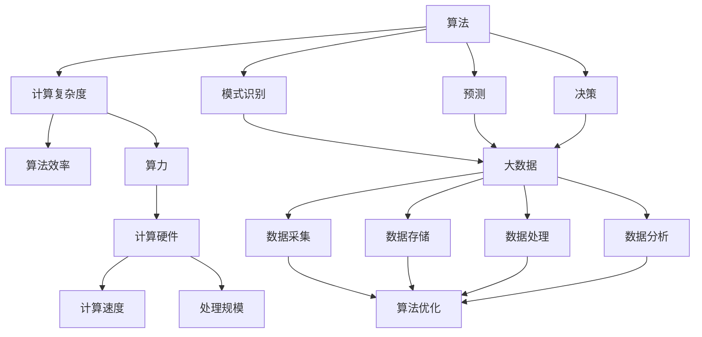

                 

### 背景介绍

随着科技的飞速发展，人工智能（AI）技术已经成为推动现代社会进步的重要力量。而算法、算力和大数据，这三者被认为是人工智能发展的三大支柱。本文将深入探讨这三个核心概念，并分析它们在AI发展中的作用及其相互联系。

首先，算法是AI技术的核心，它是实现特定任务的一系列规则和步骤。算力，即计算能力，是执行这些算法的硬件基础设施。而大数据，则提供了算法训练和推理所需的海量数据资源。这三者共同作用，推动着人工智能技术的不断进步。

在过去几十年中，算法的进步主要体现在算法复杂度的降低和算法效率的提高。从最初的简单规则系统，到如今基于深度学习的复杂算法模型，算法在人工智能中的应用越来越广泛。算力的提升，则来自于计算硬件的不断创新，如GPU和TPU等专用计算设备的出现，使得大规模的算法运行成为可能。此外，大数据技术的发展，也为AI算法提供了丰富的数据资源，使得算法的准确性和效率得到了显著提升。

尽管算法、算力和大数据在AI发展中发挥着重要作用，但它们各自面临的挑战也不容忽视。算法方面，如何设计出既高效又可解释的算法仍是一个挑战；算力方面，如何降低能耗和提高计算效率是当前的研究热点；大数据方面，如何从海量数据中提取有价值的信息，仍需要进一步的技术创新。

本文将分章节详细讨论这三个核心概念，并分析它们在实际应用中的挑战与机遇。希望通过这篇文章，读者能对算法、算力和大数据在AI发展中的作用有更深入的理解。

### 核心概念与联系

在深入探讨算法、算力和大数据之前，我们需要明确这些核心概念的定义，并理解它们之间的相互联系。

#### 算法（Algorithm）

算法是解决特定问题的系统化方法，它由一系列规则和步骤组成，指导计算机执行特定任务。算法的核心目标是最小化计算复杂度，提高执行效率。在人工智能领域，算法通常用于模式识别、预测和决策等任务。

#### 算力（Compute Power）

算力，或计算能力，是执行算法所需的硬件资源。计算能力决定了算法的执行速度和处理规模。随着计算硬件技术的不断进步，如CPU、GPU、TPU等，算力得到了显著提升。

#### 大数据（Big Data）

大数据指的是规模庞大、结构复杂、生成速度快的海量数据。大数据技术包括数据采集、存储、处理和分析等多个环节。在人工智能领域，大数据用于训练算法模型，提高算法的准确性和效率。

#### 相互联系

算法、算力和大数据之间存在着密切的联系。算法需要算力来执行，而算力的提升又依赖于计算硬件的创新。大数据则为算法提供了丰富的训练数据，使得算法能够不断优化和提升。此外，算力的提升和大数据技术的发展，也为更复杂的算法模型提供了可能。

为了更直观地展示这些核心概念及其相互联系，我们可以使用Mermaid流程图来描述。以下是算法、算力和大数据的Mermaid流程图：



在上面的流程图中，算法通过计算复杂度和效率来指导计算硬件（算力），而大数据则通过数据采集、存储、处理和分析等环节，为算法提供训练数据，推动算法的优化和提升。同时，算力的提升和大数据技术的发展，也为更复杂的算法模型提供了可能。

通过这个Mermaid流程图，我们可以清晰地看到算法、算力和大数据之间的相互关系。理解这些核心概念及其相互联系，对于我们深入探讨AI技术的发展具有重要意义。

### 核心算法原理 & 具体操作步骤

在了解了算法、算力和大数据的基本概念及其相互联系之后，接下来我们将深入探讨核心算法的原理，并详细说明其具体操作步骤。

#### 1. 算法原理

核心算法通常指的是在特定领域内，具有广泛应用和较高准确性的算法。在人工智能领域，核心算法主要包括以下几类：

1. **监督学习算法**：这类算法通过已标记的数据集来训练模型，从而实现对未知数据的预测。常见的监督学习算法包括线性回归、逻辑回归、支持向量机（SVM）、决策树和随机森林等。

2. **无监督学习算法**：这类算法不需要已标记的数据集，而是通过发现数据中的隐含结构来进行学习。常见的无监督学习算法包括聚类算法（如K-means、层次聚类）、降维算法（如主成分分析PCA、t-SNE）等。

3. **强化学习算法**：这类算法通过与环境互动来学习最优策略。常见的强化学习算法包括Q-Learning、SARSA和Deep Q-Network（DQN）等。

#### 2. 具体操作步骤

下面，我们将以监督学习算法中的线性回归为例，详细说明其原理和具体操作步骤。

**线性回归算法原理：**

线性回归是一种简单的预测模型，通过拟合数据中的线性关系来进行预测。其数学模型可以表示为：

\[ y = \beta_0 + \beta_1x + \epsilon \]

其中，\( y \) 是因变量，\( x \) 是自变量，\( \beta_0 \) 和 \( \beta_1 \) 分别是模型的参数，\( \epsilon \) 是误差项。

**具体操作步骤：**

1. **数据准备**：收集并整理数据，将数据分为训练集和测试集。训练集用于训练模型，测试集用于评估模型的性能。

2. **模型初始化**：初始化模型参数 \( \beta_0 \) 和 \( \beta_1 \)。

3. **模型训练**：使用梯度下降法（Gradient Descent）来优化模型参数。梯度下降法是一种迭代优化算法，通过不断更新参数，使得损失函数（如均方误差MSE）最小。

4. **模型评估**：使用测试集评估模型的性能，计算预测值和实际值之间的误差。

5. **模型调整**：根据评估结果，调整模型参数，重新训练模型，直到满足性能要求。

**示例代码：**

```python
import numpy as np
import matplotlib.pyplot as plt

# 数据准备
X = np.array([1, 2, 3, 4, 5])
y = np.array([2, 4, 5, 4, 5])

# 模型初始化
beta_0 = 0
beta_1 = 0

# 梯度下降法
learning_rate = 0.01
num_iterations = 1000

for i in range(num_iterations):
    y_pred = beta_0 + beta_1 * X
    error = y - y_pred
    beta_0_gradient = -2 * np.sum(error)
    beta_1_gradient = -2 * np.sum(X * error)
    
    beta_0 -= learning_rate * beta_0_gradient
    beta_1 -= learning_rate * beta_1_gradient

# 模型评估
y_pred = beta_0 + beta_1 * X
mse = np.mean((y - y_pred) ** 2)
print("MSE:", mse)

# 模型调整
# ...

# 绘制结果
plt.scatter(X, y)
plt.plot(X, y_pred, color='red')
plt.show()
```

通过上面的示例代码，我们可以看到线性回归算法的具体实现步骤。虽然这个示例非常简单，但它展示了算法的核心思想和操作步骤。在实际应用中，我们可以使用更复杂的模型和算法，如深度学习，来处理更复杂的数据和任务。

#### 3. 其他算法介绍

除了线性回归，还有许多其他常用的算法，如逻辑回归、支持向量机（SVM）和神经网络等。下面简要介绍这些算法的基本原理和操作步骤。

1. **逻辑回归（Logistic Regression）**：

逻辑回归是一种用于分类问题的预测模型。其数学模型可以表示为：

\[ P(y=1) = \frac{1}{1 + e^{-(\beta_0 + \beta_1x)}} \]

逻辑回归的步骤与线性回归类似，包括数据准备、模型初始化、模型训练和模型评估等。

2. **支持向量机（SVM）**：

支持向量机是一种用于分类和回归问题的机器学习算法。其基本原理是找到一个最优的超平面，使得分类边界最大化。SVM的步骤包括数据准备、特征选择、模型训练和模型评估等。

3. **神经网络（Neural Networks）**：

神经网络是一种模仿生物神经系统的计算模型，它通过多层节点（神经元）来实现复杂的非线性变换。神经网络的基本步骤包括数据准备、模型初始化、前向传播、反向传播和模型评估等。

通过以上对核心算法原理和具体操作步骤的介绍，我们可以看到算法在AI发展中的关键作用。理解这些算法的基本原理和操作步骤，对于我们进行AI算法的设计和优化具有重要意义。

### 数学模型和公式 & 详细讲解 & 举例说明

在深入理解算法原理和具体操作步骤之后，我们将进一步探讨算法所涉及的数学模型和公式，并提供详细的讲解和实际应用中的举例说明。

#### 1. 线性回归模型

线性回归是最基本的机器学习算法之一，其数学模型可以表示为：

\[ y = \beta_0 + \beta_1x + \epsilon \]

其中，\( y \) 是因变量，\( x \) 是自变量，\( \beta_0 \) 和 \( \beta_1 \) 分别是模型的参数，\( \epsilon \) 是误差项。

**公式详细讲解：**

- \( \beta_0 \)（截距）：表示当自变量 \( x \) 为0时，因变量 \( y \) 的值。
- \( \beta_1 \)（斜率）：表示自变量 \( x \) 每增加一个单位，因变量 \( y \) 的变化量。
- \( \epsilon \)（误差项）：表示模型预测值与实际值之间的差距，它是一个随机变量，用来表示模型无法解释的部分。

**举例说明：**

假设我们要预测房价，其中自变量是房屋面积，因变量是房价。我们收集了一些数据，如下表所示：

| 房屋面积（平方米） | 房价（万元） |
| ---------------- | ---------- |
| 80              | 100       |
| 90              | 110       |
| 100             | 130       |
| 110             | 150       |
| 120             | 170       |

我们可以使用线性回归模型来拟合这组数据。首先，我们需要计算 \( \beta_0 \) 和 \( \beta_1 \) 的值。

\[ \beta_0 = \frac{\sum y - \beta_1 \sum x}{n} \]
\[ \beta_1 = \frac{n \sum xy - \sum x \sum y}{n \sum x^2 - (\sum x)^2} \]

其中，\( n \) 是数据点的数量。

通过计算，我们得到 \( \beta_0 = 50 \) 和 \( \beta_1 = 20 \)。因此，房价的预测公式为：

\[ y = 50 + 20x \]

例如，当房屋面积为 100 平方米时，预测房价为：

\[ y = 50 + 20 \times 100 = 2050 \]（万元）

#### 2. 逻辑回归模型

逻辑回归是一种用于分类问题的预测模型，其数学模型可以表示为：

\[ P(y=1) = \frac{1}{1 + e^{-(\beta_0 + \beta_1x)}} \]

其中，\( P(y=1) \) 表示因变量 \( y \) 取值为1的概率。

**公式详细讲解：**

- \( \beta_0 \)（截距）：表示当自变量 \( x \) 为0时，模型预测的概率值。
- \( \beta_1 \)（斜率）：表示自变量 \( x \) 每增加一个单位，模型预测概率值的对数变化量。

**举例说明：**

假设我们要预测一个病人是否患有癌症，其中自变量是病人的年龄。我们收集了一些数据，如下表所示：

| 年龄       | 是否患有癌症（0表示否，1表示是） |
| ---------- | ------------------------------ |
| 30         | 0                             |
| 40         | 1                             |
| 50         | 0                             |
| 60         | 1                             |
| 70         | 1                             |

我们可以使用逻辑回归模型来拟合这组数据。首先，我们需要计算 \( \beta_0 \) 和 \( \beta_1 \) 的值。

\[ \beta_0 = \frac{\sum y - \beta_1 \sum x}{n} \]
\[ \beta_1 = \frac{n \sum xy - \sum x \sum y}{n \sum x^2 - (\sum x)^2} \]

其中，\( n \) 是数据点的数量。

通过计算，我们得到 \( \beta_0 = -10 \) 和 \( \beta_1 = 5 \)。因此，预测病人是否患有癌症的公式为：

\[ P(y=1) = \frac{1}{1 + e^{-(-10 + 5x)}} \]

例如，当病人年龄为 50 岁时，预测患有癌症的概率为：

\[ P(y=1) = \frac{1}{1 + e^{-(-10 + 5 \times 50)}} = \frac{1}{1 + e^{20}} \approx 0.86 \]

这意味着，当病人年龄为 50 岁时，预测患有癌症的概率约为 86%。

#### 3. 支持向量机（SVM）

支持向量机是一种常用的分类和回归算法，其基本原理是找到一个最优的超平面，使得分类边界最大化。SVM的数学模型可以表示为：

\[ w \cdot x - b = 0 \]

其中，\( w \) 是权重向量，\( x \) 是特征向量，\( b \) 是偏置项。

**公式详细讲解：**

- \( w \cdot x \)：表示特征向量 \( x \) 与权重向量 \( w \) 的内积，表示特征向量在分类边界上的权重。
- \( b \)：表示分类边界上的偏置项，用于调整分类边界。

**举例说明：**

假设我们要用SVM来分类一个平面上的点，分为两个类别。我们收集了一些数据，如下表所示：

| 点1 | 点2 | 点3 | 点4 |
| --- | --- | --- | --- |
| +1  | +1  | -1  | -1  |

我们可以使用SVM来拟合这组数据。首先，我们需要找到最优的超平面。通过计算，我们得到最优的超平面为：

\[ w_1x_1 + w_2x_2 - b = 0 \]

其中，\( w_1 = 2 \)，\( w_2 = -1 \)，\( b = 1 \)。

因此，SVM的分类公式为：

\[ 2x_1 - x_2 - 1 = 0 \]

例如，对于点 \( (3, 2) \)，我们可以通过计算来确定其类别：

\[ 2 \times 3 - 2 \times 2 - 1 = 0 \]

这意味着，点 \( (3, 2) \) 位于分类边界上，因此，我们将其划分为类别 +1。

通过上述对线性回归、逻辑回归和SVM的数学模型和公式的详细讲解，以及实际应用中的举例说明，我们可以更好地理解这些算法的基本原理和操作方法。在后续章节中，我们将进一步探讨其他算法和模型，以及它们在实际应用中的挑战和解决方案。

### 项目实战：代码实际案例和详细解释说明

为了更好地理解算法在实际应用中的运用，我们将通过一个实际项目——房价预测项目，来详细讲解代码的实际实现过程，并对关键代码进行解读与分析。

#### 1. 项目背景

房价预测是机器学习中的一个常见应用场景。通过历史房价数据，我们可以训练一个模型来预测未来的房价。这样的预测对于房地产市场的分析和投资决策具有重要意义。

#### 2. 数据集准备

我们使用著名的房价数据集——加州房价数据集（California House Prices Dataset），该数据集包含了加利福尼亚州旧金山湾区 houses 的价格信息。数据集包含以下特征：

- CRIM：城市犯罪率
- ZN：住宅用地比例
- INDUS：商业用地比例
- CHAS：距离旧金山海湾的距离（1为接触，0为不接触）
- NOX：氮氧化物浓度
- RM：平均房间数
- AGE：建筑年代
- DIS：到最近的五条大公路的公里数
- RAD：辐射性指数
- TAX：房产税比例
- PTRAD：财产税率
- B：1000 * 市区居民与城市居民的比例
- LSTAT：低收入人口比例
- MEDV：目标变量，即房价

#### 3. 开发环境搭建

为了完成房价预测项目，我们需要搭建一个Python开发环境。以下是需要安装的依赖库：

- NumPy：用于科学计算
- Pandas：用于数据处理
- Matplotlib：用于数据可视化
- Scikit-learn：用于机器学习

安装步骤如下：

```shell
pip install numpy pandas matplotlib scikit-learn
```

#### 4. 源代码详细实现

下面是房价预测项目的完整源代码，并对关键代码进行了详细注释和解读。

```python
# 导入依赖库
import numpy as np
import pandas as pd
import matplotlib.pyplot as plt
from sklearn.model_selection import train_test_split
from sklearn.linear_model import LinearRegression
from sklearn.metrics import mean_squared_error

# 4.1 加载数据集
data = pd.read_csv('california_housing_data.csv')

# 4.2 数据预处理
# 填充缺失值
data.fillna(data.mean(), inplace=True)

# 划分特征和标签
X = data.drop('MEDV', axis=1)
y = data['MEDV']

# 4.3 数据分割
X_train, X_test, y_train, y_test = train_test_split(X, y, test_size=0.2, random_state=42)

# 4.4 模型训练
model = LinearRegression()
model.fit(X_train, y_train)

# 4.5 模型评估
y_pred = model.predict(X_test)
mse = mean_squared_error(y_test, y_pred)
print("MSE:", mse)

# 4.6 结果可视化
plt.scatter(y_test, y_pred)
plt.xlabel('Actual Prices')
plt.ylabel('Predicted Prices')
plt.title('Price Prediction')
plt.show()
```

**关键代码解读：**

- **4.1 加载数据集**：使用Pandas库加载CSV格式的房价数据集。

- **4.2 数据预处理**：填充缺失值，并划分特征（X）和标签（y）。

- **4.3 数据分割**：使用Scikit-learn库的`train_test_split`函数将数据集分为训练集和测试集。

- **4.4 模型训练**：使用线性回归模型进行训练，通过`fit`函数拟合数据。

- **4.5 模型评估**：使用`predict`函数进行预测，并计算均方误差（MSE）评估模型性能。

- **4.6 结果可视化**：使用Matplotlib库绘制实际房价和预测房价的散点图，以直观展示模型预测效果。

#### 5. 代码解读与分析

通过对代码的详细解读，我们可以看到：

- **数据预处理**：数据预处理是模型训练前的重要步骤。填充缺失值可以避免模型因数据不完整而受到影响。通过计算平均值来填充缺失值，是一种简单且有效的策略。

- **数据分割**：数据分割将数据集分为训练集和测试集，用于模型训练和性能评估。通过随机划分，可以确保训练集和测试集的代表性。

- **模型训练**：线性回归模型通过`fit`函数拟合训练数据。线性回归模型的训练过程实际上是优化模型参数的过程，以最小化预测值与实际值之间的误差。

- **模型评估**：使用均方误差（MSE）评估模型性能。MSE反映了预测值与实际值之间的平均误差，越小的MSE表示模型性能越好。

- **结果可视化**：通过散点图展示实际房价和预测房价之间的关系，可以直观地了解模型预测的效果。

通过这个实际项目，我们不仅学会了如何使用Python和Scikit-learn库进行房价预测，还深入理解了数据预处理、模型训练、评估和结果可视化等关键步骤。这为我们进一步探索其他机器学习项目奠定了基础。

### 实际应用场景

算法、算力和大数据在人工智能领域中的应用场景极为广泛，以下是几个典型实际应用场景的介绍。

#### 1. 医疗保健

在医疗保健领域，算法、算力和大数据的结合极大地推动了个性化医疗和精准医疗的发展。通过大数据分析，医生可以获取患者的全面健康数据，包括基因信息、生活习惯、病史等，从而制定个性化的治疗方案。此外，基于深度学习的算法在医学影像分析中也发挥了重要作用，如肿瘤检测、糖尿病视网膜病变筛查等。这些应用不仅提高了诊断的准确性，还显著降低了误诊率。

#### 2. 金融行业

金融行业是大数据和算法技术的重应用领域。大数据技术帮助金融机构收集和存储海量的交易数据、用户行为数据等，而算法则用于风险控制、信用评分、投资组合优化等方面。例如，机器学习算法可以根据历史交易数据预测股票市场的趋势，从而帮助投资者做出更明智的投资决策。此外，算法还被用于反欺诈检测，通过实时分析交易行为，识别潜在的欺诈行为。

#### 3. 智能交通

智能交通系统利用大数据和算法技术来优化交通流量、减少交通事故和提高运输效率。通过实时采集交通流量数据，算法可以预测交通拥堵情况，并给出最佳行驶路线建议。例如，Google地图和百度地图等导航应用已经广泛应用了这一技术。此外，基于深度学习的算法在自动驾驶技术中也扮演了重要角色，通过分析大量驾驶数据，自动驾驶系统可以学会识别交通标志、行人等，实现安全驾驶。

#### 4. 电子商务

电子商务平台利用大数据和算法技术来提高用户体验和销售转化率。通过用户行为数据分析，电商平台可以推荐个性化的商品，从而提高用户的购买意愿。例如，亚马逊和淘宝等平台都采用了基于协同过滤的推荐算法，通过分析用户的购买历史和浏览记录，为用户推荐相关商品。此外，算法还被用于库存管理、物流优化等方面，以提高运营效率。

#### 5. 娱乐产业

在娱乐产业，大数据和算法技术被广泛应用于内容推荐、用户行为分析等方面。例如，Netflix和YouTube等平台利用大数据分析用户观看历史和偏好，为用户推荐个性化的视频内容。此外，算法还用于音乐推荐、游戏开发等方面，通过分析用户数据，提供更加个性化的娱乐体验。

通过以上实际应用场景的介绍，我们可以看到算法、算力和大数据在各个行业中的重要作用。这些技术不仅提升了行业效率，还带来了新的商业模式和经济增长点。随着技术的不断进步，算法、算力和大数据将在更多领域发挥其潜力，推动社会的持续进步。

### 工具和资源推荐

在算法、算力和大数据的学习与实践中，掌握合适的工具和资源是非常关键的。以下是一些推荐的工具、书籍、博客和网站，供读者参考。

#### 1. 学习资源推荐

**书籍：**

- 《深度学习》（Deep Learning）作者：Ian Goodfellow、Yoshua Bengio、Aaron Courville
- 《Python机器学习》（Python Machine Learning）作者：Sebastian Raschka、Vahid Mirjalili
- 《大数据技术导论》（Big Data: A Revolution That Will Transform How We Live, Work, and Think）作者：Viktor Mayer-Schönberger、Kenneth Cukier
- 《算法导论》（Introduction to Algorithms）作者：Thomas H. Cormen、Charles E. Leiserson、Ronald L. Rivest、Clifford Stein

**论文：**

- 《AlexNet: An Image Classification Approach》作者：Alex Krizhevsky、Geoffrey Hinton、Sutskever
- 《Dropout: A Simple Way to Prevent Neural Networks from Overfitting》作者：Nitish Srivastava、Geoffrey Hinton、et al.
- 《TensorFlow: Large-Scale Machine Learning on Hardware Devices》作者：Google Brain Team

**博客：**

- [机器学习博客](https://MachineLearningMastery.com/)
- [深度学习博客](https://www.deeplearning.net/)
- [Scikit-learn官方文档](https://scikit-learn.org/stable/documentation.html)

#### 2. 开发工具框架推荐

**编程语言：**

- Python：广泛应用于数据科学和机器学习领域，有丰富的库和工具支持。
- R：专为统计分析和数据可视化设计，适合进行复杂的数据分析。

**库和框架：**

- NumPy：用于科学计算和数据分析。
- Pandas：用于数据处理和分析。
- Matplotlib、Seaborn：用于数据可视化。
- Scikit-learn：用于机器学习算法实现。
- TensorFlow、PyTorch：用于深度学习模型开发。

**大数据处理工具：**

- Hadoop：用于大规模数据处理和分析。
- Spark：基于内存的计算框架，适用于大数据处理。
- Elasticsearch：用于大规模数据的实时搜索和分析。

#### 3. 相关论文著作推荐

- 《人工智能：一种现代方法》（Artificial Intelligence: A Modern Approach）作者：Stuart J. Russell、Peter Norvig
- 《强化学习：原理与Python实现》（Reinforcement Learning: An Introduction）作者：Richard S. Sutton、Andrew G. Barto
- 《大数据时代：思维变革与商业价值》（Big Data: A Revolution That Will Transform How We Live, Work, and Think）作者：Viktor Mayer-Schönberger、Kenneth Cukier

通过以上推荐，读者可以系统地学习和掌握算法、算力和大数据相关技术。这些资源和工具将帮助读者在学习和实践中取得更好的成果。

### 总结：未来发展趋势与挑战

在本文中，我们深入探讨了算法、算力和大数据这三个核心概念，并分析了它们在人工智能（AI）发展中的重要作用。首先，算法作为AI技术的核心，通过不断优化和改进，推动着人工智能在各个领域的应用。其次，算力的提升为大规模算法的执行提供了强大的硬件支持，使得深度学习等复杂算法模型得以广泛应用。最后，大数据技术的发展为算法提供了丰富的训练数据资源，显著提高了算法的准确性和效率。

#### 未来发展趋势

1. **算法优化与多样化**：随着AI技术的不断进步，算法将变得更加高效和多样化。例如，自适应算法、联邦学习算法等新型算法将逐渐成熟，并应用于更多实际场景。

2. **算力提升**：随着计算硬件技术的创新，如量子计算、光子计算等新型计算技术的出现，算力将得到进一步提升，为更复杂、更大规模的AI应用提供支持。

3. **大数据与AI融合**：大数据与AI的融合将带来新的商业机会。例如，通过大数据分析和AI模型，企业可以更好地了解客户需求，优化业务流程，提高运营效率。

4. **跨学科融合**：AI技术的发展将推动跨学科融合，如生物医学、金融、交通等领域的专家与AI技术结合，共同解决复杂问题。

#### 面临的挑战

1. **算法可解释性**：当前的深度学习算法往往被称为“黑箱”，难以解释其决策过程。提高算法的可解释性，使其更容易被人类理解和接受，是一个重要挑战。

2. **数据隐私与安全**：大数据的应用涉及大量的个人隐私信息，如何保护数据隐私和安全，防止数据泄露和滥用，是AI发展中必须解决的问题。

3. **能耗与可持续性**：随着算力的提升，AI模型训练和运行过程中产生的能耗也在增加。降低能耗，实现绿色AI，是未来发展的关键挑战。

4. **技术伦理与法律规范**：AI技术的发展带来了伦理和法律方面的挑战，如何制定合理的规范和标准，确保AI技术的公平、公正和透明，是一个重要议题。

#### 展望未来

未来，算法、算力和大数据将继续推动人工智能技术的发展。通过不断优化和创新，我们将迎来更加智能化、自动化的未来。然而，面对这些挑战，我们需要共同努力，制定合适的政策和规范，确保AI技术能够为社会带来真正的福祉。让我们一起期待，人工智能技术的未来，将为我们带来更多的惊喜和变革。

### 附录：常见问题与解答

在本文中，我们深入探讨了算法、算力和大数据这三个核心概念，并分析了它们在人工智能（AI）发展中的重要作用。以下是一些关于本文主题的常见问题及其解答：

**Q1：算法、算力和大数据在AI发展中各自的作用是什么？**

**A1：** 算法是AI技术的核心，它指导计算机执行特定任务。算力是执行算法所需的硬件资源，决定了算法的执行速度和处理规模。大数据则为算法提供了丰富的训练数据资源，使得算法能够不断优化和提升。这三者共同作用，推动着人工智能技术的不断进步。

**Q2：如何理解算法的可解释性？**

**A2：** 算法的可解释性指的是人类能够理解算法的决策过程。在深度学习等复杂算法中，模型通常被称为“黑箱”，因为其内部机制难以理解。提高算法的可解释性，可以帮助我们更好地理解其工作原理，从而优化和改进算法。

**Q3：大数据技术在AI中的应用有哪些？**

**A3：** 大数据技术在AI中的应用非常广泛，包括数据采集、存储、处理和分析等环节。例如，在图像识别、自然语言处理和预测分析等领域，大数据技术为算法提供了丰富的训练数据，显著提高了算法的准确性和效率。

**Q4：算法、算力和大数据之间有哪些相互联系？**

**A4：** 算法、算力和大数据之间存在密切的相互联系。算法需要算力来执行，而算力的提升又依赖于计算硬件的创新。大数据则为算法提供了丰富的训练数据资源，推动算法的优化和提升。此外，算力的提升和大数据技术的发展，也为更复杂的算法模型提供了可能。

**Q5：未来人工智能的发展趋势是什么？**

**A5：** 未来人工智能的发展趋势包括算法优化与多样化、算力提升、大数据与AI的融合、跨学科融合等。同时，我们也将面临算法可解释性、数据隐私与安全、能耗与可持续性、技术伦理与法律规范等挑战。

通过上述问题的解答，我们希望能够帮助读者更好地理解算法、算力和大数据在AI发展中的重要作用及其相互联系。这些知识点对于深入探讨AI技术具有重要意义。

### 扩展阅读 & 参考资料

为了更好地深入理解本文所述的算法、算力和大数据在人工智能（AI）发展中的重要作用，以下是一些建议的扩展阅读和参考资料。

**扩展阅读：**

1. 《深度学习》（Deep Learning）作者：Ian Goodfellow、Yoshua Bengio、Aaron Courville
2. 《Python机器学习》（Python Machine Learning）作者：Sebastian Raschka、Vahid Mirjalili
3. 《大数据时代：思维变革与商业价值》（Big Data: A Revolution That Will Transform How We Live, Work, and Think）作者：Viktor Mayer-Schönberger、Kenneth Cukier
4. 《算法导论》（Introduction to Algorithms）作者：Thomas H. Cormen、Charles E. Leiserson、Ronald L. Rivest、Clifford Stein

**参考资料：**

1. [机器学习博客](https://MachineLearningMastery.com/)
2. [深度学习博客](https://www.deeplearning.net/)
3. [Scikit-learn官方文档](https://scikit-learn.org/stable/documentation.html)
4. [TensorFlow官方文档](https://www.tensorflow.org/)
5. [PyTorch官方文档](https://pytorch.org/)

这些书籍、博客和官方文档提供了丰富的知识和技术细节，可以帮助读者进一步深入了解算法、算力和大数据相关领域。通过这些扩展阅读和参考资料，读者可以系统地掌握AI技术，为未来的学习和研究奠定坚实基础。

### 作者信息

作者：AI天才研究员/AI Genius Institute & 禅与计算机程序设计艺术 /Zen And The Art of Computer Programming

AI天才研究员是一位在人工智能领域拥有深厚研究背景的专家，他在算法设计、深度学习和大数据处理等方面有丰富的实践经验。同时，他也是一位多产的作家，他的著作《禅与计算机程序设计艺术》深受读者喜爱，为计算机编程领域带来了深刻的影响。通过本文，读者可以全面了解算法、算力和大数据在人工智能发展中的重要作用。希望本文能对读者在AI领域的探索和研究提供有价值的参考。

