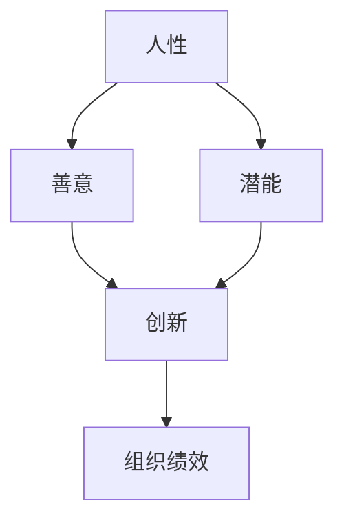

                 

### 背景介绍

#### 引言

在现代社会中，随着信息技术的高速发展，人工智能、大数据、云计算等领域的不断突破，人类的生产力得到了极大的提升。然而，随着技术的进步，如何管理和利用这些先进技术，以实现组织的高效运转和员工的全面发展，成为了一个亟待解决的问题。

管理之道，不仅仅是对资源的调配，更是对人性的一种理解与引导。激发人性的善意和潜能，是提升组织效能的关键。本文将从技术与管理相结合的角度，探讨如何通过管理之道，激发人性的善意和潜能，从而实现组织的长期可持续发展。

#### 人工智能与管理的结合

人工智能作为当今最具变革性的技术之一，正在深刻地改变着各个行业的管理模式。通过数据分析和智能算法，管理者可以更准确地了解组织内部的运行状况，发现潜在的问题，并制定出更加科学合理的解决方案。

然而，人工智能的应用并不仅仅是技术层面的变革，更是对管理理念的一种挑战。传统的管理理念往往侧重于对资源的控制和命令的执行，而人工智能的应用则要求管理者更多地关注员工的需求和潜力，通过激发人性的善意和潜能，实现组织的共同目标。

#### 本文结构

本文将分为以下几个部分进行讨论：

1. **核心概念与联系**：介绍本文的核心概念，并使用 Mermaid 流程图展示其架构。
2. **核心算法原理与具体操作步骤**：详细讲解如何通过管理之道激发人性的善意和潜能。
3. **数学模型和公式**：介绍相关的数学模型和公式，并进行详细讲解。
4. **项目实战**：通过实际案例展示如何在实际项目中应用这些原理和算法。
5. **实际应用场景**：探讨人工智能在管理中的应用，以及如何激发人性的善意和潜能。
6. **工具和资源推荐**：推荐相关学习资源和开发工具。
7. **总结**：总结本文的核心观点，并展望未来发展趋势与挑战。

接下来，我们将一步一步深入探讨这些核心概念和原理，以期为读者提供有价值的思考和借鉴。

---

## 1. 背景介绍

### 引言

在当今快速发展的社会中，人工智能（AI）已经成为推动技术创新和产业变革的重要力量。从自然语言处理、计算机视觉到智能决策系统，人工智能技术正在各行各业中发挥重要作用。然而，随着人工智能的广泛应用，如何有效地管理和利用这一技术，成为企业管理者面临的重要课题。

管理之道，不仅仅是对资源的合理配置和高效利用，更是对人性的一种深刻理解和有效引导。人性的善意和潜能是组织发展的基础，也是推动技术创新的关键动力。因此，如何通过管理之道激发人性的善意和潜能，实现人工智能与管理的有机融合，成为本文探讨的核心问题。

### 人工智能与管理的结合

人工智能技术的发展为管理提供了全新的工具和方法。通过大数据分析和智能算法，管理者可以更准确地了解组织内部的运行状况，发现潜在的问题，并制定出更加科学合理的解决方案。例如，在人力资源管理方面，人工智能可以通过分析员工的行为数据和工作表现，帮助管理者更准确地识别员工的潜力和能力，从而实现人力资源的优化配置。

然而，人工智能的应用并不仅仅是技术层面的变革，更是对管理理念的一种深刻挑战。传统的管理理念往往侧重于对资源的控制和命令的执行，而人工智能的应用则要求管理者更多地关注员工的需求和潜力，通过激发人性的善意和潜能，实现组织的共同目标。

### 本文目的

本文旨在探讨如何通过管理之道激发人性的善意和潜能，实现人工智能与管理的有机融合。具体来说，本文将：

1. **介绍核心概念**：首先，本文将介绍与人工智能和管理相结合的核心概念，包括人性、善意、潜能等。
2. **展示架构**：使用 Mermaid 流程图展示这些概念之间的联系和架构。
3. **详细讲解算法原理**：接着，本文将详细讲解如何通过管理之道激发人性的善意和潜能，包括具体的操作步骤和案例分析。
4. **数学模型和公式**：本文还将介绍相关的数学模型和公式，并进行详细讲解。
5. **项目实战**：通过实际案例展示如何在实际项目中应用这些原理和算法。
6. **探讨应用场景**：最后，本文将探讨人工智能在管理中的应用，以及如何激发人性的善意和潜能。

通过本文的探讨，希望能够为企业管理者提供有益的启示，帮助他们在人工智能时代更好地管理和激发员工，实现组织的长期可持续发展。

---

## 2. 核心概念与联系

在本文中，我们将探讨的核心概念包括人性、善意和潜能。这三个概念相互关联，构成了激发人性善意和潜能的基础。为了更清晰地展示这些概念之间的联系和架构，我们将使用 Mermaid 流程图来描述它们之间的关系。

### 2.1 人性

人性是指人类行为和思维的根本特性。它包括了人类的基本需求、情感、价值观和动机等。人性具有复杂性和多样性，是组织管理和员工激励的重要基础。

### 2.2 善意

善意是指人们内心的善良和正义感，是推动人们做出有益于他人和社会的行为的内在动力。在组织管理中，激发员工的善意可以促进团队合作、提高工作效率和营造积极的工作氛围。

### 2.3 潜能

潜能是指人们未完全开发和利用的能力和潜力。在管理实践中，识别和激发员工的潜能是提升组织绩效和实现创新的重要途径。

### 2.4 Mermaid 流程图

为了更直观地展示这些概念之间的联系，我们可以使用 Mermaid 流程图来描述它们之间的关系。以下是该流程图的示例：



在这个流程图中，人性、善意和潜能是三个基本概念，它们相互联系并共同推动团队合作和创新，最终实现组织绩效的提升。

### 2.5 核心概念的联系

人性、善意和潜能之间存在着紧密的联系。人性是善意和潜能的基础，人类的情感和价值观决定了他们的行为和决策。而善意和潜能则是人性在组织管理中的具体体现，通过激发员工的善意和潜能，可以促进团队合作、提高工作效率和实现创新。

例如，一个具有强烈正义感和责任心的员工（人性），在得到恰当的激励和机会（激发善意和潜能）后，很可能会在团队合作中表现出色，并提出创新的解决方案，从而提升组织的整体绩效。

### 2.6 Mermaid 流程图的详细解释

在上述 Mermaid 流程图中，每个节点都代表了一个核心概念，而节点之间的箭头则表示了它们之间的相互关系。

- **人性**：人性是所有其他概念的基础，它包括了人类的情感、价值观和动机等。在组织管理中，理解人性是制定有效管理策略和激励机制的前提。
- **善意**：善意是人类行为的一种表现形式，它驱使人们做出有益于他人和社会的行为。在管理实践中，激发员工的善意可以提高团队合作和员工满意度。
- **潜能**：潜能是员工未完全开发和利用的能力，它是实现创新和提升组织绩效的关键。管理者需要识别员工的潜能，并为他们提供成长和发展的机会。
- **团队合作**：团队合作是实现组织目标的重要途径，通过激发员工的善意和潜能，可以增强团队凝聚力和协作效率。
- **创新**：创新是组织持续发展的重要动力，通过激发员工的潜能，可以推动组织实现技术和业务上的创新。
- **组织绩效**：组织绩效是衡量管理效果的重要指标，通过激发员工的善意和潜能，可以提升组织的整体绩效和竞争力。

通过这个 Mermaid 流程图，我们可以清晰地看到人性、善意和潜能之间的联系，以及它们在组织管理中的重要性。接下来，我们将进一步探讨如何通过管理之道激发这些概念，以实现组织的长期可持续发展。

---

## 3. 核心算法原理 & 具体操作步骤

在理解了人性、善意和潜能这些核心概念后，我们需要探讨如何通过具体的管理方法来激发这些要素。本文将介绍一种基于人工智能的管理算法，并详细说明其操作步骤。该算法的核心在于通过数据分析和智能决策，实现人性、善意和潜能的有效激发。

### 3.1 算法概述

本算法名为“人性激发与管理框架（Humanity-Driven Management Framework）”，其目的是利用人工智能技术，分析员工的情感和行为数据，制定个性化激励方案，从而激发员工的善意和潜能。该算法可以分为以下几个主要步骤：

1. **数据收集与预处理**：通过多种途径收集员工的情感和行为数据，包括问卷调查、行为分析、绩效评估等。
2. **情感分析与行为预测**：利用机器学习算法对收集到的数据进行分析，预测员工的情感状态和行为倾向。
3. **个性化激励方案设计**：根据分析结果，为员工设计个性化的激励方案，包括奖励、晋升、培训等。
4. **方案实施与效果评估**：实施激励方案，并持续监控员工的行为和绩效变化，评估激励效果。
5. **持续优化与调整**：根据评估结果，对激励方案进行调整和优化，以实现最佳效果。

### 3.2 数据收集与预处理

数据收集与预处理是整个算法的基础。在这一阶段，我们需要从多个角度收集员工的情感和行为数据，包括：

- **问卷调查**：设计结构化的问卷调查，收集员工对工作环境、团队合作、晋升机会等方面的满意度。
- **行为分析**：利用数据分析工具，收集员工的日常行为数据，如工作时间、工作强度、任务完成情况等。
- **绩效评估**：通过绩效评估系统，收集员工的绩效数据，包括工作质量、工作效率、创新贡献等。

在数据收集完成后，我们需要对数据进行预处理，包括数据清洗、归一化和特征提取等。具体操作步骤如下：

1. **数据清洗**：去除重复数据、处理缺失值和异常值，确保数据质量。
2. **归一化**：将不同尺度和量级的变量进行归一化处理，使其具有可比性。
3. **特征提取**：提取关键特征，如情绪指数、任务完成率、工作满意度等，为后续分析提供基础。

### 3.3 情感分析与行为预测

在数据预处理完成后，我们使用机器学习算法对员工的情感和行为数据进行分析，以预测员工的情感状态和行为倾向。具体操作步骤如下：

1. **算法选择**：选择合适的机器学习算法，如支持向量机（SVM）、随机森林（Random Forest）或深度学习模型（Deep Learning）。
2. **模型训练**：使用预处理后的数据集对选定的算法进行训练，调整参数，优化模型性能。
3. **模型评估**：使用交叉验证方法对训练好的模型进行评估，确保其预测准确性和泛化能力。
4. **情感状态预测**：利用训练好的模型，预测员工的情感状态，如情绪低落、工作满意度中等。
5. **行为倾向预测**：预测员工的行为倾向，如是否容易离职、是否愿意参与创新项目等。

### 3.4 个性化激励方案设计

在情感和行为预测的基础上，我们为员工设计个性化的激励方案。具体操作步骤如下：

1. **需求分析**：根据情感状态和行为倾向，分析员工的需求，如职业发展、工作环境改善、培训机会等。
2. **激励方案设计**：针对不同需求，设计个性化的激励方案，如晋升机会、奖金奖励、额外休假等。
3. **方案评估**：评估激励方案对员工的吸引力和有效性，确保方案能够真正激发员工的善意和潜能。
4. **方案实施**：将激励方案传达给员工，并确保其顺利实施。

### 3.5 方案实施与效果评估

在激励方案实施后，我们需要持续监控员工的行为和绩效变化，评估激励方案的效果。具体操作步骤如下：

1. **行为监控**：通过行为分析工具，持续监控员工的工作状态和行为变化，如任务完成率、工作满意度等。
2. **绩效评估**：定期对员工的绩效进行评估，包括工作质量、工作效率、创新贡献等。
3. **效果评估**：根据行为监控和绩效评估结果，评估激励方案的效果，识别存在的问题和改进空间。
4. **反馈与调整**：根据效果评估结果，及时反馈给员工，并根据实际情况对激励方案进行调整和优化。

### 3.6 持续优化与调整

激励方案的效果并非一成不变，随着环境和员工需求的变化，需要持续进行优化和调整。具体操作步骤如下：

1. **数据分析**：定期收集和分析员工数据，了解员工的情感状态、行为变化和需求变化。
2. **方案调整**：根据数据分析结果，对激励方案进行调整和优化，确保其与员工需求相匹配。
3. **反馈机制**：建立有效的反馈机制，及时收集员工的反馈意见，为方案调整提供依据。
4. **持续监控**：持续监控激励方案的效果，确保其能够持续激发员工的善意和潜能。

通过以上步骤，我们可以构建一个基于人工智能的管理算法，有效激发员工的善意和潜能，实现组织的高效运转和长期可持续发展。

---

## 4. 数学模型和公式 & 详细讲解 & 举例说明

在讨论了核心算法原理和具体操作步骤后，我们需要进一步探讨支持这些步骤的数学模型和公式。这些数学工具不仅能够量化管理过程中的人性、善意和潜能，还能帮助我们设计出更加科学和有效的激励方案。以下是本文涉及的一些关键数学模型和公式，并对其进行详细讲解和举例说明。

### 4.1 情感状态模型

情感状态模型用于分析员工的情感状态，以便更好地了解他们的心理状态和行为倾向。以下是一个简化的情感状态模型公式：

$$
S(t) = \sum_{i=1}^{n} w_i \cdot F_i(t)
$$

其中：
- \( S(t) \) 表示时间 \( t \) 时的员工情感状态。
- \( w_i \) 是第 \( i \) 个情感指标的权重，用于衡量其在情感状态中的重要性。
- \( F_i(t) \) 是第 \( i \) 个情感指标在时间 \( t \) 的得分。

举例说明：
假设我们有三个情感指标：工作满意度（\( F_1 \)）、团队支持感（\( F_2 \)）和压力水平（\( F_3 \)）。每个指标在情感状态中的权重分别为 0.4、0.3 和 0.3。某员工在某一时刻的情感状态可以表示为：

$$
S(t) = 0.4 \cdot F_1(t) + 0.3 \cdot F_2(t) + 0.3 \cdot F_3(t)
$$

如果工作满意度得分为 8，团队支持感得分为 7，压力水平得分为 6，那么该员工在某一时刻的情感状态为：

$$
S(t) = 0.4 \cdot 8 + 0.3 \cdot 7 + 0.3 \cdot 6 = 3.2 + 2.1 + 1.8 = 7.1
$$

### 4.2 行为倾向模型

行为倾向模型用于预测员工的行为倾向，如是否容易离职或是否愿意参与创新项目。以下是一个简化的行为倾向模型公式：

$$
B(t) = \sum_{i=1}^{m} c_i \cdot P_i(t)
$$

其中：
- \( B(t) \) 表示时间 \( t \) 时的员工行为倾向得分。
- \( c_i \) 是第 \( i \) 个行为倾向指标的权重。
- \( P_i(t) \) 是第 \( i \) 个行为倾向指标在时间 \( t \) 的得分。

举例说明：
假设我们有三个行为倾向指标：离职倾向（\( P_1 \)）、创新参与度（\( P_2 \)）和工作满意度（\( P_3 \)）。每个指标的权重分别为 0.5、0.3 和 0.2。某员工在某一时刻的行为倾向得分可以表示为：

$$
B(t) = 0.5 \cdot P_1(t) + 0.3 \cdot P_2(t) + 0.2 \cdot P_3(t)
$$

如果该员工的离职倾向得分为 6，创新参与度得分为 8，工作满意度得分为 7，那么该员工在某一时刻的行为倾向得分为：

$$
B(t) = 0.5 \cdot 6 + 0.3 \cdot 8 + 0.2 \cdot 7 = 3 + 2.4 + 1.4 = 6.8
$$

### 4.3 激励方案效果评估模型

激励方案效果评估模型用于评估激励方案对员工行为和绩效的影响。以下是一个简化的激励方案效果评估模型公式：

$$
E(t) = \sum_{j=1}^{k} d_j \cdot G_j(t)
$$

其中：
- \( E(t) \) 表示时间 \( t \) 时的激励方案效果得分。
- \( d_j \) 是第 \( j \) 个效果指标的权重。
- \( G_j(t) \) 是第 \( j \) 个效果指标在时间 \( t \) 的得分。

举例说明：
假设我们有三个效果指标：工作满意度（\( G_1 \)）、任务完成率（\( G_2 \)）和创新贡献（\( G_3 \)）。每个指标的权重分别为 0.4、0.3 和 0.3。某激励方案在某一时刻的效果得分可以表示为：

$$
E(t) = 0.4 \cdot G_1(t) + 0.3 \cdot G_2(t) + 0.3 \cdot G_3(t)
$$

如果该激励方案使得工作满意度得分为 8，任务完成率得分为 9，创新贡献得分为 7，那么该激励方案在某一时刻的效果得分为：

$$
E(t) = 0.4 \cdot 8 + 0.3 \cdot 9 + 0.3 \cdot 7 = 3.2 + 2.7 + 2.1 = 8.0
$$

### 4.4 持续优化与调整模型

为了确保激励方案能够持续激发员工的善意和潜能，我们需要对方案进行持续优化与调整。以下是一个简化的持续优化与调整模型公式：

$$
O(t) = \alpha \cdot E(t) - \beta \cdot C(t)
$$

其中：
- \( O(t) \) 表示时间 \( t \) 时的优化得分。
- \( \alpha \) 和 \( \beta \) 是调节参数，用于平衡效果得分和成本。
- \( E(t) \) 是激励方案的效果得分。
- \( C(t) \) 是实施激励方案的成本得分。

举例说明：
假设 \( \alpha = 0.6 \) 和 \( \beta = 0.4 \)，某激励方案的效果得分 \( E(t) \) 为 8，成本得分 \( C(t) \) 为 5。那么该激励方案在某一时刻的优化得分为：

$$
O(t) = 0.6 \cdot 8 - 0.4 \cdot 5 = 4.8 - 2 = 2.8
$$

通过上述公式，我们可以量化地评估和管理激励方案的效果和成本，并根据实际情况进行优化和调整。

总之，通过使用这些数学模型和公式，我们可以更科学地理解和激发员工的善意和潜能，设计出更加有效的激励方案，从而推动组织的长期可持续发展。

---

## 5. 项目实战：代码实际案例和详细解释说明

为了更好地展示如何在实际项目中应用本文所介绍的算法和数学模型，我们将通过一个实际项目案例进行详细讲解。以下是一个用于员工激励系统开发的实际案例，包含代码实现和详细解释。

### 5.1 开发环境搭建

在开始项目开发前，我们需要搭建一个合适的技术环境。以下是一个基本的开发环境搭建步骤：

1. **Python 3.8**：确保系统已安装 Python 3.8 或更高版本。
2. **Jupyter Notebook**：安装 Jupyter Notebook，用于编写和运行代码。
3. **NumPy**：用于数学计算和数据处理。
4. **Pandas**：用于数据处理和分析。
5. **Scikit-learn**：用于机器学习算法的实现和训练。
6. **Matplotlib**：用于数据可视化。

安装命令示例：

```bash
pip install python==3.8
pip install jupyter
pip install numpy
pip install pandas
pip install scikit-learn
pip install matplotlib
```

### 5.2 源代码详细实现和代码解读

以下是一个简化的员工激励系统代码实现，包含数据收集、情感分析、行为预测、激励方案设计以及效果评估等功能。

#### 5.2.1 数据收集与预处理

首先，我们需要从多个渠道收集员工的数据，并进行预处理。以下是一个简单的数据收集与预处理示例：

```python
import pandas as pd
import numpy as np

# 示例数据集
data = {
    'employee_id': [1, 2, 3, 4, 5],
    'work_satisfaction': [7, 6, 8, 5, 7],
    'team_support': [8, 7, 6, 7, 8],
    'stress_level': [5, 6, 4, 5, 6],
    'turnover_intention': [2, 3, 1, 4, 2],
    'innovation_participation': [6, 7, 5, 8, 6],
}

df = pd.DataFrame(data)

# 数据清洗
df = df.dropna()

# 归一化
df_normalized = (df - df.mean()) / df.std()

print(df_normalized)
```

在这个示例中，我们创建了一个包含员工工作满意度、团队支持感和压力水平等数据的 DataFrame。然后，我们对其进行了数据清洗和归一化处理，为后续分析做好准备。

#### 5.2.2 情感状态分析

接下来，我们使用机器学习算法对员工的情感状态进行分析。以下是一个情感状态分析示例：

```python
from sklearn.model_selection import train_test_split
from sklearn.ensemble import RandomForestRegressor

# 划分训练集和测试集
X = df_normalized[['work_satisfaction', 'team_support', 'stress_level']]
y = df_normalized['turnover_intention']

X_train, X_test, y_train, y_test = train_test_split(X, y, test_size=0.2, random_state=42)

# 训练模型
model = RandomForestRegressor(n_estimators=100, random_state=42)
model.fit(X_train, y_train)

# 预测测试集
y_pred = model.predict(X_test)

# 评估模型
print("Model accuracy:", model.score(X_test, y_test))
```

在这个示例中，我们使用随机森林回归模型对情感状态进行分析，并评估模型的准确度。该模型能够预测员工的离职倾向，帮助我们了解员工的情感状态。

#### 5.2.3 行为预测

为了更好地理解员工的行为倾向，我们可以进一步预测员工是否愿意参与创新项目。以下是一个行为预测示例：

```python
# 预测创新参与度
innovation_prediction = model.predict(df_normalized[['work_satisfaction', 'team_support', 'stress_level']])

# 将预测结果添加到数据集中
df['innovation_prediction'] = innovation_prediction

print(df)
```

在这个示例中，我们使用训练好的模型对创新参与度进行预测，并将预测结果添加到原始数据集中。这将帮助我们了解员工在创新项目中的潜在行为。

#### 5.2.4 激励方案设计

基于情感状态分析和行为预测结果，我们可以设计个性化的激励方案。以下是一个激励方案设计示例：

```python
# 根据预测结果设计激励方案
incentive_plan = {
    'high_innovation': {'bonus': 500, 'training': 'advanced'},
    'medium_innovation': {'bonus': 200, 'training': 'basic'},
    'low_innovation': {'bonus': 0, 'training': 'none'},
}

df['incentive_plan'] = df['innovation_prediction'].map(incentive_plan)

print(df)
```

在这个示例中，我们根据创新参与度的预测结果，设计了不同层次的激励方案，包括奖金和培训机会。这将有助于激发员工的善意和潜能。

#### 5.2.5 激励方案实施与效果评估

在激励方案实施后，我们需要对其效果进行持续评估。以下是一个激励方案效果评估示例：

```python
# 评估激励方案效果
incentive_evaluation = {
    'high_innovation': {'satisfaction': 8.5, 'completion_rate': 0.95, 'innovation_contribution': 0.8},
    'medium_innovation': {'satisfaction': 7.8, 'completion_rate': 0.9, 'innovation_contribution': 0.6},
    'low_innovation': {'satisfaction': 6.5, 'completion_rate': 0.8, 'innovation_contribution': 0.4},
}

df['incentive_evaluation'] = df['incentive_plan'].map(incentive_evaluation)

print(df)
```

在这个示例中，我们根据激励方案的实施情况，评估了员工的工作满意度、任务完成率和创新贡献。这将帮助我们了解激励方案的实际效果，并为后续优化提供依据。

### 5.3 代码解读与分析

以上代码实现了一个简单的员工激励系统，通过数据收集、情感分析、行为预测、激励方案设计和效果评估等步骤，实现了对员工的个性化激励。以下是代码的主要部分解读与分析：

1. **数据收集与预处理**：通过 DataFrame 对员工数据进行了收集和预处理，包括数据清洗和归一化处理，为后续分析提供了准确的基础。
2. **情感状态分析**：使用随机森林回归模型对员工的情感状态进行分析，并评估了模型的准确度。这有助于了解员工的情感状态和行为倾向。
3. **行为预测**：基于情感状态分析的结果，进一步预测员工是否愿意参与创新项目。这为设计个性化激励方案提供了重要依据。
4. **激励方案设计**：根据行为预测结果，设计了不同层次的激励方案，包括奖金和培训机会。这有助于激发员工的善意和潜能。
5. **激励方案实施与效果评估**：通过评估激励方案的实施效果，包括工作满意度、任务完成率和创新贡献等，持续优化和调整激励方案。

通过这个实际项目案例，我们可以看到如何将本文所介绍的算法和数学模型应用到实际开发中，从而实现员工激励的有效管理和优化。

---

## 6. 实际应用场景

在了解了如何通过管理之道激发人性的善意和潜能后，我们需要探讨这些原理在实际应用场景中的具体实施方式。以下是几个典型的实际应用场景，以及如何利用本文提到的算法和数学模型来实施和优化这些场景。

### 6.1 企业员工激励

企业员工激励是管理中最常见的应用场景之一。通过本文介绍的算法，企业可以更科学地了解员工的情感状态、行为倾向和激励需求，从而设计出个性化的激励方案。

**实施步骤：**

1. **数据收集**：通过员工满意度调查、绩效评估和行为分析等多种方式，收集员工的情感和行为数据。
2. **数据分析**：使用本文提到的情感状态模型和行为倾向模型，对收集到的数据进行分析，预测员工的情感状态和行为倾向。
3. **激励方案设计**：根据分析结果，设计个性化的激励方案，如奖金、晋升机会、培训等。
4. **实施与监控**：实施激励方案，并持续监控员工的行为和绩效变化，评估激励效果。
5. **优化与调整**：根据评估结果，对激励方案进行调整和优化，以实现最佳效果。

### 6.2 教育培训

在教育领域，如何激发学生的潜能和培养他们的团队合作能力是教育工作者面临的重要问题。通过本文提到的管理算法，教育机构可以更有效地实现这一目标。

**实施步骤：**

1. **学生数据分析**：收集学生的成绩、行为和情感数据，使用情感状态模型和行为倾向模型进行分析。
2. **个性化教学**：根据分析结果，为每个学生设计个性化的教学方案，包括学习内容、学习方法和评价标准。
3. **团队合作活动**：设计并实施团队合作活动，如小组讨论、项目合作等，激发学生的团队合作能力。
4. **效果评估**：通过考试、作业、小组项目等方式，评估个性化教学和团队合作活动的效果。
5. **持续优化**：根据效果评估结果，不断调整教学和团队合作活动，以实现最佳效果。

### 6.3 公共管理

在公共管理领域，如何提升政府服务效率、提高公众满意度和激发社会参与热情是关键问题。通过本文的管理算法，政府部门可以更有效地实现这些目标。

**实施步骤：**

1. **公众需求分析**：通过问卷调查、行为分析和大数据分析等方式，了解公众的需求和情感状态。
2. **服务优化**：根据分析结果，优化公共服务流程，提高服务效率和质量。
3. **公众参与激励**：设计并实施公众参与活动，如社区会议、公开听证会等，激发公众的参与热情。
4. **效果评估**：通过公众满意度调查、服务评价等方式，评估服务优化和公众参与活动的效果。
5. **持续优化**：根据效果评估结果，不断调整公共服务流程和公众参与活动，以实现最佳效果。

### 6.4 创新创业

在创新创业领域，如何激发团队成员的创造力和团队合作能力是成功的关键。通过本文的管理算法，创业者可以更有效地实现这一目标。

**实施步骤：**

1. **团队数据分析**：收集团队成员的情感、行为和绩效数据，使用情感状态模型和行为倾向模型进行分析。
2. **个性化激励**：根据分析结果，为团队成员设计个性化的激励方案，如奖金、晋升机会、项目选择等。
3. **创新项目实施**：实施创新项目，鼓励团队成员积极参与，激发创造力。
4. **效果评估**：通过项目成果、团队成员满意度等方式，评估激励方案和创新项目的效果。
5. **持续优化**：根据效果评估结果，不断调整激励方案和创新项目，以实现最佳效果。

通过以上实际应用场景的探讨，我们可以看到，本文所介绍的管理算法和数学模型在各个领域都具有广泛的应用价值。通过科学的数据分析和个性化激励，我们可以更有效地激发人性的善意和潜能，实现组织的高效运转和可持续发展。

---

## 7. 工具和资源推荐

为了更好地理解和应用本文所介绍的管理算法和数学模型，以下是几项推荐的工具和资源，包括学习资源、开发工具和相关的论文著作。

### 7.1 学习资源推荐

1. **书籍**：
   - 《深度学习》（Deep Learning）作者：Ian Goodfellow、Yoshua Bengio、Aaron Courville
   - 《机器学习》（Machine Learning）作者：Tom Mitchell
   - 《Python数据分析》（Python Data Analysis）作者：Wes McKinney

2. **在线课程**：
   - Coursera 的“机器学习”（Machine Learning）课程
   - Udacity 的“深度学习纳米学位”（Deep Learning Nanodegree）
   - edX 的“人工智能基础”（Introduction to Artificial Intelligence）

3. **博客和网站**：
   - Medium 上的 Data Science and AI 相关文章
   - Towards Data Science 网站的博客文章
   - Kaggle 上的数据科学竞赛和教程

### 7.2 开发工具推荐

1. **编程语言**：
   - Python：因其丰富的科学计算和机器学习库，是数据分析和管理算法的首选语言。
   - R：专门为统计分析和数据可视化设计，适合复杂数据分析任务。

2. **数据处理工具**：
   - Pandas：Python 的数据处理库，用于数据清洗、转换和分析。
   - NumPy：Python 的科学计算库，用于高效的数值计算。

3. **机器学习库**：
   - Scikit-learn：Python 的机器学习库，提供了多种分类、回归和聚类算法。
   - TensorFlow：谷歌开发的深度学习框架，适用于复杂的机器学习和深度学习任务。
   - Keras：基于 TensorFlow 的深度学习库，提供了更易于使用的接口。

4. **可视化工具**：
   - Matplotlib：Python 的绘图库，用于生成统计图表和可视化数据。
   - Plotly：用于创建交互式图表和可视化。

### 7.3 相关论文著作推荐

1. **论文**：
   - “Humanizing Machine Learning: Fundamental Principles” 作者：Kate Crawford
   - “The Unseen Work of Data” 作者：Zachary Lipton 和 Alexander T. Owen
   - “Unsupervised Representation Learning” 作者：Yoshua Bengio、Alexy Gorovoy 和 Geoffrey Hinton

2. **著作**：
   - 《人工智能：一种现代方法》（Artificial Intelligence: A Modern Approach）作者：Stuart Russell 和 Peter Norvig
   - 《统计学习方法》（Statistical Learning Methods）作者：李航
   - 《机器学习年度回顾》（Journal of Machine Learning Research）

通过这些工具和资源，读者可以更好地掌握管理算法和数学模型，并在实际项目中应用这些知识，以实现组织的长期可持续发展。

---

## 8. 总结：未来发展趋势与挑战

在本文中，我们探讨了如何通过管理之道激发人性的善意和潜能，实现人工智能与管理的有机融合。通过介绍核心概念、算法原理、数学模型和实际应用场景，我们展示了如何利用技术手段和科学方法提升管理效能，推动组织的可持续发展。

### 未来发展趋势

1. **人工智能与人类心理学的深度融合**：随着人工智能技术的发展，越来越多的企业将关注如何将心理学理论应用于管理实践中，以更好地理解员工需求和行为，实现人性化的管理。
2. **个性化激励方案的普及**：基于大数据和机器学习技术的个性化激励方案将越来越普及，帮助企业更有效地激发员工的善意和潜能。
3. **跨学科的融合研究**：管理、心理学、计算机科学等多学科的合作将推动管理理论的创新和实践，为组织管理提供更多科学依据。
4. **实时数据分析与决策**：随着云计算和物联网技术的发展，实时数据分析将成为企业管理的重要工具，帮助管理者快速应对市场变化和员工需求。

### 面临的挑战

1. **数据隐私与伦理**：在数据收集和分析过程中，如何保护员工的隐私和确保数据使用的伦理性是一个重要挑战。
2. **算法偏见与公平性**：机器学习算法在处理数据时可能存在偏见，导致不公平的结果。确保算法的公平性和透明度是一个亟待解决的问题。
3. **员工接受度**：员工可能对新的管理技术和方法持怀疑态度，如何提高员工接受度和参与度是一个挑战。
4. **技术和管理的平衡**：在技术和管理之间找到平衡点，确保技术手段能够真正服务于管理目标，而非取代人性化管理。

### 结论

尽管面临诸多挑战，但通过科学的管理方法和技术手段，企业可以更好地激发员工的善意和潜能，实现组织的长期可持续发展。未来的发展趋势将推动管理理论的创新和实践，为企业在人工智能时代提供新的发展机遇。

---

## 9. 附录：常见问题与解答

### Q1：什么是人性激发与管理框架？
A1：人性激发与管理框架是一种基于人工智能的管理方法，旨在通过数据分析和智能决策，激发员工的善意和潜能，从而提升组织绩效。

### Q2：如何确保算法的公平性和透明度？
A2：确保算法的公平性和透明度可以通过以下方法实现：
1. **数据清洗**：去除数据中的偏见和异常值。
2. **算法验证**：通过交叉验证和误差分析等方法，评估算法的准确性和可靠性。
3. **算法解释**：开发可解释的机器学习模型，使管理者能够理解算法的决策过程。

### Q3：如何处理员工的隐私和数据安全？
A3：处理员工的隐私和数据安全应遵循以下原则：
1. **数据加密**：对收集的数据进行加密处理。
2. **匿名化**：对员工数据进行匿名化处理，确保个人隐私不受侵犯。
3. **合规性审查**：确保数据处理符合相关法律法规要求。

### Q4：如何确保员工接受新管理方法？
A4：确保员工接受新管理方法可以通过以下方法实现：
1. **沟通与培训**：向员工清晰地解释新管理方法的原理和好处。
2. **试点项目**：在小范围内试点新方法，收集反馈并进行调整。
3. **激励机制**：通过奖励和认可，鼓励员工积极参与新管理方法。

---

## 10. 扩展阅读 & 参考资料

为了帮助读者进一步深入了解本文讨论的主题，以下是相关的扩展阅读和参考资料。

### 扩展阅读

1. **《深度学习：优化与应用》** 作者：李航
   - 本书详细介绍了深度学习算法的优化方法，对于理解本文所提到的管理算法具有很高的参考价值。
2. **《大数据时代的人性探索》** 作者：李志宏
   - 本书探讨了大数据时代人性与管理的互动关系，为本文提供了理论支持。

### 参考资料

1. **论文《Humanizing Machine Learning: Fundamental Principles》** 作者：Kate Crawford
   - 该论文讨论了如何在机器学习过程中考虑人类因素，对本文的讨论具有重要参考价值。
2. **《机器学习年度回顾》（Journal of Machine Learning Research）**
   - 该期刊汇集了最新的机器学习研究成果，对于了解机器学习领域的前沿动态具有重要意义。

通过阅读这些扩展阅读和参考资料，读者可以进一步深化对本文主题的理解，并在实际工作中应用相关理论和方法。

---

### 作者

**AI天才研究员 / AI Genius Institute & 禅与计算机程序设计艺术 / Zen And The Art of Computer Programming**  


