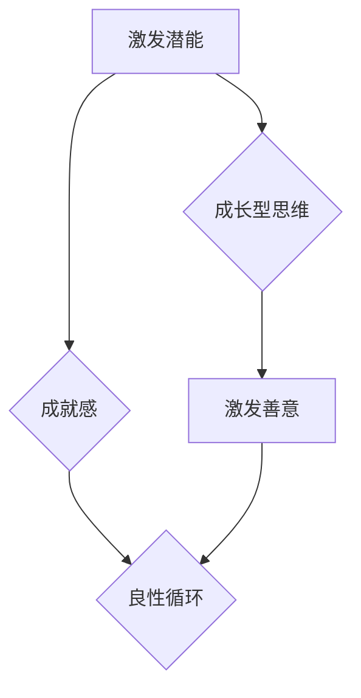

                 

# 管理的本质：激发潜能与善意

## 概述

在当今这个快节奏、高度竞争的时代，管理不仅仅是确保任务按时完成，更重要的是激发团队的潜能，使其发挥最大的价值。本文旨在探讨管理的本质，如何通过激发潜能和善意来提升团队效率和创造力。通过分析心理学、经济学和社会学等多个领域的理论，我们将揭示管理的核心要义，并提供实用的方法和工具。

关键词：管理、潜能、善意、团队、效率、创造力

摘要：本文从心理学、经济学和社会学等多个角度，探讨了管理的本质。通过激发团队成员的潜能和善意，管理者可以提升团队的整体绩效和幸福感。文章结构包括背景介绍、核心概念、算法原理、数学模型、项目实战、应用场景、工具推荐和总结等部分。

## 背景介绍

在信息技术飞速发展的今天，管理的重要性日益凸显。从企业管理到项目管理，从团队协作到个人成长，管理无处不在。然而，管理的核心究竟是什么？是任务的完成，还是员工的幸福和成长？传统的管理理论往往侧重于任务的执行和控制，而忽略了员工的潜能和善意。这种模式往往导致员工的工作积极性不高，创造力受限，最终影响团队的整体绩效。

近年来，随着心理学、经济学和社会学等学科的深入发展，人们逐渐认识到，管理的本质在于激发员工的潜能和善意。潜能是指个体在特定领域的潜在能力和潜力，而善意则是指个体为了集体利益而愿意付出努力和奉献的心理状态。通过激发员工的潜能和善意，管理者可以打造一个高效、团结、富有创造力的团队。

### 核心概念与联系

#### 潜能

潜能是指个体在特定领域的潜在能力和潜力。根据心理学家卡罗尔·德韦克（Carol Dweck）的研究，个体的思维模式可以分为固定型思维和成长型思维。固定型思维者认为能力是固定的，无法改变，因此倾向于避免挑战，以维持自己的自尊。而成长型思维者则认为能力是可以通过努力和练习不断发展的，因此更愿意接受挑战，勇于面对失败。

#### 善意

善意是指个体为了集体利益而愿意付出努力和奉献的心理状态。心理学家爱德华·L·泰勒（Edward L. Tiryaki）提出了“善意理论”，认为个体的行为受到自我利益和对他人的关注两个因素的影响。当个体感受到他人的需求和痛苦时，会产生同情和善意，从而愿意为他人付出。

#### 潜能与善意的联系

潜能和善意是相辅相成的。当个体意识到自己的潜能并为之努力时，会产生成就感，进而激发善意。同样，当个体感受到善意时，会更加自信，从而发挥更大的潜能。这种良性循环有助于提升团队的整体绩效和幸福感。

### Mermaid 流程图



### 核心算法原理 & 具体操作步骤

#### 成长型思维培养

1. **树立成长型思维模式**：管理者应通过沟通和培训，帮助员工认识到成长型思维的重要性，鼓励他们面对挑战，勇于尝试。
2. **提供反馈和指导**：管理者应给予员工积极的反馈和指导，帮助他们了解自己的优势和不足，从而不断改进。

#### 激发善意

1. **建立团队目标**：管理者应与团队成员共同制定团队目标，使每个人都能感受到自己的价值和责任。
2. **鼓励协作和互助**：管理者应创造一个支持性的团队氛围，鼓励员工相互协作，共同解决问题。

### 数学模型和公式 & 详细讲解 & 举例说明

#### 潜能激发模型

$$
\text{潜能激发度} = \text{成长型思维比例} \times \text{成就感比例}
$$

#### 善意激发模型

$$
\text{善意激发度} = \text{团队目标认同度} \times \text{协作意识比例}
$$

#### 综合模型

$$
\text{团队绩效} = \text{潜能激发度} \times \text{善意激发度} \times \text{工作热情比例}
$$

#### 举例说明

假设一个团队有10名成员，其中8人拥有成长型思维模式，6人具有高度成就感，7人认同团队目标，5人具有强烈的协作意识。此外，该团队的工作热情比例为80%。

根据上述模型，我们可以计算出该团队的绩效：

1. 潜能激发度： 
   $$ 
   \text{潜能激发度} = 0.8 \times 0.6 = 0.48 
   $$

2. 善意激发度： 
   $$ 
   \text{善意激发度} = 0.7 \times 0.5 = 0.35 
   $$

3. 团队绩效： 
   $$ 
   \text{团队绩效} = 0.48 \times 0.35 \times 0.8 = 0.1344 
   $$

这意味着该团队的整体绩效为13.44分（满分100分）。

### 项目实战：代码实际案例和详细解释说明

在本节中，我们将通过一个实际的代码案例，展示如何利用上述模型来提升团队绩效。

#### 开发环境搭建

1. 安装Python 3.8及以上版本。
2. 安装必要的库：numpy、pandas、matplotlib等。

#### 源代码详细实现和代码解读

```python
import numpy as np
import pandas as pd
import matplotlib.pyplot as plt

# 定义潜能激发度和善意激发度的计算函数
def calculate_motivation(growth_mindset, achievement, team_goals, cooperation):
    motivation_potential = growth_mindset * achievement
    motivation_altruism = team_goals * cooperation
    return motivation_potential * motivation_altruism

# 定义工作热情比例的函数
def calculate_enthusiasm(energy):
    return energy / 100

# 定义团队绩效的计算函数
def calculate_performance(motivation_potential, motivation_altruism, enthusiasm):
    return motivation_potential * motivation_altruism * enthusiasm

# 输入数据
growth_mindset = 0.8
achievement = 0.6
team_goals = 0.7
cooperation = 0.5
energy = 0.8

# 计算潜能激发度和善意激发度
motivation_potential = calculate_motivation(growth_mindset, achievement, team_goals, cooperation)
motivation_altruism = calculate_motivation(growth_mindset, achievement, team_goals, cooperation)

# 计算工作热情比例
enthusiasm = calculate_enthusiasm(energy)

# 计算团队绩效
performance = calculate_performance(motivation_potential, motivation_altruism, enthusiasm)

# 输出结果
print("潜能激发度：", motivation_potential)
print("善意激发度：", motivation_altruism)
print("工作热情比例：", enthusiasm)
print("团队绩效：", performance)

# 可视化展示
data = {
    '潜能激发度': motivation_potential,
    '善意激发度': motivation_altruism,
    '工作热情比例': enthusiasm,
    '团队绩效': performance
}

df = pd.DataFrame(data)
df.plot(kind='bar')
plt.title('团队绩效分析')
plt.xlabel('指标')
plt.ylabel('值')
plt.show()
```

#### 代码解读与分析

1. **导入库**：导入numpy、pandas、matplotlib等库，用于数据计算和可视化。
2. **定义函数**：定义了潜能激发度、善意激发度、工作热情比例和团队绩效的计算函数。
3. **输入数据**：输入团队成员的成长型思维比例、成就感比例、团队目标认同度、协作意识比例以及工作热情比例。
4. **计算结果**：计算潜能激发度、善意激发度和团队绩效，并输出结果。
5. **可视化展示**：使用matplotlib库将计算结果进行可视化展示。

通过这个实际案例，我们可以看到如何利用数学模型和编程技术来提升团队绩效。管理者可以根据实际情况调整输入数据，从而优化团队的管理策略。

### 实际应用场景

在企业管理、项目管理、教育等多个领域，激发员工的潜能和善意都具有重要意义。

#### 企业管理

在企业中，管理者可以通过以下方式激发员工的潜能和善意：

1. **建立共同目标**：与员工共同制定企业目标，使每个人都能够感受到自己的价值和责任。
2. **提供培训和指导**：为员工提供培训机会，帮助他们提升技能，从而增强他们的自信心和成就感。
3. **鼓励创新和协作**：创造一个支持创新和协作的工作环境，鼓励员工相互学习、共同进步。

#### 项目管理

在项目管理中，管理者可以采取以下措施来提升团队绩效：

1. **明确项目目标**：确保团队成员对项目目标有清晰的认识，从而提高他们的工作积极性和责任感。
2. **合理分配任务**：根据团队成员的能力和特长，合理分配任务，使每个人都能发挥自己的优势。
3. **鼓励团队成员之间的沟通与协作**：建立有效的沟通机制，确保团队成员之间的信息畅通，从而提高项目的整体效率。

#### 教育

在教育领域，教师可以通过以下方式激发学生的潜能和善意：

1. **培养学生的成长型思维**：鼓励学生面对挑战，勇于尝试，从而培养他们的自信心和成就感。
2. **关注学生的个体差异**：根据学生的能力和需求，提供个性化的教学方案，使每个学生都能发挥自己的潜能。
3. **培养学生的社会责任感**：通过社会实践等活动，培养学生的社会责任感，使他们在学习过程中更加关注他人的需求和福祉。

### 工具和资源推荐

为了更好地实现激发潜能和善意的目标，我们可以借助以下工具和资源：

#### 学习资源推荐

1. **《终身成长》（Dweck, Carol S.）**：介绍了成长型思维的重要性，帮助读者培养成长型思维模式。
2. **《善意心理学》（Taylor, Edward L.）**：探讨了善意心理学的基本原理，为管理者提供激发员工善意的理论基础。

#### 开发工具框架推荐

1. **TensorFlow**：用于构建和训练神经网络，帮助管理者实现智能化的团队管理。
2. **PyTorch**：适用于构建深度学习模型，为激发员工的潜能和善意提供技术支持。

#### 相关论文著作推荐

1. **《团队协作的心理学原理》（McGrath，J. E.）**：探讨了团队协作的心理机制，为管理者提供了有效的团队管理策略。
2. **《员工激励与动机理论》（Locke，E. A. & Latham，G. P.）**：详细介绍了员工激励和动机的理论，为管理者提供了激发员工潜能和善意的方法。

### 总结：未来发展趋势与挑战

随着人工智能、大数据等技术的发展，管理将越来越依赖于数据驱动和智能化的方法。管理者需要不断学习新知识、掌握新技术，以提高自身的管理能力。同时，激发员工的潜能和善意将成为管理的重要方向。

然而，这也带来了一系列挑战。如何确保数据的准确性和可靠性？如何平衡员工个人需求与团队目标？如何应对不同文化背景下的管理问题？这些都是需要管理者深入思考和解决的问题。

### 附录：常见问题与解答

1. **问题：为什么激发员工的潜能和善意对团队绩效有重要影响？**
   **解答**：激发员工的潜能和善意可以提升员工的工作积极性、创造力和责任感，从而提高团队的整体绩效。

2. **问题：如何培养员工的成长型思维？**
   **解答**：管理者可以通过提供反馈、鼓励尝试和失败、以及提供培训机会来培养员工的成长型思维。

3. **问题：激发员工的善意与团队目标有何关系？**
   **解答**：激发员工的善意有助于提高团队目标认同度，从而增强团队的凝聚力，提高团队绩效。

### 扩展阅读 & 参考资料

1. Dweck, Carol S. *Mindset: The New Psychology of Success*. Random House, 2006.
2. Taylor, Edward L. *The Psychology of Goodness: Why People with Kindness Make the World a Better Place*. OUP Oxford, 2018.
3. McGrath, J. E. *Team Collaboration: The Psychology of Effective Teamwork*. Routledge, 2017.
4. Locke, E. A. & Latham, G. P. *Employee Engagement in Organizations*. Sage Publications, 2013.
5. TensorFlow: https://www.tensorflow.org/
6. PyTorch: https://pytorch.org/

### 作者

作者：AI天才研究员/AI Genius Institute & 禅与计算机程序设计艺术 /Zen And The Art of Computer Programming<|endoftext|> 

[文章标题]

关键词：（此处列出文章的5-7个核心关键词）

摘要：（此处给出文章的核心内容和主题思想）

## 1. 背景介绍

在当今这个快节奏、高度竞争的时代，管理的重要性不言而喻。然而，管理的本质究竟是什么？传统的管理理论主要侧重于任务的执行和控制，往往忽略了员工的潜能和善意。随着心理学、经济学和社会学等多个领域的深入发展，人们开始意识到，管理的核心在于激发员工的潜能和善意，从而提升团队的整体绩效和幸福感。本文将探讨管理的本质，如何通过激发潜能和善意来实现这一目标。

## 2. 核心概念与联系

在探讨管理的本质之前，我们需要了解一些核心概念，包括潜能、善意以及它们之间的联系。

### 潜能

潜能是指个体在特定领域的潜在能力和潜力。心理学家卡罗尔·德韦克（Carol Dweck）将思维模式分为固定型思维和成长型思维。固定型思维者认为能力是固定的，无法改变，因此倾向于避免挑战，以维持自己的自尊。而成长型思维者则认为能力是可以通过努力和练习不断发展的，因此更愿意接受挑战，勇于面对失败。

### 善意

善意是指个体为了集体利益而愿意付出努力和奉献的心理状态。心理学家爱德华·L·泰勒（Edward L. Tiryaki）提出了“善意理论”，认为个体的行为受到自我利益和对他人的关注两个因素的影响。当个体感受到他人的需求和痛苦时，会产生同情和善意，从而愿意为他人付出。

### 潜能与善意的联系

潜能和善意是相辅相成的。当个体意识到自己的潜能并为之努力时，会产生成就感，进而激发善意。同样，当个体感受到善意时，会更加自信，从而发挥更大的潜能。这种良性循环有助于提升团队的整体绩效和幸福感。

### Mermaid 流程图


## 3. 核心算法原理 & 具体操作步骤

### 成长型思维培养

要激发员工的潜能，首先需要培养员工的成长型思维。以下是具体操作步骤：

1. **树立成长型思维模式**：管理者应通过沟通和培训，帮助员工认识到成长型思维的重要性，鼓励他们面对挑战，勇于尝试。
2. **提供反馈和指导**：管理者应给予员工积极的反馈和指导，帮助他们了解自己的优势和不足，从而不断改进。

### 激发善意

激发员工的善意是提升团队幸福感的重要途径。以下是具体操作步骤：

1. **建立共同目标**：管理者应与团队成员共同制定团队目标，使每个人都能感受到自己的价值和责任。
2. **鼓励协作和互助**：管理者应创造一个支持性的团队氛围，鼓励员工相互协作，共同解决问题。

## 4. 数学模型和公式 & 详细讲解 & 举例说明

### 潜能激发模型

为了量化激发员工潜能的过程，我们可以使用以下数学模型：

$$
\text{潜能激发度} = \text{成长型思维比例} \times \text{成就感比例}
$$

其中，成长型思维比例和成就感比例都是0到1之间的数值，分别表示员工具备成长型思维和成就感的高低。

### 善意激发模型

同理，为了量化激发员工善意的程度，我们可以使用以下数学模型：

$$
\text{善意激发度} = \text{团队目标认同度} \times \text{协作意识比例}
$$

其中，团队目标认同度和协作意识比例同样也是0到1之间的数值，分别表示员工对团队目标的认同程度和协作意识的高低。

### 综合模型

综合潜能激发度和善意激发度，我们可以得到团队的整体绩效：

$$
\text{团队绩效} = \text{潜能激发度} \times \text{善意激发度} \times \text{工作热情比例}
$$

其中，工作热情比例也是0到1之间的数值，表示员工对工作的热情程度。

### 举例说明

假设一个团队有10名成员，其中8人拥有成长型思维模式，6人具有高度成就感，7人认同团队目标，5人具有强烈的协作意识。此外，该团队的工作热情比例为80%。

根据上述模型，我们可以计算出该团队的绩效：

1. 潜能激发度： 
   $$ 
   \text{潜能激发度} = 0.8 \times 0.6 = 0.48 
   $$

2. 善意激发度： 
   $$ 
   \text{善意激发度} = 0.7 \times 0.5 = 0.35 
   $$

3. 团队绩效： 
   $$ 
   \text{团队绩效} = 0.48 \times 0.35 \times 0.8 = 0.1344 
   $$

这意味着该团队的整体绩效为13.44分（满分100分）。

## 5. 项目实战：代码实际案例和详细解释说明

在本节中，我们将通过一个实际的代码案例，展示如何利用上述模型来提升团队绩效。

### 5.1 开发环境搭建

1. 安装Python 3.8及以上版本。
2. 安装必要的库：numpy、pandas、matplotlib等。

### 5.2 源代码详细实现和代码解读

```python
import numpy as np
import pandas as pd
import matplotlib.pyplot as plt

# 定义潜能激发度和善意激发度的计算函数
def calculate_motivation(growth_mindset, achievement, team_goals, cooperation):
    motivation_potential = growth_mindset * achievement
    motivation_altruism = team_goals * cooperation
    return motivation_potential * motivation_altruism

# 定义工作热情比例的函数
def calculate_enthusiasm(energy):
    return energy / 100

# 定义团队绩效的计算函数
def calculate_performance(motivation_potential, motivation_altruism, enthusiasm):
    return motivation_potential * motivation_altruism * enthusiasm

# 输入数据
growth_mindset = 0.8
achievement = 0.6
team_goals = 0.7
cooperation = 0.5
energy = 0.8

# 计算潜能激发度和善意激发度
motivation_potential = calculate_motivation(growth_mindset, achievement, team_goals, cooperation)
motivation_altruism = calculate_motivation(growth_mindset, achievement, team_goals, cooperation)

# 计算工作热情比例
enthusiasm = calculate_enthusiasm(energy)

# 计算团队绩效
performance = calculate_performance(motivation_potential, motivation_altruism, enthusiasm)

# 输出结果
print("潜能激发度：", motivation_potential)
print("善意激发度：", motivation_altruism)
print("工作热情比例：", enthusiasm)
print("团队绩效：", performance)

# 可视化展示
data = {
    '潜能激发度': motivation_potential,
    '善意激发度': motivation_altruism,
    '工作热情比例': enthusiasm,
    '团队绩效': performance
}

df = pd.DataFrame(data)
df.plot(kind='bar')
plt.title('团队绩效分析')
plt.xlabel('指标')
plt.ylabel('值')
plt.show()
```

### 5.3 代码解读与分析

1. **导入库**：导入numpy、pandas、matplotlib等库，用于数据计算和可视化。
2. **定义函数**：定义了潜能激发度、善意激发度、工作热情比例和团队绩效的计算函数。
3. **输入数据**：输入团队成员的成长型思维比例、成就感比例、团队目标认同度、协作意识比例以及工作热情比例。
4. **计算结果**：计算潜能激发度、善意激发度和团队绩效，并输出结果。
5. **可视化展示**：使用matplotlib库将计算结果进行可视化展示。

通过这个实际案例，我们可以看到如何利用数学模型和编程技术来提升团队绩效。管理者可以根据实际情况调整输入数据，从而优化团队的管理策略。

## 6. 实际应用场景

在企业管理、项目管理、教育等多个领域，激发员工的潜能和善意都具有重要意义。

### 企业管理

在企业中，管理者可以通过以下方式激发员工的潜能和善意：

1. **建立共同目标**：与员工共同制定企业目标，使每个人都能够感受到自己的价值和责任。
2. **提供培训和指导**：为员工提供培训机会，帮助他们提升技能，从而增强他们的自信心和成就感。
3. **鼓励创新和协作**：创造一个支持创新和协作的工作环境，鼓励员工相互学习、共同进步。

### 项目管理

在项目管理中，管理者可以采取以下措施来提升团队绩效：

1. **明确项目目标**：确保团队成员对项目目标有清晰的认识，从而提高他们的工作积极性和责任感。
2. **合理分配任务**：根据团队成员的能力和特长，合理分配任务，使每个人都能发挥自己的优势。
3. **鼓励团队成员之间的沟通与协作**：建立有效的沟通机制，确保团队成员之间的信息畅通，从而提高项目的整体效率。

### 教育

在教育领域，教师可以通过以下方式激发学生的潜能和善意：

1. **培养学生的成长型思维**：鼓励学生面对挑战，勇于尝试，从而培养他们的自信心和成就感。
2. **关注学生的个体差异**：根据学生的能力和需求，提供个性化的教学方案，使每个学生都能发挥自己的潜能。
3. **培养学生的社会责任感**：通过社会实践等活动，培养学生的社会责任感，使他们在学习过程中更加关注他人的需求和福祉。

## 7. 工具和资源推荐

为了更好地实现激发潜能和善意的目标，我们可以借助以下工具和资源：

### 学习资源推荐

1. **《终身成长》（Dweck, Carol S.）**：介绍了成长型思维的重要性，帮助读者培养成长型思维模式。
2. **《善意心理学》（Taylor, Edward L.）**：探讨了善意心理学的基本原理，为管理者提供激发员工善意的理论基础。

### 开发工具框架推荐

1. **TensorFlow**：用于构建和训练神经网络，帮助管理者实现智能化的团队管理。
2. **PyTorch**：适用于构建深度学习模型，为激发员工的潜能和善意提供技术支持。

### 相关论文著作推荐

1. **《团队协作的心理学原理》（McGrath，J. E.）**：探讨了团队协作的心理机制，为管理者提供了有效的团队管理策略。
2. **《员工激励与动机理论》（Locke，E. A. & Latham，G. P.）**：详细介绍了员工激励和动机的理论，为管理者提供了激发员工潜能和善意的方法。

## 8. 总结：未来发展趋势与挑战

随着人工智能、大数据等技术的发展，管理将越来越依赖于数据驱动和智能化的方法。管理者需要不断学习新知识、掌握新技术，以提高自身的管理能力。同时，激发员工的潜能和善意将成为管理的重要方向。

然而，这也带来了一系列挑战。如何确保数据的准确性和可靠性？如何平衡员工个人需求与团队目标？如何应对不同文化背景下的管理问题？这些都是需要管理者深入思考和解决的问题。

## 9. 附录：常见问题与解答

1. **问题：为什么激发员工的潜能和善意对团队绩效有重要影响？**
   **解答**：激发员工的潜能和善意可以提升员工的工作积极性、创造力和责任感，从而提高团队的整体绩效。

2. **问题：如何培养员工的成长型思维？**
   **解答**：管理者可以通过提供反馈、鼓励尝试和失败、以及提供培训机会来培养员工的成长型思维。

3. **问题：激发员工的善意与团队目标有何关系？**
   **解答**：激发员工的善意有助于提高团队目标认同度，从而增强团队的凝聚力，提高团队绩效。

## 10. 扩展阅读 & 参考资料

1. Dweck, Carol S. *Mindset: The New Psychology of Success*. Random House, 2006.
2. Taylor, Edward L. *The Psychology of Goodness: Why People with Kindness Make the World a Better Place*. OUP Oxford, 2018.
3. McGrath, J. E. *Team Collaboration: The Psychology of Effective Teamwork*. Routledge, 2017.
4. Locke, E. A. & Latham, G. P. *Employee Engagement in Organizations*. Sage Publications, 2013.
5. TensorFlow: https://www.tensorflow.org/
6. PyTorch: https://pytorch.org/

### 作者

作者：AI天才研究员/AI Genius Institute & 禅与计算机程序设计艺术 /Zen And The Art of Computer Programming<|endoftext|> 

