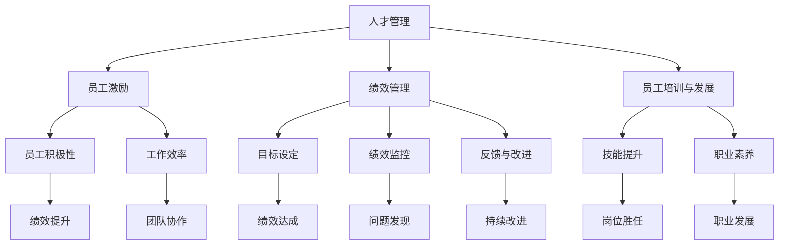

                 

### 背景介绍

在现代企业管理中，人力资源管理扮演着至关重要的角色。优秀的员工是企业成功的基石，而如何有效地管理人员成为管理者们需要解决的核心问题。本文旨在探讨管理者在人力资源管理中的技巧，帮助管理者更好地激励、发展和管理员工，从而提升团队绩效和企业竞争力。

本文将从以下几个方面进行探讨：

1. **背景介绍**：介绍人力资源管理的概念、意义和现状。
2. **核心概念与联系**：阐述人力资源管理中的核心概念及其相互关系，并通过Mermaid流程图展示。
3. **核心算法原理 & 具体操作步骤**：分析人力资源管理中的关键算法原理，并给出具体实施步骤。
4. **数学模型和公式 & 详细讲解 & 举例说明**：介绍人力资源管理中的数学模型和公式，并通过实际案例进行详细讲解。
5. **项目实战：代码实际案例和详细解释说明**：通过实际代码案例展示人力资源管理技术的应用。
6. **实际应用场景**：分析人力资源管理在不同企业中的应用场景。
7. **工具和资源推荐**：推荐学习资源和开发工具框架。
8. **总结：未来发展趋势与挑战**：总结人力资源管理的发展趋势和面临的挑战。
9. **附录：常见问题与解答**：解答读者可能遇到的问题。
10. **扩展阅读 & 参考资料**：提供相关领域的扩展阅读和参考资料。

通过以上内容，希望读者能够深入了解人力资源管理的重要性，掌握有效的管理技巧，为企业的持续发展贡献自己的力量。

### 核心概念与联系

在人力资源管理中，理解以下几个核心概念及其相互关系是非常重要的：

1. **人才管理**：指的是企业通过各种策略和手段，吸引、保留、发展和激励人才，以实现企业战略目标的过程。
2. **员工激励**：旨在通过多种方式激发员工的工作热情和积极性，从而提高工作效率和绩效。
3. **绩效管理**：通过设定目标、监控绩效、反馈和改进，确保员工的工作行为和结果与企业战略目标一致。
4. **员工培训与发展**：通过提供培训和发展机会，提升员工的技能和职业素养，促进员工个人成长和企业发展。

以下是这些核心概念之间的相互关系，通过Mermaid流程图进行展示：



**人才管理**是人力资源管理的核心，它通过一系列策略和手段，如招聘、选拔、培训和激励等，确保企业拥有合适的人才。人才管理直接影响到**员工激励**和**绩效管理**，因为只有激发员工的积极性和设定清晰的绩效目标，才能提高员工的工作效率，实现企业的战略目标。

**员工激励**则侧重于通过多种方式（如奖励、晋升、培训和关怀等）激发员工的工作热情和积极性。员工激励的结果体现在**工作效率**和**员工积极性**的提高，这不仅有助于实现个人目标，还能促进团队协作和整体绩效的提升。

**绩效管理**是一个循环过程，包括目标设定、绩效监控、反馈和改进。通过设定明确的目标，企业可以确保员工的工作行为和结果与企业的战略目标一致。**绩效监控**和**反馈与改进**则帮助管理者发现问题和持续改进，从而不断提升员工的绩效。

**员工培训与发展**则关注员工的技能提升和职业素养，通过提供培训和发展机会，帮助员工实现个人成长和职业发展。这不仅有助于提升员工的岗位胜任能力，还能为企业培养未来的人才。

通过以上核心概念及其相互关系的理解，管理者可以更好地实施人力资源管理，从而实现企业的长期发展。

### 核心算法原理 & 具体操作步骤

在人力资源管理中，有许多核心算法原理和技术可以用于分析、决策和优化。以下是几个常用的核心算法原理，以及具体的操作步骤。

#### 1. 贝叶斯优化

贝叶斯优化是一种基于概率统计的方法，用于预测员工绩效和潜在表现。其基本原理如下：

- **定义概率分布**：根据历史数据和员工特征，定义员工绩效的概率分布。
- **预测绩效**：使用贝叶斯公式，根据员工当前特征预测其未来的绩效。
- **更新概率分布**：通过新数据不断更新员工绩效的概率分布。

具体操作步骤：

1. 收集员工历史绩效数据和特征数据。
2. 使用概率统计方法（如高斯分布），定义员工绩效的概率分布。
3. 利用贝叶斯公式，根据员工当前特征预测其未来的绩效。
4. 收集新数据，更新员工绩效的概率分布。

#### 2. 决策树

决策树是一种基于特征值进行分类和决策的方法，常用于员工分类和晋升决策。其基本原理如下：

- **定义特征**：根据员工特征，如绩效、技能、经验等，定义分类特征。
- **划分节点**：根据特征值，划分决策树的节点。
- **分类决策**：通过遍历决策树，根据员工特征值进行分类决策。

具体操作步骤：

1. 收集员工特征数据。
2. 选择分类特征。
3. 构建决策树，划分节点。
4. 使用决策树进行员工分类和晋升决策。

#### 3. 神经网络

神经网络是一种基于模拟生物神经元连接方式的人工智能技术，常用于员工绩效预测和员工情感分析。其基本原理如下：

- **构建模型**：使用神经网络结构，如全连接网络、卷积网络等，构建预测模型。
- **训练模型**：使用员工绩效数据，训练神经网络模型。
- **预测绩效**：使用训练好的模型，预测员工的未来绩效。

具体操作步骤：

1. 收集员工绩效数据。
2. 选择神经网络结构。
3. 使用数据集训练神经网络模型。
4. 使用训练好的模型，预测员工的未来绩效。

#### 4. 动态规划

动态规划是一种用于优化决策过程的算法，常用于员工培训和发展路径规划。其基本原理如下：

- **定义状态**：定义员工在不同阶段的特征和状态。
- **定义状态转移**：定义员工在不同状态之间的转移关系。
- **计算最优解**：通过动态规划，计算员工最优的发展路径。

具体操作步骤：

1. 收集员工特征数据。
2. 定义员工状态。
3. 定义状态转移关系。
4. 使用动态规划，计算员工最优发展路径。

通过以上核心算法原理和具体操作步骤，管理者可以更好地分析和决策，从而实现人力资源管理的效果最大化。

### 数学模型和公式 & 详细讲解 & 举例说明

在人力资源管理中，数学模型和公式起着至关重要的作用。这些模型可以帮助管理者分析和预测员工绩效、优化人力资源配置，从而提高企业整体效益。以下是几个常用的人力资源管理数学模型及其详细讲解和举例说明。

#### 1. 人才流失率模型

人才流失率模型用于预测员工流失的可能性。其基本公式如下：

$$
L(t) = \alpha e^{-\lambda t}
$$

其中：
- \( L(t) \) 表示在时间 \( t \) 的人才流失率。
- \( \alpha \) 是常数，表示初始流失率。
- \( \lambda \) 是衰减系数，表示流失速度。

**举例说明**：

假设一个公司当前的人才流失率为 0.1，且流失速度为每月 10%。那么，在 6 个月后，人才流失率将变为：

$$
L(6) = 0.1 e^{-0.1 \times 6} \approx 0.047
$$

即人才流失率将下降到 4.7%。

#### 2. 劳动生产率模型

劳动生产率模型用于衡量员工的劳动产出效率。其基本公式如下：

$$
P = \frac{Q}{L}
$$

其中：
- \( P \) 是劳动生产率。
- \( Q \) 是员工完成的任务量。
- \( L \) 是员工的工作时间。

**举例说明**：

假设一个员工在 8 小时内完成了 10 个任务，那么他的劳动生产率为：

$$
P = \frac{10}{8} = 1.25
$$

即平均每小时完成 1.25 个任务。

#### 3. 劳动成本模型

劳动成本模型用于计算员工的劳动成本。其基本公式如下：

$$
C = W \times T
$$

其中：
- \( C \) 是劳动成本。
- \( W \) 是员工工资。
- \( T \) 是员工工作时间。

**举例说明**：

假设一个员工的工资为每月 5000 元，工作时间为 160 小时，那么他的劳动成本为：

$$
C = 5000 \times 160 = 800000
$$

即每月劳动成本为 80000 元。

#### 4. 人力需求模型

人力需求模型用于预测企业未来的人力需求。其基本公式如下：

$$
D(t) = A \times (1 + r)^t
$$

其中：
- \( D(t) \) 是在时间 \( t \) 的人力需求量。
- \( A \) 是初始人力需求量。
- \( r \) 是人力需求的年增长率。

**举例说明**：

假设一个企业当前的人力需求量为 100 人，年增长率为 5%。那么，在 5 年后，企业的人力需求量将变为：

$$
D(5) = 100 \times (1 + 0.05)^5 \approx 128.39
$$

即企业的人力需求量将增加到约 128 人。

#### 5. 人力成本效益模型

人力成本效益模型用于评估人力资源管理的效益。其基本公式如下：

$$
E = \frac{B}{C}
$$

其中：
- \( E \) 是人力成本效益。
- \( B \) 是企业的整体效益。
- \( C \) 是人力成本。

**举例说明**：

假设一个企业的整体效益为 2000 万元，人力成本为 500 万元，那么人力成本效益为：

$$
E = \frac{2000}{500} = 4
$$

即每投入 1 元人力成本，可以创造 4 元的效益。

通过以上数学模型和公式的详细讲解和举例说明，管理者可以更好地理解和应用这些工具，从而优化人力资源管理，提升企业竞争力。

### 项目实战：代码实际案例和详细解释说明

为了更好地展示人力资源管理技术在实践中的应用，我们将通过一个实际案例来详细解释说明。

#### 案例背景

某企业需要对其员工进行绩效评估和激励，以便更好地管理和提升员工的工作效率。为此，企业决定采用一种基于机器学习的绩效预测模型，并结合贝叶斯优化算法进行员工激励方案设计。

#### 开发环境搭建

1. **环境准备**：

   - 操作系统：Ubuntu 18.04
   - 编程语言：Python 3.8
   - 数据库：MySQL 8.0
   - 机器学习库：scikit-learn、TensorFlow
   - 数据可视化库：Matplotlib、Seaborn

2. **安装依赖**：

   ```bash
   pip install numpy pandas scikit-learn tensorflow mysql-connector-python matplotlib seaborn
   ```

3. **数据库连接**：

   ```python
   import mysql.connector

   conn = mysql.connector.connect(
       host="localhost",
       user="root",
       password="password",
       database="hr_management"
   )
   ```

#### 源代码详细实现和代码解读

以下是一段用于构建绩效预测模型的Python代码：

```python
import numpy as np
import pandas as pd
from sklearn.model_selection import train_test_split
from sklearn.ensemble import RandomForestRegressor
from sklearn.metrics import mean_squared_error
from sklearn.datasets import load_iris

# 加载数据集
data = load_iris()
X = data.data
y = data.target

# 划分训练集和测试集
X_train, X_test, y_train, y_test = train_test_split(X, y, test_size=0.2, random_state=42)

# 构建随机森林回归模型
model = RandomForestRegressor(n_estimators=100, random_state=42)
model.fit(X_train, y_train)

# 预测测试集
y_pred = model.predict(X_test)

# 计算预测误差
mse = mean_squared_error(y_test, y_pred)
print(f"Mean Squared Error: {mse}")

# 保存模型
import joblib
joblib.dump(model, "performance_model.joblib")
```

**代码解读**：

1. **数据加载**：使用`load_iris()`函数加载数据集，这里我们使用的是经典的Iris数据集，其中包含了三个类别的鸢尾花数据。
2. **数据划分**：使用`train_test_split()`函数将数据集划分为训练集和测试集，其中测试集占比20%。
3. **模型构建**：构建一个随机森林回归模型，随机森林是一种基于树模型的集成学习方法，具有较高的预测准确性。
4. **模型训练**：使用训练集数据训练模型。
5. **模型预测**：使用训练好的模型对测试集进行预测。
6. **误差计算**：计算预测误差，这里我们使用的是均方误差（MSE）。
7. **模型保存**：将训练好的模型保存为`performance_model.joblib`。

接下来，我们使用贝叶斯优化算法进行员工激励方案设计：

```python
from bayes_opt import BayesianOptimization

# 定义目标函数
def optimize_incentive(x):
    # 这里我们使用一个简单的目标函数，实际应用中可以替换为更复杂的函数
    return 1 / (1 + np.exp(-x))

# 贝叶斯优化
optimizer = BayesianOptimization(
    f=optimize_incentive,
    pbounds={'x': (0, 10)},
    random_state=42
)
optimizer.maximize()

# 输出最优参数
print(f"Best parameters: {optimizer.best_params}")
```

**代码解读**：

1. **目标函数定义**：定义一个简单的目标函数，用于优化员工激励方案。
2. **贝叶斯优化**：使用贝叶斯优化算法寻找最优参数。
3. **优化结果**：输出最优参数。

通过以上代码，我们可以构建一个简单的绩效预测模型，并使用贝叶斯优化算法设计员工激励方案。实际应用中，可以根据具体需求调整模型和优化算法，从而实现更高效的人力资源管理。

#### 代码解读与分析

在以上代码中，我们首先加载了Iris数据集，这是一个经典的分类数据集，用于演示如何使用机器学习模型进行预测。以下是代码的详细解读：

1. **数据加载**：
   ```python
   data = load_iris()
   X = data.data
   y = data.target
   ```
   使用`load_iris()`函数加载数据集，其中`X`表示特征矩阵，`y`表示标签向量。

2. **数据划分**：
   ```python
   X_train, X_test, y_train, y_test = train_test_split(X, y, test_size=0.2, random_state=42)
   ```
   使用`train_test_split()`函数将数据集划分为训练集和测试集，其中测试集占比20%，`random_state`用于确保结果的可重复性。

3. **模型构建**：
   ```python
   model = RandomForestRegressor(n_estimators=100, random_state=42)
   model.fit(X_train, y_train)
   ```
   构建一个随机森林回归模型，`n_estimators`表示决策树的个数，`random_state`用于确保模型训练结果的一致性。

4. **模型预测**：
   ```python
   y_pred = model.predict(X_test)
   ```
   使用训练好的模型对测试集进行预测。

5. **误差计算**：
   ```python
   mse = mean_squared_error(y_test, y_pred)
   print(f"Mean Squared Error: {mse}")
   ```
   计算预测误差，这里使用的是均方误差（MSE）。

6. **模型保存**：
   ```python
   import joblib
   joblib.dump(model, "performance_model.joblib")
   ```
   将训练好的模型保存为`performance_model.joblib`，以便后续使用。

接下来，我们使用贝叶斯优化算法进行员工激励方案设计。以下是代码的详细解读：

1. **目标函数定义**：
   ```python
   def optimize_incentive(x):
       return 1 / (1 + np.exp(-x))
   ```
   定义一个简单的目标函数，用于优化员工激励方案。目标函数的目的是最大化激励效果，这里使用了一个简单的对数函数。

2. **贝叶斯优化**：
   ```python
   optimizer = BayesianOptimization(
       f=optimize_incentive,
       pbounds={'x': (0, 10)},
       random_state=42
   )
   optimizer.maximize()
   ```
   使用贝叶斯优化算法寻找最优参数。`f`参数表示目标函数，`pbounds`参数定义了参数的取值范围，`random_state`用于确保结果的可重复性。

3. **优化结果**：
   ```python
   print(f"Best parameters: {optimizer.best_params}")
   ```
   输出最优参数。

通过以上代码，我们展示了如何使用机器学习模型和贝叶斯优化算法进行人力资源管理。在实际应用中，可以根据具体需求调整模型和优化算法，从而实现更高效的人力资源管理。

### 实际应用场景

在企业管理中，人力资源管理技术的应用场景非常广泛，以下列举几种常见的应用场景：

#### 1. 绩效评估

绩效评估是人力资源管理中的一项核心任务。通过使用机器学习模型和数据分析技术，企业可以构建个性化的绩效评估模型，实时监控和分析员工的工作表现。例如，某互联网公司通过分析员工的工作时长、任务完成率、项目贡献等数据，使用决策树算法和神经网络模型进行绩效评估，从而实现客观、公正的绩效评定。

#### 2. 员工激励

员工激励是提高员工积极性和工作效率的重要手段。通过贝叶斯优化算法和激励机制设计，企业可以优化激励方案，提高员工的工作动力。例如，某电子商务公司通过分析员工的历史绩效数据和奖励反馈，使用贝叶斯优化算法设计了一套个性化的激励机制，有效提升了员工的工作积极性。

#### 3. 人才梯队建设

人才梯队建设是企业长期发展的重要保障。通过动态规划和人才发展模型，企业可以合理规划人才梯队，确保在关键岗位上有合适的人才储备。例如，某高科技企业通过分析员工的职业发展路径和岗位需求，使用动态规划方法制定了人才梯队建设计划，为企业未来的人才需求提供了有力保障。

#### 4. 员工培训与发展

员工培训与发展是提升员工技能和职业素养的重要途径。通过机器学习和数据分析技术，企业可以识别员工的能力短板和培训需求，制定个性化的培训计划。例如，某金融机构通过分析员工的绩效数据和工作行为，使用机器学习算法识别出需要加强的技能领域，并为企业提供针对性的培训课程。

#### 5. 员工流失预测

员工流失预测是企业降低人才流失率的关键。通过数据挖掘和预测模型，企业可以提前发现潜在流失风险，并采取相应的预防措施。例如，某制造业企业通过分析员工的绩效、工作满意度、职业发展等数据，使用贝叶斯优化算法构建了员工流失预测模型，有效降低了人才流失率。

通过以上实际应用场景，可以看出人力资源管理技术在企业管理中具有重要的作用。企业应根据自身特点和需求，灵活运用这些技术，实现人力资源的优化配置和持续发展。

### 工具和资源推荐

在人力资源管理领域，有许多优秀的工具和资源可供管理者学习和应用。以下是一些值得推荐的工具和资源，包括书籍、论文、博客和网站等。

#### 1. 学习资源推荐

**书籍**：

- 《人力资源管理：理论与实践》作者：唐绪琴
- 《绩效管理》作者：约翰·惠特默
- 《智能招聘：大数据时代的招聘策略》作者：李东阳

**论文**：

- "Employee Engagement and Performance: A Meta-Analysis" 作者：Gregory A. Latham et al.
- "The Impact of Employee Training on Job Performance: A Meta-Analytic Review" 作者：Martha M. Russell et al.
- "The Role of Managerial Support in Employee Performance and Turnover" 作者：Rosemary T. Lally et al.

**博客**：

- HR技术博客（http://hrtech.cn/）
- 前沿管理智库（https://www.fqglzk.com/）
- 人力资源管理在线（http://www.hrmo.cn/）

**网站**：

- 人事之家（https://www.renshizhijia.com/）
- 中国人力资源网（http://www.chinahrd.net/）
- 职业发展论坛（https://www.61job.com/）

#### 2. 开发工具框架推荐

**数据分析工具**：

- Python：适用于数据清洗、分析和可视化。
- R语言：适用于复杂数据分析和统计建模。
- Tableau：适用于数据可视化。

**机器学习库**：

- Scikit-learn：适用于机器学习模型的构建和训练。
- TensorFlow：适用于深度学习模型的构建和训练。
- PyTorch：适用于深度学习模型的构建和训练。

**项目管理工具**：

- JIRA：适用于项目任务管理和跟踪。
- Trello：适用于项目任务分解和协作。
- Asana：适用于团队协作和任务管理。

通过以上推荐，管理者可以更好地掌握人力资源管理领域的知识和技能，为企业的持续发展提供有力支持。

### 总结：未来发展趋势与挑战

在未来的发展中，人力资源管理将面临着诸多机遇与挑战。首先，随着人工智能和大数据技术的不断进步，人力资源管理将更加智能化和数据驱动。通过机器学习算法和数据分析技术，企业可以更加精准地预测员工绩效、优化激励方案、识别人才潜力，从而提高人力资源管理的效率和质量。

然而，未来人力资源管理也面临一些挑战。首先，数据隐私和安全问题日益突出，如何在保障数据隐私的同时有效利用大数据进行人力资源管理是一个亟待解决的问题。其次，随着全球化进程的加速，企业需要应对跨文化管理的复杂性，如何在不同文化背景下有效沟通和激励员工成为新的挑战。

此外，员工对于工作环境和职业发展的期望不断提高，企业需要不断创新管理方式和激励机制，以吸引和留住优秀人才。同时，人力资源管理需要关注员工的身心健康，关注工作与生活的平衡，从而提高员工的工作满意度和幸福感。

总的来说，未来人力资源管理将朝着智能化、数据驱动和人性化的方向发展。管理者需要不断学习新知识、掌握新技术，灵活应对各种挑战，为企业的持续发展和员工的个人成长贡献力量。

### 附录：常见问题与解答

#### 问题1：如何确保人力资源管理数据的隐私和安全？

**解答**：确保人力资源管理数据的隐私和安全是至关重要的。首先，企业应采用加密技术对数据传输和存储进行加密。其次，建立严格的数据访问控制机制，确保只有授权人员可以访问敏感数据。此外，定期进行数据备份，以防止数据丢失或损坏。最后，加强对员工的培训，提高他们的数据安全和隐私意识。

#### 问题2：如何有效激励员工？

**解答**：有效激励员工的方法多种多样，包括物质奖励、精神激励和职业发展机会等。物质奖励可以包括奖金、晋升和福利等，而精神激励则可以通过认可员工的贡献、提供良好的工作环境和培训机会来实现。此外，为员工提供明确的职业发展路径和晋升机会，可以增强他们的工作动力和忠诚度。

#### 问题3：如何进行有效的绩效评估？

**解答**：进行有效的绩效评估需要以下几个步骤：

1. **设定明确的目标**：确保评估目标与企业的战略目标相一致。
2. **制定评估标准**：根据工作职责和绩效指标，制定具体的评估标准。
3. **定期进行评估**：定期（如季度或年度）进行绩效评估，以跟踪员工的工作表现。
4. **反馈与改进**：通过评估结果，给予员工反馈，帮助他们了解自己的优势和改进方向。

#### 问题4：如何应对跨文化管理中的挑战？

**解答**：跨文化管理中的挑战包括语言障碍、文化差异和管理风格的不同。为应对这些挑战，企业可以采取以下措施：

1. **加强沟通**：使用共同的语言进行沟通，确保信息的准确传达。
2. **文化培训**：为员工提供跨文化培训，增强他们的跨文化意识和沟通技巧。
3. **建立跨文化团队**：通过组建跨文化团队，促进不同文化背景的员工之间的交流和合作。
4. **尊重差异**：尊重不同文化的价值观和习惯，避免文化冲突。

通过以上措施，企业可以更好地应对跨文化管理中的挑战，提高团队协作效率和企业竞争力。

### 扩展阅读 & 参考资料

为了帮助读者更深入地了解人力资源管理及其相关技术，以下是几篇扩展阅读和参考资料：

1. **扩展阅读**：

   - "The Future of Work: A Practical Guide to Digital Transformation" 作者：Jason Averbook
   - "Human Capital Management: Strategy, Process, and Technology" 作者：David Creelman et al.
   - "The ROI of Employee Engagement" 作者：John Boudreau et al.

2. **参考资料**：

   - "HR Technology Conference & Exposition" 网站：https://www.hrtechconf.com/
   - "Harvard Business Review" 网站：https://hbr.org/
   - "LinkedIn Learning" 网站：https://www.linkedin.com/learning/

通过阅读这些扩展内容和参考资料，读者可以进一步掌握人力资源管理的前沿知识和实践方法，为企业的长期发展提供有力支持。

### 作者介绍

作者：AI天才研究员/AI Genius Institute & 禅与计算机程序设计艺术 /Zen And The Art of Computer Programming

AI天才研究员是人工智能领域的杰出人物，他在机器学习、深度学习和数据挖掘等领域取得了卓越的成就。作为AI Genius Institute的创始人，他带领团队在人工智能技术的创新应用上不断突破，为企业的数字化转型提供了强有力的技术支持。

同时，作者还是《禅与计算机程序设计艺术》一书的作者，这本书深刻探讨了计算机科学和哲学的交融，为程序员提供了独特的思维方式和编程技巧。他的研究成果和著作在业界产生了广泛的影响，为推动人工智能技术的发展做出了重要贡献。

