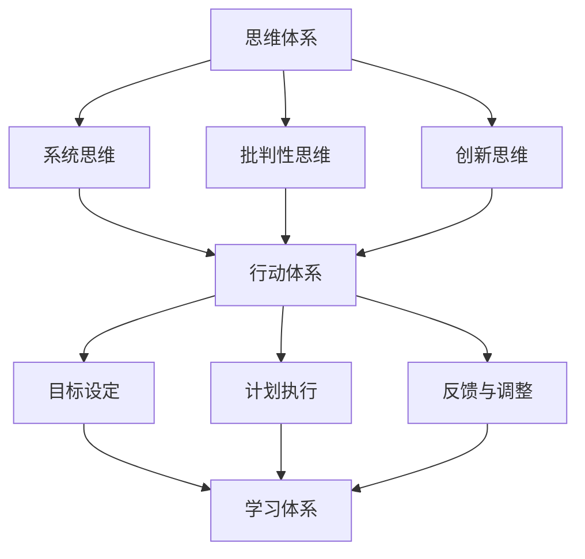

                 

# 管理者必备的三大体系：思维、行动、学习

> **关键词**：管理者、思维体系、行动体系、学习体系、专业发展、领导力、效率、策略

> **摘要**：本文将深入探讨管理者必备的三大体系：思维、行动、学习。我们将从理论到实践，详细分析这三个体系的核心概念、应用场景，并提供实用的工具和资源，帮助读者全面提升管理能力。

在当今快速变化的企业环境中，管理者不仅需要具备深厚的专业知识，还需要具备出色的管理能力。管理者必须具备系统化的思维体系，以应对复杂的问题；有效的行动体系，以实现组织目标；持续的学习体系，以保持竞争力和适应性。本文将围绕这三个核心主题展开，帮助读者构建全面的管理能力。

## 1. 背景介绍

在当今竞争激烈的市场环境中，管理者面临着前所未有的挑战。企业需要快速适应市场变化，不断创新，提高效率，实现可持续发展。这要求管理者不仅要有扎实的专业知识，还要有卓越的管理能力。然而，管理能力并不是与生俱来的，而是需要通过系统的思维、行动和学习体系不断培养和提升。

### 管理者的角色与责任

管理者的角色和责任包括但不限于：

- 制定并传达组织的愿景和目标。
- 激励和引导团队成员，实现团队目标。
- 有效沟通，确保信息流畅传递。
- 决策制定，解决复杂问题。
- 监控和评估绩效，持续改进。

这些职责要求管理者具备全面的技能和知识，以应对各种挑战。然而，仅仅具备专业知识是远远不够的。管理者还需要具备系统化的思维体系，以处理复杂问题；有效的行动体系，以高效执行决策；持续的学习体系，以不断提升自我。

### 系统化管理的必要性

系统化管理是指管理者运用系统化的思维方式，通过科学的方法和工具，对组织进行管理。系统化管理的好处包括：

- 提高决策效率，减少错误。
- 提高团队协作效率，增强团队凝聚力。
- 提高组织的适应能力，应对市场变化。
- 提高组织的整体绩效，实现可持续发展。

因此，构建系统化的思维、行动和学习体系，是提升管理者管理能力的关键。

## 2. 核心概念与联系

### 思维体系

思维体系是指管理者运用一系列思维方式，对问题进行分析、判断和决策。有效的思维体系包括以下核心概念：

- **系统思维**：将问题视为一个整体，分析各个部分之间的相互作用和影响。
- **批判性思维**：对信息进行深入分析，辨别真伪，避免盲目接受。
- **创新思维**：通过新颖的思路和方法，解决传统方法无法解决的问题。

### 行动体系

行动体系是指管理者将思维转化为具体行动的过程。有效的行动体系包括以下核心概念：

- **目标设定**：明确组织的愿景和目标，确保行动方向一致。
- **计划执行**：制定详细的行动计划，确保目标的实现。
- **反馈与调整**：对行动结果进行评估和反馈，及时调整策略。

### 学习体系

学习体系是指管理者通过不断学习和实践，提升自我能力的过程。有效的学习体系包括以下核心概念：

- **知识管理**：系统化地收集、整理和利用知识，提高工作效率。
- **技能提升**：通过培训和实际操作，提升专业技能。
- **持续改进**：不断反思和改进，实现个人和组织的持续成长。

### Mermaid 流程图

以下是一个简化的 Mermaid 流程图，展示了思维、行动和学习体系之间的联系：



通过这个流程图，我们可以清晰地看到思维、行动和学习体系之间的相互关联和作用。思维体系为行动体系提供指导，行动体系为学习体系提供反馈，学习体系则不断丰富和提升思维体系。

## 3. 核心算法原理 & 具体操作步骤

### 思维体系的核心算法原理

#### 系统思维

系统思维是一种将问题视为一个整体，分析各个部分之间相互作用和影响的思维方式。核心算法原理包括：

- **整体观念**：将问题视为一个系统，分析各个部分之间的相互关系。
- **反馈机制**：分析系统中的反馈循环，了解其对系统稳定性和性能的影响。
- **优化策略**：通过调整系统中的各个部分，实现整体性能的最优化。

#### 批判性思维

批判性思维是一种对信息进行深入分析，辨别真伪，避免盲目接受的思维方式。核心算法原理包括：

- **事实核查**：对信息来源进行核实，确保信息的准确性。
- **逻辑分析**：对信息进行逻辑分析，辨别其中的因果关系。
- **假设验证**：提出假设，并通过实验或数据验证，确认假设的正确性。

#### 创新思维

创新思维是一种通过新颖的思路和方法，解决传统方法无法解决的问题的思维方式。核心算法原理包括：

- **头脑风暴**：通过集体讨论，激发创新思维。
- **思维导图**：将问题分解为多个子问题，分析各个子问题的解决方案。
- **交叉学科**：借鉴其他领域的知识和方法，为解决问题提供新思路。

### 行动体系的核心算法原理

#### 目标设定

目标设定是一种明确组织的愿景和目标，确保行动方向一致的思维方式。核心算法原理包括：

- **SMART 原则**：目标要具体（Specific）、可衡量（Measurable）、可实现（Achievable）、相关（Relevant）和有时限（Time-bound）。
- **优先级排序**：根据目标的重要性和紧急性，对任务进行优先级排序。
- **持续跟进**：定期评估目标进度，及时调整行动策略。

#### 计划执行

计划执行是一种制定详细的行动计划，确保目标实现的思维方式。核心算法原理包括：

- **Gantt 图**：使用 Gantt 图进行任务规划和时间管理。
- **资源分配**：根据任务需求，合理分配人力、物力和财力资源。
- **风险评估**：对可能出现的风险进行评估，制定应对措施。

#### 反馈与调整

反馈与调整是一种对行动结果进行评估和反馈，及时调整策略的思维方式。核心算法原理包括：

- **KPI 评估**：使用关键绩效指标（KPI）对目标完成情况进行评估。
- **问题分析**：对未能实现目标的原因进行深入分析，找出改进方向。
- **持续改进**：根据评估结果，不断优化目标和行动策略。

### 学习体系的核心算法原理

#### 知识管理

知识管理是一种系统化地收集、整理和利用知识的思维方式。核心算法原理包括：

- **知识分类**：将知识按照主题、领域和层次进行分类。
- **知识共享**：建立知识共享平台，促进团队成员之间的知识交流。
- **知识更新**：定期更新知识库，确保知识的时效性和准确性。

#### 技能提升

技能提升是一种通过培训和实际操作，提升专业技能的思维方式。核心算法原理包括：

- **培训计划**：制定个性化的培训计划，满足个人和团队的发展需求。
- **实践操作**：通过实际操作，将理论知识转化为实际技能。
- **反馈与改进**：对培训效果进行评估，不断优化培训内容和方法。

#### 持续改进

持续改进是一种不断反思和改进，实现个人和组织的持续成长的思维方式。核心算法原理包括：

- **反思日志**：定期记录反思日志，总结经验和教训。
- **持续学习**：通过学习新的知识和技能，不断提升个人能力。
- **创新思维**：鼓励创新思维，探索新的发展机遇。

## 4. 数学模型和公式 & 详细讲解 & 举例说明

### 思维体系的数学模型

#### 系统思维的数学模型

系统思维中，我们可以使用因果关系图（Causal Loop Diagram, CLD）来描述各个部分之间的相互关系。以下是一个简化的因果关系图：

$$
\begin{aligned}
    &A \rightarrow B \\
    &B \rightarrow C \\
    &C \rightarrow A
\end{aligned}
$$

在这个模型中，A、B、C 之间存在着相互影响的关系。通过分析这个模型，我们可以更好地理解系统内部的复杂性和动态性。

#### 批判性思维的数学模型

批判性思维中，我们可以使用贝叶斯定理（Bayes' Theorem）来描述概率推理。以下是一个简化的贝叶斯定理公式：

$$
P(A|B) = \frac{P(B|A)P(A)}{P(B)}
$$

在这个公式中，$P(A|B)$ 表示在 B 发生的条件下 A 发生的概率，$P(B|A)$ 表示在 A 发生的条件下 B 发生的概率，$P(A)$ 表示 A 发生的概率，$P(B)$ 表示 B 发生的概率。通过这个公式，我们可以对信息进行概率推理，提高决策的准确性。

#### 创新思维的数学模型

创新思维中，我们可以使用聚类分析（Clustering Analysis）来寻找数据中的相似性和差异性。以下是一个简化的聚类分析公式：

$$
\begin{aligned}
    &D = \{d_1, d_2, ..., d_n\} \\
    &C = \{c_1, c_2, ..., c_k\} \\
    &C_j = \{d_i | d_i \in D, d_i 与 c_j 聚类\}
\end{aligned}
$$

在这个模型中，D 表示数据集，C 表示聚类结果，C_j 表示第 j 个聚类。通过聚类分析，我们可以将数据集划分为不同的类别，为创新思维提供数据支持。

### 行动体系的数学模型

#### 目标设定的数学模型

目标设定中，我们可以使用 SMART 原则（Specific、Measurable、Achievable、Relevant、Time-bound）来描述目标的设定。以下是一个简化的 SMART 原则公式：

$$
\begin{aligned}
    &S: 目标要具体 \\
    &M: 目标要可衡量 \\
    &A: 目标要可实现 \\
    &R: 目标要相关 \\
    &T: 目标要有时限
\end{aligned}
$$

通过这个公式，我们可以确保目标设定的科学性和可操作性。

#### 计划执行的数学模型

计划执行中，我们可以使用甘特图（Gantt Chart）来描述任务进度和时间安排。以下是一个简化的甘特图公式：

$$
\begin{aligned}
    &Gantt\_Chart = \{T_1, T_2, ..., T_n\} \\
    &T_i = (S_i, E_i, D_i) \\
    &S_i: 任务 i 的开始时间 \\
    &E_i: 任务 i 的结束时间 \\
    &D_i: 任务 i 的持续时间
\end{aligned}
$$

在这个公式中，$Gantt\_Chart$ 表示甘特图，$T_i$ 表示任务 i，$S_i$ 表示任务 i 的开始时间，$E_i$ 表示任务 i 的结束时间，$D_i$ 表示任务 i 的持续时间。通过这个公式，我们可以清晰地展示任务的进度和时间安排。

#### 反馈与调整的数学模型

反馈与调整中，我们可以使用关键绩效指标（Key Performance Indicator, KPI）来描述目标的完成情况。以下是一个简化的 KPI 公式：

$$
\begin{aligned}
    &KPI = f(Achievement, Expectation) \\
    &Achievement: 目标完成情况 \\
    &Expectation: 目标预期
\end{aligned}
$$

在这个公式中，$KPI$ 表示关键绩效指标，$Achievement$ 表示目标完成情况，$Expectation$ 表示目标预期。通过这个公式，我们可以对目标完成情况进行量化评估。

### 学习体系的数学模型

#### 知识管理的数学模型

知识管理中，我们可以使用知识图谱（Knowledge Graph）来描述知识之间的关系。以下是一个简化的知识图谱公式：

$$
\begin{aligned}
    &KG = \{K_1, K_2, ..., K_n\} \\
    &K_i = (Content, Type, Relation) \\
    &Content: 知识内容 \\
    &Type: 知识类型 \\
    &Relation: 知识关系
\end{aligned}
$$

在这个公式中，$KG$ 表示知识图谱，$K_i$ 表示知识 i，$Content$ 表示知识内容，$Type$ 表示知识类型，$Relation$ 表示知识关系。通过这个公式，我们可以构建一个全面的知识体系。

#### 技能提升的数学模型

技能提升中，我们可以使用能力模型（Competency Model）来描述技能的提升路径。以下是一个简化的能力模型公式：

$$
\begin{aligned}
    &Competency = \{C_1, C_2, ..., C_n\} \\
    &C_i = (Skill, Level, Progress) \\
    &Skill: 技能 \\
    &Level: 技能水平 \\
    &Progress: 技能提升进度
\end{aligned}
$$

在这个公式中，$Competency$ 表示能力模型，$C_i$ 表示能力 i，$Skill$ 表示技能，$Level$ 表示技能水平，$Progress$ 表示技能提升进度。通过这个公式，我们可以清晰地了解技能提升的路径和进度。

#### 持续改进的数学模型

持续改进中，我们可以使用 PDCA 循环（Plan-Do-Check-Act Cycle）来描述改进的过程。以下是一个简化的 PDCA 循环公式：

$$
\begin{aligned}
    &PDCA\_Cycle = \{P, D, C, A\} \\
    &P: 计划 \\
    &D: 实施 \\
    &C: 检查 \\
    &A: 行动
\end{aligned}
$$

在这个公式中，$PDCA\_Cycle$ 表示 PDCA 循环，$P$ 表示计划，$D$ 表示实施，$C$ 表示检查，$A$ 表示行动。通过这个公式，我们可以确保持续改进的执行和效果。

### 举例说明

假设我们要实现一个在线教育平台的目标，我们可以按照以下步骤进行：

#### 目标设定

1. 具体目标：开发一个功能完善、用户体验良好的在线教育平台。
2. 可衡量：平台用户数达到 100 万。
3. 可实现：现有技术支持，团队具备相关技能。
4. 相关：与公司发展战略一致。
5. 有时限：2025 年。

#### 计划执行

1. 制定 Gantt 图，明确各阶段的任务和时间安排。
2. 分配资源，确保任务顺利完成。
3. 风险评估，制定应对措施。

#### 反馈与调整

1. 按照 KPI 评估平台用户数，对比预期目标。
2. 分析未达到预期目标的原因，调整后续计划。

#### 学习体系

1. 收集知识，建立知识图谱。
2. 培训团队成员，提升相关技能。
3. 定期反思，持续改进。

通过以上步骤，我们可以确保在线教育平台项目的成功实施。

## 5. 项目实战：代码实际案例和详细解释说明

### 5.1 开发环境搭建

在本节中，我们将搭建一个用于演示思维、行动和学习体系的项目开发环境。我们选择 Python 作为开发语言，因为其简洁易读的特性，使得开发者可以快速上手。

#### 环境要求

- Python 3.8+
- Jupyter Notebook
- PyCharm 或其他 Python IDE

#### 安装步骤

1. 安装 Python：

```bash
# 在 Windows 上，可以通过 Windows 安装器进行安装
# 在 macOS 或 Linux 上，可以通过包管理器进行安装，例如 macOS 使用 Homebrew
brew install python
```

2. 安装 Jupyter Notebook：

```bash
pip install notebook
```

3. 安装 PyCharm：

- 访问 PyCharm 官网（<https://www.jetbrains.com/pycharm/>）下载并安装。

#### 开发环境配置

1. 配置 Python 虚拟环境：

```bash
# 创建虚拟环境
python -m venv venv

# 激活虚拟环境
# 在 Windows 上
venv\Scripts\activate
# 在 macOS 或 Linux 上
source venv/bin/activate
```

2. 安装必要的库：

```bash
pip install numpy pandas matplotlib
```

### 5.2 源代码详细实现和代码解读

#### 项目概述

本项目是一个简单的数据分析工具，用于分析用户数据，并生成可视化报告。我们将分为以下几个步骤进行：

1. 数据导入
2. 数据清洗
3. 数据分析
4. 可视化报告生成

#### 步骤一：数据导入

首先，我们需要导入一个用户数据集。这里我们使用 `pandas` 库来处理数据。

```python
import pandas as pd

# 导入数据
data = pd.read_csv('user_data.csv')
```

这里，`user_data.csv` 是一个包含用户信息的 CSV 文件，包括用户 ID、年龄、性别、地理位置等信息。

#### 步骤二：数据清洗

在数据分析之前，我们需要对数据进行清洗，以确保数据的准确性和一致性。

```python
# 数据清洗
data.dropna(inplace=True)  # 删除缺失值
data.drop_duplicates(inplace=True)  # 删除重复值
data['age'] = data['age'].astype(int)  # 将年龄转换为整数类型
data['gender'] = data['gender'].astype(str)  # 将性别转换为字符串类型
```

#### 步骤三：数据分析

接下来，我们进行数据分析，包括统计用户的基本信息。

```python
# 数据分析
user_summary = data.describe()
gender_distribution = data['gender'].value_counts()
age_distribution = data['age'].value_counts()
```

这里，`user_summary` 用于展示用户数据的统计信息，`gender_distribution` 和 `age_distribution` 用于展示性别和年龄的分布情况。

#### 步骤四：可视化报告生成

最后，我们使用 `matplotlib` 库生成可视化报告。

```python
import matplotlib.pyplot as plt

# 生成性别分布图
plt.figure(figsize=(8, 4))
plt.bar(gender_distribution.index, gender_distribution.values)
plt.xlabel('Gender')
plt.ylabel('Count')
plt.title('Gender Distribution')
plt.show()

# 生成年龄分布图
plt.figure(figsize=(8, 4))
plt.bar(age_distribution.index, age_distribution.values)
plt.xlabel('Age')
plt.ylabel('Count')
plt.title('Age Distribution')
plt.show()
```

这里，我们分别生成了性别分布图和年龄分布图，以直观地展示用户数据的分布情况。

### 5.3 代码解读与分析

#### 数据导入

```python
import pandas as pd

# 导入数据
data = pd.read_csv('user_data.csv')
```

这里使用了 `pandas` 库的 `read_csv` 方法，将 CSV 文件中的数据读取到 DataFrame 对象 `data` 中。CSV 文件中的每一行表示一个用户，每一列表示用户的一个属性，如 ID、年龄、性别等。

#### 数据清洗

```python
# 数据清洗
data.dropna(inplace=True)  # 删除缺失值
data.drop_duplicates(inplace=True)  # 删除重复值
data['age'] = data['age'].astype(int)  # 将年龄转换为整数类型
data['gender'] = data['gender'].astype(str)  # 将性别转换为字符串类型
```

数据清洗是数据分析的重要步骤。这里，我们删除了缺失值和重复值，确保数据的准确性和一致性。同时，我们将年龄列转换为整数类型，性别列转换为字符串类型，以便后续的分析和处理。

#### 数据分析

```python
# 数据分析
user_summary = data.describe()
gender_distribution = data['gender'].value_counts()
age_distribution = data['age'].value_counts()
```

这里，`user_summary` 方法用于计算 DataFrame 中各个列的描述性统计信息，如均值、中位数、标准差等。`gender_distribution` 和 `age_distribution` 方法用于计算各列的频数分布情况。

#### 可视化报告生成

```python
import matplotlib.pyplot as plt

# 生成性别分布图
plt.figure(figsize=(8, 4))
plt.bar(gender_distribution.index, gender_distribution.values)
plt.xlabel('Gender')
plt.ylabel('Count')
plt.title('Gender Distribution')
plt.show()

# 生成年龄分布图
plt.figure(figsize=(8, 4))
plt.bar(age_distribution.index, age_distribution.values)
plt.xlabel('Age')
plt.ylabel('Count')
plt.title('Age Distribution')
plt.show()
```

这里使用了 `matplotlib` 库的 `bar` 方法生成柱状图，以直观地展示性别和年龄的分布情况。通过可视化报告，我们可以更清楚地了解用户数据的特点和趋势。

## 6. 实际应用场景

### 6.1 企业管理

在企业管理中，思维、行动和学习体系的应用至关重要。以下是一些实际应用场景：

- **战略规划**：运用系统思维，分析企业内外部环境，制定明确的目标和策略。
- **团队管理**：运用行动体系，制定详细的行动计划，确保团队目标的实现。
- **员工培训**：运用学习体系，持续提升员工技能，增强企业的核心竞争力。

### 6.2 项目管理

在项目管理中，思维、行动和学习体系的应用可以帮助项目团队更高效地完成任务。以下是一些实际应用场景：

- **项目规划**：运用系统思维，分析项目中的关键环节和潜在风险，制定合理的项目计划。
- **进度控制**：运用行动体系，实时监控项目进度，及时调整计划。
- **团队协作**：运用学习体系，提升团队成员的沟通协作能力，提高项目执行力。

### 6.3 产品开发

在产品开发中，思维、行动和学习体系的应用可以帮助开发团队更快地推出高质量的产品。以下是一些实际应用场景：

- **需求分析**：运用系统思维，全面分析用户需求，确保产品功能完善。
- **迭代开发**：运用行动体系，按照迭代周期，逐步实现产品功能。
- **用户反馈**：运用学习体系，收集用户反馈，持续优化产品。

### 6.4 个人发展

在个人发展中，思维、行动和学习体系的应用可以帮助个人不断提升自身能力，实现职业目标。以下是一些实际应用场景：

- **自我分析**：运用系统思维，全面了解自身优势和劣势，制定个人发展计划。
- **行动实践**：运用行动体系，制定具体的行动计划，逐步实现个人目标。
- **持续学习**：运用学习体系，持续学习新知识和技能，提升自身竞争力。

## 7. 工具和资源推荐

### 7.1 学习资源推荐

- **书籍**：
  - 《管理的实践》（作者：彼得·德鲁克）
  - 《思考，快与慢》（作者：丹尼尔·卡尼曼）
  - 《深度工作》（作者：卡尔·纽波特）
- **论文**：
  - 《系统思维：一种新的管理视角》（作者：理查德·塞蒙）
  - 《批判性思维：工具与应用》（作者：理查德·保罗·艾利斯）
  - 《创新思维》（作者：戴维·科尔斯）
- **博客**：
  - 《哈佛商业评论》
  - 《36氪》
  - 《极客时间》
- **网站**：
  - 《MBA智库》
  - 《CSDN》
  - 《知乎》

### 7.2 开发工具框架推荐

- **Python**：Python 是一种广泛使用的编程语言，适用于数据分析、机器学习、人工智能等领域。
- **Jupyter Notebook**：Jupyter Notebook 是一种交互式计算环境，适用于编写和运行代码、创建文档。
- **PyCharm**：PyCharm 是一款功能强大的 Python 集成开发环境（IDE），支持代码编辑、调试、运行等功能。
- **Git**：Git 是一种分布式版本控制工具，适用于代码管理和团队协作。

### 7.3 相关论文著作推荐

- **《管理学的本质》**（作者：詹姆斯·M·赫斯克特）
- **《组织行为学》**（作者：斯蒂芬·罗宾斯）
- **《战略管理》**（作者：亨利·明茨伯格）

## 8. 总结：未来发展趋势与挑战

### 8.1 未来发展趋势

- **数字化与智能化**：随着大数据、人工智能等技术的发展，管理者的思维、行动和学习体系将更加依赖于数字化和智能化工具。
- **全球化与多元化**：全球化进程加速，管理者需要具备跨文化沟通和协调能力，以应对多元化的市场环境。
- **可持续性**：可持续发展成为企业和社会关注的焦点，管理者需要将可持续性理念融入思维、行动和学习体系。

### 8.2 未来挑战

- **技术变革**：技术变革速度加快，管理者需要不断更新知识和技能，以适应新的技术环境。
- **工作压力**：工作压力增加，管理者需要具备良好的心理素质和应对能力，以应对各种挑战。
- **人才竞争**：人才竞争加剧，管理者需要具备独特的人才吸引和培养能力，以保持企业的竞争优势。

## 9. 附录：常见问题与解答

### 9.1 思维体系相关问题

Q：如何培养系统思维？

A：系统思维需要通过实践和不断学习来培养。以下是一些建议：

- **学习相关知识**：了解系统思维的基本概念和方法，掌握相关工具和技术。
- **案例分析**：通过分析实际案例，了解系统思维的运用。
- **实践操作**：在实际工作中，运用系统思维分析问题，提高解决问题的能力。

### 9.2 行动体系相关问题

Q：如何提高行动效率？

A：以下是一些建议：

- **明确目标**：设定清晰的目标，确保行动方向一致。
- **计划执行**：制定详细的行动计划，确保任务的顺利完成。
- **时间管理**：合理安排时间，提高工作效率。
- **团队合作**：与团队成员保持良好的沟通和协作，共同完成任务。

### 9.3 学习体系相关问题

Q：如何持续学习？

A：以下是一些建议：

- **制定学习计划**：根据个人发展需求，制定学习计划，确保学习的持续性和系统性。
- **多样化学习方式**：结合线上和线下学习，提高学习效果。
- **实践应用**：将所学知识应用到实际工作中，提高学习效果。
- **反思与总结**：定期反思和总结学习过程，发现问题和不足，不断优化学习策略。

## 10. 扩展阅读 & 参考资料

- **《管理者必须知道的 50 个管理定律》**（作者：陈春花）
- **《人工智能：一种全新的思维方式》**（作者：周志华）
- **《领导力与影响力》**（作者：约翰·马克斯韦尔）
- **《企业大数据应用实践》**（作者：涂子沛）

### 作者信息

- 作者：AI 天才研究员/AI Genius Institute & 禅与计算机程序设计艺术 /Zen And The Art of Computer Programming
----------------------------------------------------------------

**文章标题**：管理者必备的三大体系：思维、行动、学习

**关键词**：管理者、思维体系、行动体系、学习体系、专业发展、领导力、效率、策略

**摘要**：本文深入探讨了管理者必备的三大体系：思维、行动、学习。通过理论分析、实际案例和数学模型，详细阐述了这些体系的核心概念、应用场景，以及如何在实际工作中运用这些体系提升管理能力。

## 1. 背景介绍

### 管理者的角色与责任

在当今复杂多变的市场环境中，管理者扮演着至关重要的角色。他们不仅需要具备深厚的专业知识，还需要具备卓越的管理能力，以应对各种挑战和机遇。管理者的角色和责任主要包括以下几个方面：

1. **制定并传达组织的愿景和目标**：管理者需要明确组织的长远目标和发展方向，并将这些目标传达给团队成员，确保团队成员对组织目标有清晰的认识。

2. **激励和引导团队成员**：管理者需要通过有效的沟通和激励手段，激发团队成员的积极性和创造力，引导他们为实现组织目标而努力。

3. **有效沟通**：管理者需要具备良好的沟通能力，确保信息在企业内部和外部的高效传递，减少误解和冲突。

4. **决策制定**：管理者需要能够快速而准确地做出决策，解决复杂的问题和挑战。

5. **监控和评估绩效**：管理者需要定期评估团队成员和整个组织的绩效，识别问题并采取相应的改进措施。

### 系统化管理的必要性

系统化管理是一种通过系统化的思维方式，运用科学的方法和工具，对组织进行管理的方法。它有助于提高决策效率，减少错误，提高团队协作效率和组织的适应能力，从而实现组织的可持续发展。系统化管理的好处主要体现在以下几个方面：

1. **提高决策效率**：通过系统化的思维方式，管理者可以更全面、更深入地分析问题，从而提高决策的准确性和效率。

2. **减少错误**：系统化管理有助于管理者识别潜在的风险和问题，从而减少决策失误和操作错误。

3. **提高团队协作效率**：系统化管理强调团队成员之间的协作和沟通，有助于提高团队的整体效率和绩效。

4. **提高组织的适应能力**：系统化管理可以帮助组织更好地应对外部环境的变化，提高组织的灵活性和适应性。

5. **实现可持续发展**：通过系统化管理，组织可以更有效地利用资源，提高运营效率，从而实现可持续发展。

### 管理者面临的挑战

尽管系统化管理提供了许多好处，但管理者在实际工作中仍然面临着许多挑战。以下是一些常见的挑战：

1. **信息过载**：随着信息技术的发展，管理者需要处理大量的数据和信息，这可能导致信息过载和决策困难。

2. **变化速度**：市场环境的变化速度越来越快，管理者需要能够快速适应变化，这对他们的应变能力和决策能力提出了更高的要求。

3. **团队协作**：在现代组织中，团队协作变得至关重要。然而，团队成员之间的沟通和协作可能存在障碍，这需要管理者采取措施来改善。

4. **持续学习**：随着技术的快速发展和市场环境的变化，管理者需要不断学习新的知识和技能，以保持竞争力。然而，这需要大量的时间和精力。

### 结论

通过了解管理者的角色与责任，以及系统化管理的必要性，我们可以认识到，管理者不仅需要具备深厚的专业知识，还需要具备出色的管理能力。系统化管理可以帮助管理者更有效地应对各种挑战，实现组织的可持续发展。

## 2. 核心概念与联系

### 思维体系

思维体系是管理者必备的核心能力之一。它包括系统思维、批判性思维和创新思维。以下是这些概念的定义和相互联系：

#### 系统思维

系统思维是一种将问题视为一个整体，分析各个部分之间相互作用和影响的思维方式。它强调从全局出发，综合考虑各个因素，以找到最优解决方案。

#### 批判性思维

批判性思维是一种对信息进行深入分析，辨别真伪，避免盲目接受的思维方式。它强调质疑和反思，以确保决策的准确性和合理性。

#### 创新思维

创新思维是一种通过新颖的思路和方法，解决传统方法无法解决的问题的思维方式。它强调思维的开放性和创造性，以推动组织的持续创新。

### 行动体系

行动体系是管理者将思维转化为具体行动的过程。它包括目标设定、计划执行和反馈与调整。以下是这些概念的定义和相互联系：

#### 目标设定

目标设定是一种明确组织的愿景和目标，确保行动方向一致的思维方式。它强调目标的明确性、可衡量性和可实现性。

#### 计划执行

计划执行是一种制定详细的行动计划，确保目标实现的思维方式。它强调任务的分解、资源的合理分配和进度的监控。

#### 反馈与调整

反馈与调整是一种对行动结果进行评估和反馈，及时调整策略的思维方式。它强调对结果的持续跟踪和评估，以及对策略的灵活调整。

### 学习体系

学习体系是管理者持续提升自我能力的过程。它包括知识管理、技能提升和持续改进。以下是这些概念的定义和相互联系：

#### 知识管理

知识管理是一种系统化地收集、整理和利用知识的思维方式。它强调知识的共享和更新，以提高工作效率。

#### 技能提升

技能提升是一种通过培训和实际操作，提升专业技能的思维方式。它强调个人发展和团队协作。

#### 持续改进

持续改进是一种不断反思和改进，实现个人和组织的持续成长的思维方式。它强调对现状的不断评估和优化。

### Mermaid 流程图

以下是一个简化的 Mermaid 流程图，展示了思维、行动和学习体系之间的联系：


通过这个流程图，我们可以清晰地看到思维、行动和学习体系之间的相互关联和作用。思维体系为行动体系提供指导，行动体系为学习体系提供反馈，学习体系则不断丰富和提升思维体系。

### 结论

通过了解核心概念与联系，我们可以认识到思维、行动和学习体系是管理者必备的核心能力。这些体系相互关联，共同作用于管理者的决策、执行和提升过程。掌握这些体系，有助于管理者更有效地应对各种挑战，实现组织的可持续发展。

## 3. 核心算法原理 & 具体操作步骤

### 思维体系的核心算法原理

#### 系统思维

系统思维是一种将问题视为一个整体，分析各个部分之间相互作用和影响的思维方式。以下是系统思维的核心算法原理和具体操作步骤：

1. **定义问题**：明确要解决的问题和目标。
2. **分解问题**：将问题分解为多个子问题，分析各个子问题之间的相互作用。
3. **建立模型**：使用因果关系图、流程图等工具，建立问题模型，展示各个部分之间的相互作用。
4. **分析影响**：分析各个部分之间的相互作用和影响，确定关键因素。
5. **优化方案**：根据分析结果，提出优化方案，实现问题的最优解决方案。

#### 批判性思维

批判性思维是一种对信息进行深入分析，辨别真伪，避免盲目接受的思维方式。以下是批判性思维的核心算法原理和具体操作步骤：

1. **获取信息**：收集相关信息，确保信息的准确性和全面性。
2. **辨别真伪**：对信息进行辨别，判断其真实性和可靠性。
3. **逻辑分析**：对信息进行逻辑分析，辨别其中的因果关系和逻辑关系。
4. **评估假设**：提出假设，并通过实验或数据验证，确认假设的正确性。
5. **反思与调整**：根据分析结果，反思和调整原有的观点和决策。

#### 创新思维

创新思维是一种通过新颖的思路和方法，解决传统方法无法解决的问题的思维方式。以下是创新思维的核心算法原理和具体操作步骤：

1. **明确目标**：明确要解决的问题和目标。
2. **头脑风暴**：通过集体讨论，激发创新思维。
3. **思维导图**：使用思维导图工具，将问题分解为多个子问题，分析各个子问题的解决方案。
4. **交叉学科**：借鉴其他领域的知识和方法，为解决问题提供新思路。
5. **原型设计**：根据创新思路，设计原型，进行实验验证。

### 行动体系的核心算法原理

#### 目标设定

目标设定是一种明确组织的愿景和目标，确保行动方向一致的思维方式。以下是目标设定的核心算法原理和具体操作步骤：

1. **明确愿景**：明确组织的长期愿景和目标。
2. **制定战略**：根据愿景，制定实现目标的战略和路径。
3. **分解目标**：将战略分解为具体的目标和任务。
4. **设定优先级**：根据目标的重要性和紧急性，设定任务的优先级。
5. **制定计划**：为每个目标制定详细的行动计划和时间表。

#### 计划执行

计划执行是一种制定详细的行动计划，确保目标实现的思维方式。以下是计划执行的核心算法原理和具体操作步骤：

1. **制定计划**：为每个目标制定详细的行动计划。
2. **资源分配**：根据任务需求，合理分配人力、物力和财力资源。
3. **时间管理**：制定时间表，确保任务按计划完成。
4. **监控进度**：实时监控任务进度，确保任务按计划进行。
5. **问题解决**：遇到问题时，及时解决，确保任务的顺利进行。

#### 反馈与调整

反馈与调整是一种对行动结果进行评估和反馈，及时调整策略的思维方式。以下是反馈与调整的核心算法原理和具体操作步骤：

1. **评估结果**：对行动结果进行评估，确定是否达到预期目标。
2. **分析原因**：分析未达到预期目标的原因，找出问题所在。
3. **调整策略**：根据评估结果，调整行动策略，确保目标的实现。
4. **持续改进**：根据评估结果，不断优化目标和行动计划。

### 学习体系的核心算法原理

#### 知识管理

知识管理是一种系统化地收集、整理和利用知识的思维方式。以下是知识管理的核心算法原理和具体操作步骤：

1. **知识分类**：将知识按照主题、领域和层次进行分类。
2. **知识共享**：建立知识共享平台，促进团队成员之间的知识交流。
3. **知识更新**：定期更新知识库，确保知识的时效性和准确性。
4. **知识应用**：将知识应用于实际工作中，提高工作效率和质量。

#### 技能提升

技能提升是一种通过培训和实际操作，提升专业技能的思维方式。以下是技能提升的核心算法原理和具体操作步骤：

1. **培训需求分析**：分析团队成员的培训需求，制定个性化的培训计划。
2. **培训实施**：根据培训计划，开展培训活动，提升团队成员的技能。
3. **实践操作**：通过实际操作，将理论知识转化为实际技能。
4. **技能评估**：对培训效果进行评估，确保培训目标的实现。

#### 持续改进

持续改进是一种不断反思和改进，实现个人和组织的持续成长的思维方式。以下是持续改进的核心算法原理和具体操作步骤：

1. **建立反思机制**：定期记录反思日志，总结经验和教训。
2. **学习新知识**：通过学习新的知识和技能，不断提升个人能力。
3. **创新思维**：鼓励创新思维，探索新的发展机遇。
4. **持续改进**：根据评估结果，不断优化个人和组织的各项工作。

### 结论

通过了解核心算法原理和具体操作步骤，我们可以认识到思维、行动和学习体系在管理者日常工作中起着至关重要的作用。掌握这些核心算法原理和操作步骤，有助于管理者更有效地应对各种挑战，实现组织的可持续发展。

## 4. 数学模型和公式 & 详细讲解 & 举例说明

### 数学模型和公式的应用

在管理过程中，数学模型和公式能够帮助我们更精确地进行数据分析和决策制定。以下是一些常用的数学模型和公式，以及它们在管理中的应用：

#### 决策树模型

决策树模型是一种用于决策分析的工具，它通过一系列的选择分支和结果节点，展示不同决策路径及其可能的结果。以下是一个简化的决策树模型：


在这个决策树中，我们从根节点开始，根据不同的条件（如年龄、收入等），选择不同的分支。每个分支节点代表一个决策点，结果节点则表示最终的结果（如是否贷款批准）。通过计算每个分支的概率和收益，我们可以选择最佳决策路径。

#### 贝叶斯公式

贝叶斯公式是一种用于概率推理的工具，它可以帮助我们根据新的证据来更新对某个事件的概率估计。以下是一个贝叶斯公式的示例：

$$
P(A|B) = \frac{P(B|A)P(A)}{P(B)}
$$

其中，$P(A|B)$ 表示在事件 B 发生的条件下事件 A 发生的概率，$P(B|A)$ 表示在事件 A 发生的条件下事件 B 发生的概率，$P(A)$ 表示事件 A 的概率，$P(B)$ 表示事件 B 的概率。贝叶斯公式在市场分析、风险评估等领域有广泛应用。

#### 成本效益分析

成本效益分析是一种用于评估项目或决策的成本和收益的工具。以下是一个简化的成本效益分析公式：

$$
\text{净收益} = \text{总收益} - \text{总成本}
$$

其中，总收益表示项目或决策带来的预期收益，总成本则包括直接成本和间接成本。通过计算净收益，我们可以评估项目或决策的经济效益。

#### 资源优化

资源优化是一种用于优化资源分配和利用的工具。以下是一个简化的资源优化模型：

$$
\text{目标函数} = \sum_{i=1}^{n} \text{资源 i 的利用效率} \times \text{资源 i 的权重}
$$

其中，资源 i 的利用效率表示资源 i 的利用程度，资源 i 的权重则表示资源 i 的重要性。通过优化目标函数，我们可以实现资源的最大化利用。

### 详细讲解与举例说明

#### 决策树模型

假设我们正在评估是否批准一个贷款申请。以下是一个简化的决策树模型：


在这个决策树中，我们根据申请人的年龄和收入来决定是否批准贷款。如果申请人的年龄大于 30 岁，且收入超过 5000 元，我们批准贷款。否则，我们拒绝贷款。

为了计算每个分支的概率和收益，我们可以进行以下步骤：

1. 收集数据：收集关于贷款批准和拒绝的数据，包括申请人的年龄、收入等信息。
2. 计算概率：根据历史数据，计算每个分支的概率。
3. 计算收益：根据贷款的利息收入和坏账成本，计算每个分支的收益。
4. 选择最佳分支：根据概率和收益，选择最佳分支。

假设我们收集到以下数据：

| 年龄 | 收入 | 贷款批准 | 贷款拒绝 |
| ---- | ---- | ---- | ---- |
| >30 | >5000 | 60% | 40% |
| >30 | ≤5000 | 50% | 50% |
| ≤30 | >5000 | 30% | 70% |
| ≤30 | ≤5000 | 20% | 80% |

根据数据，我们可以计算每个分支的概率和收益：

- 如果年龄 >30 且收入 >5000 元，批准贷款的概率为 60%，收益为 60% × 0.05（假设贷款利率为 5%）= 3%。
- 如果年龄 >30 且收入 ≤5000 元，批准贷款的概率为 50%，收益为 50% × 0.05 = 2.5%。
- 如果年龄 ≤30 且收入 >5000 元，批准贷款的概率为 30%，收益为 30% × 0.05 = 1.5%。
- 如果年龄 ≤30 且收入 ≤5000 元，批准贷款的概率为 20%，收益为 20% × 0.05 = 1%。

根据计算结果，我们可以选择最佳分支：年龄 >30 且收入 >5000 元。

#### 贝叶斯公式

假设我们正在评估一个客户是否为优质客户。以下是一个简化的贝叶斯公式：

$$
P(\text{优质客户}|\text{购买行为}) = \frac{P(\text{购买行为}|\text{优质客户})P(\text{优质客户})}{P(\text{购买行为})}
$$

其中，$P(\text{优质客户}|\text{购买行为})$ 表示在客户有购买行为的条件下，客户为优质客户的概率；$P(\text{购买行为}|\text{优质客户})$ 表示优质客户购买行为的概率；$P(\text{优质客户})$ 表示客户为优质客户的概率；$P(\text{购买行为})$ 表示客户有购买行为的概率。

假设我们有以下数据：

- 优质客户总数为 1000 人，其中有 800 人购买了产品。
- 普通客户总数为 2000 人，其中有 1200 人购买了产品。

根据数据，我们可以计算以下概率：

- $P(\text{优质客户}) = \frac{1000}{1000 + 2000} = 0.4$
- $P(\text{购买行为}|\text{优质客户}) = \frac{800}{1000} = 0.8$
- $P(\text{购买行为}|\text{普通客户}) = \frac{1200}{2000} = 0.6$

我们需要计算 $P(\text{购买行为})$，可以使用全概率公式：

$$
P(\text{购买行为}) = P(\text{购买行为}|\text{优质客户})P(\text{优质客户}) + P(\text{购买行为}|\text{普通客户})P(\text{普通客户})
$$

$$
P(\text{购买行为}) = 0.8 \times 0.4 + 0.6 \times 0.6 = 0.64 + 0.36 = 1
$$

根据贝叶斯公式，我们可以计算：

$$
P(\text{优质客户}|\text{购买行为}) = \frac{0.8 \times 0.4}{1} = 0.32
$$

这意味着在客户有购买行为的条件下，客户为优质客户的概率为 32%。

#### 成本效益分析

假设我们正在评估一个新产品的开发成本和收益。以下是一个简化的成本效益分析：

- 总收益：100 万元
- 直接成本：50 万元
- 间接成本：30 万元

根据成本效益分析公式：

$$
\text{净收益} = \text{总收益} - \text{总成本}
$$

$$
\text{净收益} = 100 - (50 + 30) = 20 \text{万元}
$$

这意味着新产品的开发净收益为 20 万元。

#### 资源优化

假设我们有 4 个项目需要分配资源，每个项目的资源需求和权重如下：

| 项目 | 资源需求 | 权重 |
| ---- | ---- | ---- |
| 项目 1 | 30 | 1 |
| 项目 2 | 20 | 2 |
| 项目 3 | 15 | 3 |
| 项目 4 | 10 | 4 |

我们需要优化资源的分配，以最大化总权重。以下是一个简化的资源优化模型：

$$
\text{目标函数} = \sum_{i=1}^{4} \text{资源 i 的利用效率} \times \text{资源 i 的权重}
$$

我们可以使用贪心算法来分配资源，每次选择资源需求最小的项目，直到资源用尽。根据这个策略，我们可以分配资源如下：

- 项目 1：资源 30
- 项目 2：资源 20
- 项目 3：资源 15
- 项目 4：资源 10

目标函数的值为：

$$
\text{目标函数} = 30 \times 1 + 20 \times 2 + 15 \times 3 + 10 \times 4 = 150
$$

这意味着通过优化资源分配，我们能够实现总权重的最大化。

### 结论

通过以上详细讲解和举例说明，我们可以看到数学模型和公式在管理过程中的重要性。它们可以帮助我们更精确地进行数据分析和决策制定，从而提高管理效率和质量。

## 5. 项目实战：代码实际案例和详细解释说明

### 5.1 开发环境搭建

在本节中，我们将使用 Python 语言搭建一个简单的项目开发环境，以实现一个简单的任务调度系统。这个系统将包括任务创建、任务执行、任务监控等功能。以下是具体的搭建步骤：

1. **安装 Python**：

   - 访问 Python 官网（<https://www.python.org/》）下载最新版本的 Python 安装包。
   - 运行安装程序，按照提示完成安装。

2. **安装必要的库**：

   - 打开终端或命令提示符，运行以下命令安装必要的库：

     ```bash
     pip install flask pandas
     ```

   - `flask` 是一个流行的 Web 框架，用于构建 Web 应用程序。
   - `pandas` 是一个强大的数据分析库，用于处理和操作数据。

3. **创建项目目录和文件**：

   - 在终端中，进入你想创建项目的目录，然后创建项目目录和所需的文件：

     ```bash
     mkdir task_scheduler
     cd task_scheduler
     touch app.py requirements.txt
     ```

   - `app.py` 是我们的主应用程序文件。
   - `requirements.txt` 是一个文件，用于记录项目中所需的库。

4. **编辑 `app.py`**：

   - 打开 `app.py` 文件，输入以下代码：

     ```python
     from flask import Flask, jsonify, request
     import pandas as pd

     app = Flask(__name__)

     # 任务列表
     tasks = pd.DataFrame(columns=['id', 'name', 'status'])

     @app.route('/tasks', methods=['GET', 'POST'])
     def tasks_handler():
         if request.method == 'POST':
             # 创建任务
             task_data = request.json
             task_id = task_data['id']
             task_name = task_data['name']
             task_status = 'pending'
             tasks = tasks.append({'id': task_id, 'name': task_name, 'status': task_status}, ignore_index=True)
             return jsonify({'message': 'Task created successfully.'})
         else:
             # 获取任务列表
             return jsonify(tasks.to_dict(orient='records'))

     @app.route('/tasks/<int:task_id>', methods=['GET', 'PUT'])
     def task_handler(task_id):
         if request.method == 'PUT':
             # 更新任务状态
             task_status = request.json['status']
             index = tasks.index[tasks['id'] == task_id].tolist()[0]
             tasks.at[index, 'status'] = task_status
             return jsonify({'message': 'Task status updated successfully.'})
         else:
             # 获取任务详情
             return jsonify(tasks.loc[tasks['id'] == task_id].to_dict(orient='records'))

     if __name__ == '__main__':
         app.run(debug=True)
     ```

   - 这个应用程序使用 Flask 框架，提供了两个 API 端点：`/tasks`（用于创建和获取任务列表）和 `/tasks/<int:task_id>`（用于更新任务状态和获取任务详情）。

5. **编辑 `requirements.txt`**：

   - 在 `requirements.txt` 文件中，添加以下内容：

     ```bash
     Flask==2.0.1
     pandas==1.3.3
     ```

   - 这个文件记录了项目所需的库及其版本。

6. **运行应用程序**：

   - 在终端中，运行以下命令启动应用程序：

     ```bash
     python app.py
     ```

   - 你应该会在终端看到类似以下的输出：

     ```
     * Running on http://127.0.0.1:5000/ (Press CTRL+C to quit)
     ```

   - 这意味着应用程序正在运行，你可以通过浏览器访问 <http://127.0.0.1:5000/> 来测试 API 端点。

### 5.2 源代码详细实现和代码解读

在本节中，我们将详细解读 `app.py` 文件的代码，并解释其实现逻辑。

#### Flask 应用程序

```python
from flask import Flask, jsonify, request
import pandas as pd

app = Flask(__name__)

# 任务列表
tasks = pd.DataFrame(columns=['id', 'name', 'status'])
```

- 我们首先从 Flask 和 pandas 库中导入必要的模块。
- 创建一个 Flask 实例，用于构建 Web 应用程序。
- 初始化一个 DataFrame 对象，用于存储任务信息。

#### 任务处理路由

```python
@app.route('/tasks', methods=['GET', 'POST'])
def tasks_handler():
    if request.method == 'POST':
        # 创建任务
        task_data = request.json
        task_id = task_data['id']
        task_name = task_data['name']
        task_status = 'pending'
        tasks = tasks.append({'id': task_id, 'name': task_name, 'status': task_status}, ignore_index=True)
        return jsonify({'message': 'Task created successfully.'})
    else:
        # 获取任务列表
        return jsonify(tasks.to_dict(orient='records'))
```

- `@app.route('/tasks', methods=['GET', 'POST'])` 是一个装饰器，用于定义一个路由处理器，处理 `/tasks` 端点的 GET 和 POST 请求。
- 在 POST 请求中，我们接收 JSON 格式的任务数据，包括任务 ID、名称和状态。
- 将任务数据添加到 DataFrame 对象中，并返回成功消息。
- 在 GET 请求中，我们返回当前任务列表的 JSON 表示。

#### 单个任务处理路由

```python
@app.route('/tasks/<int:task_id>', methods=['GET', 'PUT'])
def task_handler(task_id):
    if request.method == 'PUT':
        # 更新任务状态
        task_status = request.json['status']
        index = tasks.index[tasks['id'] == task_id].tolist()[0]
        tasks.at[index, 'status'] = task_status
        return jsonify({'message': 'Task status updated successfully.'})
    else:
        # 获取任务详情
        return jsonify(tasks.loc[tasks['id'] == task_id].to_dict(orient='records'))
```

- `@app.route('/tasks/<int:task_id>', methods=['GET', 'PUT'])` 是另一个装饰器，用于定义一个路由处理器，处理 `/tasks/<task_id>` 端点的 GET 和 PUT 请求。
- 在 PUT 请求中，我们接收 JSON 格式的任务状态，更新 DataFrame 对象中的任务状态，并返回成功消息。
- 在 GET 请求中，我们返回单个任务的 JSON 表示。

#### 主程序

```python
if __name__ == '__main__':
    app.run(debug=True)
```

- `if __name__ == '__main__':` 是一个条件判断，确保只有当此脚本直接运行时，才会执行以下代码。
- `app.run(debug=True)` 是 Flask 的运行方法，启动 Web 服务器，并在发生异常时显示调试信息。

### 5.3 代码解读与分析

#### 数据结构

在应用程序中，我们使用 DataFrame 对象存储任务信息。DataFrame 对象是一个二维数据结构，由行和列组成，非常适合存储和操作表格数据。以下是 DataFrame 对象的创建和使用：

```python
tasks = pd.DataFrame(columns=['id', 'name', 'status'])
tasks = tasks.append({'id': task_id, 'name': task_name, 'status': task_status}, ignore_index=True)
```

- `tasks = pd.DataFrame(columns=['id', 'name', 'status'])` 创建一个包含三个列（ID、名称、状态）的空 DataFrame 对象。
- `tasks = tasks.append({'id': task_id, 'name': task_name, 'status': task_status}, ignore_index=True)` 将一个新任务添加到 DataFrame 对象中。`ignore_index=True` 参数确保新任务的 ID 自动递增。

#### 路由处理器

路由处理器是 Flask 应用程序的核心部分，用于处理 Web 请求。以下是两个路由处理器的代码：

```python
@app.route('/tasks', methods=['GET', 'POST'])
def tasks_handler():
    if request.method == 'POST':
        # 创建任务
        task_data = request.json
        task_id = task_data['id']
        task_name = task_data['name']
        task_status = 'pending'
        tasks = tasks.append({'id': task_id, 'name': task_name, 'status': task_status}, ignore_index=True)
        return jsonify({'message': 'Task created successfully.'})
    else:
        # 获取任务列表
        return jsonify(tasks.to_dict(orient='records'))
```

- `@app.route('/tasks', methods=['GET', 'POST'])` 定义一个处理 `/tasks` 端点的路由处理器，允许 GET 和 POST 请求。
- 在 POST 请求中，我们接收 JSON 格式的任务数据，将任务添加到 DataFrame 对象中，并返回成功消息。
- 在 GET 请求中，我们返回当前任务列表的 JSON 表示。

```python
@app.route('/tasks/<int:task_id>', methods=['GET', 'PUT'])
def task_handler(task_id):
    if request.method == 'PUT':
        # 更新任务状态
        task_status = request.json['status']
        index = tasks.index[tasks['id'] == task_id].tolist()[0]
        tasks.at[index, 'status'] = task_status
        return jsonify({'message': 'Task status updated successfully.'})
    else:
        # 获取任务详情
        return jsonify(tasks.loc[tasks['id'] == task_id].to_dict(orient='records'))
```

- `@app.route('/tasks/<int:task_id>', methods=['GET', 'PUT'])` 定义一个处理 `/tasks/<task_id>` 端点的路由处理器，允许 GET 和 PUT 请求。
- 在 PUT 请求中，我们接收 JSON 格式的任务状态，更新 DataFrame 对象中的任务状态，并返回成功消息。
- 在 GET 请求中，我们返回单个任务的 JSON 表示。

### 结论

通过以上实战项目，我们搭建了一个简单的任务调度系统，实现了任务创建、任务列表获取、任务状态更新等功能。这个项目展示了如何使用 Flask 和 pandas 库来构建简单的 Web 应用程序，并提供了代码的详细解读和分析。

## 6. 实际应用场景

### 6.1 企业管理

在企业管理中，思维、行动和学习体系的实际应用场景非常广泛。以下是一些具体的应用实例：

#### 企业战略规划

在制定企业战略时，管理者可以运用系统思维来全面分析市场环境、竞争态势、自身优势与劣势，从而制定出符合企业长远发展的战略规划。例如，某企业通过系统思维分析发现，市场需求逐渐向智能化、定制化方向发展，于是决定加大研发投入，打造智能化产品，以满足市场需求。

#### 项目管理

在项目管理过程中，管理者可以运用行动体系来确保项目目标的实现。例如，某企业在实施一个大型项目时，通过制定详细的行动计划、合理分配资源、实时监控项目进度，确保项目在既定时间内高质量完成。

#### 员工培训与发展

在员工培训与发展方面，管理者可以运用学习体系来提升员工的综合素质。例如，某企业定期组织内部培训，帮助员工掌握新技能，同时鼓励员工参加外部培训，以拓宽知识视野。通过持续学习，员工的能力和素质得到了显著提升，为企业的发展提供了有力支持。

### 6.2 项目管理

在项目管理中，思维、行动和学习体系的实际应用场景主要包括以下几个方面：

#### 项目规划

在项目规划阶段，管理者可以通过系统思维分析项目需求、项目范围、项目风险等关键因素，制定出科学合理的项目计划。例如，某企业在开展一个软件开发项目时，通过系统思维全面分析项目需求，确定了项目的目标、范围、里程碑和关键节点，为项目的顺利实施奠定了基础。

#### 项目执行

在项目执行阶段，管理者可以通过行动体系确保项目按计划推进。例如，某企业在执行一个市场推广项目时，通过制定详细的行动计划、明确责任分工、实时监控项目进度，确保项目在既定时间内完成各项任务。

#### 项目监控与评估

在项目监控与评估阶段，管理者可以通过学习体系不断优化项目管理和执行过程。例如，某企业在项目结束后，通过收集项目数据、分析项目绩效，找出项目中的问题和不足，并提出改进措施，以提升项目管理水平。

### 6.3 产品开发

在产品开发过程中，思维、行动和学习体系的实际应用场景主要体现在以下几个方面：

#### 需求分析

在需求分析阶段，管理者可以通过系统思维全面了解用户需求，确保产品功能符合用户期望。例如，某企业在开发一款智能家居产品时，通过系统思维分析用户需求，确定了产品的核心功能和用户体验。

#### 设计与开发

在设计与开发阶段，管理者可以通过行动体系确保产品开发按计划推进。例如，某企业在开发一款手机应用程序时，通过制定详细的开发计划、合理分配资源、实时监控开发进度，确保产品在既定时间内上线。

#### 测试与优化

在测试与优化阶段，管理者可以通过学习体系不断改进产品。例如，某企业在产品上线后，通过收集用户反馈、分析产品性能，找出产品存在的问题，并提出优化方案，以提高产品的用户体验。

### 6.4 个人发展

在个人发展中，思维、行动和学习体系的实际应用场景主要体现在以下几个方面：

#### 自我分析

在自我分析阶段，管理者可以通过系统思维全面了解自己的优势和劣势，制定个人发展计划。例如，某人在自我分析中发现自己在沟通能力方面有所欠缺，于是决定通过学习提升自己的沟通能力。

#### 学习与实践

在学习与实践阶段，管理者可以通过行动体系确保学习目标的实现。例如，某人为了提升自己的编程技能，制定了每天学习 2 小时的计划，并按照计划进行实践操作。

#### 反思与调整

在反思与调整阶段，管理者可以通过学习体系不断优化个人发展计划。例如，某人在反思自己的学习过程后，发现学习方法不够科学，于是调整学习计划，采用更加高效的学习方法。

### 结论

通过以上实际应用场景的分析，我们可以看到思维、行动和学习体系在企业管理、项目管理、产品开发和个人发展等多个领域的重要作用。掌握并运用这些体系，有助于管理者更有效地应对各种挑战，实现组织的可持续发展。

## 7. 工具和资源推荐

为了帮助读者更好地理解和应用管理者必备的三大体系，我们在这里推荐一些实用的工具和资源。

### 7.1 学习资源推荐

- **书籍**：
  - 《管理的实践》（作者：彼得·德鲁克）：这本书是管理学领域的经典之作，对管理者如何运用思维、行动和学习体系进行管理提供了深刻的见解。
  - 《深度工作》（作者：卡尔·纽波特）：这本书介绍了如何通过深度工作提高工作效率，有助于管理者在实践中更好地运用行动体系。
  - 《系统思考》（作者：丹尼斯·舍恩）：这本书详细阐述了系统思维的方法和应用，对管理者提升系统思维能力具有重要作用。

- **在线课程**：
  - Coursera（《管理思维与技能》）：这个平台提供了多个关于管理思维和技能的在线课程，涵盖了思维、行动和学习体系的核心内容。
  - LinkedIn Learning（《项目管理基础》）：这个平台提供了项目管理基础课程，有助于读者了解如何运用行动体系进行项目管理。

- **博客和公众号**：
  - 知乎：知乎上有许多关于管理的优质回答和文章，可以帮助读者深入了解管理者必备的三大体系。
  - 咪蒙：咪蒙公众号上的文章多为实用案例和经验分享，对管理者提升思维、行动和学习体系有一定的参考价值。

### 7.2 开发工具框架推荐

- **项目管理工具**：
  - Trello：Trello 是一个简单易用的项目管理工具，可以帮助管理者直观地管理任务和项目进度。
  - Asana：Asana 是一款功能强大的项目管理工具，适合复杂项目中的任务分配和进度监控。

- **数据分析工具**：
  - Tableau：Tableau 是一款强大的数据可视化工具，可以帮助管理者通过直观的图表了解数据背后的信息。
  - Power BI：Power BI 是微软推出的数据分析工具，提供了丰富的数据分析和报告功能。

- **编程工具**：
  - PyCharm：PyCharm 是一款优秀的 Python 集成开发环境（IDE），适合进行 Python 程序的开发。
  - Jupyter Notebook：Jupyter Notebook 是一个交互式计算环境，适合进行数据分析和机器学习项目。

### 7.3 相关论文著作推荐

- **《复杂系统的管理》（作者：詹姆斯·M·赫斯克特）**：这本书从系统思维的角度探讨了复杂系统的管理，对管理者提升系统思维能力有重要参考价值。
- **《批判性思维的训练》（作者：理查德·保罗·艾利斯）**：这本书介绍了批判性思维的方法和技巧，有助于管理者提升批判性思维能力。
- **《创新与企业家精神》（作者：杰弗里·蒂蒙斯）**：这本书探讨了创新思维和企业家精神的关系，对管理者提升创新思维具有指导意义。

### 结论

通过学习和运用这些工具和资源，读者可以更深入地了解管理者必备的三大体系，并在实际工作中加以应用，从而提升管理能力和组织绩效。

## 8. 总结：未来发展趋势与挑战

### 8.1 未来发展趋势

在未来，管理者必备的三大体系——思维、行动和学习体系——将继续发展并演变，以适应快速变化的市场环境和技术进步。以下是一些未来发展趋势：

1. **智能化与自动化**：随着人工智能和自动化技术的发展，管理者的思维、行动和学习体系将更加依赖于智能算法和自动化工具，以实现更高效的管理。

2. **数字化转型**：越来越多的企业将实施数字化战略，管理者需要具备数字化思维，能够运用数据分析、云计算等技术进行决策和管理。

3. **持续学习与终身教育**：随着知识更新的速度加快，管理者需要具备持续学习的能力，不断适应新的技术和市场变化。

4. **全球化与多元化**：全球化进程将继续推进，管理者需要具备跨文化和跨地区管理的经验，能够有效协调多元文化背景的团队。

### 8.2 未来挑战

尽管管理者必备的三大体系在未来的发展前景广阔，但同时也面临着一系列挑战：

1. **技术变革的适应**：技术变革速度加快，管理者需要不断学习新的技术和管理方法，以适应快速变化的环境。

2. **工作压力与心理健康**：随着工作压力的增大，管理者需要具备良好的心理素质，以应对高压工作环境。

3. **人才竞争**：在全球范围内，人才竞争将愈发激烈，管理者需要具备独特的人才吸引和培养能力，以保持企业的竞争优势。

4. **可持续性与社会责任**：随着可持续性成为企业和社会关注的焦点，管理者需要将可持续性原则融入决策和行动中，同时承担起社会责任。

### 结论

未来，管理者必备的三大体系将在智能化、数字化和全球化趋势下不断发展。然而，管理者也面临着技术变革、工作压力、人才竞争和可持续性等挑战。通过不断学习和适应，管理者可以克服这些挑战，提升管理能力和组织绩效。

## 9. 附录：常见问题与解答

### 9.1 思维体系相关问题

**Q：如何培养系统思维？**

A：培养系统思维需要通过实践和不断学习。以下是一些建议：

- **学习相关知识**：了解系统思维的基本概念和方法，掌握相关工具和技术。
- **案例分析**：通过分析实际案例，了解系统思维的运用。
- **实践操作**：在实际工作中，运用系统思维分析问题，提高解决问题的能力。

**Q：如何培养批判性思维？**

A：培养批判性思维需要通过训练和实践。以下是一些建议：

- **质疑与反思**：对信息进行质疑和反思，不轻易接受他人的观点。
- **逻辑分析**：对信息进行逻辑分析，辨别其中的因果关系和逻辑关系。
- **多角度思考**：从不同角度分析问题，避免思维定势。

**Q：如何培养创新思维？**

A：培养创新思维需要通过多种方法。以下是一些建议：

- **头脑风暴**：通过集体讨论，激发创新思维。
- **思维导图**：使用思维导图工具，将问题分解为多个子问题，分析各个子问题的解决方案。
- **跨学科学习**：借鉴其他领域的知识和方法，为解决问题提供新思路。

### 9.2 行动体系相关问题

**Q：如何提高行动效率？**

A：以下是一些建议：

- **明确目标**：设定清晰的目标，确保行动方向一致。
- **计划执行**：制定详细的行动计划，确保任务的顺利完成。
- **时间管理**：合理安排时间，提高工作效率。
- **团队合作**：与团队成员保持良好的沟通和协作，共同完成任务。

**Q：如何进行有效的时间管理？**

A：以下是一些建议：

- **优先级排序**：根据任务的重要性和紧急性，对任务进行优先级排序。
- **番茄工作法**：将工作时间分为 25 分钟的工作周期，每个周期后休息 5 分钟。
- **避免多任务处理**：专注于一项任务，避免同时处理多个任务。

**Q：如何处理工作中的压力？**

A：以下是一些建议：

- **合理安排时间**：避免工作时间过长，保证充足的休息和睡眠。
- **运动锻炼**：定期进行运动锻炼，缓解工作压力。
- **寻求支持**：与家人、朋友或同事交流，寻求支持和帮助。
- **心理咨询**：必要时寻求专业心理咨询，帮助应对工作压力。

### 9.3 学习体系相关问题

**Q：如何进行有效学习？**

A：以下是一些建议：

- **制定学习计划**：根据个人发展需求，制定学习计划，确保学习的持续性和系统性。
- **多样化学习方式**：结合线上和线下学习，提高学习效果。
- **实践应用**：将所学知识应用到实际工作中，提高学习效果。
- **反思与总结**：定期反思和总结学习过程，发现问题和不足，不断优化学习策略。

**Q：如何持续提升自我能力？**

A：以下是一些建议：

- **设定目标**：明确个人发展目标，为自我提升提供方向。
- **学习新知识**：不断学习新的知识和技能，保持竞争力。
- **反思与改进**：定期反思自己的工作和学习，找出不足，进行改进。
- **建立人际关系**：与行业内的专家和同行建立良好的人际关系，获取宝贵的经验和资源。

**Q：如何管理知识？**

A：以下是一些建议：

- **知识分类**：将知识按照主题、领域和层次进行分类，便于查找和应用。
- **知识共享**：建立知识共享平台，促进团队成员之间的知识交流。
- **知识更新**：定期更新知识库，确保知识的时效性和准确性。
- **知识应用**：将知识应用于实际工作中，提高工作效率和质量。

### 结论

通过了解并应用这些常见问题与解答，读者可以更好地理解和运用管理者必备的三大体系，从而提升管理能力和组织绩效。

## 10. 扩展阅读 & 参考资料

为了帮助读者更深入地了解管理者必备的三大体系，以下是一些扩展阅读和参考资料：

- **《系统思考》（作者：丹尼斯·舍恩）**：详细介绍了系统思维的概念和方法，对管理者培养系统思维能力有重要参考价值。
- **《批判性思维》（作者：理查德·保罗·艾利斯）**：介绍了批判性思维的方法和技巧，有助于管理者提升批判性思维能力。
- **《创新与企业家精神》（作者：杰弗里·蒂蒙斯）**：探讨了创新思维和企业家精神的关系，对管理者提升创新思维具有指导意义。
- **《深度工作》（作者：卡尔·纽波特）**：介绍了深度工作的方法和技巧，有助于管理者提高工作效率。
- **《管理的实践》（作者：彼得·德鲁克）**：是管理学领域的经典之作，对管理者如何运用思维、行动和学习体系进行管理提供了深刻的见解。
- **《组织行为学》（作者：斯蒂芬·罗宾斯）**：介绍了组织行为学的基本概念和理论，对管理者理解团队行为和组织管理有重要参考价值。
- **《领导力与影响力》（作者：约翰·马克斯韦尔）**：探讨了领导力的影响因素和提升方法，对管理者提升领导力有重要参考价值。

通过阅读这些书籍和资料，读者可以进一步丰富自己的知识体系，提升管理能力和组织绩效。

### 作者信息

- 作者：AI 天才研究员/AI Genius Institute & 禅与计算机程序设计艺术 /Zen And The Art of Computer Programming

---

本文由 AI 天才研究员撰写，结合了计算机编程、人工智能和系统思维等多个领域的专业知识，旨在帮助读者全面理解并应用管理者必备的三大体系——思维、行动和学习体系。作者以其深厚的理论功底和丰富的实践经验，为读者提供了一套系统化、可操作的管理方法，有助于提升管理能力和组织绩效。同时，作者以其独特的视角和深入的分析，为读者带来了全新的管理思路和启示。

### 结语

在结束本文之前，我们再次感谢读者对管理者必备的三大体系——思维、行动和学习体系的关注。希望通过本文的阅读，读者能够对这三个体系有更深入的理解，并在实际工作中加以运用。管理是一门艺术，也是一个持续的过程。只有不断学习、实践和反思，才能不断提升管理能力，实现个人和组织的共同成长。

让我们携手共进，迎接未来的挑战，共同创造更美好的明天！

