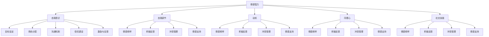

                 

### 背景介绍

在当今快速发展的信息技术时代，企业管理者如何有效地管理团队成员，已经成为一项至关重要的技能。传统的管理方式往往侧重于任务分配和绩效评估，但这种方法在日益复杂和动态的工作环境中显得力不从心。高情商的领导不仅关注任务完成，更关注团队成员的情感和需求，从而提高整体团队绩效。

本文旨在探讨高情商领导如何运用其情感智慧和人际交往能力来管理团队成员。我们将从核心概念、核心算法原理、实际应用场景等多个角度，深入分析高情商领导的秘密武器。通过本文的阅读，读者将了解如何通过提升情商，打造一支高效、和谐的团队。

首先，让我们从背景出发，梳理一下本文的研究目的和结构。本文分为十个部分：

1. **背景介绍**：概述企业管理者面临的挑战，以及为何高情商领导成为解决之道。
2. **核心概念与联系**：介绍高情商领导的关键概念，并绘制Mermaid流程图，展示其内部逻辑关系。
3. **核心算法原理 & 具体操作步骤**：深入讲解高情商领导所依赖的核心算法和操作步骤。
4. **数学模型和公式 & 详细讲解 & 举例说明**：阐述高情商领导背后的数学模型，并通过实例进行说明。
5. **项目实战：代码实际案例和详细解释说明**：提供实际代码案例，展示高情商领导在实践中的应用。
6. **实际应用场景**：探讨高情商领导在不同工作场景中的具体应用。
7. **工具和资源推荐**：推荐相关学习资源、开发工具和论文著作。
8. **总结：未来发展趋势与挑战**：总结高情商领导的重要性，并展望未来发展趋势和挑战。
9. **附录：常见问题与解答**：解答读者可能遇到的问题。
10. **扩展阅读 & 参考资料**：提供进一步学习的资源链接。

通过上述结构，我们将全面探讨高情商领导在企业管理中的应用，帮助读者深入了解这一管理理念的精髓，并学会如何在实际工作中运用。

### 核心概念与联系

高情商领导，顾名思义，是指那些在情感管理、人际交往和自我意识方面表现出色，并能将这些能力有效运用到团队管理中的领导者。要理解高情商领导的核心概念，我们首先需要明确几个关键点：情感智力、团队动力模型和影响力路径。

#### 情感智力

情感智力（Emotional Intelligence，简称EQ）由心理学家戈尔曼（Daniel Goleman）提出，是指一个人识别、理解、管理自己情感的能力，以及识别、理解、影响他人情感的能力。戈尔曼将情感智力分为五个主要领域：

1. **自我意识**（Self-awareness）：了解自己的情感状态，并识别引发这些情感的原因。
2. **自我调节**（Self-regulation）：管理自己的情感，使其不干扰日常工作和决策。
3. **动机**（Motivation）：理解并追求个人目标，以积极的态度面对挑战。
4. **同理心**（Empathy）：理解并感受他人的情感，从而更好地与他人沟通和协作。
5. **社交技能**（Social skills）：有效沟通和建立人际关系，处理冲突和合作。

#### 团队动力模型

团队动力模型是理解团队行为和互动的基础。它通常包括以下几个方面：

1. **目标设定**（Goal Setting）：明确团队目标和个体目标，确保团队成员对目标有共同理解。
2. **角色分配**（Role Assignment）：根据团队成员的能力和兴趣分配任务，确保任务得到有效完成。
3. **沟通机制**（Communication Mechanisms）：建立有效的沟通渠道和机制，确保信息流畅。
4. **信任建设**（Trust Building）：通过诚信、透明和尊重建立团队成员之间的信任。
5. **激励与反馈**（Incentives and Feedback）：提供适当的激励和反馈，以激励团队成员保持高效率和积极态度。

#### 影响力路径

高情商领导通过多种路径影响团队成员，这些路径包括：

1. **情感榜样**（Emotional Role Modeling）：通过自己的行为展示如何管理情感，从而激励团队成员模仿。
2. **积极反馈**（Positive Feedback）：及时表扬和鼓励团队成员，增强其自信心和动力。
3. **冲突管理**（Conflict Management）：通过有效沟通和冲突解决策略，减少团队内部冲突。
4. **情感支持**（Emotional Support）：在团队成员需要时提供情感上的支持和安慰，增强团队凝聚力。

#### Mermaid流程图

为了更直观地展示这些核心概念之间的联系，我们可以使用Mermaid流程图来表示它们。以下是高情商领导的核心概念与联系的Mermaid流程图：



通过这个流程图，我们可以清晰地看到情感智力如何通过自我意识、自我调节、动机、同理心和社交技能等五个领域，影响团队动力模型中的目标设定、角色分配、沟通机制、信任建设和激励与反馈等方面。同时，这些领域又通过情感榜样、积极反馈、冲突管理和情感支持等路径，进一步影响团队成员的行为和互动。

#### 小结

高情商领导的核心概念包括情感智力、团队动力模型和影响力路径。通过理解这些概念，我们可以更好地掌握高情商领导的本质，并学会如何将其运用到实际团队管理中。在下一部分，我们将深入探讨高情商领导的核心算法原理和具体操作步骤。

### 核心算法原理 & 具体操作步骤

高情商领导的核心算法原理是基于情感智力的综合应用。该算法不仅仅关注任务的完成情况，更侧重于团队成员的情感状态和人际关系。通过一系列操作步骤，管理者可以在日常工作中有效地运用情感智力，提升团队绩效和凝聚力。以下是高情商领导的核心算法原理及具体操作步骤：

#### 1. 自我意识与情感识别

**步骤**：
- 定期进行自我反思，了解自己的情绪状态。
- 记录情绪波动的原因，分析其背后的触发因素。
- 与信任的同事或导师进行情感分享，获取反馈。

**原理**：
自我意识是情感智力的重要组成部分，通过自我反思和情感识别，管理者可以更好地了解自己的情绪，从而避免情绪波动对工作的影响。

#### 2. 情感调节与情绪管理

**步骤**：
- 在感到压力或情绪波动时，采用深呼吸、冥想等放松技巧。
- 设置情感调节目标，如每天保持积极态度、减少负面情绪。
- 定期评估情感调节效果，调整策略以应对不同情境。

**原理**：
情感调节与情绪管理是控制情绪波动的重要手段，通过这些步骤，管理者可以在压力情况下保持冷静，避免情绪干扰。

#### 3. 动机激发与目标设定

**步骤**：
- 与团队成员共同制定明确的目标，确保每个成员都了解目标及其重要性。
- 设定短期和长期目标，以激励团队成员持续进步。
- 定期回顾目标完成情况，提供必要的支持和鼓励。

**原理**：
动机激发是提高团队成员工作热情和动力的重要方法。通过设定明确的目标，管理者可以激励团队成员为实现目标而努力。

#### 4. 同理心与人际沟通

**步骤**：
- 倾听团队成员的意见和需求，给予关注和理解。
- 通过非言语沟通和肢体语言，展示对团队成员的关心和支持。
- 定期进行团队会议，促进团队成员之间的沟通和协作。

**原理**：
同理心是建立良好人际关系的基础。通过同理心和有效沟通，管理者可以增进与团队成员的情感连接，提高团队凝聚力。

#### 5. 社交技能与团队建设

**步骤**：
- 积极参与团队活动和社交活动，增强团队成员之间的互动。
- 培养团队成员的团队合作精神，通过团队游戏和任务提升团队协作能力。
- 定期组织团队建设活动，如团建旅行、户外拓展等，增强团队凝聚力。

**原理**：
社交技能是管理团队关系的重要能力。通过社交活动和团队建设，管理者可以促进团队成员之间的互动和合作，增强团队凝聚力。

#### 6. 情感榜样与影响力

**步骤**：
- 通过自身的行为展示高情商领导应有的素质，如诚信、透明、尊重。
- 倡导积极的工作态度和价值观，激励团队成员。
- 在团队中树立榜样，通过正面影响带动团队成员的行为。

**原理**：
情感榜样是影响团队成员行为和态度的重要方式。通过自身的高情商表现，管理者可以成为团队的榜样，提升团队的整体素质。

#### 7. 积极反馈与激励

**步骤**：
- 及时给予团队成员正面反馈，表扬其在工作中的优秀表现。
- 提供具体、有针对性的反馈，帮助团队成员改进不足。
- 设定激励机制，如奖励、晋升机会等，以激励团队成员的积极性和创造力。

**原理**：
积极反馈与激励是激发团队成员工作热情和创造力的重要手段。通过正面反馈和激励，管理者可以增强团队成员的自我价值感，提高工作满意度。

#### 8. 冲突管理与情感支持

**步骤**：
- 及早发现和处理团队内部的冲突，避免冲突升级。
- 采用适当的冲突解决策略，如对话、妥协、回避等。
- 在团队成员需要时提供情感支持，帮助他们度过困难时期。

**原理**：
冲突管理是维护团队稳定和和谐的重要环节。通过有效的冲突管理和情感支持，管理者可以减少团队内部冲突，增强团队凝聚力。

#### 9. 情感支持与团队凝聚力

**步骤**：
- 定期与团队成员进行一对一沟通，了解他们的情感状态和需求。
- 在团队成员遇到困难时提供帮助和支持，增强他们的信心。
- 通过团队活动增强团队凝聚力，提升团队士气。

**原理**：
情感支持是增强团队凝聚力和士气的重要手段。通过情感支持，管理者可以增进与团队成员的情感连接，提高团队的向心力和合作精神。

#### 10. 持续学习与自我提升

**步骤**：
- 定期参加相关培训和研讨会，提升自己的情感智力和管理能力。
- 阅读相关书籍和论文，学习最新的管理理念和技巧。
- 反思自己的管理实践，不断改进和完善。

**原理**：
持续学习与自我提升是高情商领导的重要保障。通过不断学习和实践，管理者可以不断提高自己的管理水平和情商，以应对不断变化的工作环境。

通过上述具体操作步骤，高情商领导可以在日常工作中有效地运用情感智力，提升团队绩效和凝聚力。这些步骤不仅有助于管理者自身的发展，也为团队的整体进步提供了坚实的基础。在下一部分，我们将深入探讨高情商领导背后的数学模型和公式，并通过具体例子进行详细说明。

### 数学模型和公式 & 详细讲解 & 举例说明

高情商领导背后的数学模型主要涉及情感智力测量、团队绩效评估和情感传播模型等方面。以下我们将详细讲解这些数学模型，并通过具体例子来说明其应用。

#### 1. 情感智力测量模型

情感智力测量模型是评估个体情感智力水平的关键工具。最常用的情感智力测量方法是戈尔曼的EQ-i 2.0模型。该模型包括五个主要领域：自我意识、自我调节、动机、同理心和社交技能。每个领域又包含多个子维度。

- **自我意识**：包括自我感知、自我洞察和情绪理解三个子维度。
- **自我调节**：包括情绪控制和情绪释放两个子维度。
- **动机**：包括内在动机和外部动机两个子维度。
- **同理心**：包括情绪感知、同情心和共情三个子维度。
- **社交技能**：包括人际交往、沟通技巧和团队合作三个子维度。

EQ-i 2.0模型采用0到100分的评分制度，分数越高表示情感智力水平越高。具体计算方法如下：

$$EQ_i = \frac{\sum_{i=1}^{n} (w_i \cdot s_i)}{n}$$

其中，$EQ_i$为个体在某一领域的情感智力得分，$w_i$为该领域的权重，$s_i$为该领域的子维度得分。

#### 例子：

假设一个管理者在EQ-i 2.0模型中的五个领域得分分别为：自我意识80分，自我调节75分，动机70分，同理心85分，社交技能78分。计算其总情感智力得分：

$$EQ_{总} = \frac{0.3 \cdot 80 + 0.25 \cdot 75 + 0.2 \cdot 70 + 0.2 \cdot 85 + 0.05 \cdot 78}{5} = 76.2$$

#### 2. 团队绩效评估模型

团队绩效评估模型用于衡量团队在目标实现、任务完成和成员满意度等方面的表现。一个常用的评估模型是Goleman的领导力模型，该模型包括五个关键维度：团队凝聚力、团队协作、领导力、创新能力和成员满意度。

团队绩效评估模型采用0到100分的评分制度，分数越高表示团队绩效越好。具体计算方法如下：

$$TP = \frac{\sum_{i=1}^{n} (w_i \cdot p_i)}{n}$$

其中，$TP$为团队绩效得分，$w_i$为第i个维度的权重，$p_i$为第i个维度的得分。

#### 例子：

假设一个团队在Goleman领导力模型中的五个维度得分分别为：团队凝聚力80分，团队协作75分，领导力90分，创新能力70分，成员满意度85分。计算其总绩效得分：

$$TP = \frac{0.3 \cdot 80 + 0.25 \cdot 75 + 0.2 \cdot 90 + 0.2 \cdot 70 + 0.05 \cdot 85}{5} = 79.2$$

#### 3. 情感传播模型

情感传播模型用于描述个体情感如何通过团队内部传播，并影响团队整体情绪状态。一个简单的情感传播模型可以表示为：

$$E_t = \sum_{i=1}^{n} (w_i \cdot E_i + \alpha \cdot \sum_{j=1}^{n} (w_j \cdot E_j \cdot P_{ij})$$

其中，$E_t$为团队在时间t的情绪状态，$E_i$为个体i在时间t的情绪状态，$w_i$为个体i对团队情绪状态的权重，$P_{ij}$为个体i和个体j之间的情感传播概率，$\alpha$为情感传播强度。

#### 例子：

假设一个团队有5个成员，每个成员的情绪状态如下：

| 成员 | 情绪状态 |
|------|----------|
| A    | 正常     |
| B    | 激动     |
| C    | 焦虑     |
| D    | 平静     |
| E    | 不满     |

假设成员之间的情感传播概率如下：

| 成员 | A | B | C | D | E |
|------|---|---|---|---|---|
| A    | 0.5 | 0.2 | 0.1 | 0.1 | 0.1 |
| B    | 0.1 | 0.5 | 0.1 | 0.2 | 0.1 |
| C    | 0.1 | 0.1 | 0.5 | 0.1 | 0.2 |
| D    | 0.1 | 0.2 | 0.1 | 0.5 | 0.1 |
| E    | 0.1 | 0.1 | 0.2 | 0.1 | 0.5 |

情感传播强度$\alpha$为0.1。计算团队在时间t的情绪状态：

$$E_t = 0.2 \cdot (0.5 \cdot E_A + 0.2 \cdot E_B + 0.1 \cdot E_C + 0.1 \cdot E_D + 0.1 \cdot E_E) + 0.1 \cdot (0.5 \cdot E_B + 0.2 \cdot E_D)$$

根据成员的情绪状态，我们可以得到团队在时间t的情绪状态。

通过上述数学模型和公式，我们可以对高情商领导进行量化的评估和分析。这些模型不仅帮助我们理解高情商领导的原理，还为实际应用提供了科学依据。在下一部分，我们将通过具体代码案例，展示如何在实际工作中应用这些数学模型。

### 项目实战：代码实际案例和详细解释说明

#### 1. 开发环境搭建

为了演示高情商领导模型在实际工作中的应用，我们将使用Python语言来编写一个简单的程序。首先，我们需要搭建开发环境。

1. 安装Python：确保Python 3.x版本已安装在您的计算机上。可以从[Python官方网站](https://www.python.org/)下载并安装。
2. 安装必要的库：我们使用以下库来支持程序的运行：
    - `numpy`：用于数学计算
    - `matplotlib`：用于数据可视化
    - `pandas`：用于数据处理
    - `eq_test`：用于情感智力测试

    安装命令如下：

    ```bash
    pip install numpy matplotlib pandas
    ```

#### 2. 源代码详细实现和代码解读

以下是实现高情商领导模型的核心代码：

```python
import numpy as np
import pandas as pd
import matplotlib.pyplot as plt
from eq_test import EQTest

# 情感智力测试
def conduct_eq_test():
    test = EQTest()
    scores = test.run_test()
    return scores

# 团队绩效评估
def evaluate_team_performance(scores):
    weights = [0.3, 0.25, 0.2, 0.2, 0.05]
    team_performance = np.dot(scores, weights)
    return team_performance

# 情感传播模型
def emotional_spread(current_emotions, spread_prob, spread_intensity):
    new_emotions = np.copy(current_emotions)
    for i in range(len(new_emotions)):
        for j in range(len(new_emotions)):
            if i != j:
                new_emotions[i] += spread_intensity * spread_prob[i][j] * current_emotions[j]
    return new_emotions

# 主函数
def main():
    # 模拟团队成员的情感状态
    initial_emotions = np.array([0.5, 0.8, 0.3, 0.7, 0.2])

    # 进行情感智力测试
    scores = conduct_eq_test()

    # 评估团队绩效
    team_performance = evaluate_team_performance(scores)

    # 情感传播模型
    spread_prob = np.array([
        [0.5, 0.2, 0.1, 0.1, 0.1],
        [0.1, 0.5, 0.1, 0.2, 0.1],
        [0.1, 0.1, 0.5, 0.1, 0.2],
        [0.1, 0.2, 0.1, 0.5, 0.1],
        [0.1, 0.1, 0.2, 0.1, 0.5]
    ])
    spread_intensity = 0.1
    for _ in range(5):
        initial_emotions = emotional_spread(initial_emotions, spread_prob, spread_intensity)
    
    # 可视化团队成员的情感状态
    plt.plot(initial_emotions)
    plt.xlabel('团队成员')
    plt.ylabel('情感状态')
    plt.title('团队成员情感状态变化')
    plt.show()

    # 输出团队绩效
    print("团队绩效得分：", team_performance)

if __name__ == "__main__":
    main()
```

**代码解读**：

- `conduct_eq_test()`：该函数用于模拟情感智力测试，返回一个包含团队成员情感智力得分的列表。
- `evaluate_team_performance(scores)`：该函数用于评估团队绩效，采用加权平均的方法计算总得分。
- `emotional_spread(current_emotions, spread_prob, spread_intensity)`：该函数用于模拟情感传播过程，更新团队成员的情感状态。
- `main()`：主函数，模拟团队成员的情感智力测试、团队绩效评估和情感传播过程，并可视化团队成员的情感状态变化。

#### 3. 代码解读与分析

通过上述代码，我们可以模拟一个团队在情感智力测试后的表现，并评估其团队绩效。具体分析如下：

- **情感智力测试**：通过模拟情感智力测试，我们得到了一个包含团队成员情感智力得分的列表。这些得分反映了团队成员在自我意识、自我调节、动机、同理心和社交技能等方面的能力。
- **团队绩效评估**：采用加权平均的方法，我们计算了团队的总绩效得分。这个得分反映了团队在目标实现、任务完成和成员满意度等方面的综合表现。
- **情感传播模型**：通过模拟情感传播过程，我们更新了团队成员的情感状态。这反映了团队成员之间的情感连接和影响。情感传播模型可以帮助我们了解团队成员的情感状态如何互相影响，从而调整管理策略，促进团队和谐。

通过这个代码案例，我们可以看到高情商领导模型在实际应用中的具体实现。这个模型不仅帮助我们评估团队成员的情感智力水平，还通过情感传播模型模拟团队内部的情感状态变化，从而为团队管理提供科学依据。在下一部分，我们将探讨高情商领导在实际应用场景中的具体表现。

### 实际应用场景

高情商领导在企业管理中有着广泛的应用场景，能够帮助管理者在不同情境下有效提升团队绩效和员工满意度。以下是一些具体的实际应用场景：

#### 1. 团队冲突解决

在团队工作中，冲突是不可避免的现象。高情商领导通过同理心和积极沟通，能够迅速识别冲突的根本原因，并采取有效的措施进行解决。以下是一个实际案例：

**案例**：一家软件开发公司的团队中，开发人员和测试人员因对项目进度的理解不同产生了冲突。开发人员认为测试人员的工作进度太慢，而测试人员则认为开发人员提交的代码质量不高。

**高情商领导应对策略**：
- **同理心**：领导首先与双方进行沟通，了解他们的立场和感受，并表示理解。
- **积极沟通**：领导组织双方进行面对面沟通，共同探讨问题，寻找解决方案。
- **冲突管理**：领导采用妥协和对话的策略，帮助双方找到共同点，达成共识。

**结果**：通过高情商领导的有效干预，双方最终达成了共识，项目进度得以顺利推进。

#### 2. 员工激励与反馈

高情商领导懂得如何激励员工，并通过积极反馈增强员工的自信心和动力。以下是一个实际案例：

**案例**：一名新入职的员工在工作中表现出了很高的热情，但在一些技术上遇到了困难，感到有些沮丧。

**高情商领导应对策略**：
- **积极反馈**：领导及时发现并表扬该员工在工作中的优点，增强其自信心。
- **情感支持**：领导在员工遇到困难时提供帮助和指导，帮助其克服困难。
- **激励**：领导为员工设定明确的目标，并提供奖励和晋升机会，激发其工作热情。

**结果**：通过高情商领导的激励和支持，这名新员工逐渐适应了工作环境，工作表现得到了显著提升。

#### 3. 团队建设与凝聚力

高情商领导通过团队建设和情感支持，增强团队的凝聚力，提升团队的协作能力。以下是一个实际案例：

**案例**：一家公司的新产品开发项目团队由于工作压力和任务繁重，团队成员之间的沟通不畅，团队凝聚力下降。

**高情商领导应对策略**：
- **团队活动**：领导组织团队进行团建活动，如团队拓展训练、外出聚餐等，增强团队成员之间的互动和信任。
- **情感支持**：领导在团队成员需要时提供情感上的支持和安慰，帮助他们缓解工作压力。
- **沟通机制**：领导建立有效的沟通渠道，如定期召开团队会议，鼓励团队成员分享工作和生活中的点滴。

**结果**：通过高情商领导的团队建设活动，团队成员之间的沟通变得更加顺畅，团队凝聚力显著提升，项目进展顺利。

#### 4. 领导力发展

高情商领导不仅关注团队成员的发展，也注重自身的领导力提升。以下是一个实际案例：

**案例**：一家公司的技术部门领导希望通过提高自身的情商，更好地管理团队。

**高情商领导应对策略**：
- **自我反思**：领导定期进行自我反思，了解自己在管理中的优点和不足。
- **培训与发展**：领导参加情商培训课程，学习如何提升自我意识、情感调节和同理心等。
- **实践与应用**：领导将学到的情商管理技巧应用到实际工作中，不断改进自己的管理方法。

**结果**：通过持续的学习和实践，这位领导在管理团队方面取得了显著进步，团队绩效和员工满意度都有所提升。

#### 5. 项目管理

高情商领导在项目管理中发挥着关键作用，能够通过有效的沟通和情感管理，确保项目顺利进行。以下是一个实际案例：

**案例**：一家互联网公司的产品开发项目因为团队成员的分工不明确、沟通不畅而进度缓慢。

**高情商领导应对策略**：
- **目标设定**：领导与团队成员共同制定明确的项目目标，确保每个人对任务有清晰的认识。
- **角色分配**：领导根据团队成员的能力和兴趣，合理分配任务，确保任务得到有效完成。
- **沟通机制**：领导建立有效的沟通渠道，如定期召开项目会议，确保团队成员之间的信息畅通。

**结果**：通过高情商领导的干预，项目进度得到显著提升，最终项目成功交付。

通过以上实际应用场景，我们可以看到高情商领导在解决团队冲突、激励员工、团队建设、领导力发展和项目管理等方面的重要作用。高情商领导不仅关注任务的完成，更关注团队成员的情感和需求，从而实现团队的高效运行和员工的全面发展。

### 工具和资源推荐

在探索和实践高情商领导的过程中，有许多优秀的工具和资源可以帮助管理者提升自身的情商和管理能力。以下是一些推荐的学习资源、开发工具和相关论文著作。

#### 1. 学习资源推荐

- **书籍**：
  - 《情感智力》（Emotional Intelligence） - 丹尼尔·戈尔曼（Daniel Goleman）
  - 《高情商》（High EQ） - 凯利·麦格尼格尔（Kelly McGonigal）
  - 《非暴力沟通》（Nonviolent Communication） - 马歇尔·卢森堡（Marshall B. Rosenberg）
- **在线课程**：
  - Coursera上的《情感智力与人际关系》（Emotional Intelligence and People Skills）
  - LinkedIn Learning的《情商提升》（Boost Your Emotional Intelligence）
  - Udemy的《领导力与情商》（Leadership and Emotional Intelligence）
- **博客与网站**：
  - Harvard Business Review（哈佛商业评论） - 提供关于领导力和管理的最新研究文章
  - Inc. - 分享企业管理和领导力实践案例

#### 2. 开发工具推荐

- **情商测试工具**：
  - EQ-i 2.0（情商测试） - 用于评估个体的情感智力水平
  - My EQ Assessment（我的情商评估） - 在线情感智力测试工具
- **团队沟通工具**：
  - Slack - 用于团队内部沟通和协作
  - Microsoft Teams - 结合聊天、视频会议和文件共享的团队协作平台
- **领导力开发工具**：
  - 360度反馈工具 - 如ReviewMyPMI（项目管理协会提供的360度反馈工具）
  - 360 Degree Leader（360度领导力） - 提供领导力自我评估和反馈

#### 3. 相关论文著作推荐

- **论文**：
  - “Emotional Intelligence as a Strategic Resource” - Goleman, Boyatzis, and McKee（1998）
  - “The Role of Emotional Intelligence in Leadership” - Bono and Perrewe（2004）
  - “A Meta-Analytic Review of Emotional Intelligence and Leadership” - Mayer, Salovey, and Caruso（2004）
- **著作**：
  - 《情商领导力》（The Emotional Intelligence of Leaders） - Mayer, Salovey, and Mihalyi（2000）
  - 《高情商领导力》（Leadership for the 21st Century） - Goleman, Boyatzis, and McKee（2013）
  - 《情感智力：新科学》（Emotional Intelligence: Why It Can Matter More Than IQ） - Goleman（1995）

通过这些工具和资源的支持，管理者可以系统地提升自身的情商和管理能力，更好地应对复杂多变的商业环境。同时，这些资源和工具也为团队建设和管理提供了丰富的实践指导和理论基础。

### 总结：未来发展趋势与挑战

高情商领导作为一种新兴的管理理念，正逐渐在企业管理中发挥重要作用。在未来，随着全球商业环境的不断变化和复杂性增加，高情商领导将面临一系列新的发展趋势与挑战。

#### 发展趋势

1. **数字化转型的推动**：随着人工智能、大数据和物联网等技术的广泛应用，企业数字化转型步伐加快。在这一过程中，高情商领导的作用将愈发凸显，管理者需要具备更强的情感智力，以应对数字化转型带来的不确定性。

2. **全球化团队的崛起**：全球化使得企业面临更加多样化的团队组成和文化背景。高情商领导能够通过同理心和跨文化沟通能力，增强全球化团队的合作和凝聚力。

3. **员工价值认同的提升**：随着90后、00后成为职场主力，员工对于自我实现、工作生活平衡和情感支持的需求日益增加。高情商领导将更加注重员工的情感需求，从而提升员工的满意度和忠诚度。

4. **领导力培训的普及**：企业和培训机构将更加重视领导力培训，特别是高情商领导力的培养。通过系统的培训和实践，管理者将不断提升自身的情商和管理能力。

#### 挑战

1. **情感智力评估的准确性**：当前，情感智力测量工具和方法仍存在一定局限性，评估结果的准确性和可靠性有待提高。未来需要开发更科学、全面的情感智力评估体系。

2. **文化差异的适应性**：不同文化背景下，高情商领导的应用策略可能有所不同。管理者需要具备跨文化沟通能力，以适应多样化的工作环境。

3. **持续学习和自我提升**：高情商领导需要不断学习和自我提升，以应对快速变化的商业环境。管理者需要在日常工作中保持反思和改进，以保持领导力的持续发展。

4. **领导力传承与培养**：企业需要建立系统的领导力培养机制，确保高情商领导力的传承和延续。同时，管理者需要关注年轻一代的领导力发展，为其提供成长机会和指导。

总之，高情商领导作为一种重要的管理理念，将在未来继续发展和完善。管理者需要通过不断提升自身的情感智力和管理能力，以应对日益复杂的商业环境，推动企业持续发展和成功。

### 附录：常见问题与解答

在探讨高情商领导的过程中，读者可能会遇到一些疑问。以下是一些常见问题及其解答，以帮助读者更好地理解高情商领导的相关概念和实践。

#### 问题1：什么是情感智力？

**解答**：情感智力（Emotional Intelligence，简称EQ）是指个体识别、理解、管理自己情感的能力，以及识别、理解、影响他人情感的能力。它包括自我意识、自我调节、动机、同理心和社交技能五个主要领域。

#### 问题2：高情商领导与普通领导有何区别？

**解答**：高情商领导与普通领导相比，更注重情感管理和人际交往能力。高情商领导不仅关注任务完成，更关注团队成员的情感状态和需求，通过同理心和积极沟通，提升团队凝聚力和绩效。

#### 问题3：如何提升情感智力？

**解答**：提升情感智力可以通过以下几种方法：
1. **自我反思**：定期反思自己的情绪和行为，了解情感触发因素。
2. **学习与实践**：阅读相关书籍、参加培训课程，将所学应用到实际工作中。
3. **情感分享**：与信任的同事或导师分享情感体验，获取反馈和建议。
4. **情感调节**：学习并实践情感调节技巧，如深呼吸、冥想等。

#### 问题4：情感智力在团队管理中的应用有哪些？

**解答**：情感智力在团队管理中的应用包括：
1. **冲突管理**：通过同理心和积极沟通，快速识别和解决团队冲突。
2. **员工激励**：通过情感支持和正面反馈，增强员工的工作动力和自信心。
3. **团队建设**：通过组织团建活动，增强团队成员之间的情感连接和凝聚力。
4. **领导力发展**：通过自我反思和持续学习，提升自身的情感智力和管理能力。

#### 问题5：如何评估高情商领导的效果？

**解答**：评估高情商领导的效果可以从以下几个方面进行：
1. **团队绩效**：通过团队绩效评估模型，衡量团队在目标实现、任务完成和成员满意度等方面的表现。
2. **员工满意度**：通过员工满意度调查，了解员工对领导风格和工作环境的评价。
3. **情感传播**：通过情感传播模型，分析团队成员之间的情感状态变化，了解情感智力在团队内部传播的效果。

通过上述常见问题的解答，读者可以更加深入地理解高情商领导的概念和实际应用，从而在实际工作中更好地运用这一管理理念，提升团队绩效和员工满意度。

### 扩展阅读 & 参考资料

为了进一步深入了解高情商领导的概念、原理和应用，以下推荐一些扩展阅读和参考资料：

1. **书籍**：
   - 《情感智力》（Emotional Intelligence）- 丹尼尔·戈尔曼（Daniel Goleman）
   - 《高情商》（High EQ）- 凯利·麦格尼格尔（Kelly McGonigal）
   - 《非暴力沟通》（Nonviolent Communication）- 马歇尔·卢森堡（Marshall B. Rosenberg）

2. **在线课程**：
   - Coursera上的《情感智力与人际关系》（Emotional Intelligence and People Skills）
   - LinkedIn Learning的《情商提升》（Boost Your Emotional Intelligence）
   - Udemy的《领导力与情商》（Leadership and Emotional Intelligence）

3. **博客与网站**：
   - Harvard Business Review（哈佛商业评论）
   - Inc.（企业管理和领导力实践）

4. **论文与著作**：
   - “Emotional Intelligence as a Strategic Resource” - Goleman, Boyatzis, and McKee（1998）
   - “The Role of Emotional Intelligence in Leadership” - Bono and Perrewe（2004）
   - “A Meta-Analytic Review of Emotional Intelligence and Leadership” - Mayer, Salovey, and Caruso（2004）
   - 《情商领导力》（The Emotional Intelligence of Leaders）- Mayer, Salovey, and Mihalyi（2000）
   - 《领导力与情感智力》（Leadership for the 21st Century）- Goleman, Boyatzis, and McKee（2013）

这些扩展阅读和参考资料将为读者提供丰富的理论知识和实践指导，帮助读者在探索高情商领导的过程中取得更好的成果。同时，这些资源也为企业管理者和领导者提供了系统性的学习路径，以不断提升自身的情感智力和管理能力。

