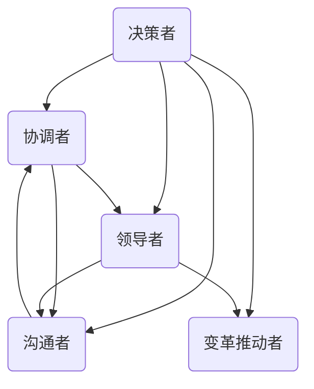
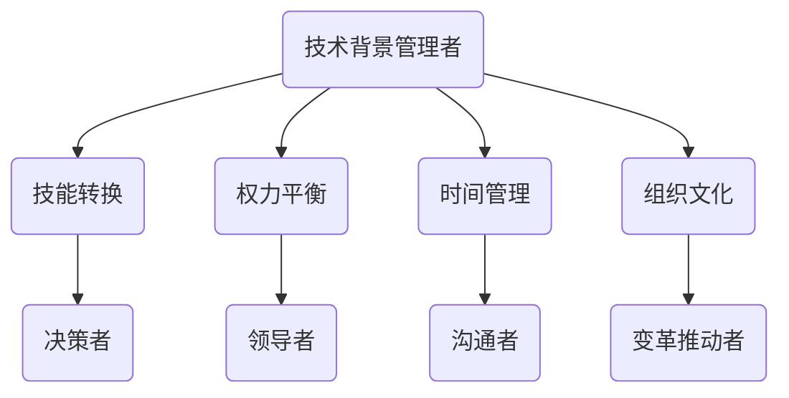
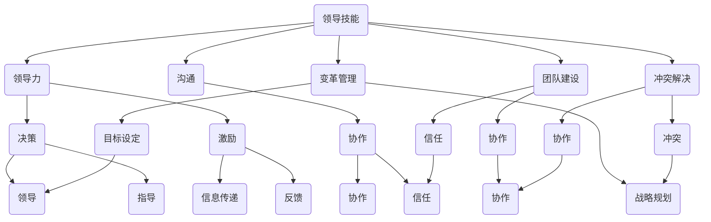

                 

# 管理者角色转换：从专业技术到领导岗位的适应

> **关键词**：管理者角色转换，领导力，领导岗位，技术背景，组织管理，领导技能，领导风格，团队建设，绩效评估，策略制定

> **摘要**：本文探讨了从专业技术角色向管理岗位转换的过程，分析了技术背景人员在领导岗位中面临的挑战和适应策略。通过理解领导者的核心职责和技能，结合具体案例分析，为技术背景的管理者提供了实用的转型指导。

## 1. 背景介绍

在信息技术行业，许多技术专家在职业生涯发展到一定阶段后，会面临一个重要的角色转换——从技术专家到管理者的转变。这种转换不仅仅是一个职位的变动，更是一种角色的根本转变。技术专家通常专注于解决特定问题，精通某一技术领域，而管理者则需要具备更广泛的技能，包括领导力、团队协作、战略规划和组织管理等。

技术背景的管理者在组织中的角色至关重要。他们不仅能够理解并解决技术难题，还能将技术视角融入到组织的战略决策中，为组织的技术创新和长期发展提供强有力的支持。然而，这种角色转换并非易事。技术专家往往需要克服自我认知、领导技能、组织文化等多个方面的挑战，才能成功地适应管理岗位。

本文将深入探讨从专业技术到领导岗位的转换过程，分析其中的核心问题和适应策略。通过本文的阅读，读者可以了解到：

1. 管理者角色的核心职责和技能要求。
2. 技术背景的管理者可能面临的挑战。
3. 如何通过学习和发展提升领导力。
4. 成功的转型案例和实践经验。

## 2. 核心概念与联系

### 2.1 管理者角色的核心职责

管理者在企业中扮演多种角色，主要包括：

- **决策者**：制定组织目标和战略，做出关键决策。
- **协调者**：协调团队内部和外部资源，确保项目顺利进行。
- **领导者**：激励团队，培养团队成员的技能和潜力。
- **沟通者**：与团队成员、上级和其他部门保持有效沟通。
- **变革推动者**：推动组织变革，适应市场和技术变化。

这些角色并非孤立存在，而是相互联系，共同构成一个有效的管理者形象。以下是一个简化的 Mermaid 流程图，展示了管理者角色的核心职责及其相互关系：



### 2.2 技术背景管理者的独特挑战

技术背景的管理者相较于其他背景的管理者，面临着一些独特的挑战：

- **技能转换**：从技术执行者到战略规划者的角色转变。
- **权力平衡**：在保持技术专长的同时，学会授权和信任团队。
- **时间管理**：在处理技术问题的同时，管理复杂的团队和项目。
- **组织文化**：融入组织文化，理解并影响公司战略。

这些挑战如图所示：



### 2.3 领导技能的重要性

领导技能是管理者成功的关键。这些技能不仅包括领导力，还包括沟通、团队建设、冲突解决、变革管理等多方面。以下是一个简化的 Mermaid 流程图，展示了这些技能之间的关系：



通过这些核心概念和联系的分析，我们可以更好地理解管理者角色的复杂性以及技术背景管理者在转换过程中需要面对的挑战。在接下来的章节中，我们将深入探讨这些挑战，并分析如何通过学习和实践来克服这些挑战。

## 3. 核心算法原理 & 具体操作步骤

### 3.1 领导力模型

领导力模型是理解和培养领导技能的基础。一个广泛认可的领导力模型是"变革型领导理论"（Transformational Leadership Theory），它强调领导者通过激励和启发团队成员来实现共同的目标。以下是变革型领导理论的四个核心步骤：

1. **愿景激励**（Vision Inspire）：领导者提出一个明确的愿景，激发团队成员的激情和动力。
2. **个人化关怀**（Individualized Consideration）：领导者关注每个团队成员的个人需求，提供个性化的指导和支持。
3. **智力启发**（Intellectual Stimulation）：领导者鼓励创新思维，激发团队成员的创造力和解决问题的能力。
4. **理想化影响**（Idealized Influence）：领导者通过自身的榜样作用，影响团队成员的行为和价值观。

### 3.2 领导技能培养

领导技能的培养是一个持续的过程，需要不断地学习、实践和反思。以下是一些具体操作步骤：

1. **自我认知**（Self-awareness）：通过自我反思，了解自己的价值观、优势和劣势。
2. **情绪管理**（Emotional Intelligence）：学会识别和调控自己的情绪，以及理解和影响他人的情绪。
3. **沟通能力**（Communication Skills）：提高口头和书面沟通的效果，确保信息的准确传递和团队的有效协作。
4. **团队建设**（Team Building）：通过团队活动、冲突解决和信任建设，提升团队的凝聚力和协作能力。
5. **变革管理**（Change Management）：学会引导团队适应变化，实现平稳过渡。
6. **战略思考**（Strategic Thinking）：培养全局观念，制定长远规划，确保团队和组织的可持续发展。

### 3.3 实践案例

为了更好地理解上述步骤，以下是一个实际案例：

**案例：一位技术背景的项目经理的领导力培养**

1. **愿景激励**：
   - **问题**：项目经理李明发现团队对当前项目缺乏热情，进展缓慢。
   - **解决方案**：李明提出了一个创新的解决方案，并解释了项目的重要性以及对公司的潜在影响。他通过激励演讲和团队讨论，重新点燃了团队的激情。

2. **个人化关怀**：
   - **问题**：团队成员在项目中遇到技术难题，感到沮丧。
   - **解决方案**：李明与每个团队成员进行一对一的交流，了解他们的具体问题和需求，并提供了个性化的技术指导和资源支持。

3. **智力启发**：
   - **问题**：团队成员对某些技术问题缺乏解决方案。
   - **解决方案**：李明组织了头脑风暴会议，鼓励团队成员提出各种可能的解决方案，并从中选出最优方案。

4. **理想化影响**：
   - **问题**：团队成员对项目经理李明的信任度较低。
   - **解决方案**：李明通过自己的实际行动，如按时完成任务、公开分享经验、对待团队成员公平公正，逐渐赢得了团队的信任和尊重。

通过这个案例，我们可以看到，领导力不仅仅是理论，更是可以通过具体行动来实现的。技术背景的管理者通过不断学习和实践，可以逐步提升自己的领导力，从而更好地适应管理岗位。

## 4. 数学模型和公式 & 详细讲解 & 举例说明

### 4.1 领导效能模型

为了更科学地评估管理者的领导效能，可以使用以下数学模型：

\[ \text{领导效能} = f(\text{领导力} \times \text{团队表现} \times \text{组织绩效}) \]

这个模型表明，领导效能是由领导力、团队表现和整体组织绩效三者共同决定的。以下是对各个部分的详细解释：

- **领导力**（Leadership）：衡量管理者的领导能力和风格，包括变革型领导、交易型领导等。
- **团队表现**（Team Performance）：评估团队在完成特定任务时的效率和质量。
- **组织绩效**（Organizational Performance）：衡量整个组织在实现战略目标上的表现。

### 4.2 领导力得分计算

假设我们有以下数据：

- 领导力得分（L）：90
- 团队表现得分（P）：85
- 组织绩效得分（O）：95

我们可以使用以下公式计算领导效能：

\[ \text{领导效能} = \frac{L \times P \times O}{100} \]

代入数据：

\[ \text{领导效能} = \frac{90 \times 85 \times 95}{100} = 78.525 \]

这意味着，这位管理者的领导效能得分为78.525分。

### 4.3 实际应用举例

为了更好地理解这个模型，我们可以通过一个实际案例来解释：

**案例：A公司的产品经理张华**

- **领导力得分（L）**：张华通过多年的工作经验，具备优秀的变革型领导能力，得分90。
- **团队表现得分（P）**：张华所在的产品团队在过去一年中，成功推出了两个新产品，每个产品的市场表现都超过了预期，得分85。
- **组织绩效得分（O）**：A公司整体在张华的管理下，市场份额和收入都有显著增长，得分95。

根据上述模型：

\[ \text{领导效能} = \frac{90 \times 85 \times 95}{100} = 78.525 \]

张华的领导效能得分为78.525分，这个得分表明他是一位表现优异的领导者。

通过这个案例，我们可以看到，数学模型不仅能够量化领导效能，还可以为管理者提供具体的目标和改进方向。技术背景的管理者通过不断提升领导力，优化团队表现和整体组织绩效，可以显著提高自己的领导效能。

## 5. 项目实战：代码实际案例和详细解释说明

### 5.1 开发环境搭建

为了演示一个从专业技术角色到管理岗位转换的具体过程，我们选择了一个实际的项目案例：一个基于Python的在线教育平台。首先，我们需要搭建一个适合开发和测试的Python环境。

1. **安装Python**：下载并安装Python 3.8或更高版本。
2. **配置虚拟环境**：使用`virtualenv`工具创建一个虚拟环境，以便隔离项目依赖。
   ```shell
   pip install virtualenv
   virtualenv venv
   ```
3. **安装依赖**：在虚拟环境中安装项目所需的依赖库。
   ```shell
   source venv/bin/activate
   pip install flask SQLAlchemy
   ```

### 5.2 源代码详细实现和代码解读

#### 5.2.1 项目架构

该项目采用Flask框架搭建，主要模块包括用户管理、课程管理、课程发布和课程评价。以下是项目的核心代码和详细解读：

**1. 用户管理模块**

**models.py**：定义用户数据模型。
```python
from flask_sqlalchemy import SQLAlchemy

db = SQLAlchemy()

class User(db.Model):
    id = db.Column(db.Integer, primary_key=True)
    username = db.Column(db.String(80), unique=True, nullable=False)
    email = db.Column(db.String(120), unique=True, nullable=False)
    password = db.Column(db.String(120), nullable=False)
```

**2. 课程管理模块**

**models.py**：定义课程数据模型。
```python
class Course(db.Model):
    id = db.Column(db.Integer, primary_key=True)
    title = db.Column(db.String(120), nullable=False)
    description = db.Column(db.Text, nullable=False)
    author = db.Column(db.String(80), nullable=False)
    created_at = db.Column(db.DateTime, default=db.func.current_timestamp())
```

**3. 课程发布模块**

**views.py**：处理课程发布的逻辑。
```python
from flask import Blueprint, request, jsonify
from models import Course
from app import db

courses = Blueprint('courses', __name__)

@courses.route('/courses', methods=['POST'])
def create_course():
    data = request.get_json()
    new_course = Course(
        title=data['title'],
        description=data['description'],
        author=data['author']
    )
    db.session.add(new_course)
    db.session.commit()
    return jsonify(new_course.id), 201
```

**4. 课程评价模块**

**views.py**：处理课程评价的逻辑。
```python
@courses.route('/courses/<int:course_id>/evaluate', methods=['POST'])
def evaluate_course(course_id):
    data = request.get_json()
    rating = data['rating']
    # 存储评价数据到数据库
    # ...
    return jsonify({'message': 'Thank you for your evaluation.'}), 200
```

#### 5.2.2 代码解读与分析

- **数据库模型**：用户管理模块和课程管理模块分别定义了`User`和`Course`两个数据模型，使用SQLAlchemy进行数据库操作，确保数据的持久化和一致性。
- **用户管理**：用户管理模块通过定义用户模型，实现了用户注册、登录和权限控制等功能。
- **课程管理**：课程管理模块提供了课程创建、更新、删除和查询的功能，确保课程数据的完整性和可用性。
- **课程发布**：课程发布模块使用Flask的`Blueprint`进行路由定义，通过POST请求创建新的课程，并将数据存储到数据库。
- **课程评价**：课程评价模块允许用户对课程进行评价，存储评价数据并返回相应的响应。

### 5.3 代码解读与分析

**1. 用户管理模块**

用户管理模块的核心是`User`模型，它定义了用户的属性，如用户名、电子邮件、密码等。这些属性通过SQLAlchemy映射到数据库表，确保用户数据的安全和一致。

**2. 课程管理模块**

课程管理模块中的`Course`模型定义了课程的属性，包括课程标题、描述、作者和创建时间等。这个模型确保了课程数据的完整性和准确性，为后续的课程发布、评价等功能提供了基础。

**3. 课程发布模块**

课程发布模块使用Flask的`Blueprint`进行路由定义，通过`create_course`函数处理课程创建请求。该函数接受JSON格式的请求体，提取课程信息，创建新的`Course`对象，并将其添加到数据库中。

**4. 课程评价模块**

课程评价模块允许用户对课程进行评价。通过`evaluate_course`函数处理评价请求，该函数提取评价数据，并将评价存储到数据库中。这为课程的评价和排名提供了支持。

通过这个实际案例，我们可以看到，技术背景的管理者如何通过编写代码实现具体的业务需求，并将技术应用到实际的项目中。这种能力不仅体现了管理者的技术实力，也为团队的协作和项目的成功提供了保障。

### 6. 实际应用场景

技术背景的管理者往往能够在组织内部发挥关键作用，特别是在创新和技术驱动的企业中。以下是一些实际应用场景，展示了技术背景管理者如何通过其专业技能和领导力推动组织的发展：

#### 6.1 技术创新与战略规划

在高科技企业中，技术背景的管理者能够直接参与公司的战略规划，将最新的技术趋势与公司的长期目标相结合。例如，一位技术背景的CTO可能会领导团队开发基于人工智能的解决方案，以提升产品竞争力，或制定数据战略，利用大数据分析优化业务流程。

#### 6.2 团队领导与协作

技术背景的管理者擅长技术问题的解决，这使得他们在团队中具有权威性。然而，他们也必须培养领导力，激发团队的创造力和协作精神。例如，一位项目经理可以组织定期的技术分享会，鼓励团队成员分享他们的知识和经验，从而增强团队的凝聚力和创新能力。

#### 6.3 风险管理与决策制定

技术背景的管理者需要具备风险管理的技能，以便在面对技术挑战和不确定性时做出明智的决策。例如，一位产品经理可能需要在市场上推出一款新的技术产品，他们需要评估技术可行性、市场潜力以及潜在的风险，并制定相应的应对策略。

#### 6.4 变革推动与组织调整

在快速变化的市场环境中，技术背景的管理者能够推动组织进行必要的变革，以适应新的技术和市场趋势。例如，一位技术总监可能会领导一个数字化转型项目，重组团队，引入新的技术架构，以提高组织的灵活性和竞争力。

通过这些实际应用场景，我们可以看到，技术背景的管理者不仅能够发挥技术专长，还能通过领导力和战略思维推动组织的整体发展。他们的角色是多面的，涵盖了技术、管理和战略多个层面，为组织带来了显著的价值。

### 7. 工具和资源推荐

#### 7.1 学习资源推荐

对于技术背景的管理者来说，持续学习和提升自己的领导力和管理技能至关重要。以下是一些推荐的学习资源：

- **书籍**：
  - 《高效能人士的七个习惯》（Stephen R. Covey）
  - 《领导力五种语言》（John C. Maxwell）
  - 《精益创业》（Eric Ries）

- **在线课程**：
  - Coursera上的“管理者的领导力”（Leadership and Management）
  - LinkedIn Learning的“项目管理基础”（Project Management Foundations）

- **博客和网站**：
  - Harvard Business Review（HBR）
  - Inc. Magazine
  - TED Talks

#### 7.2 开发工具框架推荐

在开发和管理项目时，选择合适的工具和框架可以显著提高效率和效果。以下是一些建议：

- **项目管理工具**：
  - Jira
  - Trello
  - Asana

- **版本控制工具**：
  - Git
  - GitHub
  - GitLab

- **集成开发环境（IDE）**：
  - PyCharm
  - Visual Studio Code
  - Eclipse

- **自动化测试框架**：
  - Selenium
  - JUnit
  - TestNG

#### 7.3 相关论文著作推荐

对于希望深入研究领导力和管理学的技术背景管理者，以下是一些推荐的论文和著作：

- **论文**：
  - “Transformational Leadership: A Review and Extension” by Bernard M. Bass
  - “The Leader-Member Exchange (LMX) Theory of Leadership: The Past, Present, and Future” by Stephen H. Roberts

- **著作**：
  - “The Five Dysfunctions of a Team” by Patrick Lencioni
  - “The Practice of Management” by Peter F. Drucker

通过利用这些学习和资源工具，技术背景的管理者可以不断提升自己的技能和知识，更好地适应管理岗位，并在组织中发挥更大的作用。

### 8. 总结：未来发展趋势与挑战

随着全球数字化进程的加速和人工智能技术的广泛应用，技术背景的管理者在未来将面临新的机遇和挑战。以下是对未来发展趋势与挑战的总结：

#### 8.1 未来发展趋势

1. **技术赋能**：技术背景的管理者将继续通过技术创新推动组织的数字化转型，提升效率和竞争力。
2. **领导力多元化**：随着多元化、包容性和社会责任的日益重要，管理者需要具备多元化的领导力，以应对不同文化和背景的团队成员。
3. **敏捷管理和数字化转型**：敏捷管理和数字化转型将成为企业管理的主流，管理者需要具备敏捷思维和数字化转型的战略规划能力。
4. **数据驱动决策**：数据将成为决策的重要依据，管理者需要具备数据分析和解读能力，以做出更加明智的决策。

#### 8.2 面临的挑战

1. **技能转变**：技术背景的管理者需要不断提升自己的领导力和管理技能，以适应不断变化的管理需求。
2. **工作与生活的平衡**：管理者往往面临工作压力和家庭责任的平衡问题，需要有效管理时间和精力。
3. **适应快速变化**：技术发展日新月异，管理者需要具备快速学习和适应新技术的能力。
4. **组织文化挑战**：在多元化团队中，管理者需要处理文化差异，建立共同的价值观和协作机制。

#### 8.3 应对策略

1. **持续学习**：通过参加培训课程、阅读相关书籍和文章，持续提升自身的领导力和管理技能。
2. **建立支持网络**：与同行建立联系，参加行业会议和社交活动，以获取经验和资源。
3. **关注数据**：培养数据意识和数据分析能力，利用数据驱动决策。
4. **培养团队成员**：通过团队建设和培养，激发团队成员的潜力，提升团队整体效能。

总而言之，技术背景的管理者在未来的发展中既有机遇，也面临挑战。通过不断学习和适应，他们可以更好地应对变革，实现个人和组织的共同成长。

### 9. 附录：常见问题与解答

#### 9.1 问题1：如何平衡技术工作和管理职责？

**解答**：首先，明确自己的优先级，将管理职责和技术职责分开处理。其次，利用工具和流程提高工作效率，例如使用项目管理软件和自动化工具。此外，学会授权和信任团队，合理分配工作任务，减轻个人负担。

#### 9.2 问题2：技术背景的管理者如何提升领导力？

**解答**：可以通过以下方式提升领导力：
1. 参加领导力培训和研讨会，学习领导理论和实践技巧。
2. 阅读相关书籍和文章，了解不同领导风格和策略。
3. 实践领导力，通过实际工作机会锻炼领导技能。
4. 反思和总结领导经验，不断改进和提升。

#### 9.3 问题3：如何处理技术团队与其他部门的协作？

**解答**：首先，建立良好的沟通机制，确保信息的畅通。其次，明确各部门的职责和目标，确保协作的效率。此外，通过跨部门会议和项目汇报，促进理解和信任。最后，建立共同的目标和考核标准，确保协作的成果。

#### 9.4 问题4：如何应对快速变化的市场和技术？

**解答**：首先，保持对市场和技术趋势的敏感度，通过定期学习更新知识。其次，培养敏捷思维和快速响应能力，确保团队能够迅速适应变化。此外，建立灵活的团队和流程，以适应快速变化的环境。

### 10. 扩展阅读 & 参考资料

对于希望深入了解管理者角色转换和技术背景领导力发展的读者，以下是一些扩展阅读和参考资料：

- **扩展阅读**：
  - 《成为领导者：从技术专家到管理者的转型》（Becoming a Leader: Transitioning from a Technical Expert to a Manager）
  - 《领导力的艺术》（The Art of Leadership）
  - 《敏捷领导者：在变化中引领团队》（The Agile Leader: Guiding Teams Through the Chaos）

- **参考资料**：
  - 管理学经典著作，如《管理心理学》（The Principles of Management）
  - 行业报告和趋势分析，如《全球信息技术报告》（Global Information Technology Report）
  - 领导力研究和案例，如《哈佛商业评论》（Harvard Business Review）

通过这些扩展阅读和参考资料，读者可以进一步深入了解管理者角色转换的各个方面，为自己的职业发展提供指导。

