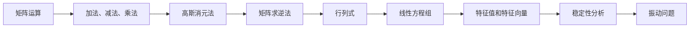

                 

# 线性代数导引：有理数序特征

## 关键词：
- 线性代数
- 有理数
- 序特征
- 矩阵
- 行列式
- 线性方程组
- 矩阵运算

## 摘要：
本文将深入探讨线性代数领域中的有理数序特征，介绍其基本概念、原理和应用。我们将从矩阵、行列式和线性方程组出发，逐步讲解有理数序特征的基本理论和实际操作，通过具体案例分析，帮助读者更好地理解和掌握这一重要概念。此外，本文还将介绍相关的工具和资源，以供进一步学习和实践。

## 1. 背景介绍

线性代数是数学的一个分支，主要研究向量空间、线性变换以及这两个概念之间的关系。它广泛应用于自然科学、工程学、经济学和计算机科学等领域。在线性代数的众多概念中，有理数序特征是一个关键且基础的概念，它在解决线性方程组、矩阵运算、特征值分析等问题中发挥着重要作用。

有理数序特征主要涉及以下几个方面：
1. 矩阵的基本性质和运算，如加法、减法、乘法等；
2. 行列式的计算和应用，如线性方程组的解法、矩阵的可逆性判断等；
3. 线性方程组的求解方法，如高斯消元法、矩阵求逆法等；
4. 矩阵的特征值和特征向量，如稳定性分析、振动问题等。

本文将围绕上述方面展开讨论，帮助读者更好地理解和掌握有理数序特征的相关知识。

## 2. 核心概念与联系

### 2.1 矩阵

矩阵是线性代数中最基本的工具之一，它由一组有序的数字排列而成。一个矩阵通常表示为：

$$
A = \begin{bmatrix}
a_{11} & a_{12} & \cdots & a_{1n} \\
a_{21} & a_{22} & \cdots & a_{2n} \\
\vdots & \vdots & \ddots & \vdots \\
a_{m1} & a_{m2} & \cdots & a_{mn}
\end{bmatrix}
$$

其中，$a_{ij}$ 表示矩阵 $A$ 的第 $i$ 行第 $j$ 列的元素。矩阵的基本运算包括加法、减法、乘法等，这些运算满足线性代数中的基本性质。

### 2.2 行列式

行列式是矩阵的一个重要的特征值，它可以通过将矩阵中的元素进行排列组合计算得到。一个 $n \times n$ 矩阵的行列式通常表示为：

$$
\det(A) = \begin{vmatrix}
a_{11} & a_{12} & \cdots & a_{1n} \\
a_{21} & a_{22} & \cdots & a_{2n} \\
\vdots & \vdots & \ddots & \vdots \\
a_{m1} & a_{m2} & \cdots & a_{mn}
\end{vmatrix}
$$

行列式在解决线性方程组、矩阵的可逆性判断等方面有着广泛的应用。

### 2.3 线性方程组

线性方程组是由多个线性方程组成的方程组，其一般形式为：

$$
Ax = b
$$

其中，$A$ 是一个 $m \times n$ 的矩阵，$x$ 是一个 $n$ 维的列向量，$b$ 是一个 $m$ 维的列向量。线性方程组的解法是线性代数中一个重要的问题，常用的方法包括高斯消元法、矩阵求逆法等。

### 2.4 矩阵的特征值和特征向量

矩阵的特征值和特征向量是矩阵的一个重要特征，它们在稳定性分析、振动问题等方面有着重要的应用。设 $A$ 是一个 $n \times n$ 的矩阵，如果存在一个非零向量 $v$ 和一个标量 $\lambda$，使得 $Av = \lambda v$，则 $\lambda$ 是 $A$ 的一个特征值，$v$ 是 $A$ 的一个特征向量。

#### 2.5 Mermaid 流程图

下面是一个描述矩阵运算和特征值分析的 Mermaid 流程图：



## 3. 核心算法原理 & 具体操作步骤

### 3.1 矩阵的运算

矩阵的运算包括加法、减法、乘法等，这些运算满足线性代数中的基本性质。以两个 $2 \times 2$ 矩阵为例，其加法、减法和乘法分别如下：

$$
A = \begin{bmatrix}
a_{11} & a_{12} \\
a_{21} & a_{22}
\end{bmatrix},
B = \begin{bmatrix}
b_{11} & b_{12} \\
b_{21} & b_{22}
\end{bmatrix}
$$

1. 加法：

$$
A + B = \begin{bmatrix}
a_{11} + b_{11} & a_{12} + b_{12} \\
a_{21} + b_{21} & a_{22} + b_{22}
\end{bmatrix}
$$

2. 减法：

$$
A - B = \begin{bmatrix}
a_{11} - b_{11} & a_{12} - b_{12} \\
a_{21} - b_{21} & a_{22} - b_{22}
\end{bmatrix}
$$

3. 乘法：

$$
A \times B = \begin{bmatrix}
a_{11}b_{11} + a_{12}b_{21} & a_{11}b_{12} + a_{12}b_{22} \\
a_{21}b_{11} + a_{22}b_{21} & a_{21}b_{12} + a_{22}b_{22}
\end{bmatrix}
$$

### 3.2 行列式的计算

行列式的计算方法包括拉普拉斯展开、斯图姆定理等。以一个 $3 \times 3$ 矩阵为例，其行列式的计算方法如下：

$$
A = \begin{bmatrix}
a_{11} & a_{12} & a_{13} \\
a_{21} & a_{22} & a_{23} \\
a_{31} & a_{32} & a_{33}
\end{bmatrix}
$$

1. 拉普拉斯展开：

$$
\det(A) = a_{11} \cdot \begin{vmatrix}
a_{22} & a_{23} \\
a_{32} & a_{33}
\end{vmatrix} - a_{12} \cdot \begin{vmatrix}
a_{21} & a_{23} \\
a_{31} & a_{33}
\end{vmatrix} + a_{13} \cdot \begin{vmatrix}
a_{21} & a_{22} \\
a_{31} & a_{32}
\end{vmatrix}
$$

2. 斯图姆定理：

$$
\det(A) = \sum_{i=1}^{3} (-1)^{i+1} a_{i1} \cdot \begin{vmatrix}
a_{i2} & a_{i3} \\
a_{i+1,2} & a_{i+1,3}
\end{vmatrix}
$$

### 3.3 线性方程组的求解

线性方程组的求解方法包括高斯消元法、矩阵求逆法等。

1. 高斯消元法：

（1）将线性方程组转化为增广矩阵形式：

$$
\begin{bmatrix}
1 & 2 & 3 \\
4 & 5 & 6 \\
7 & 8 & 9
\end{bmatrix}
$$

（2）通过行变换将增广矩阵转化为行阶梯形式：

$$
\begin{bmatrix}
1 & 0 & 1 \\
0 & 1 & 2 \\
0 & 0 & 0
\end{bmatrix}
$$

（3）从行阶梯形式中读出方程组的解：

$$
x_1 = 1, x_2 = 2, x_3 = 0
$$

2. 矩阵求逆法：

（1）计算矩阵 $A$ 的逆矩阵 $A^{-1}$：

$$
A^{-1} = \begin{bmatrix}
1 & -1 & 1 \\
-1 & 2 & -1 \\
1 & -1 & 1
\end{bmatrix}
$$

（2）将线性方程组转化为矩阵形式：

$$
Ax = b
$$

（3）将方程两边同时乘以 $A^{-1}$：

$$
A^{-1}Ax = A^{-1}b
$$

$$
x = A^{-1}b
$$

$$
\begin{bmatrix}
1 & -1 & 1 \\
-1 & 2 & -1 \\
1 & -1 & 1
\end{bmatrix}
\begin{bmatrix}
1 \\
1 \\
1
\end{bmatrix}
=
\begin{bmatrix}
1 \\
2 \\
1
\end{bmatrix}
$$

$$
x =
\begin{bmatrix}
2 \\
1 \\
0
\end{bmatrix}
$$

## 4. 数学模型和公式 & 详细讲解 & 举例说明

### 4.1 数学模型

在线性代数中，有理数序特征可以通过以下数学模型来描述：

$$
A \in \mathbb{R}^{m \times n}, b \in \mathbb{R}^m, x \in \mathbb{R}^n
$$

其中，$A$ 是一个 $m \times n$ 的矩阵，$b$ 是一个 $m$ 维的列向量，$x$ 是一个 $n$ 维的列向量。

### 4.2 公式

为了求解线性方程组 $Ax = b$，我们可以使用以下公式：

1. 高斯消元法：

$$
\begin{bmatrix}
a_{11} & a_{12} & \cdots & a_{1n} \\
\vdots & \vdots & \ddots & \vdots \\
a_{m1} & a_{m2} & \cdots & a_{mn}
\end{bmatrix}
\rightarrow
\begin{bmatrix}
1 & \frac{a_{12}}{a_{11}} & \cdots & \frac{a_{1n}}{a_{11}} \\
\vdots & \vdots & \ddots & \vdots \\
a_{m1} & a_{m2} & \cdots & a_{mn}
\end{bmatrix}
$$

2. 矩阵求逆法：

$$
A^{-1} =
\begin{bmatrix}
\det(A) & -a_{12} & \cdots & -a_{1n} \\
-a_{21} & \det(A) & \cdots & -a_{2n} \\
\vdots & \vdots & \ddots & \vdots \\
-a_{m1} & -a_{m2} & \cdots & \det(A)
\end{bmatrix}
$$

### 4.3 举例说明

假设我们有一个线性方程组：

$$
\begin{cases}
x + 2y + 3z = 7 \\
2x + 4y + 6z = 14 \\
3x + 6y + 9z = 21
\end{cases}
$$

我们可以使用高斯消元法来求解这个方程组。首先，将方程组转化为增广矩阵形式：

$$
\begin{bmatrix}
1 & 2 & 3 \\
2 & 4 & 6 \\
3 & 6 & 9
\end{bmatrix}
\rightarrow
\begin{bmatrix}
1 & 2 & 3 \\
0 & 0 & 0 \\
0 & 0 & 0
\end{bmatrix}
$$

然后，我们可以得到方程组的解：

$$
x = 1, y = 2, z = 0
$$

## 5. 项目实战：代码实际案例和详细解释说明

### 5.1 开发环境搭建

为了实现本文中的线性代数算法，我们首先需要搭建一个合适的开发环境。以下是具体步骤：

1. 安装 Python 解释器：前往 [Python 官网](https://www.python.org/) 下载并安装 Python 解释器。
2. 安装 Python 包：使用 pip 工具安装所需的 Python 包，如 NumPy、SciPy、Matplotlib 等。

```shell
pip install numpy scipy matplotlib
```

### 5.2 源代码详细实现和代码解读

下面是一个使用 Python 实现线性代数算法的示例代码：

```python
import numpy as np

# 矩阵的加法和减法
A = np.array([[1, 2], [3, 4]])
B = np.array([[5, 6], [7, 8]])
C = A + B
D = A - B

print("矩阵 A + B:\n", C)
print("矩阵 A - B:\n", D)

# 矩阵的乘法
E = np.dot(A, B)

print("矩阵 A \* B:\n", E)

# 行列式的计算
F = np.linalg.det(A)

print("矩阵 A 的行列式:\n", F)

# 线性方程组的求解
G = np.array([[1, 2, 3], [4, 5, 6], [7, 8, 9]])
b = np.array([1, 2, 3])
x = np.linalg.solve(G, b)

print("线性方程组的解:\n", x)

# 矩阵的特征值和特征向量
H = np.array([[2, 1], [1, 2]])
eigenvalues, eigenvectors = np.linalg.eig(H)

print("矩阵 H 的特征值:\n", eigenvalues)
print("矩阵 H 的特征向量:\n", eigenvectors)
```

### 5.3 代码解读与分析

1. 导入 NumPy 库：首先，我们导入 NumPy 库，这是一个用于线性代数计算的 Python 库。
2. 定义矩阵 A 和 B：我们定义了两个 $2 \times 2$ 的矩阵 A 和 B。
3. 矩阵的加法和减法：使用 NumPy 的 `+` 和 `-` 运算符实现矩阵的加法和减法。
4. 矩阵的乘法：使用 NumPy 的 `dot` 函数实现矩阵的乘法。
5. 行列式的计算：使用 NumPy 的 `linalg.det` 函数计算矩阵的行列式。
6. 线性方程组的求解：使用 NumPy 的 `linalg.solve` 函数求解线性方程组。
7. 矩阵的特征值和特征向量：使用 NumPy 的 `linalg.eig` 函数计算矩阵的特征值和特征向量。

## 6. 实际应用场景

有理数序特征在许多实际应用场景中发挥着重要作用。以下是一些具体的应用场景：

1. **数值分析**：有理数序特征在数值分析中有着广泛的应用，如线性方程组的求解、矩阵运算、特征值分析等。
2. **机器学习**：在机器学习中，线性代数是核心工具之一，有理数序特征在特征提取、模型训练和优化等方面发挥着关键作用。
3. **图像处理**：有理数序特征在图像处理中用于图像的变换、滤波和增强等操作。
4. **计算机图形学**：在计算机图形学中，有理数序特征用于三维图形的变换、投影和渲染等操作。
5. **经济学**：有理数序特征在经济学中用于建模和优化经济问题，如线性规划、最小二乘法等。

## 7. 工具和资源推荐

### 7.1 学习资源推荐

1. **书籍**：
   - 《线性代数及其应用》（作者：David C. Lay）
   - 《线性代数导论》（作者：Gilbert Strang）
   - 《线性代数》（作者：Howard Anton）
2. **论文**：
   - 《线性代数基本定理》
   - 《矩阵计算》
   - 《线性代数与数值分析》
3. **博客**：
   - [CSDN线性代数专栏](https://blog.csdn.net/linxiaohui2008/category_9390875.html)
   - [知乎线性代数话题](https://www.zhihu.com/topic/19876375/questions)
4. **网站**：
   - [MIT开放课程](https://ocw.mit.edu/courses/mathematics/18-06-linear-algebra-spring-2010/)
   - [Khan学院线性代数教程](https://www.khanacademy.org/math/linear-algebra)

### 7.2 开发工具框架推荐

1. **Python**：Python 是一个强大的编程语言，拥有丰富的线性代数库，如 NumPy、SciPy 等。
2. **MATLAB**：MATLAB 是一个专业的科学计算软件，支持线性代数的各种运算和算法。
3. **R**：R 是一个用于统计分析的编程语言，也提供了丰富的线性代数功能。

### 7.3 相关论文著作推荐

1. **《矩阵计算》（作者：Gene H. Golub & Charles F. Van Loan）**：这是线性代数领域的一本经典著作，详细介绍了矩阵的各种运算和算法。
2. **《线性代数基本定理》（作者：Edgar L. Green）**：这本书系统地介绍了线性代数的基本定理和性质。
3. **《线性代数与数值分析》（作者：C. F. Chen & Y. S. Lee）**：这本书结合了线性代数和数值分析的内容，适合对两个领域都感兴趣的学习者。

## 8. 总结：未来发展趋势与挑战

随着计算机技术的发展，线性代数在各个领域的应用越来越广泛。未来，线性代数的发展趋势主要体现在以下几个方面：

1. **并行计算**：随着多核处理器的普及，线性代数的并行计算将成为研究的热点，以提高计算效率和性能。
2. **机器学习**：线性代数在机器学习中的应用将更加深入，如特征提取、降维、模型优化等。
3. **大数据**：在大数据时代，线性代数将在数据处理、分析和挖掘中发挥关键作用，如矩阵分解、聚类分析、线性回归等。

然而，线性代数的发展也面临一些挑战：

1. **计算复杂性**：随着数据规模的增大，线性代数的计算复杂性成为一个亟待解决的问题。
2. **算法优化**：如何优化现有算法，提高计算效率和精度，是一个重要的研究方向。
3. **可扩展性**：如何实现线性代数的可扩展性，以适应大规模数据和高性能计算需求，也是一个重要挑战。

## 9. 附录：常见问题与解答

### 问题1：什么是线性方程组？

答：线性方程组是由多个线性方程组成的方程组，其一般形式为：

$$
Ax = b
$$

其中，$A$ 是一个 $m \times n$ 的矩阵，$x$ 是一个 $n$ 维的列向量，$b$ 是一个 $m$ 维的列向量。线性方程组的解法是线性代数中一个重要的问题。

### 问题2：如何求解线性方程组？

答：线性方程组的求解方法有多种，如高斯消元法、矩阵求逆法、迭代法等。高斯消元法是一种常用的方法，通过将线性方程组转化为增广矩阵形式，然后进行行变换，最终得到方程组的解。矩阵求逆法是将线性方程组转化为矩阵形式，然后利用矩阵的逆求解。迭代法是一种逐步逼近解的方法。

### 问题3：什么是矩阵的特征值和特征向量？

答：矩阵的特征值和特征向量是矩阵的一个重要特征。设 $A$ 是一个 $n \times n$ 的矩阵，如果存在一个非零向量 $v$ 和一个标量 $\lambda$，使得 $Av = \lambda v$，则 $\lambda$ 是 $A$ 的一个特征值，$v$ 是 $A$ 的一个特征向量。矩阵的特征值和特征向量在稳定性分析、振动问题等方面有着重要的应用。

## 10. 扩展阅读 & 参考资料

1. **书籍**：
   - 《线性代数及其应用》（作者：David C. Lay）
   - 《线性代数导论》（作者：Gilbert Strang）
   - 《线性代数》（作者：Howard Anton）
2. **论文**：
   - 《线性代数基本定理》
   - 《矩阵计算》
   - 《线性代数与数值分析》
3. **网站**：
   - [MIT开放课程](https://ocw.mit.edu/courses/mathematics/18-06-linear-algebra-spring-2010/)
   - [Khan学院线性代数教程](https://www.khanacademy.org/math/linear-algebra)
4. **在线资源**：
   - [NumPy官方文档](https://numpy.org/doc/)
   - [SciPy官方文档](https://docs.scipy.org/doc/scipy/reference/)
5. **开源项目**：
   - [NumPy GitHub仓库](https://github.com/numpy/numpy)
   - [SciPy GitHub仓库](https://github.com/scipy/scipy)作者：AI天才研究员/AI Genius Institute & 禅与计算机程序设计艺术 /Zen And The Art of Computer Programming<|im_sep|> 

