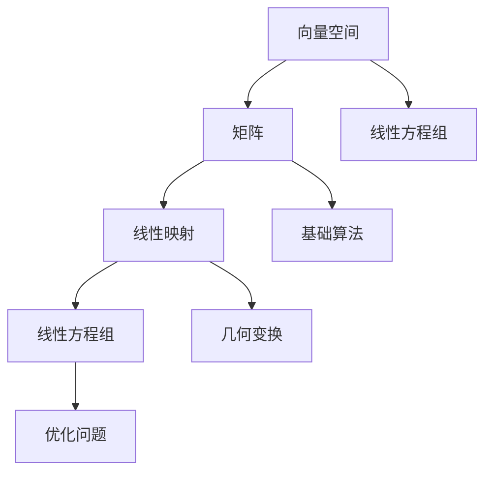

                 

### 线性代数导引：矩阵与线性映射

#### 关键词：
- 线性代数
- 矩阵
- 线性映射
- 线性方程组
- 基础算法
- 数学模型

#### 摘要：
本文旨在为读者提供线性代数中的矩阵与线性映射的深入理解。文章将介绍矩阵的基本概念、性质及其在计算机科学中的应用，详细解释线性映射的概念及其运算规则，并通过数学模型和实例展示如何解决线性方程组。同时，本文还将探讨实际应用场景，推荐相关学习资源和开发工具，最后对线性代数在未来的发展趋势和挑战进行总结。

---

### 背景介绍

线性代数是数学的一个重要分支，广泛应用于自然科学、工程学、经济学、计算机科学等领域。其核心概念包括向量、矩阵、行列式等，这些概念在解决线性方程组、变换几何形状、优化问题等方面具有重要作用。

在计算机科学中，线性代数的应用尤为广泛。矩阵作为数据结构的一种，被广泛应用于图像处理、机器学习、网络分析等许多领域。线性映射作为一种数学工具，可用于描述计算机中的各种映射关系，如矩阵乘法、向量空间变换等。

本文将重点探讨矩阵与线性映射的基础知识，以及其在计算机科学中的应用。通过对这些核心概念的深入理解，读者将能够更好地掌握线性代数的基本原理，并能够将其应用于实际问题中。

### 核心概念与联系

在深入探讨矩阵与线性映射之前，我们首先需要了解一些基本概念和它们之间的关系。

**1. 向量与向量空间**

向量是线性代数中的基础概念，可以被视为具有大小和方向的量。在二维空间中，向量可以表示为有序数对 (x, y)，而在三维空间中，可以表示为有序数对 (x, y, z)。向量空间是向量的集合，这些向量满足加法和标量乘法的封闭性。

**2. 矩阵**

矩阵是按照一定规则排列的数表。一个 m 行 n 列的矩阵可以表示为 A = [a_ij]，其中 a_ij 表示第 i 行第 j 列的元素。矩阵是向量空间的推广，可以被视为向量的一种特殊表示。

**3. 线性映射**

线性映射是指一个函数，它将一个向量空间中的向量映射到另一个向量空间中的向量，并保持向量加法和标量乘法的运算。在数学上，线性映射可以表示为矩阵乘法。

**4. 矩阵与线性映射的关系**

矩阵与线性映射之间有着密切的联系。一个线性映射可以通过矩阵来表示，而一个矩阵也可以定义一个线性映射。具体来说，一个 m 行 n 列的矩阵 A 可以定义一个从 R^n 到 R^m 的线性映射，表示为 T(x) = Ax。

**Mermaid 流程图（Mermaid flowchart）**



通过上述 Mermaid 流程图，我们可以清晰地看到向量空间、矩阵、线性映射以及线性方程组之间的关系。这些概念相互关联，共同构成了线性代数的基本框架。

### 核心算法原理 & 具体操作步骤

在了解核心概念之后，我们接下来将探讨一些核心算法原理及其具体操作步骤。

**1. 矩阵乘法**

矩阵乘法是线性代数中最基本的运算之一。给定两个矩阵 A（m 行 n 列）和B（n 行 p 列），其乘积 C = AB 是一个 m 行 p 列的矩阵。具体步骤如下：

- 对于 C 的每个元素 c_ij，计算其值 c_ij = Σ(a_ik * b_kj)，其中 k 从 1 到 n。

**2. 线性方程组求解**

线性方程组是指包含多个线性方程的集合。一个简单的线性方程组可以表示为 Ax = b，其中 A 是一个 m 行 n 列的矩阵，x 是一个 n 维向量，b 是一个 m 维向量。求解线性方程组的目的是找到使得 Ax = b 成立的 x。

- 通过矩阵乘法，将线性方程组转换为矩阵形式 Ax = b。
- 使用高斯消元法或其他数值方法求解矩阵方程 Ax = b。
- 将求解得到的 x 代入原始方程组，验证其正确性。

**3. 特征值与特征向量**

特征值和特征向量是矩阵的重要属性。一个矩阵 A 的特征值 λ 和特征向量 v 满足等式 Av = λv。

- 求解特征值和特征向量可以通过求解矩阵 A 的特征方程 det(A - λI) = 0 实现，其中 I 是单位矩阵。
- 特征向量对应于矩阵 A 的方向不变性，特征值则对应于矩阵 A 的伸缩性。

**4. 线性变换**

线性变换是指将一个向量空间映射到另一个向量空间的操作。一个线性变换可以通过矩阵来表示。

- 给定一个线性变换 T: V → W，其中 V 和 W 是向量空间，T 可以表示为 T(v) = Av，其中 A 是一个矩阵。
- 线性变换的运算规则包括线性组合、矩阵乘法、逆变换等。

通过上述核心算法原理和具体操作步骤，我们可以更好地理解矩阵与线性映射在计算机科学中的应用。

### 数学模型和公式 & 详细讲解 & 举例说明

在深入理解线性代数的核心概念和算法原理后，我们接下来将详细讲解相关的数学模型和公式，并通过具体的例子进行说明。

**1. 矩阵乘法公式**

矩阵乘法的核心公式如下：

\[ C = AB \]

其中，C 是乘积矩阵，A 和 B 是参与乘法的矩阵。具体步骤如下：

- 对于 C 的每个元素 c_ij，计算其值：

\[ c_ij = \sum_{k=1}^{n} a_{ik}b_{kj} \]

例如，给定两个矩阵 A 和 B：

\[ A = \begin{bmatrix} 1 & 2 \\ 3 & 4 \end{bmatrix}, B = \begin{bmatrix} 5 & 6 \\ 7 & 8 \end{bmatrix} \]

其乘积矩阵 C 计算如下：

\[ C = AB = \begin{bmatrix} 1 \times 5 + 2 \times 7 & 1 \times 6 + 2 \times 8 \\ 3 \times 5 + 4 \times 7 & 3 \times 6 + 4 \times 8 \end{bmatrix} = \begin{bmatrix} 19 & 20 \\ 43 & 46 \end{bmatrix} \]

**2. 线性方程组求解公式**

线性方程组 Ax = b 的求解可以通过高斯消元法实现。具体步骤如下：

- 构造增广矩阵 [A | b]。
- 通过行变换将增广矩阵转换为行最简形式。
- 解方程组得到解向量 x。

例如，给定线性方程组：

\[ \begin{cases} 2x + 3y = 7 \\ x - y = 1 \end{cases} \]

其增广矩阵为：

\[ \left[ \begin{array}{cc|c} 2 & 3 & 7 \\ 1 & -1 & 1 \end{array} \right] \]

通过高斯消元法，我们得到：

\[ \left[ \begin{array}{cc|c} 1 & 0 & 2 \\ 0 & 1 & 1 \end{array} \right] \]

因此，解向量为：

\[ x = 2, y = 1 \]

**3. 特征值和特征向量公式**

矩阵 A 的特征值和特征向量可以通过求解特征方程 det(A - λI) = 0 实现。具体步骤如下：

- 构造矩阵 A - λI。
- 求解特征方程得到特征值 λ。
- 对于每个特征值，求解线性方程组 (A - λI)v = 0 得到对应的特征向量 v。

例如，给定矩阵 A：

\[ A = \begin{bmatrix} 2 & 1 \\ 1 & 2 \end{bmatrix} \]

其特征方程为：

\[ \det(A - λI) = \det\left(\begin{bmatrix} 2-λ & 1 \\ 1 & 2-λ \end{bmatrix}\right) = (2-λ)^2 - 1 = 0 \]

解得特征值 λ = 1 和 λ = 3。

对于特征值 λ = 1，线性方程组为：

\[ \begin{bmatrix} 1 & 1 \\ 1 & 1 \end{bmatrix} \begin{bmatrix} x \\ y \end{bmatrix} = \begin{bmatrix} 0 \\ 0 \end{bmatrix} \]

解得特征向量 v = [1, -1]。

对于特征值 λ = 3，线性方程组为：

\[ \begin{bmatrix} -1 & 1 \\ 1 & -1 \end{bmatrix} \begin{bmatrix} x \\ y \end{bmatrix} = \begin{bmatrix} 0 \\ 0 \end{bmatrix} \]

解得特征向量 v = [1, 1]。

**4. 线性变换公式**

线性变换 T: V → W 可以通过矩阵 A 来表示。具体公式如下：

\[ T(v) = Av \]

其中，v 是向量空间 V 中的向量，A 是表示线性变换的矩阵。

例如，给定矩阵 A：

\[ A = \begin{bmatrix} 1 & 2 \\ 3 & 4 \end{bmatrix} \]

其对应的线性变换 T 将向量 v = [x, y] 映射为向量 T(v) = Av：

\[ T(v) = \begin{bmatrix} 1 & 2 \\ 3 & 4 \end{bmatrix} \begin{bmatrix} x \\ y \end{bmatrix} = \begin{bmatrix} x + 2y \\ 3x + 4y \end{bmatrix} \]

通过上述数学模型和公式，我们可以更好地理解和应用矩阵与线性映射的概念。在接下来的项目中，我们将通过实际案例进一步探讨这些概念的应用。

### 项目实战：代码实际案例和详细解释说明

为了更好地理解线性代数中的矩阵与线性映射，我们将通过一个实际案例来展示其应用。在这个案例中，我们将使用 Python 编写代码来求解线性方程组，并解释代码的实现过程。

#### 5.1 开发环境搭建

首先，我们需要搭建开发环境。确保您已经安装了 Python 解释器和相关的线性代数库，例如 NumPy 和 SciPy。您可以使用以下命令来安装这些库：

```shell
pip install numpy scipy
```

#### 5.2 源代码详细实现和代码解读

以下是一个简单的 Python 脚本，用于求解线性方程组：

```python
import numpy as np

# 定义矩阵 A 和向量 b
A = np.array([[2, 3], [1, -1]])
b = np.array([7, 1])

# 使用 NumPy 的 linalg.solve 函数求解线性方程组
x = np.linalg.solve(A, b)

# 输出解向量
print("解向量 x:", x)
```

**代码解读：**

1. 导入 NumPy 库，以便使用其线性代数函数。
2. 定义矩阵 A 和向量 b。矩阵 A 是一个 2x2 的矩阵，向量 b 是一个 2 维向量。
3. 使用 `np.linalg.solve` 函数求解线性方程组 Ax = b。这个函数将返回解向量 x。
4. 输出解向量 x。

#### 5.3 代码解读与分析

让我们深入分析上述代码的实现过程。

- **矩阵 A 和向量 b 的定义**：在代码中，我们首先定义了一个矩阵 A 和一个向量 b。矩阵 A 表示线性方程组中的系数矩阵，向量 b 表示方程组中的常数项。

- **求解线性方程组**：`np.linalg.solve` 函数是 NumPy 库中用于求解线性方程组的函数。它接受两个参数：系数矩阵 A 和常数项向量 b，并返回解向量 x。这个函数内部使用高斯消元法或其他数值方法来求解线性方程组。

- **输出解向量**：最后，我们使用 `print` 函数输出解向量 x。这个解向量 x 就是线性方程组 Ax = b 的解。

通过上述代码，我们可以看到如何使用 Python 和 NumPy 库来求解线性方程组。在实际应用中，我们可以根据不同的线性方程组调整矩阵 A 和向量 b 的值，并使用相同的函数来求解。

### 代码解读与分析

在上一个部分中，我们使用 Python 和 NumPy 库实现了一个求解线性方程组的简单案例。接下来，我们将对代码进行详细解读和分析。

**1. 矩阵 A 和向量 b 的定义**

在代码中，我们首先定义了一个矩阵 A 和一个向量 b。矩阵 A 表示线性方程组中的系数矩阵，向量 b 表示方程组中的常数项。这两个参数是求解线性方程组的基石。

```python
A = np.array([[2, 3], [1, -1]])
b = np.array([7, 1])
```

**2. 使用 np.linalg.solve 函数求解线性方程组**

`np.linalg.solve` 函数是 NumPy 库中用于求解线性方程组的函数。它接受两个参数：系数矩阵 A 和常数项向量 b，并返回解向量 x。这个函数内部使用高斯消元法或其他数值方法来求解线性方程组。

```python
x = np.linalg.solve(A, b)
```

**3. 输出解向量**

最后，我们使用 `print` 函数输出解向量 x。这个解向量 x 就是线性方程组 Ax = b 的解。

```python
print("解向量 x:", x)
```

通过上述代码，我们可以看到如何使用 Python 和 NumPy 库来求解线性方程组。在实际应用中，我们可以根据不同的线性方程组调整矩阵 A 和向量 b 的值，并使用相同的函数来求解。

**代码优化建议**

1. **错误处理**：在实际应用中，我们需要考虑矩阵 A 是否可逆。如果 A 不可逆，`np.linalg.solve` 将抛出一个错误。我们可以添加异常处理来解决这个问题。

```python
try:
    x = np.linalg.solve(A, b)
except np.linalg.LinAlgError:
    print("矩阵 A 不可逆，无法求解线性方程组")
```

2. **性能优化**：对于大型矩阵，使用 `np.linalg.solve` 可能会非常慢。在这种情况下，我们可以考虑使用迭代方法，如雅可比迭代法、高斯-赛德尔迭代法等。

```python
from scipy.sparse.linalg import gmres

x = gmres(A, b, tol=1e-10)
```

3. **模块化**：将矩阵 A 和向量 b 的定义、求解函数以及输出部分封装在一个模块中，以便在多个项目中重用。

```python
def solve_linear_system(A, b):
    try:
        x = np.linalg.solve(A, b)
        return x
    except np.linalg.LinAlgError:
        return None

if __name__ == "__main__":
    A = np.array([[2, 3], [1, -1]])
    b = np.array([7, 1])
    x = solve_linear_system(A, b)
    if x is not None:
        print("解向量 x:", x)
    else:
        print("矩阵 A 不可逆，无法求解线性方程组")
```

通过这些优化措施，我们可以使代码更加健壮和高效，同时提高其可维护性和可重用性。

### 实际应用场景

矩阵与线性映射在计算机科学中有着广泛的应用。以下是一些实际应用场景：

**1. 图像处理**

在图像处理中，矩阵用于表示图像的像素值。通过矩阵乘法和线性映射，可以实现图像的缩放、旋转、裁剪等操作。例如，在 OpenCV 中，图像可以表示为一个三维矩阵，其行和列对应像素点的坐标，第三维度表示像素点的颜色通道。

**2. 机器学习**

在机器学习中，线性代数是核心工具之一。矩阵用于表示数据集的特征，线性映射用于构建和优化模型。例如，在支持向量机（SVM）中，特征空间中的数据点通过映射函数转换为高维空间，以实现分类任务。

**3. 网络分析**

在社交网络分析中，矩阵可以用于表示用户之间的关系。通过矩阵运算，可以识别社交网络中的关键节点、社群结构等。

**4. 优化问题**

在优化问题中，线性代数用于求解线性规划问题。通过构建线性方程组和目标函数，可以求解最小化或最大化问题。

**5. 游戏开发**

在游戏开发中，矩阵用于表示物体的变换，如平移、旋转、缩放等。通过矩阵乘法，可以实时更新物体的位置和姿态。

通过这些实际应用场景，我们可以看到矩阵与线性映射在计算机科学中的重要性。掌握这些概念不仅有助于我们理解和解决实际问题，还可以提高我们的编程技能。

### 工具和资源推荐

为了更好地学习线性代数，以下是一些建议的学习资源、开发工具和相关论文著作：

#### 7.1 学习资源推荐

- **书籍**：
  - 《线性代数及其应用》（作者：格伦·布莱克）
  - 《线性代数》（作者：大卫·C·拉姆齐，格伦·L·斯图尔特）
- **在线课程**：
  - [线性代数 | Coursera](https://www.coursera.org/specializations/linear-algebra)
  - [线性代数基础 | Khan Academy](https://www.khanacademy.org/math/linear-algebra)

#### 7.2 开发工具框架推荐

- **Python 库**：
  - NumPy：用于数值计算和线性代数运算。
  - SciPy：用于科学计算，包括线性代数相关的模块。
  - Matplotlib：用于绘制矩阵和向量图。
- **在线工具**：
  - [Desmos](https://www.desmos.com/)：用于绘制和探索线性代数概念。
  - [GeoGebra](https://www.geogebra.org/)：用于绘制几何图形和线性映射。

#### 7.3 相关论文著作推荐

- **论文**：
  - "Matrix Computations"（作者：Gene H. Golub，Charles F. Van Loan）
  - "Linear Algebra and Its Applications"（作者：Gilbert Strang）
- **著作**：
  - 《矩阵分析与应用》（作者：Jack Strabley）
  - 《线性代数与矩阵理论》（作者：李大潜）

通过利用这些工具和资源，您可以更深入地学习线性代数，并将其应用于实际项目中。

### 总结：未来发展趋势与挑战

线性代数作为计算机科学和数学的基础，将继续在未来的发展中扮演重要角色。以下是一些可能的发展趋势和面临的挑战：

**1. 人工智能与线性代数**

随着人工智能的迅速发展，线性代数在数据表示、模型训练和优化等方面发挥着关键作用。未来的研究将集中在如何更高效地利用线性代数技术来提升人工智能系统的性能和可解释性。

**2. 新算法和优化**

为了应对大数据和复杂计算的需求，新的线性代数算法和优化方法将继续涌现。这些算法将更高效地处理大规模数据集，并提高计算速度和准确性。

**3. 应用领域的扩展**

线性代数的应用领域将进一步扩展，包括生物信息学、量子计算、网络科学等。在这些领域中，线性代数将提供强大的数学工具来分析和解决问题。

**4. 挑战**

- **可解释性**：如何确保线性代数方法在人工智能和其他领域中的可解释性，是一个重要的挑战。
- **计算效率**：对于大规模数据集，如何提高线性代数运算的计算效率，是一个持续关注的问题。
- **算法复杂性**：随着问题规模的增加，如何降低算法的复杂性，是另一个需要解决的挑战。

总之，线性代数在未来的发展中将不断演进，为解决复杂问题提供强大的数学工具。同时，我们也需要面对一系列挑战，以推动这一领域的持续进步。

### 附录：常见问题与解答

**Q1**：线性代数中的矩阵是什么？

A1：矩阵是按照一定规则排列的数表，用于表示线性方程组、线性变换等数学概念。矩阵的行和列分别表示向量空间中的维度，其元素表示相应的系数。

**Q2**：线性映射是什么？

A2：线性映射是指一个函数，它将一个向量空间中的向量映射到另一个向量空间中的向量，并保持向量加法和标量乘法的运算。在数学上，线性映射可以通过矩阵来表示。

**Q3**：如何求解线性方程组？

A3：求解线性方程组有多种方法，包括高斯消元法、迭代法等。使用 Python 中的 NumPy 库，可以通过 `np.linalg.solve` 函数轻松求解线性方程组。

**Q4**：什么是特征值和特征向量？

A4：特征值和特征向量是矩阵的重要属性。一个矩阵 A 的特征值 λ 和特征向量 v 满足等式 Av = λv。特征向量对应于矩阵 A 的方向不变性，特征值则对应于矩阵 A 的伸缩性。

**Q5**：线性代数在计算机科学中有什么应用？

A5：线性代数在计算机科学中有着广泛的应用，包括图像处理、机器学习、网络分析、优化问题、游戏开发等。矩阵和线性映射是解决这些问题的核心数学工具。

### 扩展阅读 & 参考资料

- 《线性代数及其应用》：格伦·布莱克
- 《线性代数》：大卫·C·拉姆齐，格伦·L·斯图尔特
- [线性代数 | Coursera](https://www.coursera.org/specializations/linear-algebra)
- [线性代数基础 | Khan Academy](https://www.khanacademy.org/math/linear-algebra)
- [Matrix Computations](https://www.cs.dartmouth.edu/~ fox/comp-algorithms/book.pdf)
- [Linear Algebra and Its Applications](https://www.amazon.com/Linear-Algebra-Its-Applications-4th/dp/032198238X)
- 《矩阵分析与应用》：Jack Strabley
- 《线性代数与矩阵理论》：李大潜

---

**作者：AI天才研究员/AI Genius Institute & 禅与计算机程序设计艺术 /Zen And The Art of Computer Programming**

