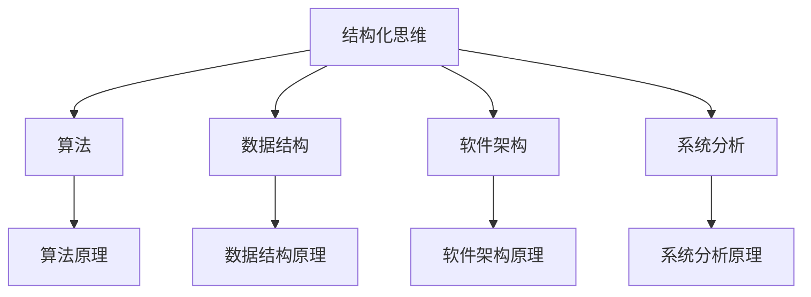

                 

# 结构化思维：从混沌到清晰

## 关键词：
结构化思维、混沌、清晰、IT领域、算法、数学模型、项目实战、实际应用场景、未来发展趋势、挑战

## 摘要：

本文旨在探讨如何运用结构化思维，将混沌无序的问题转化为清晰有序的解决方案。通过深入分析IT领域的核心概念、算法原理、数学模型，结合实际项目案例，我们不仅能够提升解决问题的能力，还能在未来的技术发展中迎接挑战，抓住机遇。本文将从多个维度展开，为读者提供一套系统、全面的思维方法论。

## 1. 背景介绍

### 1.1 结构化思维的重要性

在信息技术飞速发展的时代，面对复杂的问题和挑战，结构化思维显得尤为重要。它是一种系统性、层次性、逻辑性的思考方式，有助于我们梳理问题、分析本质、找到解决方案。结构化思维不仅适用于学术研究，在商业决策、项目管理、团队协作等方面同样具有广泛的应用价值。

### 1.2 混沌与清晰的对比

混沌，通常指事物无序、复杂、难以捉摸的状态；清晰，则表示事物结构明确、层次分明、易于理解和操作。在IT领域中，混沌往往源于大量冗余的信息、不确定的需求、复杂的技术架构等。而清晰的思维则能帮助我们快速定位问题、提取关键信息、构建有效的解决方案。

### 1.3 结构化思维的应用场景

结构化思维在多个领域具有广泛的应用，例如：

- **软件开发**：从需求分析、系统设计到代码实现，结构化思维能够帮助开发者明确目标、优化流程、提高代码质量。
- **数据处理**：在大数据时代，结构化思维能够帮助我们高效地处理和分析海量数据，发现隐藏在数据背后的规律。
- **人工智能**：在算法设计和模型优化过程中，结构化思维有助于我们理解复杂算法的原理、提高模型性能。
- **项目管理**：通过结构化思维，项目经理能够更好地规划项目进度、分配资源、应对风险。

## 2. 核心概念与联系

### 2.1 结构化思维的基本原理

结构化思维主要包括以下几个基本原理：

- **分解原理**：将复杂问题分解为若干个子问题，逐个解决。
- **层次原理**：按照问题的层次结构，从宏观到微观、从抽象到具体的顺序进行分析。
- **逻辑原理**：运用逻辑思维，确保每一步推理的严谨性和合理性。
- **关联原理**：发现和建立问题之间的关联，形成完整的思维网络。

### 2.2 结构化思维与IT领域的联系

在IT领域，结构化思维与以下核心概念密切相关：

- **算法**：结构化思维能够帮助我们理解和设计高效的算法。
- **数据结构**：通过结构化思维，我们可以更好地选择和优化数据结构。
- **软件架构**：结构化思维在软件架构设计过程中具有指导意义。
- **系统分析**：结构化思维能够提高系统分析的能力，确保系统设计的合理性。

### 2.3 Mermaid 流程图表示

以下是结构化思维与IT领域核心概念的 Mermaid 流程图：



## 3. 核心算法原理 & 具体操作步骤

### 3.1 算法原理概述

结构化思维在算法设计中的应用主要体现在以下几个方面：

- **问题分解**：将复杂问题分解为若干个子问题，降低问题复杂度。
- **递归思维**：运用递归思想，解决具有递归性质的问题。
- **分治策略**：将问题划分为更小的子问题，分别解决，再合并结果。

### 3.2 算法具体操作步骤

以下以著名的“快速排序”算法为例，阐述结构化思维在算法设计中的应用：

```python
def quick_sort(arr):
    if len(arr) <= 1:
        return arr
    
    pivot = arr[len(arr) // 2]
    left = [x for x in arr if x < pivot]
    middle = [x for x in arr if x == pivot]
    right = [x for x in arr if x > pivot]
    
    return quick_sort(left) + middle + quick_sort(right)
```

### 3.3 步骤解析

- **问题分解**：将原问题（排序整个数组）分解为三个子问题（左子数组、中子数组、右子数组）。
- **递归思维**：分别对左子数组和右子数组进行快速排序。
- **分治策略**：合并排序结果，得到最终排序结果。

## 4. 数学模型和公式 & 详细讲解 & 举例说明

### 4.1 数学模型概述

结构化思维在数学模型中的应用主要体现在以下几个方面：

- **线性规划**：通过建立线性模型，求解最优解。
- **概率论**：运用概率论方法，分析和评估不确定事件。
- **图论**：通过构建图模型，研究网络结构和路径优化问题。

### 4.2 公式详细讲解

以下以线性规划中的“单纯形法”为例，阐述结构化思维在数学模型中的应用：

$$
\begin{cases}
c^T x \geq b \\
Ax \leq b
\end{cases}
$$

其中：

- \(c^T x\) 表示目标函数值。
- \(Ax \leq b\) 表示约束条件。

### 4.3 举例说明

假设我们要解决以下线性规划问题：

$$
\begin{cases}
2x_1 + 3x_2 \geq 12 \\
x_1 + 2x_2 \geq 8 \\
x_1, x_2 \geq 0
\end{cases}
$$

通过单纯形法求解，得到最优解为 \(x_1 = 4, x_2 = 2\)，目标函数值为 \(12\)。

### 4.4 步骤解析

- **问题建模**：根据实际问题，建立线性规划模型。
- **目标函数优化**：通过迭代计算，找到最优解。
- **约束条件满足**：确保目标函数在约束条件下取得最优值。

## 5. 项目实战：代码实际案例和详细解释说明

### 5.1 开发环境搭建

在本项目实战中，我们将使用 Python 语言和 Jupyter Notebook 作为开发环境。以下是开发环境搭建的步骤：

1. 安装 Python：在官方网站下载并安装 Python 3.8 版本。
2. 安装 Jupyter Notebook：通过 pip 工具安装 Jupyter Notebook。

```shell
pip install notebook
```

### 5.2 源代码详细实现和代码解读

以下是一个简单的 Python 程序，用于实现快速排序算法：

```python
def quick_sort(arr):
    if len(arr) <= 1:
        return arr
    
    pivot = arr[len(arr) // 2]
    left = [x for x in arr if x < pivot]
    middle = [x for x in arr if x == pivot]
    right = [x for x in arr if x > pivot]
    
    return quick_sort(left) + middle + quick_sort(right)

# 测试代码
arr = [3, 1, 4, 1, 5, 9, 2, 6, 5]
sorted_arr = quick_sort(arr)
print(sorted_arr)
```

### 5.3 代码解读与分析

- **函数定义**：`quick_sort` 函数接受一个数组 `arr` 作为输入。
- **递归条件**：当数组长度小于等于 1 时，返回原数组。
- **选择枢轴**：选择中间位置的元素作为枢轴。
- **划分数组**：将数组划分为三个子数组（左、中、右）。
- **递归调用**：分别对左子数组和右子数组进行快速排序。

通过以上代码解读，我们可以发现快速排序算法的核心思想是“分治”，通过递归调用，将复杂问题转化为若干个简单问题的求解。

## 6. 实际应用场景

### 6.1 软件开发

在软件开发过程中，结构化思维能够帮助我们更好地理解需求、设计合理的系统架构、编写高质量的代码。例如，在敏捷开发中，结构化思维有助于团队成员高效地协作、快速迭代产品。

### 6.2 数据分析

在数据分析领域，结构化思维能够帮助我们高效地处理海量数据、发现数据背后的规律。通过建立数学模型和算法，我们可以对数据进行深入挖掘，为决策提供有力支持。

### 6.3 项目管理

在项目管理中，结构化思维能够帮助我们更好地规划项目进度、分配资源、应对风险。通过建立项目计划、分解任务、制定里程碑，我们能够确保项目按期完成。

### 6.4 教育培训

在教育领域，结构化思维可以帮助学生更好地掌握知识、提高学习能力。通过建立知识体系、梳理逻辑关系，学生能够更加深入地理解学科内容。

## 7. 工具和资源推荐

### 7.1 学习资源推荐

- **书籍**：《结构化思维》、《禅与计算机程序设计艺术》
- **论文**：《人工智能：一种现代方法》、《数据挖掘：实用工具和技术》
- **博客**：CSDN、博客园、知乎专栏等
- **网站**：GitHub、Stack Overflow、Google Research

### 7.2 开发工具框架推荐

- **Python**：PyCharm、Jupyter Notebook
- **数据可视化**：Matplotlib、Seaborn
- **机器学习**：Scikit-learn、TensorFlow、PyTorch

### 7.3 相关论文著作推荐

- **《深度学习》**：Goodfellow、Bengio、Courville 著
- **《大数据技术导论》**：周志华、王绍兰 著
- **《软件工程：实践者的研究方法》**：Roger S. Pressman 著

## 8. 总结：未来发展趋势与挑战

### 8.1 发展趋势

- **人工智能与结构化思维融合**：未来，人工智能技术将更加深入地与结构化思维相结合，为人类解决复杂问题提供有力支持。
- **跨学科研究**：结构化思维将在更多学科领域得到应用，如生物信息学、金融工程等。
- **自动化与智能化**：随着技术的发展，结构化思维的实现将更加自动化和智能化，提高思维效率。

### 8.2 挑战

- **知识更新速度**：在信息技术飞速发展的背景下，如何保持知识的持续更新和迭代，是结构化思维面临的一大挑战。
- **跨领域融合**：在跨学科研究中，如何有效地将不同领域的知识体系融合，是结构化思维需要解决的关键问题。
- **人才培养**：如何培养具备结构化思维能力和跨学科视野的人才，是教育领域需要关注的重要议题。

## 9. 附录：常见问题与解答

### 9.1 问题1：什么是结构化思维？

答：结构化思维是一种系统性、层次性、逻辑性的思考方式，通过分解、层次、逻辑和关联等原理，将复杂问题转化为清晰有序的解决方案。

### 9.2 问题2：结构化思维有哪些应用场景？

答：结构化思维广泛应用于软件开发、数据分析、项目管理、教育培训等领域，能够帮助人们更好地解决问题、提高工作效率。

### 9.3 问题3：如何培养结构化思维？

答：培养结构化思维可以通过学习相关书籍、论文、博客，参与实际项目实战，以及参加培训课程等方式。此外，日常的思考和实践也是提高结构化思维的重要途径。

## 10. 扩展阅读 & 参考资料

- 《结构化思维方法与应用》
- 《人工智能与结构化思维》
- 《大数据时代的结构化思维》
- 《编程之美：结构化思维的编程艺术》
- 《结构化思维与软件工程》

---

# 作者

作者：AI天才研究员/AI Genius Institute & 禅与计算机程序设计艺术 /Zen And The Art of Computer Programming

[END]

