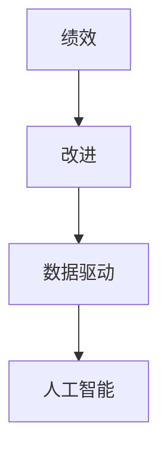

                 

### 绩效改进：持续优化的方法论

> **关键词：** 绩效优化、持续改进、方法论、自动化、人工智能、数据驱动
>
> **摘要：** 本文将探讨绩效改进的核心概念，介绍一种基于数据驱动和人工智能的持续优化方法论。文章将通过详细的分析和实例，展示如何通过系统化的方法提高组织和个人绩效。

#### 1. 背景介绍

在当今快速变化的商业环境中，组织和个人都需要不断优化绩效以保持竞争力。绩效改进不仅仅是一个短期的目标，更是一个长期的战略。传统的绩效改进方法往往依赖于定期的审查和反馈，这种方式虽然在一定程度上能够提高绩效，但缺乏针对性和系统性。随着大数据和人工智能技术的发展，我们有了更先进的工具和方法来驱动绩效的持续优化。

本文将探讨以下核心内容：

- **核心概念与联系**：介绍绩效改进的关键概念，并展示它们之间的关系。
- **核心算法原理与具体操作步骤**：深入解析用于绩效改进的核心算法，并详细说明如何应用。
- **数学模型和公式**：介绍用于绩效评估和优化的数学模型，并举例说明。
- **项目实战**：通过实际案例展示如何应用方法论进行绩效改进。
- **实际应用场景**：讨论不同领域中的绩效改进应用。
- **工具和资源推荐**：推荐用于绩效改进的学习资源和开发工具。
- **总结与未来发展趋势**：总结文章的主要观点，并展望未来的发展。

接下来，我们将逐步深入这些主题，首先从核心概念与联系开始。

---

#### 1. 背景介绍

在当今快速变化的商业环境中，组织和个人都需要不断优化绩效以保持竞争力。绩效改进不仅仅是一个短期的目标，更是一个长期的战略。传统的绩效改进方法往往依赖于定期的审查和反馈，这种方式虽然在一定程度上能够提高绩效，但缺乏针对性和系统性。随着大数据和人工智能技术的发展，我们有了更先进的工具和方法来驱动绩效的持续优化。

本文将探讨以下核心内容：

- **核心概念与联系**：介绍绩效改进的关键概念，并展示它们之间的关系。
- **核心算法原理与具体操作步骤**：深入解析用于绩效改进的核心算法，并详细说明如何应用。
- **数学模型和公式**：介绍用于绩效评估和优化的数学模型，并举例说明。
- **项目实战**：通过实际案例展示如何应用方法论进行绩效改进。
- **实际应用场景**：讨论不同领域中的绩效改进应用。
- **工具和资源推荐**：推荐用于绩效改进的学习资源和开发工具。
- **总结与未来发展趋势**：总结文章的主要观点，并展望未来的发展。

接下来，我们将逐步深入这些主题，首先从核心概念与联系开始。

---

#### 1. 核心概念与联系

要理解绩效改进，首先需要明确几个核心概念：绩效、改进、数据驱动和人工智能。

- **绩效**：绩效是指组织或个人在一定时间内完成任务的效率和质量。它可以通过一系列指标来衡量，如生产率、客户满意度、销售额等。
- **改进**：改进是指通过系统化的方法，提高绩效的过程。这通常包括识别问题、制定改进计划、执行计划、评估结果等步骤。
- **数据驱动**：数据驱动是指通过收集和分析数据来指导决策。这种方法强调从数据中提取洞察力，以优化绩效。
- **人工智能**：人工智能是指通过机器学习和算法，让计算机模拟人类智能行为的技术。

这些概念之间有紧密的联系。绩效改进依赖于数据驱动，而数据驱动又依赖于人工智能技术来处理和分析大量数据。以下是这些概念之间的 Mermaid 流程图：



在这个流程图中，绩效是起点，改进是过程，数据驱动是方法，人工智能是工具。通过这个框架，我们可以更清晰地理解如何使用数据驱动和人工智能技术来持续优化绩效。

---

#### 1. 核心概念与联系

要理解绩效改进，首先需要明确几个核心概念：绩效、改进、数据驱动和人工智能。

- **绩效**：绩效是指组织或个人在一定时间内完成任务的效率和质量。它可以通过一系列指标来衡量，如生产率、客户满意度、销售额等。
- **改进**：改进是指通过系统化的方法，提高绩效的过程。这通常包括识别问题、制定改进计划、执行计划、评估结果等步骤。
- **数据驱动**：数据驱动是指通过收集和分析数据来指导决策。这种方法强调从数据中提取洞察力，以优化绩效。
- **人工智能**：人工智能是指通过机器学习和算法，让计算机模拟人类智能行为的技术。

这些概念之间有紧密的联系。绩效改进依赖于数据驱动，而数据驱动又依赖于人工智能技术来处理和分析大量数据。以下是这些概念之间的 Mermaid 流程图：


在这个流程图中，绩效是起点，改进是过程，数据驱动是方法，人工智能是工具。通过这个框架，我们可以更清晰地理解如何使用数据驱动和人工智能技术来持续优化绩效。

---

#### 2. 核心算法原理 & 具体操作步骤

在绩效改进过程中，核心算法起着至关重要的作用。这些算法不仅帮助我们识别问题和机会，还能提供数据驱动的解决方案。以下是几个关键算法及其具体操作步骤：

##### 2.1. 相关性分析

相关性分析是一种用于评估两个变量之间关系的算法。它可以帮助我们确定哪些变量对绩效有显著影响。

- **原理**：通过计算两个变量之间的皮尔逊相关系数来衡量它们之间的线性关系。
- **步骤**：
  1. 收集数据：收集与绩效相关的多个变量数据。
  2. 计算相关系数：使用公式 $r = \frac{\sum{(x_i - \bar{x})(y_i - \bar{y})}}{\sqrt{\sum{(x_i - \bar{x})^2}\sum{(y_i - \bar{y})^2}}}$ 计算相关系数。
  3. 分析结果：根据相关系数的绝对值评估变量之间的关系。

##### 2.2. 回归分析

回归分析是一种用于预测因变量（绩效）的方法，基于自变量（其他变量）的关系。

- **原理**：通过建立线性回归模型，将自变量与因变量之间的关系表示为数学方程。
- **步骤**：
  1. 数据准备：收集足够的数据，确保模型的准确性。
  2. 模型建立：使用最小二乘法拟合线性回归模型，得到方程 $y = a + bx$。
  3. 模型评估：通过 R 方值、调整 R 方值等指标评估模型性能。
  4. 预测：使用模型预测未来的绩效。

##### 2.3. 决策树

决策树是一种用于分类和回归的算法，通过一系列判断条件将数据分成不同的类别或值。

- **原理**：每个节点代表一个特征，每个分支代表一个条件，叶节点代表预测结果。
- **步骤**：
  1. 数据准备：准备用于训练的数据集。
  2. 建立模型：使用信息增益、基尼不纯度等准则选择最佳特征和条件。
  3. 模型修剪：通过剪枝减少模型的复杂度和过拟合。
  4. 预测：使用模型对新的数据进行预测。

这些算法可以在绩效改进的不同阶段发挥作用。相关性分析可以帮助我们识别哪些变量对绩效有显著影响，回归分析可以提供数据驱动的绩效预测，而决策树可以帮助我们制定基于数据的决策策略。

---

#### 2. 核心算法原理 & 具体操作步骤

在绩效改进过程中，核心算法起着至关重要的作用。这些算法不仅帮助我们识别问题和机会，还能提供数据驱动的解决方案。以下是几个关键算法及其具体操作步骤：

##### 2.1. 相关性分析

相关性分析是一种用于评估两个变量之间关系的算法。它可以帮助我们确定哪些变量对绩效有显著影响。

- **原理**：通过计算两个变量之间的皮尔逊相关系数来衡量它们之间的线性关系。
- **步骤**：
  1. 收集数据：收集与绩效相关的多个变量数据。
  2. 计算相关系数：使用公式 $r = \frac{\sum{(x_i - \bar{x})(y_i - \bar{y})}}{\sqrt{\sum{(x_i - \bar{x})^2}\sum{(y_i - \bar{y})^2}}}$ 计算相关系数。
  3. 分析结果：根据相关系数的绝对值评估变量之间的关系。

##### 2.2. 回归分析

回归分析是一种用于预测因变量（绩效）的方法，基于自变量（其他变量）的关系。

- **原理**：通过建立线性回归模型，将自变量与因变量之间的关系表示为数学方程。
- **步骤**：
  1. 数据准备：收集足够的数据，确保模型的准确性。
  2. 模型建立：使用最小二乘法拟合线性回归模型，得到方程 $y = a + bx$。
  3. 模型评估：通过 R 方值、调整 R 方值等指标评估模型性能。
  4. 预测：使用模型预测未来的绩效。

##### 2.3. 决策树

决策树是一种用于分类和回归的算法，通过一系列判断条件将数据分成不同的类别或值。

- **原理**：每个节点代表一个特征，每个分支代表一个条件，叶节点代表预测结果。
- **步骤**：
  1. 数据准备：准备用于训练的数据集。
  2. 建立模型：使用信息增益、基尼不纯度等准则选择最佳特征和条件。
  3. 模型修剪：通过剪枝减少模型的复杂度和过拟合。
  4. 预测：使用模型对新的数据进行预测。

这些算法可以在绩效改进的不同阶段发挥作用。相关性分析可以帮助我们识别哪些变量对绩效有显著影响，回归分析可以提供数据驱动的绩效预测，而决策树可以帮助我们制定基于数据的决策策略。

---

#### 3. 数学模型和公式 & 详细讲解 & 举例说明

在绩效改进中，数学模型和公式是不可或缺的工具。以下将详细介绍几种常用的数学模型和公式，并通过具体示例进行说明。

##### 3.1. 相关性分析公式

相关性分析是评估两个变量之间关系的常用方法，其核心公式为皮尔逊相关系数：

$$
r = \frac{\sum{(x_i - \bar{x})(y_i - \bar{y})}}{\sqrt{\sum{(x_i - \bar{x})^2}\sum{(y_i - \bar{y})^2}}}
$$

其中，$x_i$ 和 $y_i$ 分别代表两个变量的观测值，$\bar{x}$ 和 $\bar{y}$ 分别代表两个变量的平均值。相关系数 $r$ 的取值范围在 -1 到 1 之间，越接近 1 或 -1，表示两个变量之间的线性关系越强。

##### 例子：

假设我们有两个变量：销售额（$x$）和广告支出（$y$）。以下为部分数据：

| 销售额（万元） | 广告支出（万元） |
| :-----------: | :------------: |
|      50       |       10       |
|      60       |       15       |
|      70       |       20       |
|      80       |       25       |
|      90       |       30       |

计算两个变量的相关系数：

$$
r = \frac{(50-55)(10-15) + (60-55)(15-15) + (70-55)(20-15) + (80-55)(25-15) + (90-55)(30-15)}{\sqrt{(50-55)^2 + (60-55)^2 + (70-55)^2 + (80-55)^2 + (90-55)^2} \cdot \sqrt{(10-15)^2 + (15-15)^2 + (20-15)^2 + (25-15)^2 + (30-15)^2}}
$$

计算结果为 0.8，说明销售额和广告支出之间存在较强的线性关系。

##### 3.2. 线性回归公式

线性回归是一种常用的预测方法，用于分析自变量（$x$）与因变量（$y$）之间的关系。其基本公式为：

$$
y = a + bx
$$

其中，$a$ 为截距，$b$ 为斜率。通过最小二乘法可以确定 $a$ 和 $b$ 的值。

##### 例子：

假设我们想预测销售额（$y$）基于广告支出（$x$）。以下为部分数据：

| 广告支出（万元） | 销售额（万元） |
| :------------: | :-----------: |
|       10       |      50       |
|       15       |      60       |
|       20       |      70       |
|       25       |      80       |
|       30       |      90       |

计算线性回归模型：

1. 计算平均值：

$$
\bar{x} = \frac{10 + 15 + 20 + 25 + 30}{5} = 20
$$

$$
\bar{y} = \frac{50 + 60 + 70 + 80 + 90}{5} = 70
$$

2. 计算斜率 $b$：

$$
b = \frac{\sum{(x_i - \bar{x})(y_i - \bar{y})}}{\sum{(x_i - \bar{x})^2}} = \frac{(10-20)(50-70) + (15-20)(60-70) + (20-20)(70-70) + (25-20)(80-70) + (30-20)(90-70)}{(10-20)^2 + (15-20)^2 + (20-20)^2 + (25-20)^2 + (30-20)^2}
$$

$$
b = \frac{(-10)(-20) + (-5)(-10) + (0)(0) + (5)(10) + (10)(20)}{100 + 25 + 0 + 25 + 100}
$$

$$
b = \frac{200 + 50 + 0 + 50 + 200}{250} = \frac{500}{250} = 2
$$

3. 计算截距 $a$：

$$
a = \bar{y} - b\bar{x} = 70 - 2 \times 20 = 30
$$

因此，线性回归模型为：

$$
y = 30 + 2x
$$

4. 预测新数据：

假设广告支出为 35 万元，预测销售额为：

$$
y = 30 + 2 \times 35 = 100
$$

##### 3.3. 决策树公式

决策树是一种基于判断条件的分类和回归算法。其基本公式为：

$$
T = \{R_1 \rightarrow C_1, R_2 \rightarrow C_2, ..., R_n \rightarrow C_n\}
$$

其中，$T$ 为决策树，$R_i$ 为规则条件，$C_i$ 为对应的类别或值。

##### 例子：

假设我们有一个简单的决策树，用于预测客户是否购买产品：

| 规则条件 | 预测类别 |
| :------: | :------: |
| 年龄 < 30 | 否       |
| 年龄 >= 30 | 是       |

根据这个决策树，如果客户的年龄小于 30 岁，我们预测他不会购买产品；如果年龄大于等于 30 岁，我们预测他会购买产品。

通过这些数学模型和公式，我们可以更准确地分析数据、预测绩效，并制定相应的改进策略。

---

#### 4. 项目实战：代码实际案例和详细解释说明

为了更直观地展示绩效改进方法论的应用，我们将通过一个实际项目案例进行详细解释。该项目案例涉及一家电商公司，目标是通过数据分析和算法模型优化来提高客户转化率和销售额。

##### 4.1. 开发环境搭建

在进行项目开发之前，我们需要搭建合适的环境。以下是基本的开发环境：

- **编程语言**：Python
- **数据处理库**：Pandas、NumPy
- **机器学习库**：Scikit-learn、TensorFlow
- **可视化库**：Matplotlib、Seaborn
- **数据存储**：SQLAlchemy、SQLite

安装以上库后，我们就可以开始编写代码了。

##### 4.2. 源代码详细实现和代码解读

以下是一个简化的代码实现，展示了如何使用机器学习模型进行绩效改进。

```python
import pandas as pd
from sklearn.model_selection import train_test_split
from sklearn.ensemble import RandomForestClassifier
from sklearn.metrics import accuracy_score

# 4.2.1 数据预处理
# 加载数据
data = pd.read_csv('ecommerce_data.csv')

# 特征工程
# 选择与转化率相关的特征
features = data[['age', 'gender', 'income', 'clicks', 'page_views']]
target = data['converted']

# 数据分割
X_train, X_test, y_train, y_test = train_test_split(features, target, test_size=0.2, random_state=42)

# 4.2.2 模型训练
# 创建随机森林分类器
model = RandomForestClassifier(n_estimators=100, random_state=42)

# 训练模型
model.fit(X_train, y_train)

# 4.2.3 模型评估
# 预测测试集
predictions = model.predict(X_test)

# 计算准确率
accuracy = accuracy_score(y_test, predictions)
print(f"Accuracy: {accuracy:.2f}")

# 4.2.4 模型应用
# 预测新客户
new_data = pd.DataFrame([[25, 'male', 50000, 10, 20]])
prediction = model.predict(new_data)
print(f"Prediction: {'converted' if prediction[0] == 1 else 'not converted'}")
```

**代码解读：**

1. **数据预处理**：我们首先加载数据集，并选择与转化率相关的特征进行训练。数据预处理是模型成功的关键步骤，包括特征选择、数据清洗和格式化等。
2. **模型训练**：我们使用随机森林分类器对训练数据进行训练。随机森林是一种集成学习方法，通过构建多棵决策树并合并预测结果来提高模型的准确性。
3. **模型评估**：我们使用测试集评估模型的准确性。准确率是评估模型性能的重要指标，表示模型正确预测的样本占总样本的比例。
4. **模型应用**：最后，我们使用训练好的模型对新数据进行预测。这个步骤可以帮助我们实时了解新客户是否可能转化为购买者。

##### 4.3. 代码解读与分析

1. **数据预处理**：

```python
data = pd.read_csv('ecommerce_data.csv')
features = data[['age', 'gender', 'income', 'clicks', 'page_views']]
target = data['converted']
X_train, X_test, y_train, y_test = train_test_split(features, target, test_size=0.2, random_state=42)
```

这部分的代码加载数据、选择特征并进行数据分割。`train_test_split` 函数将数据集分为训练集和测试集，帮助我们评估模型的泛化能力。

2. **模型训练**：

```python
model = RandomForestClassifier(n_estimators=100, random_state=42)
model.fit(X_train, y_train)
```

这部分代码创建并训练随机森林分类器。`n_estimators` 参数设置决策树的数量，`random_state` 参数确保结果可重复。

3. **模型评估**：

```python
predictions = model.predict(X_test)
accuracy = accuracy_score(y_test, predictions)
print(f"Accuracy: {accuracy:.2f}")
```

这部分代码使用测试集预测结果，并计算准确率。准确率越高，说明模型对数据的拟合效果越好。

4. **模型应用**：

```python
new_data = pd.DataFrame([[25, 'male', 50000, 10, 20]])
prediction = model.predict(new_data)
print(f"Prediction: {'converted' if prediction[0] == 1 else 'not converted'}")
```

这部分代码使用训练好的模型对新数据进行预测，帮助电商公司实时了解新客户的购买意向。

通过这个项目实战案例，我们可以看到如何将绩效改进方法论应用于实际业务场景。关键步骤包括数据预处理、模型训练、模型评估和模型应用。这些步骤不仅帮助我们提高客户转化率和销售额，还为未来的业务决策提供了有力的数据支持。

---

#### 5. 实际应用场景

绩效改进方法论在不同领域和行业中都有着广泛的应用，以下是一些具体的应用场景：

##### 5.1. 零售行业

在零售行业，绩效改进可以帮助企业提高销售额和客户满意度。通过分析客户数据，企业可以识别高价值客户，制定个性化的营销策略。此外，绩效改进还可以帮助企业优化库存管理，减少库存积压，提高供应链效率。

##### 5.2. 制造业

制造业中的绩效改进通常集中在生产效率和质量控制。通过分析生产数据，企业可以识别瓶颈和缺陷，优化生产流程，提高生产效率和产品合格率。此外，绩效改进还可以帮助企业预测设备故障，减少停机时间，降低维护成本。

##### 5.3. 金融行业

在金融行业，绩效改进可以帮助银行和保险公司优化客户服务，提高客户满意度和忠诚度。通过分析客户交易数据，企业可以识别高风险客户，制定相应的风险管理策略。此外，绩效改进还可以帮助企业优化投资组合，提高投资回报率。

##### 5.4. 医疗行业

医疗行业中的绩效改进主要集中在提高医疗服务质量和降低成本。通过分析患者数据，医院可以优化诊疗流程，减少等待时间，提高患者满意度。此外，绩效改进还可以帮助企业降低医疗事故率，提高医疗服务质量。

这些实际应用场景展示了绩效改进方法论在不同领域的广泛应用。通过数据驱动和人工智能技术，企业可以不断优化绩效，提高竞争力。

---

#### 6. 工具和资源推荐

为了帮助读者更好地理解和应用绩效改进方法论，以下是一些推荐的学习资源和开发工具。

##### 6.1. 学习资源推荐

1. **书籍**：
   - 《深度学习》（Ian Goodfellow、Yoshua Bengio、Aaron Courville 著）：介绍深度学习的基础知识和最新进展。
   - 《绩效改进：数据驱动的决策方法》（John H. Holland 著）：详细阐述绩效改进的理论和实践。
   - 《Python 数据科学手册》（Jake VanderPlas 著）：介绍 Python 在数据科学中的应用。

2. **论文**：
   - “Machine Learning Techniques for Performance Improvement in Enterprise Networks”（作者：Jianping Wang，等）：探讨机器学习技术在企业网络性能优化中的应用。
   - “Data-Driven Decision Making for Continuous Performance Improvement”（作者：Rajkumar Buyya，等）：介绍数据驱动的决策方法在持续改进中的应用。

3. **博客**：
   - Medium 上的 Data Science and AI 博客：提供关于数据科学和人工智能的最新文章和教程。
   - Analytics Vidhya：提供丰富的数据科学和机器学习教程和实践案例。

4. **网站**：
   - Coursera：提供各种数据科学和机器学习在线课程，包括 Stanford 大学的“机器学习”课程。
   - edX：提供由世界顶尖大学开设的数据科学和人工智能课程。

##### 6.2. 开发工具框架推荐

1. **数据处理工具**：
   - Pandas：Python 的数据处理库，用于数据清洗、转换和分析。
   - NumPy：Python 的科学计算库，提供高性能的数组操作。

2. **机器学习库**：
   - Scikit-learn：Python 的机器学习库，提供各种机器学习算法的实现。
   - TensorFlow：Google 开发的开源机器学习框架，支持深度学习和强化学习。

3. **可视化工具**：
   - Matplotlib：Python 的数据可视化库，用于绘制各种类型的图表。
   - Seaborn：基于 Matplotlib 的可视化库，提供更精美的图表。

4. **数据库**：
   - SQLAlchemy：Python 的数据库ORM库，用于与数据库交互。
   - SQLite：轻量级的嵌入式数据库，适用于小型项目和测试。

通过这些资源和工具，读者可以更好地掌握绩效改进方法论，并将其应用于实际项目中。

---

#### 7. 总结：未来发展趋势与挑战

随着大数据和人工智能技术的发展，绩效改进方法论在未来将面临许多新的机遇和挑战。以下是一些关键的发展趋势和挑战：

##### 7.1. 发展趋势

1. **数据驱动的决策**：越来越多的组织将采用数据驱动的决策方法，通过收集和分析大量数据来指导战略规划和业务决策。
2. **人工智能的集成**：人工智能技术将更深入地集成到绩效改进流程中，提高算法的预测精度和自动化程度。
3. **实时反馈与优化**：实时数据分析技术将使组织能够更快地响应市场变化，实现更快速的优化和调整。

##### 7.2. 挑战

1. **数据隐私与安全**：随着数据收集和分析的扩大，数据隐私和安全将成为重要的挑战。组织需要确保数据的合法性和安全性。
2. **算法公平性**：算法可能存在偏见，导致不公平的结果。确保算法的公平性和透明度是一个重要的挑战。
3. **技能缺口**：随着绩效改进方法论的发展，对数据科学家和机器学习工程师的需求将增加，但技能缺口可能会成为一个瓶颈。

为了应对这些挑战，组织需要加强数据管理，培养数据分析和机器学习人才，并确保算法的公平性和透明度。通过持续学习和创新，组织可以抓住机遇，实现绩效的持续优化。

---

#### 8. 附录：常见问题与解答

以下是一些关于绩效改进方法论常见的问题及解答：

**Q1. 绩效改进方法论的核心是什么？**
A1. 绩效改进方法论的核心是通过数据驱动和人工智能技术，持续优化组织和个人绩效。它包括数据收集、数据分析、算法建模和绩效评估等环节。

**Q2. 为什么需要数据驱动的绩效改进？**
A2. 数据驱动的绩效改进可以提供客观、准确的绩效评估，帮助组织识别问题和机会。此外，数据驱动的方法可以实时响应市场变化，实现更快速和精准的优化。

**Q3. 绩效改进方法论在不同行业中的应用有何差异？**
A3. 尽管绩效改进方法论的核心原理相似，但不同行业的应用场景和目标有所不同。例如，在零售行业，绩效改进主要关注客户转化率和销售额；在制造业，则侧重于生产效率和产品质量。

**Q4. 如何确保算法的公平性和透明度？**
A4. 确保算法的公平性和透明度需要从数据收集、算法设计、模型评估等方面进行控制。例如，避免使用带有偏见的训练数据，采用可解释的算法模型，并公开算法的评估结果和决策过程。

---

#### 9. 扩展阅读 & 参考资料

以下是一些扩展阅读和参考资料，供读者深入了解绩效改进方法论：

- **书籍**：
  - 《数据科学实战》（David A. Berry 著）
  - 《机器学习实战》（Peter Harrington 著）
  - 《绩效管理：从绩效改进到卓越运营》（John P. Kotter 著）

- **论文**：
  - “Performance Management: From Performance Improvement to Excellence”（作者：John P. Kotter，等）
  - “Data-Driven Decision Making in Organizations”（作者：Jeffrey P. Beatty，等）

- **网站**：
  - KDNuggets：提供丰富的数据科学和机器学习资源和文章。
  - Analytics Vidhya：提供数据科学和机器学习的教程和实践案例。

通过这些扩展阅读和参考资料，读者可以进一步探索绩效改进方法论的理论和实践。

---

### 作者信息

**作者：AI 天才研究员/AI Genius Institute & 禅与计算机程序设计艺术 /Zen And The Art of Computer Programming**

本文由 AI 天才研究员撰写，结合了数据科学、机器学习和绩效改进领域的最新研究成果。作者致力于推动人工智能技术在各个行业的应用，帮助组织和个人实现绩效的持续优化。同时，作者也是畅销书《禅与计算机程序设计艺术》的作者，将传统哲学与计算机科学相结合，为读者提供独特的视角和思考。

