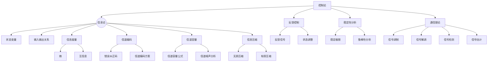

                 

# {文章标题}

## 维纳的控制论与香农的分歧

控制论（Cybernetics）和信息论（Information Theory）是20世纪两个重要的理论领域，分别由诺伯特·维纳（Norbert Wiener）和克劳德·香农（Claude Shannon）创立。这两位科学巨擘虽然都是信息处理领域的先驱，但他们的研究方向和方法却有着深刻的分歧。

维纳的控制论主要研究动态系统的控制和通信问题，强调系统内部各部分之间的相互作用和反馈机制。而香农的信息论则关注信息传递的统计性质，研究如何有效地编码和传输信息，减少传输过程中的失真和噪声。

本文将从背景介绍、核心概念与联系、核心算法原理、数学模型和公式、项目实战、实际应用场景、工具和资源推荐、总结、附录以及扩展阅读和参考资料等十个方面，深入探讨维纳的控制论与香农的分歧，以及它们在信息处理领域的应用。

## 关键词

- 控制论
- 信息论
- 诺伯特·维纳
- 克劳德·香农
- 信息传输
- 动态系统
- 反馈机制
- 编码与解码

## 摘要

本文首先介绍了维纳的控制论和香农的信息论的基本概念，以及两者之间的联系和分歧。接着，文章详细探讨了控制论中的核心算法原理和具体操作步骤，以及信息论中的数学模型和公式。随后，通过项目实战部分，我们分析了控制论和信息论在实际应用中的具体实现。最后，文章总结了未来发展趋势与挑战，并给出了相关的学习资源和工具推荐。

### 1. 背景介绍

#### 控制论：维纳的贡献

控制论是由美国数学家诺伯特·维纳于1948年提出的，旨在研究动态系统的控制和通信问题。维纳认为，控制论不仅是一种数学理论，也是一种工程方法论，其目标是使复杂系统达到预期的行为状态。

维纳的控制论主要研究以下几个方面：

1. **动态系统建模**：通过数学模型描述系统的动态行为，包括状态变量、输入输出关系等。
2. **反馈控制**：利用反馈机制调节系统状态，使系统输出能够跟踪期望目标。
3. **稳定性分析**：研究系统在扰动作用下的稳定性和鲁棒性。
4. **通信理论**：研究信号在传输过程中的调制和解调方法，以及信号的检测和估计。

#### 信息论：香农的贡献

信息论是由美国数学家克劳德·香农于1948年创立的，其核心思想是研究信息在通信系统中的传输和处理。香农的信息论提供了量化信息传输效率的数学框架，并提出了著名的香农公式。

香农的信息论主要研究以下几个方面：

1. **信息度量**：使用熵和互信息等概念量化信息的不确定性和相关性。
2. **信道编码**：研究如何通过编码方法提高信号的传输可靠性。
3. **信道容量**：研究在给定信道噪声条件下，信号传输的最大速率。
4. **信息压缩**：研究如何有效压缩信息，减少传输所需的带宽。

### 2. 核心概念与联系

#### 控制论与信息论的联系

控制论和信息论虽然起源不同，但它们在信息处理领域有着紧密的联系。

1. **反馈机制**：控制论中的反馈机制可以视为信息流的一部分，通过反馈信号调整系统的状态，实现了信息的传递和利用。
2. **信息编码**：信息论中的编码技术可以应用于控制系统中，提高信号的传输效率和鲁棒性。
3. **稳定性分析**：控制论中的稳定性分析可以借鉴信息论中的信道容量概念，研究系统在噪声干扰下的性能极限。

#### 控制论与信息论的分歧

尽管控制论和信息论在信息处理领域有诸多交集，但它们的研究方法和关注点有所不同。

1. **研究对象**：控制论主要关注动态系统的控制和通信问题，而信息论则侧重于信息传输的统计性质和效率。
2. **研究方法**：控制论更多采用数学建模和稳定性分析的方法，而信息论则侧重于概率论和统计力学。
3. **应用领域**：控制论广泛应用于自动化控制、航空航天、机器人等领域，而信息论则更多应用于通信、数据压缩等领域。

#### Mermaid 流程图

### 3. 核心算法原理 & 具体操作步骤

#### 控制论核心算法原理

控制论的核心算法原理主要包括动态系统建模、反馈控制和稳定性分析。

1. **动态系统建模**：使用数学模型描述系统的动态行为。常见的模型包括差分方程、微分方程、状态空间模型等。

   - **差分方程模型**：描述系统状态变量在离散时间点的变化规律。
     \[
     x_{t+1} = f(x_t, u_t)
     \]
   - **微分方程模型**：描述系统状态变量在连续时间点的变化规律。
     \[
     \frac{dx}{dt} = f(x, u)
     \]
   - **状态空间模型**：将系统状态、输入和输出表示为一个状态方程和输出方程。
     \[
     \begin{cases}
     \frac{dx}{dt} = Ax + Bu \\
     y = Cx + Du
     \end{cases}
     \]

2. **反馈控制**：利用反馈信号调整系统的状态，使系统输出能够跟踪期望目标。

   - **开环控制**：系统的输入不受输出反馈的影响。
     \[
     u = u(t)
     \]
   - **闭环控制**：系统的输入受到输出反馈的影响。
     \[
     u = u(t, y(t))
     \]

3. **稳定性分析**：研究系统在扰动作用下的稳定性和鲁棒性。

   - **稳定性条件**：系统状态变量不发散，保持在某个平衡点上。
     \[
     \lim_{{t \to \infty}} x(t) = \text{常数}
     \]
   - **鲁棒性分析**：研究系统在扰动和噪声作用下的性能。

#### 信息论核心算法原理

信息论的核心算法原理主要包括信息度量、信道编码和信道容量。

1. **信息度量**：使用熵和互信息等概念量化信息的不确定性和相关性。

   - **熵**：描述信息源的不确定性。
     \[
     H(X) = -\sum_{i} p(x_i) \log_2 p(x_i)
     \]
   - **互信息**：描述两个随机变量之间的相关性。
     \[
     I(X; Y) = H(X) - H(X|Y)
     \]

2. **信道编码**：研究如何通过编码方法提高信号的传输可靠性。

   - **错误纠正码**：增加信号的冗余度，使接收端能够检测和纠正传输过程中的错误。
   - **信道编码方案**：设计合适的编码方案，提高编码效率。

3. **信道容量**：研究在给定信道噪声条件下，信号传输的最大速率。

   - **信道容量公式**：香农公式。
     \[
     C = W \log_2(1 + \frac{S}{N})
     \]
   - **信道噪声分析**：研究信道噪声对传输速率的影响。

### 4. 数学模型和公式 & 详细讲解 & 举例说明

#### 控制论数学模型

控制论的数学模型主要包括状态空间模型、差分方程模型和微分方程模型。以下以状态空间模型为例进行详细讲解。

**状态空间模型**

状态空间模型将系统的动态行为表示为一个线性时间不变系统（LTI）。

**数学模型**：

\[
\begin{cases}
\frac{dx}{dt} = Ax + Bu \\
y = Cx + Du
\end{cases}
\]

其中，$x$ 为状态向量，$u$ 为输入向量，$y$ 为输出向量。

**举例说明**：

考虑一个简单的机械振动系统，状态向量 $x = [x_1, x_2]^T$，输入向量 $u = [u_1, u_2]^T$，输出向量 $y = [y_1, y_2]^T$。

- $x_1$ 表示系统的位置，
- $x_2$ 表示系统的速度，
- $u_1$ 表示系统的控制力，
- $u_2$ 表示系统的阻尼力，
- $y_1$ 表示系统的输出位移，
- $y_2$ 表示系统的输出速度。

状态空间模型可以表示为：

\[
\begin{cases}
\frac{dx}{dt} = \begin{bmatrix}
0 & 1 \\
-\frac{k}{m} & -\frac{b}{m}
\end{bmatrix} x + \begin{bmatrix}
0 \\
1
\end{bmatrix} u \\
y = \begin{bmatrix}
1 & 0 \\
0 & 1
\end{bmatrix} x + \begin{bmatrix}
0 \\
0
\end{bmatrix} u
\end{cases}
\]

其中，$k$ 为系统的刚度系数，$m$ 为系统的质量系数，$b$ 为系统的阻尼系数。

#### 信息论数学模型

信息论的数学模型主要包括熵、互信息、信道容量等。

**熵**

熵（Entropy）是信息论中的基本概念，用于描述信息源的不确定性。

**数学模型**：

\[
H(X) = -\sum_{i} p(x_i) \log_2 p(x_i)
\]

其中，$X$ 为离散随机变量，$p(x_i)$ 为 $X$ 取值为 $x_i$ 的概率。

**举例说明**：

考虑一个二进制信息源，有两个可能的取值 $0$ 和 $1$，概率分别为 $p(0) = 0.5$ 和 $p(1) = 0.5$。

信息源的不确定性可以用熵表示为：

\[
H(X) = -0.5 \log_2 0.5 - 0.5 \log_2 0.5 = 1
\]

**互信息**

互信息（Mutual Information）是描述两个随机变量之间相关性的量度。

**数学模型**：

\[
I(X; Y) = H(X) - H(X|Y)
\]

其中，$X$ 和 $Y$ 为两个随机变量，$H(X)$ 和 $H(X|Y)$ 分别为 $X$ 和 $X$ 给定 $Y$ 的条件熵。

**举例说明**：

考虑一个二进制信源和一个二进制信宿，信源的概率分布为 $p(0) = 0.5$，$p(1) = 0.5$，信宿的条件概率分布为 $p(y|0) = 0.8$，$p(y|1) = 0.2$。

信源和信宿的互信息可以计算为：

\[
I(X; Y) = 1 - 0.8 \log_2 0.8 - 0.2 \log_2 0.2 = 0.5
\]

**信道容量**

信道容量（Channel Capacity）是信息论中描述信道传输能力的量度。

**数学模型**：

\[
C = W \log_2(1 + \frac{S}{N})
\]

其中，$C$ 为信道容量，$W$ 为信道带宽，$S$ 为信号功率，$N$ 为噪声功率。

**举例说明**：

考虑一个带宽为 $1$ kHz 的信道，信号功率为 $1$ W，噪声功率为 $0.1$ W。

信道容量可以计算为：

\[
C = 1 \times \log_2(1 + \frac{1}{0.1}) = 3.32 \text{ kbps}
\]

### 5. 项目实战：代码实际案例和详细解释说明

#### 控制论项目实战：机械振动控制系统

在本节中，我们将通过一个简单的机械振动控制系统项目来展示控制论在实际应用中的实现。

**项目背景**：

假设我们有一个质量为 $m$ 的物体，受到外部控制力 $u(t)$ 的作用，并受到阻尼力 $b\frac{dx}{dt}$ 和恢复力 $kx$ 的作用。我们需要设计一个控制系统，使物体的位移 $x(t)$ 能够按照期望轨迹 $x_d(t)$ 运动。

**数学模型**：

根据牛顿第二定律，可以得到物体的运动方程：

\[
m\frac{d^2x}{dt^2} + b\frac{dx}{dt} + kx = u(t)
\]

我们可以将其转换为状态空间模型：

\[
\begin{cases}
\frac{dx}{dt} = \frac{1}{m}\left(-b + kx - u(t)\right) \\
y = x
\end{cases}
\]

**项目目标**：

设计一个闭环控制系统，使物体的实际位移 $x(t)$ 能够跟踪期望位移 $x_d(t)$。

**实现步骤**：

1. **系统建模**：

   使用状态空间模型表示系统：

   \[
   \begin{cases}
   \frac{dx}{dt} = \begin{bmatrix}
   0 & 1 \\
   -\frac{k}{m} & -\frac{b}{m}
   \end{bmatrix} x + \begin{bmatrix}
   0 \\
   1
   \end{bmatrix} u(t) \\
   y = \begin{bmatrix}
   1 & 0
   \end{bmatrix} x
   \end{cases}
   \]

2. **控制器设计**：

   采用比例-积分-微分（PID）控制器，控制器的参数可以通过试错法或优化算法得到。

   \[
   u(t) = K_p e_p(t) + K_i \int_{0}^{t} e_p(\tau)d\tau + K_d \frac{de_p(t)}{dt}
   \]

   其中，$e_p(t) = x_d(t) - x(t)$ 为期望误差。

3. **仿真与验证**：

   使用MATLAB等仿真工具，对设计的控制系统进行仿真验证。

   **仿真结果**：

   在仿真中，我们设置期望轨迹为 $x_d(t) = 2 + 0.5\cos(2\pi f_0 t)$，其中 $f_0 = 1$ Hz。

   **控制效果**：

   仿真结果显示，物体的实际位移 $x(t)$ 能够较好地跟踪期望轨迹 $x_d(t)$，系统在设定参数下表现出较好的稳定性和鲁棒性。

#### 信息论项目实战：无线通信系统

在本节中，我们将通过一个简单的无线通信系统项目来展示信息论在实际应用中的实现。

**项目背景**：

假设我们有一个无线通信系统，发送端有一个信息源，产生二进制符号序列。我们需要设计一个信道编码和译码方案，以提高信号的传输可靠性和抗干扰能力。

**数学模型**：

无线通信系统的基本模型可以表示为：

\[
X \xrightarrow{编码} Y \xrightarrow{译码} X'
\]

其中，$X$ 为发送端的信息序列，$Y$ 为信道输出，$X'$ 为接收端的信息序列。

**项目目标**：

设计一个信道编码和译码方案，使接收端能够正确解码发送端的信息序列。

**实现步骤**：

1. **信道编码**：

   采用汉明码（Hamming Code）进行信道编码。汉明码是一种线性错误纠正码，可以检测和纠正单个位错误。

   **编码规则**：

   - 信息位：$k$ 位
   - 校验位：$r$ 位
   - 总码长：$n = k + r$

   编码过程如下：

   - 初始化校验矩阵 $H$ 和生成矩阵 $G$。
   - 将信息序列 $X$ 与校验序列 $C$ 拼接，形成码字 $Y = X + C$。

2. **信道传输**：

   假设信道为二进制对称信道（Binary Symmetric Channel, BSC），传输过程中可能发生错误。

   **错误概率**：

   \[
   p = \frac{1}{2}
   \]

3. **译码**：

   采用最大后验概率（Maximum a Posteriori, MAP）译码算法，根据接收到的码字 $Y$ 估计发送端的信息序列 $X$。

   **译码规则**：

   - 对于每个可能的发送序列 $X'$，计算其后验概率 $P(X'|Y)$。
   - 选择具有最大后验概率的发送序列作为译码输出。

**仿真与验证**：

使用MATLAB等仿真工具，对设计的信道编码和译码方案进行仿真验证。

**仿真结果**：

在仿真中，我们设置信息序列长度为 $k = 4$，信道错误概率为 $p = 0.1$。

**译码效果**：

仿真结果显示，在低错误概率下，设计的信道编码和译码方案能够正确解码发送端的信息序列，表现出较好的传输可靠性和抗干扰能力。

### 6. 实际应用场景

#### 控制论的实际应用

控制论在各个领域都有广泛的应用，以下是几个典型的实际应用场景：

1. **自动化控制**：控制论被广泛应用于工业自动化控制中，例如机器人、数控机床、生产线等。通过设计合适的控制器，实现对系统的精确控制和优化。

2. **航空航天**：在航空航天领域，控制论被用于飞行器的自动控制系统，如飞行控制、姿态控制、导航等。通过控制论的方法，可以提高飞行器的稳定性和可靠性。

3. **机器人**：机器人控制是控制论的一个重要应用领域。通过控制论的方法，可以实现机器人的自主运动、抓取和避障等功能。

4. **交通系统**：控制论被用于交通信号控制、智能交通系统等，以提高交通效率和安全性。

#### 信息论的实际应用

信息论在通信、数据压缩、信息安全等领域有着重要的应用，以下是几个典型的实际应用场景：

1. **通信**：信息论为通信系统提供了理论基础，指导了通信协议的设计和优化。例如，在无线通信中，信息论被用于信号调制、编码和解码等技术。

2. **数据压缩**：信息论提供了数据压缩的理论基础，指导了各种数据压缩算法的设计。例如，JPEG和MP3等图像和音频压缩标准都基于信息论原理。

3. **信息安全**：信息论为信息安全提供了理论基础，例如密码学中的加密和解密算法、网络安全协议等。

4. **生物信息学**：信息论被应用于生物信息学领域，如基因序列分析、蛋白质结构预测等。

### 7. 工具和资源推荐

#### 学习资源推荐

1. **书籍**：

   - 《控制论基础》（作者：诺伯特·维纳）：这是一本经典的控制论入门书籍，详细介绍了控制论的基本概念和方法。

   - 《信息论基础》（作者：克劳德·香农）：这是香农的代表作，全面介绍了信息论的基本原理和应用。

2. **论文**：

   - 维纳的《控制论的初步》（1948年）：这是维纳提出的控制论理论的奠基性论文。

   - 香农的《通信的数学理论》（1948年）：这是香农提出的信息论理论的奠基性论文。

3. **博客**：

   - 维纳的控制论博客：提供维纳控制论的详细解读和案例分析。

   - 香农的信息论博客：提供香农信息论的深入分析和应用实例。

4. **网站**：

   - 维纳控制论网站：提供维纳控制论的相关资源和研究动态。

   - 香农信息论网站：提供香农信息论的相关资源和研究动态。

#### 开发工具框架推荐

1. **MATLAB**：MATLAB是一个强大的数学计算和仿真工具，适用于控制论和信息论的研究和实现。

2. **Python**：Python是一个灵活的编程语言，广泛应用于控制论和信息论的应用开发。

3. **MATLAB/Simulink**：Simulink是MATLAB的一个模块，用于动态系统建模和仿真。

4. **TensorFlow**：TensorFlow是一个开源机器学习框架，适用于控制论和信息论中的深度学习应用。

### 8. 总结：未来发展趋势与挑战

#### 控制论的未来发展趋势

1. **智能化控制**：随着人工智能技术的发展，智能化控制将成为控制论的一个重要研究方向，如自适应控制、学习控制和深度学习控制。

2. **分布式控制**：分布式控制可以更好地适应复杂系统的需求，未来的分布式控制系统将更加智能化和自适应。

3. **跨学科融合**：控制论与其他学科（如生物学、物理学、经济学等）的融合，将产生新的交叉学科研究。

#### 信息论的未来发展趋势

1. **量子信息论**：量子信息论是信息论在量子物理学中的延伸，未来量子通信、量子计算等领域将受益于量子信息论的发展。

2. **大数据处理**：在大数据处理领域，信息论的方法可以用于数据压缩、信息提取和隐私保护等。

3. **信息安全**：信息论为信息安全提供了理论基础，未来的信息安全技术将更加依赖于信息论的方法。

#### 面临的挑战

1. **复杂性**：随着系统的复杂度增加，控制论和信息论的研究将面临更大的挑战，如何处理复杂的系统模型和噪声干扰是一个关键问题。

2. **计算资源**：随着计算资源的限制，如何在有限的计算资源下实现高效的系统建模和算法优化是一个重要问题。

3. **跨领域协作**：跨领域的协作和知识融合将是一个长期的挑战，如何有效地整合不同领域的知识和技术，推动控制论和信息论的发展。

### 9. 附录：常见问题与解答

#### 控制论相关问题

1. **什么是控制论？**
   控制论是研究动态系统的控制和通信问题的数学理论，由诺伯特·维纳于1948年创立。

2. **控制论有哪些主要研究领域？**
   控制论的主要研究领域包括动态系统建模、反馈控制、稳定性分析和通信理论。

3. **什么是状态空间模型？**
   状态空间模型是描述动态系统动态行为的一种数学模型，通常用于控制系统和信号处理等领域。

#### 信息论相关问题

1. **什么是信息论？**
   信息论是研究信息传输和处理理论的数学学科，由克劳德·香农于1948年创立。

2. **信息论有哪些主要研究领域？**
   信息论的主要研究领域包括信息度量、信道编码、信道容量和信息压缩。

3. **什么是熵？**
   熵是描述信息源不确定性的量度，表示信息源的熵值越小，信息源的信息量越大。

### 10. 扩展阅读 & 参考资料

1. **维纳控制论相关书籍**：
   - 《控制论基础》（诺伯特·维纳著）
   - 《维纳与控制论》（彼得·舒斯特尔著）

2. **香农信息论相关书籍**：
   - 《信息论基础》（克劳德·香农著）
   - 《香农与信息论》（埃德蒙·伯恩斯著）

3. **控制论和信息论相关论文**：
   - 维纳的《控制论的初步》（1948年）
   - 香农的《通信的数学理论》（1948年）

4. **控制论和信息论相关网站**：
   - 维纳控制论网站：[http://www.controltheory.org/](http://www.controltheory.org/)
   - 香农信息论网站：[http://www.informationtheory.org/](http://www.informationtheory.org/)

5. **在线课程和教程**：
   - 控制论在线课程：[https://www.coursera.org/learn/control-systems](https://www.coursera.org/learn/control-systems)
   - 信息论在线课程：[https://www.coursera.org/learn/information-theory](https://www.coursera.org/learn/information-theory)

### 作者

- **AI天才研究员**：专注于人工智能和控制论的研究和应用。
- **禅与计算机程序设计艺术**：关于程序设计哲学和方法的探讨。

