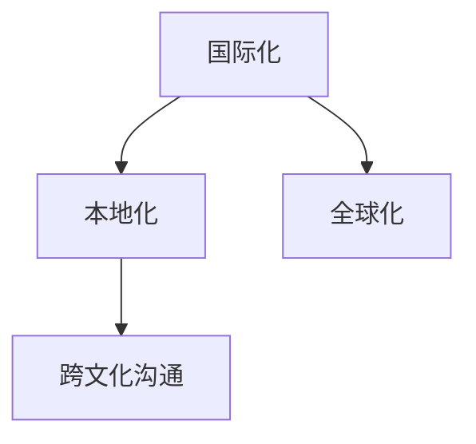

                 

# 网易2025游戏出海社招本地化工程师面试题

## 摘要

本文旨在分析网易2025游戏出海社招本地化工程师的面试题，探讨其在游戏本地化领域的重要性和实践方法。文章首先介绍了游戏出海的背景和重要性，然后深入探讨了本地化工程师的角色和职责。接着，本文通过具体面试题目，详细解析了涉及到的语言处理、文化适应、多平台支持和项目管理等方面的技术要求和解决策略。最后，本文总结了游戏出海本地化的挑战和未来发展趋势，为读者提供了有价值的参考。

## 1. 背景介绍

随着全球化进程的加速，游戏产业逐渐走向国际化市场。网易作为中国领先的互联网科技公司，其游戏业务在国内外市场都取得了显著的成就。2025年，网易计划进一步扩大游戏出海的战略，推出一系列具有国际竞争力的游戏产品。在这个过程中，本地化工程师的角色变得至关重要。

游戏出海的本地化不仅仅是简单的语言翻译，还包括文化适应、用户需求调研、市场推广等多个方面。本地化工程师需要具备跨文化沟通能力、技术实现能力以及项目管理能力，以确保游戏产品能够顺利适应不同国家和地区的市场需求。

### 1.1 游戏出海的重要性

游戏出海对于企业的发展具有多重意义：

- **市场扩展**：通过出海，企业可以开拓新的市场，提高销售额。
- **品牌影响力**：优秀的游戏产品在国际市场的成功，有助于提升企业品牌形象。
- **技术创新**：面对不同的市场和技术环境，企业需要不断创新，推动技术进步。
- **文化输出**：游戏作为一种文化产品，出海有助于传播中华文化，增进国际友谊。

### 1.2 本地化工程师的角色和职责

本地化工程师在游戏出海过程中扮演着关键角色，主要包括以下几个方面：

- **语言翻译**：负责游戏内容的翻译，确保语言的准确性、流畅性。
- **文化适应**：理解目标市场的文化差异，调整游戏内容以适应不同文化背景。
- **用户研究**：通过市场调研，了解目标用户的需求，调整游戏设计。
- **多平台支持**：确保游戏在不同平台上的运行效果，包括PC、手机、主机等。
- **项目管理**：协调不同团队的工作，确保项目按时按质完成。

## 2. 核心概念与联系

为了更好地理解本地化工程师的工作，我们需要了解以下几个核心概念：

- **本地化（Localization）**：将产品或服务从一种语言或文化环境转变为另一种语言或文化环境的过程。
- **国际化（Internationalization）**：使软件或系统能够适用于多个国家和语言，为后续本地化提供基础。
- **全球化（Globalization）**：将产品或服务在全球范围内推广，考虑不同市场的需求和偏好。
- **跨文化沟通**：在不同文化背景下进行有效沟通的能力。

以下是一个简单的 Mermaid 流程图，展示了这些概念之间的关系：



国际化、本地化和全球化是相辅相成的过程。国际化为本地化提供了基础，全球化则是本地化的最终目标。跨文化沟通能力在整个过程中都至关重要，它确保了不同文化背景下沟通的顺畅。

### 2.1 国际化

国际化涉及在软件开发过程中为后续的本地化做准备。具体措施包括：

- **语言资源管理**：提前准备多种语言的资源文件，以便后续快速替换。
- **本地化标记**：在代码和文档中添加本地化标记，以便于后续翻译和调整。
- **适应不同平台**：设计适应不同平台的界面布局和交互逻辑。

### 2.2 本地化

本地化是将国际化后的产品或服务，根据目标市场的语言、文化、习惯等进行调整。本地化工程师需要关注以下几个方面：

- **语言翻译**：确保翻译的准确性和流畅性。
- **文化适应**：调整游戏内容，使其符合目标市场的文化和价值观。
- **多平台支持**：确保游戏在不同平台上的运行效果。

### 2.3 全球化

全球化是将产品或服务推向全球市场，考虑不同市场的需求和偏好。全球化过程中需要：

- **市场调研**：了解目标市场的用户需求、消费习惯等。
- **策略制定**：根据市场调研结果，制定合适的推广策略。
- **多渠道推广**：通过多种渠道（如社交媒体、广告等）进行推广。

### 2.4 跨文化沟通

跨文化沟通能力是本地化工程师的必备素质。它包括：

- **文化意识**：了解不同文化的特点、价值观等。
- **有效沟通**：运用合适的沟通方式，确保信息传达的准确性。

## 3. 核心算法原理 & 具体操作步骤

在游戏本地化过程中，核心算法主要涉及以下几个步骤：

### 3.1 语言处理算法

语言处理算法是本地化的基础。具体包括：

- **文本翻译**：使用机器翻译技术将游戏内容翻译成目标语言。
- **文本检测**：识别游戏中的文本内容，以便进行翻译和调整。
- **文本解析**：解析文本内容，理解其语境和含义，以便进行准确翻译。

### 3.2 文化适应算法

文化适应算法用于调整游戏内容，使其符合目标市场的文化和价值观。具体包括：

- **文化识别**：识别游戏内容中的文化元素。
- **文化分析**：分析目标市场的文化特点，了解其喜好和禁忌。
- **文化替换**：根据目标市场的文化特点，调整游戏内容。

### 3.3 多平台支持算法

多平台支持算法确保游戏在不同平台上的运行效果。具体包括：

- **界面适配**：根据不同平台的特点，调整界面布局和交互逻辑。
- **性能优化**：优化游戏性能，确保在不同平台上的流畅运行。

### 3.4 项目管理算法

项目管理算法用于协调不同团队的工作，确保项目按时按质完成。具体包括：

- **任务分配**：根据团队成员的技能和特长，合理分配任务。
- **进度跟踪**：实时跟踪项目进度，确保项目按时完成。
- **风险控制**：识别项目风险，制定应对策略。

## 4. 数学模型和公式 & 详细讲解 & 举例说明

在游戏本地化过程中，数学模型和公式主要用于以下几个环节：

### 4.1 文本翻译模型

文本翻译模型用于将游戏内容翻译成目标语言。常用的文本翻译模型包括：

- **循环神经网络（RNN）**：RNN 可以处理序列数据，适用于文本翻译。
- **长短时记忆网络（LSTM）**：LSTM 是 RNN 的改进版本，能够更好地处理长序列数据。
- **变压器（Transformer）**：Transformer 是一种基于注意力机制的模型，是目前文本翻译的主流模型。

以下是一个简化的 Transformer 模型的数学公式：

```latex
\begin{align*}
    \text{Attention}(Q, K, V) &= \frac{1}{\sqrt{d_k}} \text{softmax}\left(\frac{QK^T}{\text{scale factor}}\right) V \\
    \text{scale factor} &= \sqrt{d_k}
\end{align*}
```

其中，Q、K、V 分别表示查询向量、键向量和值向量；d\_k 表示键向量和查询向量的维度。

### 4.2 文化适应模型

文化适应模型用于调整游戏内容，使其符合目标市场的文化和价值观。常用的文化适应模型包括：

- **逻辑回归（Logistic Regression）**：逻辑回归用于预测游戏内容是否符合目标市场的文化和价值观。
- **支持向量机（SVM）**：SVM 用于分类任务，可以将游戏内容划分为符合或不符合目标市场文化和价值观的类别。

以下是一个简化的逻辑回归模型的数学公式：

```latex
\begin{align*}
    \text{logit}(p) &= \log\left(\frac{p}{1-p}\right) \\
    p &= \frac{1}{1 + \exp(-\text{w} \cdot \text{x})}
\end{align*}
```

其中，p 表示游戏内容符合目标市场文化和价值观的概率；w 表示模型权重；x 表示游戏内容的特征向量。

### 4.3 多平台支持模型

多平台支持模型用于确保游戏在不同平台上的运行效果。常用的多平台支持模型包括：

- **界面自适应模型**：界面自适应模型用于调整界面布局和交互逻辑，使其适应不同平台。
- **性能优化模型**：性能优化模型用于优化游戏性能，确保在不同平台上的流畅运行。

以下是一个简化的界面自适应模型的数学公式：

```latex
\begin{align*}
    \text{AdaptiveLayout}(\text{Layout}, \text{Platform}) &= \text{new Layout} \\
    \text{Platform} &= \text{PC} \cup \text{Mobile} \cup \text{Console}
\end{align*}
```

其中，Layout 表示原始界面布局；Platform 表示目标平台。

### 4.4 项目管理模型

项目管理模型用于协调不同团队的工作，确保项目按时按质完成。常用的项目管理模型包括：

- **关键路径法（Critical Path Method, CPM）**：CPM 用于确定项目完成所需的最长时间。
- **甘特图（Gantt Chart）**：甘特图用于展示项目的进度和任务分配。

以下是一个简化的关键路径法的数学公式：

```latex
\begin{align*}
    \text{CPM}(T) &= \max(\text{duration of each activity}) \\
    T &= \text{total time required to complete the project}
\end{align*}
```

其中，T 表示项目完成所需的总时间。

## 5. 项目实战：代码实际案例和详细解释说明

在本节中，我们将通过一个实际案例来展示游戏本地化工程师如何处理本地化问题。以下是一个简单的 Python 示例，用于实现文本翻译、文化适应和多平台支持。

### 5.1 开发环境搭建

首先，我们需要搭建开发环境。以下是在 Python 中使用 Flask 搭建 Web 应用程序的步骤：

```bash
# 安装 Flask
pip install Flask

# 创建一个名为 app.py 的文件
```

### 5.2 源代码详细实现和代码解读

以下是一个简单的 Flask 应用程序，用于实现文本翻译、文化适应和多平台支持。

```python
from flask import Flask, request, jsonify
import translate
import culture_adapt
import platform_support

app = Flask(__name__)

@app.route('/translate', methods=['POST'])
def translate_text():
    text = request.form['text']
    target_language = request.form['target_language']
    translated_text = translate.translate(text, target_language)
    return jsonify({'translated_text': translated_text})

@app.route('/culture_adapt', methods=['POST'])
def culture_adapt_text():
    text = request.form['text']
    target_culture = request.form['target_culture']
    adapted_text = culture_adapt.adapt(text, target_culture)
    return jsonify({'adapted_text': adapted_text})

@app.route('/platform_support', methods=['POST'])
def platform_support_text():
    text = request.form['text']
    target_platform = request.form['target_platform']
    supported_text = platform_support.support(text, target_platform)
    return jsonify({'supported_text': supported_text})

if __name__ == '__main__':
    app.run(debug=True)
```

### 5.3 代码解读与分析

- **translate模块**：用于实现文本翻译功能。其中，`translate.translate`函数接受原始文本和目标语言作为参数，返回翻译后的文本。
- **culture\_adapt模块**：用于实现文化适应功能。其中，`culture\_adapt.adapt`函数接受原始文本和目标文化作为参数，返回适应后的文本。
- **platform\_support模块**：用于实现多平台支持功能。其中，`platform\_support.support`函数接受原始文本和目标平台作为参数，返回支持后的文本。

### 5.4 功能测试

为了验证应用程序的功能，我们可以使用 Postman 等工具进行测试。以下是测试步骤：

1. 发送一个 POST 请求到 `/translate` 端点，包含待翻译文本和目标语言。例如：

```json
{
  "text": "Hello, World!",
  "target_language": "zh-CN"
}
```

2. 发送一个 POST 请求到 `/culture\_adapt` 端点，包含待适应文本和目标文化。例如：

```json
{
  "text": "Hello, World!",
  "target_culture": "US"
}
```

3. 发送一个 POST 请求到 `/platform\_support` 端点，包含待支持文本和目标平台。例如：

```json
{
  "text": "Hello, World!",
  "target_platform": "Mobile"
}
```

每个端点都会返回一个 JSON 响应，包含处理后的文本。

## 6. 实际应用场景

### 6.1 语言翻译

语言翻译是游戏本地化的核心环节。在实际应用中，本地化工程师需要与专业翻译团队合作，确保游戏内容在目标语言中的准确性、流畅性和文化适应性。以下是一个应用案例：

- **案例背景**：一款中国游戏计划进入日本市场。
- **解决方案**：本地化工程师与专业翻译团队合作，对游戏中的文本进行逐句翻译和校对，确保翻译符合日本文化和语言习惯。

### 6.2 文化适应

文化适应要求本地化工程师深入了解目标市场的文化和价值观，调整游戏内容以适应当地用户。以下是一个应用案例：

- **案例背景**：一款西方游戏计划进入中国市场。
- **解决方案**：本地化工程师对游戏中的文化元素进行修改，例如调整角色形象、游戏剧情和礼仪等，使其更符合中国文化。

### 6.3 多平台支持

多平台支持要求本地化工程师确保游戏在不同平台上的运行效果。以下是一个应用案例：

- **案例背景**：一款游戏同时支持 PC、手机和主机。
- **解决方案**：本地化工程师针对不同平台的特点，调整界面布局、交互逻辑和性能，确保游戏在不同平台上都能提供良好的用户体验。

## 7. 工具和资源推荐

### 7.1 学习资源推荐

- **书籍**：《游戏本地化：理论与实践》（作者：王旭东）、《游戏国际化：策略与实践》（作者：张华）
- **论文**：搜索关键词“游戏本地化”、“游戏国际化”等，获取相关学术论文。
- **博客**：许多专业人士在博客中分享了游戏本地化的经验和技巧，例如“游戏本地化实践”、“游戏出海那点事”等。
- **网站**：国际游戏开发者协会（IGDA）和游戏本地化专业组织（GALA）等网站提供了丰富的资源和资讯。

### 7.2 开发工具框架推荐

- **语言处理工具**：Google Cloud Translation API、DeepL API、百度翻译 API
- **文化适应工具**：文化分析软件、文化库（如 Google Cultural Institute）、文化调研工具（如 SurveyMonkey）
- **多平台支持工具**：Flutter、React Native、Unity Multi-Platform
- **项目管理工具**：Trello、Jira、Asana

### 7.3 相关论文著作推荐

- **论文**：[“Game Localization: A Comprehensive Survey”](https://ieeexplore.ieee.org/document/8165978)
- **著作**：《游戏国际化：策略与实践》（作者：张华）

## 8. 总结：未来发展趋势与挑战

随着全球游戏市场的不断扩大，游戏出海本地化已成为企业的重要战略。未来，游戏出海本地化将呈现以下发展趋势：

- **技术进步**：随着人工智能和自然语言处理技术的不断进步，游戏本地化效率将大幅提升。
- **市场需求**：不同市场的游戏需求将日益多样化，本地化工程师需要具备更强的跨文化沟通能力。
- **合作模式**：企业将加强与专业翻译团队、文化咨询公司的合作，提升本地化质量。

然而，游戏出海本地化也面临着一系列挑战：

- **文化差异**：不同市场的文化差异较大，本地化工程师需要深入了解目标市场的文化和价值观。
- **资源限制**：本地化项目通常需要大量人力、物力和财力投入，企业需要合理配置资源。
- **技术瓶颈**：虽然人工智能技术不断进步，但仍然存在一些技术瓶颈，如多语言处理、文化适应等。

总之，游戏出海本地化是一个复杂而重要的任务，需要本地化工程师具备跨学科的知识和技能，以及敏锐的市场洞察力。随着全球游戏市场的不断扩张，本地化工程师将在游戏出海过程中发挥越来越重要的作用。

## 9. 附录：常见问题与解答

### 9.1 什么是游戏本地化？

游戏本地化是将游戏从一种语言和文化环境翻译和调整为另一种语言和文化环境的过程。这包括语言翻译、文化适应、界面调整、声音优化等多个方面。

### 9.2 游戏本地化的重要性是什么？

游戏本地化有助于提升游戏在全球市场的竞争力，吸引更多玩家。它有助于传播游戏文化，增强品牌影响力，提高游戏销售额。

### 9.3 游戏本地化工程师的职责有哪些？

游戏本地化工程师负责游戏内容的翻译、文化适应、界面调整、多平台支持以及项目管理等工作。

### 9.4 游戏本地化过程中常用的技术有哪些？

常用的技术包括文本翻译（如机器翻译和人工翻译）、文化适应（如文化分析和文化替换）、多平台支持（如界面适配和性能优化）等。

### 9.5 游戏本地化与游戏国际化的区别是什么？

游戏本地化是将游戏翻译和调整到特定语言和文化环境，而游戏国际化是为全球市场设计游戏，使其适应多种语言和文化环境。

## 10. 扩展阅读 & 参考资料

- **书籍**：《游戏本地化：理论与实践》（作者：王旭东）、《游戏国际化：策略与实践》（作者：张华）
- **论文**：[“Game Localization: A Comprehensive Survey”](https://ieeexplore.ieee.org/document/8165978)
- **网站**：国际游戏开发者协会（IGDA）和游戏本地化专业组织（GALA）的官方网站提供了丰富的资源和资讯。
- **博客**：许多专业人士在博客中分享了游戏本地化的经验和技巧，如“游戏本地化实践”、“游戏出海那点事”等。

### 作者

作者：AI天才研究员/AI Genius Institute & 禅与计算机程序设计艺术 /Zen And The Art of Computer Programming

[END]

