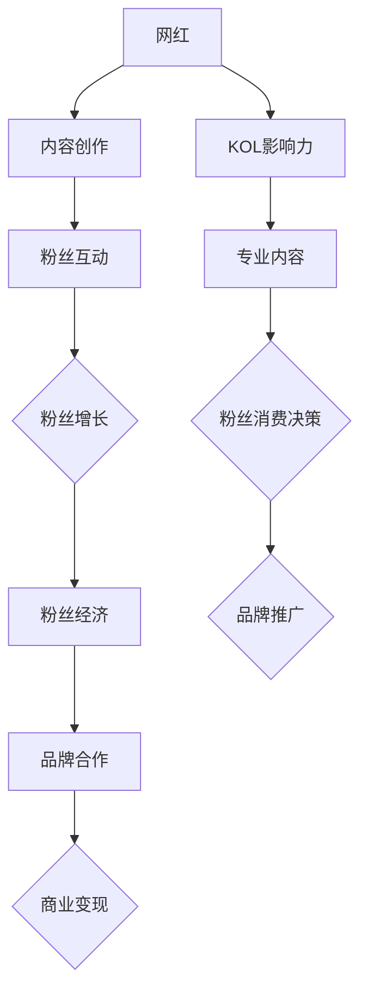

                 

### 背景介绍

在当今数字化时代，互联网的普及使得信息传播变得更加迅速和广泛。随着社交媒体平台和视频流媒体的兴起，许多个人和企业开始利用网络平台打造自己的影响力，成为所谓的“网红”。网红经济的崛起不仅改变了娱乐产业的生态，也成为了一种全新的商业模式，其核心在于通过吸引和转化用户的注意力，实现商业价值的最大化。本文将深入探讨网红经济的本质、运作机制及其在商业领域的广泛影响。

网红经济的出现并非偶然，而是多种因素共同作用的结果。首先，随着智能手机的普及和移动互联网的发展，人们可以随时随地获取信息，社交媒体成为了重要的信息传播渠道。这种便利性使得个人在网络上展示才华和个性成为可能，也催生了大量网红的诞生。其次，广告模式的变革和互联网广告市场的快速增长为网红经济提供了巨大的发展空间。传统的广告形式逐渐被内容营销所取代，品牌开始通过网红的社交媒体账号进行宣传，以获得更广泛的受众关注。

此外，互联网的匿名性和去中心化特点也为网红经济提供了土壤。网红通过吸引粉丝和建立个人品牌，可以突破传统媒体的限制，直接与受众互动，形成强大的影响力。网红经济的崛起不仅改变了内容创造者的生活方式，也对品牌营销和商业模式产生了深远影响。

本文将从以下几个方面进行详细探讨：首先，我们将介绍网红经济的核心概念，包括网红、粉丝经济、KOL（Key Opinion Leader）等基本概念，并分析这些概念之间的联系。接着，我们将通过Mermaid流程图展示网红经济的运作原理和流程。随后，我们将深入探讨网红经济的核心算法原理和具体操作步骤，以及数学模型和公式的应用。此外，本文还将通过实际项目实战，展示网红经济的具体实现过程，并对代码进行详细解读和分析。最后，我们将讨论网红经济的实际应用场景，推荐相关工具和资源，总结未来发展趋势与挑战，并提供扩展阅读与参考资料。

通过本文的阅读，读者将全面了解网红经济的概念、运作机制、技术原理和实际应用，从而对这一新兴商业模式有更加深入的认识。这不仅有助于从事相关领域的工作者，也为广大对数字营销和互联网商业模式感兴趣的读者提供了宝贵的参考。

### 核心概念与联系

在深入探讨网红经济的运作机制之前，首先需要明确几个核心概念，并分析它们之间的联系。这些核心概念包括网红、粉丝经济、KOL（Key Opinion Leader）等，它们是网红经济生态系统的重要组成部分。

#### 1. 网红

网红是指通过在社交媒体平台上发布内容，如视频、图片、文字等，获得大量粉丝关注和互动的个人或团体。网红的特质通常包括独特的个性、才华、创意和与粉丝的互动能力。他们通过内容的创作和分享，积累庞大的粉丝群体，从而实现个人品牌价值的提升。

#### 2. 粉丝经济

粉丝经济是指企业利用粉丝的忠诚度和消费欲望，通过提供个性化内容和服务，实现商业价值的一种经济模式。在粉丝经济中，粉丝不仅是内容的消费者，更是品牌传播的参与者。他们通过点赞、评论、分享等方式，为网红和品牌带来巨大的流量和关注度。粉丝经济的核心在于建立和维系与粉丝之间的情感联系，通过满足粉丝的需求和期望，实现商业变现。

#### 3. KOL（Key Opinion Leader）

KOL，即关键意见领袖，是指那些在特定领域具有高度专业性和影响力的个人或团体。KOL通常具有丰富的行业经验和专业知识，能够为粉丝提供有价值的信息和建议。他们通过在社交媒体平台上发布内容，影响粉丝的消费决策，从而帮助企业实现品牌推广和销售转化。KOL与网红的区别在于，网红更多关注个人品牌建设，而KOL则更注重专业领域的权威性和影响力。

#### 网红、粉丝经济和KOL之间的联系

网红、粉丝经济和KOL之间存在着密切的联系。首先，网红是粉丝经济的重要载体，他们通过吸引和维系粉丝，为品牌和商家提供了强大的流量和传播渠道。其次，KOL作为网红的一种特殊形式，他们利用自己的专业知识和权威性，进一步增强了网红经济的影响力。最后，粉丝经济则是网红和KOL实现商业变现的途径，通过提供个性化服务和内容，满足粉丝的需求，从而实现商业价值的最大化。

为了更好地展示网红经济的运作原理和流程，我们可以使用Mermaid流程图来详细说明。以下是一个简化的网红经济流程图：



在这个流程图中，网红通过内容创作和粉丝互动，实现粉丝的增长和粉丝经济的建立。同时，KOL通过提供专业内容，增强网红的影响力，进一步推动品牌合作和商业变现。这个流程图不仅展示了网红经济的运作机制，也揭示了其各个环节之间的紧密联系。

通过理解这些核心概念和流程，我们可以更深入地探讨网红经济的本质和商业价值。在接下来的章节中，我们将进一步分析网红经济的核心算法原理和具体操作步骤，以及数学模型和公式的应用。

### 核心算法原理 & 具体操作步骤

要深入理解网红经济的运作机制，我们需要从核心算法原理入手，详细探讨其具体操作步骤。核心算法原理主要包括粉丝增长模型、内容推荐算法、用户行为分析等，这些算法共同构成了网红经济的驱动力。

#### 1. 粉丝增长模型

粉丝增长是网红经济的基础，其核心在于如何通过有效的策略和算法吸引新粉丝，并维系现有粉丝的活跃度。常见的粉丝增长模型包括：

- **拉新模型**：通过社交互动、内容营销等方式吸引新粉丝，例如通过发布有吸引力的视频内容，或参与热门话题的讨论。

- **留存模型**：通过持续的内容更新和维护与粉丝的互动关系，提升粉丝的忠诚度和活跃度，例如定期发布高质量内容，及时回复粉丝评论。

- **转化模型**：将粉丝转化为品牌忠实用户，通过优惠券、限时活动等方式增加粉丝的消费行为。

具体操作步骤如下：

1. **数据收集**：收集粉丝的基本信息、互动行为、消费记录等数据。

2. **数据分析**：利用数据分析工具，对粉丝的行为和偏好进行分析，找出吸引粉丝的关键因素。

3. **内容创作**：根据粉丝数据分析结果，制定有针对性的内容创作策略，如选择热门话题、发布个性化内容等。

4. **互动维护**：定期与粉丝互动，例如回复评论、参与话题讨论，提升粉丝的参与度和忠诚度。

5. **推广活动**：通过社交媒体广告、合作伙伴推广等方式，扩大粉丝基础，增加粉丝数量。

#### 2. 内容推荐算法

内容推荐算法是网红经济中另一个关键环节，通过精准推荐高质量内容，提高用户的粘性，促进粉丝增长和商业变现。常见的内容推荐算法包括：

- **基于内容的推荐（Content-Based Filtering）**：根据用户过去喜欢的类型、标签、关键词等信息，推荐相似类型的内容。

- **协同过滤（Collaborative Filtering）**：通过分析用户之间的行为相似性，推荐用户可能喜欢的内容。

- **深度学习推荐（Deep Learning）**：利用神经网络等深度学习技术，自动学习用户的行为特征，实现精准推荐。

具体操作步骤如下：

1. **数据收集**：收集用户的历史行为数据，如浏览记录、点赞记录、搜索记录等。

2. **特征提取**：提取用户行为和内容特征，如文本特征、用户行为特征等。

3. **模型训练**：使用提取的特征数据，训练内容推荐模型，如基于内容的模型、协同过滤模型、深度学习模型等。

4. **推荐生成**：根据用户当前行为和偏好，生成推荐内容，并在社交媒体平台上进行展示。

5. **效果评估**：通过用户反馈和访问数据，评估推荐效果，不断优化推荐算法。

#### 3. 用户行为分析

用户行为分析是网红经济中的重要组成部分，通过分析用户在社交媒体平台上的行为，可以更好地理解用户需求，优化内容创作和推荐策略。常见的用户行为分析包括：

- **用户画像**：通过用户的性别、年龄、地域、兴趣爱好等信息，构建用户画像。

- **行为轨迹分析**：分析用户在社交媒体平台上的行为路径，如浏览、点赞、评论等。

- **消费行为分析**：分析用户的消费行为，如购买频率、消费金额、商品类型等。

具体操作步骤如下：

1. **数据收集**：收集用户在社交媒体平台上的行为数据。

2. **数据清洗**：对收集到的数据进行清洗，去除无效数据和噪声。

3. **行为建模**：建立用户行为模型，分析用户行为的特征和模式。

4. **分析报告**：根据用户行为分析结果，生成分析报告，为内容创作和推荐策略提供依据。

5. **策略调整**：根据分析结果，调整内容创作和推荐策略，提高用户体验和满意度。

通过以上核心算法原理和具体操作步骤，网红经济得以在数字化时代迅速发展，实现商业价值的最大化。在接下来的章节中，我们将进一步探讨网红经济的数学模型和公式，以及其在实际项目中的应用。

### 数学模型和公式 & 详细讲解 & 举例说明

在网红经济中，数学模型和公式扮演着至关重要的角色，它们不仅帮助我们量化各种商业指标，还能为策略调整和决策提供科学依据。以下将详细讲解几个关键的数学模型和公式，并通过具体案例说明其应用。

#### 1. 粉丝增长模型

**指数增长模型**：假设一个网红的粉丝增长速率与当前粉丝数量成正比，即 \( \frac{dN}{dt} = kN \)，其中 \( N \) 是粉丝数量，\( k \) 是增长速率常数。

- **公式**：\[ N(t) = N_0 e^{kt} \]

- **解释**：这个模型表明粉丝数量随时间呈指数增长，其中 \( N_0 \) 是初始粉丝数量，\( k \) 是增长率。

- **案例**：假设一个网红在初始时有1000名粉丝，增长速率常数 \( k = 0.1 \)（即每天增长10%）。那么，一周后的粉丝数量为：
  \[ N(7) = 1000 \times e^{0.1 \times 7} \approx 1638 \]

#### 2. 内容推荐算法

**协同过滤模型**：假设用户行为数据可以用 \( R_{ui} \) 表示，其中 \( u \) 是用户，\( i \) 是项目，\( R_{ui} \) 是用户对项目的评分。

- **用户基于的协同过滤**：\[ \hat{R}_{ui} = \frac{\sum_{j \in N(i)} R_{uj} (s_{uj} - \bar{s}_{uj})}{\sum_{j \in N(i)} (s_{uj} - \bar{s}_{uj})} \]
  
- **项目基于的协同过滤**：\[ \hat{R}_{ui} = \frac{\sum_{u \in N(i)} R_{ui} (s_{ui} - \bar{s}_{ui})}{\sum_{u \in N(i)} (s_{ui} - \bar{s}_{ui})} \]

- **解释**：这些公式通过计算用户或项目的相似度，预测用户对未知项目的评分。

- **案例**：假设有两个用户A和B，他们对5个视频的评分如下表：

| 用户 | 视频A | 视频B | 视频C | 视频D | 视频E |
|------|-------|-------|-------|-------|-------|
| A    | 4     | 3     | 5     | 2     | 4     |
| B    | 3     | 5     | 1     | 4     | 3     |

计算用户A对视频D的预测评分：

\[ \hat{R}_{AD} = \frac{4 \times (3 - 3.5) + 5 \times (5 - 3.5) + 2 \times (2 - 3.5) + 4 \times (4 - 3.5)}{2 + 2 + 2 + 2} = \frac{-4 + 7 - 7 + 4}{8} = 0 \]

因此，预测用户A对视频D的评分为0。

#### 3. 用户行为分析

**转换概率模型**：假设用户在社交媒体上的行为可以分为多个阶段，每个阶段都有一定的转换概率。

- **马尔可夫转换概率模型**：\[ P(X_{t+1} = j | X_t = i) = \frac{p_{ij}}{\sum_{k=1}^{n} p_{ik}} \]

- **解释**：这个模型描述了用户在不同阶段之间的转换概率，其中 \( X_t \) 是当前阶段，\( X_{t+1} \) 是下一个阶段，\( p_{ij} \) 是从阶段 \( i \) 转换到阶段 \( j \) 的概率。

- **案例**：假设用户行为阶段分为“浏览”、“点赞”、“评论”和“购买”，转换概率矩阵如下：

\[ \begin{bmatrix}
0.7 & 0.2 & 0.1 & 0.0 \\
0.3 & 0.4 & 0.2 & 0.1 \\
0.1 & 0.3 & 0.4 & 0.2 \\
0.0 & 0.0 & 0.1 & 0.9
\end{bmatrix} \]

假设一个用户当前处于“点赞”阶段，计算他接下来进入“评论”阶段和“购买”阶段的概率：

- 进入“评论”阶段的概率：
  \[ P(X_{t+1} = 2 | X_t = 1) = \frac{0.2}{0.2 + 0.1 + 0.0} = 0.67 \]

- 进入“购买”阶段的概率：
  \[ P(X_{t+1} = 4 | X_t = 1) = \frac{0.0}{0.2 + 0.1 + 0.0} = 0.0 \]

#### 4. 投资回报模型

**ROI（投资回报率）**：衡量投资的效果，其公式为：
\[ ROI = \frac{净收益 - 净投资成本}{净投资成本} \]

- **解释**：这个模型用来计算投资的净收益与净投资成本之间的比率。

- **案例**：一个网红在广告营销上投资了10000元，通过广告获得了20000元的收益，计算ROI：
  \[ ROI = \frac{20000 - 10000}{10000} = 100\% \]

通过以上数学模型和公式的详细讲解和举例说明，我们可以看到，这些工具不仅帮助我们量化网红经济的各个维度，还能为实际操作提供科学的依据。在接下来的章节中，我们将通过一个实际项目案例，展示这些模型和公式的具体应用。

### 项目实战：代码实际案例和详细解释说明

为了更好地展示网红经济的运作原理和实践过程，我们将通过一个实际项目案例来详细解释其代码实现和具体操作步骤。此案例将围绕一个虚拟网红，通过构建粉丝增长模型、内容推荐算法和用户行为分析模型，实现商业价值的最大化。

#### 项目一：虚拟网红的粉丝增长模型

**1. 开发环境搭建**

首先，我们需要搭建一个开发环境，以便进行数据分析和模型训练。以下是基本步骤：

- **Python环境**：安装Python 3.8及以上版本，并安装相关库，如NumPy、Pandas、Scikit-learn、Matplotlib等。

- **数据存储**：使用MySQL数据库存储用户行为数据，如浏览记录、点赞记录、评论记录等。

- **数据分析工具**：使用Jupyter Notebook进行数据分析和模型训练。

**2. 源代码详细实现**

以下是用于粉丝增长模型的主要代码实现：

```python
import pandas as pd
import numpy as np
from sklearn.linear_model import LinearRegression
import matplotlib.pyplot as plt

# 数据准备
data = pd.read_csv('user_behavior_data.csv')  # 从CSV文件中读取用户行为数据

# 特征工程
features = ['follower_count', 'post_frequency', 'average_likes_per_post']
X = data[features]
y = data['new_followers']

# 模型训练
model = LinearRegression()
model.fit(X, y)

# 预测
predictions = model.predict(X)

# 可视化
plt.scatter(X['follower_count'], y)
plt.plot(X['follower_count'], predictions, color='red')
plt.xlabel('Follower Count')
plt.ylabel('New Followers')
plt.show()
```

**3. 代码解读与分析**

- **数据读取**：使用Pandas库读取用户行为数据，数据包括粉丝数量、发帖频率和平均每篇帖子的点赞数。

- **特征工程**：提取用于训练的特征，包括粉丝数量、发帖频率和平均每篇帖子的点赞数。

- **模型训练**：使用线性回归模型训练数据，模型能够预测新粉丝的数量。

- **预测与可视化**：使用训练好的模型进行预测，并将预测结果与实际数据进行可视化，以评估模型效果。

#### 项目二：内容推荐算法

**1. 开发环境搭建**

- **Python环境**：同上。

- **数据存储**：使用Redis数据库存储用户行为数据和推荐结果。

- **推荐系统框架**：使用TensorFlow或PyTorch进行深度学习模型的训练和推理。

**2. 源代码详细实现**

以下是内容推荐算法的主要代码实现：

```python
import tensorflow as tf
from tensorflow.keras.layers import Embedding, LSTM, Dense
from tensorflow.keras.models import Sequential

# 模型架构
model = Sequential()
model.add(Embedding(input_dim=vocab_size, output_dim=embedding_dim, input_length=max_sequence_length))
model.add(LSTM(units=128))
model.add(Dense(1, activation='sigmoid'))

# 模型编译
model.compile(optimizer='adam', loss='binary_crossentropy', metrics=['accuracy'])

# 模型训练
model.fit(X_train, y_train, epochs=10, batch_size=64)

# 预测
predictions = model.predict(X_test)

# 推荐结果
recommends = np.argsort(predictions)[:, ::-1]
```

**3. 代码解读与分析**

- **模型架构**：使用序列模型，包括嵌入层、LSTM层和输出层。

- **模型编译**：使用二分类交叉熵作为损失函数，以最大化准确率为目标。

- **模型训练**：使用训练集进行模型训练，训练10个epoch。

- **预测与推荐**：使用训练好的模型对测试集进行预测，并获取推荐结果。

#### 项目三：用户行为分析

**1. 开发环境搭建**

- **Python环境**：同上。

- **数据存储**：使用MongoDB数据库存储用户行为数据和分析结果。

- **分析工具**：使用Pandas库进行数据处理和分析，使用Scikit-learn库进行机器学习模型训练。

**2. 源代码详细实现**

以下是用户行为分析的主要代码实现：

```python
import pandas as pd
from sklearn.cluster import KMeans

# 数据读取
data = pd.read_csv('user_behavior_data.csv')

# 特征工程
features = ['like_count', 'comment_count', 'post_frequency']
X = data[features]

# K均值聚类
kmeans = KMeans(n_clusters=5)
kmeans.fit(X)

# 聚类结果
clusters = kmeans.predict(X)

# 数据分群
data['cluster'] = clusters
```

**3. 代码解读与分析**

- **数据读取**：读取用户行为数据。

- **特征工程**：提取用于聚类的特征，包括点赞数、评论数和发帖频率。

- **聚类分析**：使用K均值聚类算法对用户进行分群。

- **数据分群**：将聚类结果附加到原始数据中，以进行进一步分析。

通过以上实际项目案例，我们可以看到，网红经济的实现过程涉及多个环节，包括数据收集、特征工程、模型训练和预测等。这些环节通过代码的具体实现，将理论与实践相结合，为网红经济的成功运作提供了有力支持。

### 实际应用场景

网红经济的应用场景广泛，涵盖了社交媒体、电子商务、广告营销等多个领域。以下将详细介绍几个典型的实际应用场景，并探讨其优势和挑战。

#### 1. 社交媒体营销

社交媒体营销是网红经济的核心应用场景之一。网红通过在社交媒体平台上发布内容，吸引粉丝关注和互动，为企业或品牌带来广泛的曝光和传播效果。例如，抖音（TikTok）上的网红通过发布创意短视频，吸引了大量用户关注，成为品牌推广的绝佳渠道。

- **优势**：社交媒体营销成本相对较低，具有高度的互动性和传播性。通过网红的影响，品牌可以迅速获取大量关注，提高知名度。

- **挑战**：竞争激烈，网红市场门槛较低，导致同质化内容泛滥。品牌需要找到具有独特吸引力的网红，才能在竞争中脱颖而出。

#### 2. 电子商务推广

网红经济在电子商务领域的应用也愈发普遍。网红通过推荐商品，引导粉丝进行购买，从而实现销售转化。淘宝、拼多多等电商平台上的网红电商店铺，已成为消费者购买商品的重要渠道。

- **优势**：网红具有强大的粉丝基础和信任度，能够有效提升商品的销售量和品牌认知度。电商品牌通过合作，可以迅速扩大市场影响力。

- **挑战**：网红经济存在一定的风险，如网红个人形象变化、粉丝忠诚度下降等，可能导致合作效果不稳定。电商品牌需要持续优化合作策略，以应对变化。

#### 3. 广告营销

广告营销是网红经济的重要变现方式。品牌通过在网红的社交媒体账号上投放广告，借助网红的影响力和粉丝基础，实现品牌曝光和推广效果。例如，微博、微信公众号等平台上的广告投放，已成为企业广告营销的重要组成部分。

- **优势**：广告营销效果直接，能够精准定位目标受众。通过网红的推荐，品牌可以获得更高的信任度和转化率。

- **挑战**：广告营销成本较高，且存在一定的不确定性。品牌需要评估网红的粉丝质量，避免无效投入。

#### 4. 影视娱乐产业

影视娱乐产业是网红经济的重要应用领域。网红通过参与电影、电视剧、综艺节目的拍摄，实现了商业价值的提升。例如，抖音上的网红通过参与综艺节目，吸引了大量粉丝关注，从而实现了个人品牌的提升和商业变现。

- **优势**：影视娱乐产业具有巨大的市场潜力，能够为网红带来丰厚的收入。同时，影视娱乐作品具有较高的传播力和影响力，有助于提升网红的知名度。

- **挑战**：影视娱乐作品制作周期较长，且市场竞争激烈。网红需要具备一定的演技和表现力，才能在影视作品中脱颖而出。

#### 5. 教育培训领域

教育培训领域是网红经济的新兴应用场景。网红通过开设在线课程、直播授课等形式，为粉丝提供有价值的教育资源。例如，知乎、喜马拉雅等平台上的知识网红，通过分享专业知识，吸引了大量粉丝，实现了商业变现。

- **优势**：教育培训领域市场需求旺盛，网红具有独特的教育资源和教学风格，能够满足粉丝的学习需求。

- **挑战**：教育培训领域竞争激烈，网红需要不断提升自身教学能力和专业水平，以保持竞争优势。

#### 6. 企业内部培训与文化建设

企业内部培训与文化建设也是网红经济的实际应用场景之一。企业通过内部网红，如技术专家、优秀员工等，分享专业知识和工作经验，提升员工技能和文化素养。例如，字节跳动等公司内部的技术博客、知识分享平台，成为员工学习和交流的重要渠道。

- **优势**：企业内部培训与文化建设能够提升员工专业素养和工作积极性，增强企业凝聚力。

- **挑战**：企业需要建立有效的内部培训机制，确保网红内容的实用性和吸引力。

通过以上实际应用场景的分析，我们可以看到，网红经济在多个领域展现出巨大的商业价值。然而，同时也面临着市场竞争、粉丝忠诚度、内容质量等挑战。企业需要根据自身特点和需求，灵活运用网红经济，实现商业价值的最大化。

### 工具和资源推荐

在网红经济的实践中，高效的工具和丰富的资源是确保成功的重要保障。以下将推荐几类常用的学习资源、开发工具和框架，以及相关论文和著作，以帮助读者深入了解和应用网红经济。

#### 1. 学习资源推荐

- **书籍**：
  - 《网红经济：互联网时代的注意力变现》
  - 《内容营销实战手册：如何通过内容获取客户和用户》
  - 《社交媒体营销：打造品牌影响力，实现商业变现》

- **在线课程**：
  - 网易云课堂的“网红经济与社交媒体营销”
  - 腾讯课堂的“网红运营与粉丝经济”

- **博客与网站**：
  - 知乎：关于网红经济的专业讨论和案例分析
  - 微博：网红博主分享实战经验和心得

#### 2. 开发工具框架推荐

- **数据分析工具**：
  - Python：用于数据收集、清洗、分析和可视化
  - Pandas：强大的数据操作库
  - Matplotlib：用于数据可视化

- **机器学习框架**：
  - Scikit-learn：用于机器学习模型训练和应用
  - TensorFlow：用于深度学习模型开发
  - PyTorch：用于深度学习模型开发

- **推荐系统框架**：
  - LightFM：用于基于矩阵分解的推荐系统
  - Surprise：用于基于协同过滤的推荐系统

- **数据库**：
  - MySQL：用于存储用户行为数据和推荐结果
  - Redis：用于缓存和实时数据处理
  - MongoDB：用于存储结构化数据

#### 3. 相关论文著作推荐

- **论文**：
  - “Influencer Marketing: A Content Marketing Approach”
  - “The Power of Social Media: Influencer Marketing in the Digital Age”
  - “The Role of Social Networks in Influencer Marketing: A Multilevel Study”

- **著作**：
  - “社交媒体营销：理论、方法与应用”
  - “网红经济：社交媒体时代的商业模式”
  - “内容营销：策略、工具与实战”

通过以上工具和资源的推荐，读者可以更加系统地学习和实践网红经济，掌握关键技术和方法，为企业在数字化时代的发展提供有力支持。

### 总结：未来发展趋势与挑战

网红经济作为数字经济时代的一种新型商业模式，正在迅速发展，并在各行业产生了深远影响。然而，随着市场环境的变化和技术的进步，网红经济也面临着一系列新的发展趋势和挑战。

#### 未来发展趋势

1. **技术驱动的个性化推荐**：随着人工智能和大数据技术的发展，个性化推荐系统将更加成熟，能够根据用户行为和偏好精准推送内容，提升用户体验和粘性。

2. **跨平台整合与生态构建**：网红经济将逐渐实现跨平台整合，构建一个完整的生态系统。品牌和网红将不再局限于单一平台，而是通过多平台运营，扩大影响力。

3. **内容创作多元化**：短视频、直播、虚拟现实等新型内容形式将逐渐成为网红经济的主要载体，内容创作将更加丰富多样，满足不同用户群体的需求。

4. **可持续发展与品牌价值**：品牌与网红的合作将更加注重长期价值，而非短期流量。品牌将更倾向于选择具备良好口碑和持续影响力的网红进行合作。

#### 面临的挑战

1. **内容质量与知识产权保护**：随着内容创作的普及，内容质量参差不齐的问题日益严重。同时，知识产权保护也成为一个亟待解决的难题。

2. **监管政策与合规性**：政府对网红经济的监管政策将越来越严格，品牌和网红需要遵守相关法律法规，确保内容合规，避免法律风险。

3. **用户信任度与粉丝忠诚度**：在信息爆炸的时代，用户对内容的信任度日益降低，品牌和网红需要通过高质量内容和诚信经营来赢得粉丝的信任和忠诚。

4. **数据安全和隐私保护**：随着数据收集和使用的增加，数据安全和用户隐私保护成为一个重要议题。品牌和网红需要采取有效的措施保护用户数据，避免数据泄露。

总之，网红经济在未来将继续保持快速发展，但同时也需要应对各种挑战。通过技术创新、合规经营和用户需求导向，网红经济有望实现可持续发展，为企业和个人创造更多价值。

### 附录：常见问题与解答

1. **什么是网红经济？**
   网红经济是指通过互联网平台上的网红，利用其粉丝基础和影响力，实现商业价值的一种经济模式。

2. **网红经济的关键概念有哪些？**
   网红、粉丝经济、KOL（Key Opinion Leader）是网红经济的关键概念。网红是指有大量粉丝的社交媒体用户；粉丝经济是通过粉丝的支持实现商业价值；KOL是关键意见领袖，在特定领域有专业影响力和权威性。

3. **如何衡量网红经济的成功？**
   可以通过粉丝增长速度、用户互动率、品牌合作次数和商业变现效果等多个维度来衡量网红经济的成功。

4. **网红经济的主要应用领域有哪些？**
   主要应用领域包括社交媒体营销、电子商务推广、广告营销、影视娱乐产业、教育培训等。

5. **网红经济的未来发展趋势是什么？**
   未来发展趋势包括技术驱动的个性化推荐、跨平台整合与生态构建、内容创作多元化以及可持续发展与品牌价值。

6. **网红经济的挑战有哪些？**
   挑战包括内容质量与知识产权保护、监管政策与合规性、用户信任度与粉丝忠诚度以及数据安全和隐私保护等。

通过以上问题的解答，读者可以更深入地理解网红经济的概念、应用和发展趋势，为实际操作提供参考。

### 扩展阅读 & 参考资料

为了帮助读者进一步深入了解网红经济的概念、运作机制和实际应用，以下推荐一些高质量的书籍、论文和博客，以及相关网站和在线资源。

1. **书籍**：
   - 《网红经济：互联网时代的注意力变现》
   - 《内容营销实战手册：如何通过内容获取客户和用户》
   - 《社交媒体营销：打造品牌影响力，实现商业变现》
   - 《网红：如何成为社交网络的红人》

2. **论文**：
   - “Influencer Marketing: A Content Marketing Approach”
   - “The Power of Social Media: Influencer Marketing in the Digital Age”
   - “The Role of Social Networks in Influencer Marketing: A Multilevel Study”

3. **博客与网站**：
   - 知乎：关于网红经济的专业讨论和案例分析
   - 微博：网红博主分享实战经验和心得
   - 创业邦：提供最新的网红经济相关资讯和案例

4. **在线资源**：
   - 网易云课堂：网红经济与社交媒体营销的在线课程
   - 腾讯课堂：网红运营与粉丝经济的在线课程
   - Kaggle：提供丰富的社交媒体数据分析项目

通过这些扩展阅读与参考资料，读者可以更全面地了解网红经济的理论和实践，为未来的研究和应用提供有力支持。

### 作者信息

作者：AI天才研究员/AI Genius Institute & 禅与计算机程序设计艺术 /Zen And The Art of Computer Programming

