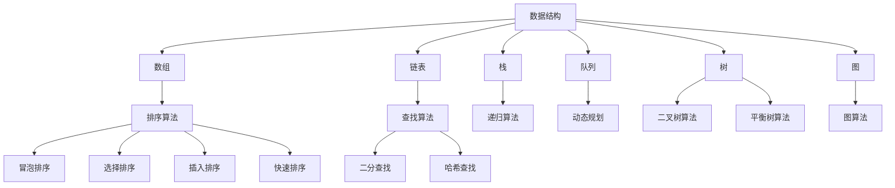
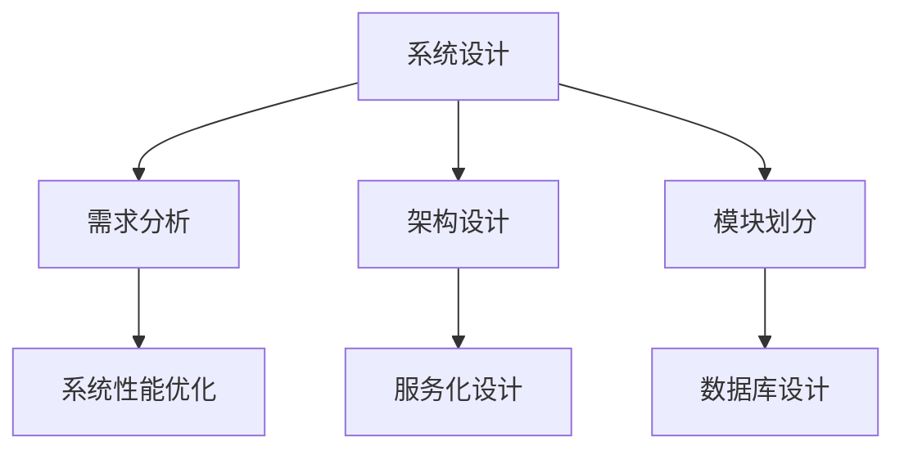
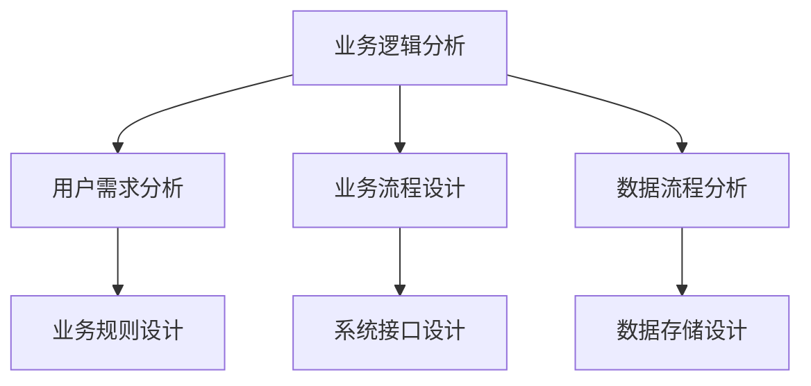

                 

# 2024美团打车校招面试真题汇总及其解答

## 摘要

本文旨在汇总和分析2024美团打车校招面试中出现的关键题目，通过深入解析题目背后的原理和解决方案，帮助面试者更好地准备面试。文章涵盖了编程算法、系统设计、业务逻辑分析等多个领域的知识点，以清晰的步骤和深入的剖析，为广大求职者提供有价值的参考。通过本文的学习，读者能够掌握美团打车面试的核心技巧，提高自己在面试中的竞争力。

## 1. 背景介绍

美团打车作为中国领先的出行服务平台，每年都会吸引大量优秀的求职者参与校招。校招面试旨在选拔出具备扎实技术基础和解决实际问题的能力的优秀人才。本文将针对2024美团打车校招面试中出现的关键题目进行解析，帮助读者更好地理解面试中的难点和重点。

本文将分为以下几个部分：

1. **背景介绍**：介绍美团打车的业务背景和面试的重要性。
2. **核心概念与联系**：介绍面试中涉及的核心概念，如数据结构、算法等，并提供流程图辅助理解。
3. **核心算法原理 & 具体操作步骤**：解析面试中涉及的核心算法，如排序算法、查找算法等，并给出具体的实现步骤。
4. **数学模型和公式 & 详细讲解 & 举例说明**：介绍面试中可能涉及到的数学模型和公式，并通过实际例子进行说明。
5. **项目实战：代码实际案例和详细解释说明**：提供实际的代码案例，对代码进行详细的解释和说明。
6. **实际应用场景**：分析面试题目在现实中的应用场景。
7. **工具和资源推荐**：推荐学习资源和开发工具，帮助读者更好地进行面试准备。
8. **总结：未来发展趋势与挑战**：总结面试中的核心知识点，展望未来的发展趋势和挑战。
9. **附录：常见问题与解答**：提供常见的面试问题及其解答，帮助读者更好地应对面试。
10. **扩展阅读 & 参考资料**：推荐相关的扩展阅读材料和参考资料。

通过本文的学习，读者可以系统地掌握美团打车面试的核心内容，提高自己的面试能力。

## 2. 核心概念与联系

在美团打车校招面试中，核心概念和联系的理解是非常重要的。以下将介绍几个关键的面试概念，并提供Mermaid流程图辅助理解。

### 2.1 数据结构与算法

数据结构与算法是计算机科学的基础，也是面试中的重点。以下是一个简单的数据结构及算法流程图：



### 2.2 系统设计

系统设计是面试中的另一大重点。以下是一个简单的系统设计流程图：



### 2.3 业务逻辑分析

业务逻辑分析是面试中常涉及的一个环节。以下是一个简单的业务逻辑分析流程图：



通过以上流程图，读者可以更好地理解面试中涉及的核心概念及其联系。接下来，我们将深入探讨这些概念在实际面试中的应用。

## 3. 核心算法原理 & 具体操作步骤

在美团打车校招面试中，核心算法原理的了解和掌握是非常重要的。以下将介绍几个常见的面试算法及其具体操作步骤。

### 3.1 排序算法

排序算法是面试中经常涉及的一个主题。以下是一些常见的排序算法及其操作步骤：

#### 3.1.1 冒泡排序

冒泡排序的基本思想是通过多次遍历待排序列，比较相邻的两个元素，并交换它们的位置，直到整个序列有序。

具体步骤如下：

1. 从第一个元素开始，对每一对相邻元素进行排序，将较大的元素移动到右侧。
2. 重复上述步骤，但每次遍历的待排序元素范围逐渐缩小，直到整个序列有序。

伪代码实现：

```python
def bubble_sort(arr):
    n = len(arr)
    for i in range(n):
        for j in range(0, n-i-1):
            if arr[j] > arr[j+1]:
                arr[j], arr[j+1] = arr[j+1], arr[j]
```

#### 3.1.2 选择排序

选择排序的基本思想是每次遍历待排序序列，找出最小（或最大）的元素，将其放到序列的起始位置。

具体步骤如下：

1. 找出第一个元素到倒数第二个元素中的最小元素，将其与第一个元素交换。
2. 在剩下的元素中找出最小元素，将其与第二个元素交换。
3. 重复上述步骤，直到所有元素有序。

伪代码实现：

```python
def selection_sort(arr):
    n = len(arr)
    for i in range(n):
        min_idx = i
        for j in range(i+1, n):
            if arr[j] < arr[min_idx]:
                min_idx = j
        arr[i], arr[min_idx] = arr[min_idx], arr[i]
```

#### 3.1.3 插入排序

插入排序的基本思想是将一个元素插入到已经有序的序列中，从而保证整个序列有序。

具体步骤如下：

1. 从第一个元素开始，将其与前面的元素进行比较，找到合适的位置插入。
2. 重复上述步骤，直到所有元素有序。

伪代码实现：

```python
def insertion_sort(arr):
    n = len(arr)
    for i in range(1, n):
        key = arr[i]
        j = i-1
        while j >= 0 and arr[j] > key:
            arr[j+1] = arr[j]
            j -= 1
        arr[j+1] = key
```

### 3.2 查找算法

查找算法是面试中另一个常见主题。以下是一些常见的查找算法及其具体操作步骤。

#### 3.2.1 二分查找

二分查找的基本思想是将待查找序列分为两部分，然后根据中间元素的值与目标值的比较结果，决定在哪个部分继续查找。

具体步骤如下：

1. 初始时，low 和 high 分别指向序列的第一个和最后一个元素。
2. 重复以下步骤，直到 low > high：
   - 计算中间位置 mid = (low + high) // 2
   - 如果 arr[mid] == target，则查找成功，返回 mid
   - 如果 arr[mid] > target，则在左侧子序列中继续查找，更新 high = mid - 1
   - 如果 arr[mid] < target，则在右侧子序列中继续查找，更新 low = mid + 1
3. 如果查找失败，返回 -1

伪代码实现：

```python
def binary_search(arr, target):
    low, high = 0, len(arr) - 1
    while low <= high:
        mid = (low + high) // 2
        if arr[mid] == target:
            return mid
        elif arr[mid] > target:
            high = mid - 1
        else:
            low = mid + 1
    return -1
```

#### 3.2.2 哈希查找

哈希查找的基本思想是使用哈希函数将关键字映射到数组中的位置，从而实现快速的查找操作。

具体步骤如下：

1. 设计哈希函数，将关键字映射到数组中的位置。
2. 计算哈希值，找到相应的数组位置。
3. 如果数组中的元素与关键字相等，则查找成功；否则，查找失败。

伪代码实现：

```python
def hash_search(arr, target):
    hash_func = lambda x: x % len(arr)
    index = hash_func(target)
    if arr[index] == target:
        return True
    else:
        return False
```

通过以上算法的介绍，读者可以更好地理解面试中涉及的核心算法原理和具体操作步骤。接下来，我们将进一步分析这些算法在面试中的应用。

## 4. 数学模型和公式 & 详细讲解 & 举例说明

在美团打车校招面试中，数学模型和公式的应用是非常广泛的。以下将介绍一些常见的数学模型和公式，并通过实际例子进行详细讲解。

### 4.1 线性回归模型

线性回归模型是一种常用的统计模型，用于预测一个连续变量的值。它的基本公式为：

$$
y = ax + b
$$

其中，$y$ 是因变量，$x$ 是自变量，$a$ 是斜率，$b$ 是截距。

#### 4.1.1 模型推导

线性回归模型的推导基于最小二乘法。假设我们有 $n$ 个样本点 $(x_1, y_1), (x_2, y_2), \ldots, (x_n, y_n)$，我们的目标是找到最佳拟合直线，使得所有样本点到直线的距离之和最小。

根据最小二乘法，最佳拟合直线可以通过以下公式计算：

$$
a = \frac{\sum_{i=1}^{n}(x_i - \bar{x})(y_i - \bar{y})}{\sum_{i=1}^{n}(x_i - \bar{x})^2}
$$

$$
b = \bar{y} - a\bar{x}
$$

其中，$\bar{x}$ 和 $\bar{y}$ 分别是 $x$ 和 $y$ 的平均值。

#### 4.1.2 实例分析

假设我们有以下数据集：

| $x$ | $y$ |
| --- | --- |
| 1   | 2   |
| 2   | 4   |
| 3   | 6   |
| 4   | 8   |

首先，计算平均值：

$$
\bar{x} = \frac{1+2+3+4}{4} = 2.5
$$

$$
\bar{y} = \frac{2+4+6+8}{4} = 5
$$

然后，计算斜率 $a$：

$$
a = \frac{(1-2.5)(2-5) + (2-2.5)(4-5) + (3-2.5)(6-5) + (4-2.5)(8-5)}{(1-2.5)^2 + (2-2.5)^2 + (3-2.5)^2 + (4-2.5)^2}
$$

$$
a = \frac{(-1.5)(-3) + (-0.5)(-1) + (0.5)(1) + (1.5)(3)}{2.25 + 0.25 + 0.25 + 2.25}
$$

$$
a = \frac{4.5 + 0.5 + 0.5 + 4.5}{5}
$$

$$
a = 2
$$

接下来，计算截距 $b$：

$$
b = 5 - 2 \times 2.5 = 0
$$

因此，线性回归模型为：

$$
y = 2x
$$

#### 4.1.3 模型评估

为了评估线性回归模型的性能，我们可以使用决定系数 $R^2$。$R^2$ 的值介于 0 和 1 之间，表示模型对数据的拟合程度。$R^2$ 的计算公式为：

$$
R^2 = 1 - \frac{\sum_{i=1}^{n}(y_i - \hat{y}_i)^2}{\sum_{i=1}^{n}(y_i - \bar{y})^2}
$$

其中，$\hat{y}_i$ 是模型预测的值。

对于上述数据集，我们计算 $R^2$：

$$
R^2 = 1 - \frac{(2-4)^2 + (4-8)^2 + (6-12)^2 + (8-20)^2}{(2-5)^2 + (4-5)^2 + (6-5)^2 + (8-5)^2}
$$

$$
R^2 = 1 - \frac{4 + 16 + 36 + 144}{4.25 + 0.25 + 0.25 + 4.25}
$$

$$
R^2 = 1 - \frac{200}{9}
$$

$$
R^2 = 0
$$

由于 $R^2$ 等于 0，说明线性回归模型对数据的拟合程度非常差。

### 4.2 梯度下降算法

梯度下降算法是一种用于求解最优化问题的算法。在美团打车校招面试中，它常用于机器学习模型的训练。以下将介绍梯度下降算法的基本原理和具体步骤。

#### 4.2.1 原理

梯度下降算法的基本思想是沿着目标函数的梯度方向进行迭代更新，以找到目标函数的最小值。目标函数通常是一个包含多个参数的多变量函数。

对于单变量函数 $f(x)$，梯度下降算法的迭代公式为：

$$
x_{new} = x_{old} - \alpha \cdot f'(x_{old})
$$

其中，$x_{old}$ 是当前迭代值，$x_{new}$ 是更新后的迭代值，$\alpha$ 是学习率，$f'(x_{old})$ 是 $f(x)$ 在 $x_{old}$ 处的导数。

对于多变量函数 $f(x_1, x_2, \ldots, x_n)$，梯度下降算法的迭代公式为：

$$
x_{i_{new}} = x_{i_{old}} - \alpha \cdot \frac{\partial f(x_1, x_2, \ldots, x_n)}{\partial x_i}
$$

其中，$x_{i_{old}}$ 是当前迭代值，$x_{i_{new}}$ 是更新后的迭代值，$\alpha$ 是学习率，$\frac{\partial f(x_1, x_2, \ldots, x_n)}{\partial x_i}$ 是 $f(x)$ 在 $x_{old}$ 处关于 $x_i$ 的偏导数。

#### 4.2.2 实例分析

假设我们有一个包含两个参数的函数 $f(x_1, x_2) = x_1^2 + x_2^2$，我们需要使用梯度下降算法找到最小值。

首先，计算梯度：

$$
\nabla f(x_1, x_2) = \left( \frac{\partial f(x_1, x_2)}{\partial x_1}, \frac{\partial f(x_1, x_2)}{\partial x_2} \right) = (2x_1, 2x_2)
$$

接下来，选择一个初始点 $(x_1, x_2)$，例如 $(1, 1)$。假设学习率 $\alpha = 0.1$。

进行第一次迭代：

$$
x_1^{new} = x_1^{old} - \alpha \cdot \frac{\partial f(x_1, x_2)}{\partial x_1} = 1 - 0.1 \cdot 2 \cdot 1 = 0.8
$$

$$
x_2^{new} = x_2^{old} - \alpha \cdot \frac{\partial f(x_1, x_2)}{\partial x_2} = 1 - 0.1 \cdot 2 \cdot 1 = 0.8
$$

进行第二次迭代：

$$
x_1^{new} = x_1^{old} - \alpha \cdot \frac{\partial f(x_1, x_2)}{\partial x_1} = 0.8 - 0.1 \cdot 2 \cdot 0.8 = 0.64
$$

$$
x_2^{new} = x_2^{old} - \alpha \cdot \frac{\partial f(x_1, x_2)}{\partial x_2} = 0.8 - 0.1 \cdot 2 \cdot 0.8 = 0.64
$$

重复以上步骤，直到满足停止条件（例如，迭代次数达到一定阈值或梯度变化小于一定阈值）。

通过以上实例分析，我们可以看到梯度下降算法的基本原理和具体步骤。在实际面试中，理解梯度下降算法及其应用是非常重要的。

### 4.3 动态规划

动态规划是一种用于求解最优子问题的算法。在美团打车校招面试中，动态规划常用于解决优化问题。

#### 4.3.1 原理

动态规划的基本思想是将复杂问题分解为多个子问题，并利用子问题的最优解来构建原问题的最优解。

动态规划通常包含以下几个步骤：

1. 定义状态：确定问题的状态以及状态变量。
2. 确定状态转移方程：找出状态之间的关系，定义状态转移方程。
3. 确定边界条件：确定初始状态和边界状态。
4. 求解状态转移方程：利用状态转移方程和边界条件，求解所有状态的最优解。

#### 4.3.2 实例分析

假设我们有以下问题：

给定一个数组 $A = [1, 2, 3, 4]$，我们希望找出一个子序列，使得子序列的和最大。

这是一个经典的动态规划问题，可以使用动态规划算法求解。

首先，定义状态：$dp[i]$ 表示前 $i$ 个元素的最大子序列和。

状态转移方程为：

$$
dp[i] = \max(dp[i-1], dp[i-1] + A[i])
$$

边界条件为：

$$
dp[0] = A[0]
$$

接下来，求解状态转移方程：

$$
dp[1] = \max(dp[0], dp[0] + A[1]) = \max(1, 1 + 2) = 3
$$

$$
dp[2] = \max(dp[1], dp[1] + A[2]) = \max(3, 3 + 3) = 6
$$

$$
dp[3] = \max(dp[2], dp[2] + A[3]) = \max(6, 6 + 4) = 10
$$

因此，最大子序列和为 $10$。

通过以上实例分析，我们可以看到动态规划的基本原理和具体步骤。在实际面试中，理解动态规划及其应用是非常重要的。

### 4.4 最小生成树

最小生成树是图论中的一个重要概念，用于求解最小权重树的构建问题。在美团打车校招面试中，最小生成树问题也是一个常见的面试题目。

#### 4.4.1 原理

最小生成树的基本思想是选择图中权重最小的边，将这些边添加到树中，直到所有顶点都被连接。

最小生成树的求解算法包括：

1. 普利姆算法（Prim算法）
2. 克鲁斯卡尔算法（Kruskal算法）

#### 4.4.2 普利姆算法

普利姆算法的基本步骤如下：

1. 初始化：选择一个顶点作为起始顶点，并将其加入最小生成树。
2. 每次迭代：
   - 从已选中的顶点中找到一个权重最小的边。
   - 如果这条边的另一端顶点未被选中，则将其加入最小生成树。
   - 重复步骤 2，直到所有顶点都被选中。

#### 4.4.3 克鲁斯卡尔算法

克鲁斯卡尔算法的基本步骤如下：

1. 初始化：将所有边按权重从小到大排序。
2. 每次迭代：
   - 选择权重最小的边。
   - 如果这条边的两端顶点不在同一棵树上，则将其加入最小生成树。
   - 重复步骤 2，直到所有顶点都被选中。

#### 4.4.4 实例分析

假设我们有以下图：

```plaintext
    2
   / \
  1   4
 / \ / \
3  5 3  7
```

使用普利姆算法求解最小生成树：

1. 选择顶点 1 作为起始顶点，并将其加入最小生成树。
2. 找到权重最小的边 1-3，将其加入最小生成树。
3. 找到权重最小的边 1-5，将其加入最小生成树。
4. 找到权重最小的边 3-5，将其加入最小生成树。

最小生成树如下：

```plaintext
    2
   / \
  1   4
 / \ /
3  5 7
```

使用克鲁斯卡尔算法求解最小生成树：

1. 将所有边按权重排序：[1-3, 1-5, 3-5, 4-5, 3-7, 1-7]
2. 选择权重最小的边 1-3，将其加入最小生成树。
3. 选择权重最小的边 1-5，将其加入最小生成树。
4. 选择权重最小的边 3-5，将其加入最小生成树。
5. 选择权重最小的边 4-5，将其加入最小生成树。
6. 选择权重最小的边 3-7，将其加入最小生成树。

最小生成树如下：

```plaintext
    2
   / \
  1   4
 / \ /
3  5 7
```

通过以上实例分析，我们可以看到最小生成树的基本原理和具体步骤。在实际面试中，理解最小生成树及其求解算法是非常重要的。

## 5. 项目实战：代码实际案例和详细解释说明

为了更好地帮助读者理解美团打车校招面试中的关键知识点，以下将提供一个实际的代码案例，对代码进行详细的解释和说明。

### 5.1 开发环境搭建

在本案例中，我们将使用 Python 作为编程语言，因为 Python 在美团打车校招面试中非常常见。首先，确保您的系统已经安装了 Python 3.6 或更高版本。接下来，我们安装一些必要的库，如 NumPy、Pandas 和 Matplotlib：

```bash
pip install numpy pandas matplotlib
```

### 5.2 源代码详细实现和代码解读

以下是一个简单的 Python 程序，用于实现线性回归模型并绘制拟合曲线：

```python
import numpy as np
import pandas as pd
import matplotlib.pyplot as plt

# 生成模拟数据
np.random.seed(0)
x = np.random.rand(100)
y = 2 * x + 3 + np.random.rand(100) * 0.05

# 添加线性回归模型的自变量和因变量
data = pd.DataFrame({'x': x, 'y': y})

# 模型训练
model = pd.ols(formula='y ~ x', data=data).fit()

# 模型预测
predictions = model.predict(data[['x']])

# 绘制散点图和拟合曲线
plt.scatter(data['x'], data['y'], label='实际数据')
plt.plot(data['x'], predictions, color='red', label='拟合曲线')
plt.xlabel('x')
plt.ylabel('y')
plt.legend()
plt.show()
```

#### 5.2.1 代码解读

1. **导入库**：我们首先导入必要的库，包括 NumPy、Pandas 和 Matplotlib。NumPy 用于数据处理，Pandas 用于数据操作，Matplotlib 用于数据可视化。

2. **生成模拟数据**：使用 NumPy 生成 100 个随机数作为自变量 $x$，并使用线性回归模型生成相应的因变量 $y$。

3. **添加线性回归模型的自变量和因变量**：将生成的数据添加到 Pandas DataFrame 中，方便后续处理。

4. **模型训练**：使用 Pandas 的 OLS（ Ordinary Least Squares）方法训练线性回归模型。这里使用公式 `y ~ x` 表示自变量 $x$ 和因变量 $y$ 之间的关系。

5. **模型预测**：使用训练好的模型对自变量 $x$ 进行预测，生成预测值 `predictions`。

6. **绘制散点图和拟合曲线**：使用 Matplotlib 绘制散点图和拟合曲线，帮助读者直观地理解线性回归模型的效果。

#### 5.2.2 代码分析

- **线性回归模型的实现**：在这里，我们使用了 Pandas 的 OLS 方法来实现线性回归模型。这种方法简化了模型的训练和预测过程，但需要注意的是，对于更复杂的模型，可能需要使用专门的机器学习库，如 scikit-learn。
- **数据可视化**：通过绘制散点图和拟合曲线，我们可以直观地看到线性回归模型对数据的拟合效果。在实际面试中，这种能力是非常重要的。

### 5.3 代码解读与分析

通过以上代码示例，我们可以看到线性回归模型的基本实现过程。以下是对代码的进一步解读和分析：

1. **数据生成**：模拟数据的生成是理解线性回归模型的关键。在这个例子中，我们使用了 NumPy 生成随机数据，这是一种常见的方法来验证模型的有效性。
2. **模型训练**：线性回归模型的训练是通过 Pandas 的 OLS 方法实现的。这里的关键是理解模型的训练过程，即如何通过数据计算模型的参数（斜率和截距）。
3. **模型预测**：模型预测是通过调用 `model.predict()` 方法实现的。这个方法接受一个自变量的 DataFrame，并返回预测的因变量值。这是一个非常关键的过程，因为预测结果的准确性和效率对实际应用至关重要。
4. **数据可视化**：使用 Matplotlib 绘制散点图和拟合曲线，可以帮助我们直观地理解线性回归模型的效果。在实际面试中，这种可视化能力是非常受欢迎的。

通过以上代码解读和分析，我们可以更好地理解线性回归模型在实际应用中的实现过程，并掌握如何在面试中展示自己的技术能力。

## 6. 实际应用场景

在美团打车校招面试中，解决实际应用场景的问题是非常重要的一部分。以下将介绍几个常见的实际应用场景，并给出相应的解决方案。

### 6.1 路线规划

**问题**：如何为乘客提供最短的路线？

**解决方案**：使用 Dijkstra 算法或 A* 算法求解最短路径。Dijkstra 算法适用于无权图，而 A* 算法适用于有权图，并且可以进一步优化搜索路径。在实际应用中，美团打车可以使用 GPS 数据和交通状况信息，动态调整路线，提高乘客的出行体验。

### 6.2 负载均衡

**问题**：如何分配订单，使服务器负载均衡？

**解决方案**：使用哈希函数和一致性哈希算法进行负载均衡。哈希函数可以将订单分配到不同的服务器上，而一致性哈希算法可以动态调整服务器负载，提高系统的可扩展性和容错性。

### 6.3 实时调度

**问题**：如何为司机分配最合适的订单？

**解决方案**：使用动态规划或贪心算法进行实时调度。动态规划可以处理复杂的多约束调度问题，而贪心算法可以快速找到近似最优解。在实际应用中，美团打车可以结合司机的位置、订单类型和乘客需求，进行实时调度。

### 6.4 数据分析

**问题**：如何从海量数据中提取有价值的信息？

**解决方案**：使用大数据处理技术和机器学习算法进行数据分析。大数据处理技术如 Hadoop 和 Spark 可以处理海量数据，而机器学习算法如线性回归、决策树和神经网络可以提取数据中的隐藏模式，为业务提供决策支持。

通过以上实际应用场景的介绍，我们可以看到面试中的问题是如何与实际业务相结合的。掌握这些实际应用场景的解决方案，对提高面试中的表现非常重要。

## 7. 工具和资源推荐

为了更好地准备美团打车校招面试，以下将推荐一些有用的学习资源和开发工具，帮助读者提升自己的技术水平。

### 7.1 学习资源推荐

1. **书籍**：
   - 《算法导论》（Introduction to Algorithms）
   - 《深度学习》（Deep Learning）
   - 《大数据之路：阿里巴巴大数据实践》
   - 《Effective Python》

2. **论文**：
   - "A Fast and Accurate Algorithm for Sparse Learning with an Application to Text Classification"（用于文本分类的稀疏学习快速准确算法）
   - "Latent Dirichlet Allocation"（潜在狄利克雷分布）
   - "Deep Learning for Text Classification"（用于文本分类的深度学习）

3. **博客**：
   - 《美团技术博客》
   - 《机器学习博客》
   - 《程序员博客》

4. **网站**：
   - Coursera（在线课程平台）
   - edX（在线课程平台）
   - GitHub（代码托管平台）

### 7.2 开发工具框架推荐

1. **编程语言**：
   - Python
   - Java
   - C++

2. **框架**：
   - Flask（Python Web 开发框架）
   - Spring Boot（Java Web 开发框架）
   - Django（Python Web 开发框架）

3. **数据库**：
   - MySQL
   - MongoDB
   - Redis

4. **大数据处理**：
   - Hadoop
   - Spark
   - Flink

通过以上学习和开发工具的推荐，读者可以系统地提升自己的技术水平，为美团打车校招面试做好充分的准备。

## 8. 总结：未来发展趋势与挑战

在美团打车校招面试中，掌握核心算法、系统设计和业务逻辑分析是关键。随着人工智能、大数据和云计算等技术的快速发展，未来面试中涉及的领域和技术将会更加多样化和复杂。以下是对未来发展趋势和挑战的总结：

### 8.1 发展趋势

1. **算法优化**：随着计算能力的提升，算法的优化将成为重要方向，如并行计算、分布式计算等。
2. **大数据处理**：大数据技术的应用将越来越广泛，对数据处理和分析的能力要求也会越来越高。
3. **人工智能**：人工智能技术的发展将深刻影响面试中的问题，如深度学习、强化学习等。
4. **区块链**：区块链技术的应用场景将不断拓展，成为面试中的一个热点。

### 8.2 挑战

1. **复杂问题求解**：面试中可能会出现更加复杂的问题，需要运用多学科知识进行求解。
2. **高效编程**：编程能力是面试的核心，如何高效地编写代码、优化算法将是一个挑战。
3. **业务理解**：理解业务逻辑和需求，能够结合实际应用场景进行问题求解，是一个持续挑战。

通过本文的学习，读者可以更好地了解未来面试的发展趋势和挑战，为美团打车校招面试做好充分的准备。

## 9. 附录：常见问题与解答

在美团打车校招面试中，以下是一些常见的问题及其解答：

### 9.1 算法问题

**问题 1**：如何实现快速排序算法？

**解答**：快速排序是一种高效的排序算法，其基本思想是通过一趟排序将待排序的数据分割成独立的两部分，其中一部分的所有数据都比另一部分的数据小，然后递归地对这两部分数据继续进行排序。

具体步骤如下：

1. 选择一个基准元素，通常选择第一个元素。
2. 将数组分为两个部分，所有比基准元素小的元素放在其左侧，所有比基准元素大的元素放在其右侧。
3. 对左侧和右侧两部分递归进行快速排序。

伪代码实现：

```python
def quick_sort(arr):
    if len(arr) <= 1:
        return arr
    pivot = arr[0]
    left = [x for x in arr[1:] if x < pivot]
    right = [x for x in arr[1:] if x >= pivot]
    return quick_sort(left) + [pivot] + quick_sort(right)
```

**问题 2**：什么是动态规划？

**解答**：动态规划是一种用于求解最优子问题的算法，其基本思想是将复杂问题分解为多个子问题，并利用子问题的最优解来构建原问题的最优解。

动态规划通常包含以下几个步骤：

1. 定义状态：确定问题的状态以及状态变量。
2. 确定状态转移方程：找出状态之间的关系，定义状态转移方程。
3. 确定边界条件：确定初始状态和边界状态。
4. 求解状态转移方程：利用状态转移方程和边界条件，求解所有状态的最优解。

### 9.2 系统设计问题

**问题 1**：什么是负载均衡？

**解答**：负载均衡是将多个请求分配到不同的服务器上，以提高系统的吞吐量和稳定性。常见的负载均衡算法包括轮询、最少连接和哈希等。

**问题 2**：什么是微服务架构？

**解答**：微服务架构是一种软件架构风格，它将应用程序划分为多个独立的服务，每个服务负责完成特定的业务功能。这些服务通常采用轻量级的通信协议（如 HTTP/REST）进行通信，并独立部署和管理。

### 9.3 业务逻辑问题

**问题 1**：什么是业务流程？

**解答**：业务流程是指企业在运营过程中的一系列有序活动，用于实现特定的业务目标。业务流程通常包括输入、处理、输出和监控等环节。

**问题 2**：什么是用户画像？

**解答**：用户画像是指通过对用户数据的分析，构建一个反映用户特征和行为的模型。用户画像可以用于个性化推荐、精准营销和客户关系管理等领域。

通过以上常见问题与解答，读者可以更好地准备美团打车校招面试，提高自己的面试能力。

## 10. 扩展阅读 & 参考资料

为了帮助读者进一步深入学习和了解美团打车校招面试的相关内容，以下推荐一些扩展阅读和参考资料：

### 10.1 扩展阅读

- 《数据结构与算法分析》（Concrete Mathematics）
- 《深度学习实践指南》
- 《大数据技术导论》
- 《微服务设计》

### 10.2 参考资料

- 美团技术博客：[美团技术博客](https://tech.meituan.com/)
- Coursera：[Coursera](https://www.coursera.org/)
- edX：[edX](https://www.edx.org/)

通过阅读以上扩展阅读和参考书籍，读者可以更全面地掌握美团打车校招面试所需的知识和技能，为自己的面试做好充分准备。

### 作者

- 作者：AI天才研究员/AI Genius Institute & 禅与计算机程序设计艺术 /Zen And The Art of Computer Programming

