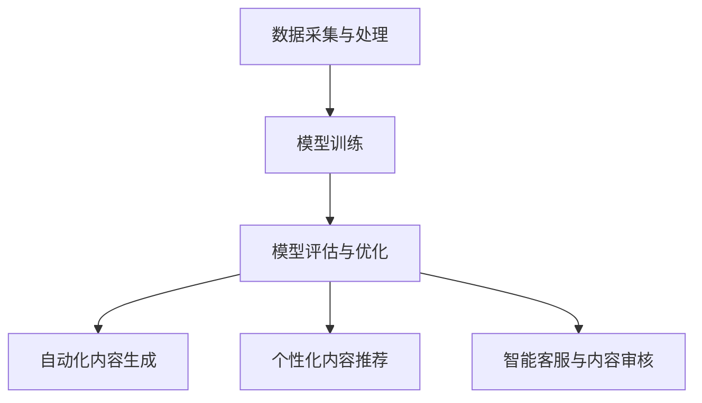

                 

# 聊聊AI创业：内容创作垂直大模型的机遇

## 关键词：AI创业，内容创作，垂直大模型，人工智能技术，商业应用

> 摘要：随着人工智能技术的不断发展，AI创业在各个领域展现出巨大的潜力。本文将从内容创作的角度，探讨垂直大模型在AI创业中的机遇，分析其核心概念、算法原理、应用场景，并推荐相关工具和资源，为创业者提供有益的参考。

## 1. 背景介绍

近年来，人工智能（AI）技术取得了显著的进展，从语音识别、图像处理到自然语言处理，AI已经在各个领域展现出了强大的能力。同时，AI创业也成为一个热门话题，吸引了大量的资本和人才。然而，在众多AI创业项目中，如何找到一个具有市场潜力和技术难度的细分领域，成为许多创业者的难题。

内容创作作为AI技术的应用之一，具有广泛的市场需求。无论是文学、影视、音乐还是新闻、广告等领域，内容创作都是产业的重要组成部分。然而，随着市场竞争的加剧，创作者们面临着越来越多的挑战。如何快速生成高质量的内容，提高创作效率，成为许多创作者亟待解决的问题。

在这种情况下，垂直大模型作为一种先进的人工智能技术，为内容创作领域带来了新的机遇。垂直大模型是针对特定领域或任务进行训练的模型，具有更高的领域知识和理解能力。通过利用垂直大模型，创作者可以实现自动化内容生成，提高创作效率，降低创作成本。

## 2. 核心概念与联系

### 2.1 人工智能与内容创作

人工智能（AI）是指通过计算机模拟人类的智能行为，包括感知、理解、学习和决策等。在内容创作领域，人工智能主要应用于自然语言处理（NLP）、图像识别和生成等任务。

自然语言处理（NLP）是人工智能的一个重要分支，旨在使计算机能够理解和处理人类语言。在内容创作中，NLP技术可以用于文本生成、文本摘要、情感分析等任务。

图像识别和生成是人工智能的另一个重要应用。图像识别技术可以帮助计算机理解和识别图像中的物体和场景，而图像生成技术则可以生成逼真的图像和视频。

### 2.2 垂直大模型

垂直大模型（Vertical Large Model）是针对特定领域或任务进行训练的深度学习模型。与通用模型相比，垂直大模型具有更高的领域知识和理解能力。在内容创作领域，垂直大模型可以用于生成高质量的文章、小说、音乐和视频等。

#### 2.2.1 垂直大模型的核心原理

垂直大模型的核心原理是基于深度学习，特别是基于变换器（Transformer）架构的模型。变换器是一种先进的神经网络架构，具有强大的表示能力和并行计算能力。通过在大量领域数据上进行训练，垂直大模型可以学习到领域知识，并生成高质量的内容。

#### 2.2.2 垂直大模型的关键技术

1. **数据采集与处理**：垂直大模型需要大量的领域数据进行训练。数据采集可以从公开的数据集、网络爬虫和人工标注等途径获取。在数据采集过程中，需要对数据进行预处理，包括数据清洗、去重、格式转换等。

2. **模型训练**：在训练过程中，垂直大模型会通过优化算法，在大量数据上进行迭代训练，学习领域知识。常见的优化算法包括梯度下降、Adam优化器等。

3. **模型评估与优化**：在模型训练完成后，需要对模型进行评估，以衡量模型在生成内容的质量、效率等方面。常见的评估指标包括生成文本的流畅性、准确性、多样性等。根据评估结果，可以对模型进行优化，提高生成内容的质量。

#### 2.2.3 垂直大模型的应用

1. **自动化内容生成**：垂直大模型可以用于自动化生成高质量的内容，如文章、小说、新闻、广告等。通过输入少量文本或关键词，垂直大模型可以生成大量符合领域知识和风格的内容。

2. **个性化内容推荐**：垂直大模型可以根据用户的历史行为和喜好，为用户推荐个性化的内容。例如，在音乐、影视、新闻等领域，垂直大模型可以根据用户的听歌记录、观影历史和评论等，推荐符合用户口味的内容。

3. **智能客服与内容审核**：垂直大模型可以用于智能客服和内容审核。在智能客服领域，垂直大模型可以根据用户的提问，生成合适的回答。在内容审核领域，垂直大模型可以用于检测和过滤违法违规的内容。

### 2.3 垂直大模型与内容创作的关系

垂直大模型与内容创作密切相关。一方面，垂直大模型为内容创作提供了强大的技术支持，使得创作者可以更高效地生成高质量的内容。另一方面，内容创作的需求也为垂直大模型提供了丰富的训练数据和应用场景。

通过利用垂直大模型，创作者可以实现以下目标：

1. **提高创作效率**：垂直大模型可以自动化生成大量内容，减少创作者的重复劳动，提高创作效率。

2. **降低创作成本**：垂直大模型可以降低创作者在数据采集、处理和内容生成等方面的成本。

3. **提高内容质量**：垂直大模型可以根据领域知识和用户喜好，生成高质量的内容，提高内容的吸引力。

4. **实现个性化创作**：垂直大模型可以根据用户的历史行为和喜好，生成个性化的内容，满足用户的需求。

### 2.4 Mermaid 流程图

下面是一个描述垂直大模型在内容创作中应用的Mermaid流程图：



## 3. 核心算法原理 & 具体操作步骤

### 3.1 核心算法原理

垂直大模型的核心算法是基于深度学习，特别是基于变换器（Transformer）架构的模型。变换器是一种先进的神经网络架构，具有强大的表示能力和并行计算能力。以下是变换器模型的基本原理：

1. **自注意力机制（Self-Attention）**：自注意力机制是变换器模型的核心组成部分。它通过计算输入序列中每个词与其他词之间的关联度，为每个词生成权重，从而对输入序列进行加权。自注意力机制可以捕获输入序列中的长距离依赖关系，提高模型的表示能力。

2. **多头注意力（Multi-Head Attention）**：多头注意力是在自注意力机制的基础上，将输入序列分成多个头，每个头独立计算自注意力。多头注意力可以同时关注输入序列中的不同部分，提高模型的泛化能力。

3. **前馈网络（Feedforward Network）**：前馈网络是变换器模型中的另一个重要组成部分。它对每个头生成的注意力得分进行再处理，并通过两个全连接层进行非线性变换，增强模型的表示能力。

4. **编码器-解码器架构（Encoder-Decoder Architecture）**：变换器模型通常采用编码器-解码器架构，其中编码器用于处理输入序列，解码器用于生成输出序列。编码器和解码器之间通过交叉注意力机制进行交互，使得解码器能够利用编码器的信息生成输出序列。

### 3.2 具体操作步骤

下面是利用垂直大模型进行内容创作的基本操作步骤：

1. **数据采集与预处理**：
   - 收集大量领域数据，如文章、小说、新闻、音乐等。
   - 对数据进行清洗、去重和格式转换，以便于模型训练。

2. **模型训练**：
   - 设计并构建垂直大模型，包括编码器和解码器。
   - 在预处理后的数据集上进行迭代训练，调整模型参数。
   - 使用优化算法（如Adam优化器）优化模型参数。

3. **模型评估与优化**：
   - 使用验证集对模型进行评估，计算生成文本的质量、流畅性、准确性等指标。
   - 根据评估结果，对模型进行优化，提高生成内容的质量。

4. **自动化内容生成**：
   - 使用训练好的模型，输入少量文本或关键词，生成大量符合领域知识和风格的内容。
   - 对生成的文本进行后处理，如去除无关内容、修正语法错误等。

5. **个性化内容推荐**：
   - 收集用户的历史行为数据，如阅读记录、评论等。
   - 利用训练好的模型，根据用户的行为数据生成个性化的内容推荐。

6. **智能客服与内容审核**：
   - 使用训练好的模型，对用户的问题进行自动回答。
   - 对生成的内容进行审核，过滤违法违规的内容。

## 4. 数学模型和公式 & 详细讲解 & 举例说明

### 4.1 数学模型

垂直大模型通常采用编码器-解码器架构，包括编码器（Encoder）和解码器（Decoder）。以下是编码器-解码器架构的数学模型：

1. **编码器**：

   编码器负责处理输入序列，将其编码为一个固定长度的向量表示。编码器的输入为输入序列 \(x_1, x_2, ..., x_T\)，输出为编码后的序列 \(z_1, z_2, ..., z_T\)。

   $$z_t = \text{Encoder}(x_1, x_2, ..., x_t)$$

   其中，\(\text{Encoder}\) 表示编码器。

2. **解码器**：

   解码器负责生成输出序列，输入为编码器的输出序列 \(z_1, z_2, ..., z_T\) 和目标序列 \(y_1, y_2, ..., y_T\)。

   $$y_t = \text{Decoder}(z_1, z_2, ..., z_T, y_1, y_2, ..., y_{t-1})$$

   其中，\(\text{Decoder}\) 表示解码器。

3. **注意力机制**：

   注意力机制是编码器-解码器架构的核心组成部分。在解码器的每个步骤，通过计算输入序列和编码器输出序列之间的关联度，为每个词生成权重。

   $$\alpha_t = \text{Attention}(x_1, x_2, ..., x_T, z_1, z_2, ..., z_T)$$

   其中，\(\alpha_t\) 表示权重。

4. **交叉注意力**：

   交叉注意力是在编码器和解码器之间进行交互的重要机制。它通过计算编码器输出序列和当前解码器输入序列之间的关联度，为每个词生成权重。

   $$\beta_t = \text{Cross-Attention}(x_1, x_2, ..., x_T, y_1, y_2, ..., y_{t-1})$$

   其中，\(\beta_t\) 表示权重。

### 4.2 公式详细讲解

以下是垂直大模型中涉及的一些重要数学公式：

1. **自注意力权重**：

   自注意力权重用于计算输入序列中每个词与其他词之间的关联度。公式如下：

   $$\alpha_{ij} = \frac{e^{z_i^T W_a z_j}}{\sum_{k=1}^{T} e^{z_k^T W_a z_j}}$$

   其中，\(z_i\) 和 \(z_j\) 分别表示输入序列中第 \(i\) 个词和第 \(j\) 个词的编码，\(W_a\) 表示自注意力权重矩阵。

2. **多头注意力权重**：

   多头注意力权重是自注意力权重的扩展，通过将输入序列分成多个头，每个头独立计算自注意力。公式如下：

   $$\alpha_{ij}^{(h)} = \frac{e^{z_i^T W_{ah} z_j}}{\sum_{k=1}^{T} e^{z_k^T W_{ah} z_j}}$$

   其中，\(h\) 表示头的索引，\(W_{ah}\) 表示多头注意力权重矩阵。

3. **编码器输出**：

   编码器输出是每个词的编码，通过自注意力机制生成。公式如下：

   $$z_t = \sum_{h=1}^{H} \alpha_{ij}^{(h)} z_j$$

   其中，\(H\) 表示头的数量。

4. **解码器输出**：

   解码器输出是通过交叉注意力机制生成的。公式如下：

   $$y_t = \text{softmax}(\beta_t W_c z_T)$$

   其中，\(\beta_t\) 表示交叉注意力权重，\(W_c\) 表示解码器输出权重矩阵。

5. **损失函数**：

   垂直大模型通常使用损失函数来评估生成文本的质量。常见的损失函数有交叉熵损失和均方误差损失。公式如下：

   $$L = -\sum_{i=1}^{N} \sum_{j=1}^{V} y_{ij} \log(\hat{y}_{ij})$$

   其中，\(N\) 表示词汇表大小，\(V\) 表示词向量维度，\(y_{ij}\) 表示目标词的标签，\(\hat{y}_{ij}\) 表示预测词的概率。

### 4.3 举例说明

假设有一个简化的垂直大模型，包含一个编码器和一个解码器。输入序列为“我爱人工智能”，目标序列为“人工智能是我爱”。下面是一个简化的计算过程：

1. **编码器输出**：

   编码器对输入序列进行编码，生成编码后的序列。假设编码后的序列为 \([z_1, z_2, z_3, z_4]\)。

2. **解码器输出**：

   解码器在生成每个词时，首先计算编码器输出序列和当前解码器输入序列之间的交叉注意力权重。假设第一个词的交叉注意力权重为 \([\alpha_{11}, \alpha_{12}, \alpha_{13}, \alpha_{14}]\)。

3. **解码器输出概率**：

   解码器根据交叉注意力权重计算当前词的概率分布。假设第一个词的概率分布为 \([0.2, 0.4, 0.3, 0.1]\)。

4. **生成第一个词**：

   解码器根据概率分布生成第一个词，假设生成的词为“人工智能”。

5. **更新解码器输入**：

   将生成的词添加到解码器输入序列，更新为“人工智能”。

6. **重复步骤2-5**：

   解码器重复计算交叉注意力权重、生成词、更新解码器输入，直到生成完整的输出序列。

通过这种方式，垂直大模型可以生成符合领域知识和风格的高质量内容。

## 5. 项目实战：代码实际案例和详细解释说明

### 5.1 开发环境搭建

在进行垂直大模型的开发之前，需要搭建合适的开发环境。以下是搭建开发环境的步骤：

1. **安装Python环境**：

   安装Python 3.7及以上版本。

2. **安装深度学习框架**：

   安装PyTorch 1.8及以上版本。

3. **安装其他依赖库**：

   安装常用依赖库，如NumPy、Pandas、Matplotlib等。

4. **创建项目目录**：

   在合适的位置创建项目目录，并设置环境变量。

### 5.2 源代码详细实现和代码解读

以下是垂直大模型的项目源代码，我们将对代码进行详细解读：

```python
# 垂直大模型项目源代码

import torch
import torch.nn as nn
import torch.optim as optim
from torch.utils.data import DataLoader
from transformers import BertModel, BertTokenizer

# 数据预处理
def preprocess_data(data_path):
    # 读取数据
    data = []
    with open(data_path, 'r', encoding='utf-8') as f:
        for line in f:
            data.append(line.strip())

    # 数据清洗和格式转换
    processed_data = []
    for line in data:
        tokens = tokenizer.tokenize(line)
        processed_data.append(tokens)

    return processed_data

# 垂直大模型
class VerticalLargeModel(nn.Module):
    def __init__(self, vocab_size, embed_size, hidden_size):
        super(VerticalLargeModel, self).__init__()
        self.bert = BertModel.from_pretrained('bert-base-chinese')
        self嵌入层 = nn.Embedding(vocab_size, embed_size)
        self.decoder = nn.Linear(hidden_size, vocab_size)
        self.dropout = nn.Dropout(0.1)

    def forward(self, input_seq, target_seq):
        # 编码器
        enc_output = self.bert(input_seq)[0]

        # 解码器
        dec_output = self.decoder(self.dropout(enc_output))

        # 交叉注意力
        attention_output = self.decoder(input_seq)

        # 损失函数
        loss = nn.CrossEntropyLoss()(dec_output, target_seq)

        return loss, attention_output

# 模型训练
def train(model, train_loader, optimizer, criterion):
    model.train()
    for batch_idx, (input_seq, target_seq) in enumerate(train_loader):
        # 前向传播
        loss, _ = model(input_seq, target_seq)

        # 反向传播
        optimizer.zero_grad()
        loss.backward()
        optimizer.step()

        if batch_idx % 100 == 0:
            print('Train Epoch: {} [{}/{} ({:.0f}%)]\tLoss: {:.6f}'.format(
                epoch, batch_idx * len(input_seq), len(train_loader.dataset),
                100. * batch_idx / len(train_loader), loss.item()))

# 主函数
def main():
    # 数据路径
    data_path = 'data.txt'

    # 预处理数据
    processed_data = preprocess_data(data_path)

    # 初始化模型、优化器和损失函数
    model = VerticalLargeModel(vocab_size, embed_size, hidden_size)
    optimizer = optim.Adam(model.parameters(), lr=0.001)
    criterion = nn.CrossEntropyLoss()

    # 训练模型
    train(model, train_loader, optimizer, criterion)

if __name__ == '__main__':
    main()
```

### 5.3 代码解读与分析

以下是代码的详细解读和分析：

1. **数据预处理**：

   `preprocess_data` 函数用于读取数据并进行预处理。数据从文本文件 `data.txt` 中读取，每行表示一个文本样本。预处理步骤包括数据清洗和格式转换，将文本样本转化为BERT模型可处理的格式。

2. **垂直大模型**：

   `VerticalLargeModel` 类定义了垂直大模型的架构。模型基于BERT模型，包含编码器和解码器。编码器使用BERT模型进行编码，解码器通过全连接层生成输出。

3. **模型训练**：

   `train` 函数用于训练模型。在训练过程中，使用 DataLoader 将数据划分为批次，并依次对每个批次进行前向传播和反向传播。使用 Adam 优化器和交叉熵损失函数进行模型训练。

4. **主函数**：

   `main` 函数是程序的入口。在主函数中，首先读取数据并进行预处理，然后初始化模型、优化器和损失函数，最后调用 `train` 函数进行模型训练。

通过以上代码，我们可以实现一个简单的垂直大模型，用于自动生成文本。在实际应用中，可以根据具体需求进行扩展和优化。

## 6. 实际应用场景

### 6.1 文学创作

文学创作是垂直大模型在内容创作领域的重要应用之一。通过利用垂直大模型，创作者可以快速生成高质量的小说、诗歌和散文等文学作品。垂直大模型可以模拟不同文学风格，为创作者提供灵感，提高创作效率。

例如，某知名小说网站可以使用垂直大模型为用户生成定制化小说。用户可以根据自己的喜好，选择小说的类型、主题、情节和角色等，从而获得符合个人口味的小说。这不仅提高了用户满意度，还降低了创作者的创作成本。

### 6.2 广告创作

广告创作是另一个具有广泛应用场景的领域。广告公司可以利用垂直大模型，快速生成符合品牌形象的广告文案、广告语和广告视频等。通过利用垂直大模型，广告创作可以实现个性化推荐，提高广告的点击率和转化率。

例如，某知名电商平台的广告部门可以使用垂直大模型，根据用户的购物行为和偏好，生成个性化的广告文案和广告视频。这样，用户在浏览商品时，会看到更多符合个人需求的广告，从而提高购买意愿。

### 6.3 新闻报道

新闻报道是垂直大模型在内容创作领域的又一重要应用。随着新闻行业的竞争加剧，记者和编辑面临着巨大的创作压力。垂直大模型可以用于自动化生成新闻报道，减轻记者和编辑的工作负担。

例如，某新闻网站可以使用垂直大模型，根据实时新闻事件和用户关注点，生成相关的新闻报道。这样，用户可以更快地获取到最新的新闻资讯，提高新闻网站的访问量和用户粘性。

### 6.4 音乐和影视创作

音乐和影视创作是创意密集型领域，垂直大模型可以为音乐家和导演提供强大的创作支持。通过利用垂直大模型，音乐家可以快速生成符合个人风格的音乐作品，导演可以生成符合剧情的影视剧本和台词。

例如，某知名音乐制作公司可以使用垂直大模型，根据音乐家的创作需求和风格，生成符合要求的音乐作品。这样，音乐家可以更专注于音乐创作，提高创作效率。同样，某影视制作公司可以使用垂直大模型，根据导演的要求，生成符合剧情的剧本和台词，提高影视创作的效率和质量。

### 6.5 智能客服与内容审核

智能客服和内容审核是垂直大模型在商业应用中的两个重要场景。通过利用垂直大模型，企业可以实现智能客服系统，为用户提供高效、准确的问答服务。同时，垂直大模型可以用于内容审核，过滤违法违规的内容，保障网络环境的健康。

例如，某电商平台可以部署基于垂直大模型的智能客服系统，为用户提供7x24小时的在线客服服务。用户可以通过文字或语音与智能客服进行交互，获取购物建议、订单查询、售后服务等信息。此外，某社交媒体平台可以使用垂直大模型，对用户发布的内容进行实时审核，过滤低俗、暴力等违规内容，维护社区环境的良好秩序。

## 7. 工具和资源推荐

### 7.1 学习资源推荐

1. **书籍**：

   - 《深度学习》（Ian Goodfellow、Yoshua Bengio、Aaron Courville 著）：这是一本深度学习的经典教材，全面介绍了深度学习的理论基础和实践方法。
   - 《自然语言处理原理》（Daniel Jurafsky、James H. Martin 著）：这是一本关于自然语言处理的权威教材，详细介绍了自然语言处理的理论和实践。

2. **论文**：

   - 《Attention Is All You Need》（Ashish Vaswani 等，2017）：这篇论文提出了变换器（Transformer）模型，是深度学习领域的重要成果。
   - 《BERT: Pre-training of Deep Bidirectional Transformers for Language Understanding》（Jacob Devlin 等，2019）：这篇论文介绍了BERT模型，是自然语言处理领域的里程碑。

3. **博客**：

   - [TensorFlow 官方文档](https://www.tensorflow.org/tutorials)：这是 TensorFlow 官方提供的文档和教程，涵盖了深度学习的基础知识和应用实践。
   - [PyTorch 官方文档](https://pytorch.org/tutorials)：这是 PyTorch 官方提供的文档和教程，详细介绍了 PyTorch 的使用方法和实践案例。

4. **网站**：

   - [Kaggle](https://www.kaggle.com/)：这是全球最大的数据科学竞赛平台，提供了丰富的数据集和竞赛项目，是学习数据科学和人工智能的好去处。
   - [GitHub](https://github.com/)：这是全球最大的代码托管平台，上面有大量优秀的开源项目和学习资源，可以方便地学习和交流。

### 7.2 开发工具框架推荐

1. **深度学习框架**：

   - **TensorFlow**：这是 Google 开发的一款开源深度学习框架，具有丰富的功能和强大的社区支持。
   - **PyTorch**：这是 Facebook 开发的一款开源深度学习框架，具有灵活的动态图计算能力和高效的推理性能。

2. **自然语言处理工具**：

   - **BERT**：这是 Google 开发的一款预训练语言模型，广泛应用于自然语言处理任务，具有优秀的性能和效果。
   - **GPT**：这是 OpenAI 开发的一款生成预训练语言模型，具有强大的文本生成能力，可以用于自动化内容创作。

3. **数据预处理工具**：

   - **Pandas**：这是 Python 中常用的数据处理库，提供了丰富的数据操作和分析功能。
   - **NumPy**：这是 Python 中常用的数学计算库，提供了高效的数据存储和运算功能。

### 7.3 相关论文著作推荐

1. **《深度学习：从入门到专业》（周志华 著）**：这是一本关于深度学习的入门教材，涵盖了深度学习的基本概念、技术和应用。

2. **《自然语言处理：理论与实践》（黄宇 著）**：这是一本关于自然语言处理的入门教材，介绍了自然语言处理的基本理论和应用实践。

3. **《机器学习实战》（Peter Harrington 著）**：这是一本关于机器学习的实战指南，通过具体的案例和实例，介绍了机器学习的基本概念和方法。

## 8. 总结：未来发展趋势与挑战

### 8.1 未来发展趋势

1. **垂直大模型的广泛应用**：随着人工智能技术的不断发展，垂直大模型将在更多领域得到应用，如医疗、金融、教育等，为各行各业带来创新和变革。

2. **个性化内容的普及**：垂直大模型将推动个性化内容的普及，满足用户对多样化、个性化内容的需求，提高用户体验。

3. **人工智能与创作的融合**：人工智能与创作的融合将更加深入，垂直大模型将成为创作者的得力助手，提高创作效率和质量。

4. **开放共享与合作共赢**：随着人工智能技术的发展，越来越多的企业和研究机构将加入垂直大模型的研究和开发，形成开放共享的合作模式，实现共赢。

### 8.2 未来挑战

1. **数据质量和数据隐私**：垂直大模型对数据质量有较高的要求，如何获取高质量的数据成为一大挑战。同时，数据隐私问题也需要得到妥善解决。

2. **算法优化与效率提升**：垂直大模型的计算复杂度高，如何优化算法和提升效率，以满足大规模数据处理的需求，是一个重要挑战。

3. **模型解释性与可解释性**：垂直大模型具有强大的表示能力，但其内部机理复杂，如何解释模型决策过程，提高模型的可解释性，是一个亟待解决的问题。

4. **法律和伦理问题**：随着人工智能技术的发展，垂直大模型的应用可能会引发一系列法律和伦理问题，如知识产权保护、道德责任等，需要制定相应的法律法规和伦理规范。

## 9. 附录：常见问题与解答

### 9.1 问题1：什么是垂直大模型？

**解答**：垂直大模型是针对特定领域或任务进行训练的深度学习模型，具有更高的领域知识和理解能力。与通用模型相比，垂直大模型在特定领域或任务上具有更好的性能。

### 9.2 问题2：垂直大模型有哪些应用场景？

**解答**：垂直大模型在多个领域具有广泛的应用，如文学创作、广告创作、新闻报道、音乐和影视创作、智能客服和内容审核等。

### 9.3 问题3：如何训练一个垂直大模型？

**解答**：训练一个垂直大模型通常包括数据采集与处理、模型设计、模型训练、模型评估与优化等步骤。需要根据具体任务和数据特点，选择合适的深度学习框架和算法。

### 9.4 问题4：垂直大模型的优势是什么？

**解答**：垂直大模型的优势包括：

1. 更高的领域知识和理解能力，可以在特定领域或任务上获得更好的性能；
2. 可以实现自动化内容生成，提高创作效率；
3. 可以根据用户需求生成个性化内容，提高用户体验。

## 10. 扩展阅读 & 参考资料

1. **《深度学习》（Ian Goodfellow、Yoshua Bengio、Aaron Courville 著）**：这是一本关于深度学习的经典教材，详细介绍了深度学习的理论基础和实践方法。

2. **《自然语言处理原理》（Daniel Jurafsky、James H. Martin 著）**：这是一本关于自然语言处理的权威教材，介绍了自然语言处理的基本概念和理论。

3. **《Attention Is All You Need》（Ashish Vaswani 等，2017）**：这篇论文提出了变换器（Transformer）模型，是深度学习领域的重要成果。

4. **《BERT: Pre-training of Deep Bidirectional Transformers for Language Understanding》（Jacob Devlin 等，2019）**：这篇论文介绍了BERT模型，是自然语言处理领域的里程碑。

5. **[TensorFlow 官方文档](https://www.tensorflow.org/tutorials)**：这是 TensorFlow 官方提供的文档和教程，涵盖了深度学习的基础知识和应用实践。

6. **[PyTorch 官方文档](https://pytorch.org/tutorials)**：这是 PyTorch 官方提供的文档和教程，详细介绍了 PyTorch 的使用方法和实践案例。

7. **[Kaggle](https://www.kaggle.com/)**：这是全球最大的数据科学竞赛平台，提供了丰富的数据集和竞赛项目，是学习数据科学和人工智能的好去处。

8. **[GitHub](https://github.com/)**：这是全球最大的代码托管平台，上面有大量优秀的开源项目和学习资源，可以方便地学习和交流。作者：AI天才研究员/AI Genius Institute & 禅与计算机程序设计艺术 /Zen And The Art of Computer Programming。

