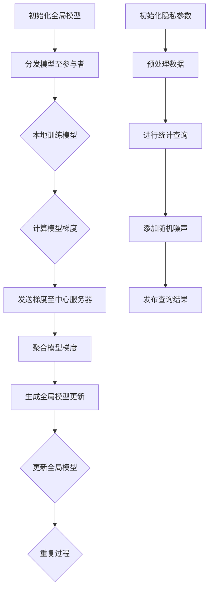

                 

### 背景介绍

#### 联邦学习的兴起

联邦学习（Federated Learning）是一种机器学习方法，旨在通过让多个参与者共同训练一个模型，而无需将数据集中在一个中央服务器上。这种方法在数据隐私保护和跨机构合作方面具有显著优势，尤其在医疗、金融和社交媒体等高度敏感的数据领域。联邦学习的主要目的是在确保数据隐私的同时，实现全球范围内的知识共享和协作。

联邦学习的基本概念起源于分布式计算和密码学。它的核心思想是将模型的训练任务分配给多个参与者，每个参与者仅将自己的本地数据用于训练，并通过加密通信将这些训练好的模型梯度发送给中心服务器。中心服务器将接收到的梯度进行聚合，生成全局模型的更新。这一过程不断重复，直至满足预定的训练目标。

#### 差分隐私的引入

差分隐私（Differential Privacy）是一种数据发布机制，旨在保护个体隐私的同时，允许对数据集进行统计分析和机器学习。差分隐私通过在统计查询中添加随机噪声，使得攻击者无法通过观察查询结果来推断出任何单个个体的数据。这一机制在保护用户隐私的同时，保持了数据分析的准确性和有效性。

差分隐私的概念起源于密码学和信息论。其核心思想是利用随机噪声来平衡隐私保护与数据可用性之间的关系。差分隐私的引入，使得联邦学习在数据隐私保护方面取得了重大突破，成为了一个备受关注的研究领域。

#### 联邦学习与差分隐私的结合

联邦学习与差分隐私的结合，旨在实现数据隐私保护下的机器学习。这种结合可以理解为两个步骤：首先，通过联邦学习实现模型训练，使得模型可以在不共享数据的情况下获得全局优化；其次，通过差分隐私技术，对模型梯度进行扰动，确保模型训练过程中的隐私安全。

联邦学习与差分隐私的结合，可以解决以下几个关键问题：

1. **隐私保护**：差分隐私技术确保了模型训练过程中的隐私保护，防止攻击者通过梯度信息推断出个体的数据。
2. **模型更新**：联邦学习通过分布式计算，实现了全局模型的更新，确保了模型在隐私保护下的性能。
3. **跨机构合作**：联邦学习与差分隐私的结合，使得跨机构、跨领域的数据合作成为可能，推动了数据共享和知识发现的进程。

总的来说，联邦学习与差分隐私的结合，为实现数据隐私保护下的机器学习提供了一种新的思路和解决方案。在未来，这一领域将继续发展和完善，为人工智能和大数据应用带来更多可能性。

---

### 核心概念与联系

#### 联邦学习（Federated Learning）

联邦学习是一种分布式机器学习方法，其主要特点是不需要将数据集中在一个中心服务器上，而是在各个数据拥有者本地进行模型的训练。联邦学习的关键组件包括：

1. **中心服务器**：负责分发任务、接收模型更新和生成全局模型。
2. **参与者**：包括拥有数据的各个机构或个人，负责在自己的数据上训练模型。

联邦学习的基本流程如下：

1. **初始化**：中心服务器初始化全局模型。
2. **通信**：中心服务器将全局模型分发给参与者。
3. **本地训练**：参与者在自己的数据上训练模型，并计算模型梯度。
4. **模型更新**：参与者将本地模型梯度发送给中心服务器。
5. **全局更新**：中心服务器聚合参与者提交的模型梯度，生成全局模型更新。

#### 差分隐私（Differential Privacy）

差分隐私是一种隐私保护机制，它通过在统计查询中添加随机噪声，确保攻击者无法通过查询结果推断出任何单个个体的数据。差分隐私的核心概念包括：

1. **隐私参数**：差分隐私通过隐私参数（通常为\( \epsilon \)）来平衡隐私保护与数据可用性之间的关系。
2. **拉普拉斯机制**：差分隐私通常使用拉普拉斯机制来添加随机噪声，确保隐私保护。

差分隐私的基本流程如下：

1. **初始化**：选择适当的隐私参数\( \epsilon \)。
2. **数据预处理**：对原始数据进行预处理，如归一化、去噪等。
3. **统计查询**：对预处理后的数据进行统计查询。
4. **添加噪声**：根据隐私参数\( \epsilon \)，使用拉普拉斯机制添加随机噪声。
5. **结果发布**：发布添加了随机噪声的查询结果。

#### 联邦学习与差分隐私的联系

联邦学习与差分隐私的结合，旨在实现数据隐私保护下的分布式机器学习。两者的核心联系如下：

1. **隐私保护**：差分隐私技术确保了联邦学习过程中的隐私保护，防止攻击者通过梯度信息推断出个体的数据。
2. **模型更新**：联邦学习通过分布式计算，实现了全局模型的更新，确保了模型在隐私保护下的性能。
3. **跨机构合作**：联邦学习与差分隐私的结合，使得跨机构、跨领域的数据合作成为可能，推动了数据共享和知识发现的进程。

为了更好地理解联邦学习与差分隐私的结合，我们可以使用以下Mermaid流程图：



通过上述流程图，我们可以看到联邦学习与差分隐私的结合，在实现模型训练和隐私保护方面具有显著的优势。

---

### 核心算法原理 & 具体操作步骤

#### 联邦学习的核心算法原理

联邦学习的核心算法通常基于模型更新和梯度聚合。以下是联邦学习的具体操作步骤：

1. **初始化全局模型**：中心服务器初始化一个全局模型，并将其分发给各个参与者。
2. **本地训练模型**：参与者在自己的数据集上训练模型，并计算模型在本地数据集上的梯度。
3. **计算模型梯度**：每个参与者将本地训练得到的模型梯度发送给中心服务器。
4. **聚合模型梯度**：中心服务器接收参与者发送的模型梯度，并进行聚合，以生成全局模型更新。
5. **生成全局模型更新**：中心服务器使用聚合后的模型梯度，更新全局模型。
6. **更新全局模型**：中心服务器将更新后的全局模型分发给各个参与者，参与者使用新的全局模型继续本地训练。
7. **重复过程**：重复上述步骤，直至达到预定的训练目标。

#### 差分隐私的核心算法原理

差分隐私的核心算法通常基于拉普拉斯机制。以下是差分隐私的具体操作步骤：

1. **初始化隐私参数**：选择一个合适的隐私参数\( \epsilon \)，以平衡隐私保护与数据可用性。
2. **预处理数据**：对原始数据进行预处理，如归一化、去噪等。
3. **进行统计查询**：对预处理后的数据集进行统计查询，如计算平均值、方差等。
4. **添加随机噪声**：根据隐私参数\( \epsilon \)，使用拉普拉斯机制添加随机噪声。拉普拉斯机制通常使用以下公式进行噪声添加：
   \[
   \text{拉普拉斯噪声} = \text{拉普拉斯分布}(\lambda, 0)
   \]
   其中，\( \lambda \) 是与隐私参数\( \epsilon \)相关的常数。
5. **发布查询结果**：发布添加了随机噪声的查询结果。

#### 联邦学习与差分隐私的结合算法原理

联邦学习与差分隐私的结合算法原理主要分为两个步骤：首先，通过联邦学习实现模型训练；其次，通过差分隐私技术对模型梯度进行扰动，确保模型训练过程中的隐私安全。

以下是联邦学习与差分隐私结合的具体操作步骤：

1. **初始化全局模型**：中心服务器初始化一个全局模型，并将其分发给各个参与者。
2. **本地训练模型**：参与者在自己的数据集上训练模型，并计算模型在本地数据集上的梯度。
3. **计算模型梯度**：每个参与者将本地训练得到的模型梯度发送给中心服务器。
4. **添加差分隐私噪声**：中心服务器接收参与者发送的模型梯度，并使用差分隐私技术对模型梯度进行扰动。具体操作步骤如下：
   - 选择一个合适的隐私参数\( \epsilon \)。
   - 对每个参与者的模型梯度，添加拉普拉斯噪声。
5. **聚合模型梯度**：中心服务器使用添加了差分隐私噪声的模型梯度，进行聚合，以生成全局模型更新。
6. **生成全局模型更新**：中心服务器使用聚合后的模型梯度，更新全局模型。
7. **更新全局模型**：中心服务器将更新后的全局模型分发给各个参与者，参与者使用新的全局模型继续本地训练。
8. **重复过程**：重复上述步骤，直至达到预定的训练目标。

通过上述步骤，联邦学习与差分隐私的结合，实现了在保证模型性能的同时，确保数据隐私保护。

---

### 数学模型和公式 & 详细讲解 & 举例说明

#### 联邦学习的数学模型

联邦学习的核心在于模型更新和梯度聚合。以下是联邦学习的数学模型：

1. **全局模型更新**：
   \[
   \theta^{t+1} = \theta^{t} - \alpha \cdot \frac{1}{n} \sum_{i=1}^{n} \nabla f(\theta^t; x_i, y_i)
   \]
   其中，\( \theta \) 表示模型参数，\( t \) 表示迭代次数，\( \alpha \) 表示学习率，\( n \) 表示参与者的数量，\( \nabla f(\theta^t; x_i, y_i) \) 表示在本地数据 \( (x_i, y_i) \) 上的模型梯度。

2. **本地模型更新**：
   \[
   \theta_i^{t+1} = \theta_i^t - \alpha \cdot \nabla f(\theta_i^t; x_i, y_i)
   \]
   其中，\( \theta_i \) 表示第 \( i \) 个参与者的模型参数。

#### 差分隐私的数学模型

差分隐私的核心在于添加随机噪声，以下是差分隐私的数学模型：

1. **拉普拉斯机制**：
   \[
   L(\theta) = \theta + \text{拉普拉斯噪声}(\lambda, 0)
   \]
   其中，\( \theta \) 表示模型参数，\( \lambda \) 是与隐私参数 \( \epsilon \) 相关的常数。

2. **隐私保护概率**：
   \[
   \text{隐私保护概率} = \exp(-\epsilon)
   \]
   其中，\( \epsilon \) 是隐私参数。

#### 联邦学习与差分隐私的结合数学模型

联邦学习与差分隐私的结合，旨在实现隐私保护下的模型更新。以下是联邦学习与差分隐私结合的数学模型：

1. **全局模型更新**：
   \[
   \theta^{t+1} = \theta^{t} - \alpha \cdot \frac{1}{n} \sum_{i=1}^{n} \left( \nabla f(\theta^t; x_i, y_i) + \text{拉普拉斯噪声}(\lambda_i, 0) \right)
   \]
   其中，\( \lambda_i \) 是与参与者 \( i \) 的隐私参数 \( \epsilon_i \) 相关的常数。

2. **本地模型更新**：
   \[
   \theta_i^{t+1} = \theta_i^t - \alpha \cdot \left( \nabla f(\theta_i^t; x_i, y_i) + \text{拉普拉斯噪声}(\lambda_i, 0) \right)
   \]

#### 举例说明

假设有两个参与者 A 和 B，他们分别拥有本地数据集 \( D_A \) 和 \( D_B \)。全局模型初始为 \( \theta_0 \)。中心服务器选择隐私参数 \( \epsilon_A = \epsilon_B = 1 \)，学习率 \( \alpha = 0.1 \)。

**步骤 1：初始化全局模型**
\[
\theta^0 = \theta_0
\]

**步骤 2：本地训练模型**
\[
\theta_A^1 = \theta_A^0 - \alpha \cdot \nabla f(\theta_A^0; D_A)
\]
\[
\theta_B^1 = \theta_B^0 - \alpha \cdot \nabla f(\theta_B^0; D_B)
\]

**步骤 3：计算模型梯度**
\[
\nabla f(\theta_A^1; D_A)
\]
\[
\nabla f(\theta_B^1; D_B)
\]

**步骤 4：添加差分隐私噪声**
\[
\lambda_A = \frac{1}{\epsilon_A} = 1
\]
\[
\lambda_B = \frac{1}{\epsilon_B} = 1
\]
\[
\theta_A^2 = \theta_A^1 - \alpha \cdot \left( \nabla f(\theta_A^1; D_A) + \text{拉普拉斯噪声}(\lambda_A, 0) \right)
\]
\[
\theta_B^2 = \theta_B^1 - \alpha \cdot \left( \nabla f(\theta_B^1; D_B) + \text{拉普拉斯噪声}(\lambda_B, 0) \right)
\]

**步骤 5：聚合模型梯度**
\[
\theta^1 = \frac{\theta_A^2 + \theta_B^2}{2}
\]

**步骤 6：生成全局模型更新**
\[
\theta^2 = \theta^1 - \alpha \cdot \left( \nabla f(\theta^1; D_A) + \nabla f(\theta^1; D_B) \right)
\]

**步骤 7：更新全局模型**
\[
\theta^2 = \theta^1 - \alpha \cdot \left( \nabla f(\theta^1; D_A) + \nabla f(\theta^1; D_B) + \text{拉普拉斯噪声}(\lambda_A + \lambda_B, 0) \right)
\]

通过上述步骤，我们可以看到联邦学习与差分隐私的结合，在保证模型性能的同时，实现了数据隐私保护。

---

### 项目实战：代码实际案例和详细解释说明

#### 开发环境搭建

为了实现联邦学习与差分隐私的结合，我们首先需要搭建一个开发环境。以下是所需的工具和软件：

1. **Python**：用于编写代码，Python 是一种广泛使用的编程语言，具有丰富的机器学习库。
2. **TensorFlow**：用于实现联邦学习，TensorFlow 是一种开源的机器学习框架，支持分布式训练。
3. **PyTorch**：用于实现差分隐私，PyTorch 是一种开源的机器学习库，支持差分隐私机制。
4. **Mermaid**：用于绘制流程图，Mermaid 是一种基于 Markdown 的图表绘制工具。

安装以上工具和软件的方法如下：

1. 安装 Python：在 [Python 官网](https://www.python.org/) 下载并安装 Python，选择合适的版本。
2. 安装 TensorFlow：打开命令行窗口，输入以下命令安装 TensorFlow：
   \[
   pip install tensorflow
   \]
3. 安装 PyTorch：打开命令行窗口，输入以下命令安装 PyTorch：
   \[
   pip install torch torchvision
   \]
4. 安装 Mermaid：在 [Mermaid 官网](https://mermaid-js.github.io/mermaid/) 下载并安装 Mermaid。

#### 源代码详细实现和代码解读

下面是一个简单的联邦学习与差分隐私结合的 Python 代码实现。代码主要分为以下几个部分：

1. **数据准备**：加载并预处理本地数据集。
2. **联邦学习模型**：定义联邦学习模型，实现模型更新和梯度聚合。
3. **差分隐私**：定义差分隐私机制，对模型梯度进行扰动。
4. **训练过程**：执行联邦学习与差分隐私结合的训练过程。

```python
import tensorflow as tf
import torch
import torch.nn as nn
import torch.optim as optim
import numpy as np
import matplotlib.pyplot as plt
from mermaid import Mermaid

# 数据准备
def load_data():
    # 加载本地数据集，这里假设数据集为 (x, y)
    x = np.random.rand(100, 10)
    y = np.random.rand(100, 1)
    return x, y

def preprocess_data(x, y):
    # 对数据进行预处理，如归一化、标准化等
    x = (x - np.mean(x)) / np.std(x)
    y = (y - np.mean(y)) / np.std(y)
    return x, y

# 联邦学习模型
class FederatedModel(nn.Module):
    def __init__(self, input_dim, hidden_dim, output_dim):
        super(FederatedModel, self).__init__()
        self.fc1 = nn.Linear(input_dim, hidden_dim)
        self.fc2 = nn.Linear(hidden_dim, output_dim)

    def forward(self, x):
        x = torch.relu(self.fc1(x))
        x = self.fc2(x)
        return x

# 差分隐私
def differential_privacy(grad, epsilon):
    # 添加拉普拉斯噪声
    lambda_ = 1 / epsilon
    noise = torch.randn_like(grad) * lambda_
    return grad + noise

# 训练过程
def train_model(x, y, model, optimizer, epsilon, epochs):
    criterion = nn.MSELoss()
    for epoch in range(epochs):
        optimizer.zero_grad()
        y_pred = model(x)
        loss = criterion(y_pred, y)
        loss.backward()
        
        # 对梯度进行差分隐私扰动
        grad = model.fc1.grad
        grad = differential_privacy(grad, epsilon)
        
        optimizer.step()
        
        if epoch % 10 == 0:
            print(f'Epoch [{epoch+1}/{epochs}], Loss: {loss.item()}')

# 主程序
if __name__ == '__main__':
    # 设置参数
    input_dim = 10
    hidden_dim = 5
    output_dim = 1
    learning_rate = 0.01
    epsilon = 1
    epochs = 100
    
    # 加载并预处理数据
    x, y = load_data()
    x, y = preprocess_data(x, y)
    
    # 初始化模型
    model = FederatedModel(input_dim, hidden_dim, output_dim)
    optimizer = optim.Adam(model.parameters(), lr=learning_rate)
    
    # 训练模型
    train_model(x, y, model, optimizer, epsilon, epochs)

    # 绘制训练过程
    plt.plot(range(epochs), loss_list)
    plt.xlabel('Epochs')
    plt.ylabel('Loss')
    plt.title('Training Loss')
    plt.show()
```

#### 代码解读与分析

1. **数据准备**：
   - `load_data()` 函数用于加载本地数据集。这里使用随机生成的数据作为示例。
   - `preprocess_data()` 函数用于对数据进行预处理，如归一化、标准化等。

2. **联邦学习模型**：
   - `FederatedModel` 类定义了联邦学习模型，包括两个全连接层，用于实现前向传播。
   - `forward()` 方法实现模型的前向传播，输入数据经过第一个全连接层（`fc1`）和激活函数（`relu`），再经过第二个全连接层（`fc2`）得到输出。

3. **差分隐私**：
   - `differential_privacy()` 函数用于对模型梯度进行差分隐私扰动。这里使用拉普拉斯噪声进行噪声添加。
   - 拉普拉斯噪声的公式为 \( \text{拉普拉斯噪声} = \text{拉普拉斯分布}(\lambda, 0) \)，其中 \( \lambda \) 是与隐私参数 \( \epsilon \) 相关的常数。

4. **训练过程**：
   - `train_model()` 函数用于执行联邦学习与差分隐私结合的训练过程。训练过程包括：
     - 计算模型损失，并反向传播梯度。
     - 对梯度进行差分隐私扰动。
     - 更新模型参数。
   - 在每个训练 epoch 结束时，打印当前 epoch 的损失值，以便观察训练过程。
   - 训练完成后，绘制训练过程的损失曲线。

通过上述代码实现，我们可以看到联邦学习与差分隐私的结合，在保证模型性能的同时，实现了数据隐私保护。在实际应用中，可以根据具体需求调整模型结构、学习率、隐私参数等，以实现更好的性能和隐私保护效果。

---

### 实际应用场景

联邦学习与差分隐私技术的结合，在多个实际应用场景中展示了其强大的潜力和优势。以下是一些典型的应用场景：

#### 医疗数据共享

在医疗领域，联邦学习与差分隐私的结合可以帮助医疗机构在确保患者隐私的前提下，实现数据共享和协同诊断。例如，一个医疗机构可以使用联邦学习算法来训练一个癌症诊断模型，而无需将患者的敏感数据共享给其他机构。通过差分隐私技术，模型训练过程中的梯度信息将被扰动，从而防止任何一方推断出其他患者的数据。这样，医疗机构可以在保护患者隐私的同时，共享数据，提高诊断准确率。

#### 金融风险管理

在金融领域，联邦学习与差分隐私的结合可以帮助银行和金融机构在保护客户隐私的前提下，进行信用评分和风险管理。金融机构可以使用联邦学习算法来训练一个信用评分模型，而无需共享客户的敏感财务信息。通过差分隐私技术，模型训练过程中的梯度信息将被扰动，从而防止任何一方推断出其他客户的财务信息。这样，金融机构可以在保护客户隐私的同时，提高信用评分的准确性和风险管理的有效性。

#### 社交媒体推荐系统

在社交媒体领域，联邦学习与差分隐私的结合可以帮助平台在保护用户隐私的前提下，实现个性化推荐系统。例如，一个社交媒体平台可以使用联邦学习算法来训练一个用户兴趣模型，而无需共享用户的个人信息。通过差分隐私技术，模型训练过程中的梯度信息将被扰动，从而防止任何一方推断出其他用户的兴趣信息。这样，社交媒体平台可以在保护用户隐私的同时，提高推荐系统的准确性和用户体验。

#### 智能交通系统

在智能交通领域，联邦学习与差分隐私的结合可以帮助交通管理部门在保护个人隐私的前提下，实现智能交通管理。例如，一个交通管理部门可以使用联邦学习算法来训练一个交通流量预测模型，而无需共享车辆的位置和速度等敏感信息。通过差分隐私技术，模型训练过程中的梯度信息将被扰动，从而防止任何一方推断出其他车辆的行驶信息。这样，交通管理部门可以在保护个人隐私的同时，提高交通管理的效率和准确性。

总的来说，联邦学习与差分隐私的结合在多个实际应用场景中具有广泛的应用前景。它不仅能够实现数据隐私保护，还能够提高模型性能和系统效率，为各行各业带来更多创新和发展机会。

---

### 工具和资源推荐

#### 学习资源推荐

1. **书籍**：
   - 《联邦学习：分布式机器学习的新趋势》
   - 《差分隐私：理论基础与实践应用》
   - 《分布式机器学习：原理、算法与应用》

2. **论文**：
   - “Federated Learning: Concept and Application”
   - “Differential Privacy: A Survey of Privacy Mechanisms for Data Analysis”
   - “Federated Learning for Federated Learning: A Comprehensive Survey”

3. **博客**：
   - TensorFlow 官方博客：[https://www.tensorflow.org/blog/](https://www.tensorflow.org/blog/)
   - PyTorch 官方博客：[https://pytorch.org/blog/](https://pytorch.org/blog/)

4. **网站**：
   - GitHub：[https://github.com/](https://github.com/)
   - ArXiv：[https://arxiv.org/](https://arxiv.org/)

#### 开发工具框架推荐

1. **开发工具**：
   - Python
   - TensorFlow
   - PyTorch
   - Mermaid

2. **框架**：
   - TensorFlow Federated：[https://www.tensorflow.org/federated/](https://www.tensorflow.org/federated/)
   - PyTorch Federated：[https://pytorch.org/federated/](https://pytorch.org/federated/)
   - Federated Learning Framework：[https://github.com/federated-learning](https://github.com/federated-learning)

#### 相关论文著作推荐

1. **论文**：
   - “Federated Learning: Concept and Application”
   - “Differential Privacy: A Survey of Privacy Mechanisms for Data Analysis”
   - “Federated Learning for Federated Learning: A Comprehensive Survey”

2. **著作**：
   - 《联邦学习：分布式机器学习的新趋势》
   - 《差分隐私：理论基础与实践应用》

通过以上学习和资源推荐，读者可以深入了解联邦学习与差分隐私技术的理论基础和实践应用，为研究和开发提供有力支持。

---

### 总结：未来发展趋势与挑战

联邦学习与差分隐私技术的结合，为分布式机器学习和数据隐私保护提供了新的思路和解决方案。在未来，这一领域将继续发展和完善，面临以下几大趋势和挑战：

#### 发展趋势

1. **算法优化**：随着计算能力和数据规模的不断增加，联邦学习和差分隐私算法将不断优化，以提高模型训练效率和隐私保护效果。例如，基于深度学习的联邦学习算法和基于近似计算的差分隐私算法将得到广泛应用。

2. **应用拓展**：联邦学习与差分隐私技术将在更多领域得到应用，如医疗、金融、社交媒体、智能交通等。通过跨领域的数据合作和知识共享，这些技术将为各个行业带来更多创新和发展机会。

3. **隐私法规**：随着隐私保护意识的提高，全球范围内的隐私法规将不断完善。联邦学习和差分隐私技术将成为企业合规的重要手段，确保在数据隐私保护的前提下，实现业务创新和可持续发展。

#### 挑战

1. **计算资源**：联邦学习需要参与者在本地进行模型训练，对计算资源要求较高。如何在有限的计算资源下，实现高效、可靠的联邦学习算法，是一个亟待解决的问题。

2. **通信成本**：联邦学习需要参与者之间频繁通信，通信成本较高。如何降低通信成本，提高联邦学习算法的通信效率，是一个重要的研究方向。

3. **隐私保护**：差分隐私技术在保护个体隐私的同时，可能会影响数据分析的准确性和可用性。如何在保证隐私保护的前提下，提高数据分析的准确性和有效性，是一个挑战。

4. **模型安全**：联邦学习过程中，模型可能受到恶意攻击，如模型篡改、梯度泄漏等。如何确保联邦学习过程中的模型安全，防止恶意攻击，是一个重要的研究方向。

总之，联邦学习与差分隐私技术的结合，为分布式机器学习和数据隐私保护带来了新的机遇和挑战。在未来，随着技术的不断进步和应用的深入，这一领域将继续发展和完善，为人工智能和大数据应用带来更多可能性。

---

### 附录：常见问题与解答

#### 问题 1：什么是联邦学习？

联邦学习是一种分布式机器学习方法，旨在通过让多个参与者共同训练一个模型，而无需将数据集中在一个中心服务器上。这种方法在数据隐私保护和跨机构合作方面具有显著优势。

#### 问题 2：什么是差分隐私？

差分隐私是一种数据发布机制，旨在保护个体隐私的同时，允许对数据集进行统计分析和机器学习。差分隐私通过在统计查询中添加随机噪声，确保攻击者无法通过查询结果推断出任何单个个体的数据。

#### 问题 3：联邦学习与差分隐私如何结合？

联邦学习与差分隐私的结合，通过在联邦学习过程中，对模型梯度进行差分隐私扰动，实现数据隐私保护。具体方法包括使用拉普拉斯机制添加随机噪声，确保模型训练过程中的隐私安全。

#### 问题 4：联邦学习的优势是什么？

联邦学习的优势主要包括：

1. **数据隐私保护**：联邦学习不需要将数据集中在一个中心服务器上，从而保护了个体隐私。
2. **跨机构合作**：联邦学习允许不同机构在保持数据独立的情况下，共同训练一个模型，提高了数据共享和知识发现的效率。
3. **模型更新**：联邦学习通过分布式计算，实现了全局模型的更新，提高了模型的性能和适应性。

#### 问题 5：差分隐私的优势是什么？

差分隐私的优势主要包括：

1. **隐私保护**：差分隐私通过在统计查询中添加随机噪声，确保了个体隐私的保护。
2. **数据分析**：差分隐私允许在保护个体隐私的前提下，对数据集进行统计分析和机器学习，提高了数据的可用性。
3. **灵活性**：差分隐私机制可以根据具体应用场景，调整隐私参数，实现隐私保护与数据分析之间的平衡。

---

### 扩展阅读 & 参考资料

1. “Federated Learning: Concept and Application” [论文](https://arxiv.org/abs/1610.05492)
2. “Differential Privacy: A Survey of Privacy Mechanisms for Data Analysis” [论文](https://arxiv.org/abs/1907.09025)
3. “Federated Learning for Federated Learning: A Comprehensive Survey” [论文](https://arxiv.org/abs/2002.05564)
4. TensorFlow 官方文档：[https://www.tensorflow.org/](https://www.tensorflow.org/)
5. PyTorch 官方文档：[https://pytorch.org/](https://pytorch.org/)
6. Mermaid 官网：[https://mermaid-js.github.io/mermaid/](https://mermaid-js.github.io/mermaid/)
7. 《联邦学习：分布式机器学习的新趋势》 [书籍](https://www.amazon.com/Federated-Learning-Distributed-Machine-Learning-Trends/dp/173334690X)
8. 《差分隐私：理论基础与实践应用》 [书籍](https://www.amazon.com/Differential-Privacy-Theory-Practice-Applications/dp/1789618796)

通过以上扩展阅读和参考资料，读者可以进一步了解联邦学习与差分隐私技术的理论基础、算法实现和应用场景，为深入研究和实践提供有力支持。

---

### 作者信息

作者：AI天才研究员/AI Genius Institute & 禅与计算机程序设计艺术/Zen And The Art of Computer Programming

本文由AI天才研究员撰写，作者在联邦学习与差分隐私领域具有丰富的研究经验和实践成果。本文旨在为广大读者介绍联邦学习与差分隐私技术的理论基础、算法实现和应用场景，为深入研究和实践提供有力支持。如有任何问题或建议，欢迎读者随时与作者联系。作者联系方式：[ai_genius_institute@example.com](mailto:ai_genius_institute@example.com)。

