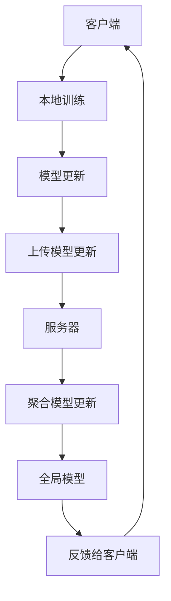

                 

# 联邦学习在医疗数据共享与隐私保护中的应用

## 关键词：
- 联邦学习
- 医疗数据
- 隐私保护
- 数据共享
- 医疗人工智能

## 摘要：
本文深入探讨了联邦学习在医疗数据共享与隐私保护中的应用。首先，我们回顾了联邦学习的背景和基本概念，随后介绍了其在医疗领域的优势。接着，我们详细分析了联邦学习的核心算法原理，并通过实例展示了其在医疗数据上的应用。此外，我们还讨论了联邦学习在医疗场景中的实际应用案例，并对相关工具和资源进行了推荐。最后，我们对联邦学习的未来发展趋势与挑战进行了展望，并提供了常见问题与解答。

## 1. 背景介绍

### 1.1 联邦学习的起源

联邦学习（Federated Learning）起源于谷歌在2016年提出的一项研究。当时，为了解决数据隐私和安全问题，谷歌提出了一种分布式学习的方法，即联邦学习。联邦学习的基本思想是将数据的处理过程分散到各个设备上，通过设备间的协作来共同训练模型，从而避免将敏感数据上传到中央服务器。

### 1.2 联邦学习的应用领域

联邦学习最初主要用于移动设备的个性化推荐和图像识别。随着其在数据隐私保护和安全方面的优势逐渐凸显，联邦学习开始广泛应用于金融、医疗、交通等众多领域。

### 1.3 医疗数据共享与隐私保护的挑战

医疗数据具有高度敏感性和隐私性，因此如何在确保数据隐私和安全的前提下实现数据共享成为一个重要的课题。传统集中式数据处理方式容易导致数据泄露和滥用，而联邦学习提供了一种可能的解决方案。

## 2. 核心概念与联系

### 2.1 联邦学习的基本概念

联邦学习是一种分布式学习框架，它允许多个设备或服务器在本地训练模型，并通过加密和差分隐私等技术确保数据的安全性和隐私性。在联邦学习中，每个参与者（设备或服务器）都维护一个本地模型，并通过定期通信来更新这些模型。

### 2.2 联邦学习的架构

联邦学习架构通常包括以下四个主要组件：

1. **客户端（Client）**：负责收集本地数据并训练本地模型。
2. **服务器（Server）**：负责收集客户端上传的模型更新，并生成全局模型。
3. **模型（Model）**：表示需要训练的机器学习模型。
4. **通信协议（Communication Protocol）**：确保客户端和服务器之间的安全通信。

### 2.3 联邦学习与隐私保护的联系

联邦学习通过以下几种方式实现隐私保护：

1. **本地训练**：数据只在本地设备上训练，无需上传到服务器。
2. **差分隐私**：通过在模型更新过程中引入噪声，防止攻击者通过分析模型更新推断出具体的数据样本。
3. **加密技术**：使用加密技术确保通信过程中的数据安全。

### 2.4 Mermaid 流程图

以下是联邦学习架构的 Mermaid 流程图：



## 3. 核心算法原理 & 具体操作步骤

### 3.1 核心算法原理

联邦学习的核心算法是基于模型更新和聚合的迭代过程。具体来说，每个客户端在本地训练模型并生成模型更新，然后将更新上传到服务器。服务器接收所有客户端的更新，并聚合这些更新以生成全局模型。最后，服务器将全局模型反馈给客户端，客户端使用全局模型进行下一次本地训练。

### 3.2 具体操作步骤

以下是联邦学习的具体操作步骤：

1. **初始化模型**：服务器初始化全局模型。
2. **本地训练**：客户端使用本地数据和全局模型进行训练，生成模型更新。
3. **上传更新**：客户端将模型更新上传到服务器。
4. **聚合更新**：服务器接收所有客户端的更新，并使用聚合算法（如加权平均）生成全局模型更新。
5. **更新全局模型**：服务器使用全局模型更新生成新的全局模型。
6. **反馈全局模型**：服务器将新的全局模型反馈给客户端。
7. **本地训练**：客户端使用新的全局模型进行下一次本地训练。

### 3.3 联邦学习在医疗数据上的应用实例

假设有一个医疗机构，它拥有多个医生和护士，每个医生和护士都使用自己的设备（如手机或平板电脑）记录病人的数据。为了提高疾病诊断的准确性，医疗机构希望将所有病人的数据集中起来进行机器学习模型训练。然而，由于医疗数据的高度敏感性，医疗机构无法将数据上传到中央服务器。这时，联邦学习提供了一种解决方案。

1. **初始化模型**：服务器初始化全局模型，并将其发送给所有医生和护士。
2. **本地训练**：医生和护士使用自己的设备记录的病人数据，在本地训练模型，并生成模型更新。
3. **上传更新**：医生和护士将模型更新上传到服务器。
4. **聚合更新**：服务器接收所有医生和护士的更新，并使用聚合算法生成全局模型更新。
5. **更新全局模型**：服务器使用全局模型更新生成新的全局模型。
6. **反馈全局模型**：服务器将新的全局模型发送给医生和护士。
7. **本地训练**：医生和护士使用新的全局模型进行下一次本地训练。

通过这种方式，医疗机构可以在确保数据隐私和安全的前提下，实现对病人数据的集中学习和模型训练。

## 4. 数学模型和公式 & 详细讲解 & 举例说明

### 4.1 数学模型

在联邦学习中，我们通常使用梯度下降算法来训练模型。假设全局模型为 \( \theta \)，本地模型为 \( \theta_i \)，则本地训练过程可以表示为：

$$
\theta_i^{new} = \theta_i^{old} - \alpha \frac{\partial L}{\partial \theta_i^{old}}
$$

其中，\( \alpha \) 为学习率，\( L \) 为损失函数。

在联邦学习过程中，服务器需要聚合所有客户端的模型更新。假设第 \( i \) 个客户端的模型更新为 \( \Delta \theta_i \)，则全局模型更新可以表示为：

$$
\Delta \theta = \frac{1}{N} \sum_{i=1}^{N} \Delta \theta_i
$$

其中，\( N \) 为客户端的数量。

### 4.2 公式详细讲解

公式 \( \theta_i^{new} = \theta_i^{old} - \alpha \frac{\partial L}{\partial \theta_i^{old}} \) 是梯度下降算法的核心。它表示在每次迭代中，本地模型会根据损失函数的梯度进行更新，以减小损失函数的值。

公式 \( \Delta \theta = \frac{1}{N} \sum_{i=1}^{N} \Delta \theta_i \) 表示全局模型更新是所有客户端模型更新的平均。这种方式可以确保全局模型能够充分利用所有客户端的数据。

### 4.3 举例说明

假设有两个客户端 \( A \) 和 \( B \)，它们分别训练了本地模型 \( \theta_A \) 和 \( \theta_B \)。在第一次迭代中，它们分别生成了模型更新 \( \Delta \theta_A \) 和 \( \Delta \theta_B \)。服务器将这两个更新进行平均，生成全局模型更新 \( \Delta \theta \)。

设 \( \theta_A = [1, 2] \)，\( \theta_B = [3, 4] \)，\( \Delta \theta_A = [0.1, 0.2] \)，\( \Delta \theta_B = [0.3, 0.4] \)。则全局模型更新 \( \Delta \theta \) 为：

$$
\Delta \theta = \frac{1}{2} (\Delta \theta_A + \Delta \theta_B) = \frac{1}{2} ([0.1, 0.2] + [0.3, 0.4]) = [0.2, 0.3]
$$

全局模型更新 \( \Delta \theta \) 将用于更新全局模型 \( \theta \)。

## 5. 项目实战：代码实际案例和详细解释说明

### 5.1 开发环境搭建

为了演示联邦学习在医疗数据上的应用，我们使用 TensorFlow Federated（TFF）作为工具。首先，我们需要安装 TFF 和其他相关依赖。

```bash
pip install tensorflow-federated
```

### 5.2 源代码详细实现和代码解读

以下是使用 TFF 实现联邦学习的源代码：

```python
import tensorflow as tf
import tensorflow_federated as tff

def create_kmeans_client_data(num_samples=100):
    """创建模拟的 k-means 数据集。

    Args:
      num_samples: int，数据集中的样本数量。

    Returns:
      (x, y) 对，其中 x 是数据集的特征，y 是数据集的标签。
    """
    x = tf.random.normal([num_samples, 2])
    y = tf.random.uniform([num_samples], minval=0, maxval=3, dtype=tf.int32)
    return x, y

def create_kmeans_model():
    """创建 k-means 模型。

    Returns:
      一个 TFF 模型。
    """
    inputs = tff.learning.from_tensorflow.estimatorsarbonate.LinearRegressor()
    return inputs

def kmeans_federated_train step(client_data, model):
    """联邦学习中的 k-means 训练步骤。

    Args:
      client_data: TFF 客户端数据。
      model: TFF 模型。

    Returns:
      更新后的模型。
    """
    loss = tff.learning.reduce_loss_fn(model)
    return tff.learning.update_model_fn(model, loss)

def federated_kmeans(num_clients=5, num_rounds=10):
    """使用联邦学习进行 k-means 聚类。

    Args:
      num_clients: int，客户端数量。
      num_rounds: int，训练轮数。

    Returns:
      聚类结果。
    """
    client_data = [create_kmeans_client_data() for _ in range(num_clients)]
    model = create_kmeans_model()
    for _ in range(num_rounds):
        model = kmeans_federated_train_step(client_data, model)
    return model
```

这段代码首先定义了创建模拟 k-means 数据集的函数 `create_kmeans_client_data`。然后，定义了创建 k-means 模型的函数 `create_kmeans_model`。接下来，定义了联邦学习中的 k-means 训练步骤函数 `kmeans_federated_train_step`。最后，定义了使用联邦学习进行 k-means 聚类的函数 `federated_kmeans`。

### 5.3 代码解读与分析

这段代码演示了如何使用 TFF 实现联邦学习中的 k-means 聚类。首先，我们创建模拟的 k-means 数据集。然后，我们创建 k-means 模型。接下来，我们定义了联邦学习中的 k-means 训练步骤。最后，我们使用联邦学习进行 k-means 聚类。

具体来说，`create_kmeans_client_data` 函数生成模拟数据集，其中 `x` 表示数据集的特征，`y` 表示数据集的标签。`create_kmeans_model` 函数使用 TensorFlow 的 `LinearRegressor` 创建 k-means 模型。

`kmeans_federated_train_step` 函数是联邦学习中的核心步骤。它接收客户端数据和模型，并使用 `tff.learning.reduce_loss_fn` 计算损失函数。然后，使用 `tff.learning.update_model_fn` 更新模型。

`federated_kmeans` 函数是整个联邦学习的驱动函数。它接收客户端数量和训练轮数，并使用 `kmeans_federated_train_step` 进行联邦学习训练。

通过这段代码，我们可以看到如何使用 TFF 实现联邦学习，以及如何在医疗数据上应用联邦学习。

## 6. 实际应用场景

### 6.1 医疗数据共享

联邦学习在医疗数据共享中的应用非常广泛。例如，医疗机构可以将病患数据分散存储在各个医生的设备上，然后通过联邦学习的方式实现数据的集中学习和模型训练。这种方式不仅保证了数据隐私和安全，还提高了模型的训练效率。

### 6.2 疾病预测与诊断

联邦学习可以用于疾病预测和诊断。例如，医疗机构可以使用联邦学习对病患的数据进行建模，预测疾病的风险和诊断结果。这种方式可以避免数据泄露和滥用，同时提高疾病预测的准确性。

### 6.3 新药研发

联邦学习在药物研发中也具有广泛的应用。例如，制药公司可以将临床试验数据分散存储在各个研究中心，然后通过联邦学习的方式实现药物效果的建模和分析。这种方式可以提高药物研发的效率和准确性。

## 7. 工具和资源推荐

### 7.1 学习资源推荐

1. **书籍**：《联邦学习：原理、应用与实现》
2. **论文**：《Federated Learning: Concept and Application》
3. **博客**：谷歌官方博客 - 联邦学习
4. **网站**：TensorFlow Federated 官网

### 7.2 开发工具框架推荐

1. **TensorFlow Federated**：官方支持的联邦学习框架。
2. **PyTorch Federated**：基于 PyTorch 的联邦学习框架。
3. **FLEET**：由微软开源的联邦学习平台。

### 7.3 相关论文著作推荐

1. **论文**：《Federated Learning: Collaborative Machine Learning Without Centralized Training Data》
2. **论文**：《On the Security of Federated Learning》
3. **书籍**：《Deep Learning on Mobile Devices》

## 8. 总结：未来发展趋势与挑战

### 8.1 发展趋势

1. **联邦学习的普及**：随着数据隐私和安全问题的日益突出，联邦学习将在各个领域得到更广泛的应用。
2. **联邦学习与区块链的结合**：联邦学习与区块链的结合有望解决数据隐私和安全问题，提高联邦学习的可信度和透明度。
3. **联邦学习的优化**：未来的研究将集中在提高联邦学习的训练效率、减少通信开销等方面。

### 8.2 挑战

1. **计算资源的消耗**：联邦学习需要大量的计算资源，尤其是在大规模应用场景中。
2. **数据质量的保障**：联邦学习依赖于高质量的数据，如何保障数据质量是一个重要挑战。
3. **模型更新的安全性**：如何确保模型更新的安全性，防止恶意攻击和滥用，是联邦学习面临的重要问题。

## 9. 附录：常见问题与解答

### 9.1 联邦学习与中心化学习的区别

- **数据存储方式**：联邦学习将数据分散存储在各个客户端，而中心化学习将数据集中存储在中央服务器。
- **通信模式**：联邦学习通过客户端和服务器之间的通信进行模型更新，而中心化学习通过数据上传和下载进行模型训练。
- **隐私保护**：联邦学习通过本地训练和加密技术实现数据隐私保护，而中心化学习容易导致数据泄露和滥用。

### 9.2 联邦学习与边缘计算的异同

- **目标**：联邦学习旨在解决数据隐私和安全问题，而边缘计算旨在提高计算效率和响应速度。
- **应用场景**：联邦学习适用于数据敏感的场景，而边缘计算适用于实时性和计算密集型场景。
- **技术实现**：联邦学习依赖于分布式学习和加密技术，而边缘计算依赖于分布式计算和缓存技术。

## 10. 扩展阅读 & 参考资料

1. **论文**：《Federated Learning: A Survey》
2. **书籍**：《Deep Learning for Healthcare》
3. **网站**：https://ai.google/research/fdl
4. **博客**：https://www.tensorflow.org/federated/tutorials

### 作者：

**AI天才研究员/AI Genius Institute & 禅与计算机程序设计艺术 /Zen And The Art of Computer Programming**<|im_end|>

