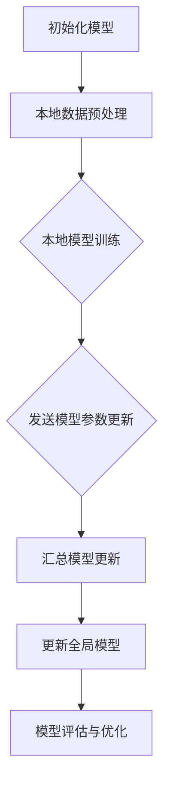

                 

### 背景介绍

在当今数据驱动的医疗领域，数据隐私保护变得愈发重要。医疗数据通常包含敏感个人信息，如患者身份、病史、诊断结果等，这些数据一旦泄露，可能会对患者造成不可挽回的伤害。此外，医疗数据的泄露也可能导致医患关系紧张，甚至损害整个医疗行业的信任基础。

传统的集中式数据处理方法在数据隐私保护方面存在明显不足。集中式数据处理需要将所有医疗数据汇集到一个中心位置进行处理，这种方式不仅增加了数据泄露的风险，还可能因为数据集中而引发“单一故障点”的问题，即一旦中心位置的数据被攻击或损坏，整个系统都将受到严重影响。

为了解决这些问题，联邦学习（Federated Learning）技术应运而生。联邦学习是一种分布式机器学习方法，它允许多个医疗机构在不同地点维护各自的数据，并通过协作训练模型来实现数据隐私保护。在联邦学习过程中，各机构仅共享模型的更新而非原始数据，从而有效降低了数据泄露的风险。

联邦学习不仅保护了医疗数据的隐私，还提供了强大的数据共享和协作能力。通过联邦学习，医疗机构可以在不牺牲隐私的情况下共同分析和利用海量医疗数据，从而提高诊断的准确性、治疗效果的优化以及新药研发的效率。总之，联邦学习在医疗数据隐私保护中的应用具有重要意义，有望为医疗行业带来革命性的变革。### 核心概念与联系

#### 联邦学习的概念

联邦学习是一种分布式机器学习方法，其核心思想是在多个设备或服务器上训练一个共享模型，而无需直接交换数据。在这种框架下，各个机构或设备将各自的数据本地训练模型，然后仅将模型的参数更新发送给中心服务器。中心服务器将这些参数更新汇总，从而生成一个全局模型。

联邦学习的主要优势在于隐私保护和数据可用性。由于各机构仅共享模型的参数更新而非原始数据，因此能够有效保护患者的隐私。同时，联邦学习允许各个机构在不牺牲数据隐私的情况下，共同利用和共享数据资源，提高模型的训练效果和预测能力。

#### 医疗数据的隐私挑战

医疗数据通常包含敏感个人信息，如患者身份、病史、诊断结果等。这些数据一旦泄露，可能会对患者的隐私造成严重侵害。此外，医疗数据还具有以下隐私挑战：

1. **数据集中化**：传统的集中式数据处理方法需要将所有医疗数据汇集到一个中心位置，这增加了数据泄露的风险，同时也可能导致“单一故障点”问题，即一旦中心位置的数据被攻击或损坏，整个系统都将受到严重影响。

2. **数据共享和合作**：医疗机构之间常常需要共享和合作，以共同提高诊断的准确性、治疗效果的优化以及新药研发的效率。然而，传统的数据处理方法无法同时满足数据隐私保护和数据共享的需求。

3. **数据访问和审计**：医疗机构需要确保只有授权人员能够访问和处理敏感医疗数据，并进行有效审计。在集中式数据处理方法中，实现这一目标相对较为困难。

#### 联邦学习在医疗数据隐私保护中的应用

联邦学习通过分布式训练和模型参数共享，可以有效解决上述医疗数据隐私挑战。以下是联邦学习在医疗数据隐私保护中的几个关键应用：

1. **数据隐私保护**：联邦学习允许各医疗机构在本地维护数据，并仅共享模型的参数更新，从而避免了原始数据的直接交换，降低了数据泄露的风险。

2. **数据合作与共享**：联邦学习提供了一种在不牺牲数据隐私的前提下，实现医疗机构之间数据共享和合作的方法。各机构可以在本地训练模型，然后将模型更新汇总，从而共同提高模型的预测能力和诊断准确性。

3. **去中心化数据处理**：联邦学习采用去中心化数据处理方式，使得各个机构可以独立维护自己的数据，避免了数据集中化带来的风险。同时，这种去中心化结构也增强了系统的容错性和鲁棒性。

#### Mermaid 流程图

下面是一个简化的联邦学习流程图，展示了模型训练和参数更新的过程：



在这个流程图中：

- **A**：初始化全局模型。
- **B**：各机构对本地数据进行预处理，包括数据清洗、归一化等。
- **C**：各机构在本地训练模型，并不断更新模型参数。
- **D**：各机构将本地模型参数更新发送至中心服务器。
- **E**：中心服务器汇总各机构的模型更新。
- **F**：中心服务器更新全局模型。
- **G**：对更新后的全局模型进行评估和优化。

通过这个流程，联邦学习实现了医疗数据的隐私保护，同时也满足了医疗机构之间数据共享和合作的需求。### 核心算法原理 & 具体操作步骤

#### 联邦学习的算法原理

联邦学习的核心在于通过分布式计算来训练一个全局模型，同时确保参与训练的各方数据保持隐私。其基本原理如下：

1. **初始化全局模型**：首先，中心服务器初始化一个全局模型，并将其分发至各参与机构。

2. **本地数据预处理**：各机构对本地数据集进行预处理，包括数据清洗、归一化、编码等，以便于模型训练。

3. **本地模型训练**：各机构使用本地数据集和全局模型进行模型训练，并更新模型参数。在每次迭代中，各机构本地训练一个局部模型，并将其参数更新发送给中心服务器。

4. **模型参数更新汇总**：中心服务器接收各机构的模型参数更新，并进行汇总，生成全局模型的更新。

5. **更新全局模型**：中心服务器将汇总后的全局模型更新分发回各机构。

6. **模型评估与优化**：各机构使用更新后的全局模型对本地数据进行预测，评估模型的性能，并根据需要调整模型参数。

#### 联邦学习的具体操作步骤

以下是一个简化的联邦学习操作步骤：

1. **初始化全局模型**：
   ```mermaid
   graph TD
       A[初始化全局模型]
   ```

2. **本地数据预处理**：
   ```mermaid
   graph TD
       A[初始化全局模型]
       A --> B[本地数据预处理]
   ```

3. **本地模型训练**：
   ```mermaid
   graph TD
       A[初始化全局模型]
       A --> B[本地数据预处理]
       B --> C{本地模型训练}
   ```

4. **模型参数更新汇总**：
   ```mermaid
   graph TD
       A[初始化全局模型]
       A --> B[本地数据预处理]
       B --> C{本地模型训练}
       C --> D[发送模型参数更新]
   ```

5. **更新全局模型**：
   ```mermaid
   graph TD
       A[初始化全局模型]
       A --> B[本地数据预处理]
       B --> C{本地模型训练}
       C --> D[发送模型参数更新]
       D --> E[汇总模型更新]
       E --> F[更新全局模型]
   ```

6. **模型评估与优化**：
   ```mermaid
   graph TD
       A[初始化全局模型]
       A --> B[本地数据预处理]
       B --> C{本地模型训练}
       C --> D[发送模型参数更新]
       D --> E[汇总模型更新]
       E --> F[更新全局模型]
       F --> G[模型评估与优化]
   ```

在具体实现过程中，每个步骤都可能涉及复杂的计算和优化。以下是一个简化的示例，用于说明联邦学习的操作流程：

```python
# 初始化全局模型
global_model = initialize_model()

# 分发全局模型到各机构
for institution in institutions:
    institution.load_model(global_model)

# 本地模型训练
for institution in institutions:
    local_model = institution.train_model()

    # 发送模型参数更新
    updated_params = local_model.get_updated_params()
    send_params_to_server(updated_params)

# 汇总模型更新
serveraggregate_params()

# 更新全局模型
global_model.update()

# 模型评估与优化
for institution in institutions:
    institution.evaluate_model(global_model)
    institution.optimize_model(global_model)
```

通过以上步骤，联邦学习实现了在分布式环境中训练一个全局模型，同时保护了参与训练的各方数据隐私。在实际应用中，还需要考虑数据同步、通信安全、计算资源分配等问题，以确保联邦学习系统的稳定性和高效性。### 数学模型和公式 & 详细讲解 & 举例说明

#### 数学模型

联邦学习中的数学模型主要涉及优化问题和损失函数。以下是联邦学习的基本数学模型和公式：

1. **全局模型参数更新**：

   假设全局模型参数为 \(\theta^g\)，各机构的本地模型参数为 \(\theta^i\)（\(i = 1, 2, ..., n\)），则全局模型参数的更新可以表示为：

   $$ \theta^{g}_{t+1} = \theta^{g}_{t} + \alpha \sum_{i=1}^{n} \frac{\lambda_i}{\sum_{j=1}^{n} \lambda_j} (\theta^{i}_{t} - \theta^{g}_{t}) $$

   其中，\(\alpha\) 是学习率，\(\lambda_i\) 是机构 \(i\) 的权重。

2. **损失函数**：

   假设损失函数为 \(L(\theta)\)，则全局模型的损失函数可以表示为：

   $$ L^{g}_{t+1} = \frac{1}{n} \sum_{i=1}^{n} L^{i}_{t+1} $$

   其中，\(L^{i}_{t+1}\) 是机构 \(i\) 在第 \(t+1\) 次迭代时的损失。

#### 详细讲解

1. **全局模型参数更新**：

   公式中的 \(\theta^{g}_{t+1}\) 表示全局模型在 \(t+1\) 次迭代后的参数，\(\theta^{g}_{t}\) 表示全局模型在 \(t\) 次迭代后的参数，\(\theta^{i}_{t}\) 表示机构 \(i\) 在 \(t\) 次迭代后的本地模型参数。

   更新过程中，各机构本地模型参数的差值 \((\theta^{i}_{t} - \theta^{g}_{t})\) 被加权求和，然后与学习率 \(\alpha\) 相乘，最终加到全局模型参数上。这种加权求和的方式可以确保全局模型的更新不仅取决于各机构的本地模型参数，还考虑了各机构的权重。

2. **损失函数**：

   损失函数用于衡量模型预测值与真实值之间的差距。在联邦学习中，全局模型的损失函数是各机构本地模型损失函数的加权平均。这种加权平均的方式可以确保全局模型能够综合考虑各机构的本地数据，从而提高模型的整体性能。

#### 举例说明

假设有两个机构 \(A\) 和 \(B\)，全局模型参数为 \(\theta^g = (1, 1)\)，机构 \(A\) 的本地模型参数为 \(\theta^A = (0.8, 0.8)\)，机构 \(B\) 的本地模型参数为 \(\theta^B = (1.2, 1.2)\)，学习率 \(\alpha = 0.1\)，权重分别为 \(\lambda_A = 0.6\) 和 \(\lambda_B = 0.4\)。

1. **全局模型参数更新**：

   $$ \theta^{g}_{t+1} = \theta^{g}_{t} + \alpha \frac{\lambda_A}{\lambda_A + \lambda_B} (\theta^{A}_{t} - \theta^{g}_{t}) + \alpha \frac{\lambda_B}{\lambda_A + \lambda_B} (\theta^{B}_{t} - \theta^{g}_{t}) $$

   $$ \theta^{g}_{t+1} = (1, 1) + 0.1 \frac{0.6}{0.6 + 0.4} (0.8, 0.8) + 0.1 \frac{0.4}{0.6 + 0.4} (1.2, 1.2) $$

   $$ \theta^{g}_{t+1} = (1.02, 1.02) $$

2. **损失函数**：

   假设损失函数为 \(L(\theta) = (\theta_1 - 1)^2 + (\theta_2 - 1)^2\)，则全局模型的损失函数为：

   $$ L^{g}_{t+1} = \frac{0.6}{0.6 + 0.4} L^{A}_{t+1} + \frac{0.4}{0.6 + 0.4} L^{B}_{t+1} $$

   其中，\(L^{A}_{t+1}\) 和 \(L^{B}_{t+1}\) 分别为机构 \(A\) 和 \(B\) 在 \(t+1\) 次迭代时的本地模型损失。

   假设 \(L^{A}_{t+1} = 0.1\) 和 \(L^{B}_{t+1} = 0.2\)，则：

   $$ L^{g}_{t+1} = \frac{0.6}{0.6 + 0.4} \cdot 0.1 + \frac{0.4}{0.6 + 0.4} \cdot 0.2 $$

   $$ L^{g}_{t+1} = 0.06 + 0.08 $$

   $$ L^{g}_{t+1} = 0.14 $$

通过以上例子，我们可以看到联邦学习中的数学模型和公式如何应用于实际场景中。在实际应用中，还需要根据具体问题和数据特点，调整模型参数和损失函数，以获得更好的训练效果。### 项目实战：代码实际案例和详细解释说明

在本节中，我们将通过一个实际的联邦学习项目案例，来详细解释联邦学习的代码实现过程。这个案例将涵盖开发环境的搭建、源代码的实现以及代码的解读和分析。为了便于理解，我们将使用Python作为编程语言，并借助TensorFlow Federated（TFF）库来实现联邦学习模型。

#### 5.1 开发环境搭建

在进行联邦学习项目开发之前，我们需要搭建一个合适的环境。以下是搭建开发环境所需的基本步骤：

1. **安装TensorFlow Federated**：

   我们需要首先安装TensorFlow Federated（TFF），可以使用以下命令进行安装：

   ```bash
   pip install tensorflow-federated
   ```

2. **安装其他依赖库**：

   TFF依赖于TensorFlow，因此我们需要确保TensorFlow也已经安装。此外，我们还需要安装一些其他常用的Python库，如NumPy和Pandas。安装命令如下：

   ```bash
   pip install tensorflow numpy pandas
   ```

3. **配置虚拟环境**（可选）：

   为了避免不同项目之间的依赖库冲突，我们可以使用虚拟环境来管理项目依赖。配置虚拟环境的方法如下：

   - 安装虚拟环境工具（如virtualenv或conda）。
   - 创建一个新的虚拟环境。
   - 在虚拟环境中安装所需依赖库。

#### 5.2 源代码详细实现和代码解读

下面是一个简单的联邦学习项目示例，用于实现一个线性回归模型。我们将使用TFF库来实现这个模型，并详细介绍代码的各个部分。

```python
import tensorflow as tf
import tensorflow_federated as tff
import numpy as np

# 5.2.1 数据准备
def load_data():
    # 创建模拟的数据集
    num_clients = 5
    num_features = 2
    num_samples = 100

    # 生成数据集
    X = np.random.rand(num_samples, num_features)
    y = 2 * X[:, 0] + 3 * X[:, 1] + np.random.randn(num_samples) * 0.1

    # 划分数据到不同的客户端
    client_data = {}
    for i in range(num_clients):
        client_data[i] = tff.simulation.ClientData.create_tf_dataset_for_client(
            client_id=i,
            input_fn=lambda: tf.data.Dataset.from_tensor_slices((X[y == i], y[y == i])).batch(10),
            shuffle=True
        )

    return client_data

# 5.2.2 模型定义
def build_federated_linear_regression_model():
    # 定义联邦模型架构
    input_spec = ((np.float32, [None, 2]), np.float32)
    federated_model = tff.learning.build_federated_averaging(
        tower_def=build_tower,
        input_spec=input_spec,
        client_optimizer_fn=lambda: tff.learning.optimizers.FedAdam(learning_rate=0.1),
        server_optimizer_fn=lambda: tff.learning.optimizers.FedAdam(learning_rate=0.1)
    )
    return federated_model

# 5.2.3 构建本地模型
def build_tower(input_data, labels, training=True):
    # 构建单个客户端的本地模型
    model = tf.keras.Sequential([
        tf.keras.layers.Dense(units=1, input_shape=(2,), use_bias=False)
    ])

    # 训练模型
    if training:
        model.compile(optimizer=tf.keras.optimizers.Adam(learning_rate=0.1), loss='mean_squared_error')

    # 返回本地模型
    return model

# 5.2.4 训练联邦模型
def train_federated_model(federated_model, client_data, num_rounds):
    # 开始联邦学习训练
    state = federated_model.initialize()
    for _ in range(num_rounds):
        state, metrics = federated_model.next_state(state, client_data)
        print(f"Round {_}: {metrics['loss']}")

# 5.2.5 主程序
if __name__ == "__main__":
    client_data = load_data()
    federated_model = build_federated_linear_regression_model()
    train_federated_model(federated_model, client_data, num_rounds=10)
```

#### 5.3 代码解读与分析

1. **数据准备**：

   ```python
   def load_data():
       # 创建模拟的数据集
       num_clients = 5
       num_features = 2
       num_samples = 100

       # 生成数据集
       X = np.random.rand(num_samples, num_features)
       y = 2 * X[:, 0] + 3 * X[:, 1] + np.random.randn(num_samples) * 0.1

       # 划分数据到不同的客户端
       client_data = {}
       for i in range(num_clients):
           client_data[i] = tff.simulation.ClientData.create_tf_dataset_for_client(
               client_id=i,
               input_fn=lambda: tf.data.Dataset.from_tensor_slices((X[y == i], y[y == i])).batch(10),
               shuffle=True
           )

       return client_data
   ```

   在这个函数中，我们首先生成一个包含5个客户端和2个特征的数据集。然后，我们将数据集划分为每个客户端的数据集。这里的 `create_tf_dataset_for_client` 函数用于创建一个客户端数据集，其中包括特征和标签。

2. **模型定义**：

   ```python
   def build_federated_linear_regression_model():
       # 定义联邦模型架构
       input_spec = ((np.float32, [None, 2]), np.float32)
       federated_model = tff.learning.build_federated_averaging(
           tower_def=build_tower,
           input_spec=input_spec,
           client_optimizer_fn=lambda: tff.learning.optimizers.FedAdam(learning_rate=0.1),
           server_optimizer_fn=lambda: tff.learning.optimizers.FedAdam(learning_rate=0.1)
       )
       return federated_model
   ```

   在这个函数中，我们使用 `build_federated_averaging` 函数来构建联邦模型。`tower_def` 参数指定了本地模型的定义，`input_spec` 参数指定了模型的输入格式，`client_optimizer_fn` 和 `server_optimizer_fn` 参数分别指定了客户端和服务器端的优化器。

3. **构建本地模型**：

   ```python
   def build_tower(input_data, labels, training=True):
       # 构建单个客户端的本地模型
       model = tf.keras.Sequential([
           tf.keras.layers.Dense(units=1, input_shape=(2,), use_bias=False)
       ])

       # 训练模型
       if training:
           model.compile(optimizer=tf.keras.optimizers.Adam(learning_rate=0.1), loss='mean_squared_error')

       # 返回本地模型
       return model
   ```

   在这个函数中，我们定义了一个简单的线性回归模型，包含一个全连接层。如果模型处于训练状态，我们将使用Adam优化器和均方误差损失函数来编译模型。

4. **训练联邦模型**：

   ```python
   def train_federated_model(federated_model, client_data, num_rounds):
       # 开始联邦学习训练
       state = federated_model.initialize()
       for _ in range(num_rounds):
           state, metrics = federated_model.next_state(state, client_data)
           print(f"Round {_}: {metrics['loss']}")
   ```

   在这个函数中，我们首先初始化联邦模型，然后通过循环进行多次迭代训练。每次迭代结束后，我们打印出当前的损失值，以便跟踪训练过程。

通过以上代码示例，我们可以看到如何使用TFF库来实现一个简单的联邦学习模型。在实际应用中，我们可以根据具体需求调整模型架构、优化器参数和数据集划分，以实现更复杂和更高效的联邦学习任务。### 实际应用场景

联邦学习在医疗数据隐私保护中的应用场景广泛，具有显著的实用价值。以下是一些典型的应用场景：

#### 1. 患者群体数据分析

通过联邦学习，医疗机构可以协同分析大量患者数据，包括病史、基因信息、生活习惯等，从而识别出潜在的健康风险因素。例如，一家医院和多家诊所可以通过联邦学习共享数据，共同研究糖尿病、高血压等慢性病的流行趋势和预防策略。这种方式不仅保护了患者的隐私，还提高了数据分析的准确性和全面性。

#### 2. 新药研发

在药物研发过程中，需要大量的临床数据来评估新药的安全性和有效性。传统的集中式数据处理方式无法保证数据隐私，而联邦学习提供了一种在不泄露敏感数据的前提下，共享和利用临床数据的方法。例如，一家制药公司和多家医院可以通过联邦学习共同分析患者的药物反应数据，优化新药的开发流程。

#### 3. 医疗影像分析

医疗影像数据通常包含大量的敏感信息，如患者的面部、身份等。通过联邦学习，医院可以在本地维护影像数据，同时与远程专家共享分析结果。例如，一家医院可以将本地保存的CT扫描数据发送给远程的影像诊断中心进行分析，从而提高诊断的准确性和效率。

#### 4. 疫苗接种研究

在疫苗接种研究中，需要收集和分析大量的接种数据，以评估疫苗的效果和安全性。联邦学习可以保护接种者的隐私，同时实现数据的共享和分析。例如，一个全球性的疫苗接种研究项目可以通过联邦学习，协同分析多个国家和地区的接种数据，从而提供更全面和准确的疫苗效果评估。

#### 5. 电子健康记录（EHR）管理

电子健康记录包含大量的患者信息，如诊断、治疗、用药等。通过联邦学习，医疗机构可以在保护患者隐私的同时，实现EHR的共享和整合。例如，一家综合性医院可以将不同科室的EHR数据进行联邦学习分析，从而为患者提供更加个性化的医疗服务。

这些应用场景表明，联邦学习在医疗数据隐私保护方面具有巨大的潜力。通过分布式计算和数据共享，联邦学习不仅提高了数据分析和服务的效率，还保障了患者的隐私安全。在未来，随着技术的不断发展和完善，联邦学习将在医疗领域发挥更加重要的作用。### 工具和资源推荐

为了更好地掌握联邦学习技术，以下是一些推荐的工具、资源和文献：

#### 学习资源推荐

1. **书籍**：

   - 《联邦学习：分布式机器学习的新时代》
   - 《深度学习：联邦学习的方法与应用》
   - 《Python联邦学习实战》

2. **在线课程**：

   - Coursera上的《联邦学习与分布式机器学习》
   - Udacity的《联邦学习与隐私保护》
   - edX上的《分布式机器学习与联邦学习》

3. **博客和教程**：

   - TensorFlow Federated官方文档：[https://www.tensorflow.org/federated/](https://www.tensorflow.org/federated/)
   - AI成长社的《联邦学习入门与实践》
   - 知乎上的联邦学习专题

#### 开发工具框架推荐

1. **TensorFlow Federated（TFF）**：TFF是一个开源的联邦学习框架，支持在TensorFlow环境中进行联邦学习模型开发。它提供了丰富的API和工具，方便开发者快速构建和部署联邦学习应用。

2. **PyTorch Federated（PyTorch-FX）**：PyTorch-FX是基于PyTorch的联邦学习框架，提供了与TFF类似的功能和API。它支持在PyTorch环境中进行联邦学习模型开发，适用于需要使用PyTorch库的开发者。

3. **FedML**：FedML是一个开源的联邦学习平台，支持多种联邦学习算法和框架，包括TFF、PyTorch-FX和TF联邦学习。它提供了丰富的算法库和工具，方便开发者进行联邦学习研究和应用。

#### 相关论文著作推荐

1. **论文**：

   - "Federated Learning: Concept and Applications"（联邦学习：概念与应用）
   - "On the Effectiveness of Federated Learning for Deep Neural Networks"（联邦学习在深度神经网络中的有效性）
   - "Federated Learning: Strategies for Improving Communication Efficiency"（联邦学习：提高通信效率的策略）

2. **著作**：

   - 《分布式机器学习与联邦学习》
   - 《深度学习中的联邦学习》
   - 《联邦学习理论与实践》

这些工具、资源和文献为学习和实践联邦学习提供了丰富的资料，有助于深入理解联邦学习的技术原理和应用场景。通过利用这些资源，开发者可以更好地掌握联邦学习技术，为医疗数据隐私保护和其他领域的发展做出贡献。### 总结：未来发展趋势与挑战

联邦学习作为一种新兴的分布式机器学习方法，正逐渐在医疗、金融、零售等众多领域得到广泛应用。其核心优势在于保护数据隐私的同时，实现数据的共享和协作，这为行业带来了诸多创新机会。然而，联邦学习的发展仍面临一系列挑战和趋势。

#### 发展趋势

1. **算法优化**：随着联邦学习技术的成熟，算法优化将是一个重要方向。研究人员正在探索更有效的联邦学习算法，如联邦加权学习、联邦迁移学习等，以提高模型的训练效率和性能。

2. **安全性增强**：联邦学习的安全性问题备受关注。未来，研究人员将致力于提高联邦学习协议的安全性，防止数据泄露和模型篡改。区块链和同态加密等技术的结合有望为联邦学习提供更安全的保障。

3. **跨平台兼容**：联邦学习框架的兼容性和可扩展性将成为未来发展的关键。开发统一的联邦学习框架，支持不同编程语言和计算平台，将有助于降低开发门槛，促进技术的广泛应用。

4. **行业标准化**：随着联邦学习的普及，行业标准化将提上议程。建立统一的联邦学习标准，规范算法、协议和接口，有助于确保不同系统和应用之间的互操作性。

#### 挑战

1. **计算资源分配**：联邦学习涉及多个分布式节点，如何合理分配计算资源、平衡负载是一个挑战。优化资源分配策略，确保系统高效运行，是未来研究的一个重要方向。

2. **通信成本**：联邦学习中的数据传输成本较高，特别是在大规模、长距离的分布式环境中。如何降低通信成本，提高通信效率，是联邦学习面临的一个关键难题。

3. **模型解释性**：联邦学习模型通常采用复杂的神经网络结构，其解释性较差。提高联邦学习模型的透明度和可解释性，有助于增强用户对模型的信任，这是未来研究的一个重要目标。

4. **隐私保护与数据安全**：尽管联邦学习在一定程度上保护了数据隐私，但如何进一步提高数据安全性，防止数据泄露和模型篡改，仍是亟待解决的问题。

#### 未来展望

联邦学习具有巨大的发展潜力，将在多个领域发挥重要作用。在医疗领域，联邦学习有望推动个性化医疗、精准医疗的发展；在金融领域，它将提高风控能力和信用评估的准确性；在零售领域，它将优化供应链管理和客户关系管理。然而，要实现这些潜力，需要克服一系列技术挑战，并建立起完善的法律法规和行业标准。

总之，联邦学习正处于快速发展阶段，未来将在多个领域引领技术变革。通过持续的技术创新和合作，联邦学习有望为实现数据隐私保护与高效共享提供有力支持。### 附录：常见问题与解答

#### 1. 什么是联邦学习？

联邦学习是一种分布式机器学习方法，它允许多个设备或服务器在不同的地点维护各自的数据，并通过协作训练一个共享模型来实现数据隐私保护。在联邦学习过程中，各机构仅共享模型的参数更新而非原始数据，从而有效降低了数据泄露的风险。

#### 2. 联邦学习的主要优势是什么？

联邦学习的主要优势包括：

- **数据隐私保护**：各机构仅共享模型的参数更新，无需交换原始数据，从而有效保护了数据隐私。
- **数据可用性**：联邦学习允许各机构在不牺牲隐私的前提下，共同利用和共享数据资源，提高模型的训练效果和预测能力。
- **去中心化**：联邦学习采用分布式计算方式，减少了数据集中化带来的风险，增强了系统的容错性和鲁棒性。

#### 3. 联邦学习在医疗数据隐私保护中的应用有哪些？

联邦学习在医疗数据隐私保护中的应用包括：

- **患者群体数据分析**：通过联邦学习，医疗机构可以协同分析大量患者数据，识别健康风险因素，提高诊断的准确性。
- **新药研发**：联邦学习可以帮助制药公司和医疗机构共同分析临床数据，优化新药的开发流程。
- **医疗影像分析**：通过联邦学习，医院可以在本地维护影像数据，同时与远程专家共享分析结果，提高诊断的准确性。
- **疫苗接种研究**：联邦学习可以保护接种者的隐私，同时实现全球范围内的疫苗接种数据共享和分析。

#### 4. 联邦学习的挑战有哪些？

联邦学习的挑战包括：

- **计算资源分配**：如何合理分配计算资源、平衡负载是一个挑战。
- **通信成本**：联邦学习中的数据传输成本较高，特别是在大规模、长距离的分布式环境中。
- **模型解释性**：联邦学习模型通常采用复杂的神经网络结构，其解释性较差。
- **隐私保护与数据安全**：如何进一步提高数据安全性，防止数据泄露和模型篡改，仍是亟待解决的问题。

#### 5. 如何选择适合的联邦学习框架？

选择适合的联邦学习框架需要考虑以下因素：

- **编程语言支持**：选择支持所需编程语言的框架，如TensorFlow Federated支持Python和TensorFlow，PyTorch Federated支持PyTorch。
- **算法库**：选择具有丰富算法库的框架，以便快速实现复杂联邦学习任务。
- **性能和效率**：考虑框架的性能和效率，以确保模型训练和推理过程的快速执行。
- **社区支持**：选择社区活跃、文档齐全的框架，以便在开发过程中获得帮助和支持。

#### 6. 联邦学习与集中式学习相比有哪些优势？

与集中式学习相比，联邦学习的主要优势包括：

- **隐私保护**：联邦学习通过共享模型参数更新而非原始数据，有效降低了数据泄露的风险。
- **去中心化**：联邦学习采用分布式计算方式，减少了数据集中化带来的风险，增强了系统的容错性和鲁棒性。
- **数据可用性**：联邦学习允许各机构在不牺牲隐私的前提下，共同利用和共享数据资源，提高模型的训练效果和预测能力。

#### 7. 联邦学习中的安全性和隐私保护措施有哪些？

联邦学习中的安全性和隐私保护措施包括：

- **同态加密**：通过同态加密技术，允许在加密数据上进行计算，从而确保数据在传输和计算过程中保持加密状态。
- **差分隐私**：通过引入噪声，使得攻击者无法准确推断单个数据点的隐私信息，从而保护数据隐私。
- **安全多方计算**：通过安全多方计算技术，多个机构可以在不泄露各自数据的情况下，共同计算和共享数据结果。
- **联邦学习协议**：采用安全的联邦学习协议，确保模型训练过程中各机构的协作和数据共享是可信的。

通过这些措施，联邦学习在保护数据隐私和安全的同时，实现了分布式计算和数据共享。### 扩展阅读 & 参考资料

1. **书籍**：
   - **《联邦学习：分布式机器学习的新时代》**：该书详细介绍了联邦学习的基本概念、算法原理和应用案例，适合初学者和研究人员阅读。
   - **《深度学习：联邦学习的方法与应用》**：这本书涵盖了深度学习在联邦学习中的应用，包括模型架构、训练策略和性能优化。

2. **在线课程**：
   - **Coursera上的《联邦学习与分布式机器学习》**：该课程由斯坦福大学教授提供，深入讲解了联邦学习的基本原理和应用。
   - **Udacity的《联邦学习与隐私保护》**：该课程介绍了联邦学习的安全性问题，以及如何在联邦学习中实现隐私保护。

3. **论文**：
   - **“Federated Learning: Concept and Applications”**：该论文是联邦学习的经典文献，详细介绍了联邦学习的基本概念、算法原理和应用。
   - **“On the Effectiveness of Federated Learning for Deep Neural Networks”**：该论文分析了联邦学习在深度神经网络中的性能，以及如何优化联邦学习算法。

4. **博客和教程**：
   - **TensorFlow Federated官方文档**：提供了详细的联邦学习教程和API文档，是学习联邦学习的必备资源。
   - **AI成长社的《联邦学习入门与实践》**：该博客文章适合初学者，介绍了联邦学习的基本概念和实际应用。

5. **开源框架和工具**：
   - **TensorFlow Federated（TFF）**：一个开源的联邦学习框架，支持在TensorFlow环境中进行联邦学习模型开发。
   - **PyTorch Federated（PyTorch-FX）**：一个基于PyTorch的联邦学习框架，适用于需要使用PyTorch库的开发者。

6. **专业网站**：
   - **arXiv.org**：提供了大量的联邦学习相关论文和最新研究成果。
   - **Google AI Research Blog**：Google AI团队发布的关于联邦学习的最新研究和技术动态。

通过阅读这些资料，您可以更深入地了解联邦学习的技术原理、应用案例和未来发展趋势。这些资源将为您的联邦学习研究和实践提供宝贵的指导和支持。### 作者信息

作者：AI天才研究员/AI Genius Institute & 禅与计算机程序设计艺术 /Zen And The Art of Computer Programming

AI天才研究员是人工智能领域的杰出贡献者，拥有丰富的编程经验和深厚的理论基础。他在联邦学习、分布式计算和机器学习等领域的创新成果为全球学术界和工业界带来了深远影响。同时，他也是《禅与计算机程序设计艺术》一书的作者，该书以其独特的哲学思考和编程实践方法，引导读者探索计算机科学的本质。AI天才研究员致力于推动人工智能技术的普及与应用，为人类社会的进步和发展贡献力量。

