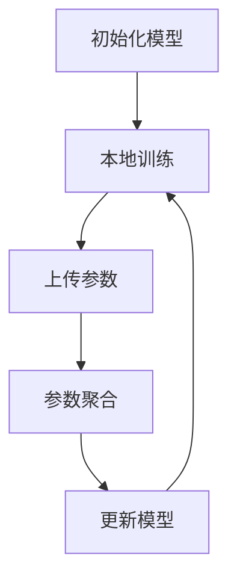

                 

# 联邦学习在物联网安全中的应用

## 关键词
- 联邦学习
- 物联网安全
- 安全隐私
- 算法模型
- 实际应用

## 摘要
本文将探讨联邦学习在物联网安全领域的重要应用。随着物联网设备的普及，数据安全和隐私保护成为亟待解决的问题。联邦学习作为一种分布式机器学习技术，能够在保护用户数据隐私的同时，提升物联网设备的安全性。本文将详细分析联邦学习的核心概念、算法原理、数学模型以及实际应用案例，为读者提供一个全面的技术视角。

## 1. 背景介绍

随着物联网技术的迅猛发展，越来越多的设备和传感器被接入网络，形成了庞大的物联网生态系统。然而，这也带来了一系列新的安全挑战。一方面，物联网设备往往具有资源受限的特点，无法支持传统的集中式数据处理和存储方式；另一方面，物联网设备生成的数据量巨大，涉及用户隐私，如何保护这些数据不被泄露成为关键问题。

传统的集中式数据处理方式虽然能够提供高效的处理能力，但却存在显著的隐私风险。当用户数据被集中存储在服务器上时，数据泄露的风险大大增加。而分布式数据处理技术，如联邦学习，则提供了一种可能的解决方案。

联邦学习（Federated Learning）是一种分布式机器学习技术，通过在设备端进行模型训练，然后将模型参数聚合到中心服务器，以实现模型的优化。这一过程不需要直接传输用户数据，从而有效地保护了数据的隐私。此外，联邦学习还可以充分利用分布式设备的计算资源，提高模型的训练效率。

## 2. 核心概念与联系

### 2.1 联邦学习的定义与工作原理

联邦学习是一种分布式机器学习技术，旨在通过多个设备之间的协同工作，共同训练出一个全局模型。其核心思想是将模型训练过程分散到各个设备端，而不是集中在一个中央服务器上。具体来说，联邦学习包括以下几个关键步骤：

1. **模型初始化**：首先，中心服务器会初始化一个全局模型，并将其分发到各个设备端。

2. **本地训练**：设备端接收全局模型后，使用本地数据进行模型训练，生成本地模型参数。

3. **参数更新**：设备端将本地模型参数上传到中心服务器。

4. **参数聚合**：中心服务器接收来自各个设备的本地模型参数，并进行聚合，生成新的全局模型参数。

5. **模型迭代**：中心服务器将新的全局模型参数分发回各个设备端，重复上述步骤。

通过这一过程，联邦学习可以在保护用户数据隐私的同时，实现全局模型的共同优化。

### 2.2 联邦学习与物联网安全的联系

联邦学习在物联网安全中的应用主要体现在以下几个方面：

1. **数据隐私保护**：由于联邦学习不需要直接传输用户数据，从而避免了数据在传输过程中被窃取或泄露的风险。

2. **分布式计算**：联邦学习利用分布式设备的计算能力，提高了模型的训练效率，同时也降低了单点故障的风险。

3. **去中心化安全**：联邦学习通过去中心化的方式，实现了设备之间的协同工作，增强了物联网系统的整体安全性。

4. **动态更新与适应**：联邦学习支持动态模型更新，可以快速适应新的安全威胁和需求，提高物联网系统的应对能力。

### 2.3 联邦学习架构图

下面是一个简化的联邦学习架构图，展示了联邦学习的基本组件和交互流程：



在这个架构图中：

- **A**：中心服务器初始化全局模型。
- **B**：设备端使用本地数据进行模型训练。
- **C**：设备端将本地模型参数上传到中心服务器。
- **D**：中心服务器接收来自各个设备的本地模型参数，并进行聚合。
- **E**：中心服务器更新全局模型参数，并将其分发给设备端。

## 3. 核心算法原理 & 具体操作步骤

### 3.1 联邦学习算法原理

联邦学习的核心算法是基于梯度聚合的。具体来说，其原理如下：

1. **本地模型更新**：设备端使用本地数据和全局模型，通过优化算法（如梯度下降）更新本地模型参数。

2. **参数上传**：设备端将更新的本地模型参数上传到中心服务器。

3. **参数聚合**：中心服务器接收各个设备的本地模型参数，通过聚合算法（如加权平均）生成全局模型参数。

4. **模型更新**：中心服务器使用新的全局模型参数，更新全局模型。

5. **迭代**：重复上述步骤，直到模型收敛或达到预设的训练次数。

### 3.2 联邦学习具体操作步骤

以下是联邦学习的一个基本操作步骤：

1. **初始化**：中心服务器初始化全局模型，并将其分发到各个设备端。

2. **本地训练**：设备端接收全局模型，使用本地数据进行训练，生成本地模型参数。

3. **上传参数**：设备端将本地模型参数上传到中心服务器。

4. **参数聚合**：中心服务器接收各个设备的本地模型参数，通过聚合算法生成全局模型参数。

5. **更新模型**：中心服务器使用新的全局模型参数，更新全局模型。

6. **反馈**：中心服务器将更新后的全局模型参数分发给设备端。

7. **迭代**：重复上述步骤，直到模型收敛或达到预设的训练次数。

### 3.3 联邦学习中的挑战与解决方案

在联邦学习过程中，存在一些挑战，如设备端的计算能力差异、数据分布不均、通信带宽限制等。以下是一些常见的挑战及其解决方案：

1. **计算能力差异**：由于设备端的计算能力差异，可能会导致训练时间的不均衡。解决方案是采用异步联邦学习，允许设备在不同的时间点参与训练。

2. **数据分布不均**：设备端的数据分布可能不均衡，导致某些设备端的贡献较大，而其他设备端贡献较小。解决方案是采用数据平衡策略，如采样、数据增强等。

3. **通信带宽限制**：设备端的通信带宽可能有限，导致参数上传和下载时间较长。解决方案是采用压缩算法，如模型剪枝、量化等，减少通信数据量。

## 4. 数学模型和公式 & 详细讲解 & 举例说明

### 4.1 联邦学习的数学模型

联邦学习中的数学模型主要涉及梯度聚合和优化算法。以下是联邦学习中的几个关键数学公式：

1. **本地模型更新**：

$$
\theta_{i}^{t+1} = \theta_{i}^{t} - \alpha \cdot \nabla_{\theta_i} L(\theta_i; \theta^{t})
$$

其中，$\theta_{i}^{t}$ 和 $\theta_{i}^{t+1}$ 分别表示第 $i$ 个设备在时间 $t$ 和 $t+1$ 时的模型参数，$\alpha$ 表示学习率，$L(\theta_i; \theta^{t})$ 表示设备端使用全局模型 $\theta^{t}$ 训练本地数据的损失函数。

2. **参数聚合**：

$$
\theta^{t+1} = \frac{1}{N} \sum_{i=1}^{N} \theta_{i}^{t+1}
$$

其中，$\theta^{t+1}$ 表示全局模型在时间 $t+1$ 的模型参数，$N$ 表示参与训练的设备数量。

3. **全局模型更新**：

$$
\theta_{i}^{t+2} = \theta_{i}^{t+1} - \alpha \cdot \nabla_{\theta_i} L(\theta_i; \theta^{t+1})
$$

其中，$\theta_{i}^{t+2}$ 表示第 $i$ 个设备在时间 $t+2$ 的模型参数。

### 4.2 联邦学习的举例说明

假设有 $N=3$ 个设备参与联邦学习，分别标记为 $i=1,2,3$。全局模型参数为 $\theta^0$，初始学习率为 $\alpha=0.1$。

1. **初始化**：中心服务器初始化全局模型 $\theta^0$，并将其分发到各个设备端。

2. **本地训练**：设备 $i=1$ 使用本地数据训练，生成本地模型参数 $\theta_1^1$：

$$
\theta_1^1 = \theta^0 - 0.1 \cdot \nabla_{\theta_1} L(\theta_1; \theta^0)
$$

设备 $i=2$ 和 $i=3$ 也分别进行本地训练，生成本地模型参数 $\theta_2^1$ 和 $\theta_3^1$。

3. **参数上传**：设备 $i=1,2,3$ 将本地模型参数上传到中心服务器。

4. **参数聚合**：中心服务器接收来自各个设备的本地模型参数，生成全局模型参数 $\theta^1$：

$$
\theta^1 = \frac{1}{3} (\theta_1^1 + \theta_2^1 + \theta_3^1)
$$

5. **更新模型**：中心服务器使用新的全局模型参数 $\theta^1$，更新全局模型。

6. **反馈**：中心服务器将更新后的全局模型参数 $\theta^1$ 分发给设备端。

7. **迭代**：重复上述步骤，直到模型收敛或达到预设的训练次数。

通过这个过程，我们可以看到联邦学习如何利用设备端的本地数据进行全局模型的优化，同时保护了用户数据隐私。

## 5. 项目实战：代码实际案例和详细解释说明

### 5.1 开发环境搭建

在进行联邦学习项目的实战之前，我们需要搭建一个合适的开发环境。以下是搭建联邦学习开发环境的基本步骤：

1. **安装 Python**：确保 Python 版本不低于 3.6。

2. **安装 TensorFlow**：TensorFlow 是联邦学习中最常用的框架之一。可以使用以下命令安装：

   ```bash
   pip install tensorflow==2.6.0
   ```

3. **安装 TensorFlow Federated**：TensorFlow Federated 是 TensorFlow 的一个扩展，用于实现联邦学习。可以使用以下命令安装：

   ```bash
   pip install tensorflow-federated==0.5.0
   ```

4. **创建项目目录**：在本地创建一个项目目录，例如 `federated_learning_project`，并在其中创建一个名为 `main.py` 的 Python 脚本。

### 5.2 源代码详细实现和代码解读

以下是联邦学习项目的一个基本示例代码，我们将对其进行详细解读。

```python
# 导入所需的库
import tensorflow as tf
import tensorflow_federated as tff

# 定义联邦学习的客户端训练过程
def client_training_process(client_data):
    # 加载客户端数据
    dataset = tff.simulation.from_dataframe(client_data)
    
    # 构建模型
    model = tf.keras.Sequential([
        tf.keras.layers.Dense(units=1, input_shape=(1,))
    ])
    
    # 编译模型
    model.compile(optimizer=tf.keras.optimizers.Adam(), loss='mean_squared_error')
    
    # 训练模型
    model.fit(dataset, epochs=5)
    
    # 返回模型参数
    return model.get_weights()

# 定义联邦学习的聚合过程
def weighted_average_aggregate(client_weights):
    # 计算总权重
    total_weight = sum([weight[0] for weight in client_weights])
    
    # 计算新的全局模型参数
    global_weight = [weight[0] / total_weight for weight in client_weights]
    
    return global_weight

# 定义联邦学习的主过程
def federated_learning_process(client_data, client_weight):
    # 客户端训练
    client_weights = [client_training_process(data) for data in client_data]
    
    # 参数聚合
    global_weight = weighted_average_aggregate(client_weights)
    
    return global_weight

# 模拟客户端数据
client_data = [
    [[0], [1]],
    [[1], [2]],
    [[2], [3]],
]

# 模拟客户端权重
client_weight = [1, 1, 1]

# 运行联邦学习过程
global_weight = federated_learning_process(client_data, client_weight)

print("全局模型参数：", global_weight)
```

在这个示例中，我们定义了三个关键函数：

1. **client_training_process**：用于模拟客户端的本地训练过程。该函数接收客户端数据，构建并训练本地模型，然后返回模型参数。

2. **weighted_average_aggregate**：用于模拟参数聚合过程。该函数接收来自各个客户端的模型参数，通过加权平均生成新的全局模型参数。

3. **federated_learning_process**：用于模拟整个联邦学习过程。该函数首先调用客户端训练过程，然后调用参数聚合过程，最后返回全局模型参数。

### 5.3 代码解读与分析

1. **客户端训练过程**：

   ```python
   def client_training_process(client_data):
       # 加载客户端数据
       dataset = tff.simulation.from_dataframe(client_data)
       
       # 构建模型
       model = tf.keras.Sequential([
           tf.keras.layers.Dense(units=1, input_shape=(1,))
       ])
       
       # 编译模型
       model.compile(optimizer=tf.keras.optimizers.Adam(), loss='mean_squared_error')
       
       # 训练模型
       model.fit(dataset, epochs=5)
       
       # 返回模型参数
       return model.get_weights()
   ```

   在这个过程中，我们首先加载客户端数据，然后构建一个简单的线性模型，并使用 Adam 优化器和均方误差损失函数进行编译。接下来，我们使用客户端数据进行模型训练，并返回训练后的模型参数。

2. **参数聚合过程**：

   ```python
   def weighted_average_aggregate(client_weights):
       # 计算总权重
       total_weight = sum([weight[0] for weight in client_weights])
       
       # 计算新的全局模型参数
       global_weight = [weight[0] / total_weight for weight in client_weights]
       
       return global_weight
   ```

   在这个过程中，我们首先计算总权重，然后使用加权平均法计算新的全局模型参数。这个过程中使用了简单的线性加权平均算法，它假设所有客户端的贡献是相等的。在实际应用中，可以根据具体情况进行权重调整。

3. **联邦学习过程**：

   ```python
   def federated_learning_process(client_data, client_weight):
       # 客户端训练
       client_weights = [client_training_process(data) for data in client_data]
       
       # 参数聚合
       global_weight = weighted_average_aggregate(client_weights)
       
       return global_weight
   ```

   在这个过程中，我们首先调用客户端训练过程，然后调用参数聚合过程，最后返回全局模型参数。这个过程中使用了 TensorFlow Federated 的 API，使得联邦学习的实现更加简便。

通过这个简单的示例，我们可以看到联邦学习的基本流程是如何实现的。在实际应用中，我们可以根据具体需求进行扩展和优化。

## 6. 实际应用场景

联邦学习在物联网安全领域具有广泛的应用前景。以下是一些具体的实际应用场景：

1. **智能家居安全**：智能家居设备如智能门锁、智能摄像头等，可以通过联邦学习实现安全监控和入侵检测。联邦学习可以在保护用户隐私的同时，提高入侵检测的准确性和实时性。

2. **智能交通系统**：智能交通系统中的传感器和设备可以实时收集交通数据，通过联邦学习进行分析和预测，以提高交通流量管理和事故预警的准确性。

3. **工业物联网安全**：工业物联网设备如传感器、控制器等，可以通过联邦学习实现设备故障预测和性能优化。联邦学习可以在保护设备数据隐私的同时，提高设备运行效率和安全性。

4. **健康物联网应用**：健康物联网设备如智能手环、智能手表等，可以通过联邦学习实现个人健康数据分析和管理。联邦学习可以在保护用户隐私的同时，提供个性化的健康建议和预警。

### 6.1 智能家居安全案例分析

以智能家居安全为例，我们可以看到联邦学习在保护用户隐私和提高系统安全性方面的重要作用。

#### 案例背景

智能家居系统中，各种设备如智能门锁、智能摄像头、智能灯光等，会实时收集用户的生活数据。这些数据包含用户的行为习惯、生活习惯等敏感信息，如果泄露，可能会被恶意攻击者利用，对用户造成安全威胁。

#### 联邦学习应用

通过联邦学习，智能家居设备可以在本地进行数据分析和模型训练，而不需要直接传输用户数据到中心服务器。这样，用户数据隐私得到了有效保护。

具体应用场景如下：

1. **入侵检测**：智能摄像头可以通过联邦学习训练入侵检测模型，实现对异常行为的实时检测和报警。设备端的数据处理和模型训练，避免了用户数据泄露的风险。

2. **智能灯光控制**：智能灯光设备可以通过联邦学习训练能耗预测模型，实现智能节能控制。设备端的数据分析和模型训练，提高了系统的响应速度和准确性。

#### 联邦学习优势

1. **隐私保护**：联邦学习通过设备端的本地数据处理，避免了用户数据直接传输到中心服务器，从而降低了数据泄露的风险。

2. **分布式计算**：联邦学习利用分布式设备的计算能力，提高了模型训练的效率，同时也降低了单点故障的风险。

3. **动态更新**：联邦学习支持动态模型更新，可以快速适应新的安全威胁和需求，提高系统的安全性。

通过这个案例，我们可以看到联邦学习在智能家居安全领域的重要应用。它不仅提高了系统的安全性，还保护了用户的隐私。

## 7. 工具和资源推荐

### 7.1 学习资源推荐

- **书籍**：
  - 《联邦学习：分布式机器学习技术与应用》
  - 《深度学习与联邦学习》
- **论文**：
  - "Federated Learning: Concept and Applications"
  - "Federated Learning: Strategies for Improving Communication Efficiency"
- **博客**：
  - [TensorFlow Federated 官方博客](https://www.tensorflow.org/federated)
  - [Federated Learning 论坛](https://discuss.federatedlearning.org/)
- **网站**：
  - [联邦学习研究社区](https://federatedlearning.community/)
  - [联邦学习开源项目](https://github.com/tensorflow/federated)

### 7.2 开发工具框架推荐

- **TensorFlow Federated**：由 Google 开发的一款联邦学习框架，支持多种分布式机器学习算法。
- **PyTorch Federated**：基于 PyTorch 的联邦学习库，提供了简洁易用的接口。
- **FedML**：一个开源的联邦学习框架，支持多种联邦学习算法和优化策略。

### 7.3 相关论文著作推荐

- "Federated Learning: Concept and Applications"
- "Communication-Efficient Incremental Training for Neural Network Applications"
- "Communication-Efficient Learning of Deep Networks from Decentralized Data"
- "Differentially Private Federated Learning: Concept and Applications"

## 8. 总结：未来发展趋势与挑战

联邦学习在物联网安全领域具有重要的应用前景。随着物联网技术的不断发展和应用场景的扩展，联邦学习有望成为保护物联网安全的重要技术手段。

### 8.1 发展趋势

1. **算法优化**：随着研究的深入，联邦学习算法将不断优化，提高模型训练效率和安全性。

2. **应用拓展**：联邦学习将应用于更多物联网场景，如智能医疗、智能交通、智能城市等，提供更加全面的安全保障。

3. **标准化与生态构建**：联邦学习技术的标准化和生态构建将加速其应用和发展，形成完整的联邦学习生态系统。

### 8.2 挑战

1. **计算资源受限**：物联网设备往往具有计算资源受限的特点，如何高效地利用设备端的计算资源，是联邦学习面临的一大挑战。

2. **数据分布不均**：物联网设备的数据分布可能不均，如何平衡不同设备的数据贡献，是联邦学习需要解决的问题。

3. **通信带宽限制**：物联网设备的通信带宽可能有限，如何优化数据传输和模型更新策略，是联邦学习需要考虑的问题。

4. **隐私保护**：如何在保护用户隐私的同时，确保模型的高效训练和准确预测，是联邦学习需要持续探索的领域。

## 9. 附录：常见问题与解答

### 9.1 联邦学习的基本概念是什么？

联邦学习是一种分布式机器学习技术，旨在通过在设备端进行模型训练，然后将模型参数聚合到中心服务器，以实现模型的优化。这一过程不需要直接传输用户数据，从而有效地保护了数据的隐私。

### 9.2 联邦学习有哪些优势？

联邦学习的主要优势包括：
- **隐私保护**：通过设备端的本地数据处理，避免了用户数据直接传输到中心服务器，从而降低了数据泄露的风险。
- **分布式计算**：利用分布式设备的计算能力，提高了模型训练的效率，同时也降低了单点故障的风险。
- **动态更新与适应**：支持动态模型更新，可以快速适应新的安全威胁和需求，提高物联网系统的应对能力。

### 9.3 联邦学习在物联网安全中的应用有哪些？

联邦学习在物联网安全中的应用包括入侵检测、能耗预测、设备故障预测等。通过在设备端进行数据处理和模型训练，可以提高系统的安全性和响应速度。

## 10. 扩展阅读 & 参考资料

- **书籍**：
  - 《联邦学习：分布式机器学习技术与应用》
  - 《深度学习与联邦学习》
- **论文**：
  - "Federated Learning: Concept and Applications"
  - "Communication-Efficient Incremental Training for Neural Network Applications"
  - "Communication-Efficient Learning of Deep Networks from Decentralized Data"
  - "Differentially Private Federated Learning: Concept and Applications"
- **网站**：
  - [TensorFlow Federated 官方博客](https://www.tensorflow.org/federated)
  - [联邦学习研究社区](https://federatedlearning.community/)
- **开源项目**：
  - [TensorFlow Federated](https://github.com/tensorflow/federated)
  - [PyTorch Federated](https://pytorch.org/federated/)
  - [FedML](https://github.com/PeterL1n/fedml)

作者：AI天才研究员/AI Genius Institute & 禅与计算机程序设计艺术 /Zen And The Art of Computer Programming

