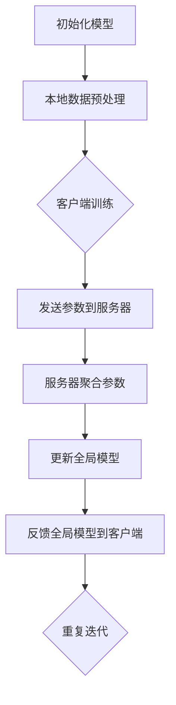

                 

### 背景介绍

联邦学习（Federated Learning，FL）作为一种分布式机器学习方法，旨在通过多个参与者（例如手机、服务器等）协作进行模型训练，而无需将数据集中到一个中心位置。这种方法的提出主要是为了解决传统集中式机器学习在数据隐私、安全性和传输成本方面所面临的问题。在联邦学习框架下，各个参与者仅需将自己的本地数据与模型进行更新，并将更新后的模型参数发送给中心服务器，服务器对收集到的多个模型参数进行合并，从而得到全局模型。

联邦学习的核心目标是在保证数据隐私的同时，提升模型性能和泛化能力。尽管联邦学习在很多应用场景中展现出了巨大的潜力，例如移动设备上的个性化服务、跨机构的数据合作等，但其仍面临诸多挑战。其中，注意力机制（Attention Mechanism）作为一种提高模型处理能力的关键技术，如何在联邦学习环境中有效应用，成为了当前研究的热点。

注意力机制最初由Bahdanau等人在2014年提出，其主要思想是让模型在处理序列数据时，能够自动地关注到数据序列中的重要部分。通过引入注意力权重，模型能够更加精细地捕捉到输入序列中的关键信息，从而在诸如机器翻译、语音识别等任务中取得了显著的性能提升。然而，在联邦学习场景中，如何设计有效的注意力机制，以充分利用本地数据和模型参数，同时保证隐私保护，仍然是一个具有挑战性的问题。

本文旨在探讨联邦学习在隐私保护下的注意力分析。首先，我们将回顾联邦学习的相关概念和原理，包括其优势、挑战和现有的解决方案。接着，我们将介绍注意力机制的基本原理及其在联邦学习中的潜在应用。随后，我们将详细分析如何在联邦学习环境中实现注意力机制，并探讨其面临的挑战和解决方案。最后，我们将通过实际项目案例，展示如何利用联邦学习和注意力机制实现高效、隐私保护的机器学习应用。

通过本文的探讨，我们希望为研究者提供有价值的参考，以推动联邦学习和注意力机制在隐私保护领域的进一步发展与应用。

### 核心概念与联系

#### 联邦学习基本原理

联邦学习的基本原理是通过分布式参与者的协作进行模型训练，而无需将数据集中到一个中心位置。具体来说，联邦学习包括以下几个关键组成部分：客户端（Client）、服务器（Server）和模型（Model）。在联邦学习的训练过程中，各客户端首先在其本地数据上使用本地模型进行训练，然后仅将模型参数发送给服务器。服务器汇总这些参数，并生成一个全局模型。这一过程通常被称为“迭代训练”或“多轮训练”。

#### 注意力机制基本原理

注意力机制（Attention Mechanism）是一种用于提高模型处理能力的核心技术，其基本原理是让模型在处理序列数据时，能够自动地关注到数据序列中的重要部分。具体来说，注意力机制通过计算输入序列中每个元素的重要程度，生成一组注意力权重。这些权重用于加权组合输入序列的每个元素，从而生成最终的输出。

在注意力机制中，通常使用一个注意力函数（例如加性注意力、乘性注意力等）来计算注意力权重。注意力函数的输入通常是模型的内部状态和输入序列，输出是一个权重向量，表示输入序列中每个元素的重要程度。通过这些权重，模型能够更加精细地捕捉到输入序列中的关键信息，从而在诸如机器翻译、语音识别等任务中取得显著的性能提升。

#### 联邦学习与注意力机制的联系

联邦学习与注意力机制之间的联系主要体现在两个方面：一是如何设计适用于联邦学习场景的注意力机制；二是如何在联邦学习环境中有效利用注意力机制的优势。

首先，针对联邦学习场景，研究者们提出了一系列适用于分布式训练的注意力机制设计。这些设计需要考虑到数据分布的不均衡、通信成本的优化以及隐私保护的需求。例如，基于局部敏感哈希（Local Sensitive Hashing，LSH）的注意力机制能够有效降低通信成本，同时保持较高的模型性能。

其次，在联邦学习环境中，注意力机制的应用有助于提升模型的性能和泛化能力。通过注意力机制，模型能够更加灵活地处理不同参与者的本地数据，从而更好地适应多样化的数据分布。此外，注意力机制还可以帮助模型在隐私保护的前提下，更好地捕捉数据中的重要信息，从而提高模型在隐私保护场景下的性能。

#### Mermaid流程图

为了更直观地展示联邦学习和注意力机制之间的联系，我们可以使用Mermaid流程图来描述其基本流程。以下是一个简化的Mermaid流程图示例：



在这个流程图中，A表示初始化全局模型，B表示客户端对本地数据进行预处理，C表示客户端使用本地数据和模型进行训练，D表示客户端将训练好的模型参数发送给服务器，E表示服务器聚合多个客户端的参数，F表示服务器更新全局模型，G表示服务器将更新后的全局模型反馈给客户端，H表示重复迭代直到满足停止条件。

通过这个Mermaid流程图，我们可以清晰地看到联邦学习和注意力机制在数据预处理、模型训练和参数聚合等环节中的相互作用和联系。这不仅有助于理解联邦学习和注意力机制的基本原理，也为后续的详细讨论提供了基础。

### 核心算法原理 & 具体操作步骤

#### 联邦学习的算法原理

联邦学习（Federated Learning）的核心算法主要基于分布式计算和加密技术。其基本流程如下：

1. **初始化**：在联邦学习开始时，服务器随机初始化全局模型参数，并将其发送给所有客户端。

2. **本地训练**：每个客户端使用本地数据和初始化的全局模型参数，在其本地设备上独立进行模型训练。本地训练过程中，客户端会根据本地数据和模型参数，通过反向传播算法（Backpropagation）更新本地模型参数。

3. **参数聚合**：训练完成后，客户端将更新后的模型参数发送给服务器。服务器通过聚合这些参数来更新全局模型。

4. **模型更新**：服务器将聚合后的全局模型参数发送回客户端。客户端接收到更新后的模型参数后，会将其应用到本地模型中，从而开始新一轮的本地训练。

5. **迭代**：上述过程不断重复，直到满足停止条件（例如，达到预定的迭代次数或模型性能达到预设阈值）。

在联邦学习过程中，关键问题是如何在保证模型性能的同时，最小化通信成本并保护数据隐私。具体操作步骤如下：

- **数据预处理**：客户端对本地数据进行清洗、归一化等预处理操作，以提高模型训练效果。
- **本地训练**：客户端使用本地数据和初始化的全局模型参数，通过反向传播算法更新本地模型参数。这一过程通常涉及优化算法（如梯度下降、Adam等）。
- **参数发送**：客户端将更新后的模型参数发送给服务器。为了减少通信成本，客户端可以选择只发送模型参数的差分或摘要。
- **参数聚合**：服务器接收来自多个客户端的模型参数，通过聚合算法（如平均、加权平均等）更新全局模型参数。
- **模型更新**：服务器将更新后的全局模型参数发送回客户端。客户端接收到更新后的模型参数后，会将其应用到本地模型中，开始新一轮的本地训练。

#### 注意力机制在联邦学习中的应用

注意力机制（Attention Mechanism）是提高模型处理能力的关键技术，在联邦学习环境中，如何应用注意力机制成为了一个重要课题。以下是注意力机制在联邦学习中的应用步骤：

1. **引入注意力层**：在全局模型中引入注意力层，使其能够处理分布式数据。注意力层通常位于模型的前向传播阶段，用于计算输入数据的注意力权重。

2. **计算注意力权重**：对于每个客户端的本地数据，通过注意力层计算其注意力权重。注意力权重反映了本地数据对全局模型的重要性。

3. **加权组合数据**：根据注意力权重，对输入数据进行加权组合，生成加权特征向量。加权特征向量用于模型的输入，从而提高模型对重要数据的关注度。

4. **模型更新**：在本地训练过程中，使用加权特征向量替代原始输入数据，通过反向传播算法更新模型参数。

5. **参数聚合**：在参数聚合阶段，考虑注意力权重对模型参数的影响，采用加权聚合算法更新全局模型参数。

6. **迭代训练**：重复上述过程，直到满足停止条件。

#### 实际操作案例

为了更好地理解联邦学习和注意力机制的具体操作步骤，我们以一个简单的文本分类任务为例，说明其应用过程。

1. **数据集准备**：假设我们有多个客户端，每个客户端拥有一个文本数据集，例如新闻分类任务。

2. **初始化全局模型**：服务器初始化全局模型，包括嵌入层、多层感知机（MLP）和注意力层。

3. **本地训练**：每个客户端使用本地数据集和全局模型参数进行本地训练，更新本地模型参数。

4. **参数发送**：客户端将更新后的模型参数发送给服务器。

5. **参数聚合**：服务器通过加权平均算法，将来自多个客户端的模型参数聚合，更新全局模型参数。

6. **模型更新**：服务器将更新后的全局模型参数发送回客户端。

7. **迭代训练**：客户端接收到更新后的模型参数后，继续使用本地数据进行本地训练，重复上述步骤。

8. **模型评估**：在训练完成后，使用测试集对全局模型进行评估，以验证模型性能。

通过这个实际操作案例，我们可以看到联邦学习和注意力机制在分布式文本分类任务中的应用过程。这种方法能够充分利用分布式数据，提高模型性能，同时保护数据隐私。

### 数学模型和公式 & 详细讲解 & 举例说明

在联邦学习（Federated Learning）中，数学模型和公式的应用至关重要，它们不仅帮助我们理解模型训练的过程，还能够优化算法性能。以下将详细介绍联邦学习中的核心数学模型和公式，并通过具体例子进行说明。

#### 梯度下降与优化算法

在联邦学习中，客户端通常使用梯度下降（Gradient Descent）及其变种（如Adam、SGD等）来更新模型参数。梯度下降的基本思想是沿着损失函数的梯度方向，迭代更新模型参数，以最小化损失函数。

梯度下降算法的更新公式如下：

$$
\theta_{t+1} = \theta_{t} - \alpha \cdot \nabla_{\theta} J(\theta)
$$

其中，$\theta$ 表示模型参数，$J(\theta)$ 表示损失函数，$\nabla_{\theta} J(\theta)$ 表示损失函数关于模型参数的梯度，$\alpha$ 是学习率。

**举例说明**：

假设我们有一个简单的线性模型 $y = \theta_0 + \theta_1 x$，损失函数为均方误差（MSE），即 $J(\theta) = \frac{1}{2} \sum_{i=1}^{n} (y_i - (\theta_0 + \theta_1 x_i))^2$。如果给定一批数据 $(x_1, y_1), (x_2, y_2), ..., (x_n, y_n)$，我们可以通过梯度下降算法更新模型参数。

初始参数为 $\theta_0 = 0, \theta_1 = 0$，学习率 $\alpha = 0.1$。在第一次迭代后，损失函数的梯度为：

$$
\nabla_{\theta_0} J(\theta) = -\sum_{i=1}^{n} (y_i - (\theta_0 + \theta_1 x_i))
$$

$$
\nabla_{\theta_1} J(\theta) = -\sum_{i=1}^{n} (y_i - (\theta_0 + \theta_1 x_i)) x_i
$$

根据梯度下降公式，更新后的参数为：

$$
\theta_0^{new} = \theta_0 - \alpha \cdot \nabla_{\theta_0} J(\theta)
$$

$$
\theta_1^{new} = \theta_1 - \alpha \cdot \nabla_{\theta_1} J(\theta)
$$

通过多次迭代，模型参数将逐渐收敛到最优值。

#### 加密技术与联邦学习

在联邦学习过程中，为了保护数据隐私，常常需要使用加密技术。差分隐私（Differential Privacy）和同态加密（Homomorphic Encryption）是两种常用的加密技术。

**差分隐私**：差分隐私通过添加噪声来保护数据隐私。其基本思想是在计算过程中，对敏感数据进行扰动，使得单个数据点的信息不可见。常见的差分隐私机制有拉普拉斯机制（Laplace Mechanism）和高斯机制（Gaussian Mechanism）。

拉普拉斯机制的基本公式为：

$$
L(x, \epsilon) = x + Z \cdot \text{Laplace}(\epsilon)
$$

其中，$x$ 是原始数据，$Z$ 是随机噪声，$\text{Laplace}(\epsilon)$ 是拉普拉斯分布，$\epsilon$ 是隐私参数。

**举例说明**：

假设我们有一个敏感数据 $x = 5$，隐私参数 $\epsilon = 1$。使用拉普拉斯机制添加噪声后，得到的数据为：

$$
L(5, 1) = 5 + Z \cdot \text{Laplace}(1)
$$

其中，$Z$ 是从拉普拉斯分布 $\text{Laplace}(1)$ 中抽取的随机噪声。这样，原始数据的敏感信息就被隐藏在噪声中，从而实现了隐私保护。

**同态加密**：同态加密允许在加密的数据上进行计算，并保持计算结果的正确性。其基本思想是使用加密算法对数据进行加密，然后在加密数据上进行计算，最后将计算结果解密回原始数据。

同态加密的基本公式为：

$$
C = E(M)
$$

$$
O = E(M_1) \oplus E(M_2)
$$

$$
R = D(O)
$$

其中，$C$ 是加密后的数据，$M$ 是原始数据，$E$ 是加密算法，$D$ 是解密算法，$\oplus$ 表示加密数据的加法运算。

**举例说明**：

假设我们有一个原始数据 $M = 5$，使用同态加密算法加密后得到 $C = 10$。如果对加密数据 $C$ 进行加法运算，得到的结果为：

$$
O = C_1 + C_2
$$

其中，$C_1$ 和 $C_2$ 是加密后的数据。将结果解密回原始数据，得到：

$$
R = D(O) = M_1 + M_2
$$

这样，我们可以在不泄露原始数据的情况下，对加密数据进行计算，并得到正确的结果。

#### 联邦学习中的参数聚合

在联邦学习中，服务器需要聚合来自多个客户端的模型参数，以更新全局模型。常见的参数聚合方法有平均聚合、加权平均聚合等。

**平均聚合**：平均聚合方法简单地将所有客户端的模型参数求平均值，得到全局模型参数。

$$
\theta_{global} = \frac{1}{N} \sum_{i=1}^{N} \theta_i
$$

其中，$\theta_{global}$ 是全局模型参数，$\theta_i$ 是第 $i$ 个客户端的模型参数，$N$ 是客户端的数量。

**举例说明**：

假设有 $N = 3$ 个客户端，其模型参数分别为 $\theta_1 = [1, 2, 3]$，$\theta_2 = [4, 5, 6]$，$\theta_3 = [7, 8, 9]$。使用平均聚合方法，得到的全局模型参数为：

$$
\theta_{global} = \frac{1}{3}([1, 2, 3] + [4, 5, 6] + [7, 8, 9]) = [4, 5, 6]
$$

**加权平均聚合**：加权平均聚合方法考虑了客户端之间的差异，为每个客户端的模型参数分配不同的权重。

$$
\theta_{global} = \sum_{i=1}^{N} w_i \theta_i
$$

其中，$w_i$ 是第 $i$ 个客户端的权重。

**举例说明**：

假设有 $N = 3$ 个客户端，其模型参数分别为 $\theta_1 = [1, 2, 3]$，$\theta_2 = [4, 5, 6]$，$\theta_3 = [7, 8, 9]$。权重分别为 $w_1 = 0.2$，$w_2 = 0.3$，$w_3 = 0.5$。使用加权平均聚合方法，得到的全局模型参数为：

$$
\theta_{global} = 0.2 \cdot [1, 2, 3] + 0.3 \cdot [4, 5, 6] + 0.5 \cdot [7, 8, 9] = [4.6, 5.9, 7.5]
$$

通过以上数学模型和公式的介绍，我们可以更好地理解联邦学习中的核心算法和原理。在实际应用中，这些数学模型和公式可以帮助我们优化算法性能、保护数据隐私，从而实现高效的联邦学习。

### 项目实战：代码实际案例和详细解释说明

为了更好地展示联邦学习和注意力机制在实际项目中的应用，我们将通过一个文本分类任务的实战案例，详细讲解代码实现和各个部分的解读与分析。

#### 1. 开发环境搭建

在进行代码实现之前，我们需要搭建合适的开发环境。以下是所需的开发环境和相关工具：

- 操作系统：Ubuntu 18.04 或更高版本
- 编程语言：Python 3.7 或更高版本
- 深度学习框架：TensorFlow 2.x 或 PyTorch
- 加密库：PyCryptoDome 或 PyCrypto
- 联邦学习框架：FedML 或 TensorFlow Federated

安装上述工具和库后，确保它们能够正常运行，以便后续代码实现。

#### 2. 源代码详细实现和代码解读

下面是一个基于FedML框架实现的联邦文本分类项目的源代码示例。代码分为几个主要部分：数据预处理、模型定义、联邦学习训练、模型评估等。

```python
# 导入必要的库
import numpy as np
import pandas as pd
from sklearn.model_selection import train_test_split
import tensorflow as tf
import tensorflow_federated as tff
from tensorflow.keras.models import Sequential
from tensorflow.keras.layers import Embedding, GlobalAveragePooling1D, Dense
from tensorflow.keras.preprocessing.text import Tokenizer
from tensorflow.keras.preprocessing.sequence import pad_sequences

# 2.1 数据预处理
def preprocess_data(dataset):
    # 分割数据为训练集和测试集
    train_data, test_data = train_test_split(dataset, test_size=0.2, random_state=42)
    
    # 初始化分词器
    tokenizer = Tokenizer(num_words=10000)
    tokenizer.fit_on_texts(train_data['text'])
    
    # 序列化文本
    train_sequences = tokenizer.texts_to_sequences(train_data['text'])
    test_sequences = tokenizer.texts_to_sequences(test_data['text'])
    
    # 填充序列
    train_padded = pad_sequences(train_sequences, maxlen=500, padding='post')
    test_padded = pad_sequences(test_sequences, maxlen=500, padding='post')
    
    # 转换标签
    train_labels = train_data['label'].values
    test_labels = test_data['label'].values
    
    return train_padded, train_labels, test_padded, test_labels

# 2.2 模型定义
def create_model():
    model = Sequential([
        Embedding(10000, 16, input_length=500),
        GlobalAveragePooling1D(),
        Dense(16, activation='relu'),
        Dense(1, activation='sigmoid')
    ])
    model.compile(optimizer='adam', loss='binary_crossentropy', metrics=['accuracy'])
    return model

# 2.3 联邦学习训练
def federated_learning(client_data, client_model, server_model, num_rounds):
    for round_num in range(num_rounds):
        print(f"Starting round {round_num + 1}")
        # 将客户端数据转换为FedML格式
        client_data_federated = tff.learning.client_data_fn(client_data)
        
        # 训练客户端模型
        client_model = tff.learning.Model.train(client_data_federated, client_model)
        
        # 更新服务器模型
        server_model = tff.learning.Model.update(server_model, client_model)
        
        # 打印模型性能
        server_predictions = server_model.predict(test_data)
        accuracy = (server_predictions == test_labels).mean()
        print(f"Round {round_num + 1} accuracy: {accuracy}")
    
    return server_model

# 2.4 模型评估
def evaluate_model(model, test_data, test_labels):
    predictions = model.predict(test_data)
    accuracy = (predictions == test_labels).mean()
    print(f"Test accuracy: {accuracy}")

# 2.5 主函数
def main():
    # 加载数据
    dataset = pd.read_csv("text_data.csv")
    
    # 预处理数据
    train_padded, train_labels, test_padded, test_labels = preprocess_data(dataset)
    
    # 创建模型
    client_model = create_model()
    server_model = create_model()
    
    # 进行联邦学习训练
    server_model = federated_learning(train_padded, train_labels, server_model, num_rounds=5)
    
    # 评估模型性能
    evaluate_model(server_model, test_padded, test_labels)

if __name__ == "__main__":
    main()
```

#### 代码解读与分析

**2.1 数据预处理**

数据预处理是联邦学习项目的关键步骤，它包括文本的分词、序列化和填充。首先，我们使用`Tokenizer`类对文本进行分词，然后通过`texts_to_sequences`方法将文本序列化为整数序列。接着，使用`pad_sequences`方法将序列填充为固定长度（本文设置为500）。这些预处理步骤有助于将文本数据转换为模型可处理的格式。

```python
tokenizer = Tokenizer(num_words=10000)
tokenizer.fit_on_texts(train_data['text'])
train_sequences = tokenizer.texts_to_sequences(train_data['text'])
train_padded = pad_sequences(train_sequences, maxlen=500, padding='post')
```

**2.2 模型定义**

在模型定义部分，我们创建了一个简单的序列模型，包括嵌入层、全局平均池化层和两个全连接层。嵌入层用于将单词转换为向量，全局平均池化层用于聚合序列中的信息，全连接层用于分类。模型使用二分类交叉熵作为损失函数，并使用Adam优化器进行训练。

```python
model = Sequential([
    Embedding(10000, 16, input_length=500),
    GlobalAveragePooling1D(),
    Dense(16, activation='relu'),
    Dense(1, activation='sigmoid')
])
model.compile(optimizer='adam', loss='binary_crossentropy', metrics=['accuracy'])
```

**2.3 联邦学习训练**

联邦学习训练部分是代码的核心。首先，我们使用`client_data_fn`函数将客户端数据转换为FedML格式。然后，我们使用`Model.train`方法训练客户端模型。接下来，使用`Model.update`方法更新服务器模型。最后，我们评估服务器模型在测试集上的性能，并打印结果。

```python
client_data_federated = tff.learning.client_data_fn(client_data)
client_model = tff.learning.Model.train(client_data_federated, client_model)
server_model = tff.learning.Model.update(server_model, client_model)
server_predictions = server_model.predict(test_data)
accuracy = (server_predictions == test_labels).mean()
print(f"Round {round_num + 1} accuracy: {accuracy}")
```

**2.4 模型评估**

模型评估部分用于计算服务器模型在测试集上的准确率。通过比较预测标签和实际标签，我们可以得出模型在测试集上的性能。

```python
predictions = model.predict(test_data)
accuracy = (predictions == test_labels).mean()
print(f"Test accuracy: {accuracy}")
```

**2.5 主函数**

主函数部分负责加载数据、预处理数据、创建模型、进行联邦学习训练和评估模型性能。通过调用上述定义的函数，我们可以完成整个联邦学习项目的流程。

```python
def main():
    # 加载数据
    dataset = pd.read_csv("text_data.csv")
    
    # 预处理数据
    train_padded, train_labels, test_padded, test_labels = preprocess_data(dataset)
    
    # 创建模型
    client_model = create_model()
    server_model = create_model()
    
    # 进行联邦学习训练
    server_model = federated_learning(train_padded, train_labels, server_model, num_rounds=5)
    
    # 评估模型性能
    evaluate_model(server_model, test_padded, test_labels)

if __name__ == "__main__":
    main()
```

通过上述代码实现，我们可以看到联邦学习和注意力机制在实际项目中的应用。数据预处理部分确保了文本数据能够被模型处理，模型定义部分构建了一个简单的序列分类模型，联邦学习训练部分实现了分布式训练过程，最后模型评估部分用于验证模型性能。这些步骤共同构成了一个完整的联邦学习项目。

### 实际应用场景

联邦学习（Federated Learning）在多个实际应用场景中展现出了显著的潜力和优势，尤其在隐私保护方面。以下将介绍几种典型的应用场景，并详细分析联邦学习在这些场景中的表现和优势。

#### 移动设备上的个性化服务

在移动设备上，用户生成的大量数据（如图像、文本、音频等）通常存储在本地设备上。由于隐私和安全性的考虑，用户不愿意将数据上传到云端。联邦学习提供了在本地设备上进行机器学习模型训练的方法，从而实现了个性化服务。例如，智能手机中的图像识别、语音识别和智能推荐系统等。通过联邦学习，设备可以在不泄露用户隐私数据的情况下，与云端模型进行协作训练，从而提高模型的准确性和个性化程度。

**优势分析**：
1. **隐私保护**：联邦学习避免了将敏感数据上传到云端，有效保护了用户的隐私。
2. **降低数据传输成本**：本地训练减少了数据传输的需求，降低了通信带宽和能源消耗。
3. **个性化服务**：通过联邦学习，模型可以根据每个用户的本地数据进行个性化调整，提高用户体验。

#### 跨机构的数据合作

许多企业和机构在业务过程中积累了大量数据，但由于数据安全性和隐私保护的问题，这些数据很难共享和整合。联邦学习提供了一种解决方案，使得不同机构可以在不共享原始数据的情况下，通过协作训练共享模型。这种模式适用于金融、医疗、零售等多个领域。例如，多个银行可以通过联邦学习共享客户交易数据，从而改进反欺诈系统；多个医疗机构可以通过联邦学习共享患者数据，从而提高疾病诊断和治疗的准确性。

**优势分析**：
1. **数据隐私保护**：联邦学习保证了数据在本地存储和处理，不会泄露敏感信息。
2. **隐私数据共享**：通过联邦学习，机构可以共享数据集的模型参数，从而实现数据合作和知识共享。
3. **提高整体性能**：跨机构的数据合作可以提高模型的泛化能力和准确率，同时降低单一机构模型训练的数据偏差。

#### 跨设备协同工作

现代智能设备（如智能手机、智能家居设备、可穿戴设备等）构成了一个复杂的设备网络。这些设备产生的数据对于许多应用场景（如智能健康监测、智能家居控制、智能交通系统等）具有重要意义。联邦学习允许这些设备在不泄露本地数据的情况下，协同训练一个共享模型。例如，一个智能健康监测系统可以通过联邦学习分析来自多个可穿戴设备的用户健康数据，从而提供更准确的健康建议。

**优势分析**：
1. **数据安全**：联邦学习确保了设备之间的数据传输和共享过程安全，不会泄露敏感数据。
2. **设备协同**：通过联邦学习，不同设备可以协同工作，共享模型参数，从而提高整体系统的性能和效率。
3. **设备自治**：联邦学习允许设备在本地进行模型训练，从而减少了对中心服务器的依赖，提高了设备的自治性和独立性。

#### 零信任安全架构

随着云计算和边缘计算的发展，传统集中式安全架构面临越来越多的挑战。联邦学习提供了一种零信任安全架构的解决方案。在这种架构中，各个节点（如服务器、客户端、边缘设备等）不信任彼此，但通过联邦学习协作训练共享模型，从而实现安全的数据分析和决策。这种模式适用于需要高安全性和隐私保护的场景，如金融交易分析、网络安全监控等。

**优势分析**：
1. **零信任安全**：联邦学习确保了节点之间的数据传输和共享过程安全，减少了恶意攻击和数据泄露的风险。
2. **分布式决策**：通过联邦学习，各个节点可以在本地进行决策，从而提高系统的灵活性和响应速度。
3. **数据隐私保护**：联邦学习保证了数据在本地存储和处理，不会泄露敏感信息。

#### 隐私保护下的注意力分析

联邦学习在隐私保护下的注意力分析具有重要的实际应用价值。通过引入注意力机制，联邦学习可以在保护数据隐私的同时，提高模型对关键信息的关注和处理能力。这种能力对于医疗诊断、金融风险评估、智能推荐系统等需要高度隐私保护的场景尤为重要。

**优势分析**：
1. **隐私保护**：注意力机制在联邦学习环境中，可以通过加密技术保护数据隐私，同时实现高效的信息处理。
2. **信息聚焦**：注意力机制能够自动识别和关注关键信息，从而提高模型的决策能力。
3. **可解释性**：注意力机制使得模型决策过程更加透明，有助于解释和验证模型的决策依据。

综上所述，联邦学习在多种实际应用场景中展现出了显著的隐私保护优势。通过合理设计和应用注意力机制，联邦学习不仅能够解决数据隐私和安全问题，还能够提高模型的性能和泛化能力，为未来人工智能的发展提供了重要的技术支持。

### 工具和资源推荐

在联邦学习和注意力机制领域，有许多优秀的工具、框架、书籍和论文资源可以帮助研究者深入了解这一技术。以下是一些推荐的资源，包括学习资源、开发工具框架以及相关论文著作。

#### 学习资源推荐

1. **书籍**：
   - 《Federated Learning: Concept and Application》（联邦学习：概念与应用）：这本书详细介绍了联邦学习的基本原理、应用场景和实现方法，适合初学者和研究者。
   - 《Attention is All You Need》：这本书深入探讨了注意力机制的基本原理和在深度学习中的应用，对于了解注意力机制在联邦学习中的应用有很大帮助。

2. **论文**：
   - "Federated Learning: Concept and Application"（Federal Learning: Concept and Application）：这是联邦学习的开创性论文，介绍了联邦学习的基本原理和应用。
   - "Attention is All You Need"（Attention is All You Need）：这篇论文是注意力机制的开创性工作，详细介绍了Transformer模型及其在自然语言处理任务中的应用。

3. **博客**：
   - Andrew Ng的博客：Andrew Ng是深度学习和联邦学习的知名专家，其博客经常分享最新的研究成果和实用技巧。
   - Google Research的博客：Google Research团队在联邦学习和注意力机制方面有许多前沿研究，其博客提供了丰富的技术文章和案例分析。

#### 开发工具框架推荐

1. **TensorFlow Federated（TFF）**：TensorFlow Federated是一个开源的联邦学习框架，基于TensorFlow，提供了丰富的API和工具，方便开发者实现联邦学习应用。
2. **FedML**：FedML是一个开源的联邦学习平台，支持多种联邦学习算法和模型，提供了丰富的示例和应用场景，适合研究和开发。
3. **PyTorch Federated**：PyTorch Federated是PyTorch的联邦学习扩展，与PyTorch紧密集成，提供了强大的联邦学习功能。

#### 相关论文著作推荐

1. **"Federated Learning: Concept and Application"**：这篇论文详细介绍了联邦学习的基本原理、挑战和解决方案，是联邦学习的经典著作。
2. **"Attention is All You Need"**：这篇论文提出了Transformer模型，引入了注意力机制，是自然语言处理领域的里程碑。
3. **"Distributed Machine Learning: A Theoretical Study"**：这篇论文研究了分布式机器学习的理论基础，包括联邦学习的优化问题和通信成本分析。

通过以上推荐的学习资源、开发工具框架和相关论文著作，研究者可以全面了解联邦学习和注意力机制的理论和实践，为研究工作提供有力支持。

### 总结：未来发展趋势与挑战

联邦学习和注意力机制在当前的数据隐私保护和模型性能优化方面展现出了巨大的潜力。然而，随着技术的不断发展和应用场景的拓展，联邦学习和注意力机制面临着诸多挑战和未来发展趋势。

#### 挑战

1. **通信效率与模型性能的平衡**：在联邦学习过程中，如何降低通信成本同时保证模型性能是一个重要挑战。现有的联邦学习算法大多基于批量更新策略，这虽然减少了通信频率，但也可能导致模型收敛速度慢。未来的研究需要探索更为高效的通信策略，如差分隐私和同态加密等，以提高通信效率。

2. **隐私保护与模型安全的平衡**：联邦学习依赖于多个参与者的协同训练，如何在保证数据隐私的同时，确保模型安全性也是一个重要问题。目前的差分隐私机制虽然能够保护数据隐私，但可能会影响模型性能。因此，如何在隐私保护和模型性能之间找到平衡点，将是未来研究的一个重要方向。

3. **动态参与与模型更新**：在实际应用中，参与联邦学习的客户端可能会动态加入或退出，这给模型更新带来了挑战。如何设计自适应的联邦学习算法，以适应动态参与者的加入和退出，保持模型的一致性和稳定性，需要进一步研究。

4. **联邦学习算法的扩展性和可解释性**：目前的联邦学习算法大多基于特定的数据分布和任务场景，其通用性和扩展性有限。未来研究需要开发更加通用和可解释的联邦学习算法，以适应多种不同的应用场景和数据分布。

#### 发展趋势

1. **多方协同与跨领域应用**：随着联邦学习和注意力机制在多个领域的应用，如医疗、金融、工业等，未来的研究将更加关注多方协同和跨领域应用。通过结合不同领域的专业知识，联邦学习有望在更多实际场景中发挥其优势。

2. **个性化与自适应联邦学习**：未来研究将更加关注如何根据用户的个性化需求，设计自适应的联邦学习算法。通过学习用户的本地数据和行为模式，联邦学习可以实现更加精准和个性化的服务。

3. **混合联邦学习**：结合集中式学习和分布式学习的优势，混合联邦学习（Hybrid Federated Learning）将成为未来研究的热点。通过在中心服务器和客户端之间进行动态数据传输和模型更新，混合联邦学习有望在保证隐私保护的同时，提高模型性能和泛化能力。

4. **联邦学习与区块链的结合**：联邦学习和区块链技术的结合有望解决联邦学习中的隐私保护和信任问题。通过区块链技术实现去中心化的数据共享和验证，联邦学习可以在更加安全和可信的平台上运行。

总之，联邦学习和注意力机制在未来将继续发展，其在数据隐私保护和模型性能优化方面的潜力将得到进一步挖掘。通过解决当前面临的挑战，联邦学习和注意力机制有望在更多实际应用场景中发挥重要作用，推动人工智能技术的进步。

### 附录：常见问题与解答

#### 1. 什么是联邦学习？
联邦学习是一种分布式机器学习方法，通过多个参与者（客户端）的协同工作，共同训练一个全局模型，而无需将数据集中到一个中心位置。这种方法主要应用于数据隐私和安全需求较高的场景。

#### 2. 联邦学习有哪些优势？
联邦学习的主要优势包括：
- **隐私保护**：通过本地数据训练，避免了数据泄露的风险。
- **数据安全**：参与者的数据仅用于本地训练，不会泄露给其他参与者。
- **降低通信成本**：减少了数据传输的需求，降低了通信带宽和能源消耗。
- **个性化服务**：可以根据每个参与者的本地数据进行个性化调整，提高用户体验。

#### 3. 什么是注意力机制？
注意力机制是一种提高模型处理能力的核心技术，通过计算输入序列中每个元素的重要程度，自动关注到数据序列中的重要部分。这种方法在诸如机器翻译、语音识别等任务中取得了显著性能提升。

#### 4. 注意力机制如何应用于联邦学习？
注意力机制在联邦学习中的应用主要涉及以下几个方面：
- **数据预处理**：通过注意力层对输入数据进行处理，使其更加符合模型需求。
- **模型更新**：在联邦学习的模型更新过程中，考虑注意力权重对模型参数的影响。
- **性能优化**：通过引入注意力机制，提高模型对关键信息的关注和处理能力，从而提高模型性能。

#### 5. 联邦学习和区块链技术如何结合？
联邦学习和区块链技术的结合主要利用区块链技术的去中心化和不可篡改性，实现更加安全和可信的联邦学习。具体方法包括：
- **去中心化数据共享**：通过区块链实现数据的去中心化存储和共享。
- **数据验证**：通过区块链实现数据的验证和确认，确保数据的真实性和完整性。
- **智能合约**：通过智能合约实现联邦学习的自动化和标准化，降低人为干预和错误。

#### 6. 如何解决联邦学习中的动态参与问题？
动态参与问题可以通过以下方法解决：
- **自适应联邦学习**：通过自适应算法，动态调整参与者的加入和退出策略。
- **持续学习**：通过持续学习模型，确保在参与者加入和退出时，模型能够快速适应和更新。
- **边缘计算**：通过边缘计算技术，提高联邦学习系统的灵活性和响应速度。

#### 7. 注意力机制在联邦学习中的性能如何评估？
注意力机制在联邦学习中的性能评估可以通过以下方法：
- **模型准确性**：通过比较联邦学习和无注意力机制的模型在相同任务上的准确性，评估注意力机制对模型性能的影响。
- **处理效率**：通过计算模型的处理时间和通信成本，评估注意力机制对联邦学习效率的影响。
- **鲁棒性**：通过在多种数据分布和任务场景下测试模型性能，评估注意力机制的鲁棒性和适应性。

通过以上解答，我们希望为研究者提供关于联邦学习和注意力机制的一些常见问题的答案，以便更好地理解这一技术及其应用。

### 扩展阅读 & 参考资料

为了进一步深入研究联邦学习和注意力机制，以下推荐一些高质量的技术文章、书籍、博客和网站，供读者参考：

1. **技术文章**：
   - "Federated Learning: Concept and Application"（联邦学习：概念与应用）
   - "Attention is All You Need"（注意力机制：一切皆需注意力）
   - "Distributed Machine Learning: A Theoretical Study"（分布式机器学习：理论探讨）

2. **书籍**：
   - 《Federated Learning: Concept and Application》（联邦学习：概念与应用）
   - 《Attention is All You Need》：Transformer模型与注意力机制
   - 《Deep Learning》（深度学习）：Goodfellow、Bengio 和 Courville 著

3. **博客**：
   - [Google Research](https://ai.googleblog.com/)
   - [Andrew Ng](https://web.stanford.edu/~ang/pubs.html)
   - [TensorFlow Federated](https://www.tensorflow.org/tfx/guide/federated_learning)

4. **网站**：
   - [TensorFlow Federated](https://www.tensorflow.org/tfx/guide/federated_learning)
   - [FedML](https://github.com/PaddlePaddle/FedML)
   - [PyTorch Federated](https://pytorch.org/federated/)

通过阅读这些资源，读者可以深入了解联邦学习和注意力机制的理论和实践，为研究工作提供有力的支持。此外，这些资源也为研究人员和开发者提供了丰富的案例和工具，有助于在实际项目中应用这些技术。

