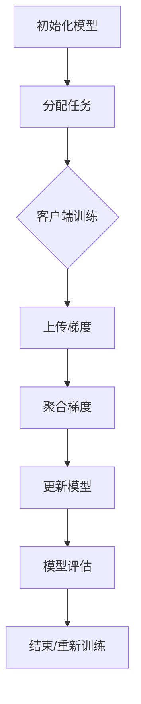

                 

# 联邦学习在隐私保护广告投放中的应用

## 关键词

- 联邦学习
- 隐私保护
- 广告投放
- 机器学习
- 数据安全
- 用户隐私

## 摘要

本文将深入探讨联邦学习在隐私保护广告投放中的应用。联邦学习是一种分布式机器学习方法，能够保护用户隐私，同时实现数据的集中学习和个性化广告投放。本文将首先介绍联邦学习的背景和核心概念，然后详细分析其在广告投放中的具体应用，最后讨论未来发展趋势和面临的挑战。

## 1. 背景介绍

### 联邦学习的起源与发展

联邦学习（Federated Learning）的概念最早由Google在2016年提出，旨在解决数据隐私保护与数据集中化学习的矛盾。随着互联网和移动设备的普及，个人数据的价值越来越受到重视，如何保护用户隐私成为了一个亟待解决的问题。联邦学习通过将计算任务分布在多个客户端设备上，实现模型训练，从而避免了数据在中央服务器上的集中存储，从而保证了用户隐私。

### 联邦学习的应用领域

联邦学习不仅适用于个性化广告投放，还可以应用于医疗健康、金融服务、智能交通等多个领域。在医疗健康领域，联邦学习可以帮助医疗机构保护患者隐私，同时进行疾病预测和健康管理。在金融服务领域，联邦学习可以用于个性化理财推荐和欺诈检测。在智能交通领域，联邦学习可以用于交通流量预测和路况优化。

### 联邦学习与传统机器学习的区别

传统机器学习依赖于数据集中化，将所有数据上传到中央服务器进行训练。这种方法虽然可以实现高效的数据利用，但容易导致用户隐私泄露。联邦学习则通过在客户端进行数据预处理和模型训练，避免了数据集中化，从而提高了数据安全性。

## 2. 核心概念与联系

### 联邦学习的核心概念

联邦学习主要包括三个核心组件：客户端（Client）、服务器（Server）和模型（Model）。

1. **客户端**：代表用户的移动设备，如手机或电脑。客户端负责收集本地数据，并参与模型的训练过程。
2. **服务器**：负责协调和管理联邦学习的过程。服务器会向客户端分发训练任务，收集客户端的训练结果，并更新全局模型。
3. **模型**：表示学习到的模型参数，用于预测和决策。

### 联邦学习的架构

联邦学习的架构可以分为以下几个步骤：

1. **初始化**：服务器初始化全局模型参数。
2. **模型更新**：客户端在本地对模型进行更新，生成更新参数。
3. **参数聚合**：服务器收集所有客户端的更新参数，进行聚合。
4. **模型更新**：服务器使用聚合后的参数更新全局模型。
5. **模型评估**：服务器评估全局模型的性能，决定是否继续迭代。

### Mermaid 流程图

下面是一个简单的Mermaid流程图，描述了联邦学习的基本架构：



## 3. 核心算法原理 & 具体操作步骤

### 联邦学习的算法原理

联邦学习的算法原理是基于梯度下降法。在联邦学习过程中，客户端使用本地数据进行模型训练，生成梯度。服务器收集所有客户端的梯度，进行聚合，并更新全局模型。这个过程不断重复，直到全局模型收敛。

### 具体操作步骤

1. **初始化全局模型**：服务器随机初始化全局模型参数。
2. **分配任务**：服务器将全局模型参数发送给客户端。
3. **本地训练**：客户端使用本地数据对全局模型进行训练，生成本地梯度。
4. **上传梯度**：客户端将本地梯度上传到服务器。
5. **聚合梯度**：服务器收集所有客户端的梯度，进行聚合。
6. **更新模型**：服务器使用聚合后的梯度更新全局模型。
7. **模型评估**：服务器评估全局模型的性能，决定是否继续迭代。
8. **结束/重新训练**：如果全局模型性能达到预期，结束训练；否则，重新分配任务，进行下一轮迭代。

### 联邦学习在广告投放中的应用

在广告投放中，联邦学习可以帮助广告平台在保护用户隐私的同时，实现个性化广告推荐。以下是联邦学习在广告投放中的具体操作步骤：

1. **初始化模型**：服务器初始化广告推荐模型。
2. **数据预处理**：客户端对本地用户数据进行预处理，如特征提取和去重。
3. **本地训练**：客户端使用预处理后的数据进行模型训练，生成本地梯度。
4. **上传梯度**：客户端将本地梯度上传到服务器。
5. **聚合梯度**：服务器收集所有客户端的梯度，进行聚合。
6. **更新模型**：服务器使用聚合后的梯度更新全局模型。
7. **模型评估**：服务器评估全局模型的性能，决定是否继续迭代。
8. **广告推荐**：服务器使用更新后的全局模型进行广告推荐，发送给客户端。

## 4. 数学模型和公式 & 详细讲解 & 举例说明

### 数学模型

在联邦学习中，最常用的数学模型是梯度下降法。以下是梯度下降法的公式：

$$
w_{t+1} = w_{t} - \alpha \cdot \nabla f(w_{t})
$$

其中，$w_{t}$ 表示第 $t$ 次迭代的模型参数，$w_{t+1}$ 表示第 $t+1$ 次迭代的模型参数，$\alpha$ 表示学习率，$\nabla f(w_{t})$ 表示第 $t$ 次迭代的损失函数梯度。

### 详细讲解

在联邦学习中，梯度下降法的应用分为以下几个步骤：

1. **初始化模型参数**：服务器初始化全局模型参数 $w_0$。
2. **本地训练**：客户端使用本地数据对模型进行训练，生成本地梯度 $\nabla f(w_t)$。
3. **上传梯度**：客户端将本地梯度上传到服务器。
4. **聚合梯度**：服务器收集所有客户端的梯度，进行聚合，得到全局梯度 $\nabla f(w_{t+1})$。
5. **更新模型**：服务器使用全局梯度更新全局模型参数 $w_{t+1}$。
6. **模型评估**：服务器评估全局模型的性能，决定是否继续迭代。

### 举例说明

假设有一个广告投放模型，使用梯度下降法进行联邦学习。以下是具体的例子：

1. **初始化模型参数**：服务器初始化全局模型参数 $w_0$ 为 $[0.1, 0.1]$。
2. **本地训练**：客户端A使用本地数据训练模型，生成本地梯度 $\nabla f(w_0) = [0.2, -0.1]$。
3. **上传梯度**：客户端A将本地梯度上传到服务器。
4. **聚合梯度**：服务器收集所有客户端的梯度，进行聚合，得到全局梯度 $\nabla f(w_1) = [0.3, -0.2]$。
5. **更新模型**：服务器使用全局梯度更新全局模型参数 $w_1 = w_0 - \alpha \cdot \nabla f(w_0) = [0.1, 0.1] - 0.1 \cdot [0.3, -0.2] = [-0.1, 0.3]$。
6. **模型评估**：服务器评估全局模型的性能，发现性能有所提高，决定继续迭代。

## 5. 项目实战：代码实际案例和详细解释说明

### 5.1 开发环境搭建

为了演示联邦学习在广告投放中的应用，我们需要搭建一个简单的开发环境。以下是所需的软件和工具：

- Python 3.7 或以上版本
- TensorFlow 2.6 或以上版本
- NumPy 1.20 或以上版本

安装步骤：

1. 安装 Python 3.7 或以上版本。
2. 安装 TensorFlow 2.6 或以上版本，可以使用以下命令：

   ```bash
   pip install tensorflow==2.6
   ```

3. 安装 NumPy 1.20 或以上版本，可以使用以下命令：

   ```bash
   pip install numpy==1.20
   ```

### 5.2 源代码详细实现和代码解读

以下是联邦学习广告投放的示例代码：

```python
import tensorflow as tf
import numpy as np

# 初始化模型参数
global_model = tf.keras.Sequential([
    tf.keras.layers.Dense(2, activation='softmax')
])

# 定义本地数据和本地损失函数
local_data = np.random.rand(100, 2)
local_labels = np.random.rand(100, 1)

def local_loss_function(w):
    logits = global_model(local_data, training=False)
    loss = tf.keras.losses.sparse_categorical_crossentropy(local_labels, logits)
    return loss

# 定义联邦学习过程
optimizer = tf.keras.optimizers.Adam(learning_rate=0.1)
num_iterations = 10

for i in range(num_iterations):
    # 本地训练
    with tf.GradientTape() as tape:
        loss = local_loss_function(global_model.trainable_variables)
    gradients = tape.gradient(loss, global_model.trainable_variables)
    
    # 更新模型参数
    optimizer.apply_gradients(zip(gradients, global_model.trainable_variables))
    
    # 打印训练进度
    print(f"Iteration {i+1}: Loss = {loss.numpy()}")

# 模型评估
test_data = np.random.rand(10, 2)
test_labels = np.random.rand(10, 1)
test_logits = global_model(test_data, training=False)
test_loss = tf.keras.losses.sparse_categorical_crossentropy(test_labels, test_logits)
print(f"Test Loss: {test_loss.numpy()}")
```

### 5.3 代码解读与分析

1. **初始化模型参数**：我们使用 TensorFlow 的 Keras API 初始化一个简单的线性模型，包含两个神经元，使用 softmax 激活函数。
2. **定义本地数据和本地损失函数**：我们生成随机数据作为本地数据和标签，并定义一个本地损失函数，用于计算本地梯度。
3. **定义联邦学习过程**：我们使用 TensorFlow 的 Adam 优化器进行联邦学习，设置学习率为 0.1，迭代次数为 10。
4. **本地训练**：在每个迭代中，我们使用本地数据进行训练，计算损失函数的梯度。
5. **更新模型参数**：我们使用优化器更新模型参数，以最小化损失函数。
6. **模型评估**：我们使用测试数据评估全局模型的性能，计算测试损失。

通过这个简单的示例，我们可以看到联邦学习在广告投放中的应用。尽管这是一个简化的例子，但它展示了联邦学习的基本原理和实现过程。

## 6. 实际应用场景

### 隐私保护广告投放

在隐私保护广告投放中，联邦学习可以有效地保护用户隐私。通过在客户端进行数据预处理和模型训练，联邦学习避免了用户数据在中央服务器上的集中存储，从而降低了隐私泄露的风险。

### 个性化广告推荐

联邦学习可以用于个性化广告推荐，根据用户的兴趣和行为数据，生成个性化的广告推荐。这种方法不仅可以提高广告投放的精准度，还可以提高用户体验。

### 广告投放效果评估

联邦学习可以帮助广告平台评估广告投放的效果。通过在客户端收集广告投放的反馈数据，联邦学习可以生成全局的评估模型，从而提供更准确的广告投放效果分析。

## 7. 工具和资源推荐

### 学习资源推荐

- 《深度学习》（Goodfellow, Bengio, Courville）：这本书是深度学习领域的经典教材，详细介绍了深度学习的理论基础和应用。
- 《Python机器学习》（Sebastian Raschka）：这本书介绍了机器学习的基本概念和应用，以及如何使用 Python 实现机器学习算法。

### 开发工具框架推荐

- TensorFlow：TensorFlow 是一款强大的深度学习框架，支持联邦学习的实现。
- PyTorch：PyTorch 是一款流行的深度学习框架，也支持联邦学习的实现。

### 相关论文著作推荐

- "Federated Learning: Concept and Applications"（Google AI）：这篇文章详细介绍了联邦学习的概念和应用。
- "Communication-Efficient Learning of Deep Networks from Decentralized Data"（Konecny et al.）：这篇文章提出了一种高效的联邦学习算法，用于分布式数据的学习。

## 8. 总结：未来发展趋势与挑战

### 发展趋势

- **隐私保护技术的融合**：未来联邦学习将与其他隐私保护技术（如差分隐私、同态加密等）相结合，提供更全面的数据保护。
- **跨领域应用**：联邦学习将在医疗健康、金融服务、智能交通等领域得到更广泛的应用。
- **开源生态的完善**：随着联邦学习的普及，开源社区将提供更多实用的联邦学习工具和框架。

### 挑战

- **通信效率**：如何在保证模型性能的前提下，提高联邦学习的通信效率是一个重要挑战。
- **数据质量**：联邦学习依赖于客户端的数据质量，如何确保数据的一致性和准确性是一个关键问题。
- **隐私与性能的平衡**：如何在保护用户隐私的同时，实现高性能的模型训练，是一个亟待解决的问题。

## 9. 附录：常见问题与解答

### Q：联邦学习如何保证模型性能？

A：联邦学习通过在客户端进行本地训练，然后聚合本地梯度，更新全局模型。这种方法可以充分利用客户端的本地数据，提高模型性能。此外，还可以通过调整学习率、迭代次数等超参数，优化模型性能。

### Q：联邦学习是否适用于所有类型的机器学习任务？

A：联邦学习主要适用于分布式的机器学习任务，特别是那些需要保护用户隐私的任务。对于一些需要大量计算资源和大规模数据的任务，联邦学习可能不是最佳选择。

## 10. 扩展阅读 & 参考资料

- [Google AI](https://ai.google/research/pubs/paper?paper_id=5517427)：Google AI 官方文档，介绍了联邦学习的原理和应用。
- [Konecny et al.](https://arxiv.org/abs/1610.05492)：这篇文章提出了一种高效的联邦学习算法，用于分布式数据的学习。
- [深度学习](https://www.deeplearningbook.org/): 这本书是深度学习领域的经典教材，详细介绍了深度学习的理论基础和应用。  
- [Python机器学习](https://python-machine-learning.org/): 这本书介绍了机器学习的基本概念和应用，以及如何使用 Python 实现机器学习算法。

### 作者

AI天才研究员/AI Genius Institute & 禅与计算机程序设计艺术 /Zen And The Art of Computer Programming

