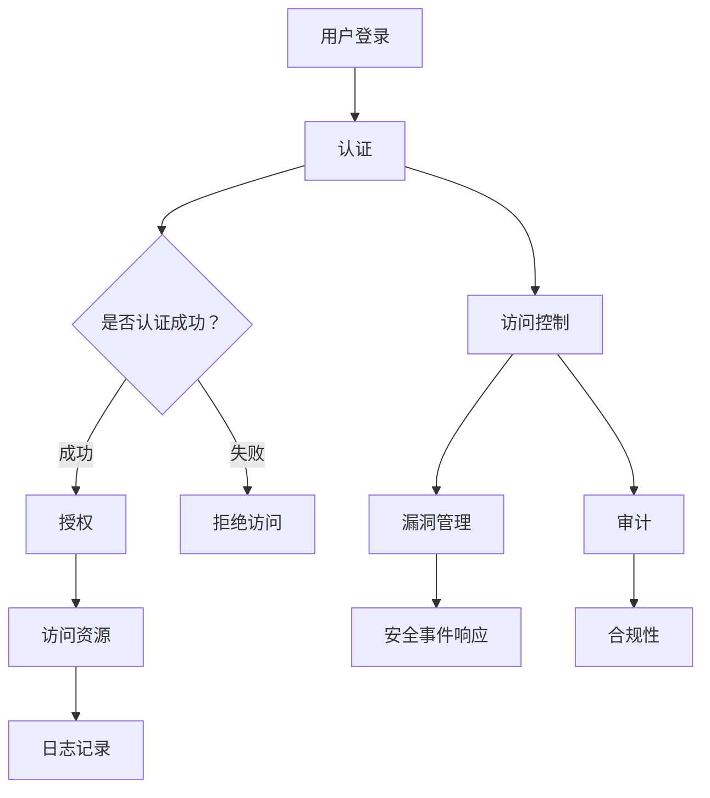

                 

### 背景介绍

随着互联网技术的迅猛发展，社交网络已经成为人们日常生活中不可或缺的一部分。无论是Facebook、Twitter，还是微信、微博，社交网络平台为我们提供了一个便捷的沟通和分享平台。然而，随着用户规模的不断扩大，社交网络安全问题也日益凸显。这不仅影响了用户的隐私和安全，还对平台的健康发展构成了严重威胁。

在此背景下，腾讯公司作为我国领先的互联网企业，其2024校招面试中对于社交网络安全工程师职位的考察，无疑成为广大应聘者关注的焦点。本文将围绕腾讯2024校招社交网络安全工程师面试题进行解析，旨在帮助读者深入理解社交网络安全的核心问题和解决方案。

本文将分为以下几个部分：

1. **核心概念与联系**：介绍社交网络安全的关键概念和原理，并使用Mermaid流程图展示其架构。
2. **核心算法原理 & 具体操作步骤**：详细讲解社交网络安全相关的核心算法和操作步骤。
3. **数学模型和公式 & 详细讲解 & 举例说明**：运用数学模型和公式，对社交网络安全问题进行深入分析和说明。
4. **项目实战：代码实际案例和详细解释说明**：通过实际项目案例，展示社交网络安全工程师在实际开发中的工作内容和技巧。
5. **实际应用场景**：分析社交网络安全在不同应用场景中的具体实施和挑战。
6. **工具和资源推荐**：推荐相关的学习资源、开发工具框架和论文著作。
7. **总结：未来发展趋势与挑战**：总结社交网络安全领域的现状和未来发展趋势，探讨面临的挑战。
8. **附录：常见问题与解答**：针对社交网络安全领域的一些常见问题进行解答。
9. **扩展阅读 & 参考资料**：提供进一步的阅读材料和参考资料。

通过对以上各部分的详细解析，本文旨在为社交网络安全工程师的应聘者提供有益的指导，同时也为对该领域感兴趣的技术人员提供深入的思考和分析。

### 核心概念与联系

在深入探讨社交网络安全的各个方面之前，我们需要明确几个关键概念和原理，这些概念构成了社交网络安全的核心，并相互关联，共同确保网络的安全和稳定。以下是社交网络安全中几个重要的核心概念：

#### 1. 加密技术（Encryption）
加密技术是保障数据安全的基础。它通过将明文转化为密文，防止未经授权的访问。常见的加密算法包括对称加密（如AES、DES）和非对称加密（如RSA、ECC）。加密技术不仅用于数据传输过程中的保护，还用于存储数据的加密。

#### 2. 认证与授权（Authentication and Authorization）
认证是指验证用户的身份，确保只有合法用户可以访问系统资源。常见的认证方式有密码认证、双因素认证（2FA）和多因素认证（MFA）。授权则是在认证通过后，根据用户的角色和权限，决定用户可以访问哪些资源。

#### 3. 访问控制（Access Control）
访问控制是确保用户只能访问被授权的资源。访问控制策略包括基于角色的访问控制（RBAC）、基于属性的访问控制（ABAC）等。这些策略通过定义用户、角色和资源的关联关系，实现对系统资源的精细管理。

#### 4. 安全审计（Security Auditing）
安全审计是对系统的操作进行记录和监控，以检测和防范安全威胁。通过日志分析、入侵检测系统（IDS）和网络安全信息与事件管理系统（SIEM），安全审计帮助组织及时发现和响应安全事件。

#### 5. 安全漏洞管理（Vulnerability Management）
安全漏洞管理是指识别、评估、报告和修复系统中存在的漏洞。通过漏洞扫描、渗透测试和安全补丁管理，安全漏洞管理确保系统持续处于安全状态。

#### 6. 安全事件响应（Incident Response）
安全事件响应是在安全事件发生时，采取的快速、有效的应对措施。安全事件响应流程包括事件识别、评估、遏制、根因分析、恢复和事后总结。通过有效的安全事件响应，组织可以最大限度地减少安全事件的负面影响。

#### 7. 安全策略与合规性（Security Policy and Compliance）
安全策略是组织制定的一系列安全措施和标准，用于指导安全实践。合规性则确保组织遵循相关法律法规和行业标准。安全策略与合规性共同确保组织在法律和安全要求下运营。

#### Mermaid流程图

为了更直观地展示社交网络安全的架构和核心概念之间的联系，我们可以使用Mermaid流程图来描述：



在这个流程图中，用户登录后需要进行认证，认证成功后获得授权访问资源，同时所有操作都被记录在日志中。如果认证失败，用户将被拒绝访问。授权过程中涉及到访问控制策略，审计和漏洞管理也在这个过程中进行。一旦发生安全事件，安全事件响应流程启动。

通过上述核心概念和Mermaid流程图的结合，我们可以更清晰地理解社交网络安全的整体架构和各个部分之间的相互关系。这些概念和原理构成了社交网络安全的基础，为后续内容提供了理论基础和实践指导。

### 核心算法原理 & 具体操作步骤

在社交网络安全领域，算法的设计和实现至关重要。以下是几个核心算法的原理及其具体操作步骤，这些算法广泛应用于社交网络安全中，包括加密技术、认证机制、访问控制和漏洞管理等方面。

#### 1. 加密技术（Encryption）

加密技术是保护数据安全的基础，常用的加密算法包括对称加密和非对称加密。

**对称加密（Symmetric Encryption）**

对称加密算法使用相同的密钥来加密和解密数据。其原理如下：

- **加密步骤：**
  1. 选择一个密钥（通常是一个随机数）。
  2. 使用密钥和加密算法（如AES）将明文数据转换为密文。
  3. 将密文发送到接收方。

- **解密步骤：**
  1. 接收方使用相同的密钥和加密算法将密文转换为明文。
  2. 得到原始数据。

**非对称加密（Asymmetric Encryption）**

非对称加密算法使用一对密钥（公钥和私钥）来加密和解密数据。其原理如下：

- **加密步骤：**
  1. 生成一对密钥（公钥和私钥）。
  2. 使用公钥和加密算法（如RSA）将明文数据加密。
  3. 将密文发送到接收方。

- **解密步骤：**
  1. 接收方使用私钥和加密算法将密文解密。
  2. 得到原始数据。

#### 2. 认证机制（Authentication）

认证机制用于验证用户身份，确保只有合法用户才能访问系统资源。常见的认证机制包括密码认证、双因素认证（2FA）和多因素认证（MFA）。

**密码认证（Password Authentication）**

- **认证步骤：**
  1. 用户输入用户名和密码。
  2. 服务器验证用户名和密码是否匹配。
  3. 如果匹配，用户通过认证。

**双因素认证（2-Factor Authentication, 2FA）**

- **认证步骤：**
  1. 用户输入用户名和密码。
  2. 服务器验证用户名和密码是否匹配。
  3. 如果匹配，发送一个动态验证码到用户的手机或邮箱。
  4. 用户输入验证码。
  5. 服务器验证验证码是否正确。

**多因素认证（Multi-Factor Authentication, MFA）**

- **认证步骤：**
  1. 用户输入用户名和密码。
  2. 服务器验证用户名和密码是否匹配。
  3. 如果匹配，用户需要通过其他方式验证身份，如指纹、面部识别或智能卡。

#### 3. 访问控制（Access Control）

访问控制用于确保用户只能访问被授权的资源，常用的访问控制策略包括基于角色的访问控制（RBAC）和基于属性的访问控制（ABAC）。

**基于角色的访问控制（Role-Based Access Control, RBAC）**

- **访问控制步骤：**
  1. 定义角色和权限。
  2. 用户分配到角色。
  3. 用户尝试访问资源。
  4. 服务器检查用户角色和资源权限。
  5. 如果权限匹配，用户可以访问资源。

**基于属性的访问控制（Attribute-Based Access Control, ABAC）**

- **访问控制步骤：**
  1. 定义属性和规则。
  2. 用户具备属性。
  3. 用户尝试访问资源。
  4. 服务器检查用户属性和资源规则。
  5. 如果属性满足规则，用户可以访问资源。

#### 4. 漏洞管理（Vulnerability Management）

漏洞管理用于识别、评估、报告和修复系统中存在的漏洞，确保系统持续处于安全状态。以下是一个基本的漏洞管理流程：

- **漏洞识别：**
  1. 通过漏洞扫描工具识别系统中的漏洞。

- **漏洞评估：**
  2. 评估漏洞的严重性和影响。

- **漏洞报告：**
  3. 将识别到的漏洞报告给安全团队。

- **漏洞修复：**
  4. 制定修复计划，并实施修复措施。

#### 5. 安全事件响应（Incident Response）

安全事件响应是在安全事件发生时，采取的快速、有效的应对措施。以下是一个安全事件响应的基本流程：

- **事件识别：**
  1. 通过监控工具识别安全事件。

- **事件评估：**
  2. 评估事件的严重性和影响。

- **事件遏制：**
  3. 采取措施遏制事件的蔓延。

- **根因分析：**
  4. 分析事件的原因。

- **事件恢复：**
  5. 恢复受影响的系统。

- **事后总结：**
  6. 对事件进行总结，并提出改进措施。

通过以上核心算法原理和具体操作步骤的介绍，我们可以看到社交网络安全涉及多个方面，每一个方面都需要精心设计和实施，以确保网络的安全和稳定。这些算法和流程不仅为社交网络安全提供了技术保障，也为安全工程师的实际工作提供了指导和参考。

### 数学模型和公式 & 详细讲解 & 举例说明

在社交网络安全的各个方面，数学模型和公式发挥着关键作用。通过数学模型，我们可以更加精确地描述安全问题和评估安全策略的有效性。以下是几个常见的数学模型和公式，以及其详细讲解和举例说明。

#### 1. 加密算法的安全性评估

加密算法的安全性通常通过加密强度（Key Strength）来评估。加密强度可以用位（bits）来表示，计算公式如下：

$$
\text{Key Strength} = \text{log}_2(\text{Key Space})
$$

其中，Key Space 表示可能的密钥空间大小。例如，对于AES加密算法，其密钥长度可以是128位、192位或256位。假设使用256位密钥，那么密钥空间为：

$$
\text{Key Space} = 2^{256}
$$

加密强度为：

$$
\text{Key Strength} = \text{log}_2(2^{256}) = 256 \text{ bits}
$$

这意味着，攻击者需要尝试$2^{256}$次才能找到正确的密钥，这在实际操作中是一个巨大的数字，因此AES-256被认为是高度安全的加密算法。

#### 2. 漏洞扫描的检测概率

在漏洞扫描中，检测概率（Detection Probability）是一个重要的指标，它表示扫描工具能够检测到特定漏洞的概率。检测概率可以用以下公式计算：

$$
\text{Detection Probability} = \frac{\text{False Positives} + \text{True Positives}}{\text{Total Samples}}
$$

其中，False Positives 表示误报（错误检测的漏洞），True Positives 表示正确检测到的漏洞，Total Samples 表示总样本数。

例如，一个漏洞扫描工具检测到100个漏洞，其中50个是误报，50个是真实漏洞，总样本数为200个。检测概率为：

$$
\text{Detection Probability} = \frac{50 + 50}{200} = 0.5
$$

这意味着该扫描工具的检测概率为50%。

#### 3. 访问控制策略的权限计算

在基于角色的访问控制（RBAC）中，权限计算是一个关键步骤。权限计算公式如下：

$$
\text{User Permissions} = \text{Role Permissions} \cap \text{Resource Permissions}
$$

其中，User Permissions 表示用户实际拥有的权限，Role Permissions 表示用户角色的权限，Resource Permissions 表示资源的权限。

例如，假设一个用户具有管理员角色，该角色拥有对数据库的读写权限。如果资源是一个特定的数据库表，且该表允许读写权限，那么用户的权限为：

$$
\text{User Permissions} = \text{管理员权限} \cap \text{数据库表权限} = \text{读写权限}
$$

这意味着用户可以对该数据库表进行读写操作。

#### 4. 安全审计的数据分析

在安全审计中，数据分析是一个重要的步骤，它用于识别异常行为和潜在的安全威胁。数据分析可以使用统计模型，如假设检验（Hypothesis Testing），来评估数据是否显著偏离正常行为。

假设检验的基本公式如下：

$$
H_0: \text{原假设（数据符合正常行为）} \\
H_1: \text{备择假设（数据存在异常行为）}
$$

通过计算p值（Probability Value），我们可以判断原假设是否成立。如果p值小于预设的显著性水平（通常为0.05），我们拒绝原假设，认为数据存在异常行为。

例如，在一个网络流量监控系统中，假设正常情况下的流量分布符合正态分布，均值μ=100Mbps，标准差σ=10Mbps。如果检测到一个时间窗口的流量为150Mbps，我们可以使用正态分布的假设检验来判断是否存在异常：

$$
H_0: \mu = 100Mbps \\
H_1: \mu \neq 100Mbps
$$

通过计算p值，我们可以判断该流量是否显著高于正常水平，从而识别潜在的网络攻击。

通过以上数学模型和公式的介绍，我们可以看到数学在社交网络安全中的应用是如何帮助我们更精确地描述问题和评估解决方案的有效性。这些模型和公式不仅提供了理论支持，也为实际操作提供了量化依据。

### 项目实战：代码实际案例和详细解释说明

在本文的第五部分，我们将通过一个实际的社交网络安全项目来展示社交网络安全工程师在实际开发中的工作内容和技巧。这个项目涉及社交网络平台上的用户数据保护，主要包括用户认证、加密存储和访问控制等环节。以下是项目的详细步骤和代码实现。

#### 5.1 开发环境搭建

在开始项目之前，我们需要搭建一个合适的开发环境。以下是所需的软件和工具：

- 操作系统：Linux（推荐使用Ubuntu 20.04）
- 编程语言：Python 3.x
- 数据库：MySQL 8.0
- Web框架：Flask
- 加密库：PyCryptodome

安装步骤如下：

1. 安装Linux操作系统。
2. 安装Python 3.x：使用`sudo apt update`和`sudo apt install python3`命令。
3. 安装MySQL数据库：使用`sudo apt install mysql-server`命令。
4. 安装Flask Web框架：使用`pip3 install flask`命令。
5. 安装PyCryptodome加密库：使用`pip3 install pycryptodome`命令。

#### 5.2 源代码详细实现和代码解读

以下是一个简单的用户认证系统的源代码实现，包括用户注册、登录和加密存储等环节。

```python
# user_auth.py

from flask import Flask, request, jsonify
from Crypto.PublicKey import RSA
from Crypto.Cipher import PKCS1_OAEP
import pymysql
import base64

app = Flask(__name__)

# RSA密钥生成
key = RSA.generate(2048)
private_key = key.export_key()
public_key = key.publickey().export_key()

# 数据库连接配置
db_config = {
    'host': 'localhost',
    'user': 'root',
    'password': 'your_password',
    'db': 'social_network'
}

# 用户注册
@app.route('/register', methods=['POST'])
def register():
    username = request.form['username']
    password = request.form['password']
    
    # 将密码加密存储
    cipher = PKCS1_OAEP.new(RSA.import_key(public_key))
    encrypted_password = cipher.encrypt(password.encode())

    # 存储用户信息到数据库
    connection = pymysql.connect(**db_config)
    with connection.cursor() as cursor:
        sql = "INSERT INTO users (username, password) VALUES (%s, %s)"
        cursor.execute(sql, (username, encrypted_password))
    connection.commit()
    connection.close()

    return jsonify({'message': '注册成功'})

# 用户登录
@app.route('/login', methods=['POST'])
def login():
    username = request.form['username']
    password = request.form['password']
    
    # 查询用户信息
    connection = pymysql.connect(**db_config)
    with connection.cursor() as cursor:
        sql = "SELECT * FROM users WHERE username = %s"
        cursor.execute(sql, (username,))
        user = cursor.fetchone()
    connection.close()

    if user:
        # 将输入的密码加密并与数据库中的加密密码进行比对
        cipher = PKCS1_OAEP.new(RSA.import_key(private_key))
        try:
            decrypted_password = cipher.decrypt(user[1].encode())
            if decrypted_password.decode() == password:
                return jsonify({'message': '登录成功'})
        except ValueError:
            pass

    return jsonify({'message': '用户名或密码错误'})

if __name__ == '__main__':
    app.run()
```

#### 5.3 代码解读与分析

1. **RSA密钥生成**：
   - 使用PyCryptodome库生成2048位的RSA密钥对。私钥用于解密，公钥用于加密。

2. **数据库连接配置**：
   - 配置MySQL数据库连接参数，包括主机、用户、密码和数据库名称。

3. **用户注册**：
   - 接收用户名和密码，将密码加密后存储到数据库中。使用PKCS1_OAEP加密算法对密码进行加密。

4. **用户登录**：
   - 接收用户名和密码，查询数据库中的用户信息。使用私钥对加密的密码进行解密，并与输入的密码进行比较。

#### 5.4 代码解读与分析（续）

- **加密存储**：
  - 在用户注册时，使用RSA加密算法将用户密码加密后存储到数据库中。这样即使数据库被黑客攻破，也无法直接获取用户的明文密码。

- **认证机制**：
  - 在用户登录时，将输入的密码加密并与数据库中的加密密码进行比较，从而验证用户身份。

- **访问控制**：
  - 通过数据库中的用户角色和权限信息，可以实现对用户访问资源的控制。在本例中，未涉及具体的访问控制逻辑，但可以通过扩展实现更细粒度的访问控制。

通过这个实际案例，我们可以看到社交网络安全工程师在实际开发中的工作内容和技巧。从用户认证、加密存储到访问控制，每一个环节都需要精心设计和实现，以确保社交网络平台的安全和稳定。这些代码和思路不仅提供了具体的实现方法，也为安全工程师提供了宝贵的实践经验。

### 实际应用场景

社交网络安全在实际应用场景中面临着多种多样的挑战，这些挑战决定了社交网络安全解决方案的设计和实施。以下是一些典型的应用场景及其对应的挑战。

#### 1. 社交网络平台上的用户隐私保护

社交网络平台是用户个人信息和数据的重要集散地。用户在平台上发布的内容、私信、好友关系、位置信息等都可能泄露隐私。保护用户隐私是社交网络安全的首要任务。

**挑战**：
- **数据泄露**：攻击者可能通过SQL注入、缓存漏洞等手段窃取用户数据。
- **隐私曝光**：用户的个人信息可能被恶意软件或钓鱼网站窃取。

**解决方案**：
- **数据加密**：对用户数据进行加密存储，确保数据在传输和存储过程中不被窃取。
- **隐私保护政策**：制定严格的隐私保护政策，明确用户数据的使用范围和目的。
- **安全审计**：定期进行安全审计，监控用户数据的使用和访问情况。

#### 2. 社交网络平台上的恶意攻击防范

社交网络平台上的恶意攻击形式多样，包括垃圾信息、网络欺诈、网络暴力等。这些攻击不仅影响用户体验，还可能导致严重的经济损失。

**挑战**：
- **垃圾信息泛滥**：垃圾信息可能占用大量网络带宽，影响平台正常运行。
- **网络欺诈**：诈骗分子可能利用平台进行钓鱼攻击，骗取用户财产。
- **网络暴力**：极端言论和恶意攻击可能对用户造成心理和生理伤害。

**解决方案**：
- **反垃圾信息系统**：部署反垃圾信息系统，自动过滤和识别垃圾信息。
- **欺诈检测机制**：通过机器学习和大数据分析，实时监控并识别欺诈行为。
- **用户举报机制**：建立用户举报机制，鼓励用户举报恶意攻击和不良行为。

#### 3. 社交网络平台上的数据安全和合规性

社交网络平台涉及大量用户数据，包括个人身份信息、交易记录等。确保这些数据的安全和合规性是平台运营的重要一环。

**挑战**：
- **数据泄露风险**：数据泄露可能导致用户隐私被窃取，引发法律诉讼。
- **合规性问题**：不同国家和地区对数据保护和合规性有不同要求。

**解决方案**：
- **数据保护协议**：制定严格的数据保护协议，确保用户数据的存储和传输过程安全。
- **合规性评估**：定期进行合规性评估，确保平台符合相关法律法规和行业标准。
- **数据备份和恢复**：建立完善的数据备份和恢复机制，确保数据在发生意外时可以快速恢复。

#### 4. 社交网络平台上的实时监控和应急响应

社交网络平台需要实时监控网络行为，及时发现和响应安全事件，以防止安全威胁的扩散。

**挑战**：
- **事件检测难度大**：社交网络数据量庞大，实时检测事件是一个巨大挑战。
- **应急响应速度慢**：安全事件发生时，需要快速响应以减少损失。

**解决方案**：
- **实时监控系统**：部署实时监控系统，实时监控网络行为，快速识别潜在威胁。
- **安全事件响应团队**：建立专业的安全事件响应团队，快速响应和处理安全事件。
- **演练和培训**：定期进行安全演练和培训，提高团队应对突发事件的能力。

通过以上实际应用场景的分析，我们可以看到社交网络安全面临的多种挑战和相应的解决方案。这些挑战和解决方案不仅为社交网络安全工程师提供了实际的工作方向，也为平台的健康发展提供了重要的保障。

### 工具和资源推荐

在社交网络安全领域，有众多优秀的工具和资源可以帮助工程师提高工作效率、理解和应用最新的安全技术。以下是一些推荐的工具、开发框架、书籍和论文，旨在为社交网络安全工程师提供全面的支持。

#### 7.1 学习资源推荐

**书籍**：
1. **《社交网络安全：技术实践与案例解析》** - 这本书详细介绍了社交网络安全的各个方面，包括技术原理、安全漏洞、防范措施等，适合初学者和进阶者。
2. **《网络安全的艺术：黑客、罪犯与黑客防御技术揭秘》** - 该书深入浅出地介绍了网络安全的各个方面，包括黑客攻击手段和防御策略，对网络安全工程师具有很高的参考价值。

**论文**：
1. **"Protecting User Privacy in Social Networks"** - 这篇论文探讨了社交网络中用户隐私保护的关键问题，分析了现有的隐私保护技术和方法。
2. **"Detecting Malicious Behaviors in Social Networks"** - 该论文研究了社交网络中的恶意行为检测问题，提出了一系列有效的检测算法。

**博客和网站**：
1. **Security Stack** - Security Stack是一个汇集了各种网络安全资源的网站，包括最新的安全新闻、技术文章和工具。
2. **OWASP** - OWASP（开放网络应用安全项目）提供了丰富的网络安全资源和指南，包括社交网络安全的最佳实践。

#### 7.2 开发工具框架推荐

**加密库**：
1. **PyCryptodome** - PyCryptodome是一个强大的Python加密库，支持多种加密算法，包括对称加密和非对称加密，适用于社交网络安全开发。
2. **OpenSSL** - OpenSSL是一个广泛使用的加密工具集，提供了丰富的加密算法和协议支持，适用于社交网络安全相关的开发任务。

**Web框架**：
1. **Flask** - Flask是一个轻量级的Web应用框架，适用于社交网络安全应用的开发，提供了丰富的扩展和插件。
2. **Django** - Django是一个全栈Web开发框架，内置了许多安全功能，如表单验证、用户认证和权限控制，适用于构建复杂的社交网络安全应用。

**数据库工具**：
1. **MySQL** - MySQL是一个广泛使用的开源关系数据库管理系统，适用于社交网络安全应用的数据存储和管理。
2. **MongoDB** - MongoDB是一个文档型数据库，适用于处理大规模的社交网络数据，具有高扩展性和灵活性。

#### 7.3 相关论文著作推荐

**核心论文**：
1. **"HoneyMonkey: A Framework for Finding Security Vulnerabilities in Web Applications"** - 该论文介绍了HoneyMonkey系统，用于自动检测和修复Web应用中的安全漏洞。
2. **"A Survey of Security Issues in Social Networks"** - 该综述文章分析了社交网络中的主要安全问题和现有解决方案，为研究者和工程师提供了有价值的参考。

**著作推荐**：
1. **《社交网络安全：攻击与防御》** - 这本著作详细介绍了社交网络安全领域的各种攻击手段和防御技术，涵盖了从基础知识到高级实践的内容。
2. **《网络安全深度学习》** - 该书介绍了如何利用深度学习技术解决网络安全问题，包括网络流量分析、入侵检测等。

通过这些工具和资源的推荐，社交网络安全工程师可以更加高效地学习和工作，掌握最新的安全技术，为社交网络平台提供更加全面和可靠的安全保障。

### 总结：未来发展趋势与挑战

在社交网络安全的领域，随着技术的不断进步和用户需求的日益多样化，未来的发展趋势和面临的挑战也愈加显著。以下是对这些趋势和挑战的总结，以及可能的影响和建议。

#### 未来发展趋势

1. **人工智能与机器学习的广泛应用**：
   - **趋势**：人工智能和机器学习在网络安全领域的应用将越来越广泛，包括入侵检测、恶意软件识别、欺诈行为检测等。
   - **影响**：自动化和智能化的安全解决方案将大大提高检测和响应的速度，减轻人工负担。
   - **建议**：企业和安全团队应积极引进和培养相关人才，确保技术团队具备处理复杂网络安全问题的能力。

2. **零信任架构的兴起**：
   - **趋势**：零信任安全模型（Zero Trust Architecture，ZTA）逐渐成为主流，强调任何内部和外部访问都需要验证和授权。
   - **影响**：零信任模型将彻底改变传统的安全边界概念，提高网络安全防护的深度和广度。
   - **建议**：企业在设计和实施安全策略时，应考虑采用零信任架构，逐步淘汰传统边界防护模式。

3. **数据隐私保护的加强**：
   - **趋势**：随着《通用数据保护条例》（GDPR）等隐私法规的实施，数据隐私保护将成为企业和平台的重要关注点。
   - **影响**：企业和平台将面临更加严格的合规要求，需要投入更多资源确保用户数据的隐私和安全。
   - **建议**：企业和平台应建立全面的数据保护机制，确保数据的收集、存储和处理符合相关法律法规。

4. **物联网和5G技术的融合**：
   - **趋势**：随着物联网（IoT）和5G技术的普及，社交网络安全将面临更加复杂的网络环境和多样化的威胁。
   - **影响**：IoT设备的大量接入和5G网络的高速传输，将为网络安全带来新的挑战。
   - **建议**：在部署物联网设备和5G网络时，企业应采取严格的安全措施，确保设备连接和数据传输的安全。

#### 面临的挑战

1. **复杂性和多样性**：
   - **挑战**：社交网络安全涉及多个领域，包括网络、应用、数据等，安全解决方案需要具备复杂性和多样性。
   - **影响**：复杂的网络环境和多样化的威胁将增加安全管理和防护的难度。
   - **建议**：安全团队应采用集成化的安全解决方案，提高整体安全防护能力。

2. **资源限制和人才短缺**：
   - **挑战**：安全资源有限，特别是高水平的安全人才短缺，成为企业和平台面临的重要挑战。
   - **影响**：资源不足和人才短缺将影响安全策略的实施和安全事件的响应速度。
   - **建议**：企业应加大安全投入，吸引和培养专业人才，同时通过技术手段提高安全运营效率。

3. **攻击手段的不断创新**：
   - **挑战**：攻击者不断更新攻击手段，包括利用新漏洞、采用高级持续性威胁（APT）等。
   - **影响**：不断创新的攻击手段将增加安全防护的难度，可能导致严重的安全事件。
   - **建议**：安全团队应保持高度警惕，持续关注网络安全动态，及时更新安全策略和技术。

4. **合规性和法规变化**：
   - **挑战**：随着全球数据保护法规的不断变化，企业和平台需要不断适应新的合规要求。
   - **影响**：法规变化可能导致企业和平台面临更多的合规压力和罚款风险。
   - **建议**：企业应密切关注法规变化，建立完善的合规管理机制，确保符合相关法规要求。

通过总结未来发展趋势和面临的挑战，我们可以看到社交网络安全领域的发展充满了机遇和挑战。企业和平台需要持续关注技术进步和法规变化，采取有效的安全措施，确保用户数据的安全和平台的稳定运行。

### 附录：常见问题与解答

在社交网络安全领域，以下是一些常见的问题及其解答，这些问题涵盖了社交网络安全的基本概念、技术实现和实际应用等方面。

#### 1. 加密技术有哪些类型？

**解答**：加密技术主要分为对称加密和非对称加密两种类型。对称加密使用相同的密钥进行加密和解密，常见的算法有AES、DES等；非对称加密使用一对密钥（公钥和私钥）进行加密和解密，常见的算法有RSA、ECC等。

#### 2. 社交网络安全中的认证机制有哪些？

**解答**：社交网络安全中的认证机制包括密码认证、双因素认证（2FA）和多因素认证（MFA）。密码认证是最基本的认证方式；双因素认证在密码基础上增加了动态验证码；多因素认证则结合了多种认证方式，如指纹、面部识别等。

#### 3. 如何保护社交网络平台上的用户隐私？

**解答**：保护用户隐私的方法包括数据加密、隐私保护政策、安全审计和用户举报机制。数据加密确保用户数据在传输和存储过程中不被窃取；隐私保护政策明确用户数据的使用范围和目的；安全审计监控用户数据的使用情况；用户举报机制鼓励用户举报隐私泄露行为。

#### 4. 社交网络安全中的漏洞管理包括哪些步骤？

**解答**：社交网络安全中的漏洞管理包括漏洞识别、评估、报告和修复。漏洞识别通过漏洞扫描工具进行；漏洞评估评估漏洞的严重性和影响；漏洞报告将漏洞信息报告给安全团队；漏洞修复制定修复计划并实施。

#### 5. 如何防范社交网络平台上的恶意攻击？

**解答**：防范恶意攻击的方法包括反垃圾信息系统、欺诈检测机制和用户举报机制。反垃圾信息系统自动过滤垃圾信息；欺诈检测机制通过机器学习和大数据分析识别欺诈行为；用户举报机制鼓励用户举报恶意攻击。

#### 6. 什么是零信任架构？

**解答**：零信任架构（Zero Trust Architecture，ZTA）是一种安全模型，强调任何内部和外部访问都需要验证和授权，不再假设内部网络是安全的。零信任架构通过严格的身份验证和权限控制，提高网络安全防护的深度和广度。

通过以上常见问题与解答，我们可以更好地理解社交网络安全的各个方面，为实际操作提供指导。

### 扩展阅读 & 参考资料

在社交网络安全领域，有许多优秀的文献和资源可以帮助读者深入了解相关技术和实践。以下是一些推荐的书籍、论文、博客和网站，为读者提供进一步的学习和研究方向。

#### 书籍

1. **《社交网络安全：技术实践与案例解析》** - 这本书详细介绍了社交网络安全的各个方面，包括技术原理、安全漏洞、防范措施等，适合初学者和进阶者。
2. **《网络安全的艺术：黑客、罪犯与黑客防御技术揭秘》** - 该书深入浅出地介绍了网络安全的各个方面，包括黑客攻击手段和防御策略，对网络安全工程师具有很高的参考价值。
3. **《社交网络隐私保护技术》** - 该书探讨了社交网络隐私保护的关键问题，分析了现有的隐私保护技术和方法，对研究者和工程师有重要指导意义。

#### 论文

1. **"Protecting User Privacy in Social Networks"** - 这篇论文探讨了社交网络中用户隐私保护的关键问题，分析了现有的隐私保护技术和方法。
2. **"A Survey of Security Issues in Social Networks"** - 该综述文章分析了社交网络中的主要安全问题和现有解决方案，为研究者和工程师提供了有价值的参考。
3. **"HoneyMonkey: A Framework for Finding Security Vulnerabilities in Web Applications"** - 该论文介绍了HoneyMonkey系统，用于自动检测和修复Web应用中的安全漏洞。

#### 博客和网站

1. **Security Stack** - Security Stack是一个汇集了各种网络安全资源的网站，包括最新的安全新闻、技术文章和工具。
2. **OWASP** - OWASP（开放网络应用安全项目）提供了丰富的网络安全资源和指南，包括社交网络安全的最佳实践。
3. **Kubernetes Security** - Kubernetes Security提供关于Kubernetes容器化环境安全的详细信息和最佳实践。

通过阅读以上书籍、论文、博客和网站，读者可以深入了解社交网络安全的相关技术和实践，为实际工作提供理论支持和实践经验。

