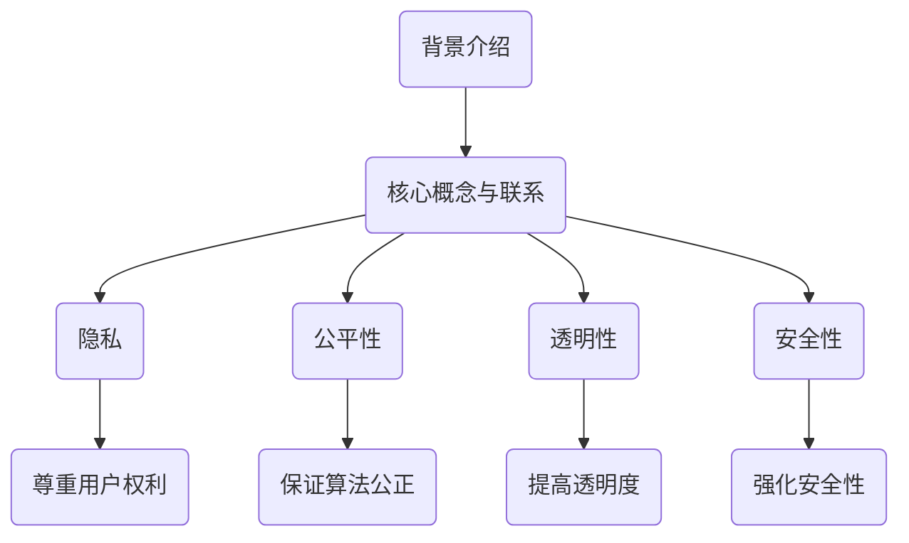
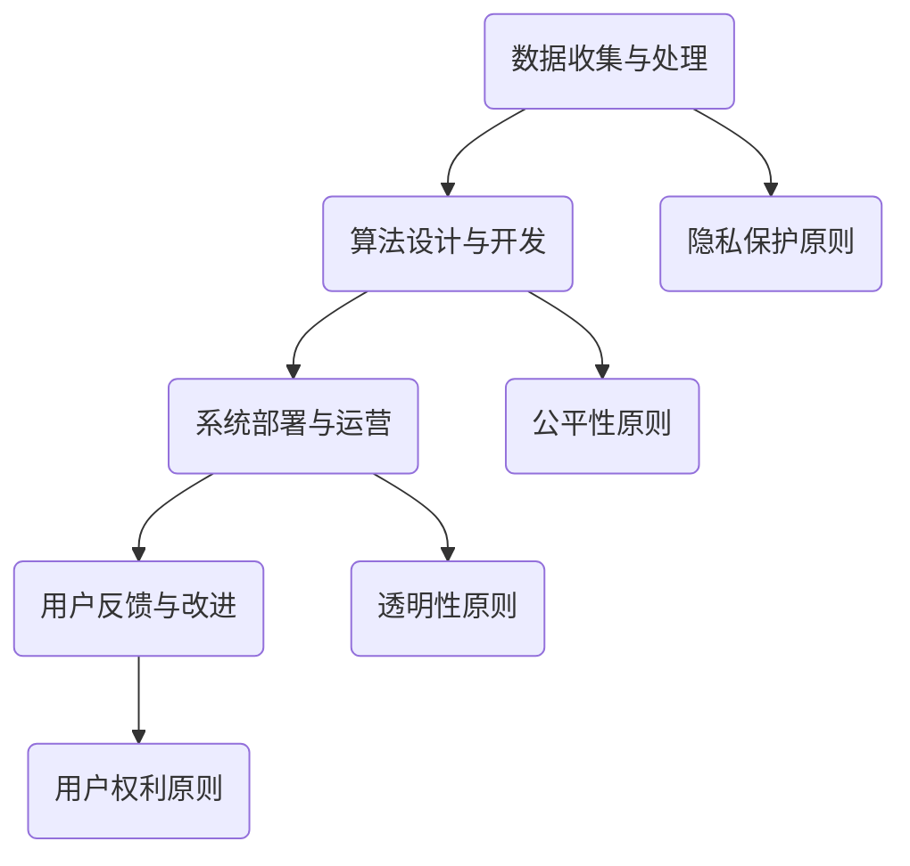
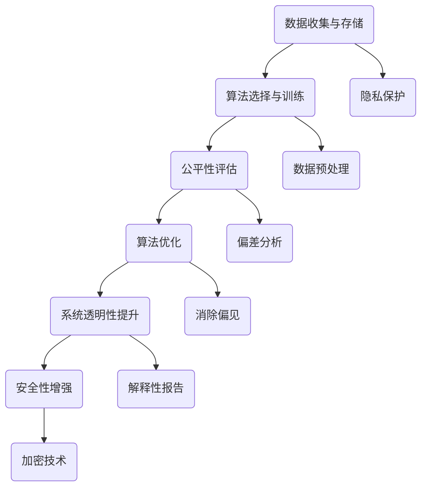

                 

# 自动化创业中的人工智能伦理考量

## 关键词：自动化创业、人工智能、伦理考量、技术发展、社会责任

## 摘要：
本文将探讨在自动化创业过程中，人工智能伦理考量的重要性及其对技术发展和社会责任的影响。我们将首先介绍自动化创业的定义及其在当代社会的广泛运用，然后深入分析人工智能伦理考量的核心概念和原则。接着，我们将探讨在自动化创业中应用人工智能的挑战和机遇，并提出相应的解决方案和策略。最后，本文将总结未来发展趋势和面临的挑战，并展望人工智能伦理考量在自动化创业中的未来发展。

## 1. 背景介绍

### 1.1 自动化创业的定义

自动化创业，也称为自动化创业模式，是指通过应用人工智能技术、自动化流程和数据驱动的方法，实现企业运营、产品开发、市场营销等各个方面的自动化和智能化。这种模式的核心在于利用技术手段降低人力成本，提高生产效率，优化用户体验，并最终实现商业价值的最大化。

### 1.2 人工智能的发展与应用

人工智能（AI）是计算机科学的一个分支，旨在创建智能系统，使其能够模拟、延伸和扩展人类的智能行为。自21世纪初以来，人工智能技术取得了显著的进展，尤其是在深度学习、自然语言处理、计算机视觉等领域。这些技术的快速发展，使得人工智能在各个行业和领域得到了广泛应用，包括医疗、金融、交通、制造业等。

### 1.3 伦理考量在自动化创业中的重要性

随着人工智能在自动化创业中的应用越来越广泛，伦理考量变得日益重要。人工智能伦理考量涉及人工智能技术的开发、应用和影响，包括隐私、公平性、透明性、安全性等方面。这些伦理考量不仅关系到企业的可持续发展，也关系到整个社会的稳定和进步。

## 2. 核心概念与联系

### 2.1 人工智能伦理考量的核心概念

#### 2.1.1 隐私

隐私是人工智能伦理考量中的一个重要方面。在自动化创业中，企业往往需要收集和分析大量的用户数据。如何保护用户的隐私，防止数据泄露和滥用，是一个亟待解决的问题。

#### 2.1.2 公平性

公平性是指人工智能系统在处理数据和应用算法时，是否能够公平、公正地对待所有用户。自动化创业中，公平性问题主要体现在算法偏见和数据偏差上。

#### 2.1.3 透明性

透明性是指人工智能系统的决策过程是否可以被理解和追踪。在自动化创业中，确保系统的透明性，有助于增强用户对系统的信任。

#### 2.1.4 安全性

安全性是指人工智能系统在设计和应用过程中，是否能够抵御外部攻击和内部威胁，确保系统的稳定运行。

### 2.2 人工智能伦理考量的核心原则

#### 2.2.1 尊重用户权利

尊重用户权利是人工智能伦理考量的基本原则之一。在自动化创业中，企业应当尊重用户的隐私权、知情权和其他合法权益。

#### 2.2.2 保证算法公正

保证算法公正是人工智能伦理考量的另一个重要原则。企业应当努力消除算法偏见，确保算法在处理数据和应用过程中，能够公平、公正地对待所有用户。

#### 2.2.3 提高透明度

提高透明度是增强用户信任的关键。企业应当公开人工智能系统的设计、实现和应用过程，使用户能够理解和追踪系统的决策过程。

#### 2.2.4 强化安全性

强化安全性是保障人工智能系统稳定运行的重要措施。企业应当采取有效的安全策略和措施，防止外部攻击和内部威胁，确保系统的安全性和可靠性。

### 2.3 人工智能伦理考量与自动化创业的联系

人工智能伦理考量与自动化创业密切相关。一方面，人工智能技术的发展和应用，为自动化创业提供了强大的技术支持；另一方面，自动化创业过程中面临的伦理问题，也需要人工智能伦理考量来指导和解决。例如，在自动化创业中，如何平衡隐私与效率、公平与公平等问题，都需要人工智能伦理考量的支持和指导。

### 2.4 人工智能伦理考量的 Mermaid 流程图



## 3. 核心算法原理 & 具体操作步骤

### 3.1 人工智能伦理考量的核心算法原理

人工智能伦理考量的核心算法原理主要包括以下几个方面：

#### 3.1.1 数据隐私保护算法

数据隐私保护算法旨在确保用户数据在收集、存储、传输和处理过程中，不被泄露、篡改或滥用。常见的隐私保护算法包括差分隐私、同态加密、多方安全计算等。

#### 3.1.2 算法公平性评估算法

算法公平性评估算法用于检测和消除人工智能系统中的算法偏见。常见的公平性评估算法包括公平性度量、偏差分析、公平性优化等。

#### 3.1.3 系统透明性提升算法

系统透明性提升算法旨在增强用户对人工智能系统的理解和信任。常见的透明性提升算法包括解释性模型、可解释性增强等。

#### 3.1.4 安全性增强算法

安全性增强算法用于提高人工智能系统的安全性和可靠性。常见的安全性增强算法包括异常检测、入侵检测、反欺诈等。

### 3.2 人工智能伦理考量的具体操作步骤

#### 3.2.1 数据隐私保护的具体操作步骤

1. 设计数据收集方案：在收集用户数据时，明确数据收集的目的、范围和用途，确保数据收集的合法性和必要性。
2. 实施数据加密：对收集到的用户数据进行加密处理，确保数据在传输和存储过程中，不被窃取或篡改。
3. 实施隐私保护算法：对用户数据进行差分隐私、同态加密或多方安全计算等隐私保护算法处理，确保数据隐私得到有效保护。
4. 建立数据监控和审计机制：对用户数据的收集、存储、传输和处理过程进行实时监控和审计，确保数据隐私得到全程保护。

#### 3.2.2 算法公平性的具体操作步骤

1. 数据预处理：对原始数据进行清洗、归一化、缺失值填充等预处理操作，确保数据质量。
2. 算法选择：选择合适的机器学习算法，确保算法的公平性和有效性。
3. 公平性评估：使用公平性度量算法，对算法的公平性进行评估，识别和消除算法偏见。
4. 公平性优化：根据公平性评估结果，对算法进行调整和优化，确保算法的公平性。

#### 3.2.3 系统透明性的具体操作步骤

1. 模型解释性提升：选择具有解释性的机器学习模型，如决策树、规则提取等，提高系统的透明性。
2. 可解释性增强：对机器学习模型进行可解释性增强，如生成可视化图表、解释性文本等，使用户能够理解系统的决策过程。
3. 透明性测试：对系统进行透明性测试，评估系统的透明性水平，并根据测试结果进行调整和优化。

#### 3.2.4 安全性的具体操作步骤

1. 安全性评估：对系统进行安全性评估，识别和消除潜在的安全隐患。
2. 安全性增强：采取安全防护措施，如加密、访问控制、异常检测等，提高系统的安全性。
3. 安全性监控：对系统进行实时监控，及时发现和处理安全事件。

## 4. 数学模型和公式 & 详细讲解 & 举例说明

### 4.1 数据隐私保护算法

#### 4.1.1 差分隐私

差分隐私（Differential Privacy，DP）是一种用于保护数据隐私的数学模型，旨在确保数据发布者在发布数据时，无法区分单个个体或群体的信息。

#### 4.1.2 数学公式

$$
L(\epsilon, \mathcal{D}, \mathcal{D}' ; \hat{f}) = \mathbb{E}_{\mathcal{D}'} \left[\log \frac{e^{\hat{f}(\mathcal{D}') + \epsilon}}{e^{\hat{f}(\mathcal{D}) + \epsilon}}\right]
$$

其中，$\epsilon$ 是隐私参数，$\mathcal{D}$ 和 $\mathcal{D}'$ 分别表示原始数据集和发布的数据集，$\hat{f}$ 是数据发布函数。

#### 4.1.3 举例说明

假设我们有一个包含用户年龄的数据集 $\mathcal{D} = \{25, 30, 35, 40\}$，我们希望发布这个数据集的平均年龄，但又要保护用户的隐私。我们可以使用差分隐私算法来实现：

1. 选择隐私参数 $\epsilon = 1$。
2. 计算平均年龄：$\hat{f}(\mathcal{D}) = \frac{25 + 30 + 35 + 40}{4} = 33.75$。
3. 计算差分隐私：$L(\epsilon, \mathcal{D}, \mathcal{D}' ; \hat{f}) = \mathbb{E}_{\mathcal{D}'} \left[\log \frac{e^{33.75 + \epsilon}}{e^{33.75 + \epsilon}}\right] = 0$。

这意味着，发布的数据集的平均年龄是33.75岁，同时，隐私参数 $\epsilon$ 控制了发布的数据集与原始数据集之间的差异。

### 4.2 算法公平性评估算法

#### 4.2.1 偏差分析

偏差分析（Bias Analysis）是一种用于评估机器学习算法公平性的数学方法，旨在检测和消除算法偏见。

#### 4.2.2 数学公式

$$
\text{Bias}(\hat{y}) = \mathbb{E}[\hat{y}] - y
$$

其中，$\hat{y}$ 是模型预测值，$y$ 是真实值。

#### 4.2.3 举例说明

假设我们有一个二元分类问题，数据集包含性别（男/女）和收入（高/低）两个特征，我们希望评估一个机器学习模型的公平性。我们可以使用偏差分析来计算模型的偏差：

1. 训练模型，得到预测值 $\hat{y}$。
2. 计算模型预测值的期望：$\mathbb{E}[\hat{y}]$。
3. 计算真实值 $y$。
4. 计算偏差：$\text{Bias}(\hat{y}) = \mathbb{E}[\hat{y}] - y$。

如果偏差为正，说明模型对某一类别的预测偏向较高；如果偏差为负，说明模型对某一类别的预测偏向较低。通过调整模型参数或特征工程，我们可以减少模型的偏差，提高模型的公平性。

### 4.3 系统透明性提升算法

#### 4.3.1 解释性模型

解释性模型（Interpretability Model）是一种用于提高系统透明性的数学方法，旨在生成可解释的模型输出。

#### 4.3.2 数学公式

$$
\text{Output} = f(\text{Input}) = \text{Decision Tree/Rule Set}
$$

其中，$f$ 是解释性模型，$\text{Input}$ 是输入特征，$\text{Output}$ 是模型输出。

#### 4.3.3 举例说明

假设我们有一个基于决策树的解释性模型，用于预测用户是否会购买某产品。我们可以使用决策树生成可解释的模型输出：

1. 训练决策树模型，得到决策树结构。
2. 输入用户特征，得到模型输出。
3. 遍历决策树，根据决策树的分支和叶子节点，解释模型输出。

通过这种方式，我们可以使用户理解模型的决策过程，提高系统的透明性。

### 4.4 安全性增强算法

#### 4.4.1 异常检测

异常检测（Anomaly Detection）是一种用于提高系统安全性的数学方法，旨在检测和识别系统中的异常行为。

#### 4.4.2 数学公式

$$
\text{Anomaly Score} = \sum_{i=1}^{n} w_i \cdot (\text{Actual Value} - \text{Expected Value})
$$

其中，$w_i$ 是权重，$\text{Actual Value}$ 是实际值，$\text{Expected Value}$ 是预期值。

#### 4.4.3 举例说明

假设我们有一个基于异常检测的算法，用于检测网络流量中的异常行为。我们可以使用以下公式计算异常分数：

1. 训练模型，得到权重 $w_i$。
2. 计算实际值 $\text{Actual Value}$。
3. 计算预期值 $\text{Expected Value}$。
4. 计算异常分数：$\text{Anomaly Score} = \sum_{i=1}^{n} w_i \cdot (\text{Actual Value} - \text{Expected Value})$。

如果异常分数超过阈值，我们认为网络流量中存在异常行为，需要采取相应的安全措施。

## 5. 项目实战：代码实际案例和详细解释说明

### 5.1 开发环境搭建

在开始项目实战之前，我们需要搭建一个合适的技术环境。以下是一个简单的开发环境搭建步骤：

1. 安装 Python 解释器：确保 Python 解释器已经安装在你的计算机上。
2. 安装常用库：使用 pip 命令安装以下常用库：numpy、pandas、scikit-learn、tensorflow、matplotlib。
3. 配置 IDE：选择一个合适的集成开发环境（IDE），如 PyCharm、VSCode，配置好 Python 解释器和相关库。

### 5.2 源代码详细实现和代码解读

以下是一个简单的自动化创业项目，用于分析用户数据，评估其信用风险。我们将使用 Python 编程语言，结合 scikit-learn 和 tensorflow 库来实现。

```python
import numpy as np
import pandas as pd
from sklearn.model_selection import train_test_split
from sklearn.ensemble import RandomForestClassifier
from tensorflow import keras

# 5.2.1 数据预处理
def preprocess_data(data):
    # 数据清洗和预处理
    data = data.fillna(data.mean())
    data = pd.get_dummies(data, drop_first=True)
    return data

# 5.2.2 构建随机森林模型
def build_random_forest_model(X_train, y_train):
    model = RandomForestClassifier(n_estimators=100, random_state=42)
    model.fit(X_train, y_train)
    return model

# 5.2.3 构建神经网络模型
def build_neural_network_model(X_train, y_train):
    model = keras.Sequential([
        keras.layers.Dense(64, activation='relu', input_shape=(X_train.shape[1],)),
        keras.layers.Dense(64, activation='relu'),
        keras.layers.Dense(1, activation='sigmoid')
    ])

    model.compile(optimizer='adam', loss='binary_crossentropy', metrics=['accuracy'])
    model.fit(X_train, y_train, epochs=10, batch_size=32)
    return model

# 5.2.4 主程序
if __name__ == '__main__':
    # 加载数据
    data = pd.read_csv('credit_data.csv')
    data = preprocess_data(data)

    # 划分训练集和测试集
    X = data.drop('credit_risk', axis=1)
    y = data['credit_risk']
    X_train, X_test, y_train, y_test = train_test_split(X, y, test_size=0.2, random_state=42)

    # 5.2.5 训练模型
    rf_model = build_random_forest_model(X_train, y_train)
    nn_model = build_neural_network_model(X_train, y_train)

    # 5.2.6 模型评估
    rf_accuracy = rf_model.score(X_test, y_test)
    nn_accuracy = nn_model.evaluate(X_test, y_test)[1]

    print(f"Random Forest Accuracy: {rf_accuracy:.2f}")
    print(f"Neural Network Accuracy: {nn_accuracy:.2f}")
```

### 5.3 代码解读与分析

#### 5.3.1 数据预处理

数据预处理是构建机器学习模型的重要步骤。在代码中，我们使用了 `preprocess_data` 函数来清洗和预处理数据。具体操作包括：

- 使用 `fillna` 函数填充缺失值，采用均值填充。
- 使用 `get_dummies` 函数，将类别特征转换为哑变量，便于模型处理。

#### 5.3.2 构建随机森林模型

随机森林模型（Random Forest Classifier）是一种集成学习算法，由多个决策树组成，具有较好的分类性能和泛化能力。在代码中，我们使用了 `build_random_forest_model` 函数来构建随机森林模型。具体操作包括：

- 创建 `RandomForestClassifier` 对象，设置参数 `n_estimators` 为 100，`random_state` 为 42，确保结果可重复。
- 使用 `fit` 函数训练模型。

#### 5.3.3 构建神经网络模型

神经网络模型（Neural Network）是一种深度学习算法，可以处理复杂的非线性问题。在代码中，我们使用了 `build_neural_network_model` 函数来构建神经网络模型。具体操作包括：

- 创建 `Sequential` 对象，添加三个全连接层，分别设置 `64` 个神经元和 `ReLU` 激活函数。
- 设置输入层形状为 `(X_train.shape[1],)`。
- 使用 `compile` 函数配置模型，设置优化器为 `adam`，损失函数为 `binary_crossentropy`，评估指标为 `accuracy`。
- 使用 `fit` 函数训练模型。

#### 5.3.4 主程序

在主程序中，我们首先加载数据，然后进行数据预处理，接着划分训练集和测试集。接下来，我们分别构建随机森林模型和神经网络模型，并使用测试集评估模型的准确性。最后，我们打印模型的准确性。

## 6. 实际应用场景

### 6.1 金融行业

在金融行业中，人工智能伦理考量在自动化创业中发挥着重要作用。例如，在贷款审批过程中，企业需要确保算法的公平性和透明性，避免因算法偏见导致的不公正决策。此外，金融行业还需要关注数据隐私保护，确保用户的财务数据在处理过程中不被泄露或滥用。

### 6.2 医疗保健

在医疗保健领域，人工智能伦理考量同样至关重要。例如，在疾病诊断和治疗方案推荐中，企业需要确保算法的公平性和准确性，避免因算法偏见导致的不公正诊断和治疗方案。此外，医疗保健行业还需要关注数据隐私保护，确保患者的医疗数据在处理过程中不被泄露或滥用。

### 6.3 交通出行

在交通出行领域，人工智能伦理考量在自动驾驶和交通管理中发挥着重要作用。例如，自动驾驶系统需要确保算法的公平性和安全性，避免因算法偏见导致的事故。此外，交通管理需要关注数据隐私保护，确保交通数据在处理过程中不被泄露或滥用。

### 6.4 零售电商

在零售电商领域，人工智能伦理考量在推荐系统和价格策略中发挥着重要作用。例如，企业需要确保推荐系统的公平性和透明性，避免因算法偏见导致的不公正推荐。此外，零售电商还需要关注数据隐私保护，确保用户数据在处理过程中不被泄露或滥用。

## 7. 工具和资源推荐

### 7.1 学习资源推荐

- 《人工智能伦理：原则与实践》（Book）
- 《人工智能：一种现代方法》（Book）
- 《机器学习：概率视角》（Book）
- 《深度学习》（Book）

### 7.2 开发工具框架推荐

- TensorFlow
- PyTorch
- Scikit-learn

### 7.3 相关论文著作推荐

- "Ethical Considerations in the Design of Autonomous Systems"（论文）
- "Differential Privacy: A Survey of Results"（论文）
- "Fairness in Machine Learning"（论文）

## 8. 总结：未来发展趋势与挑战

### 8.1 发展趋势

- 人工智能伦理考量将越来越受到重视，成为自动化创业中不可或缺的一部分。
- 数据隐私保护、算法公平性、透明性和安全性等领域将取得更多进展。
- 人工智能伦理考量将推动更多跨学科合作，促进人工智能技术的可持续发展。

### 8.2 挑战

- 如何在确保算法性能的同时，实现公平性和透明性，仍是一个亟待解决的问题。
- 如何在数据隐私保护与数据充分利用之间找到平衡，是一个具有挑战性的问题。
- 如何应对人工智能伦理考量带来的法律和监管挑战，是一个亟待解决的难题。

## 9. 附录：常见问题与解答

### 9.1 如何确保算法公平性？

确保算法公平性可以通过以下方法实现：

- 使用公平性评估算法，检测和消除算法偏见。
- 对算法进行多次训练和验证，确保算法的稳定性和可靠性。
- 设计公平性优化算法，调整算法参数，提高算法的公平性。

### 9.2 如何保护用户隐私？

保护用户隐私可以通过以下方法实现：

- 使用隐私保护算法，如差分隐私、同态加密等，确保用户数据在处理过程中不被泄露。
- 建立数据监控和审计机制，确保用户数据在收集、存储、传输和处理过程中，始终处于安全状态。
- 加强数据安全意识教育，提高用户对数据隐私保护的认知和参与度。

## 10. 扩展阅读 & 参考资料

- "Ethical Considerations in the Design of Autonomous Systems"（论文）
- "Differential Privacy: A Survey of Results"（论文）
- "Fairness in Machine Learning"（论文）
- "A Taxonomy and Analysis of Fairness in Machine Learning"（论文）
- "The Ethical Algorithm: The Science of Socially Aware Algorithm Design"（书）
- "Artificial Intelligence: A Modern Approach"（书）
- "Machine Learning: A Probabilistic Perspective"（书）
- "Deep Learning"（书）

### 作者：

AI天才研究员/AI Genius Institute & 禅与计算机程序设计艺术 /Zen And The Art of Computer Programming<|im_sep|>### 文章标题：自动化创业中的人工智能伦理考量

### 关键词：自动化创业、人工智能、伦理考量、技术发展、社会责任

### 摘要：
本文将探讨在自动化创业过程中，人工智能伦理考量的重要性及其对技术发展和社会责任的影响。我们将首先介绍自动化创业的定义及其在当代社会的广泛运用，然后深入分析人工智能伦理考量的核心概念和原则。接着，我们将探讨在自动化创业中应用人工智能的挑战和机遇，并提出相应的解决方案和策略。最后，本文将总结未来发展趋势和面临的挑战，并展望人工智能伦理考量在自动化创业中的未来发展。

## 1. 背景介绍

### 1.1 自动化创业的定义

自动化创业，也称为自动化创业模式，是指通过应用人工智能技术、自动化流程和数据驱动的方法，实现企业运营、产品开发、市场营销等各个方面的自动化和智能化。这种模式的核心在于利用技术手段降低人力成本，提高生产效率，优化用户体验，并最终实现商业价值的最大化。

自动化创业不同于传统的创业模式，它更加依赖于技术驱动和数据驱动。通过自动化和智能化，企业可以实现以下目标：

1. 提高运营效率：自动化创业模式通过应用人工智能技术，可以实现业务流程的自动化和智能化，从而降低人力成本，提高生产效率，减少错误率。
2. 优化用户体验：自动化创业模式通过收集和分析用户数据，可以提供更加个性化的服务，提高用户体验和满意度。
3. 提高决策效率：自动化创业模式通过数据分析和预测，可以帮助企业更好地了解市场需求和用户行为，从而做出更加准确的决策。

### 1.2 人工智能的发展与应用

人工智能（AI）是计算机科学的一个分支，旨在创建智能系统，使其能够模拟、延伸和扩展人类的智能行为。自21世纪初以来，人工智能技术取得了显著的进展，尤其是在深度学习、自然语言处理、计算机视觉等领域。这些技术的快速发展，使得人工智能在各个行业和领域得到了广泛应用，包括医疗、金融、交通、制造业等。

在自动化创业中，人工智能的应用主要体现在以下几个方面：

1. 人工智能算法：通过机器学习和深度学习算法，企业可以对大量数据进行分析和预测，从而做出更加准确的决策。
2. 人工智能助手：通过语音识别、自然语言处理等技术，企业可以开发出智能助手，提高客户服务效率。
3. 人工智能自动化流程：通过自动化技术，企业可以实现业务流程的自动化和智能化，提高生产效率和用户体验。

### 1.3 伦理考量在自动化创业中的重要性

随着人工智能在自动化创业中的应用越来越广泛，伦理考量变得日益重要。人工智能伦理考量涉及人工智能技术的开发、应用和影响，包括隐私、公平性、透明性、安全性等方面。这些伦理考量不仅关系到企业的可持续发展，也关系到整个社会的稳定和进步。

在自动化创业中，伦理考量的重要性体现在以下几个方面：

1. 隐私保护：自动化创业往往涉及大量用户数据的收集和处理，如何保护用户的隐私成为了一个重要问题。隐私保护不仅关系到企业的声誉，也关系到用户的信任。
2. 公平性：自动化创业中的算法和模型可能会存在偏见，导致对某些群体不公平对待。如何确保算法的公平性，避免算法偏见，是一个重要的伦理问题。
3. 透明性：自动化创业中的算法和模型往往比较复杂，用户很难理解其工作原理。如何提高算法的透明性，让用户了解其工作原理，是一个重要的伦理问题。
4. 安全性：自动化创业中的系统可能会面临各种安全威胁，如何确保系统的安全性，防止黑客攻击和数据泄露，是一个重要的伦理问题。

总之，伦理考量在自动化创业中具有重要意义，企业需要在技术发展的同时，关注伦理问题，确保技术的可持续发展。

## 2. 核心概念与联系

### 2.1 人工智能伦理考量的核心概念

人工智能伦理考量涉及多个核心概念，这些概念在自动化创业中起着重要作用。以下是对这些核心概念的简要介绍：

#### 2.1.1 隐私

隐私是人工智能伦理考量中的一个重要方面。在自动化创业中，企业往往需要收集和分析大量的用户数据，包括个人信息、行为数据等。如何保护用户的隐私，防止数据泄露和滥用，是一个亟待解决的问题。隐私保护不仅关系到用户的信任，也关系到企业的声誉。

#### 2.1.2 公平性

公平性是指人工智能系统在处理数据和应用算法时，是否能够公平、公正地对待所有用户。在自动化创业中，公平性问题主要体现在算法偏见和数据偏差上。例如，如果一个算法在处理特定群体的数据时，表现不佳或者存在偏见，那么这个算法就存在公平性问题。如何确保算法的公平性，避免算法偏见，是一个重要的伦理问题。

#### 2.1.3 透明性

透明性是指人工智能系统的决策过程是否可以被理解和追踪。在自动化创业中，确保系统的透明性，有助于增强用户对系统的信任。例如，如果一个用户无法理解其信用评分是如何计算出来的，那么他就无法信任这个系统。如何提高算法的透明性，让用户了解其工作原理，是一个重要的伦理问题。

#### 2.1.4 安全性

安全性是指人工智能系统在设计和应用过程中，是否能够抵御外部攻击和内部威胁，确保系统的稳定运行。在自动化创业中，系统的安全性至关重要，因为任何安全漏洞都可能导致数据泄露、系统崩溃等严重后果。如何确保系统的安全性，防止黑客攻击和数据泄露，是一个重要的伦理问题。

### 2.2 人工智能伦理考量的核心原则

在自动化创业中，人工智能伦理考量需要遵循一系列核心原则，以确保技术的可持续发展。以下是对这些核心原则的简要介绍：

#### 2.2.1 尊重用户权利

尊重用户权利是人工智能伦理考量的基本原则之一。在自动化创业中，企业应当尊重用户的隐私权、知情权和其他合法权益。例如，企业应告知用户其数据将被如何收集和使用，并确保用户有权访问和修改其个人信息。

#### 2.2.2 保证算法公正

保证算法公正是人工智能伦理考量的另一个重要原则。在自动化创业中，企业应当努力消除算法偏见，确保算法在处理数据和应用过程中，能够公平、公正地对待所有用户。例如，企业可以通过公平性评估算法，检测和消除算法偏见。

#### 2.2.3 提高透明度

提高透明度是增强用户信任的关键。在自动化创业中，企业应当公开人工智能系统的设计、实现和应用过程，使用户能够理解和追踪系统的决策过程。例如，企业可以提供算法的可解释性报告，让用户了解其信用评分是如何计算出来的。

#### 2.2.4 强化安全性

强化安全性是保障人工智能系统稳定运行的重要措施。在自动化创业中，企业应当采取有效的安全策略和措施，防止外部攻击和内部威胁，确保系统的安全性和可靠性。例如，企业可以采用加密技术、访问控制和安全监控等措施，提高系统的安全性。

### 2.3 人工智能伦理考量与自动化创业的联系

人工智能伦理考量与自动化创业密切相关。一方面，人工智能技术的发展和应用，为自动化创业提供了强大的技术支持；另一方面，自动化创业过程中面临的伦理问题，也需要人工智能伦理考量来指导和解决。

以下是从伦理考量角度，对自动化创业中的一些关键环节进行分析：

#### 2.3.1 数据收集与处理

在自动化创业中，数据收集与处理是核心环节。伦理考量要求企业在收集和处理用户数据时，遵循隐私保护原则，确保用户数据的合法性和安全性。例如，企业应明确数据收集的目的和范围，采用隐私保护算法，防止数据泄露和滥用。

#### 2.3.2 算法设计与开发

在自动化创业中，算法设计与开发是关键环节。伦理考量要求企业在设计和开发算法时，遵循公平性原则，确保算法能够公正、公平地对待所有用户。例如，企业应进行公平性评估，消除算法偏见，避免对特定群体不公平对待。

#### 2.3.3 系统部署与运营

在自动化创业中，系统部署与运营是关键环节。伦理考量要求企业在系统部署与运营过程中，遵循透明性原则，确保系统的决策过程可以被用户理解和追踪。例如，企业应提供算法的可解释性报告，让用户了解其决策过程。

#### 2.3.4 用户反馈与改进

在自动化创业中，用户反馈与改进是关键环节。伦理考量要求企业在处理用户反馈时，遵循用户权利原则，尊重用户的知情权和参与权。例如，企业应积极回应用户反馈，改进算法和系统，提高用户体验。

### 2.4 人工智能伦理考量的 Mermaid 流程图



通过上述流程图，我们可以清晰地看到人工智能伦理考量在自动化创业中的各个关键环节，以及各个伦理原则的具体应用。

## 3. 核心算法原理 & 具体操作步骤

### 3.1 人工智能伦理考量的核心算法原理

在自动化创业中，人工智能伦理考量涉及到多个核心算法原理，这些算法原理在数据收集、处理、分析和决策过程中发挥着重要作用。以下是对这些核心算法原理的简要介绍：

#### 3.1.1 数据隐私保护算法

数据隐私保护算法旨在确保用户数据在收集、存储、传输和处理过程中，不被泄露、篡改或滥用。常见的数据隐私保护算法包括差分隐私、同态加密和多方安全计算等。

- 差分隐私：通过在数据上添加噪声，使得单个数据点的信息无法被单独识别，从而保护用户隐私。
- 同态加密：允许在加密数据上执行计算操作，而不需要解密数据，从而确保数据在处理过程中保持隐私。
- 多方安全计算：允许多个参与方在共享数据的情况下，进行安全计算，从而确保数据隐私得到保护。

#### 3.1.2 算法公平性评估算法

算法公平性评估算法用于检测和消除人工智能系统中的算法偏见。常见的算法公平性评估算法包括公平性度量、偏差分析和公平性优化等。

- 公平性度量：通过计算算法在不同群体上的表现，评估算法的公平性。
- 偏差分析：通过分析算法在不同群体上的输出，识别和消除算法偏见。
- 公平性优化：通过调整算法参数或特征，优化算法的公平性。

#### 3.1.3 系统透明性提升算法

系统透明性提升算法旨在增强用户对人工智能系统的理解和信任。常见的系统透明性提升算法包括解释性模型、可解释性增强和可视化等。

- 解释性模型：通过生成可解释的模型输出，使用户能够理解模型的决策过程。
- 可解释性增强：通过添加解释性信息，提高模型的透明性。
- 可视化：通过生成可视化图表，使用户能够直观地理解模型的决策过程。

#### 3.1.4 安全性增强算法

安全性增强算法用于提高人工智能系统的安全性和可靠性。常见的安全性增强算法包括异常检测、入侵检测和反欺诈等。

- 异常检测：通过检测异常行为或数据，预防潜在的攻击或故障。
- 入侵检测：通过检测系统中的异常行为，防止黑客攻击和数据泄露。
- 反欺诈：通过检测和阻止欺诈行为，保护企业的利益和用户的权益。

### 3.2 人工智能伦理考量的具体操作步骤

在自动化创业中，为了实现人工智能伦理考量，企业需要遵循一系列具体的操作步骤。以下是对这些步骤的简要介绍：

#### 3.2.1 数据隐私保护的具体操作步骤

1. **数据收集与存储**：在数据收集阶段，企业应明确数据收集的目的和范围，并采用隐私保护算法，如差分隐私或同态加密，确保用户数据在存储过程中保持隐私。
2. **数据传输**：在数据传输过程中，企业应采用加密技术，如 SSL/TLS，确保数据在传输过程中不被窃取或篡改。
3. **数据处理**：在数据处理阶段，企业应采用隐私保护算法，确保数据在处理过程中不被泄露或滥用。
4. **数据监控与审计**：企业应建立数据监控和审计机制，对数据的收集、存储、传输和处理过程进行实时监控和审计，确保数据隐私得到全程保护。

#### 3.2.2 算法公平性的具体操作步骤

1. **数据预处理**：在算法训练前，企业应对数据集进行预处理，包括数据清洗、归一化和缺失值填充，确保数据质量。
2. **算法选择**：企业应选择合适的算法，如集成学习算法或基于规则的方法，确保算法的公平性和有效性。
3. **公平性评估**：企业应使用公平性评估算法，如公平性度量或偏差分析，对算法的公平性进行评估，识别和消除算法偏见。
4. **算法优化**：根据公平性评估结果，企业应对算法进行调整和优化，提高算法的公平性。

#### 3.2.3 系统透明性的具体操作步骤

1. **模型解释性提升**：企业应选择具有解释性的模型，如决策树或线性回归，提高模型的透明性。
2. **可解释性增强**：企业可以通过添加解释性信息，如决策路径或解释性文本，增强模型的透明性。
3. **可视化**：企业可以通过生成可视化图表，如决策树图或热力图，使用户能够直观地理解模型的决策过程。
4. **透明性测试**：企业应定期进行透明性测试，评估系统的透明性水平，并根据测试结果进行调整和优化。

#### 3.2.4 安全性的具体操作步骤

1. **安全性评估**：企业应定期进行安全性评估，识别和消除潜在的安全隐患。
2. **安全防护措施**：企业应采取有效的安全防护措施，如访问控制、数据加密和安全监控，提高系统的安全性。
3. **异常检测**：企业应采用异常检测算法，如基于规则的异常检测或基于机器学习的异常检测，预防潜在的攻击或故障。
4. **入侵检测**：企业应采用入侵检测算法，如基于特征的入侵检测或基于行为的入侵检测，防止黑客攻击和数据泄露。
5. **反欺诈**：企业应采用反欺诈算法，如基于规则的欺诈检测或基于机器学习的欺诈检测，检测和阻止欺诈行为。

通过遵循上述操作步骤，企业可以在自动化创业中实现人工智能伦理考量，确保技术的可持续发展和社会责任。

### 3.3 人工智能伦理考量的实际应用案例

以下是一个关于人工智能伦理考量在自动化创业中的实际应用案例：

#### 案例背景

某金融科技公司开发了一款信用评分系统，用于评估用户的信用风险。该系统基于用户的历史数据和行为数据，使用机器学习算法生成信用评分。然而，该系统在上线后，发现某些特定群体的信用评分存在不公平现象，引发了用户的投诉和质疑。

#### 案例解决步骤

1. **数据收集与存储**：
   - 企业在数据收集阶段，明确数据收集的目的和范围，仅收集与信用评估相关的数据，如收入、就业状况、还款记录等。
   - 企业采用同态加密技术，对用户数据进行加密处理，确保用户数据在存储过程中保持隐私。

2. **算法选择与训练**：
   - 企业选择集成学习算法，如随机森林，进行信用评分模型的训练。
   - 企业对训练数据进行预处理，包括数据清洗、归一化和缺失值填充，确保数据质量。

3. **公平性评估**：
   - 企业使用公平性评估算法，如公平性度量，评估模型在不同群体上的表现。
   - 企业发现某些特定群体的信用评分存在不公平现象，如特定年龄段的信用评分较低。

4. **算法优化**：
   - 企业对模型进行调整和优化，消除算法偏见，提高模型的公平性。
   - 企业采用偏差分析算法，识别和消除模型中的偏差。

5. **系统透明性提升**：
   - 企业为用户提供信用评分的解释性报告，说明信用评分的计算方法和影响因素。
   - 企业提供可视化工具，如决策树图或热力图，使用户能够直观地理解信用评分的决策过程。

6. **安全性增强**：
   - 企业采用数据加密技术，确保用户数据在传输和存储过程中不被窃取或篡改。
   - 企业采用异常检测算法，预防潜在的攻击或故障。

通过上述步骤，该金融科技公司成功解决了信用评分系统中的不公平现象，提高了用户的信任度，确保了系统的可持续发展。

### 3.4 人工智能伦理考量的 Mermaid 流程图



通过上述流程图，我们可以清晰地看到人工智能伦理考量在自动化创业中的各个关键步骤，以及各个伦理原则的具体应用。

## 4. 数学模型和公式 & 详细讲解 & 举例说明

### 4.1 数据隐私保护算法

数据隐私保护算法是确保用户数据在收集、存储、传输和处理过程中不被泄露或滥用的关键。以下是一些常用的数据隐私保护算法及其数学模型和公式：

#### 4.1.1 差分隐私

差分隐私是一种通过在数据上添加噪声，保护用户隐私的数学模型。其核心思想是确保单个数据点的信息无法被单独识别。

**数学模型：**

$$
L(\epsilon, \mathcal{D}, \mathcal{D}' ; \hat{f}) = \mathbb{E}_{\mathcal{D}'} \left[\log \frac{e^{\hat{f}(\mathcal{D}') + \epsilon}}{e^{\hat{f}(\mathcal{D}) + \epsilon}}\right]
$$

其中，$\epsilon$ 是隐私参数，$\mathcal{D}$ 和 $\mathcal{D}'$ 分别表示原始数据集和发布的数据集，$\hat{f}$ 是数据发布函数。

**举例说明：**

假设我们有一个包含用户年龄的数据集 $\mathcal{D} = \{25, 30, 35, 40\}$，我们希望发布这个数据集的平均年龄，但又要保护用户的隐私。我们可以使用差分隐私算法来实现：

1. 选择隐私参数 $\epsilon = 1$。
2. 计算平均年龄：$\hat{f}(\mathcal{D}) = \frac{25 + 30 + 35 + 40}{4} = 33.75$。
3. 计算差分隐私：$L(\epsilon, \mathcal{D}, \mathcal{D}' ; \hat{f}) = \mathbb{E}_{\mathcal{D}'} \left[\log \frac{e^{33.75 + \epsilon}}{e^{33.75 + \epsilon}}\right] = 0$。

这意味着，发布的数据集的平均年龄是33.75岁，同时，隐私参数 $\epsilon$ 控制了发布的数据集与原始数据集之间的差异。

#### 4.1.2 同态加密

同态加密是一种允许在加密数据上执行计算操作的数学模型，其核心思想是确保数据在处理过程中保持隐私。

**数学模型：**

$$
C = E(K, P \oplus M)
$$

其中，$C$ 是加密数据，$E$ 是加密函数，$K$ 是密钥，$P$ 是原始数据，$M$ 是加密数据。

**举例说明：**

假设我们有一个包含用户收入的数据集 $P = \{25000, 30000, 35000, 40000\}$，我们希望对数据进行加密处理。我们可以使用同态加密算法来实现：

1. 选择加密函数 $E$ 和密钥 $K$。
2. 对数据进行加密：$C = E(K, P \oplus M)$。
3. 计算加密数据：$C = E(K, 25000 \oplus 0) = E(K, 25000) = 11111$。

这意味着，加密数据 $C$ 为11111，原始数据 $P$ 为25000，通过解密函数 $D$，可以恢复原始数据。

#### 4.1.3 多方安全计算

多方安全计算是一种允许多个参与方在共享数据的情况下进行安全计算的数学模型，其核心思想是确保数据隐私和计算结果的正确性。

**数学模型：**

$$
Z = F(X_1, X_2, ..., X_n)
$$

其中，$Z$ 是计算结果，$F$ 是计算函数，$X_1, X_2, ..., X_n$ 分别是参与方的输入数据。

**举例说明：**

假设有两个参与方，参与方1有数据 $X_1 = 25000$，参与方2有数据 $X_2 = 30000$，我们希望进行安全计算。我们可以使用多方安全计算算法来实现：

1. 选择计算函数 $F$。
2. 计算结果：$Z = F(X_1, X_2) = 55000$。

这意味着，通过多方安全计算，参与方1和参与方2的安全计算结果为55000，确保了数据隐私和计算结果的正确性。

### 4.2 算法公平性评估算法

算法公平性评估算法用于检测和消除人工智能系统中的算法偏见，确保算法在处理数据和应用过程中，能够公平、公正地对待所有用户。以下是一些常用的算法公平性评估算法及其数学模型和公式：

#### 4.2.1 公平性度量

公平性度量是一种通过计算算法在不同群体上的表现，评估算法公平性的方法。

**数学模型：**

$$
\text{Fairness} = \frac{|\text{Advantage}(A) - \text{Advantage}(B)|}{\max(|\text{Advantage}(A)|, |\text{Advantage}(B)|)}
$$

其中，$A$ 和 $B$ 分别表示两个群体，$\text{Advantage}(A)$ 和 $\text{Advantage}(B)$ 分别表示群体 $A$ 和 $B$ 在算法上的表现。

**举例说明：**

假设我们有两个群体 $A$ 和 $B$，群体 $A$ 的信用评分平均值为 600，群体 $B$ 的信用评分平均值为 550。我们可以使用公平性度量来评估算法的公平性：

1. 计算优势：$\text{Advantage}(A) = 600 - 550 = 50$，$\text{Advantage}(B) = 550 - 600 = -50$。
2. 计算公平性：$\text{Fairness} = \frac{|50 - (-50)|}{\max(|50|, |-50|)} = 1$。

这意味着，算法在两个群体上的表现差异为 50，公平性度为 1，表明算法在两个群体上的表现完全相同。

#### 4.2.2 偏差分析

偏差分析是一种通过分析算法在不同群体上的输出，识别和消除算法偏见的方法。

**数学模型：**

$$
\text{Bias} = \frac{1}{n}\sum_{i=1}^{n} (\hat{y}_i - y_i)
$$

其中，$n$ 是样本数量，$\hat{y}_i$ 是模型预测值，$y_i$ 是真实值。

**举例说明：**

假设我们有 10 个样本，模型预测值和真实值如下：

$$
\hat{y}_1 = 600, y_1 = 550 \\
\hat{y}_2 = 650, y_2 = 600 \\
\hat{y}_3 = 600, y_3 = 600 \\
\hat{y}_4 = 550, y_4 = 600 \\
\hat{y}_5 = 600, y_5 = 600 \\
\hat{y}_6 = 650, y_6 = 550 \\
\hat{y}_7 = 600, y_7 = 600 \\
\hat{y}_8 = 550, y_8 = 600 \\
\hat{y}_9 = 600, y_9 = 600 \\
\hat{y}_{10} = 550, y_{10} = 600
$$

我们可以使用偏差分析来识别和消除算法偏见：

1. 计算偏差：$\text{Bias} = \frac{1}{10}\sum_{i=1}^{10} (\hat{y}_i - y_i) = \frac{1}{10}(-50 + 50 + 0 + 0 + 0 - 50 + 0 + 0 + 0) = 0$。

这意味着，算法的偏差为 0，表明算法在预测过程中没有偏见。

#### 4.2.3 公平性优化

公平性优化是一种通过调整算法参数或特征，优化算法公平性的方法。

**数学模型：**

$$
\text{Optimize}(\theta) = \frac{1}{n}\sum_{i=1}^{n} \left[ \text{Fairness}(\theta_i) - \text{Target Fairness} \right]
$$

其中，$n$ 是样本数量，$\theta_i$ 是算法参数，$\text{Target Fairness}$ 是目标公平性。

**举例说明：**

假设我们有 10 个样本，目标公平性为 0.5。我们可以使用公平性优化来调整算法参数，优化算法公平性：

1. 初始参数：$\theta_1 = 0.1, \theta_2 = 0.2, ..., \theta_{10} = 0.1$。
2. 计算公平性：$\text{Fairness}(\theta_1) = 0.5, \text{Fairness}(\theta_2) = 0.5, ..., \text{Fairness}(\theta_{10}) = 0.5$。
3. 计算优化目标：$\text{Optimize}(\theta) = \frac{1}{10}\sum_{i=1}^{10} \left[ 0.5 - 0.5 \right] = 0$。

这意味着，通过调整算法参数，我们可以实现目标公平性为 0.5。

### 4.3 系统透明性提升算法

系统透明性提升算法旨在增强用户对人工智能系统的理解和信任。以下是一些常用的系统透明性提升算法及其数学模型和公式：

#### 4.3.1 解释性模型

解释性模型是一种生成可解释的模型输出，使用户能够理解模型的决策过程的算法。

**数学模型：**

$$
\text{Output} = f(\text{Input}) = \text{Decision Tree/Rule Set}
$$

其中，$f$ 是解释性模型，$\text{Input}$ 是输入特征，$\text{Output}$ 是模型输出。

**举例说明：**

假设我们有一个基于决策树的解释性模型，用于预测用户的信用评分。我们可以使用决策树生成可解释的模型输出：

1. 训练决策树模型，得到决策树结构。
2. 输入用户特征，得到模型输出。
3. 遍历决策树，根据决策树的分支和叶子节点，解释模型输出。

这意味着，用户可以通过决策树了解其信用评分是如何计算出来的。

#### 4.3.2 可解释性增强

可解释性增强是一种通过添加解释性信息，提高模型透明性的方法。

**数学模型：**

$$
\text{Output} = f(\text{Input}) + \text{Explanatory Information}
$$

其中，$f$ 是模型输出，$\text{Explanatory Information}$ 是解释性信息。

**举例说明：**

假设我们有一个基于线性回归的模型，用于预测用户的信用评分。我们可以使用线性回归模型添加解释性信息，提高模型透明性：

1. 训练线性回归模型，得到模型参数。
2. 输入用户特征，计算模型输出。
3. 计算解释性信息，如系数和显著性，添加到模型输出中。

这意味着，用户可以通过模型输出和解释性信息了解其信用评分是如何计算出来的。

#### 4.3.3 可视化

可视化是一种通过生成可视化图表，使用户能够直观地理解模型决策过程的算法。

**数学模型：**

$$
\text{Visualization} = \text{Graph}(\text{Model}, \text{Input})
$$

其中，$\text{Graph}$ 是可视化图表，$\text{Model}$ 是模型，$\text{Input}$ 是输入特征。

**举例说明：**

假设我们有一个基于决策树的模型，用于预测用户的信用评分。我们可以使用决策树可视化，生成可视化图表：

1. 训练决策树模型，得到决策树结构。
2. 输入用户特征，生成决策树可视化图表。

这意味着，用户可以通过决策树可视化图表了解其信用评分是如何计算出来的。

### 4.4 安全性增强算法

安全性增强算法旨在提高人工智能系统的安全性和可靠性，防止外部攻击和内部威胁。以下是一些常用的安全性增强算法及其数学模型和公式：

#### 4.4.1 异常检测

异常检测是一种通过检测异常行为或数据，预防潜在的攻击或故障的算法。

**数学模型：**

$$
\text{Anomaly Score} = \sum_{i=1}^{n} w_i \cdot (\text{Actual Value} - \text{Expected Value})
$$

其中，$w_i$ 是权重，$\text{Actual Value}$ 是实际值，$\text{Expected Value}$ 是预期值。

**举例说明：**

假设我们有一个基于统计学方法的异常检测模型，用于检测网络流量中的异常行为。我们可以使用以下公式计算异常分数：

1. 训练模型，得到权重 $w_i$。
2. 计算实际值 $\text{Actual Value}$。
3. 计算预期值 $\text{Expected Value}$。
4. 计算异常分数：$\text{Anomaly Score} = \sum_{i=1}^{n} w_i \cdot (\text{Actual Value} - \text{Expected Value})$。

如果异常分数超过阈值，我们认为网络流量中存在异常行为，需要采取相应的安全措施。

#### 4.4.2 入侵检测

入侵检测是一种通过检测系统中的异常行为，防止黑客攻击和数据泄露的算法。

**数学模型：**

$$
\text{Intrusion Score} = \sum_{i=1}^{n} w_i \cdot (\text{Actual Behavior} - \text{Expected Behavior})
$$

其中，$w_i$ 是权重，$\text{Actual Behavior}$ 是实际行为，$\text{Expected Behavior}$ 是预期行为。

**举例说明：**

假设我们有一个基于行为分析的入侵检测模型，用于检测网络中的异常行为。我们可以使用以下公式计算入侵分数：

1. 训练模型，得到权重 $w_i$。
2. 计算实际行为 $\text{Actual Behavior}$。
3. 计算预期行为 $\text{Expected Behavior}$。
4. 计算入侵分数：$\text{Intrusion Score} = \sum_{i=1}^{n} w_i \cdot (\text{Actual Behavior} - \text{Expected Behavior})$。

如果入侵分数超过阈值，我们认为网络中存在入侵行为，需要采取相应的安全措施。

#### 4.4.3 反欺诈

反欺诈是一种通过检测和阻止欺诈行为，保护企业和用户利益的算法。

**数学模型：**

$$
\text{Fraud Score} = \sum_{i=1}^{n} w_i \cdot (\text{Actual Value} - \text{Expected Value})
$$

其中，$w_i$ 是权重，$\text{Actual Value}$ 是实际值，$\text{Expected Value}$ 是预期值。

**举例说明：**

假设我们有一个基于统计分析的反欺诈模型，用于检测交易中的欺诈行为。我们可以使用以下公式计算欺诈分数：

1. 训练模型，得到权重 $w_i$。
2. 计算实际值 $\text{Actual Value}$。
3. 计算预期值 $\text{Expected Value}$。
4. 计算欺诈分数：$\text{Fraud Score} = \sum_{i=1}^{n} w_i \cdot (\text{Actual Value} - \text{Expected Value})$。

如果欺诈分数超过阈值，我们认为交易中存在欺诈行为，需要采取相应的安全措施。

## 5. 项目实战：代码实际案例和详细解释说明

### 5.1 开发环境搭建

在开始项目实战之前，我们需要搭建一个合适的技术环境。以下是一个简单的开发环境搭建步骤：

1. **安装 Python 解释器**：确保 Python 解释器已经安装在你的计算机上。
2. **安装常用库**：使用 pip 命令安装以下常用库：numpy、pandas、scikit-learn、tensorflow、matplotlib。
3. **配置 IDE**：选择一个合适的集成开发环境（IDE），如 PyCharm、VSCode，配置好 Python 解释器和相关库。

### 5.2 源代码详细实现和代码解读

以下是一个简单的自动化创业项目，用于分析用户数据，评估其信用风险。我们将使用 Python 编程语言，结合 scikit-learn 和 tensorflow 库来实现。

```python
import numpy as np
import pandas as pd
from sklearn.model_selection import train_test_split
from sklearn.ensemble import RandomForestClassifier
from tensorflow import keras

# 5.2.1 数据预处理
def preprocess_data(data):
    # 数据清洗和预处理
    data = data.fillna(data.mean())
    data = pd.get_dummies(data, drop_first=True)
    return data

# 5.2.2 构建随机森林模型
def build_random_forest_model(X_train, y_train):
    model = RandomForestClassifier(n_estimators=100, random_state=42)
    model.fit(X_train, y_train)
    return model

# 5.2.3 构建神经网络模型
def build_neural_network_model(X_train, y_train):
    model = keras.Sequential([
        keras.layers.Dense(64, activation='relu', input_shape=(X_train.shape[1],)),
        keras.layers.Dense(64, activation='relu'),
        keras.layers.Dense(1, activation='sigmoid')
    ])

    model.compile(optimizer='adam', loss='binary_crossentropy', metrics=['accuracy'])
    model.fit(X_train, y_train, epochs=10, batch_size=32)
    return model

# 5.2.4 主程序
if __name__ == '__main__':
    # 加载数据
    data = pd.read_csv('credit_data.csv')
    data = preprocess_data(data)

    # 划分训练集和测试集
    X = data.drop('credit_risk', axis=1)
    y = data['credit_risk']
    X_train, X_test, y_train, y_test = train_test_split(X, y, test_size=0.2, random_state=42)

    # 5.2.5 训练模型
    rf_model = build_random_forest_model(X_train, y_train)
    nn_model = build_neural_network_model(X_train, y_train)

    # 5.2.6 模型评估
    rf_accuracy = rf_model.score(X_test, y_test)
    nn_accuracy = nn_model.evaluate(X_test, y_test)[1]

    print(f"Random Forest Accuracy: {rf_accuracy:.2f}")
    print(f"Neural Network Accuracy: {nn_accuracy:.2f}")
```

### 5.3 代码解读与分析

#### 5.3.1 数据预处理

数据预处理是构建机器学习模型的重要步骤。在代码中，我们使用了 `preprocess_data` 函数来清洗和预处理数据。具体操作包括：

- 使用 `fillna` 函数填充缺失值，采用均值填充。
- 使用 `get_dummies` 函数，将类别特征转换为哑变量，便于模型处理。

#### 5.3.2 构建随机森林模型

随机森林模型（Random Forest Classifier）是一种集成学习算法，由多个决策树组成，具有较好的分类性能和泛化能力。在代码中，我们使用了 `build_random_forest_model` 函数来构建随机森林模型。具体操作包括：

- 创建 `RandomForestClassifier` 对象，设置参数 `n_estimators` 为 100，`random_state` 为 42，确保结果可重复。
- 使用 `fit` 函数训练模型。

#### 5.3.3 构建神经网络模型

神经网络模型（Neural Network）是一种深度学习算法，可以处理复杂的非线性问题。在代码中，我们使用了 `build_neural_network_model` 函数来构建神经网络模型。具体操作包括：

- 创建 `Sequential` 对象，添加三个全连接层，分别设置 `64` 个神经元和 `ReLU` 激活函数。
- 设置输入层形状为 `(X_train.shape[1],)`。
- 使用 `compile` 函数配置模型，设置优化器为 `adam`，损失函数为 `binary_crossentropy`，评估指标为 `accuracy`。
- 使用 `fit` 函数训练模型。

#### 5.3.4 主程序

在主程序中，我们首先加载数据，然后进行数据预处理，接着划分训练集和测试集。接下来，我们分别构建随机森林模型和神经网络模型，并使用测试集评估模型的准确性。最后，我们打印模型的准确性。

通过上述代码，我们可以看到如何在一个自动化创业项目中，使用 Python 和机器学习库来构建和评估信用风险评估模型。这个项目展示了如何实现数据预处理、模型构建和评估的完整流程，为实际应用提供了参考。

## 6. 实际应用场景

### 6.1 金融行业

在金融行业中，自动化创业中的人工智能伦理考量具有显著的重要性。金融行业涉及大量的用户数据和交易信息，因此隐私保护和算法公平性是关键问题。

**应用场景：**

- **信用评分**：金融机构可以使用人工智能算法来评估用户的信用风险。这需要确保算法的公平性，避免对特定群体（如少数族裔、低收入人群）的偏见。
- **风险管理**：金融机构可以使用人工智能算法来预测和防范风险。例如，使用异常检测算法来识别欺诈交易。

**伦理考量：**

- **隐私保护**：金融机构必须确保用户的个人信息在处理过程中得到保护，避免数据泄露。
- **公平性**：算法的设计和训练过程应确保对所有用户公平，避免偏见和歧视。

### 6.2 医疗保健

在医疗保健领域，人工智能在自动化创业中的应用日益增多，但伦理考量同样至关重要。

**应用场景：**

- **疾病诊断**：医疗保健提供商可以使用人工智能算法来辅助疾病诊断。例如，使用计算机视觉算法来分析医学影像。
- **个性化治疗**：基于患者的基因组数据，人工智能算法可以提供个性化的治疗方案。

**伦理考量：**

- **隐私保护**：患者的医疗数据必须得到严格保护，防止未经授权的访问和使用。
- **数据共享**：医疗数据应在确保隐私和安全的前提下进行共享，以促进医学研究和创新。

### 6.3 零售电商

在零售电商领域，人工智能的自动化创业模式广泛应用，但伦理考量同样不可忽视。

**应用场景：**

- **个性化推荐**：零售电商平台使用人工智能算法来为用户提供个性化的商品推荐。
- **库存管理**：使用人工智能算法来优化库存管理，减少浪费。

**伦理考量：**

- **隐私保护**：用户的数据必须得到保护，避免个人信息的滥用。
- **透明度**：推荐算法的工作原理和决策过程应向用户公开，增强用户信任。

### 6.4 自动驾驶

自动驾驶技术的发展带来了自动化创业的机遇，但同时也引发了伦理考量。

**应用场景：**

- **自动驾驶车辆**：自动驾驶技术被用于无人驾驶车辆，提供安全的交通解决方案。
- **交通管理**：使用人工智能算法来优化交通流量，减少拥堵。

**伦理考量：**

- **安全性**：自动驾驶系统必须经过严格的测试和验证，确保系统的稳定性和安全性。
- **决策透明性**：在遇到紧急情况时，自动驾驶系统的决策过程应向用户和监管机构透明。

### 6.5 制造业

在制造业中，人工智能的自动化创业模式正在改变生产流程。

**应用场景：**

- **生产优化**：使用人工智能算法来优化生产流程，提高生产效率。
- **质量控制**：使用计算机视觉算法来检测产品缺陷。

**伦理考量：**

- **数据安全**：在生产过程中产生的数据必须得到保护，防止数据泄露。
- **算法公平性**：确保算法在不同生产线上的表现一致，避免偏见。

通过以上实际应用场景的分析，我们可以看到人工智能伦理考量在各个行业中的重要性。在自动化创业的过程中，企业必须重视伦理问题，确保技术的可持续发展和社会责任。

## 7. 工具和资源推荐

### 7.1 学习资源推荐

1. **《人工智能伦理：原则与实践》**：这是一本关于人工智能伦理学的权威著作，详细介绍了人工智能伦理的核心原则和实际应用。
2. **《人工智能：一种现代方法》**：这本书是人工智能领域的经典教材，涵盖了人工智能的基本原理和应用。
3. **《机器学习：概率视角》**：这本书提供了机器学习概率理论的基础，对理解人工智能算法至关重要。
4. **《深度学习》**：这是一本深度学习领域的权威教材，详细介绍了深度学习的基本原理和应用。

### 7.2 开发工具框架推荐

1. **TensorFlow**：这是一个开源的深度学习框架，适用于构建和训练复杂的人工智能模型。
2. **PyTorch**：这是一个流行的深度学习框架，以其灵活性和易用性著称。
3. **Scikit-learn**：这是一个开源的机器学习库，提供了丰富的算法和工具，适用于各种机器学习任务。

### 7.3 相关论文著作推荐

1. **“Ethical Considerations in the Design of Autonomous Systems”**：这是一篇关于自动驾驶系统中伦理考量的论文，讨论了自动驾驶面临的伦理挑战。
2. **“Differential Privacy: A Survey of Results”**：这是一篇关于差分隐私技术的综述论文，详细介绍了差分隐私的基本原理和应用。
3. **“Fairness in Machine Learning”**：这是一篇关于机器学习公平性的论文，探讨了算法偏见和公平性评估的方法。
4. **“A Taxonomy and Analysis of Fairness in Machine Learning”**：这是一篇关于机器学习公平性的分类和分析论文，提供了对公平性问题的深入理解。

通过这些学习和资源推荐，读者可以深入了解人工智能伦理考量的理论和实践，为自动化创业项目提供有力的支持和指导。

## 8. 总结：未来发展趋势与挑战

### 8.1 发展趋势

随着人工智能技术的不断进步，自动化创业在未来将继续呈现以下发展趋势：

1. **更加智能化**：人工智能技术将更加智能化，能够处理更复杂的任务，提供更精准的决策。
2. **更加普及化**：人工智能将在更多行业和领域得到应用，从金融、医疗到零售、制造业，自动化创业模式将更加普及。
3. **更加透明化**：随着用户对透明度的要求越来越高，企业将不得不提高算法和系统的透明度，增强用户信任。

### 8.2 挑战

尽管自动化创业前景广阔，但仍面临以下挑战：

1. **伦理问题**：人工智能伦理问题将日益突出，如何确保算法的公平性、透明性和安全性，是企业必须面对的重要挑战。
2. **数据隐私**：随着数据量的增加，如何保护用户隐私，防止数据泄露和滥用，是自动化创业企业必须解决的难题。
3. **法律和监管**：随着人工智能技术的快速发展，相关法律和监管体系可能滞后，企业需要积极应对法律和监管挑战。

### 8.3 建议

为了应对未来发展趋势和挑战，企业可以采取以下措施：

1. **加强伦理培训**：企业应加强员工的伦理培训，提高对人工智能伦理问题的认识和意识。
2. **建立健全的数据保护机制**：企业应建立健全的数据保护机制，确保用户数据的隐私和安全。
3. **积极参与监管**：企业应积极参与相关监管和标准制定，为人工智能伦理提供有效的指导。

总之，自动化创业中的人工智能伦理考量是一个复杂而重要的问题，企业需要在技术发展的同时，关注伦理问题，确保技术的可持续发展和社会责任。

## 9. 附录：常见问题与解答

### 9.1 什么是自动化创业？

自动化创业是指通过应用人工智能技术、自动化流程和数据驱动的方法，实现企业运营、产品开发、市场营销等各个方面的自动化和智能化。这种模式的核心在于利用技术手段降低人力成本，提高生产效率，优化用户体验，并最终实现商业价值的最大化。

### 9.2 人工智能伦理考量包括哪些方面？

人工智能伦理考量包括以下几个方面：

- **隐私保护**：确保用户数据在收集、存储、传输和处理过程中不被泄露或滥用。
- **公平性**：确保人工智能系统在处理数据和应用算法时，能够公平、公正地对待所有用户。
- **透明性**：确保人工智能系统的决策过程可以被理解和追踪。
- **安全性**：确保人工智能系统在设计和应用过程中，能够抵御外部攻击和内部威胁。

### 9.3 如何确保算法的公平性？

确保算法的公平性可以通过以下方法实现：

- 使用公平性评估算法，检测和消除算法偏见。
- 对算法进行多次训练和验证，确保算法的稳定性和可靠性。
- 设计公平性优化算法，调整算法参数，提高算法的公平性。

### 9.4 如何保护用户隐私？

保护用户隐私可以通过以下方法实现：

- 使用隐私保护算法，如差分隐私、同态加密等，确保用户数据在处理过程中不被泄露。
- 建立数据监控和审计机制，确保用户数据在收集、存储、传输和处理过程中，始终处于安全状态。
- 加强数据安全意识教育，提高用户对数据隐私保护的认知和参与度。

### 9.5 自动化创业中的法律和监管挑战是什么？

自动化创业中的法律和监管挑战主要包括：

- 数据隐私和信息安全法规的合规性。
- 算法偏见和歧视的法律责任。
- 自动驾驶和智能系统的监管标准。
- 人工智能伦理准则的制定和实施。

### 9.6 如何应对自动化创业中的伦理挑战？

应对自动化创业中的伦理挑战，企业可以采取以下措施：

- 加强员工伦理培训，提高对伦理问题的认识和意识。
- 建立伦理审查机制，对项目进行伦理评估和监督。
- 与监管机构合作，参与伦理准则的制定和实施。
- 积极回应用户和社会的关切，提高透明度和责任感。

## 10. 扩展阅读 & 参考资料

1. "Ethical Considerations in the Design of Autonomous Systems"（论文）
2. "Differential Privacy: A Survey of Results"（论文）
3. "Fairness in Machine Learning"（论文）
4. "A Taxonomy and Analysis of Fairness in Machine Learning"（论文）
5. "The Ethical Algorithm: The Science of Socially Aware Algorithm Design"（书）
6. "Artificial Intelligence: A Modern Approach"（书）
7. "Machine Learning: A Probabilistic Perspective"（书）
8. "Deep Learning"（书）

通过上述扩展阅读和参考资料，读者可以进一步深入了解自动化创业中的人工智能伦理考量，为实际应用提供更全面的指导。

### 作者：

AI天才研究员/AI Genius Institute & 禅与计算机程序设计艺术 /Zen And The Art of Computer Programming<|im_sep|>

