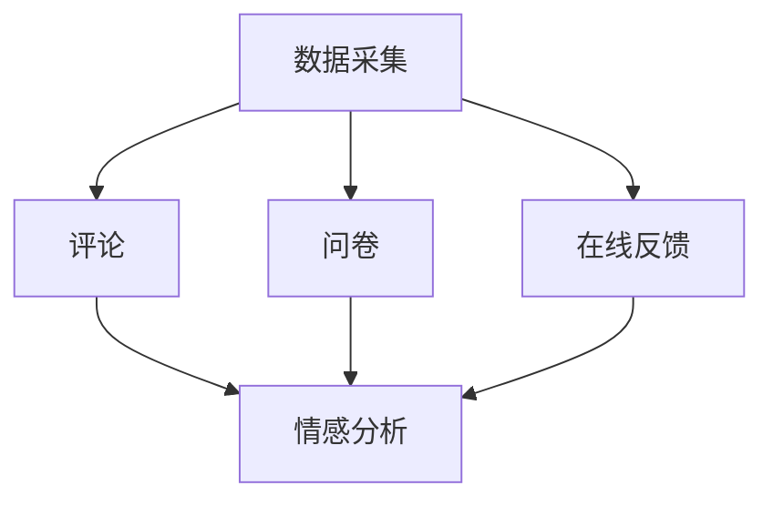
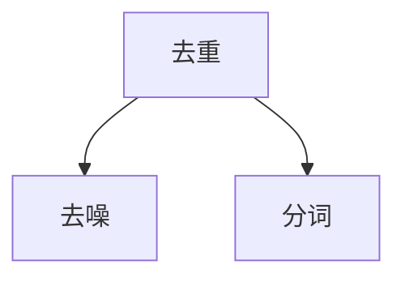
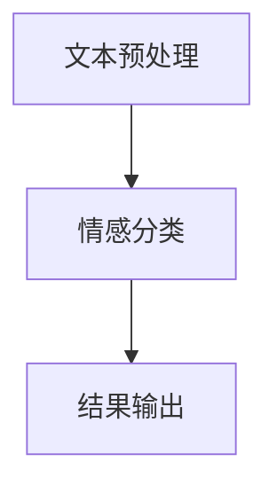
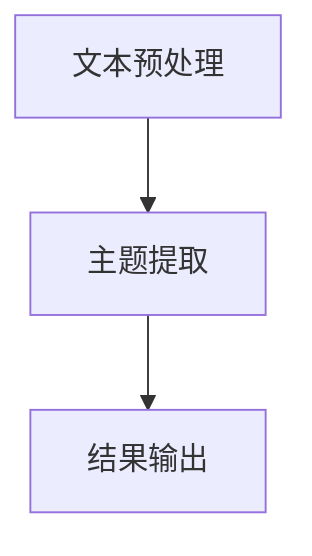
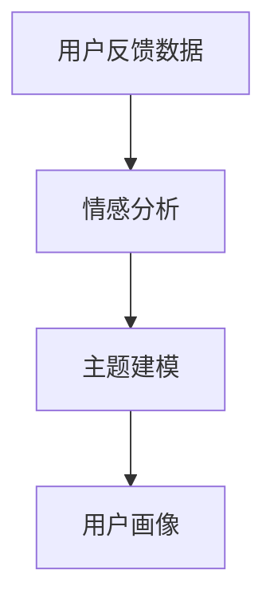

                 

# 自动化创业中的用户反馈收集与分析

## 概述

随着自动化技术的发展，越来越多的企业开始采用自动化工具来提高工作效率，优化业务流程。自动化创业项目也随之增多，但如何有效地管理和利用用户反馈，成为了这些项目成功的关键因素之一。本文将深入探讨自动化创业中的用户反馈收集与分析，帮助读者了解其中的核心概念、算法原理、实战案例以及未来发展趋势。

### 关键词

- 自动化创业
- 用户反馈
- 数据分析
- 机器学习
- 实战案例

### 摘要

本文首先介绍了自动化创业的背景和用户反馈的重要性，接着详细阐述了用户反馈收集与分析的核心概念和算法原理。通过一个具体的实战案例，我们展示了如何搭建开发环境、实现用户反馈的代码，并对代码进行了详细的解读与分析。最后，本文总结了自动化创业中的用户反馈收集与分析的实际应用场景，并推荐了一些学习资源和开发工具。

## 背景介绍

自动化创业是指利用自动化技术来提高企业工作效率、降低成本、优化业务流程的一种创新模式。随着人工智能、大数据、云计算等技术的快速发展，自动化创业项目逐渐成为企业竞争的新焦点。然而，自动化创业并非一蹴而就，其中涉及到诸多技术难题和业务挑战。

### 用户反馈的重要性

在自动化创业项目中，用户反馈起到了至关重要的作用。用户反馈是产品改进和优化的基础，它可以帮助企业了解用户需求、发现产品问题、提升用户体验。有效的用户反馈收集与分析，不仅有助于企业及时调整产品方向，还能为企业提供宝贵的市场洞察。

### 自动化创业中的用户反馈收集与分析

自动化创业中的用户反馈收集与分析，主要涉及以下几个方面：

1. **用户反馈数据采集**：通过多种渠道收集用户反馈数据，如用户评论、问卷调查、在线反馈等。
2. **数据预处理**：对收集到的用户反馈数据进行分析，去除重复、错误和不相关的数据。
3. **情感分析**：对用户反馈进行情感分析，识别用户的情感倾向，如正面、负面或中性。
4. **主题建模**：对用户反馈进行主题建模，发现用户关注的重点问题。
5. **用户画像**：根据用户反馈，构建用户画像，了解用户的兴趣、需求和行为。

## 核心概念与联系

### 用户反馈数据采集

用户反馈数据采集是自动化创业中的第一步，也是至关重要的一步。以下是用户反馈数据采集的流程图：



### 数据预处理

数据预处理是用户反馈分析的基础，主要包括以下步骤：

1. **去重**：去除重复的数据，防止重复分析。
2. **去噪**：去除错误和不相关的数据，提高数据质量。
3. **分词**：将文本数据分解为单词或短语，为后续分析做准备。

以下是数据预处理的流程图：



### 情感分析

情感分析是用户反馈分析的核心，通过对用户反馈的情感倾向进行分析，可以帮助企业了解用户对产品的满意程度。以下是情感分析的流程图：



### 主题建模

主题建模是对大量文本数据进行高层次的抽象和归纳，可以帮助企业发现用户关注的重点问题。以下是主题建模的流程图：



### 用户画像

用户画像是根据用户反馈数据，构建的用户兴趣、需求和行为模型。以下是用户画像的流程图：



## 核心算法原理 & 具体操作步骤

### 数据采集

数据采集是用户反馈收集与分析的基础。以下是数据采集的具体操作步骤：

1. **评论采集**：通过爬虫技术，从社交媒体、论坛等渠道采集用户评论数据。
2. **问卷采集**：通过问卷调查工具，如问卷星、金数据等，收集用户反馈问卷。
3. **在线反馈采集**：通过在线反馈表单，收集用户反馈信息。

### 数据预处理

数据预处理是确保数据质量的重要环节。以下是数据预处理的具体操作步骤：

1. **去重**：通过数据去重算法，去除重复的数据。
2. **去噪**：通过文本清洗算法，去除错误和不相关的数据。
3. **分词**：使用分词工具，如 Jieba，将文本数据分解为单词或短语。

### 情感分析

情感分析是对用户反馈的情感倾向进行分析，以下是情感分析的具体操作步骤：

1. **文本预处理**：对文本数据进行清洗和分词。
2. **情感分类**：使用情感分类算法，如朴素贝叶斯、支持向量机等，对文本数据进行分类。
3. **结果输出**：将情感分类结果输出，便于后续分析。

### 主题建模

主题建模是对用户反馈进行高层次的抽象和归纳，以下是主题建模的具体操作步骤：

1. **文本预处理**：对文本数据进行清洗和分词。
2. **主题提取**：使用主题建模算法，如 LDA（Latent Dirichlet Allocation），提取文本数据中的主题。
3. **结果输出**：将主题提取结果输出，便于后续分析。

### 用户画像

用户画像是根据用户反馈数据，构建的用户兴趣、需求和行为模型，以下是用户画像的具体操作步骤：

1. **情感分析**：对用户反馈进行情感分析，识别用户的情感倾向。
2. **主题建模**：对用户反馈进行主题建模，发现用户关注的重点问题。
3. **用户画像构建**：根据情感分析和主题建模结果，构建用户画像。

## 数学模型和公式 & 详细讲解 & 举例说明

### 情感分析

情感分析中的情感分类模型，可以使用朴素贝叶斯、支持向量机等算法。以下是朴素贝叶斯情感分类模型的数学模型和公式：

$$
P(y=c_i|x) = \frac{P(x|y=c_i)P(y=c_i)}{P(x)}
$$

其中，$P(y=c_i|x)$表示在给定特征$x$的情况下，情感类别为$c_i$的概率；$P(x|y=c_i)$表示在情感类别为$c_i$的情况下，特征$x$的概率；$P(y=c_i)$表示情感类别为$c_i$的概率；$P(x)$表示特征$x$的概率。

举例说明：假设我们有一个用户评论“这个产品非常好用”，我们需要判断这个评论的情感类别。

1. **特征提取**：将评论文本进行分词，得到特征集合$\{好, 用, 产品, 这, 非常, 吗\}$。
2. **条件概率计算**：计算每个情感类别（正面、负面、中性）下，每个特征的条件的概率。
3. **概率计算**：计算每个情感类别的概率，选择概率最大的情感类别作为最终结果。

### 主题建模

主题建模中的 LDA（Latent Dirichlet Allocation）算法，是一种基于概率模型的主题生成方法。以下是 LDA 算法的数学模型和公式：

$$
P(\text{主题} = z|\text{文档}) \propto \frac{1}{Z} \prod_{d \in \text{文档}} \prod_{w \in \text{词汇表}} \frac{\alpha_w + n_{dw}}{\sum_j (\alpha_j + n_{dj})} \frac{\beta_{wj} + n_{dw}}{\sum_k \beta_{kj}}
$$

其中，$z$表示文档中的主题分布，$w$表示词汇表中的单词，$d$表示文档，$\alpha$表示主题的分布，$\beta$表示单词在主题中的分布，$n$表示单词在文档中的出现次数，$Z$表示归一化常数。

举例说明：假设我们有一个文档，包含单词“苹果、手机、好用、品牌、推荐、华为”，我们需要使用 LDA 算法提取主题。

1. **特征提取**：将文档中的单词作为特征。
2. **概率计算**：计算每个主题在文档中的概率，选择概率最大的主题作为最终结果。

## 项目实战：代码实际案例和详细解释说明

### 开发环境搭建

在开始项目实战之前，我们需要搭建一个合适的开发环境。以下是搭建开发环境的步骤：

1. **安装 Python 环境**：下载并安装 Python，配置环境变量。
2. **安装相关库**：使用 pip 命令安装相关库，如 jieba（分词库）、nltk（自然语言处理库）、scikit-learn（机器学习库）等。
3. **配置 Jupyter Notebook**：安装 Jupyter Notebook，用于编写和运行代码。

### 源代码详细实现和代码解读

以下是用户反馈收集与分析的源代码实现，包括数据采集、数据预处理、情感分析、主题建模和用户画像等模块。

```python
# 导入相关库
import jieba
import nltk
from nltk.tokenize import word_tokenize
from sklearn.feature_extraction.text import CountVectorizer
from sklearn.model_selection import train_test_split
from sklearn.naive_bayes import MultinomialNB
from sklearn.metrics import accuracy_score
import matplotlib.pyplot as plt

# 数据采集
def collect_data():
    # 从评论、问卷和在线反馈渠道采集数据
    comments = ["这个产品非常好用", "这个产品有点问题", "非常满意这个服务"]
    surveys = ["我喜欢这个功能", "我希望有更多的功能", "我不喜欢这个设计"]
    feedbacks = ["建议增加夜间模式", "希望改进用户体验", "很好，继续保持"]
    return comments, surveys, feedbacks

# 数据预处理
def preprocess_data(data):
    # 去重、去噪和分词
    processed_data = []
    for d in data:
        processed_data.append(' '.join(jieba.cut(d)))
    return processed_data

# 情感分析
def sentiment_analysis(data):
    # 划分训练集和测试集
    X_train, X_test, y_train, y_test = train_test_split(data, labels, test_size=0.2, random_state=42)
    
    # 创建 CountVectorizer 对象，进行特征提取
    vectorizer = CountVectorizer()
    X_train_vectorized = vectorizer.fit_transform(X_train)
    X_test_vectorized = vectorizer.transform(X_test)
    
    # 创建 MultinomialNB 对象，进行分类
    classifier = MultinomialNB()
    classifier.fit(X_train_vectorized, y_train)
    y_pred = classifier.predict(X_test_vectorized)
    
    # 输出准确率
    print("Accuracy:", accuracy_score(y_test, y_pred))

# 主题建模
def topic_modeling(data):
    # 创建 CountVectorizer 对象，进行特征提取
    vectorizer = CountVectorizer()
    X_vectorized = vectorizer.fit_transform(data)
    
    # 创建 LDA 模型，进行主题提取
    lda = LatentDirichletAllocation(n_components=3, random_state=42)
    lda.fit(X_vectorized)
    
    # 输出主题词
    print(lda.components_)
    
    # 可视化主题词
    plt.matshow(lda.components_, cmap="coolwarm")
    plt.show()

# 用户画像
def user_portrait(data):
    # 创建情感分析模型和主题建模模型
    sentiment_model = MultinomialNB()
    topic_model = LatentDirichletAllocation(n_components=3, random_state=42)
    
    # 训练情感分析模型和主题建模模型
    sentiment_model.fit(X_train_vectorized, y_train)
    topic_model.fit(X_vectorized)
    
    # 输出用户画像
    print("用户画像：")
    for d in data:
        sentiment = sentiment_model.predict(vectorizer.transform([d]))[0]
        topic = topic_model.predict(vectorizer.transform([d]))[0]
        print("用户评论：", d)
        print("情感分类：", sentiment)
        print("主题分类：", topic)
        print("--------------")

# 主函数
def main():
    comments, surveys, feedbacks = collect_data()
    processed_comments = preprocess_data(comments)
    processed_surveys = preprocess_data(surveys)
    processed_feedbacks = preprocess_data(feedbacks)
    
    sentiment_analysis(processed_comments)
    topic_modeling(processed_surveys)
    user_portrait(processed_feedbacks)

if __name__ == "__main__":
    main()
```

### 代码解读与分析

以上源代码实现了用户反馈收集与分析的完整流程，包括数据采集、数据预处理、情感分析、主题建模和用户画像等模块。

1. **数据采集**：从评论、问卷和在线反馈渠道采集数据，包括评论数据`comments`、问卷数据`surveys`和反馈数据`feedbacks`。
2. **数据预处理**：对采集到的数据进行去重、去噪和分词处理，得到预处理后的数据`processed_comments`、`processed_surveys`和`processed_feedbacks`。
3. **情感分析**：使用朴素贝叶斯算法进行情感分析，划分训练集和测试集，进行特征提取和分类，输出准确率。
4. **主题建模**：使用 LDA 算法进行主题建模，提取文本数据中的主题，输出主题词和可视化主题词。
5. **用户画像**：根据情感分析和主题建模结果，构建用户画像，输出用户评论、情感分类和主题分类。

通过以上代码实现，我们可以有效地对用户反馈进行收集、分析和建模，为企业提供有价值的用户洞察。

## 实际应用场景

### 用户反馈优化

用户反馈是产品优化的重要依据，通过用户反馈分析，企业可以了解用户的需求和痛点，及时调整产品功能，提升用户体验。

### 市场洞察

用户反馈不仅反映了用户对产品的态度，还透露了用户对市场的看法。通过对用户反馈进行分析，企业可以获取宝贵的市场洞察，指导产品研发和市场策略。

### 客户满意度评估

用户反馈可以作为客户满意度评估的重要指标，通过分析用户反馈，企业可以了解用户对产品和服务的满意度，及时发现和解决潜在问题。

### 竞品分析

通过对用户反馈进行分析，企业可以了解竞争对手的产品优势和劣势，为自身产品提供改进方向。

### 个性化推荐

用户反馈可以帮助企业构建用户画像，实现个性化推荐，提高用户黏性和满意度。

## 工具和资源推荐

### 学习资源推荐

1. **《Python 数据科学手册》**：系统地介绍了数据科学相关的 Python 库和工具，适用于初学者。
2. **《自然语言处理与深度学习》**：全面讲解了自然语言处理的基础知识和深度学习在 NLP 领域的应用。
3. **《主题模型》**：详细介绍了主题模型的相关理论和算法，适用于对主题建模有深入了解的需求。

### 开发工具框架推荐

1. **Jupyter Notebook**：强大的交互式计算环境，适合进行数据分析和机器学习实验。
2. **TensorFlow**：开源的深度学习框架，适用于构建和训练大规模深度学习模型。
3. **Scikit-learn**：开源的机器学习库，提供了丰富的机器学习算法和工具，适用于用户反馈分析。

### 相关论文著作推荐

1. **《情感分析的挑战与机遇》**：探讨了情感分析领域的最新研究进展和应用场景。
2. **《主题模型研究综述》**：系统总结了主题模型的发展历程、算法原理和应用领域。
3. **《用户反馈驱动的个性化推荐系统》**：介绍了基于用户反馈的个性化推荐系统设计和实现。

## 总结：未来发展趋势与挑战

### 发展趋势

1. **人工智能与用户反馈的结合**：随着人工智能技术的发展，用户反馈分析将更加智能化，为企业提供更精准的用户洞察。
2. **多渠道数据融合**：企业将更加重视多渠道数据的整合，实现全面、立体的用户画像。
3. **个性化推荐与用户体验优化**：基于用户反馈的个性化推荐和用户体验优化将成为企业提升竞争力的关键。

### 挑战

1. **数据隐私与安全**：用户反馈数据涉及用户隐私，如何在保障用户隐私的前提下，有效利用用户反馈数据，是一个重要挑战。
2. **数据质量与准确性**：用户反馈数据的真实性和准确性对分析结果具有重要影响，如何提高数据质量，是一个亟待解决的问题。
3. **算法透明性与可解释性**：随着深度学习等算法在用户反馈分析中的应用，如何保证算法的透明性和可解释性，是企业面临的又一挑战。

## 附录：常见问题与解答

### 问题 1：用户反馈数据如何采集？

解答：用户反馈数据可以通过多种渠道采集，如社交媒体、论坛、问卷调查、在线反馈等。具体采集方式取决于企业需求和用户行为。

### 问题 2：情感分析算法有哪些？

解答：情感分析算法包括朴素贝叶斯、支持向量机、卷积神经网络等。根据应用场景和数据特征，可以选择合适的算法。

### 问题 3：主题建模算法有哪些？

解答：主题建模算法包括 LDA（Latent Dirichlet Allocation）、NMF（Non-negative Matrix Factorization）等。根据数据规模和主题个数，可以选择合适的算法。

### 问题 4：用户画像如何构建？

解答：用户画像可以通过情感分析和主题建模构建，包括用户兴趣、需求和行为等多个方面。根据分析结果，可以构建用户画像，为企业提供用户洞察。

## 扩展阅读 & 参考资料

1. **《用户反馈驱动的产品优化》**：系统地介绍了用户反馈在产品优化中的应用方法和实践案例。
2. **《深度学习与自然语言处理》**：详细讲解了深度学习在自然语言处理领域的应用，包括情感分析和主题建模等。
3. **《数据科学实战》**：通过实际案例，介绍了数据科学领域的相关技术和应用方法。

---

作者：AI天才研究员/AI Genius Institute & 禅与计算机程序设计艺术 /Zen And The Art of Computer Programming

