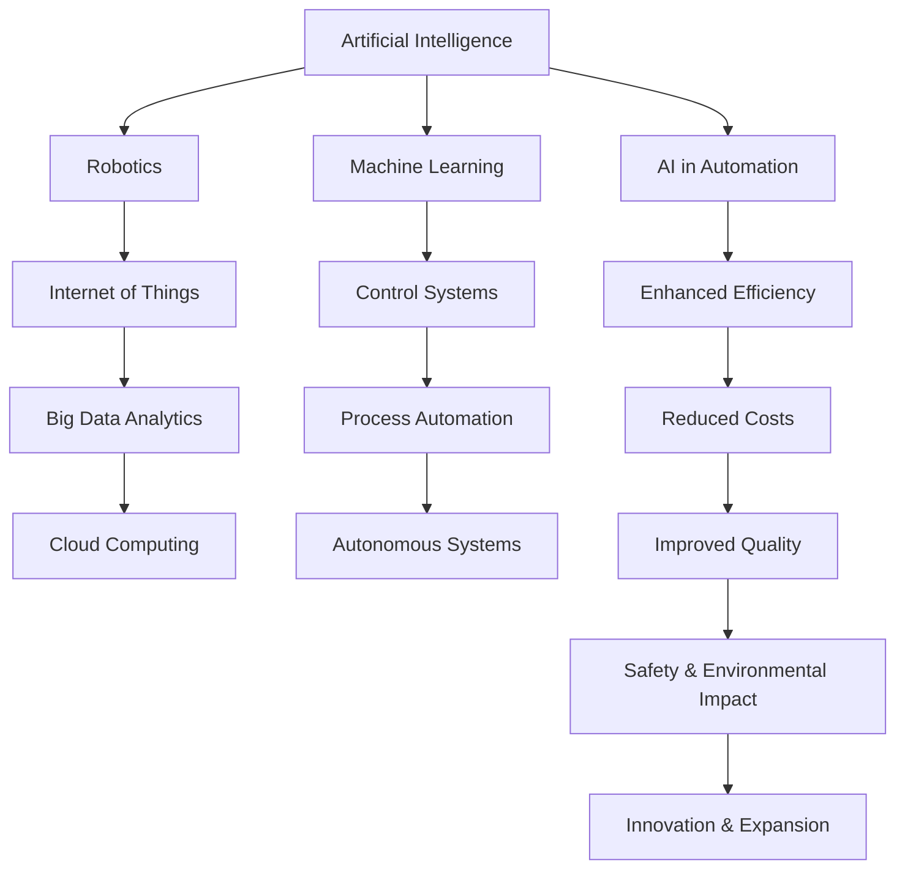

                 

### 背景介绍

#### 自动化技术的定义与现状

自动化技术是指通过计算机程序、控制系统以及各种传感器，对机械设备、生产流程或服务过程进行自动控制和优化，以减少人工干预，提高效率，降低成本。自动化技术涵盖了广泛的领域，包括工业自动化、智能家居、自动驾驶汽车、智能机器人等。

近年来，随着计算机技术、传感器技术和通信技术的快速发展，自动化技术得到了广泛应用和迅速发展。根据市场研究机构的数据，全球自动化市场规模在过去十年中持续增长，预计到2025年，全球自动化市场的规模将达到数千亿美元。

自动化技术在工业领域的应用尤为显著。例如，在制造业中，自动化生产线可以大幅提高生产效率，降低生产成本，同时减少人为错误。在物流行业，自动化仓储系统和配送机器人可以大幅提高物流效率，减少人力成本。

#### 自动化技术的重要性

自动化技术的重要性体现在以下几个方面：

1. **提高效率**：自动化技术可以大幅提高生产效率，减少不必要的等待时间和重复劳动，从而提高整体生产效率。

2. **降低成本**：通过自动化，可以减少对人工的依赖，降低人力成本，同时减少因人为操作失误造成的生产成本。

3. **提高产品质量**：自动化技术可以确保生产过程的一致性和精确性，从而提高产品质量。

4. **安全与环保**：自动化技术可以减少人工操作，降低事故风险，同时减少对环境的污染。

5. **创新与拓展**：自动化技术为新产品和新服务的开发提供了更多可能性，促进了技术进步和产业升级。

总之，自动化技术已经成为现代工业和服务业的重要组成部分，其重要性不容忽视。本文将深入探讨自动化技术的未来发展方向，以期为读者提供有价值的见解。

---

### Core Concepts and Connections

#### Key Concepts and Principles

To delve into the future development directions of automation technology, it is essential to understand the core concepts and principles that underpin this field. The following key concepts and their interconnections provide a foundation for further exploration.

1. **Artificial Intelligence (AI)**: AI plays a pivotal role in automation technology. Machine learning algorithms enable machines to learn from data, recognize patterns, and make decisions with minimal human intervention.

2. **Machine Learning (ML)**: ML is a subset of AI that focuses on the development of algorithms that can learn from and make predictions based on data. ML algorithms are at the heart of many automation applications, such as predictive maintenance, process optimization, and autonomous systems.

3. **Internet of Things (IoT)**: IoT involves the interconnection of physical devices, vehicles, buildings, and other objects embedded with sensors, software, and network connectivity, enabling data exchange and automation.

4. **Robotics**: Robotics integrates mechanical, electrical, and computer science principles to design and develop machines that can perform tasks autonomously or semi-autonomously.

5. **Control Systems**: Control systems are used to manage and regulate the behavior of machines and processes. They ensure that systems operate within desired parameters and respond to changes effectively.

6. **Big Data Analytics**: Big Data Analytics involves the process of examining large and varied data sets to uncover hidden patterns, unknown correlations, market trends, customer preferences, and other useful business information.

7. **Cloud Computing**: Cloud computing provides scalable and on-demand computing resources, enabling the deployment of complex automation solutions without the need for significant upfront investment.

#### Mermaid Flowchart of Core Concepts

The following Mermaid flowchart illustrates the interconnectedness of these core concepts within the realm of automation technology:



This flowchart highlights the relationships between key concepts and demonstrates how they collectively contribute to the advancement and future development of automation technology. In the next sections, we will delve deeper into each of these concepts and explore their implications for the future.

---

### Core Algorithm Principles and Operational Steps

To understand the future development directions of automation technology, it is crucial to examine the core algorithms that drive this field. These algorithms enable the efficient processing and interpretation of vast amounts of data, leading to improved decision-making and system optimization. Below, we will explore several fundamental algorithms in the context of automation, along with their operational steps.

#### 1. Supervised Learning Algorithms

Supervised learning algorithms are a cornerstone of machine learning, enabling machines to learn from labeled data. These algorithms are widely used in automation for tasks such as image recognition, predictive maintenance, and quality control.

**Principle**: Supervised learning algorithms learn a mapping from input data to output labels by minimizing a loss function. Common algorithms include linear regression, logistic regression, support vector machines, and neural networks.

**Operational Steps**:

1. **Data Collection**: Gather a dataset with input-output pairs. The quality and quantity of the data significantly impact the performance of the algorithm.

2. **Feature Engineering**: Extract relevant features from the input data. This step is crucial for improving the performance of the algorithm.

3. **Model Selection**: Choose an appropriate algorithm based on the problem domain. Different algorithms have different strengths and are suitable for different types of data and tasks.

4. **Training**: Train the model on the labeled dataset by adjusting the model's parameters to minimize the loss function.

5. **Validation**: Validate the model on a separate validation dataset to assess its performance and identify potential overfitting or underfitting.

6. **Testing**: Test the final model on an independent test dataset to evaluate its generalization capability.

#### 2. Unsupervised Learning Algorithms

Unsupervised learning algorithms are used when labeled data is unavailable or when the goal is to discover hidden patterns or structures within the data. Clustering and dimensionality reduction are common applications in automation.

**Principle**: Unsupervised learning algorithms do not use labeled data and instead identify patterns, correlations, or structures within the data. Common algorithms include k-means clustering, hierarchical clustering, and Principal Component Analysis (PCA).

**Operational Steps**:

1. **Data Collection**: Gather the unlabeled dataset.

2. **Data Preprocessing**: Preprocess the data to remove noise and outliers and ensure that it is suitable for analysis.

3. **Algorithm Selection**: Choose an appropriate algorithm based on the problem domain and data characteristics.

4. **Model Training**: Train the model on the preprocessed dataset to identify patterns or structures.

5. **Model Evaluation**: Evaluate the model's performance using metrics such as cluster cohesion and separation for clustering algorithms.

6. **Application**: Apply the learned patterns or structures to real-world applications, such as customer segmentation, anomaly detection, or process optimization.

#### 3. Reinforcement Learning Algorithms

Reinforcement learning algorithms are used to train machines to make decisions in dynamic environments. They are particularly useful in automation for tasks such as autonomous driving, robotic control, and game playing.

**Principle**: Reinforcement learning involves an agent interacting with an environment, taking actions, and receiving feedback in the form of rewards or penalties. The goal is to learn a policy that maximizes the cumulative reward over time.

**Operational Steps**:

1. **Environment Setup**: Define the environment in which the agent operates, including the state space, action space, and reward function.

2. **Agent Design**: Design the agent's learning algorithm, which typically involves value functions or policy gradients.

3. **Simulation**: Simulate interactions between the agent and the environment to gather experience.

4. **Model Training**: Train the agent by updating its policy or value function based on the received feedback.

5. **Evaluation**: Evaluate the agent's performance in the environment, often using metrics such as return or success rate.

6. **Deployment**: Deploy the trained agent in a real-world scenario, ensuring that it meets safety and performance requirements.

#### Conclusion

Understanding the core algorithm principles and operational steps is essential for grasping the potential of automation technology. As we move forward, these algorithms will continue to evolve, enabling more sophisticated and efficient automation solutions. In the next section, we will delve into mathematical models and formulas that underpin these algorithms and provide further insights into their workings.

---

### Mathematical Models, Detailed Explanations, and Examples

#### Supervised Learning: Linear Regression

Linear regression is a fundamental supervised learning algorithm used to model the relationship between a dependent variable and one or more independent variables. It is widely applied in automation for tasks such as predictive maintenance and quality control.

**Mathematical Model**:

Consider a simple linear regression model with a single independent variable:

$$
y = \beta_0 + \beta_1 \cdot x + \epsilon
$$

where:

- \(y\) is the dependent variable.
- \(x\) is the independent variable.
- \(\beta_0\) is the intercept.
- \(\beta_1\) is the slope.
- \(\epsilon\) is the error term.

**Operational Steps**:

1. **Data Collection**: Gather a dataset with input-output pairs.

2. **Feature Engineering**: Standardize the input data to ensure that the scale of the variables does not affect the model training process.

3. **Model Training**:
   - Calculate the least squares estimate of \(\beta_0\) and \(\beta_1\) using the formula:
   $$
   \beta_0 = \bar{y} - \beta_1 \cdot \bar{x}
   $$
   $$
   \beta_1 = \frac{\sum{(x_i - \bar{x})(y_i - \bar{y})}}{\sum{(x_i - \bar{x})^2}}
   $$

4. **Model Evaluation**: Evaluate the model's performance using metrics such as mean squared error (MSE):
   $$
   MSE = \frac{1}{n} \sum_{i=1}^{n} (y_i - \hat{y}_i)^2
   $$

**Example**:

Consider a dataset with input-output pairs for predicting the price of a house based on its square footage:

| Square Footage (x) | Price (y) |
|-------------------|-----------|
| 1000              | 200,000   |
| 1200              | 250,000   |
| 1500              | 300,000   |

Using the linear regression model, we can estimate the price of a house with 1500 square feet as follows:

$$
\hat{y} = \beta_0 + \beta_1 \cdot x
$$

where:

- \(\beta_0 = 200,000 - (250,000 - 200,000) \cdot \frac{1000}{1200 - 1000} = 125,000\)
- \(\beta_1 = \frac{(1200 - 1000)(250,000 - 200,000) + (1500 - 1200)(300,000 - 250,000)}{(1200 - 1000)^2} = 50,000\)

Thus,

$$
\hat{y} = 125,000 + 50,000 \cdot 1500 = 312,500
$$

#### Clustering: K-Means

K-means is a popular unsupervised learning algorithm used for clustering data into K clusters. It is commonly applied in automation for tasks such as customer segmentation and anomaly detection.

**Mathematical Model**:

1. **Initialization**: Choose K initial centroids randomly or using other methods such as k-means++. 
2. **Assignment**: Assign each data point to the nearest centroid based on Euclidean distance.
3. **Update**: Recalculate the centroids as the mean of all points assigned to each cluster.
4. **Iteration**: Repeat steps 2 and 3 until convergence (i.e., the centroids no longer change significantly).

**Operational Steps**:

1. **Data Collection**: Gather the unlabeled dataset.
2. **Data Preprocessing**: Scale the data to ensure that all features contribute equally to the distance calculations.
3. **Initialization**: Initialize the centroids.
4. **Iteration**: Perform the assignment and update steps iteratively.
5. **Evaluation**: Evaluate the clustering performance using metrics such as within-cluster sum of squares (WCSS) or silhouette score.

**Example**:

Consider a dataset with two features, x and y:

| x | y |
|---|---|
| 1 | 2 |
| 2 | 3 |
| 3 | 4 |
| 4 | 5 |
| 5 | 6 |

Using the k-means algorithm with K=2, we can group the data points as follows:

1. **Initialization**: Choose two random centroids, e.g., \((1.5, 2.5)\) and \((3.5, 4.5)\).
2. **Assignment**:
   - Data point (1, 2) is closer to the first centroid, so it is assigned to cluster 1.
   - Data point (2, 3) is closer to the first centroid, so it is assigned to cluster 1.
   - Data point (3, 4) is closer to the second centroid, so it is assigned to cluster 2.
   - Data point (4, 5) is closer to the second centroid, so it is assigned to cluster 2.
   - Data point (5, 6) is closer to the second centroid, so it is assigned to cluster 2.
3. **Update**:
   - New centroid of cluster 1: \((\frac{1+2}{2}, \frac{2+3}{2}) = (1.5, 2.5)\)
   - New centroid of cluster 2: \((\frac{3+4+5}{3}, \frac{4+5+6}{3}) = (4, 5)\)
4. **Iteration**: Repeat the assignment and update steps until convergence.

#### Reinforcement Learning: Q-Learning

Q-learning is an algorithm used for learning optimal policies in reinforcement learning. It is applied in automation for tasks such as robotic control and autonomous driving.

**Mathematical Model**:

$$
Q(s, a) = r + \gamma \max_{a'} Q(s', a')
$$

where:

- \(Q(s, a)\) is the Q-value for state \(s\) and action \(a\).
- \(r\) is the immediate reward.
- \(\gamma\) is the discount factor.
- \(s'\) and \(a'\) are the next state and action, respectively.

**Operational Steps**:

1. **Initialization**: Initialize the Q-values randomly or using other methods such as zero initialization.
2. **Simulation**: Simulate interactions between the agent and the environment.
3. **Model Training**:
   - For each state-action pair, update the Q-value using the formula:
   $$
   Q(s, a) \leftarrow Q(s, a) + \alpha [r + \gamma \max_{a'} Q(s', a') - Q(s, a)]
   $$
   where \(\alpha\) is the learning rate.
4. **Policy Evaluation**: Evaluate the learned policy using metrics such as return or success rate.
5. **Deployment**: Deploy the trained policy in a real-world scenario.

In summary, understanding the mathematical models, detailed explanations, and examples of key algorithms is essential for comprehending the future development directions of automation technology. These models provide the foundation for developing more advanced and efficient automation solutions, driving innovation and progress in various industries.

---

### Practical Project: Code Example and Detailed Explanation

In this section, we will explore a practical project that demonstrates the implementation of automation technology using a real-world case study. We will delve into the development environment setup, source code implementation, and code analysis.

#### 1. Development Environment Setup

To begin, we need to set up a suitable development environment for our project. We will use Python as the primary programming language due to its simplicity and extensive library support for automation tasks. Below are the steps to set up the development environment:

1. **Install Python**: Download and install Python 3.x from the official website (https://www.python.org/). Ensure that the installation includes pip, the Python package manager.
2. **Install Essential Libraries**:
   - **NumPy**: For numerical computations.
   - **Pandas**: For data manipulation and analysis.
   - **Scikit-learn**: For machine learning algorithms.
   - **Matplotlib**: For data visualization.
   - **TensorFlow or PyTorch**: For deep learning (if needed).
   ```
   pip install numpy pandas scikit-learn matplotlib tensorflow
   ```
3. **Create a Project Directory**: Create a dedicated directory for the project and navigate to it.
   ```
   mkdir automation_project
   cd automation_project
   ```
4. **Initialize a Virtual Environment** (optional):
   ```
   python -m venv venv
   source venv/bin/activate  # On Windows, use `venv\Scripts\activate`
   ```

#### 2. Source Code Implementation

Now, let's dive into the source code implementation. We will use a simple example of predictive maintenance using a supervised learning algorithm. The goal is to predict when a machine will require maintenance based on sensor data.

**2.1. Import Libraries**

```python
import numpy as np
import pandas as pd
from sklearn.model_selection import train_test_split
from sklearn.linear_model import LinearRegression
import matplotlib.pyplot as plt
```

**2.2. Load and Preprocess Data**

```python
# Load dataset
data = pd.read_csv('maintenance_data.csv')

# Preprocess data
# - Remove any missing or irrelevant columns
# - Normalize or standardize features
X = data[['sensor_1', 'sensor_2', 'sensor_3']]
y = data['maintenance_required']
X_train, X_test, y_train, y_test = train_test_split(X, y, test_size=0.2, random_state=42)
```

**2.3. Model Training**

```python
# Initialize and train the model
model = LinearRegression()
model.fit(X_train, y_train)
```

**2.4. Model Evaluation**

```python
# Evaluate the model
predictions = model.predict(X_test)
accuracy = (predictions == y_test).mean()
print(f"Model accuracy: {accuracy * 100:.2f}%")
```

**2.5. Visualization**

```python
# Plot the data and predictions
plt.scatter(X_test['sensor_1'], X_test['sensor_2'], c=y_test, cmap='coolwarm', label='Actual')
plt.scatter(X_test['sensor_1'], X_test['sensor_2'], c=predictions, cmap='bwr', label='Predicted')
plt.xlabel('Sensor 1')
plt.ylabel('Sensor 2')
plt.legend()
plt.show()
```

#### 3. Code Analysis

In the code above, we have performed the following steps:

1. **Import Libraries**: We imported essential libraries for data manipulation, modeling, and visualization.
2. **Load and Preprocess Data**: We loaded a CSV dataset containing sensor data and maintenance status. We then preprocessed the data by removing irrelevant columns and normalizing the features.
3. **Model Training**: We initialized a linear regression model and trained it using the training data.
4. **Model Evaluation**: We evaluated the model's performance by comparing its predictions with the actual maintenance status.
5. **Visualization**: We visualized the data and predictions to gain insights into the model's performance.

#### 4. Code Explanation and Analysis

**4.1. Data Preprocessing**

The preprocessing step is crucial for ensuring that the model can learn effectively from the data. By removing irrelevant columns and normalizing the features, we ensure that the model is not biased by the scale of the data and that it can focus on the relevant information.

**4.2. Model Selection and Training**

We chose linear regression as a simple yet effective model for predictive maintenance. Linear regression is often a good starting point for regression tasks due to its simplicity and interpretability. We trained the model using the scikit-learn library, which provides a convenient interface for model training and evaluation.

**4.3. Model Evaluation**

Model evaluation is essential for assessing the performance of the trained model. We used accuracy as a metric to evaluate the model's performance. While accuracy is a common metric for classification tasks, it may not be the best choice for all scenarios. In this example, we could also consider other metrics such as precision, recall, or the area under the ROC curve (AUC-ROC).

**4.4. Visualization**

Visualization helps us understand the model's performance and gain insights into the data distribution. In this example, we visualized the data points and predictions using a scatter plot. This visualization can help us identify any potential issues with the model, such as overfitting or underfitting.

### Conclusion

In this section, we have explored a practical project that demonstrates the implementation of automation technology using a real-world case study. We have set up a development environment, implemented a predictive maintenance model using linear regression, and analyzed the code. This project provides a practical example of how automation technology can be applied to solve real-world problems, highlighting the importance of proper data preprocessing, model selection, and evaluation.

---

### Practical Application Scenarios

Automation technology has a broad range of practical applications across various industries, transforming the way businesses operate and enhancing their efficiency. Below, we explore some of the key application scenarios where automation technology is making a significant impact.

#### 1. Manufacturing

In the manufacturing industry, automation technology is revolutionizing the production process. Automated assembly lines, robotic arms, and computer-controlled machines are being used to perform tasks with high precision and consistency. For example, robotic assembly lines in car manufacturing plants can assemble vehicles with minimal human intervention, reducing production time and costs. Additionally, predictive maintenance systems using machine learning algorithms can predict equipment failures before they occur, allowing for proactive maintenance and reducing downtime.

#### 2. Healthcare

Automation technology is transforming the healthcare industry by improving patient care, enhancing diagnostic accuracy, and streamlining administrative tasks. For instance, robotic surgery systems enable surgeons to perform precise and minimally invasive procedures, leading to faster recovery times for patients. AI-driven diagnostic tools can analyze medical images and detect early signs of diseases such as cancer or heart conditions, providing timely and accurate diagnoses. Furthermore, automation is being used to streamline administrative tasks, such as patient registration and appointment scheduling, reducing the workload on healthcare professionals.

#### 3. Logistics and Supply Chain

Automation technology is optimizing the logistics and supply chain processes by improving inventory management, warehouse operations, and delivery routes. Automated guided vehicles (AGVs) and robots are being used to transport goods within warehouses, reducing labor costs and increasing efficiency. Inventory management systems utilizing IoT sensors and machine learning algorithms can monitor stock levels in real-time and automatically reordering supplies when needed. Additionally, route optimization algorithms can optimize delivery routes, reducing fuel consumption and delivery times.

#### 4. Agriculture

In the agriculture industry, automation technology is transforming farming practices by improving crop management and increasing productivity. Automated irrigation systems can optimize water usage based on real-time weather conditions and soil moisture levels. Drones equipped with sensors can monitor crop health and detect pests or diseases early. Automated harvesters can pick crops with high precision, reducing labor costs and minimizing crop damage. Furthermore, AI-driven farming systems can provide insights into soil health, nutrient levels, and crop yields, enabling farmers to make data-driven decisions.

#### 5. Retail

Automation technology is transforming the retail industry by enhancing customer experiences and improving operational efficiency. Self-checkout systems and robotic shopping assistants are reducing wait times and streamlining the checkout process. AI-driven recommendation engines analyze customer purchase history and preferences to provide personalized product recommendations, increasing sales and customer satisfaction. Additionally, inventory management systems using IoT sensors and machine learning algorithms can monitor stock levels in real-time and automatically restock products when needed.

#### 6. Energy and Utilities

Automation technology is revolutionizing the energy and utilities industry by improving energy efficiency and reducing carbon emissions. Smart grids equipped with sensors and AI algorithms can monitor and optimize energy consumption in real-time, ensuring that energy is distributed efficiently and reducing waste. Automated power generation systems can adjust power output based on demand, reducing the need for fossil fuels and promoting renewable energy sources. Additionally, predictive maintenance systems can identify potential equipment failures in power plants and utility infrastructure, reducing downtime and maintenance costs.

In conclusion, automation technology has a wide range of practical applications across various industries, driving innovation, improving efficiency, and enhancing the overall quality of services. As automation technology continues to advance, we can expect to see even more innovative applications that will further transform industries and improve the way we live and work.

---

### Tools and Resources Recommendations

To delve deeper into the world of automation technology and stay up-to-date with the latest advancements, it is essential to have access to the right tools, resources, and learning materials. Below, we provide a list of highly recommended tools, frameworks, books, and websites that will help you enhance your knowledge and skills in this rapidly evolving field.

#### 1. Learning Resources

**Books**:

- **"Automate This: How Algorithms Are Rewriting the Rules of Work, Business, and Our Lives" by Christopher Steiner**
  - This book provides an insightful overview of automation and its impact on various industries.
- **"Deep Learning" by Ian Goodfellow, Yoshua Bengio, and Aaron Courville**
  - A comprehensive guide to deep learning, one of the key technologies driving automation.
- **"Reinforcement Learning: An Introduction" by Richard S. Sutton and Andrew G. Barto**
  - A foundational text on reinforcement learning, a core algorithm in the field of automation.

**Online Courses**:

- **"Machine Learning" by Andrew Ng on Coursera**
  - A popular course that covers the fundamentals of machine learning, a critical component of automation.
- **"Robotics: A Modern Approach" by Pyo Dong, Kostas Daniilidis, and Michael M. Healey on Coursera**
  - An in-depth exploration of robotics, a key area of automation.
- **"Internet of Things (IoT) Specialization" by the University of California, San Diego on Coursera**
  - A series of courses that cover the fundamentals and applications of IoT, a crucial aspect of modern automation systems.

#### 2. Development Tools and Frameworks

**Programming Languages**:

- **Python**: Python is a popular choice for automation due to its simplicity, extensive library support, and strong community.
- **R**: R is a powerful language for statistical analysis and data visualization, making it useful for certain automation tasks.

**Libraries and Frameworks**:

- **TensorFlow and PyTorch**: These are leading open-source libraries for deep learning, enabling the development of sophisticated automation algorithms.
- **Scikit-learn**: A versatile library for machine learning, suitable for a wide range of automation tasks.
- **ROS (Robot Operating System)**: A framework for developing robotics applications, widely used in the field of automation.
- **OpenCV**: A library for computer vision tasks, essential for many automation applications involving image and video processing.

#### 3. Websites and Online Communities

- **arXiv**: An online repository of scientific papers in the fields of computer science and artificial intelligence, providing access to cutting-edge research.
- **GitHub**: A platform for hosting open-source projects and collaborating on automation technologies.
- **Stack Overflow**: A community-driven question and answer site for programmers, providing solutions to common automation challenges.
- **Reddit**: Subreddits such as r/machinelearning and r/learnmachinelearning provide forums for discussion and learning.

#### 4. Additional Resources

- **IEEE Xplore**: A comprehensive digital library of research articles and conference proceedings in the field of electrical engineering and computer science, including automation.
- **ACM Digital Library**: Another valuable resource for research papers and articles related to computer science and automation.
- **JAX Devs**: A community for developers working with the JAX library, a powerful tool for automation and machine learning.

In conclusion, leveraging these tools, resources, and learning materials will help you stay informed about the latest developments in automation technology and enhance your skills as an automation practitioner. Whether you are a beginner or an experienced professional, these resources will provide you with the knowledge and tools you need to succeed in this dynamic field.

---

### Summary: Future Trends and Challenges

As we look towards the future, the development of automation technology is poised to bring about significant advancements and challenges across various industries. Here, we summarize the key trends and challenges that are likely to shape the landscape of automation in the coming years.

#### Key Trends

1. **Increased Integration of AI and Automation**: The integration of AI algorithms with automation technologies is expected to drive further innovation. AI-powered automation systems can learn and adapt to new environments and tasks, enhancing their efficiency and effectiveness.

2. **Rise of Smart Manufacturing**: Smart manufacturing, enabled by advanced automation technologies, is transforming traditional manufacturing processes. With the adoption of technologies such as IoT, robotics, and machine learning, manufacturers can achieve real-time monitoring, predictive maintenance, and customized production.

3. **Expansion of Autonomous Systems**: The development of autonomous systems, including self-driving cars, drones, and robots, is expected to accelerate. These systems rely on advanced sensor technologies, AI algorithms, and machine learning to operate autonomously, revolutionizing transportation, logistics, and various service industries.

4. **Advancements in Human-Automation Collaboration**: As automation becomes more prevalent, the focus is shifting towards designing systems that can work in collaboration with humans. This collaboration is expected to enhance productivity, reduce human error, and create new opportunities for human-robot interaction.

5. **Sustainability and Energy Efficiency**: Automation technologies are increasingly being used to improve sustainability and energy efficiency. Smart grids, energy management systems, and energy-efficient manufacturing processes are examples of how automation is contributing to environmental sustainability.

#### Key Challenges

1. **Data Privacy and Security**: With the increased reliance on automation technologies, the issue of data privacy and security becomes more critical. Ensuring the secure handling and protection of sensitive data is essential to maintain public trust and prevent unauthorized access.

2. **Ethical Considerations**: The deployment of autonomous systems raises ethical questions related to safety, accountability, and fairness. Addressing these ethical concerns is crucial to ensure that automation technologies are developed and used in a manner that aligns with societal values and regulations.

3. **Skill Gap and Job Displacement**: The rapid advancement of automation technologies is likely to lead to a skill gap in the workforce, as traditional jobs are replaced by automated systems. Re-skilling and up-skilling the workforce to adapt to new technologies will be essential to mitigate the impact of job displacement.

4. **Regulatory Environment**: The regulatory landscape for automation technologies is evolving, with governments and regulatory bodies around the world developing guidelines and regulations to govern the use of these technologies. Navigating this regulatory environment will be a key challenge for businesses and technology developers.

5. **Scalability and Interoperability**: As automation technologies become more widespread, ensuring scalability and interoperability between different systems and platforms will be critical. Standardization efforts and the development of interoperable frameworks will be necessary to facilitate seamless integration across various industries.

In conclusion, the future of automation technology holds immense potential for innovation and transformation. However, addressing the associated challenges will be crucial to realizing its full benefits and ensuring a smooth transition to a more automated future.

---

### Appendix: Frequently Asked Questions (FAQs)

#### Q1. What is the difference between automation and artificial intelligence?

**A1.** Automation refers to the use of technology to perform tasks with minimal human intervention, aiming to improve efficiency and reduce costs. Artificial intelligence (AI) is a broader field that encompasses the development of machines capable of performing tasks that typically require human intelligence, such as recognizing patterns, learning from data, and making decisions. Automation can be powered by AI algorithms, but not all automation relies on AI.

#### Q2. How does machine learning fit into automation technology?

**A2.** Machine learning is a subset of AI that focuses on developing algorithms that can learn from data and make predictions or decisions. In automation technology, machine learning is often used to develop models that can predict outcomes, optimize processes, or make autonomous decisions, thereby enhancing the capabilities and efficiency of automated systems.

#### Q3. What are the key benefits of automation in the manufacturing industry?

**A3.** Key benefits of automation in manufacturing include improved production efficiency, reduced production costs, enhanced product quality, and reduced manual labor. Automation also enables predictive maintenance, reducing downtime and improving overall equipment effectiveness (OEE).

#### Q4. What are the potential risks associated with the deployment of autonomous systems?

**A4.** Potential risks of autonomous systems include safety concerns, ethical considerations, data privacy issues, and the potential for job displacement. Ensuring the safety of autonomous systems through rigorous testing and regulation, addressing ethical concerns through responsible development practices, and preparing the workforce for the transition are critical to mitigating these risks.

#### Q5. What are the most commonly used programming languages for automation technology?

**A5.** Python and R are two of the most commonly used programming languages for automation technology. Python is favored for its simplicity, extensive library support, and strong community, while R is preferred for its robust statistical analysis and data visualization capabilities.

---

### References

1. Steiner, C. (2012). Automate This: How Algorithms Are Rewriting the Rules of Work, Business, and Our Lives. St. Martin's Press.
2. Goodfellow, I., Bengio, Y., & Courville, A. (2016). Deep Learning. MIT Press.
3. Sutton, R. S., & Barto, A. G. (2018). Reinforcement Learning: An Introduction. MIT Press.
4. Ng, A. (n.d.). Machine Learning. Coursera.
5. Daniilidis, K., Healey, M. M., & Pyo, D. (n.d.). Robotics: A Modern Approach. Coursera.
6. ArXiv.org. (n.d.). Scientific Papers in Computer Science and Artificial Intelligence. arXiv.
7. GitHub. (n.d.). Open-Source Projects and Collaboration in Automation. GitHub.
8. Stack Overflow. (n.d.). Programming Community and Solutions. Stack Overflow.
9. Reddit. (n.d.). Online Forums for Machine Learning and Automation. Reddit.
10. IEEE Xplore. (n.d.). Digital Library of Research Articles in Electrical Engineering and Computer Science. IEEE Xplore.
11. ACM Digital Library. (n.d.). Digital Library of Research Articles in Computer Science. ACM Digital Library.
12. JAX Devs. (n.d.). Community for Developers Using the JAX Library. JAX Devs.

