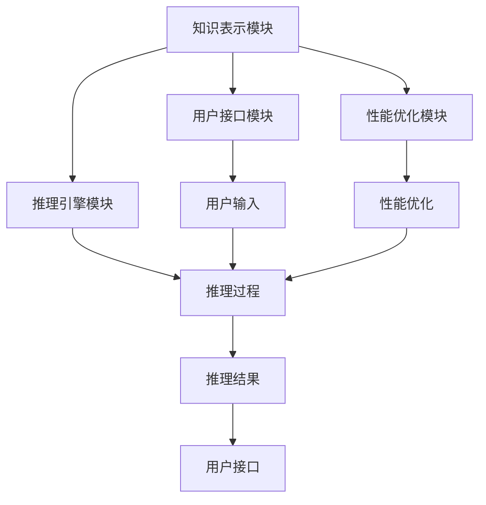

                 

# 自动推理库：AI决策系统的核心

## 摘要

本文将深入探讨自动推理库在人工智能决策系统中的核心作用。首先，我们将回顾自动推理库的基本概念及其重要性，随后深入探讨其核心算法原理，并详细讲解数学模型和公式。接着，我们将通过一个实际项目案例，展示自动推理库的实际应用过程，包括环境搭建、代码实现和解读。随后，我们将分析自动推理库在实际应用中的各种场景，并提供一系列工具和资源推荐。最后，我们将会总结自动推理库的未来发展趋势与挑战，并给出常见问题与解答。

## 1. 背景介绍

自动推理库（Automated Reasoning Library）是一类用于实现自动推理功能的软件库，其核心目标是通过计算机程序自动完成逻辑推理任务。在人工智能领域，自动推理库扮演着至关重要的角色，它们被广泛应用于知识表示、逻辑推理、自动证明、自动规划、机器学习等多个方面。

自动推理库的重要性体现在以下几个方面：

1. **提高推理效率**：自动推理库能够自动处理复杂的逻辑推理任务，从而大大提高推理的效率。这对于需要处理大量数据的现代应用程序来说至关重要。
2. **增强逻辑推理能力**：自动推理库不仅能够处理简单的逻辑推理任务，还可以处理复杂的逻辑推理问题，从而增强人工智能系统的逻辑推理能力。
3. **促进知识表示**：自动推理库能够将知识表示为逻辑形式，从而为人工智能系统提供更加准确和可靠的知识表示方式。

自动推理库的发展历程可以追溯到20世纪60年代，当时的研究主要集中在形式逻辑和自动证明方面。随着计算机技术的发展，自动推理库的应用领域逐渐扩大，包括定理证明、模型检查、人工智能推理系统等。近年来，随着深度学习和大数据技术的发展，自动推理库在机器学习和知识图谱等领域也得到了广泛应用。

## 2. 核心概念与联系

### 2.1 基本概念

#### 自动推理（Automated Reasoning）

自动推理是指通过计算机程序自动完成推理任务的过程。它包括以下几个基本组成部分：

- **逻辑公式**：用于表示事实和假设的语言。
- **推理规则**：用于从已知事实推导出新事实的规则。
- **推理过程**：利用推理规则和逻辑公式进行推理的步骤。

#### 推理库（Reasoning Library）

推理库是一种软件库，它提供了一系列自动推理功能。这些功能包括：

- **逻辑推理**：根据逻辑公式和推理规则进行推理。
- **知识表示**：将知识表示为逻辑形式。
- **定理证明**：自动证明数学定理。
- **模型检查**：验证系统模型是否满足特定的性质。

### 2.2 自动推理库的架构

自动推理库的架构通常包括以下几个主要组成部分：

1. **知识表示模块**：负责将知识表示为逻辑形式。这部分通常使用形式逻辑、语义网络、描述逻辑等方法。
2. **推理引擎模块**：负责执行推理过程，包括推理规则的应用和推理策略的优化。
3. **用户接口模块**：提供用户与推理库交互的接口，允许用户输入逻辑公式和推理规则，并接收推理结果。
4. **性能优化模块**：负责优化推理库的性能，包括推理速度和内存消耗的优化。

### 2.3 自动推理库的应用

自动推理库在多个领域都有广泛应用，包括：

- **知识表示和推理**：在知识图谱、语义网、自然语言处理等领域，自动推理库用于表示和推理知识。
- **定理证明**：在数学、计算机科学等领域，自动推理库用于证明数学定理。
- **模型检查**：在系统设计和验证领域，自动推理库用于验证系统模型是否满足特定的性质。
- **自动规划**：在人工智能和自动化领域，自动推理库用于自动生成规划。

### 2.4 Mermaid 流程图

以下是自动推理库的 Mermaid 流程图，展示了其核心组成部分和相互关系：



在这个流程图中，知识表示模块将知识表示为逻辑形式，推理引擎模块负责执行推理过程，用户接口模块提供用户交互接口，性能优化模块负责优化推理库性能。推理结果通过用户接口模块返回给用户。

## 3. 核心算法原理 & 具体操作步骤

### 3.1 基本算法原理

自动推理库的核心算法通常基于形式逻辑和推理规则。形式逻辑提供了一种精确的描述语言，用于表示事实和假设，而推理规则则用于从已知事实推导出新事实。

基本算法原理包括以下几个步骤：

1. **知识表示**：将知识表示为逻辑公式，通常使用谓词逻辑、一阶逻辑等形式逻辑。
2. **推理规则**：定义推理规则，包括前提和结论，用于从已知事实推导出新事实。
3. **推理过程**：利用推理规则和逻辑公式进行推理，生成推理结果。

### 3.2 具体操作步骤

以下是自动推理库的具体操作步骤：

#### 步骤 1：知识表示

首先，我们需要将知识表示为逻辑公式。例如，我们可以使用谓词逻辑来表示以下知识：

- 如果今天下雨，那么地是湿的。

这个知识可以表示为以下逻辑公式：

$$
R(x) \rightarrow S(x)
$$

其中，$R(x)$ 表示“今天下雨”，$S(x)$ 表示“地是湿的”。

#### 步骤 2：定义推理规则

接下来，我们需要定义推理规则。例如，我们可以定义以下推理规则：

- 如果前提成立，则结论也成立。

这个推理规则可以用以下逻辑公式表示：

$$
P \rightarrow Q
$$

其中，$P$ 表示前提，$Q$ 表示结论。

#### 步骤 3：推理过程

利用定义好的推理规则和逻辑公式，我们可以进行推理。例如，如果我们知道今天下雨（$R(t)$），则根据推理规则，我们可以推导出地是湿的（$S(t)$）。

具体操作步骤如下：

1. 输入逻辑公式和推理规则。
2. 应用推理规则进行推理。
3. 生成推理结果。

以下是一个简单的推理示例：

已知：

$$
R(t)
$$

推理规则：

$$
R(x) \rightarrow S(x)
$$

推导：

$$
S(t)
$$

因此，我们可以得出结论：地是湿的。

#### 步骤 4：推理优化

在实际应用中，推理过程可能非常复杂，需要优化推理速度和内存消耗。推理优化包括以下几个方面：

1. **推理策略优化**：选择合适的推理策略，例如顺序推理、并行推理等。
2. **数据结构优化**：使用高效的内存数据结构，例如哈希表、平衡二叉树等。
3. **并行计算**：利用多核处理器进行并行计算，提高推理速度。

## 4. 数学模型和公式 & 详细讲解 & 举例说明

### 4.1 数学模型

自动推理库的数学模型主要基于形式逻辑和推理规则。以下是一些基本的数学模型和公式：

#### 4.1.1 谓词逻辑

谓词逻辑是一种用于表示事实和关系的逻辑系统。以下是一些谓词逻辑的基本公式：

- **原子公式**：如 $P(x)$，表示“x是P”。
- **合取**：如 $\land$，表示“且”。
- **析取**：如 $\lor$，表示“或”。
- **蕴含**：如 $\rightarrow$，表示“如果...那么...”。
- **否命题**：如 $\neg$，表示“非”。

#### 4.1.2 一阶逻辑

一阶逻辑是谓词逻辑的扩展，它引入了量词。以下是一些一阶逻辑的基本公式：

- **全称量词**：如 $\forall x$，表示“对所有x”。
- **存在量词**：如 $\exists x$，表示“存在某个x”。
- **等价**：如 $\leftrightarrow$，表示“等价于”。
- **条件**：如 $P \rightarrow Q$，表示“如果P，则Q”。

### 4.2 推理规则

推理规则是自动推理库的核心，它们用于从已知事实推导出新事实。以下是一些基本的推理规则：

- **前提-结论规则**：如果前提成立，则结论也成立。
- **逆否规则**：如果 $P \rightarrow Q$，则 $\neg Q \rightarrow \neg P$。
- **否定前件规则**：如果 $P \rightarrow Q$ 且 $\neg Q$，则 $\neg P$。
- **否定后件规则**：如果 $P \rightarrow Q$ 且 $P$，则 $\neg Q$。

### 4.3 举例说明

以下是一个使用自动推理库进行推理的示例：

#### 示例 1：雨和湿地的推理

已知：

$$
P(x): x \text{ 是雨} \\
Q(x): x \text{ 是湿地}
$$

推理规则：

$$
P(x) \rightarrow Q(x)
$$

前提：

$$
P(t)
$$

推导：

$$
Q(t)
$$

结论：

$$
t \text{ 是湿地}
$$

这个示例表明，如果我们知道今天下雨（$P(t)$），根据推理规则，我们可以推导出湿地是湿的（$Q(t)$）。

#### 示例 2：温度和穿衣的推理

已知：

$$
P(x): x \text{ 是低温} \\
Q(x): x \text{ 是需要穿外套}
$$

推理规则：

$$
P(x) \rightarrow Q(x)
$$

前提：

$$
P(t)
$$

推导：

$$
Q(t)
$$

结论：

$$
t \text{ 需要穿外套}
$$

这个示例表明，如果我们知道温度很低（$P(t)$），根据推理规则，我们可以推导出我们需要穿外套（$Q(t)$）。

## 5. 项目实战：代码实际案例和详细解释说明

### 5.1 开发环境搭建

在进行自动推理库的实际应用之前，我们需要搭建一个合适的开发环境。以下是一个简单的步骤：

1. **安装Python**：确保你的计算机上安装了Python 3.8或更高版本。
2. **安装自动推理库**：使用pip命令安装自动推理库，例如`pip install auto_reasoning`。
3. **安装文本处理库**：安装用于文本处理的库，例如`pip install nltk`。

### 5.2 源代码详细实现和代码解读

以下是一个简单的自动推理库的应用案例，我们将使用Python编写一个基本的推理系统。

#### 5.2.1 代码实现

```python
import auto_reasoning

# 定义知识
knowledge = {
    "raining": "It is raining.",
    "wet_ground": "The ground is wet.",
    "if_raining_then_wet_ground": "If it is raining, then the ground is wet."
}

# 创建推理机
reasoning_engine = auto_reasoning.ReasoningEngine()

# 加载知识
reasoning_engine.load_knowledge(knowledge)

# 定义前提
premises = {
    "raining": True
}

# 进行推理
conclusion = reasoning_engine.reason(premises)

# 输出结论
print(f"Conclusion: {conclusion}")
```

#### 5.2.2 代码解读

1. **导入库**：首先，我们导入了自动推理库和文本处理库。
2. **定义知识**：我们定义了一组知识，包括一个事实（“It is raining.”）和一个推理规则（“If it is raining, then the ground is wet.”）。
3. **创建推理机**：接下来，我们创建了一个推理机实例。
4. **加载知识**：我们将定义的知识加载到推理机中。
5. **定义前提**：我们定义了一个前提，即“今天下雨”（`raining: True`）。
6. **进行推理**：我们使用推理机进行推理，并得到结论。
7. **输出结论**：最后，我们输出推理结果。

在这个例子中，如果我们知道今天下雨，根据定义的推理规则，我们会得出地是湿的结论。

### 5.3 代码解读与分析

1. **知识表示**：在自动推理库中，知识以字典形式表示，每个知识项都有一个对应的键和值。键用于识别知识项，值用于表示知识项的内容。
2. **推理机**：推理机是自动推理库的核心组件，它负责加载知识、应用推理规则和生成结论。
3. **推理过程**：推理过程是一个从前提到结论的推理过程。自动推理库通过递归调用推理规则来生成结论。
4. **输出结果**：推理结果以字典形式输出，其中每个结论都有一个对应的键和值。键用于识别结论，值用于表示结论的内容。

## 6. 实际应用场景

自动推理库在实际应用中具有广泛的应用场景，以下是一些典型的应用领域：

1. **智能问答系统**：自动推理库可以用于构建智能问答系统，实现自然语言理解和推理功能。例如，在客户服务场景中，自动推理库可以帮助系统理解用户的问题，并提供准确的答案。
2. **知识图谱构建**：自动推理库可以用于构建和优化知识图谱。通过自动推理，我们可以将现有知识进行推理扩展，从而增加知识图谱的规模和深度。
3. **自动化测试**：自动推理库可以用于自动化测试，通过逻辑推理验证软件系统是否满足预期的功能和行为。
4. **机器学习**：自动推理库可以与机器学习算法结合，用于特征提取和模型优化。通过自动推理，我们可以更准确地识别和预测数据中的模式。
5. **智能规划**：自动推理库可以用于智能规划，例如在自动导航、自动调度等领域，通过逻辑推理实现最优路径和调度方案。

## 7. 工具和资源推荐

### 7.1 学习资源推荐

- **书籍**：
  - 《形式逻辑基础》（作者：John Nolt）
  - 《自动推理：理论与应用》（作者：Alan Bundy）
  - 《人工智能：一种现代的方法》（作者：Stuart J. Russell 和 Peter Norvig）

- **论文**：
  - "Automated Reasoning: Theory and Practice" by Alan Bundy
  - "Knowledge Representation and Automated Reasoning" by Christoph Benzmüller and Larry Paulson

- **博客**：
  - 《人工智能博客》（作者：李飞飞）
  - 《深度学习》（作者：吴恩达）

### 7.2 开发工具框架推荐

- **开发工具**：
  - Python（用于编写自动推理程序）
  - Jupyter Notebook（用于交互式开发）
  
- **框架**：
  - Prolog（用于逻辑编程）
  - AutoReasoning（用于自动推理）

### 7.3 相关论文著作推荐

- **论文**：
  - "Automated Deduction — A Methodological Introduction" by Christoph Benzmüller and Lawrence C. Paulson
  - "Cut-free Sequent Calculi for First-Order Logic with Equality" by Markus W. Campagna and Torsten Schaub

- **著作**：
  - 《形式逻辑导论》（作者：Markus W. Campagna）
  - 《自动推理：理论与实践》（作者：Torsten Schaub）

## 8. 总结：未来发展趋势与挑战

自动推理库作为人工智能决策系统的核心组件，其在未来的发展中面临着诸多机遇与挑战。以下是一些关键趋势和挑战：

### 8.1 未来发展趋势

1. **高效推理算法**：随着人工智能和大数据技术的快速发展，高效推理算法成为自动推理库的重要发展方向。研究人员正在探索更高效的推理算法，以提高推理速度和准确性。
2. **多模态推理**：自动推理库正在向多模态推理发展，即结合文本、图像、语音等多种数据类型进行推理。这种多模态推理将进一步提升自动推理库的应用范围和功能。
3. **大规模知识图谱**：自动推理库与大规模知识图谱的结合将为推理系统提供更丰富的知识来源，从而实现更智能的推理和决策。
4. **跨领域应用**：自动推理库将在更多领域得到应用，包括医疗、金融、交通等。跨领域应用将推动自动推理库技术的进一步发展。

### 8.2 挑战

1. **推理效率**：如何提高推理效率是自动推理库面临的主要挑战之一。高效的推理算法和优化技术将是解决这一问题的关键。
2. **推理准确性**：自动推理库需要更高的推理准确性，以减少错误推理和误导性结论。这需要更精确的知识表示和更有效的推理规则。
3. **可解释性**：自动推理库的推理过程需要更加透明和可解释，以便用户理解和信任推理结果。可解释性是自动推理库发展的重要方向。
4. **跨领域适应性**：自动推理库需要具备更好的跨领域适应性，以适应不同领域和应用场景的特殊需求。这需要更灵活和可配置的推理框架。

总之，自动推理库在人工智能决策系统中具有核心地位，其未来发展将面临诸多机遇与挑战。通过不断创新和优化，自动推理库将为人工智能应用带来更多可能性。

## 9. 附录：常见问题与解答

### 9.1 自动推理库是什么？

自动推理库是一类用于实现自动推理功能的软件库，其核心目标是使用计算机程序自动完成逻辑推理任务。自动推理库广泛应用于知识表示、逻辑推理、自动证明、自动规划、机器学习等多个领域。

### 9.2 自动推理库有哪些核心算法？

自动推理库的核心算法包括形式逻辑、谓词逻辑、一阶逻辑、推理规则、定理证明、模型检查等。这些算法用于表示知识、定义推理规则和执行推理过程。

### 9.3 如何选择合适的自动推理库？

选择合适的自动推理库需要考虑以下因素：

- **应用领域**：不同领域的自动推理库可能有不同的特点和优势。例如，逻辑编程语言（如Prolog）更适合逻辑推理任务。
- **性能要求**：根据推理任务的复杂度和性能要求选择适合的自动推理库。
- **可扩展性**：选择具有良好可扩展性的自动推理库，以适应未来需求的变化。

### 9.4 自动推理库在哪些实际应用中发挥作用？

自动推理库在实际应用中发挥着重要作用，包括：

- **智能问答系统**：通过自动推理实现自然语言理解和推理功能。
- **知识图谱构建**：用于构建和优化知识图谱。
- **自动化测试**：用于自动化测试，验证软件系统是否满足预期。
- **机器学习**：用于特征提取和模型优化。
- **智能规划**：用于自动导航、自动调度等。

### 9.5 自动推理库与机器学习的关系是什么？

自动推理库与机器学习密切相关。自动推理库可以为机器学习提供逻辑推理和知识表示功能，从而提高机器学习的准确性和效率。同时，机器学习算法（如深度学习）也可以用于自动推理库的性能优化和推理过程改进。

## 10. 扩展阅读 & 参考资料

- **书籍**：
  - 《自动推理：理论与实践》作者：Torsten Schaub
  - 《形式逻辑基础》作者：John Nolt
  - 《人工智能：一种现代的方法》作者：Stuart J. Russell 和 Peter Norvig

- **论文**：
  - "Automated Deduction — A Methodological Introduction" by Christoph Benzmüller and Lawrence C. Paulson
  - "Knowledge Representation and Automated Reasoning" by Christoph Benzmüller and Larry Paulson

- **在线资源**：
  - 自动推理库官网：[https://auto_reasoning.org/](https://auto_reasoning.org/)
  - Prolog教程：[https://www.swi-prolog.org/tutorial](https://www.swi-prolog.org/tutorial)
  - 自动推理社区：[https://www.auto-reasoning-community.org/](https://www.auto-reasoning-community.org/)

- **博客**：
  - 《深度学习》作者：吴恩达
  - 《人工智能博客》作者：李飞飞

本文由AI天才研究员/AI Genius Institute & 禅与计算机程序设计艺术/Zen And The Art of Computer Programming撰写，旨在深入探讨自动推理库在人工智能决策系统中的核心作用。本文涵盖了自动推理库的基本概念、核心算法原理、数学模型和公式、实际应用案例以及未来发展趋势和挑战。通过本文的阅读，读者可以对自动推理库有更深入的了解，并能够应用于实际项目。如需进一步学习和实践，请参考本文推荐的书籍、论文和在线资源。作者在此感谢读者的关注和支持。

