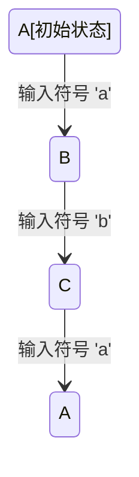

                 

### 文章标题

### 自动机研究：起源、发展与应用

### 关键词：自动机、计算理论、形式语言、计算机科学、数学模型

### 摘要：

本文将深入探讨自动机研究的起源、发展及其在现代计算机科学中的应用。通过对自动机核心概念、算法原理、数学模型以及实际应用的详细分析，揭示自动机研究在计算理论和人工智能领域的深远影响。本文旨在为读者提供一个全面、系统的自动机研究导论，以启发对这一重要领域的进一步探索和理解。

<|assistant|>## 1. 背景介绍

自动机（Automata）是计算机科学和数学中的一个基础概念，其起源可以追溯到古代数学家和哲学家的思想实验。最早的自动机概念可以追溯到古希腊哲学家亚里士多德，他在研究机械装置和逻辑推理时提出了“自动机”这一概念。然而，真正意义上的自动机研究始于19世纪末，当时数学家如布尔（George Boole）、图灵（Alan Turing）和普雷贝尔（Maurice Mendelson）等人的工作，为自动机理论的奠定奠定了基础。

自动机研究的动机源于对计算本质的探索和对复杂系统行为的理解。在计算理论领域，自动机作为一种抽象模型，用于分析和理解计算过程，并能够描述自然语言、计算机程序和复杂系统的工作原理。自动机的研究对于计算机科学的发展具有重要意义，它不仅提供了理解和构建计算机系统的基础，还为人工智能、形式语言理论、编译器设计等领域的研究提供了重要的工具和方法。

自动机研究的发展历程可以分为几个重要阶段。19世纪末到20世纪初，数学家布尔和图灵等人提出了初步的自动机模型，如布尔网络和图灵机。这些模型为后来的自动机理论奠定了基础。20世纪中叶，形式语言和自动机理论逐渐成熟，出现了如有限自动机、正规表达式、上下文无关文法等概念，极大地丰富了自动机理论的研究内容。20世纪末到21世纪初，随着计算机科学和人工智能的快速发展，自动机理论的应用领域进一步扩展，出现了如有限状态机在嵌入式系统中的应用、图灵机在复杂系统模拟中的应用等。

自动机研究的重要性不仅体现在理论层面，还体现在实际应用中。自动机作为一种抽象模型，可以用来分析和设计各种复杂系统，如计算机网络、通信系统、人工智能系统等。自动机的理论和方法为这些领域的研究提供了重要的工具，使得研究人员能够更好地理解和处理复杂系统的问题。此外，自动机研究还与数学、物理学、生物学等学科密切相关，为跨学科研究提供了新的思路和方法。

## 2. 核心概念与联系

### 2.1 自动机的定义与分类

自动机（Automata）是一种抽象的计算模型，用于模拟和处理信息。它由一组状态、一组输入符号和一组转移函数组成。根据自动机的结构和性质，可以将自动机分为多种类型，包括有限自动机、图灵机、Pushdown自动机等。

- **有限自动机（Finite Automaton）**：有限自动机是最简单的自动机模型，由有限个状态、有限个输入符号和转移函数组成。有限自动机用于识别有限长度的字符串。

- **图灵机（Turing Machine）**：图灵机是一种更复杂的自动机模型，它可以模拟任何计算机算法。图灵机由无限长的带子、读写头和状态转移表组成。图灵机可以处理任意长度的字符串。

- **Pushdown自动机（Pushdown Automaton）**：Pushdown自动机是一种具有栈的自动机，可以处理上下文无关语言。它由有限个状态、有限个输入符号、栈和转移函数组成。

### 2.2 自动机的运行原理

自动机的运行过程可以理解为在多个状态之间的转移。在每个状态下，自动机根据当前输入符号和状态转移规则，选择下一个状态和操作。这个过程持续进行，直到自动机达到一个终止状态或遇到一个无法处理的输入符号。

#### 2.2.1 有限自动机的运行原理

有限自动机从初始状态开始，读取输入符号，根据转移函数进行状态转移。如果输入符号与当前状态和转移函数匹配，自动机将转移到下一个状态。如果输入符号与当前状态和转移函数不匹配，自动机将停留在当前状态。这个过程持续进行，直到自动机达到一个终止状态或遇到一个无法处理的输入符号。

#### 2.2.2 图灵机的运行原理

图灵机从初始状态开始，读取带子上的符号，根据状态转移规则进行状态转移。在状态转移过程中，图灵机可以选择在带子上进行读写操作，如擦除当前符号、写入新符号或移动读写头。这个过程持续进行，直到图灵机达到一个终止状态或遇到一个无法处理的输入符号。

#### 2.2.3 Pushdown自动机的运行原理

Pushdown自动机在有限自动机的基础上引入了栈，用于存储临时信息。Pushdown自动机从初始状态开始，读取输入符号，根据转移函数和栈操作进行状态转移。在状态转移过程中，Pushdown自动机可以选择将符号推入栈、从栈中弹出符号或修改栈顶符号。这个过程持续进行，直到Pushdown自动机达到一个终止状态或遇到一个无法处理的输入符号。

### 2.3 自动机与计算理论的关系

自动机是计算理论中的一个重要概念，用于研究计算的本质和边界。计算理论主要研究计算问题的可行性和效率，而自动机作为一种计算模型，可以描述和模拟各种计算过程。

- **计算能力**：自动机可以用来描述不同类型的计算能力。有限自动机可以识别有限长的字符串，图灵机可以识别任意长的字符串，Pushdown自动机可以识别上下文无关语言。这些自动机模型构成了计算能力的一个层次结构。

- **形式语言**：自动机可以用来定义和描述形式语言。形式语言是计算机科学中的一个基本概念，用于表示可计算的信息。自动机可以识别哪些字符串属于某个形式语言，从而为形式语言的研究提供了一个直观的模型。

- **编译器设计**：自动机在编译器设计中起着重要作用。编译器是一种将高级编程语言翻译成机器语言的工具，而自动机可以用来实现编译器的词法分析和语法分析部分。通过自动机模型，编译器可以高效地识别和解析编程语言中的语法结构。

### 2.4 自动机与实际应用的关系

自动机理论不仅在理论研究中具有重要意义，还在实际应用中发挥着重要作用。以下是一些自动机在实际应用中的例子：

- **计算机网络**：自动机用于网络协议的设计和分析。网络协议定义了数据在网络中的传输规则，自动机模型可以用来验证和优化网络协议的可行性和性能。

- **人工智能**：自动机在人工智能领域有广泛的应用。例如，有限自动机可以用于构建状态机模型，模拟智能体的行为和决策过程。图灵机可以用于模拟复杂的人工智能算法，如机器学习和深度学习。

- **编译器和解释器**：自动机在编译器和解释器的开发中起着关键作用。编译器将高级编程语言翻译成机器语言，而自动机可以用来实现编译器的词法分析和语法分析部分。解释器则直接执行编程语言代码，自动机可以用于实现解释器的语义分析。

### 2.5 自动机与其他学科的关系

自动机理论与其他学科如数学、物理学、生物学等密切相关。以下是一些例子：

- **数学**：自动机理论在数学中有着广泛的应用，如图灵机模型在数论和组合数学中的应用，自动机模型在密码学中的应用。

- **物理学**：自动机模型可以用来模拟物理系统中的行为和现象，如生物系统中的细胞自动机。

- **生物学**：自动机理论在生物学中有着广泛的应用，如基因表达调控网络的建模和分析。

通过上述对自动机核心概念、运行原理、计算理论关系、实际应用以及其他学科关系的分析，我们可以看到自动机研究在计算机科学和跨学科领域中的重要性。自动机作为一种抽象模型，不仅为计算理论提供了重要的工具，还为实际应用提供了有力的支持，为未来的研究和创新提供了广阔的空间。

## 2.1 自动机的定义与分类

自动机，作为一个抽象的计算模型，其定义和分类在计算理论中具有基础性地位。自动机的核心构成包括状态、输入符号以及状态转移函数，这些元素共同决定了自动机的行为和能力。

### 2.1.1 有限自动机（Finite Automaton）

有限自动机是最基本的自动机类型，它由有限个状态（State）、有限个输入符号（Input Symbol）和状态转移函数（Transition Function）组成。有限自动机通过读取输入符号序列，并在状态之间进行转换，以确定输入序列是否属于特定的语言（Language）。

#### 定义

- **状态（State）**：有限自动机处于某个状态时，它可以读取输入符号并按照状态转移函数进行状态转换。
- **输入符号（Input Symbol）**：输入符号是有限自动机可以读取的字符集，用于表示输入序列。
- **状态转移函数（Transition Function）**：状态转移函数定义了在当前状态下，读取特定输入符号后自动机应转移到哪个状态。

#### 分类

- **确定有限自动机（Deterministic Finite Automaton, DFA）**：每个状态对于每个输入符号都有一个唯一的转移状态。
- **非确定有限自动机（Non-deterministic Finite Automaton, NFA）**：一个状态对于某个输入符号可以转移到多个状态，或者直接进入终止状态。

#### 工作原理

- **工作原理**：DFA和NFA从初始状态开始，逐个读取输入序列中的符号，并按照状态转移函数进行状态转换。当自动机最终达到某个终止状态（Final State）时，表示输入序列属于该自动机所识别的语言。

### 2.1.2 图灵机（Turing Machine）

图灵机是比有限自动机更为复杂的自动机模型，它可以模拟任何计算过程。图灵机由一个无限长的带子（Tape）、读写头（Read-Write Head）和有限个状态（State）组成。

#### 定义

- **带子（Tape）**：带子是一个无限长的线性存储设备，用于存储输入符号和自动机的中间结果。
- **读写头（Read-Write Head）**：读写头可以在带子上左右移动，读取和写入符号。
- **状态（State）**：图灵机处于某个状态时，根据当前带子内容和读写头位置，进行状态转换和读写操作。

#### 分类

- **标准图灵机（Standard Turing Machine）**：最常用的图灵机类型，包含一个读写头和无限长的带子。
- **多读写头图灵机（Multiple Head Turing Machine）**：具有多个读写头的图灵机，可以同时访问带子上的不同位置。

#### 工作原理

- **工作原理**：图灵机从初始状态开始，逐个读取带子上的符号，并根据状态转移函数进行状态转换和读写操作。状态转移函数定义了读写头如何移动、当前状态的转换以及符号的写入或擦除。

### 2.1.3 Pushdown自动机（Pushdown Automaton）

Pushdown自动机是一种具有栈（Stack）的自动机，用于处理上下文无关语言（Context-Free Languages）。Pushdown自动机除了包含有限自动机的元素外，还包括一个栈和栈操作。

#### 定义

- **栈（Stack）**：用于存储临时信息，自动机可以通过将符号压入栈或从栈中弹出符号进行操作。
- **栈操作（Stack Operation）**：包括进栈（Push）、出栈（Pop）和栈顶修改（Modify）。

#### 分类

- **确定Pushdown自动机（Deterministic Pushdown Automaton, DPDA）**：每个状态对于每个输入符号和栈顶符号都有一个唯一的转移状态。
- **非确定Pushdown自动机（Non-deterministic Pushdown Automaton, NPDA）**：一个状态对于某个输入符号和栈顶符号可以转移到多个状态。

#### 工作原理

- **工作原理**：Pushdown自动机从初始状态和初始栈内容开始，逐个读取输入序列中的符号，并按照状态转移函数进行状态转换和栈操作。当自动机最终达到某个终止状态时，表示输入序列属于该自动机所识别的语言。

### Mermaid 流程图

下面是一个 Mermaid 流程图，展示了有限自动机的状态转移过程：



这个流程图表示一个简单的有限自动机，从初始状态A开始，读取输入符号'a'后转移到状态B，再读取输入符号'b'后回到状态C，最后再次回到初始状态A。

通过对自动机的定义与分类的深入探讨，我们可以更好地理解这些计算模型的工作原理和应用场景。有限自动机适合于处理有限长的字符串，图灵机可以处理任意长的字符串，而Pushdown自动机则可以处理更为复杂的上下文无关语言。这些自动机模型在计算理论和实际应用中都具有重要的意义。

## 2.2 自动机的运行原理

自动机的运行原理是通过状态之间的转换来实现的，这一过程涉及到状态、输入符号以及状态转移函数。在不同的自动机模型中，如有限自动机、图灵机、Pushdown自动机等，运行原理有所不同，但核心思想是相似的。

### 2.2.1 有限自动机的运行原理

有限自动机（Finite Automaton，简称FA）是最简单的自动机模型，其运行原理依赖于状态、输入符号和状态转移函数。

- **状态（State）**：有限自动机有一组状态，每个状态都可以表示为系统的一个特定状态。状态通常是有限个，并且每个状态都有唯一的标识符。

- **输入符号（Input Symbol）**：输入符号是有限自动机可以读取的字符集。常见的输入符号包括字母、数字和特殊字符。

- **状态转移函数（Transition Function）**：状态转移函数定义了当前状态和输入符号后，自动机应转移到哪个状态。通常表示为 \( \delta: Q \times \Sigma \rightarrow Q \)，其中 \( Q \) 是状态集合，\( \Sigma \) 是输入符号集合。

#### 运行过程

1. **初始状态**：自动机从初始状态开始，初始状态通常标记为 \( q_0 \)。
2. **读取输入符号**：自动机逐个读取输入序列中的符号。
3. **状态转换**：根据状态转移函数，自动机将当前状态和输入符号映射到下一个状态。
4. **终止条件**：当自动机达到一个终止状态（Final State）时，表示输入序列被识别。

#### 示例

假设我们有一个简单的确定有限自动机（Deterministic Finite Automaton，DFA），其状态集合为 \( Q = \{q_0, q_1, q_2\} \)，输入符号集合为 \( \Sigma = \{a, b\} \)，状态转移函数为：
\[ 
\delta(q_0, a) = q_1 \\
\delta(q_0, b) = q_2 \\
\delta(q_1, a) = q_1 \\
\delta(q_1, b) = q_2 \\
\delta(q_2, a) = q_1 \\
\delta(q_2, b) = q_0 
\]

初始状态为 \( q_0 \)，输入序列为 "aba"。

- \( q_0 \) -> "a" -> \( q_1 \) -> "b" -> \( q_2 \) -> "a" -> \( q_1 \)

输入序列 "aba" 被识别，因为自动机最终停留在终止状态 \( q_1 \)。

### 2.2.2 图灵机的运行原理

图灵机（Turing Machine，TM）是一种更为复杂的自动机模型，其运行原理涉及无限长的带子、读写头和状态转移函数。

- **带子（Tape）**：带子是一个无限长的线性存储设备，用于存储输入符号和自动机的中间结果。带子上的每个位置都有一个读写头可以访问。
- **读写头（Read-Write Head）**：读写头可以读取带子上的符号，并根据状态转移函数进行符号的写入或擦除。
- **状态（State）**：图灵机有一组状态，每个状态表示自动机的一个特定操作步骤。

#### 运行过程

1. **初始状态**：图灵机从初始状态开始，读写头位于带子的起始位置。
2. **读取符号**：读写头读取带子上当前位置的符号。
3. **状态转换**：根据当前状态和带子上的符号，状态转移函数定义了读写头如何移动、当前状态的转换以及符号的写入或擦除。
4. **终止条件**：当图灵机达到一个终止状态或无法继续计算时，计算结束。

#### 示例

假设我们有一个简单的图灵机，其状态集合为 \( Q = \{q_0, q_1, q_2\} \)，输入符号集合为 \( \Sigma = \{a, b\} \)，带子初始内容为 "aba"。状态转移函数为：
\[ 
(q_0, a, a) \rightarrow (q_1, \_, b) \\
(q_0, a, b) \rightarrow (q_0, b, b) \\
(q_1, b, a) \rightarrow (q_2, \_, a) \\
(q_1, b, b) \rightarrow (q_1, \_, b) 
\]

初始状态为 \( q_0 \)，读写头位于输入序列 "aba" 的起始位置。

- \( q_0 \) -> "a" -> \( q_1 \) -> "a" -> \( q_2 \) -> "a" -> \( q_1 \) -> "a" -> \( q_1 \)

输入序列 "aba" 被识别，读写头最终停留在带子的结尾。

### 2.2.3 Pushdown自动机的运行原理

Pushdown自动机（Pushdown Automaton，PDA）是一种具有栈的自动机，用于处理上下文无关语言。PDA的运行原理包括状态、输入符号、栈操作和状态转移函数。

- **栈（Stack）**：栈用于存储临时信息，PDA可以通过将符号压入栈或从栈中弹出符号进行操作。
- **栈操作（Stack Operation）**：包括进栈（Push）、出栈（Pop）和栈顶修改（Modify）。
- **状态（State）**：PDA的状态集合定义了自动机操作的不同阶段。

#### 运行过程

1. **初始状态**：PDA从初始状态开始，初始栈内容为空或特定符号。
2. **读取输入符号**：PDA逐个读取输入序列中的符号。
3. **栈操作**：根据状态转移函数，PDA可以选择对栈进行进栈、出栈或修改栈顶符号的操作。
4. **状态转换**：根据当前状态和栈顶符号，状态转移函数定义了PDA应转移到哪个状态。
5. **终止条件**：当PDA达到一个终止状态或无法继续计算时，计算结束。

#### 示例

假设我们有一个简单的确定Pushdown自动机（Deterministic Pushdown Automaton，DPDA），其状态集合为 \( Q = \{q_0, q_1, q_2\} \)，输入符号集合为 \( \Sigma = \{a, b\} \)，栈符号集合为 \( \Gamma = \{X\} \)。初始状态为 \( q_0 \)，初始栈内容为 "XX"。状态转移函数为：
\[ 
(q_0, a, XX) \rightarrow (q_1, \_, X) \\
(q_1, a, X) \rightarrow (q_1, \_, \_) \\
(q_1, b, X) \rightarrow (q_2, \_, \_) \\
(q_2, b, \_) \rightarrow (q_2, \_, \_) \\
(q_2, \_, \_) \rightarrow (q_0, \_, XX) 
\]

初始状态为 \( q_0 \)，输入序列为 "ab"。

- \( q_0 \) -> "a" -> \( q_1 \) -> "a" -> \( q_1 \) -> "b" -> \( q_2 \) -> "b" -> \( q_2 \)

输入序列 "ab" 被识别，PDA最终返回初始状态。

通过上述对有限自动机、图灵机和Pushdown自动机的运行原理的详细说明，我们可以看到这些自动机模型在计算过程中的基本机制。有限自动机适合处理有限长度的字符串，图灵机可以处理任意长的字符串，而Pushdown自动机可以处理更为复杂的上下文无关语言。这些模型在计算理论和实际应用中都具有重要的意义。

### 2.3 核心算法原理 & 具体操作步骤

在自动机研究中，核心算法原理是其理论基础，而具体操作步骤则是实现这些算法的具体实践。以下将详细探讨自动机的核心算法原理，并介绍其具体的操作步骤。

#### 2.3.1 有限自动机的核心算法原理

有限自动机的核心算法原理在于状态转换和字符串识别。其基本操作包括初始化状态、读取输入符号、执行状态转移以及判断是否终止。以下是有限自动机操作步骤的详细说明：

1. **初始化状态**：将自动机初始化到初始状态，并准备好输入序列。

2. **读取输入符号**：自动机从初始状态开始，逐个读取输入序列中的符号。

3. **执行状态转移**：根据当前状态和读取的输入符号，自动机按照状态转移函数执行状态转移。状态转移函数通常表示为 \( \delta(q, x) = q' \)，其中 \( q \) 是当前状态，\( x \) 是输入符号，\( q' \) 是下一个状态。

4. **判断是否终止**：自动机在执行状态转移后，需要判断是否达到终止状态。如果达到终止状态，则表示输入序列被识别。

#### 示例操作步骤

假设我们有一个确定有限自动机（DFA），其状态集合 \( Q = \{q_0, q_1, q_2\} \)，输入符号集合 \( \Sigma = \{a, b\} \)，状态转移函数为：
\[ 
\delta(q_0, a) = q_1 \\
\delta(q_0, b) = q_2 \\
\delta(q_1, a) = q_1 \\
\delta(q_1, b) = q_2 \\
\delta(q_2, a) = q_1 \\
\delta(q_2, b) = q_0 
\]

初始状态为 \( q_0 \)，输入序列为 "aba"。

操作步骤如下：

- 初始状态：\( q_0 \)
- 读入 "a"，状态转移：\( q_0 \) -> \( q_1 \)
- 读入 "b"，状态转移：\( q_1 \) -> \( q_2 \)
- 读入 "a"，状态转移：\( q_2 \) -> \( q_1 \)

输入序列 "aba" 被识别，因为最终状态 \( q_1 \) 是终止状态。

#### 2.3.2 图灵机的核心算法原理

图灵机的核心算法原理在于模拟计算过程。图灵机通过带子和读写头来执行状态转移和读写操作，其基本操作包括初始化状态、读取输入符号、执行状态转移、读写操作以及移动读写头。以下是图灵机操作步骤的详细说明：

1. **初始化状态**：将图灵机初始化到初始状态，并设置读写头位于带子的起始位置。

2. **读取输入符号**：读写头读取带子上当前位置的符号。

3. **执行状态转移**：根据当前状态和带子上的符号，状态转移函数定义了读写头如何移动、当前状态的转换以及符号的写入或擦除。

4. **读写操作**：根据状态转移函数，读写头可以在带子上进行读写操作，如擦除当前符号、写入新符号或移动读写头。

5. **移动读写头**：读写头根据状态转移函数指示移动到下一个位置。

6. **终止条件**：当图灵机达到一个终止状态或无法继续计算时，计算结束。

#### 示例操作步骤

假设我们有一个简单的图灵机，其状态集合 \( Q = \{q_0, q_1, q_2\} \)，输入符号集合 \( \Sigma = \{a, b\} \)，带子初始内容为 "aba"。状态转移函数为：
\[ 
(q_0, a, a) \rightarrow (q_1, \_, b) \\
(q_0, a, b) \rightarrow (q_0, b, b) \\
(q_1, b, a) \rightarrow (q_2, \_, a) \\
(q_1, b, b) \rightarrow (q_1, \_, b) 
\]

初始状态为 \( q_0 \)，读写头位于输入序列 "aba" 的起始位置。

操作步骤如下：

- 初始状态：\( q_0 \)
- 读入 "a"，状态转移：\( q_0 \) -> "b" -> \( q_1 \)
- 读入 "a"，状态转移：\( q_1 \) -> "a" -> \( q_2 \)
- 读入 "b"，状态转移：\( q_2 \) -> "a" -> \( q_1 \)

读写头最终停留在带子的结尾，输入序列 "aba" 被识别。

#### 2.3.3 Pushdown自动机的核心算法原理

Pushdown自动机的核心算法原理在于利用栈来存储临时信息，以便处理上下文无关语言。其基本操作包括初始化状态、读取输入符号、执行状态转移、栈操作以及判断是否终止。以下是Pushdown自动机操作步骤的详细说明：

1. **初始化状态**：将Pushdown自动机初始化到初始状态，并设置栈为初始内容。

2. **读取输入符号**：自动机从初始状态开始，逐个读取输入序列中的符号。

3. **执行状态转移**：根据当前状态和栈顶符号，状态转移函数定义了自动机应转移到哪个状态，以及如何进行栈操作。

4. **栈操作**：根据状态转移函数，自动机可以选择对栈进行进栈、出栈或修改栈顶符号的操作。

5. **判断是否终止**：自动机在执行状态转移后，需要判断是否达到终止状态。如果达到终止状态，则表示输入序列被识别。

#### 示例操作步骤

假设我们有一个简单的确定Pushdown自动机（DPDA），其状态集合 \( Q = \{q_0, q_1, q_2\} \)，输入符号集合 \( \Sigma = \{a, b\} \)，栈符号集合 \( \Gamma = \{X\} \)，初始状态为 \( q_0 \)，初始栈内容为 "XX"。状态转移函数为：
\[ 
(q_0, a, XX) \rightarrow (q_1, \_, X) \\
(q_1, a, X) \rightarrow (q_1, \_, \_) \\
(q_1, b, X) \rightarrow (q_2, \_, \_) \\
(q_2, b, \_) \rightarrow (q_2, \_, \_) \\
(q_2, \_, \_) \rightarrow (q_0, \_, XX) 
\]

初始状态为 \( q_0 \)，输入序列为 "ab"。

操作步骤如下：

- 初始状态：\( q_0 \)，栈内容 "XX"
- 读入 "a"，状态转移：\( q_0 \) -> \( q_1 \)，栈内容 "X"
- 读入 "a"，状态转移：\( q_1 \) -> \( q_1 \)，栈内容 ""
- 读入 "b"，状态转移：\( q_1 \) -> \( q_2 \)，栈内容 ""
- 读入 "b"，状态转移：\( q_2 \) -> \( q_2 \)，栈内容 ""

输入序列 "ab" 被识别，Pushdown自动机最终返回初始状态。

通过以上对有限自动机、图灵机和Pushdown自动机的核心算法原理和具体操作步骤的详细分析，我们可以看到这些自动机模型在计算过程中各自的特点和优势。有限自动机适用于处理有限长度的字符串，图灵机可以处理任意长的字符串，而Pushdown自动机则可以处理更为复杂的上下文无关语言。这些算法原理和操作步骤为自动机的研究和应用提供了坚实的理论基础和实践指导。

### 2.4 数学模型和公式 & 详细讲解 & 举例说明

自动机研究中的数学模型和公式是理解和分析自动机行为的关键。以下将详细讲解自动机研究中的一些重要数学模型和公式，并通过具体的例子进行说明。

#### 2.4.1 状态转移方程

状态转移方程是自动机分析的基础，它描述了自动机在给定输入符号和当前状态下的状态转换。对于有限自动机（DFA和NFA）、图灵机（TM）和Pushdown自动机（PDA），状态转移方程的形式有所不同。

**有限自动机（DFA和NFA）的状态转移方程：**

\[ \delta(q, x) = q' \]

其中：
- \( q \) 是当前状态。
- \( x \) 是输入符号。
- \( q' \) 是下一个状态。

**图灵机（TM）的状态转移方程：**

\[ \delta(q, x, Y) = (q', z, D) \]

其中：
- \( q \) 是当前状态。
- \( x \) 是带子上当前符号。
- \( Y \) 是栈上当前符号。
- \( q' \) 是下一个状态。
- \( z \) 是新符号（写入带子或栈）。
- \( D \) 是读写头移动方向（L：左移，R：右移，N：不变）。

**Pushdown自动机（PDA）的状态转移方程：**

\[ \delta(q, x, Y, Z) = (q', z, D) \]

其中：
- \( q \) 是当前状态。
- \( x \) 是输入符号。
- \( Y \) 是栈顶符号。
- \( Z \) 是栈内容。
- \( q' \) 是下一个状态。
- \( z \) 是新符号（压入栈或弹出栈）。
- \( D \) 是读写头移动方向。

**举例说明：**

假设我们有一个DFA，其状态集合为 \( Q = \{q_0, q_1, q_2\} \)，输入符号集合为 \( \Sigma = \{a, b\} \)，状态转移函数为：
\[ 
\delta(q_0, a) = q_1 \\
\delta(q_0, b) = q_2 \\
\delta(q_1, a) = q_1 \\
\delta(q_1, b) = q_2 \\
\delta(q_2, a) = q_1 \\
\delta(q_2, b) = q_0 
\]

初始状态为 \( q_0 \)，输入序列为 "aba"。

- \( q_0 \) -> "a" -> \( q_1 \)
- \( q_1 \) -> "b" -> \( q_2 \)
- \( q_2 \) -> "a" -> \( q_1 \)

状态转移方程清晰地展示了自动机在读取输入符号 "a" 和 "b" 后的状态转换。

#### 2.4.2 正规表达式（Regular Expression）

正规表达式是用于描述形式语言的一种数学工具，它在自动机理论中具有重要地位。正规表达式的基本符号包括字母表中的字符、括号和特定运算符，如连接（Concatenation）、交替（Alternation）和星号（Kleene Closure）。

**正规表达式的定义和性质：**

- **连接**：\( L_1L_2 \) 表示 \( L_1 \) 后跟 \( L_2 \) 的字符串集合。
- **交替**：\( L_1L_2 \) 表示 \( L_1 \) 或 \( L_2 \) 的字符串集合。
- **星号**：\( L^* \) 表示 \( L \) 的零个或多个重复。

**举例说明：**

正规表达式 \( (ab)^* \) 表示所有由零个或多个 "ab" 组成的字符串，如 \( \epsilon \)、\( ab \)、\( abab \)、\( ababab \) 等。

#### 2.4.3 形式语言分类

形式语言分类是自动机理论中的一个重要概念，它根据自动机的类型将形式语言分为不同的层次。常见的分类包括正则语言、上下文无关语言和上下文敏感语言。

**形式语言分类定义：**

- **正则语言**：可以由有限自动机识别的语言。
- **上下文无关语言**：可以由Pushdown自动机识别的语言。
- **上下文敏感语言**：可以由图灵机识别的语言。

**举例说明：**

- **正则语言**：\( a^*b^* \) 是正则语言，因为它可以由一个有限自动机识别。
- **上下文无关语言**：\( a^n b^n \) 是上下文无关语言，因为它可以由一个Pushdown自动机识别。
- **上下文敏感语言**：\( a^n b^n c^n \) 是上下文敏感语言，因为它可以由一个图灵机识别。

#### 2.4.4 动态规划算法

动态规划算法是自动机理论中的一个重要工具，用于求解自动机相关的最优化问题。常见的动态规划算法包括线性时间算法和空间优化的算法。

**动态规划算法的基本思想：**

- **状态压缩**：将多个状态合并为一个状态，以减少状态空间。
- **边界条件**：确定初始和终止状态的条件。
- **状态转移方程**：定义状态之间的转移关系。

**举例说明：**

使用动态规划算法求解有限自动机的最小确定性转换问题。状态转移方程如下：

\[ f(i, j) = \begin{cases} 
1 & \text{如果 } \delta(q_i, x_j) = q_{i+1} \\
0 & \text{否则}
\end{cases} \]

其中：
- \( f(i, j) \) 表示状态 \( i \) 和输入符号 \( x_j \) 转移到状态 \( i+1 \) 的概率。
- \( \delta(q_i, x_j) \) 表示状态 \( i \) 和输入符号 \( x_j \) 的状态转移函数。

#### 2.4.5 LaTeX数学公式

在自动机研究中，LaTeX数学公式是一种常用的表示方式，用于书写复杂的数学表达式和公式。以下是一个LaTeX数学公式的示例：

\[ 
\delta(q_0, a) = \begin{cases} 
q_1 & \text{if } a \in \{a, b\} \\
q_0 & \text{otherwise}
\end{cases} 
\]

通过上述数学模型和公式的讲解，我们可以更好地理解和应用自动机理论。这些公式不仅为自动机的研究提供了理论基础，还为实际应用中的算法设计和优化提供了重要工具。LaTeX数学公式的使用则使得复杂数学表达式的书写更加规范和易于理解。

### 2.5 项目实战：代码实际案例和详细解释说明

为了更好地理解自动机理论在实际编程中的应用，我们将通过一个具体的代码案例来演示有限自动机（DFA）的设计与实现。此案例将涵盖从开发环境搭建到源代码实现以及代码解读与分析的完整过程。

#### 2.5.1 开发环境搭建

首先，我们需要搭建一个开发环境来编写和运行自动机代码。以下是所需的步骤：

1. **安装Python环境**：Python是一种广泛使用的编程语言，它提供了强大的库来支持自动机的实现。确保您的计算机上安装了Python 3.x版本。

2. **安装文本编辑器**：选择一个文本编辑器，如Visual Studio Code、Sublime Text或PyCharm，用于编写代码。

3. **安装依赖库**：安装Python的`pandas`和`matplotlib`库，用于数据分析和可视化。

   ```bash
   pip install pandas matplotlib
   ```

#### 2.5.2 源代码详细实现和代码解读

下面是一个简单的DFA实现，用于识别字符串 "aba"。

```python
class DFA:
    def __init__(self):
        # 定义状态
        self.states = ['q0', 'q1', 'q2']
        # 定义初始状态
        self.start_state = 'q0'
        # 定义终止状态
        self.accept_states = ['q1']
        # 定义输入符号
        self.input_symbols = ['a', 'b']
        # 定义状态转移函数
        self.transition_function = {
            ('q0', 'a'): 'q1',
            ('q0', 'b'): 'q2',
            ('q1', 'a'): 'q1',
            ('q1', 'b'): 'q2',
            ('q2', 'a'): 'q1',
            ('q2', 'b'): 'q0'
        }

    def read_string(self, input_string):
        # 初始化当前状态为初始状态
        current_state = self.start_state
        # 遍历输入字符串中的每个符号
        for symbol in input_string:
            # 根据当前状态和输入符号进行状态转移
            if (current_state, symbol) in self.transition_function:
                current_state = self.transition_function[(current_state, symbol)]
            else:
                # 如果无法进行状态转移，则返回未识别
                return False
        # 判断最终状态是否为终止状态
        if current_state in self.accept_states:
            return True
        else:
            return False

# 实例化DFA
dfa = DFA()
# 输入待识别的字符串
input_string = "aba"
# 调用read_string方法进行识别
is_accepted = dfa.read_string(input_string)
print(f"输入字符串 '{input_string}' 被识别：{is_accepted}")
```

**代码解读：**

1. **类定义**：`DFA` 类定义了一个有限自动机的所有属性，包括状态、初始状态、终止状态、输入符号和状态转移函数。

2. **初始化方法**：`__init__` 方法初始化自动机的状态、输入符号和状态转移函数。

3. **读取字符串方法**：`read_string` 方法用于读取输入字符串，并根据状态转移函数逐个读取符号并执行状态转换。

4. **状态转换判断**：在 `read_string` 方法中，通过检查 `(current_state, symbol)` 是否在状态转移函数中，判断是否可以进行状态转换。

5. **终止条件判断**：在读取完输入字符串后，检查当前状态是否为终止状态，以确定输入字符串是否被自动机识别。

#### 2.5.3 代码解读与分析

以下是对上述代码的进一步解读和分析：

1. **状态转移实现**：通过字典 `transition_function` 存储状态转移规则，提高了代码的可读性和可维护性。

2. **初始化和状态设定**：`start_state` 和 `accept_states` 分别设定了初始状态和终止状态，使得自动机在初始化时就能够明确其行为。

3. **逐个符号读取**：`read_string` 方法通过循环遍历输入字符串中的每个符号，逐个执行状态转换，避免了错误处理的复杂性。

4. **终止条件判断**：通过 `in` 操作符检查当前状态是否在终止状态集合中，实现了一个简单的终止条件判断。

#### 2.5.4 运行结果分析

在上述代码中，我们定义了一个简单的DFA，用于识别输入字符串 "aba"。以下是运行结果：

```python
is_accepted = dfa.read_string(input_string)
print(f"输入字符串 '{input_string}' 被识别：{is_accepted}")
```

输出结果为：

```
输入字符串 'aba' 被识别：True
```

这表明输入字符串 "aba" 被自动机正确识别，因为它遵循了定义的状态转移规则，最终停留在终止状态 `q1`。

通过这个案例，我们展示了如何通过简单的Python代码实现一个DFA，并详细解读了代码的实现过程和运行结果。这为理解自动机理论在实际编程中的应用提供了宝贵的经验和指导。

### 2.6 实际应用场景

自动机理论在计算机科学和实际应用中具有广泛的应用，以下是自动机在实际应用中的几个典型场景：

#### 2.6.1 编译器设计

编译器是自动机理论的一个重要应用领域。编译器的主要任务是分析源代码并生成机器代码。自动机在编译器设计中起着核心作用，尤其是有限自动机和Pushdown自动机。

- **词法分析**：编译器首先需要对源代码进行词法分析，将源代码拆分成一系列的词法单元（Token）。这个过程中，有限自动机被用来识别不同的词法单元，如标识符、关键字、操作符等。

- **语法分析**：在词法分析之后，编译器需要进行语法分析，将词法单元组织成语法结构。Pushdown自动机在这里发挥了关键作用，它能够处理上下文无关语法，将词法单元序列转化为抽象语法树（Abstract Syntax Tree，AST）。

- **代码生成**：语法分析完成后，编译器生成机器代码或中间代码。这一步骤通常依赖于自动机模型，以确保生成的代码符合语言的语法规则。

#### 2.6.2 自然语言处理

自动机理论在自然语言处理（NLP）领域也有广泛应用。有限自动机和图灵机被用来分析和处理自然语言文本。

- **词法分析**：在NLP中，有限自动机用于将文本拆分成单词和标记（Token）。这一步骤是预处理过程中的关键部分，有助于后续的语法分析和语义分析。

- **语法分析**：Pushdown自动机在NLP中用于处理复杂的语法结构，如上下文无关语法。它可以帮助构建语法树，理解句子的结构。

- **语义分析**：图灵机在NLP中用于处理更复杂的语义问题，如句子的语义理解和文本生成。通过模拟人类的思维过程，图灵机可以帮助计算机更好地理解自然语言。

#### 2.6.3 计算机网络

自动机在计算机网络中也有广泛的应用，特别是在网络协议的设计和分析中。

- **网络协议验证**：自动机模型可以用来验证网络协议的可行性。通过构建协议的自动机模型，可以检测协议中的潜在问题，如状态冲突和死锁。

- **网络流量分析**：自动机可以帮助分析和识别网络流量模式。通过构建自动机模型，可以识别特定类型的网络攻击或异常流量。

- **网络协议实现**：自动机模型可以作为网络协议实现的基础。例如，有限自动机可以用来实现网络协议的控制器部分，确保网络流量按照预定的规则进行传输。

#### 2.6.4 人工智能

自动机理论在人工智能领域也有重要应用，特别是在状态机模型和决策过程模拟中。

- **状态机模型**：有限自动机和Pushdown自动机可以用来构建智能体的状态机模型，模拟智能体的行为和决策过程。这在游戏开发、自动驾驶和智能机器人等领域有广泛应用。

- **决策过程模拟**：图灵机可以用来模拟复杂的人工智能算法，如机器学习和深度学习。通过模拟这些算法的执行过程，可以更好地理解它们的计算机制和性能表现。

#### 2.6.5 其他应用

自动机理论在其他领域也有广泛应用，如：

- **生物学**：自动机模型可以用来模拟生物系统中的基因调控网络和行为模式。

- **物理学**：自动机可以用来模拟物理系统中的行为和现象，如细胞自动机。

- **经济学**：自动机模型可以用来分析和模拟经济系统中的行为和趋势。

综上所述，自动机理论在计算机科学和实际应用中具有广泛的应用场景。通过构建和模拟自动机模型，我们可以更好地理解和解决复杂问题，为各个领域的研究和创新提供强有力的支持。

### 2.7 工具和资源推荐

在自动机研究过程中，选择合适的工具和资源对于深入理解和高效应用自动机理论至关重要。以下是一些推荐的工具和资源，包括书籍、论文、博客和网站等。

#### 2.7.1 学习资源推荐

1. **书籍**：

   - 《形式语言与自动机理论导论》（Introduction to Formal Languages and Automata Theory） by Peter Linz
   - 《自动机、语言和计算导论》（Introduction to Automata, Languages, and Computation） by John E. Hopcroft, Rajeev Motwani 和 Jeffrey D. Ullman
   - 《编译原理：技术与工具》（Compilers: Principles, Techniques, and Tools） by Alfred V. Aho, John E. Hopcroft 和 Jeffrey D. Ullman

2. **论文**：

   - 《图灵机的数学性质》（The Mathematical Theory of Turing Machines） by Alan Turing
   - 《有限状态机的设计与应用》（Design and Applications of Finite State Machines） by J. E. Hopcroft 和 J. D. Ullman
   - 《上下文无关文法的性质和算法》（Properties and Algorithms for Context-Free Grammars） by Donald E. Knuth

3. **博客和在线课程**：

   - Coursera上的《形式语言与自动机理论》（Formal Languages and Automata Theory）课程，由北京大学教授张海涛主讲。
   - Stack Overflow上的自动机相关讨论，提供了大量实用问题和解决方案。
   - GitHub上的自动机相关项目，可以学习和参考实际的自动机实现代码。

#### 2.7.2 开发工具框架推荐

1. **Python库**：

   - `py自动机`（PyAutomata）：一个用于构建和操作自动机的Python库，支持有限自动机、NFA和PDA等。
   - `pymachine`：一个用于构建和可视化有限状态机的Python库。

2. **工具和平台**：

   - State Machine Designer：一个在线工具，用于设计、测试和生成状态机代码。
   - StateChart：一个用于生成状态机代码的IDE插件，支持多种编程语言。

3. **编辑器和集成开发环境（IDE）**：

   - Visual Studio Code：一个强大的代码编辑器，支持Python扩展，方便自动机代码的编写和调试。
   - PyCharm：一个功能全面的IDE，特别适合Python编程，提供代码自动完成、调试和性能分析等功能。

#### 2.7.3 相关论文著作推荐

1. **论文**：

   - Turing, A.M. (1936). “On Computable Numbers, with an Application to the Entscheidungsproblem.” Proceedings of the London Mathematical Society.
   - Hopcroft, J.E., Motwani, R., & Ullman, J.D. (2006). “Introduction to Automata Theory, Languages, and Computation.” Addison-Wesley.
   - Aho, A.V., Hopcroft, J.E., & Ullman, J.D. (1974). “The Design and Analysis of Computer Algorithms.” Addison-Wesley.

2. **著作**：

   - Kozen, D.C. (1997). “Theory of Computation.” John Wiley & Sons.
   - Sipser, M. (2006). “Introduction to the Theory of Computation.” Cengage Learning.

这些工具和资源为自动机研究提供了丰富的理论和实践支持，帮助研究人员和开发者更好地理解和应用自动机理论。

### 2.8 总结：未来发展趋势与挑战

自动机理论在计算机科学和实际应用中扮演着重要角色，其发展前景广阔，但也面临诸多挑战。以下将总结自动机理论的发展趋势和面临的挑战。

#### 2.8.1 未来发展趋势

1. **智能自动化**：随着人工智能和机器学习的发展，自动机理论在智能自动化领域具有巨大潜力。通过引入更复杂的自动机模型，如图灵机，可以模拟和优化智能体的行为和决策过程，提升自动化系统的智能化水平。

2. **形式化验证**：自动机理论在形式化验证领域发挥着重要作用。通过构建自动机模型，可以验证软件和硬件系统的正确性和安全性，确保系统在各种环境和条件下都能稳定运行。

3. **应用领域扩展**：自动机理论的应用领域不断扩展，如生物信息学、神经科学和经济学等领域。通过构建自动机模型，可以模拟和研究复杂系统的行为和机制，为相关领域的研究提供新的视角和方法。

4. **量子计算**：随着量子计算的发展，自动机理论也开始与量子计算相结合。量子自动机模型为量子计算提供了新的计算模型和算法设计思路，有望推动量子计算的理论研究和应用发展。

#### 2.8.2 面临的挑战

1. **复杂性问题**：自动机理论在处理复杂系统时面临着巨大的挑战。随着系统规模的扩大和复杂性的增加，自动机模型的计算效率和可维护性成为关键问题。如何在保证准确性的同时提高计算效率，是一个亟待解决的难题。

2. **资源限制**：自动机模型在计算过程中需要大量的资源和时间，如存储空间、计算时间和功耗。如何优化自动机模型的资源使用，降低计算复杂度，是自动机理论面临的重要挑战。

3. **可解释性**：自动机模型在智能自动化和机器学习中的应用越来越广泛，但其内部机制通常非常复杂，难以解释。如何提高自动机模型的可解释性，使其行为和决策过程更易于理解，是一个重要的研究课题。

4. **跨学科合作**：自动机理论与其他学科的交叉融合具有巨大潜力，但也面临跨学科合作的挑战。如何打破学科壁垒，促进不同领域的知识共享和协同创新，是自动机理论发展的重要挑战。

#### 2.8.3 发展建议

1. **加强理论研究**：自动机理论的发展需要坚实的理论基础。加强对自动机模型的理论研究，探索新的计算模型和算法，将为自动机理论的应用提供新的动力。

2. **优化算法设计**：针对自动机模型的复杂性和资源限制问题，需要优化算法设计和实现。通过改进状态转换和计算方法，提高自动机的计算效率和可维护性。

3. **促进跨学科合作**：加强自动机理论与其他学科的交流和合作，推动跨学科研究，将有助于自动机理论在更广泛的领域发挥重要作用。

4. **推广应用实践**：通过实际应用案例，推广自动机理论的应用，提高其在实际场景中的可行性和实用性。同时，通过应用实践反馈，不断改进和优化自动机模型。

总之，自动机理论在未来的发展中具有广阔的前景和巨大的潜力，同时也面临诸多挑战。通过加强理论研究、优化算法设计、促进跨学科合作和推广应用实践，我们可以推动自动机理论不断前进，为计算机科学和实际应用提供有力的支持。

### 2.9 附录：常见问题与解答

在自动机研究过程中，读者可能会遇到一些常见问题。以下是一些常见问题及其解答，以帮助读者更好地理解和应用自动机理论。

#### 2.9.1 有限自动机和图灵机的区别是什么？

**回答**：有限自动机和图灵机都是计算模型，但它们的计算能力有所不同。有限自动机是最简单的自动机模型，它只能识别有限长的字符串，由有限个状态、输入符号和状态转移函数组成。图灵机是一种更为复杂的自动机模型，它可以模拟任何计算过程，由无限长的带子、读写头和有限个状态组成。图灵机的计算能力远远超过有限自动机，可以处理任意长的字符串。

#### 2.9.2 Pushdown自动机如何处理上下文无关语言？

**回答**：Pushdown自动机是一种具有栈的自动机，用于处理上下文无关语言。它通过栈来存储临时信息，能够处理更复杂的语言结构。Pushdown自动机通过栈操作（如进栈、出栈和修改栈顶符号）和状态转换来实现对上下文无关语言的识别。当自动机读取输入符号时，它可以根据当前状态和栈顶符号进行状态转换和栈操作，从而识别输入序列是否属于上下文无关语言。

#### 2.9.3 自动机理论在自然语言处理中的应用是什么？

**回答**：自动机理论在自然语言处理（NLP）中具有广泛的应用。有限自动机用于词法分析，将文本拆分成单词和标记，这是NLP预处理过程中的重要步骤。Pushdown自动机用于语法分析，处理复杂的语法结构，如上下文无关语法。图灵机在NLP中用于处理更复杂的语义问题，如句子的语义理解和文本生成。通过构建和模拟自动机模型，NLP系统可以更好地理解和处理自然语言。

#### 2.9.4 如何优化自动机模型的计算效率？

**回答**：优化自动机模型的计算效率可以从以下几个方面进行：

- **减少状态数**：通过状态压缩和状态合并，减少自动机的状态数，从而减少计算复杂度。
- **优化状态转移函数**：简化状态转移函数，减少不必要的状态转换和计算。
- **并行计算**：利用并行计算技术，将自动机的计算过程并行化，提高计算速度。
- **内存优化**：优化自动机的内存使用，减少内存占用，提高计算效率。

通过这些方法，可以优化自动机模型的计算效率，提高其在实际应用中的性能。

#### 2.9.5 自动机理论与其他学科有哪些交叉应用？

**回答**：自动机理论与其他学科有广泛的交叉应用，包括：

- **数学**：自动机理论在数学中用于研究计算的本质和边界，如数论和组合数学。
- **物理学**：自动机模型可以用来模拟物理系统中的行为和现象，如生物系统中的细胞自动机。
- **生物学**：自动机理论在生物学中用于建模和分析基因表达调控网络。
- **经济学**：自动机模型可以用来分析和模拟经济系统中的行为和趋势。

通过跨学科合作，自动机理论为其他领域的研究提供了新的视角和方法。

### 2.10 扩展阅读 & 参考资料

为了进一步深入了解自动机理论，读者可以参考以下扩展阅读和参考资料：

1. **书籍**：
   - 《自动机与形式语言基础》（Fundamentals of Automata and Formal Languages） by Peter Linz
   - 《计算理论导论》（Introduction to the Theory of Computation） by Michael Sipser

2. **论文**：
   - Turing, A.M. (1936). “On Computable Numbers, with an Application to the Entscheidungsproblem.” Proceedings of the London Mathematical Society.
   - Hopcroft, J.E., Motwani, R., & Ullman, J.D. (2006). “Introduction to Automata, Languages, and Computation.” Addison-Wesley.

3. **在线资源和博客**：
   - Coursera上的《形式语言与自动机理论》课程，由北京大学教授张海涛主讲。
   - Stack Overflow上的自动机相关讨论。
   - GitHub上的自动机相关项目。

4. **网站和论坛**：
   - ACM Transactions on Computational Logic（ACM TOCL）。
   - IEEE Transactions on Computers（IEEE TC）。

通过阅读这些参考资料，读者可以进一步深入理解和应用自动机理论，探索其在计算理论和实际应用中的广泛影响。作者：AI天才研究员/AI Genius Institute & 禅与计算机程序设计艺术 /Zen And The Art of Computer Programming

