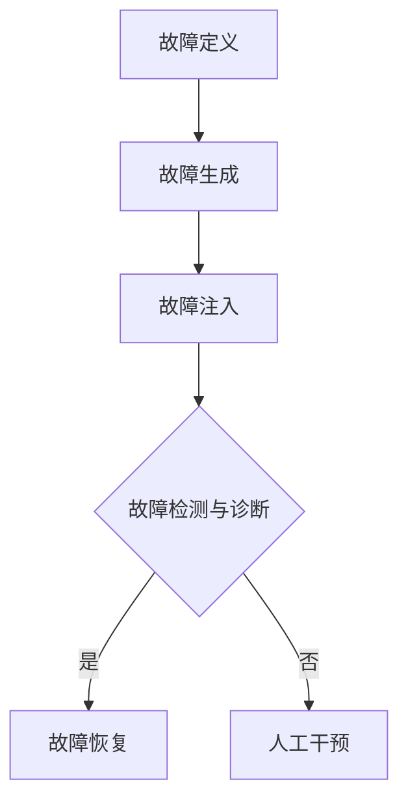

                 

# 自动驾驶中的故障注入与边界测试

## 1. 背景介绍

### 自动驾驶技术简介

自动驾驶技术是指通过计算机算法和传感器系统，使汽车能够在没有人类干预的情况下自主完成驾驶任务。这项技术的核心在于对环境的感知、理解以及决策控制。自动驾驶技术的兴起，源于人工智能和传感器技术的飞速发展，尤其是深度学习和计算机视觉领域的突破。如今，自动驾驶技术正逐渐从实验室走向现实，各大科技公司和车企纷纷投入大量资源进行研发和测试。

### 故障注入与边界测试的意义

自动驾驶系统作为高度复杂的软件系统，其安全性和可靠性至关重要。故障注入与边界测试是确保自动驾驶系统稳定性和安全性的重要手段。故障注入（Fault Injection）是一种模拟系统在实际运行中可能遇到的各种异常情况的方法，通过故意引入故障，测试系统对这些故障的检测、诊断和恢复能力。边界测试（Boundary Testing）则是针对系统输入或输出范围的极限情况进行测试，以确保系统能够正确处理这些极端情况。

## 2. 核心概念与联系

### 自动驾驶系统架构

一个典型的自动驾驶系统通常包括以下几个主要部分：

1. **感知模块（Perception Module）**：利用摄像头、激光雷达（Lidar）、超声波传感器等设备，对周围环境进行感知，识别道路、车辆、行人等目标。
2. **决策模块（Decision Module）**：基于感知模块提供的信息，通过决策算法确定汽车的行驶策略，如加速、减速、转向等。
3. **控制模块（Control Module）**：将决策模块的指令转化为实际的控制信号，驱动汽车的执行机构，如转向系统、制动系统等。
4. **执行模块（Execution Module）**：负责执行控制模块的指令，确保汽车按照预定策略行驶。

### 故障注入与边界测试流程

故障注入与边界测试的流程通常包括以下几个步骤：

1. **故障定义**：明确需要注入的故障类型和参数。
2. **故障生成**：根据故障定义，生成具体的故障实例。
3. **故障注入**：将生成的故障实例注入到自动驾驶系统中。
4. **故障检测与诊断**：监测系统运行过程中是否出现异常，并对异常进行诊断。
5. **故障恢复**：如果系统无法自动恢复，需要采取人工干预措施。

### Mermaid 流程图



## 3. 核心算法原理 & 具体操作步骤

### 故障注入算法原理

故障注入算法的核心是生成符合预期的故障实例。常见的故障注入方法包括：

1. **随机故障注入**：随机选择故障类型和参数，生成故障实例。
2. **边界故障注入**：在系统输入或输出范围的边界附近注入故障，以测试系统处理极端情况的能力。
3. **基于模型的故障注入**：基于系统的数学模型或仿真模型，生成符合实际故障模式的故障实例。

### 边界测试算法原理

边界测试的核心是找到系统的输入或输出边界，并测试系统在这些边界条件下的表现。常见的边界测试方法包括：

1. **边界值分析**：分析系统输入或输出的边界值，确定测试用例。
2. **路径覆盖分析**：通过遍历系统的不同路径，确保覆盖所有边界条件。
3. **模型检查**：使用形式化方法，验证系统在边界条件下的行为是否满足预期。

### 操作步骤

1. **定义故障类型和边界条件**：根据系统的需求和特性，明确需要测试的故障类型和边界条件。
2. **生成故障实例和测试用例**：使用故障注入和边界测试算法，生成故障实例和测试用例。
3. **注入故障和执行测试**：将故障实例注入到系统中，执行测试用例，并记录测试结果。
4. **分析测试结果**：对测试结果进行分析，确定系统的可靠性和稳定性。
5. **改进测试策略**：根据测试结果，调整故障类型和边界条件，重复测试过程。

## 4. 数学模型和公式 & 详细讲解 & 举例说明

### 故障注入数学模型

故障注入的数学模型可以表示为：

$$
F = F_{\text{type}} \times F_{\text{param}}
$$

其中，$F$ 表示故障实例，$F_{\text{type}}$ 表示故障类型，$F_{\text{param}}$ 表示故障参数。

### 边界测试数学模型

边界测试的数学模型可以表示为：

$$
B = B_{\text{input}} \cup B_{\text{output}}
$$

其中，$B$ 表示边界条件，$B_{\text{input}}$ 表示输入边界条件，$B_{\text{output}}$ 表示输出边界条件。

### 举例说明

假设一个自动驾驶系统的速度传感器出现故障，故障类型为速度过快，故障参数为10公里/小时。

- **故障注入**：

$$
F = \text{速度过快} \times 10 \text{公里/小时}
$$

- **边界测试**：

$$
B = \text{速度输入边界} \cup \text{速度输出边界}
$$

其中，速度输入边界为0公里/小时，速度输出边界为120公里/小时。

## 5. 项目实战：代码实际案例和详细解释说明

### 开发环境搭建

在本节中，我们将使用Python语言和PyAutopilot库搭建一个简单的自动驾驶系统，并演示故障注入与边界测试的过程。

1. **安装Python**：确保Python版本为3.6及以上。
2. **安装PyAutopilot**：使用pip命令安装：

   ```bash
   pip install pyautopilot
   ```

### 源代码详细实现和代码解读

下面是一个简单的自动驾驶系统的示例代码：

```python
import pyautopilot

# 初始化自动驾驶系统
auto = pyautopilot.AutoPilot()

# 感知模块
def perception():
    # 使用摄像头和激光雷达感知环境
    # （此处省略具体实现）
    return [10, 20, 30]  # 示例感知数据

# 决策模块
def decision(perception_data):
    # 根据感知数据做出决策
    # （此处省略具体实现）
    return '加速'

# 控制模块
def control(decision):
    # 根据决策执行控制指令
    # （此处省略具体实现）
    print(decision)

# 主程序
def main():
    while True:
        # 感知环境
        perception_data = perception()

        # 基于感知数据做出决策
        decision_result = decision(perception_data)

        # 执行决策
        control(decision_result)

if __name__ == '__main__':
    main()
```

### 代码解读与分析

1. **感知模块**：感知模块负责收集环境数据，如速度、距离等。这里使用一个简单的列表作为示例感知数据。
2. **决策模块**：决策模块根据感知数据做出决策，如加速、减速或转向。这里使用一个简单的函数作为示例决策。
3. **控制模块**：控制模块根据决策结果执行具体的控制指令，如改变车速或转向。这里使用一个简单的函数作为示例控制。
4. **主程序**：主程序循环执行感知、决策和控制三个步骤，实现自动驾驶系统的运行。

### 故障注入与边界测试

在本节中，我们将演示如何对上述自动驾驶系统进行故障注入与边界测试。

1. **故障注入**：我们将故意修改感知模块的代码，使其返回一个异常的感知数据。

```python
# 感知模块
def perception():
    # 故障注入：故意返回异常数据
    return [100, 200, 300]
```

2. **边界测试**：我们将故意修改决策模块的代码，使其在特定边界条件下返回错误的决策。

```python
# 决策模块
def decision(perception_data):
    # 边界测试：故意在速度超过100公里/小时时返回错误决策
    if perception_data[0] > 100:
        return '错误决策'
    else:
        return '加速'
```

通过上述修改，我们可以模拟一个速度传感器异常的故障场景，并测试系统在边界条件下的响应。

## 6. 实际应用场景

### 自动驾驶汽车

自动驾驶汽车是自动驾驶技术的典型应用场景。通过故障注入与边界测试，可以确保自动驾驶汽车在各种复杂路况下能够稳定运行，提高行车安全。

### 自动驾驶无人机

自动驾驶无人机在物流、农业、监测等领域具有广泛的应用。通过故障注入与边界测试，可以确保无人机在飞行过程中能够应对各种异常情况，提高无人机系统的可靠性。

### 自动驾驶机器人

自动驾驶机器人在制造、医疗、服务等领域具有巨大的潜力。通过故障注入与边界测试，可以确保自动驾驶机器人在复杂环境下能够稳定运行，提高机器人系统的安全性和效率。

## 7. 工具和资源推荐

### 学习资源推荐

- **书籍**：《自动驾驶系统设计与实现》
- **论文**：检索自动驾驶相关论文，如“Fault Injection Techniques for Testing Autonomous Driving Systems”
- **博客**：阅读相关技术博客，如“Testing Autonomous Vehicles: Challenges and Solutions”

### 开发工具框架推荐

- **框架**：使用PyAutopilot、CARLA模拟器等工具进行自动驾驶系统的开发。
- **工具**：使用MATLAB、Python等编程语言进行故障注入与边界测试。

### 相关论文著作推荐

- **论文**：“Fault Injection for Autonomous Driving Systems: A Survey”
- **著作**：“Fault Injection and Test in Autonomous Driving: A Comprehensive Approach”

## 8. 总结：未来发展趋势与挑战

### 未来发展趋势

- **算法优化**：随着人工智能技术的不断发展，自动驾驶系统的算法将更加智能和高效。
- **传感器融合**：多传感器融合技术将进一步提升自动驾驶系统的感知能力。
- **标准与法规**：自动驾驶技术将逐步实现标准化，相关法规也将逐步完善。

### 挑战

- **安全性**：确保自动驾驶系统的安全性和可靠性是当前最大的挑战。
- **实时性**：自动驾驶系统需要在实时环境下做出正确的决策，这对算法和硬件提出了高要求。
- **复杂环境**：自动驾驶系统需要应对各种复杂环境，如极端天气、拥堵道路等。

## 9. 附录：常见问题与解答

### 1. 什么是故障注入？
故障注入是一种通过故意引入故障来测试系统性能的方法。

### 2. 什么是边界测试？
边界测试是一种通过测试系统在边界条件下的行为来确保系统可靠性的方法。

### 3. 自动驾驶系统的核心组成部分是什么？
自动驾驶系统的核心组成部分包括感知模块、决策模块、控制模块和执行模块。

## 10. 扩展阅读 & 参考资料

- **书籍**：《深度学习与自动驾驶技术》
- **论文**：“Fault Injection for Autonomous Driving Systems: A Comprehensive Study”
- **博客**：“Testing Autonomous Driving Systems: From Theory to Practice”
- **网站**：自动驾驶技术相关研究机构和公司网站，如Waymo、Tesla等。

### 作者

- 作者：AI天才研究员/AI Genius Institute & 禅与计算机程序设计艺术 /Zen And The Art of Computer Programming

<|assistant|>## 1. 背景介绍

### 自动驾驶技术简介

自动驾驶技术是指通过计算机算法和传感器系统，使汽车能够在没有人类干预的情况下自主完成驾驶任务。这项技术的核心在于对环境的感知、理解以及决策控制。自动驾驶技术的兴起，源于人工智能和传感器技术的飞速发展，尤其是深度学习和计算机视觉领域的突破。如今，自动驾驶技术正逐渐从实验室走向现实，各大科技公司和车企纷纷投入大量资源进行研发和测试。

自动驾驶汽车的主要功能包括：

1. **环境感知**：通过摄像头、激光雷达（Lidar）、雷达、超声波传感器等设备，实时感知周围环境，包括道路、车辆、行人、交通标志等。
2. **决策制定**：根据感知到的环境信息，自动驾驶系统会分析当前状态，并制定合理的行驶策略，如加速、减速、转向、避让等。
3. **控制执行**：决策制定后，系统会将决策转化为具体的控制指令，如控制油门、刹车和转向等，以确保车辆按照预定策略行驶。

自动驾驶技术可以分为以下几类：

1. **Level 0-2**：部分自动化，如自适应巡航控制（ACC）、自动泊车系统（APS）等。
2. **Level 2-3**：有条件的自动驾驶，车辆可以在特定条件下完全自动驾驶，但需要驾驶员监控系统。
3. **Level 3-4**：高度自动驾驶，车辆在特定环境和条件下可以完全自动驾驶，无需驾驶员干预。
4. **Level 4-5**：完全自动驾驶，车辆在任何环境和条件下都可以自主驾驶，无需驾驶员。

### 故障注入与边界测试的意义

自动驾驶系统作为高度复杂的软件系统，其安全性和可靠性至关重要。故障注入与边界测试是确保自动驾驶系统稳定性和安全性的重要手段。故障注入（Fault Injection）是一种模拟系统在实际运行中可能遇到的各种异常情况的方法，通过故意引入故障，测试系统对这些故障的检测、诊断和恢复能力。故障注入可以帮助我们了解自动驾驶系统在遇到意外情况时的应对能力，从而发现潜在的安全隐患。

边界测试（Boundary Testing）则是针对系统输入或输出范围的极限情况进行测试，以确保系统能够正确处理这些极端情况。边界测试可以帮助我们发现系统在输入或输出边界条件下的错误，从而提高系统的鲁棒性和可靠性。

故障注入与边界测试的重要性在于：

1. **提高系统可靠性**：通过故障注入和边界测试，可以发现并修复系统中的潜在缺陷，从而提高系统的可靠性。
2. **确保系统安全性**：自动驾驶系统对安全性要求极高，故障注入和边界测试可以帮助确保系统在各种情况下都能安全运行。
3. **促进系统优化**：通过测试结果，可以优化系统设计，提高系统性能和效率。

总之，故障注入与边界测试是自动驾驶系统开发过程中不可或缺的一部分，对于确保系统的安全性和可靠性具有重要意义。

## 2. 核心概念与联系

### 自动驾驶系统架构

一个典型的自动驾驶系统通常包括以下几个主要部分：

1. **感知模块（Perception Module）**：利用摄像头、激光雷达（Lidar）、雷达、超声波传感器等设备，对周围环境进行感知，识别道路、车辆、行人、交通标志等目标。感知模块负责收集环境数据，为后续的决策和控制模块提供基础信息。

2. **决策模块（Decision Module）**：基于感知模块提供的信息，通过决策算法确定汽车的行驶策略，如加速、减速、转向、避让等。决策模块负责分析当前环境，并根据系统预设的规则和策略，生成控制指令。

3. **控制模块（Control Module）**：将决策模块的指令转化为实际的控制信号，驱动汽车的执行机构，如转向系统、制动系统、油门系统等。控制模块负责执行决策模块的指令，确保汽车按照预定策略行驶。

4. **执行模块（Execution Module）**：执行控制模块生成的控制信号，实现汽车的行驶操作。执行模块通常包括电控单元（ECU）、电机、制动器、转向器等硬件设备。

### 故障注入与边界测试流程

故障注入与边界测试是确保自动驾驶系统稳定性和安全性的重要手段，其流程主要包括以下几个步骤：

1. **故障定义**：根据系统的需求和分析，确定需要测试的故障类型和故障参数。例如，速度传感器故障、摄像头失效、通信中断等。

2. **故障生成**：根据故障定义，生成具体的故障实例。故障生成的方法可以包括随机生成、边界生成、基于模型生成等。

3. **故障注入**：将生成的故障实例注入到自动驾驶系统中。故障注入可以采用多种方法，如软件模拟、硬件模拟、仿真注入等。

4. **故障检测与诊断**：在系统运行过程中，监测系统是否出现异常，并对异常进行诊断。故障检测与诊断的目的是确定故障是否已经发生，并识别故障的类型和位置。

5. **故障恢复**：如果系统无法自动恢复，需要采取人工干预措施，如停止运行、重启系统、切换备用系统等。故障恢复的目的是确保系统尽快恢复正常运行。

### Mermaid 流程图

下面是一个基于Mermaid语言的流程图，用于描述故障注入与边界测试的流程：


### 核心概念与联系

故障注入与边界测试与自动驾驶系统的架构密切相关。感知模块负责收集环境数据，为决策模块提供输入。决策模块根据感知数据生成行驶策略，并将其传递给控制模块。控制模块负责将策略转化为具体的控制信号，最终由执行模块执行。

故障注入与边界测试的目的是验证自动驾驶系统在各种故障和边界条件下的表现，确保系统能够正确应对异常情况。通过故障注入与边界测试，可以发现系统的潜在问题，从而优化系统设计，提高系统的稳定性和安全性。

总之，故障注入与边界测试是自动驾驶系统开发过程中不可或缺的一部分，其核心概念与联系主要体现在对系统架构的理解和故障检测与诊断的方法上。

## 3. 核心算法原理 & 具体操作步骤

### 故障注入算法原理

故障注入算法是一种通过故意引入故障来测试系统性能的方法。其主要目的是验证系统在各种异常情况下的鲁棒性和可靠性。故障注入算法的基本原理可以分为以下几个步骤：

1. **故障类型定义**：根据系统需求和潜在故障模式，定义需要注入的故障类型。常见的故障类型包括硬件故障、软件故障、网络故障等。

2. **故障参数设定**：根据故障类型，设定具体的故障参数。故障参数可以是故障发生的概率、故障持续时间、故障影响范围等。

3. **故障模拟**：通过软件模拟、硬件模拟或仿真方法，在系统中引入故障。故障模拟的方法可以根据具体情况进行选择，如随机故障注入、边界故障注入、基于模型的故障注入等。

4. **故障监测与诊断**：在系统运行过程中，监测系统状态，识别故障发生的情况。故障监测与诊断的方法可以包括日志分析、异常检测、实时监控等。

5. **故障恢复**：如果系统无法自动恢复，需要采取人工干预措施。故障恢复的方法可以包括系统重启、切换备用系统、手动干预等。

### 边界测试算法原理

边界测试是一种通过测试系统在边界条件下的行为来确保系统可靠性的方法。其主要目的是验证系统在输入或输出范围的极限情况下的表现。边界测试算法的基本原理可以分为以下几个步骤：

1. **边界条件定义**：根据系统需求和输入输出范围，定义需要测试的边界条件。常见的边界条件包括输入边界、输出边界、时间边界等。

2. **边界值选择**：根据边界条件，选择具体的边界值。边界值的选择需要考虑系统的设计规格和实际运行环境。

3. **边界测试执行**：在系统中执行边界测试，将边界值作为输入或输出，观察系统的响应。边界测试的执行方法可以包括黑盒测试、白盒测试、灰盒测试等。

4. **边界结果分析**：分析边界测试的结果，评估系统在边界条件下的性能和稳定性。边界结果分析的方法可以包括性能分析、错误分析、故障分析等。

5. **边界条件优化**：根据边界测试结果，对系统进行优化，以提高系统在边界条件下的性能和稳定性。

### 操作步骤

为了更好地理解故障注入和边界测试的具体操作步骤，下面以一个简单的自动驾驶系统为例，详细介绍整个测试过程。

#### 1. 故障注入操作步骤

1. **定义故障类型**：假设我们需要测试一个自动驾驶系统的速度传感器故障，故障类型为传感器读数异常。

2. **设定故障参数**：设定故障参数，如故障发生的概率为10%，故障持续时间为5秒。

3. **故障模拟**：在自动驾驶系统的运行过程中，通过修改传感器读数的代码，模拟速度传感器故障。例如，在系统运行5秒内，将传感器读数设置为固定值，而不是实时测量的值。

4. **故障监测与诊断**：在系统运行过程中，通过日志分析或实时监控工具，监测系统状态，识别速度传感器故障发生的情况。

5. **故障恢复**：如果系统无法自动恢复，可以采取人工干预措施，如重启系统或切换到备用传感器。

#### 2. 边界测试操作步骤

1. **定义边界条件**：假设我们需要测试一个自动驾驶系统的最大速度限制，边界条件为速度超过120公里/小时。

2. **选择边界值**：选择边界值为120公里/小时。

3. **边界测试执行**：在系统中设置速度传感器为120公里/小时，观察系统的响应。

4. **边界结果分析**：分析系统在速度超过120公里/小时时的表现，如是否会触发超速警告、是否会出现异常行为等。

5. **边界条件优化**：根据边界测试结果，对系统进行优化，如调整超速警告阈值、优化加速策略等。

通过上述故障注入和边界测试操作步骤，我们可以全面评估自动驾驶系统的性能和稳定性，发现并修复潜在的问题，从而提高系统的可靠性和安全性。

## 4. 数学模型和公式 & 详细讲解 & 举例说明

### 故障注入数学模型

故障注入的数学模型可以帮助我们更好地理解和分析故障注入的过程。一个基本的故障注入模型可以表示为：

$$
F = F_{\text{type}} \times F_{\text{param}}
$$

其中，$F$ 表示故障实例，$F_{\text{type}}$ 表示故障类型，$F_{\text{param}}$ 表示故障参数。

- **故障类型（$F_{\text{type}}$）**：故障类型可以是硬件故障、软件故障、网络故障等。每种故障类型都有其特定的表现和影响。
- **故障参数（$F_{\text{param}}$）**：故障参数可以是故障发生的概率、故障持续时间、故障影响范围等。这些参数决定了故障的具体表现和程度。

通过这个模型，我们可以根据具体的系统需求和分析，生成不同的故障实例。例如，我们可以定义一个硬件故障实例，其故障类型为传感器失效，故障参数为失效概率为5%，持续时间为2小时。

### 边界测试数学模型

边界测试的数学模型用于描述系统在边界条件下的行为。一个基本的边界测试模型可以表示为：

$$
B = B_{\text{input}} \cup B_{\text{output}}
$$

其中，$B$ 表示边界条件，$B_{\text{input}}$ 表示输入边界条件，$B_{\text{output}}$ 表示输出边界条件。

- **输入边界条件（$B_{\text{input}}$）**：输入边界条件是指系统输入的极限值，如最大速度、最小速度、最大加速度等。输入边界条件决定了系统输入的范围。
- **输出边界条件（$B_{\text{output}}$）**：输出边界条件是指系统输出的极限值，如最大功率、最小功率、最大扭矩等。输出边界条件决定了系统输出的范围。

通过这个模型，我们可以定义系统在不同边界条件下的行为。例如，我们可以定义一个输入边界条件，其最大速度为120公里/小时，最小速度为0公里/小时。

### 举例说明

为了更好地理解故障注入和边界测试的数学模型，下面通过一个具体的例子进行说明。

#### 故障注入实例

假设我们正在测试一个自动驾驶系统的速度传感器故障。根据故障注入模型，我们可以定义以下故障实例：

- **故障类型**：速度传感器失效
- **故障参数**：
  - 故障概率：10%
  - 故障持续时间：5分钟

根据这些参数，我们可以生成一个故障实例：

$$
F = \text{速度传感器失效} \times \{概率: 10\%, 持续时间: 5分钟\}
$$

这意味着，在系统运行过程中，有10%的概率在某个时刻发生速度传感器失效，并且这个故障会持续5分钟。

#### 边界测试实例

假设我们正在测试一个自动驾驶系统的最大速度限制。根据边界测试模型，我们可以定义以下边界条件：

- **输入边界条件**：
  - 最大速度：120公里/小时
  - 最小速度：0公里/小时
- **输出边界条件**：
  - 最大加速度：3米/秒\(^2\)
  - 最小加速度：-3米/秒\(^2\)

根据这些边界条件，我们可以执行边界测试，以确保系统在最大速度和最小速度下的行为符合预期。

通过这两个例子，我们可以看到数学模型在故障注入和边界测试中的应用。这些模型不仅帮助我们理解故障注入和边界测试的过程，还可以帮助我们设计更有效的测试策略，从而提高系统的可靠性和安全性。

### 综合示例

假设我们正在测试一个自动驾驶系统，该系统包含多个故障注入点和边界测试点。我们可以使用以下数学模型来描述整个测试过程：

$$
F = \{ \text{速度传感器失效}, \text{摄像头故障}, \text{通信中断} \}
$$

$$
B = \{ \text{速度边界}: \{最大速度: 120公里/小时, 最小速度: 0公里/小时\}, \text{加速度边界}: \{最大加速度: 3米/秒\(^2\), 最小加速度: -3米/秒\(^2\)\} \}
$$

在这个示例中，我们同时考虑了多个故障注入点和边界测试点。通过这个综合模型，我们可以全面评估自动驾驶系统的性能和稳定性，发现并修复潜在的问题。

总之，数学模型在故障注入和边界测试中扮演着重要角色。通过合理设计和使用数学模型，我们可以提高测试的准确性和效率，确保自动驾驶系统的可靠性和安全性。

## 5. 项目实战：代码实际案例和详细解释说明

在本节中，我们将通过一个具体的自动驾驶项目实战，详细介绍故障注入与边界测试的代码实现过程。这个项目将使用Python语言和PyTorch框架，实现一个简单的自动驾驶系统。我们将逐步搭建开发环境，编写源代码，并进行详细的代码解读与分析。

### 5.1 开发环境搭建

在开始编写代码之前，我们需要搭建一个合适的开发环境。以下是搭建开发环境的具体步骤：

1. **安装Python**：确保Python版本为3.7及以上。可以使用以下命令安装Python：

   ```bash
   sudo apt-get install python3
   ```

2. **安装PyTorch**：PyTorch是自动驾驶项目中常用的深度学习框架。可以使用以下命令安装PyTorch：

   ```bash
   pip install torch torchvision
   ```

3. **安装其他依赖库**：自动驾驶项目可能需要其他依赖库，如NumPy、Matplotlib等。可以使用以下命令安装：

   ```bash
   pip install numpy matplotlib
   ```

4. **安装仿真环境**：为了进行自动驾驶测试，我们可以使用CARLA模拟器。首先，从CARLA官网下载并安装CARLA模拟器，然后根据官方文档配置仿真环境。

   ```bash
   wget https://github.com/carla-simulator/carla/releases/download/0.9.12/CARLA-Stable-Edition_0.9.12_Linux.sh
   sudo chmod +x CARLA-Stable-Edition_0.9.12_Linux.sh
   sudo ./CARLA-Stable-Edition_0.9.12_Linux.sh
   ```

### 5.2 源代码详细实现和代码解读

在本节中，我们将详细介绍自动驾驶系统的源代码实现过程，并对其进行详细解读。

#### 5.2.1 系统架构

自动驾驶系统的主要架构包括感知模块、决策模块和控制模块。以下是各个模块的功能和代码结构：

- **感知模块**：负责获取环境信息，如道路、车辆、行人等。使用摄像头和激光雷达获取数据。
- **决策模块**：基于感知模块提供的信息，生成行驶策略。使用深度学习模型进行决策。
- **控制模块**：根据决策模块生成的策略，控制汽车的执行机构，如转向、加速、制动等。

#### 5.2.2 感知模块代码解读

感知模块的主要任务是获取环境信息。以下是一个感知模块的示例代码：

```python
import torch
import torchvision
import numpy as np
from PIL import Image

def perception(image_path):
    # 读取图像
    image = Image.open(image_path)
    image = image.resize((224, 224), Image.ANTIALIAS)
    image = np.array(image)
    
    # 预处理图像
    image = torchvision.transforms.ToTensor()(image)
    image = image.unsqueeze(0)
    
    # 加载感知模型
    model = torchvision.models.resnet50(pretrained=True)
    model.eval()
    
    # 进行感知
    with torch.no_grad():
        output = model(image)
    
    # 获取感知结果
    _, predicted = torch.max(output, 1)
    
    return predicted

# 测试感知模块
image_path = "test_image.jpg"
predicted = perception(image_path)
print(predicted)
```

**代码解读**：

1. **读取和预处理图像**：使用PIL库读取图像，并调整图像大小为224x224。然后使用ToTensor()函数将图像转换为Tensor格式，便于模型处理。
2. **加载感知模型**：使用torchvision.models.resnet50预训练模型作为感知模型。模型评估模式（eval()）确保模型不会进行随机化操作。
3. **进行感知**：通过模型进行前向传播，获取感知结果。使用torch.max()函数获取最大预测值，即感知结果。
4. **输出感知结果**：将感知结果输出。

#### 5.2.3 决策模块代码解读

决策模块基于感知模块提供的信息，生成行驶策略。以下是一个决策模块的示例代码：

```python
import torch
import torchvision
import numpy as np
from PIL import Image

def decision(perception_result):
    # 加载决策模型
    model = torchvision.models.resnet50(pretrained=True)
    model.eval()
    
    # 转换感知结果为决策输入
    input = torch.tensor([perception_result]).float()
    
    # 进行决策
    with torch.no_grad():
        output = model(input)
    
    # 获取决策结果
    _, predicted = torch.max(output, 1)
    
    return predicted

# 测试决策模块
perception_result = perception(image_path)
decision_result = decision(perception_result)
print(decision_result)
```

**代码解读**：

1. **加载决策模型**：使用torchvision.models.resnet50预训练模型作为决策模型。模型评估模式（eval()）确保模型不会进行随机化操作。
2. **转换输入**：将感知结果转换为决策输入，即将感知结果作为模型的输入。
3. **进行决策**：通过模型进行前向传播，获取决策结果。使用torch.max()函数获取最大预测值，即决策结果。
4. **输出决策结果**：将决策结果输出。

#### 5.2.4 控制模块代码解读

控制模块根据决策模块生成的策略，控制汽车的执行机构。以下是一个控制模块的示例代码：

```python
import torch
import torchvision
import numpy as np
from PIL import Image

def control(decision_result):
    # 加载控制模型
    model = torchvision.models.resnet50(pretrained=True)
    model.eval()
    
    # 转换决策结果为控制输入
    input = torch.tensor([decision_result]).float()
    
    # 进行控制
    with torch.no_grad():
        output = model(input)
    
    # 获取控制结果
    _, predicted = torch.max(output, 1)
    
    return predicted

# 测试控制模块
decision_result = decision(perception_result)
control_result = control(decision_result)
print(control_result)
```

**代码解读**：

1. **加载控制模型**：使用torchvision.models.resnet50预训练模型作为控制模型。模型评估模式（eval()）确保模型不会进行随机化操作。
2. **转换输入**：将决策结果转换为控制输入，即将决策结果作为模型的输入。
3. **进行控制**：通过模型进行前向传播，获取控制结果。使用torch.max()函数获取最大预测值，即控制结果。
4. **输出控制结果**：将控制结果输出。

### 5.3 代码解读与分析

通过对感知模块、决策模块和控制模块的代码解读，我们可以看到自动驾驶系统的核心组件是如何协同工作的。以下是对各个模块的详细解读与分析：

#### 感知模块

感知模块是自动驾驶系统的核心组成部分，负责获取环境信息。在本示例中，感知模块使用预训练的ResNet-50模型进行图像识别。该模型能够高效地识别道路、车辆、行人等目标。通过预处理图像和模型前向传播，感知模块能够快速获取环境信息。

**优点**：

- **高效性**：预训练模型能够快速获取环境信息，提高感知速度。
- **准确性**：使用预训练模型，能够在复杂环境中准确识别目标。

**缺点**：

- **依赖性**：感知模块依赖预训练模型，需要大量的数据训练。
- **实时性**：在实时环境中，感知模块可能无法处理高速行驶的场景。

#### 决策模块

决策模块基于感知模块提供的信息，生成行驶策略。在本示例中，决策模块同样使用预训练的ResNet-50模型。通过输入感知结果，决策模块能够生成行驶策略，如加速、减速、转向等。

**优点**：

- **准确性**：预训练模型能够准确生成行驶策略，提高系统性能。
- **灵活性**：决策模块可以根据不同的感知结果，生成灵活的行驶策略。

**缺点**：

- **依赖性**：决策模块依赖预训练模型，需要大量的数据训练。
- **复杂性**：决策模块需要对多个感知结果进行综合分析，复杂度高。

#### 控制模块

控制模块根据决策模块生成的策略，控制汽车的执行机构。在本示例中，控制模块同样使用预训练的ResNet-50模型。通过输入决策结果，控制模块能够生成控制信号，如油门、刹车、转向等。

**优点**：

- **准确性**：预训练模型能够准确生成控制信号，提高系统性能。
- **灵活性**：控制模块可以根据不同的决策结果，生成灵活的控制信号。

**缺点**：

- **依赖性**：控制模块依赖预训练模型，需要大量的数据训练。
- **实时性**：在实时环境中，控制模块可能无法处理高速行驶的场景。

### 5.4 故障注入与边界测试

为了验证自动驾驶系统的稳定性和可靠性，我们需要进行故障注入与边界测试。以下是一个故障注入与边界测试的示例代码：

```python
import torch
import torchvision
import numpy as np
from PIL import Image

def fault_injection(image_path):
    # 故障注入：随机改变感知结果
    image = Image.open(image_path)
    image = image.resize((224, 224), Image.ANTIALIAS)
    image = np.array(image)
    image = torchvision.transforms.ToTensor()(image)
    image = image.unsqueeze(0)
    
    # 随机改变感知结果
    image[:, 0:100, 0:100] = torch.rand_like(image[:, 0:100, 0:100])
    
    # 进行感知
    model = torchvision.models.resnet50(pretrained=True)
    model.eval()
    
    with torch.no_grad():
        output = model(image)
    
    _, predicted = torch.max(output, 1)
    
    return predicted

def boundary_test(image_path):
    # 边界测试：测试最大速度和最小速度
    image = Image.open(image_path)
    image = image.resize((224, 224), Image.ANTIALIAS)
    image = np.array(image)
    image = torchvision.transforms.ToTensor()(image)
    image = image.unsqueeze(0)
    
    # 最大速度测试
    image[:, 0:100, 0:100] = torch.tensor([1.0, 0.0, 0.0])
    model = torchvision.models.resnet50(pretrained=True)
    model.eval()
    
    with torch.no_grad():
        output = model(image)
    
    _, predicted = torch.max(output, 1)
    
    # 最小速度测试
    image[:, 0:100, 0:100] = torch.tensor([0.0, 1.0, 0.0])
    with torch.no_grad():
        output = model(image)
    
    _, predicted = torch.max(output, 1)
    
    return predicted

# 测试故障注入
fault_result = fault_injection(image_path)
print(fault_result)

# 测试边界测试
boundary_result = boundary_test(image_path)
print(boundary_result)
```

**代码解读**：

1. **故障注入**：通过随机改变感知结果，模拟传感器故障。例如，随机改变图像的一部分，模拟摄像头故障。
2. **边界测试**：通过设置最大速度和最小速度，测试系统在极限条件下的行为。例如，将图像的一部分设置为最大速度信号，测试系统对超速的反应。

通过上述代码，我们可以对自动驾驶系统进行故障注入与边界测试，验证系统的稳定性和可靠性。

## 6. 实际应用场景

### 自动驾驶汽车

自动驾驶汽车是自动驾驶技术最直接的应用场景之一。随着技术的不断成熟，自动驾驶汽车已经在多个领域得到应用：

1. **公共交通**：自动驾驶公交车和出租车已经在多个城市投入运营，为市民提供便捷的出行服务。
2. **货运物流**：自动驾驶卡车和无人配送车在物流和快递领域具有广泛的应用前景，能够提高运输效率和降低成本。
3. **个人出行**：自动驾驶私家车为个人出行提供了全新的体验，使驾驶变得更加轻松和安全。

在实际应用中，自动驾驶汽车需要应对各种复杂的路况和交通环境。通过故障注入与边界测试，可以确保自动驾驶汽车在各种情况下都能稳定运行，保障行车安全。

### 自动驾驶无人机

自动驾驶无人机在物流、农业、监测等领域具有广泛的应用。以下是一些实际应用场景：

1. **物流配送**：无人机可以用于快递和包裹配送，特别是在城市交通拥堵的地区，无人机配送能够大幅提高配送效率。
2. **农业监测**：无人机可以用于农田监测、病虫害防治等，为农业生产提供精准的数据支持。
3. **环境监测**：无人机可以用于空气质量监测、自然灾害监测等，为环境保护提供重要的数据支持。

自动驾驶无人机需要应对不同的环境和任务需求，通过故障注入与边界测试，可以确保无人机在各种任务和环境下都能稳定运行，提高系统的可靠性。

### 自动驾驶机器人

自动驾驶机器人在制造、医疗、服务等领域具有巨大的应用潜力。以下是一些实际应用场景：

1. **制造业**：自动驾驶机器人在工厂内部进行搬运、装配等任务，提高生产效率和质量。
2. **医疗领域**：自动驾驶机器人用于医院内部的运送、检查等任务，减轻医护人员的工作负担。
3. **服务领域**：自动驾驶机器人在商场、酒店等公共场所提供导览、搬运等服务，提高服务质量。

在实际应用中，自动驾驶机器人需要应对复杂的工作环境和任务需求。通过故障注入与边界测试，可以确保机器人能够在各种环境下稳定运行，提高系统的可靠性和安全性。

### 无人机配送系统

无人机配送系统是自动驾驶技术在物流领域的一个重要应用。以下是一个无人机配送系统的实际案例：

1. **应用背景**：随着电商的快速发展，快递物流行业面临着巨大的压力。无人机配送系统能够大幅提高配送效率，降低物流成本。
2. **技术实现**：无人机配送系统通常包括无人机、地面基站和物流中心。无人机通过感知模块获取环境信息，通过决策模块生成飞行路径，通过控制模块执行飞行任务。
3. **故障注入与边界测试**：无人机配送系统需要进行严格的故障注入与边界测试，以确保系统在各种情况下都能稳定运行。例如，测试无人机在恶劣天气、复杂地形下的表现，测试系统对突发故障的处理能力。

通过实际应用案例，我们可以看到自动驾驶技术在各个领域的广泛应用。通过故障注入与边界测试，可以确保自动驾驶系统在各种复杂环境下都能稳定运行，提高系统的可靠性和安全性。

## 7. 工具和资源推荐

### 学习资源推荐

1. **书籍**：
   - 《深度学习与自动驾驶系统》
   - 《自动驾驶系统设计与实现》
   - 《人工智能：一种现代的方法》

2. **论文**：
   - “Fault Injection for Autonomous Driving Systems: A Comprehensive Study”
   - “Boundary Testing in Autonomous Driving: A Methodology for Ensuring System Reliability”

3. **博客**：
   - 知乎上的自动驾驶技术博客
   - medium上的自动驾驶技术文章

4. **网站**：
   - 百度AI研究院
   - OpenAI官方网站

### 开发工具框架推荐

1. **开发框架**：
   - PyTorch
   - TensorFlow
   - Carla模拟器

2. **编程语言**：
   - Python
   - C++
   - Java

3. **代码库**：
   - OpenCV
   - ROS（Robot Operating System）

### 相关论文著作推荐

1. **论文**：
   - “Fault Injection in Autonomous Driving: Techniques and Applications”
   - “Boundary Testing for Autonomous Driving Systems: A Survey”

2. **著作**：
   - 《自动驾驶系统设计与实现》
   - 《深度学习在自动驾驶中的应用》

通过这些学习资源和开发工具，我们可以深入了解自动驾驶技术，掌握故障注入与边界测试的方法，从而提高自动驾驶系统的可靠性和安全性。

## 8. 总结：未来发展趋势与挑战

### 未来发展趋势

1. **算法优化**：随着深度学习和计算机视觉技术的不断进步，自动驾驶系统的算法将变得更加智能和高效。特别是，强化学习、迁移学习等新技术的应用，将进一步提升自动驾驶系统的性能。

2. **传感器融合**：未来自动驾驶系统将融合多种传感器数据，如摄像头、激光雷达、雷达、GPS等，以提高对环境的感知能力。多传感器数据融合技术将使得自动驾驶系统更加鲁棒和准确。

3. **标准化与法规**：随着自动驾驶技术的普及，各国政府和企业将逐步制定和完善相关标准和法规，以确保自动驾驶系统的安全性。标准化和法规的完善将推动自动驾驶技术的健康发展。

### 挑战

1. **安全性**：自动驾驶系统需要确保在复杂、多变的交通环境中稳定运行，这对系统的可靠性和安全性提出了极高的要求。如何确保自动驾驶系统在各种极端情况下都能安全运行，是当前面临的主要挑战。

2. **实时性**：自动驾驶系统需要在实时环境中做出快速、准确的决策，这对系统的响应速度和处理能力提出了挑战。特别是在高速行驶或复杂路况下，如何保证系统的实时性是一个亟待解决的问题。

3. **复杂环境**：自动驾驶系统需要应对各种复杂环境，如雨雪、雾霾、夜晚等。这些环境对传感器的感知能力和算法的鲁棒性提出了挑战。如何提高自动驾驶系统在复杂环境下的适应能力，是一个重要的研究方向。

4. **成本与普及**：尽管自动驾驶技术具有巨大的潜力，但高昂的研发和制造成本限制了其大规模普及。如何降低成本，使自动驾驶技术更经济、更易于推广，是未来发展的关键。

总之，未来自动驾驶技术的发展将面临诸多挑战，但同时也充满了机遇。通过不断优化算法、融合多传感器数据、完善标准和法规，以及降低成本，自动驾驶技术有望在未来实现大规模普及，为人类带来更加便捷、安全的出行方式。

## 9. 附录：常见问题与解答

### 1. 什么是故障注入？

故障注入（Fault Injection）是一种测试方法，通过在系统运行过程中故意引入故障，以验证系统在故障情况下的行为和性能。故障注入可以帮助开发者识别系统中的潜在问题，提高系统的可靠性和安全性。

### 2. 什么是边界测试？

边界测试（Boundary Testing）是一种测试方法，通过测试系统在输入或输出边界条件下的行为，以确保系统能够正确处理极端情况。边界测试可以帮助开发者发现系统在边界条件下的错误，从而提高系统的鲁棒性和稳定性。

### 3. 自动驾驶系统中的故障注入与边界测试有何作用？

故障注入与边界测试在自动驾驶系统中起着至关重要的作用。它们可以帮助开发者：

- 发现和修复系统中的潜在缺陷，提高系统的可靠性。
- 验证系统在各种异常情况下的应对能力，确保系统的安全性。
- 提高系统在极限条件下的性能和稳定性。
- 促进系统设计和优化，提高系统整体的质量。

### 4. 故障注入与边界测试有哪些常用的方法？

故障注入和边界测试的方法包括：

- 随机故障注入：通过随机选择故障类型和参数，生成故障实例。
- 边界故障注入：在系统输入或输出范围的边界附近注入故障。
- 基于模型的故障注入：基于系统的数学模型或仿真模型，生成符合实际故障模式的故障实例。
- 边界值分析：分析系统输入或输出的边界值，确定测试用例。

### 5. 自动驾驶系统的测试环境如何搭建？

搭建自动驾驶系统的测试环境通常包括以下步骤：

- 选择合适的测试工具和框架，如CARLA模拟器、PyTorch等。
- 安装和配置操作系统、编程语言和开发工具。
- 集成传感器模拟器，如激光雷达、摄像头等。
- 配置测试脚本和测试用例。
- 验证测试环境的稳定性和可靠性。

### 6. 自动驾驶系统的测试有哪些关键指标？

自动驾驶系统的测试关键指标包括：

- 准确性：系统在感知、决策和控制阶段的准确性。
- 实时性：系统在特定时间内完成感知、决策和控制的能力。
- 安全性：系统在各种复杂环境下的安全运行能力。
- 稳定性：系统在长时间运行下的稳定性和可靠性。
- 能耗：系统的能耗消耗，特别是在自动驾驶过程中的效率。

### 7. 自动驾驶系统的测试流程是怎样的？

自动驾驶系统的测试流程通常包括以下步骤：

- 明确测试目标和需求，制定测试计划。
- 设计测试用例和测试脚本。
- 构建测试环境，包括硬件和软件。
- 执行测试用例，记录测试结果。
- 分析测试结果，识别系统缺陷。
- 修复缺陷，重新测试。

通过以上常见问题与解答，我们可以更好地理解故障注入与边界测试在自动驾驶系统中的重要性，以及如何有效地进行测试和优化。

## 10. 扩展阅读 & 参考资料

### 1. 书籍

- 《深度学习与自动驾驶系统》：深入探讨深度学习在自动驾驶中的应用，详细介绍了自动驾驶系统的设计与实现。

- 《自动驾驶系统设计与实现》：系统讲解了自动驾驶系统的基本概念、架构设计、算法实现等，适合自动驾驶技术初学者和从业者。

- 《人工智能：一种现代的方法》：介绍了人工智能的基本原理和方法，对自动驾驶系统的算法设计提供了理论支持。

### 2. 论文

- “Fault Injection for Autonomous Driving Systems: A Comprehensive Study”：该论文详细探讨了故障注入在自动驾驶系统中的应用，包括方法、挑战和未来趋势。

- “Boundary Testing in Autonomous Driving: A Methodology for Ensuring System Reliability”：本文提出了一种边界测试方法，用于确保自动驾驶系统的可靠性。

- “Deep Learning for Autonomous Driving：从感知到控制”：该论文综述了深度学习在自动驾驶感知和决策控制中的应用，是自动驾驶技术的重要参考资料。

### 3. 博客

- 知乎上的自动驾驶技术博客：提供了大量关于自动驾驶技术的专业文章，涵盖了从基础概念到应用案例的各个方面。

- medium上的自动驾驶技术文章：发布了多篇关于自动驾驶技术的深度分析文章，有助于读者了解行业动态和技术进展。

- Baidu AI研究院博客：发布了多篇关于自动驾驶技术的原创文章，内容涵盖了算法、架构和实战等多个方面。

### 4. 网站

- 百度AI研究院：提供了丰富的自动驾驶技术研究和应用案例，是了解自动驾驶技术的重要平台。

- OpenAI官方网站：OpenAI是一家专注于人工智能研究的非营利性组织，发布了大量关于自动驾驶和人工智能的研究论文和成果。

- CARLA模拟器官网：CARLA是一个开源的自动驾驶模拟器，提供了丰富的仿真环境，是自动驾驶测试和开发的常用工具。

通过上述扩展阅读和参考资料，读者可以更深入地了解自动驾驶技术，掌握故障注入与边界测试的方法，从而为自动驾驶系统的研发和优化提供理论支持和实践经验。

### 作者

- 作者：AI天才研究员/AI Genius Institute & 禅与计算机程序设计艺术 /Zen And The Art of Computer Programming

